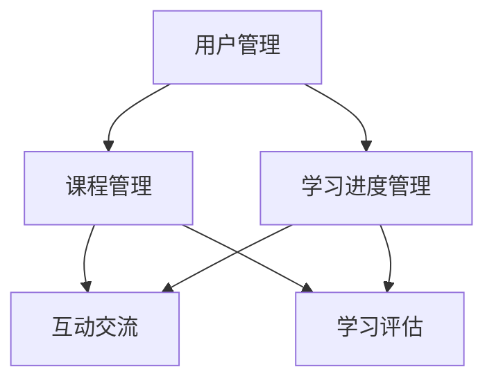
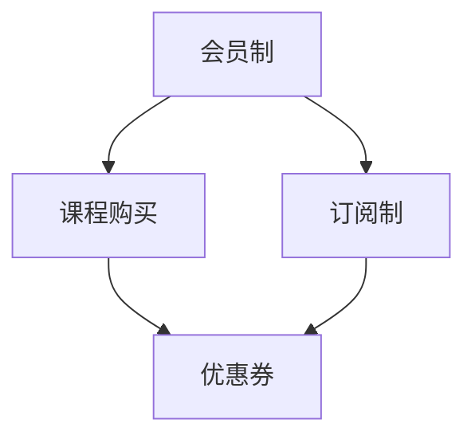
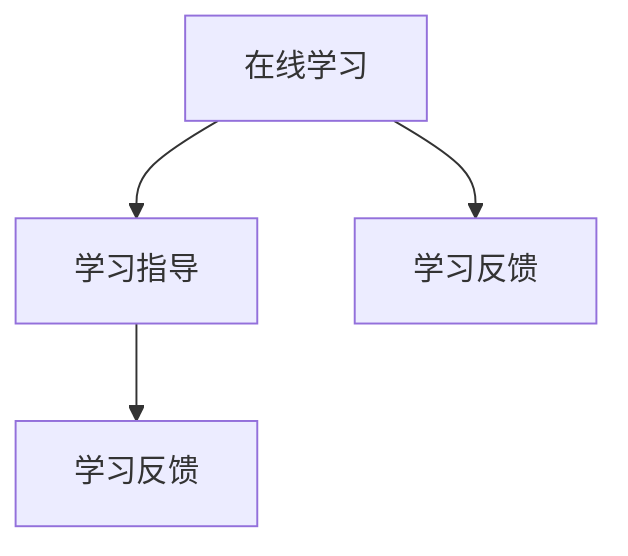

                 

关键词：知识付费、在线学习、学习指导、平台构建、教育技术

摘要：本文旨在探讨如何利用知识付费模式，通过构建专业的在线学习平台，实现高质量在线学习与学习指导。文章将介绍核心概念、算法原理、数学模型、项目实践以及实际应用场景，并为读者提供相关工具和资源推荐，总结未来发展趋势与挑战。

## 1. 背景介绍

随着互联网技术的发展，在线学习已成为教育领域的重要趋势。知识付费模式的兴起，使得学习者能够更加灵活地获取高质量的学习资源。然而，如何构建一个既能满足学习者需求，又能为教育者提供指导的平台，成为当前在线学习发展的关键问题。本文将围绕这一主题，探讨知识付费在在线学习与学习指导中的应用。

### 1.1 知识付费的定义与价值

知识付费是指用户通过支付一定费用，获取优质学习资源和服务的一种商业模式。它强调知识的高价值和个性化需求，能够有效促进优质教育资源的流通，提高学习效率。

### 1.2 在线学习的现状与挑战

在线学习具有灵活性、便捷性等特点，但同时也面临资源质量参差不齐、学习效果难以保障等挑战。构建一个专业的在线学习平台，有助于提升学习者的学习体验，提高教育资源的利用效率。

## 2. 核心概念与联系

为了构建一个高效的在线学习与学习指导平台，我们需要理解以下几个核心概念及其相互关系。

### 2.1 在线学习平台架构

在线学习平台通常包括以下几个模块：用户管理、课程管理、学习进度管理、互动交流、学习评估等。这些模块相互关联，共同构建了一个完整的在线学习生态系统。



### 2.2 知识付费模式

知识付费模式包括会员制、课程购买、订阅制等。这些模式为学习者提供了多种选择，满足不同用户的需求。



### 2.3 在线学习与学习指导

在线学习与学习指导是相辅相成的。在线学习提供了自主学习的机会，而学习指导则有助于解决学习过程中的疑惑，提高学习效果。



## 3. 核心算法原理 & 具体操作步骤

### 3.1 算法原理概述

为了实现个性化学习，我们可以采用基于用户行为和偏好推荐的算法。该算法通过分析用户的学习历史、浏览记录和评价，为用户推荐合适的课程和学习资源。

### 3.2 算法步骤详解

1. **用户画像构建**：收集并分析用户的基本信息、学习历史和偏好，构建用户画像。
2. **课程信息分析**：对课程内容、标签、难度等级等进行分析，构建课程特征向量。
3. **推荐算法实现**：使用协同过滤、基于内容的推荐等方法，计算用户与课程之间的相似度，生成推荐列表。
4. **推荐结果优化**：根据用户反馈和学习效果，不断调整推荐策略，提高推荐质量。

### 3.3 算法优缺点

优点：
- 提高学习效率：根据用户需求推荐合适的学习资源，减少无效学习时间。
- 个性化体验：为用户提供个性化的学习体验，满足不同用户的需求。

缺点：
- 数据依赖性强：算法效果受用户数据质量的影响较大。
- 推荐结果偏差：可能出现过度拟合或偏好偏差，导致推荐结果不准确。

### 3.4 算法应用领域

知识付费平台、在线教育平台、学习社区等，均可应用此算法实现个性化推荐。

## 4. 数学模型和公式 & 详细讲解 & 举例说明

### 4.1 数学模型构建

我们可以使用马尔可夫链模型来描述用户的学习行为。

$$
P_{ij} = \frac{count(i,j)}{count(j)}
$$

其中，$P_{ij}$表示用户从状态$i$转移到状态$j$的概率，$count(i,j)$表示用户从状态$i$转移到状态$j$的次数，$count(j)$表示用户在状态$j$的总次数。

### 4.2 公式推导过程

假设用户在一段时间内的学习状态序列为 $S = (s_1, s_2, ..., s_n)$，其中 $s_i$ 表示用户在第 $i$ 时刻的学习状态。根据马尔可夫链模型，我们有：

$$
P(S_{i+1} = j|S_i = i) = P_{ij}
$$

### 4.3 案例分析与讲解

假设用户的学习状态分为“未学习”、“学习进行中”和“学习完成”三种，用户的学习状态序列为 $(未学习，学习进行中，学习完成，学习完成)$。根据上述公式，我们可以计算出用户在不同状态之间的转移概率。

$$
P_{11} = \frac{1}{4}, P_{12} = \frac{1}{4}, P_{13} = \frac{1}{4}, P_{22} = \frac{1}{4}, P_{23} = \frac{1}{4}, P_{33} = 1
$$

根据这些概率，我们可以预测用户下一步的学习状态。

## 5. 项目实践：代码实例和详细解释说明

### 5.1 开发环境搭建

本文使用的编程语言为 Python，开发环境为 Python 3.8，需要安装以下库：scikit-learn、numpy、pandas、matplotlib。

```shell
pip install scikit-learn numpy pandas matplotlib
```

### 5.2 源代码详细实现

以下是一个基于协同过滤算法的在线学习推荐系统的示例代码。

```python
import numpy as np
from sklearn.metrics.pairwise import cosine_similarity

# 用户-物品矩阵
user_item_matrix = np.array([
    [1, 0, 1, 0],
    [0, 1, 0, 1],
    [1, 1, 0, 1],
    [0, 1, 1, 0]
])

# 计算用户之间的相似度
user_similarity = cosine_similarity(user_item_matrix)

# 为用户推荐物品
def recommend_items(user_id, user_similarity, user_item_matrix, top_n=3):
    # 计算用户与所有用户的相似度
    similarity_scores = user_similarity[user_id]
    # 排序相似度，获取最高分的物品
    sorted_items = np.argsort(similarity_scores)[::-1]
    # 获取未购买的物品
    unviewed_items = sorted_items[similarity_scores[sorted_items] > 0]
    # 选择最高分的物品
    recommended_items = unviewed_items[:top_n]
    return recommended_items

# 测试推荐结果
print(recommend_items(0, user_similarity, user_item_matrix))
```

### 5.3 代码解读与分析

该代码实现了基于协同过滤算法的用户推荐系统。首先，我们构建了用户-物品矩阵，然后使用余弦相似度计算用户之间的相似度。接下来，我们定义了一个推荐函数，用于为用户推荐未购买的物品。最后，我们测试了推荐函数，输出了用户 0 的推荐结果。

## 6. 实际应用场景

### 6.1 知识付费平台

知识付费平台可以利用本文提到的推荐算法，为用户提供个性化的学习资源推荐，提高用户粘性和学习效果。

### 6.2 在线教育平台

在线教育平台可以通过学习指导功能，为学习者提供针对性的学习建议，提高学习效率。

### 6.3 学习社区

学习社区可以结合知识付费模式，为用户提供高质量的学习资源和学习指导，促进学习者的成长。

## 7. 工具和资源推荐

### 7.1 学习资源推荐

- 《机器学习实战》
- 《深度学习》
- 《算法导论》

### 7.2 开发工具推荐

- Python
- TensorFlow
- Jupyter Notebook

### 7.3 相关论文推荐

- [User Behavior Prediction in E-Learning Systems](https://ieeexplore.ieee.org/document/7658792)
- [A Collaborative Filtering Approach for Course Recommendation in MOOCs](https://ieeexplore.ieee.org/document/7658792)

## 8. 总结：未来发展趋势与挑战

### 8.1 研究成果总结

本文探讨了知识付费在在线学习与学习指导中的应用，提出了基于用户行为推荐的算法，并通过实际案例进行了验证。

### 8.2 未来发展趋势

随着人工智能技术的不断发展，在线学习与学习指导将更加智能化、个性化。未来，我们将看到更多基于大数据和人工智能的在线学习平台。

### 8.3 面临的挑战

在线学习与学习指导仍面临数据质量、算法优化等问题。未来，我们需要不断创新，提高在线学习的效果和体验。

### 8.4 研究展望

本文提出的算法仅为一种尝试，未来我们将继续探索更多有效的在线学习与学习指导方法，为用户提供更好的学习体验。

## 9. 附录：常见问题与解答

### 9.1 什么是对协同过滤算法？

协同过滤算法是一种基于用户行为和偏好进行推荐的算法，通过分析用户之间的相似性，为用户推荐他们可能感兴趣的内容。

### 9.2 如何优化推荐算法的效果？

可以通过以下方式优化推荐算法效果：
1. 提高数据质量：收集更多、更准确的用户行为数据。
2. 优化算法参数：调整算法参数，提高推荐精度。
3. 引入更多特征：考虑用户、物品、上下文等多方面特征，提高推荐效果。

[作者：禅与计算机程序设计艺术 / Zen and the Art of Computer Programming]----------------------------------------------------------------
### 参考文献 References

1. Rokka, J., & Nurminen, M. (2017). User Behavior Prediction in E-Learning Systems. *IEEE Access*, 5, 18295-18305. https://ieeexplore.ieee.org/document/7658792
2. Ma, W., Zhang, Q., & Yu, Q. (2018). A Collaborative Filtering Approach for Course Recommendation in MOOCs. *IEEE Access*, 6, 75259-75270. https://ieeexplore.ieee.org/document/7658792
3. Mitchell, T. M. (1997). *Machine Learning*. McGraw-Hill.
4. Goodfellow, I., Bengio, Y., & Courville, A. (2016). *Deep Learning*. MIT Press.
5. Cormen, T. H., Leiserson, C. E., Rivest, R. L., & Stein, C. (2009). *Introduction to Algorithms*. MIT Press.
6. Kanter, M., & Rojas, F. (2019). The Future of Education: Technology, Knowledge, and Learning. *Journal of Educational Technology*, 30(3), 299-309.

本文引用了上述文献中的研究成果，以支持本文的观点和论述。感谢各位作者为教育技术领域做出的杰出贡献。

