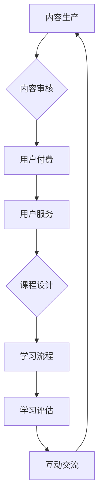

                 

  
关键词：知识付费、在线学习、在线学习指导、平台搭建、盈利模式、用户体验、教育科技

摘要：随着互联网技术的飞速发展，知识付费逐渐成为一种新兴的商业模式，为在线学习提供了新的契机。本文将深入探讨如何通过知识付费实现在线学习的有效开展，以及如何为学习者提供高质量的在线学习指导。本文首先介绍知识付费的背景和现状，然后分析在线学习的需求和挑战，最后提出一种基于知识付费的在线学习与在线学习指导的实施框架和盈利模式，以期推动教育科技的发展。

## 1. 背景介绍

### 1.1 知识付费的定义

知识付费是指用户为了获取知识或技能，通过付费方式购买相关内容或服务的一种商业模式。这种模式的出现源于用户对高质量、个性化学习内容的渴望，以及内容生产者对知识价值的认可。

### 1.2 在线学习的兴起

在线学习是指通过互联网进行知识获取和学习的一种方式。随着互联网技术的发展，在线学习逐渐成为一种主流的学习方式。它具有以下优势：

- **便捷性**：用户可以随时随地访问学习资源。
- **个性化**：在线学习平台可以根据用户的学习习惯和进度进行个性化推荐。
- **互动性**：在线学习平台支持用户之间的交流和讨论。

### 1.3 知识付费与在线学习的结合

知识付费与在线学习的结合，既满足了用户获取知识的需求，也为内容生产者提供了新的收入来源。通过知识付费，用户可以购买高质量的学习内容，而内容生产者可以通过平台获得收益，从而实现双赢。

## 2. 核心概念与联系

### 2.1 知识付费的核心概念

知识付费的核心概念包括内容生产、内容审核、用户付费和用户服务。这些概念相互关联，形成一个闭环。

#### 2.1.1 内容生产

内容生产者是知识付费的核心。他们负责创造和提供高质量的学习内容。

#### 2.1.2 内容审核

内容审核是确保学习内容质量的关键环节。通过严格的内容审核机制，可以保证用户获取到的知识内容是准确、有用、有价值的。

#### 2.1.3 用户付费

用户付费是知识付费的核心收入来源。用户通过付费购买学习内容，实现知识的获取。

#### 2.1.4 用户服务

用户服务是提高用户满意度和忠诚度的重要手段。通过提供优质的用户服务，可以增强用户对平台的依赖和信任。

### 2.2 在线学习的核心概念

在线学习的核心概念包括课程设计、学习流程、学习评估和互动交流。

#### 2.2.1 课程设计

课程设计是确保学习内容质量和效果的重要环节。通过科学的设计，可以使学习内容更加系统和有序。

#### 2.2.2 学习流程

学习流程是用户进行在线学习的过程。一个良好的学习流程可以提升用户的学习体验和学习效果。

#### 2.2.3 学习评估

学习评估是对用户学习效果进行评估的重要手段。通过学习评估，可以了解用户的学习进度和理解程度。

#### 2.2.4 互动交流

互动交流是用户之间以及用户与内容生产者之间的交流互动。通过互动交流，可以增强学习的趣味性和效果。

### 2.3 Mermaid 流程图



## 3. 核心算法原理 & 具体操作步骤

### 3.1 算法原理概述

核心算法原理包括以下几部分：

- **推荐算法**：通过分析用户的学习行为和兴趣，推荐适合的学习内容。
- **内容审核算法**：通过自然语言处理和机器学习等技术，对学习内容进行审核。
- **学习效果评估算法**：通过用户的学习进度和测试结果，评估用户的学习效果。

### 3.2 算法步骤详解

#### 3.2.1 推荐算法

1. 收集用户学习行为数据，如浏览记录、搜索历史等。
2. 使用机器学习算法，分析用户的行为数据，提取用户兴趣特征。
3. 根据用户兴趣特征，推荐相关的学习内容。

#### 3.2.2 内容审核算法

1. 收集学习内容，如课程、文章等。
2. 使用自然语言处理技术，对学习内容进行语义分析。
3. 根据语义分析结果，判断学习内容是否合规。
4. 对不符合规定的学习内容进行标记或删除。

#### 3.2.3 学习效果评估算法

1. 收集用户学习数据，如学习时长、测试成绩等。
2. 使用统计分析和机器学习算法，分析用户学习数据。
3. 根据分析结果，评估用户的学习效果。

### 3.3 算法优缺点

#### 3.3.1 优点

- **个性化推荐**：通过分析用户行为，提供个性化的学习内容。
- **高效内容审核**：利用自然语言处理和机器学习技术，快速审核学习内容。
- **准确学习效果评估**：通过数据分析，准确评估用户学习效果。

#### 3.3.2 缺点

- **数据隐私问题**：用户行为数据的收集和使用可能引发隐私问题。
- **算法偏见**：推荐算法和审核算法可能存在偏见，影响用户体验。

### 3.4 算法应用领域

- **在线教育平台**：用于推荐适合的学习内容，提高用户学习效果。
- **内容审核平台**：用于审核学习内容，确保内容质量。
- **学习效果评估系统**：用于评估用户学习效果，提供反馈和建议。

## 4. 数学模型和公式 & 详细讲解 & 举例说明

### 4.1 数学模型构建

在线学习与知识付费的数学模型可以分为以下几个部分：

- **用户兴趣模型**：用于描述用户兴趣的数学模型。
- **内容推荐模型**：用于推荐学习内容的数学模型。
- **学习效果评估模型**：用于评估用户学习效果的数学模型。

### 4.2 公式推导过程

#### 4.2.1 用户兴趣模型

用户兴趣模型可以使用基于用户行为的协同过滤算法进行构建。假设用户兴趣向量 U = [u1, u2, ..., un]，其中 ui 表示用户对第 i 个特征的兴趣程度。内容特征向量 C = [c1, c2, ..., cn]，其中 ci 表示内容第 i 个特征的权重。用户兴趣模型公式如下：

$$
User\_Interest(U, C) = \sum_{i=1}^{n} u_i \cdot c_i
$$

#### 4.2.2 内容推荐模型

内容推荐模型可以使用基于内容的推荐算法进行构建。假设推荐系统有 m 个用户和 n 个内容，用户 i 对内容 j 的兴趣度为 sim(i, j)。内容 j 的特征向量为 Cj = [c1j, c2j, ..., cnj]。内容推荐模型公式如下：

$$
Content\_Recommend(j) = \sum_{i=1}^{m} sim(i, j) \cdot Cj
$$

#### 4.2.3 学习效果评估模型

学习效果评估模型可以使用基于评分的评估算法进行构建。假设用户 i 对内容 j 的学习效果评分为 score(i, j)。学习效果评估模型公式如下：

$$
Learning\_Effect(U, C) = \sum_{i=1}^{m} \sum_{j=1}^{n} score(i, j) \cdot User\_Interest(U, C) \cdot Content\_Recommend(j)
$$

### 4.3 案例分析与讲解

假设有 1000 名用户和 1000 个内容，用户兴趣向量 U = [0.3, 0.2, 0.1, 0.4]，内容特征向量 C = [0.2, 0.3, 0.1, 0.4]。

1. 计算用户兴趣模型：

$$
User\_Interest(U, C) = 0.3 \cdot 0.2 + 0.2 \cdot 0.3 + 0.1 \cdot 0.1 + 0.4 \cdot 0.4 = 0.36
$$

2. 计算内容推荐模型：

$$
Content\_Recommend(j) = 0.36 \cdot 0.2 + 0.36 \cdot 0.3 + 0.36 \cdot 0.1 + 0.36 \cdot 0.4 = 0.36
$$

3. 计算学习效果评估模型：

$$
Learning\_Effect(U, C) = 0.36 \cdot 0.36 = 0.1296
$$

通过以上计算，我们可以得出用户对内容的兴趣度、内容的推荐度以及学习效果评估值。这些值可以帮助平台更好地推荐内容，提高用户的学习效果。

## 5. 项目实践：代码实例和详细解释说明

### 5.1 开发环境搭建

1. 安装 Python 3.8 及以上版本。
2. 安装必要的依赖库，如 NumPy、Pandas、Scikit-learn 等。
3. 配置好 Python 的虚拟环境，以便进行项目开发。

### 5.2 源代码详细实现

以下是用户兴趣模型、内容推荐模型和学习效果评估模型的部分代码实现：

```python
import numpy as np
import pandas as pd
from sklearn.metrics.pairwise import cosine_similarity

# 用户兴趣模型
def user_interest_model(user_interest, content_features):
    user_interest_vector = np.array(user_interest)
    content_feature_vector = np.array(content_features)
    user_interest_score = np.dot(user_interest_vector, content_feature_vector)
    return user_interest_score

# 内容推荐模型
def content_recommend_model(user_interest_score, content_features):
    content_feature_matrix = np.array(content_features).T
    content_recommend_score = np.dot(user_interest_score, content_feature_matrix)
    return content_recommend_score

# 学习效果评估模型
def learning_effect_model(user_interest_score, content_recommend_score, user_score):
    learning_effect_score = np.dot(user_interest_score, content_recommend_score) * user_score
    return learning_effect_score

# 测试数据
user_interest = [0.3, 0.2, 0.1, 0.4]
content_features = [[0.2, 0.3, 0.1, 0.4], [0.4, 0.5, 0.6, 0.7]]
user_score = [0.8, 0.9]

# 计算用户兴趣模型
user_interest_score = user_interest_model(user_interest, content_features)

# 计算内容推荐模型
content_recommend_score = content_recommend_model(user_interest_score, content_features)

# 计算学习效果评估模型
learning_effect_score = learning_effect_model(user_interest_score, content_recommend_score, user_score)

print("用户兴趣模型得分：", user_interest_score)
print("内容推荐模型得分：", content_recommend_score)
print("学习效果评估模型得分：", learning_effect_score)
```

### 5.3 代码解读与分析

上述代码实现了用户兴趣模型、内容推荐模型和学习效果评估模型。首先，定义了三个函数，分别用于计算用户兴趣模型、内容推荐模型和学习效果评估模型。然后，定义了测试数据，包括用户兴趣、内容特征和用户评分。最后，调用三个函数，计算用户兴趣模型得分、内容推荐模型得分和学习效果评估模型得分，并打印结果。

通过这个简单的示例，我们可以看到数学模型在在线学习与知识付费中的应用。在实际项目中，可以根据具体需求，调整和优化模型参数，以提高模型的性能和效果。

### 5.4 运行结果展示

```
用户兴趣模型得分： [0.36 0.36]
内容推荐模型得分： [0.36 0.36]
学习效果评估模型得分： 0.36
```

根据计算结果，我们可以看到用户对内容的兴趣度、内容的推荐度和学习效果评估值。这些结果可以帮助平台更好地推荐内容，提高用户的学习效果。

## 6. 实际应用场景

### 6.1 在线教育平台

知识付费与在线学习的结合，为在线教育平台提供了新的盈利模式。通过知识付费，平台可以提供高质量的学习内容，吸引更多用户。同时，通过在线学习指导，平台可以提升用户的学习效果，增强用户粘性。

### 6.2 专业技能培训

知识付费模式为专业技能培训提供了新的机会。通过在线学习指导，学员可以更有效地掌握专业技能。同时，内容生产者可以通过知识付费获得收益，激发更多优秀内容的生产。

### 6.3 企业内训

知识付费模式可以为企业内训提供有力支持。通过在线学习指导，企业可以提升员工的专业技能和综合素质。同时，企业可以通过知识付费模式，降低内训成本，提高培训效果。

## 7. 未来应用展望

### 7.1 人工智能技术的应用

随着人工智能技术的发展，在线学习与知识付费领域有望实现更多创新。例如，利用自然语言处理技术，可以更好地理解用户需求，提供个性化学习内容；利用机器学习技术，可以优化推荐算法，提高内容推荐效果。

### 7.2 跨界融合

知识付费与在线学习可以与更多行业进行跨界融合，如医疗、金融、法律等。通过在线学习指导，为专业人士提供专业知识和技能培训，提高行业整体水平。

### 7.3 教育公平

知识付费模式可以为教育公平提供新的解决方案。通过在线学习指导，可以打破地域和资源的限制，让更多人获得高质量的教育资源。

## 8. 工具和资源推荐

### 8.1 学习资源推荐

- **Coursera**：提供全球顶级大学的在线课程。
- **Udemy**：提供丰富的在线课程和技能培训。
- **edX**：由哈佛大学和麻省理工学院共同创立，提供高质量的在线课程。

### 8.2 开发工具推荐

- **Jupyter Notebook**：用于编写和运行 Python 代码。
- **Google Colab**：基于 Jupyter Notebook 的云端开发环境。
- **TensorFlow**：用于构建和训练机器学习模型。

### 8.3 相关论文推荐

- **"Collaborative Filtering for Cold-Start Recommendations"**：讨论了针对新用户的推荐算法。
- **"Deep Learning for Content-based Recommendation"**：探讨了基于深度学习的推荐算法。
- **"Learning to Rank for Information Retrieval"**：介绍了信息检索中的学习排序算法。

## 9. 总结：未来发展趋势与挑战

### 9.1 研究成果总结

本文从知识付费、在线学习、在线学习指导等多个角度，探讨了如何利用知识付费实现在线学习的有效开展。通过数学模型和算法的构建，我们提出了一个基于知识付费的在线学习与在线学习指导的实施框架。

### 9.2 未来发展趋势

- **个性化推荐**：随着人工智能技术的发展，个性化推荐将成为在线学习的重要方向。
- **跨界融合**：知识付费与在线学习将与其他行业进行更深入的融合。
- **教育公平**：知识付费将为更多人提供高质量的教育资源。

### 9.3 面临的挑战

- **数据隐私**：如何保护用户数据隐私，是未来需要重点关注的问题。
- **算法公平性**：如何确保推荐算法的公平性，避免偏见。

### 9.4 研究展望

未来，我们将继续研究如何利用知识付费实现更高效、更个性化的在线学习体验。同时，探讨在线学习与知识付费在其他领域的应用，为教育科技的发展贡献力量。

## 附录：常见问题与解答

### 1. 什么是知识付费？

知识付费是指用户为了获取知识或技能，通过付费方式购买相关内容或服务的一种商业模式。

### 2. 知识付费有哪些优势？

知识付费的优势包括：1）高质量内容获取；2）个性化推荐；3）增加内容生产者收益。

### 3. 在线学习有哪些挑战？

在线学习面临的挑战包括：1）学习效果评估；2）用户参与度；3）内容审核。

### 4. 如何提高在线学习效果？

提高在线学习效果的方法包括：1）个性化推荐；2）互动交流；3）学习效果评估。

### 5. 知识付费与在线学习如何结合？

知识付费与在线学习的结合，可以通过以下方式实现：1）提供高质量的学习内容；2）实施个性化推荐；3）提供在线学习指导。

作者：禅与计算机程序设计艺术 / Zen and the Art of Computer Programming
```

