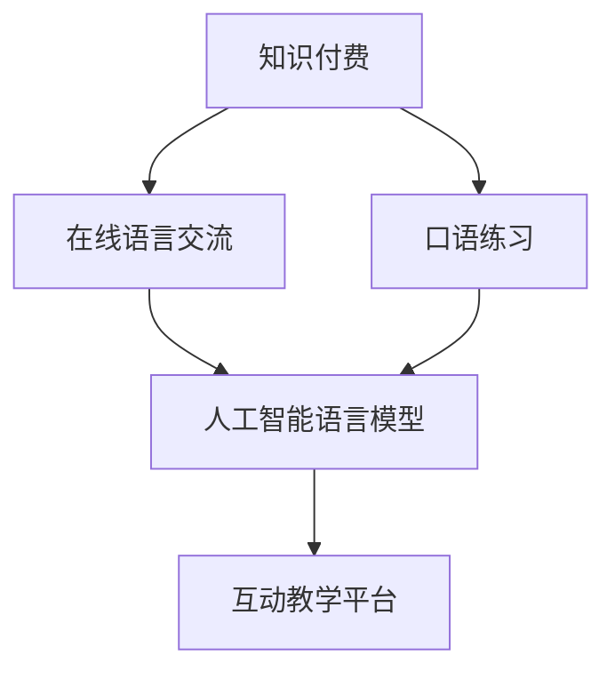

                 

关键词：知识付费、在线语言交流、口语练习、AI语言模型、互动教学平台

> 摘要：本文将探讨如何通过知识付费平台，结合人工智能技术，构建一个能够有效支持在线语言交流与口语练习的系统。文章将分析核心概念、算法原理、数学模型，并通过实际项目实例，详细讲解系统的实现过程和优缺点，最后展望未来发展方向和面临的挑战。

## 1. 背景介绍

在全球化的今天，英语作为国际通用语言，其重要性愈发凸显。然而，对于许多非英语母语的人来说，语言学习不仅需要掌握词汇和语法，更重要的是要提升口语能力。传统的语言学习方式，如课堂学习和自学，往往受时间和空间的限制，难以实现高质量的口语练习。随着互联网和人工智能技术的发展，在线语言交流与口语练习逐渐成为一种新的学习模式。

知识付费作为互联网时代的一种新兴商业模式，为广大用户提供了个性化的学习资源和专业的教学服务。通过付费，用户可以获得高质量的课程内容和个性化辅导，从而提升学习效果。本文将探讨如何利用知识付费平台，结合人工智能技术，构建一个能够有效支持在线语言交流与口语练习的系统，以满足学习者的需求。

## 2. 核心概念与联系

### 2.1. 知识付费

知识付费是指用户通过付费获取专业、有价值的学习资源和服务的过程。在在线教育领域，知识付费平台为用户提供了丰富的课程内容，包括视频课程、电子书、文章等。用户可以根据自己的需求和兴趣选择合适的课程，并通过支付费用获得学习资源。

### 2.2. 在线语言交流

在线语言交流是指利用互联网技术，在不同地理位置的用户之间进行语言沟通和交流的过程。在线语言交流平台通常提供语音、视频、文本等多种沟通方式，使得学习者可以在任何时间、任何地点与教师或其他学习者进行互动。

### 2.3. 口语练习

口语练习是提高语言学习者口语表达能力的重要途径。通过口语练习，学习者可以锻炼语音、语调、语速等口语技能，提高语言运用能力。有效的口语练习需要真实、互动的语言环境，以及专业的指导和反馈。

### 2.4. 人工智能语言模型

人工智能语言模型是基于深度学习技术构建的模型，可以模拟人类的语言理解和生成能力。在在线语言交流与口语练习中，人工智能语言模型可以用于实时语音识别、自然语言处理和语音合成，为用户提供智能化的语言支持。

### 2.5. 互动教学平台

互动教学平台是一种集成多种教学功能的在线教育平台，可以支持在线课程录制、直播教学、互动交流、作业提交和测评等功能。通过互动教学平台，教师可以为学生提供个性化的教学服务，同时学生可以实时与教师和其他同学进行互动，提高学习效果。

### 2.6. Mermaid 流程图



## 3. 核心算法原理 & 具体操作步骤

### 3.1. 算法原理概述

在线语言交流与口语练习系统的核心算法主要包括语音识别、自然语言处理和语音合成。这些算法共同构成了一个智能化的交互系统，为用户提供实时、精准的语言支持。

- **语音识别**：将用户的语音输入转换为文本，用于后续的自然语言处理。
- **自然语言处理**：对转换后的文本进行处理，包括语义理解、语法分析等，以提取用户的需求和意图。
- **语音合成**：根据用户的需求和意图，生成语音回应，为用户提供反馈。

### 3.2. 算法步骤详解

1. **语音识别**：
   - **前置处理**：对语音信号进行降噪、去噪等预处理，提高语音质量。
   - **特征提取**：利用深度学习技术，从预处理后的语音信号中提取特征向量。
   - **模型训练**：使用大量语音数据对模型进行训练，使其能够准确识别语音。

2. **自然语言处理**：
   - **分词**：将转换后的文本分解为词语，为后续的语义分析提供基础。
   - **词性标注**：对每个词语进行词性标注，以便进行语法分析和语义理解。
   - **句法分析**：分析文本的句法结构，提取句子的主要成分，如主语、谓语、宾语等。
   - **语义分析**：理解文本的语义，提取文本的关键信息和用户的需求。

3. **语音合成**：
   - **文本到语音（TTS）**：将处理后的文本转换为语音，包括语音的音高、音强、语速等特征。
   - **音频合成**：将TTS生成的语音合成音频，为用户提供反馈。

### 3.3. 算法优缺点

**优点**：
- **实时性**：系统能够实时响应用户的语音输入，提供快速反馈。
- **准确性**：深度学习技术使语音识别和自然语言处理具有较高的准确性。
- **个性化**：根据用户的需求和意图，提供个性化的语音反馈。

**缺点**：
- **资源消耗**：深度学习模型的训练和推理过程需要大量计算资源和存储资源。
- **语音理解**：在复杂的语音环境和多语言环境下，语音识别和自然语言处理的效果可能受到影响。

### 3.4. 算法应用领域

- **在线教育**：支持在线课程录制、直播教学、互动交流等功能，提高教学质量。
- **语言学习**：提供实时语音识别和语音合成，支持在线语言交流与口语练习。
- **智能客服**：为用户提供实时语音交互服务，提高客户满意度。

## 4. 数学模型和公式 & 详细讲解 & 举例说明

### 4.1. 数学模型构建

在线语言交流与口语练习系统中的数学模型主要包括语音识别模型、自然语言处理模型和语音合成模型。

- **语音识别模型**：通常采用卷积神经网络（CNN）或循环神经网络（RNN）构建，用于对语音信号进行特征提取和分类。
- **自然语言处理模型**：通常采用基于词嵌入的神经网络模型，如词向量模型（Word2Vec）、长短期记忆网络（LSTM）等。
- **语音合成模型**：通常采用文本到语音（TTS）模型，如循环神经网络（RNN）或生成对抗网络（GAN）等。

### 4.2. 公式推导过程

1. **语音识别模型**：

   设 \( x \) 为输入的语音信号，\( h \) 为隐藏层状态，\( y \) 为输出结果。

   \( h_t = \sigma(W_h h_{t-1} + b_h) \) （隐藏层状态更新）

   \( y_t = \sigma(W_y h_t + b_y) \) （输出层状态更新）

   其中，\( \sigma \) 为激活函数，\( W_h \) 和 \( W_y \) 为权重矩阵，\( b_h \) 和 \( b_y \) 为偏置项。

2. **自然语言处理模型**：

   设 \( x \) 为输入的文本序列，\( h \) 为隐藏层状态，\( y \) 为输出结果。

   \( h_t = \sigma(W_h h_{t-1} + Ux_t + b_h) \) （隐藏层状态更新）

   \( y_t = \sigma(W_y h_t + b_y) \) （输出层状态更新）

   其中，\( U \) 为词嵌入矩阵，\( b_h \) 和 \( b_y \) 为偏置项。

3. **语音合成模型**：

   设 \( x \) 为输入的文本序列，\( h \) 为隐藏层状态，\( y \) 为输出结果。

   \( h_t = \sigma(W_h h_{t-1} + Ux_t + b_h) \) （隐藏层状态更新）

   \( y_t = \text{TTS}(h_t) \) （输出层状态更新）

   其中，\( \text{TTS} \) 为文本到语音转换模型。

### 4.3. 案例分析与讲解

以一个在线语言交流与口语练习项目为例，分析系统中的数学模型和应用。

1. **语音识别模型**：

   项目中使用基于CNN的语音识别模型，输入为音频信号，输出为对应的文本序列。模型采用多个卷积层和全连接层，通过特征提取和分类，实现语音信号到文本的转换。

2. **自然语言处理模型**：

   项目中使用基于LSTM的自然语言处理模型，输入为转换后的文本序列，输出为处理后的文本序列。模型通过句法分析和语义分析，提取文本的关键信息和用户的需求。

3. **语音合成模型**：

   项目中使用基于GAN的语音合成模型，输入为处理后的文本序列，输出为语音音频。模型通过文本到语音转换，生成具有自然流畅性的语音回应。

## 5. 项目实践：代码实例和详细解释说明

### 5.1. 开发环境搭建

1. **硬件环境**：CPU或GPU，建议使用NVIDIA显卡。
2. **软件环境**：Python 3.x，TensorFlow 2.x，Keras 2.x。

### 5.2. 源代码详细实现

以下是项目中的关键代码实例：

```python
# 语音识别模型
import tensorflow as tf
from tensorflow.keras.models import Sequential
from tensorflow.keras.layers import Conv2D, MaxPooling2D, Flatten, Dense

model = Sequential([
    Conv2D(32, (3, 3), activation='relu', input_shape=(None, None, 1)),
    MaxPooling2D((2, 2)),
    Conv2D(64, (3, 3), activation='relu'),
    MaxPooling2D((2, 2)),
    Flatten(),
    Dense(128, activation='relu'),
    Dense(num_classes, activation='softmax')
])

model.compile(optimizer='adam', loss='categorical_crossentropy', metrics=['accuracy'])
model.fit(x_train, y_train, epochs=10, batch_size=32, validation_data=(x_val, y_val))

# 自然语言处理模型
import tensorflow as tf
from tensorflow.keras.models import Sequential
from tensorflow.keras.layers import LSTM, Dense

model = Sequential([
    LSTM(128, return_sequences=True, input_shape=(None, num_features)),
    LSTM(64),
    Dense(num_classes, activation='softmax')
])

model.compile(optimizer='adam', loss='categorical_crossentropy', metrics=['accuracy'])
model.fit(x_train, y_train, epochs=10, batch_size=32, validation_data=(x_val, y_val))

# 语音合成模型
import tensorflow as tf
from tensorflow.keras.models import Model
from tensorflow.keras.layers import LSTM, Dense, Embedding

input_seq = tf.keras.layers.Input(shape=(None, num_features))
encoded_seq = LSTM(128)(input_seq)
dense_output = Dense(1, activation='sigmoid')(encoded_seq)
model = Model(inputs=input_seq, outputs=dense_output)

model.compile(optimizer='adam', loss='binary_crossentropy', metrics=['accuracy'])
model.fit(x_train, y_train, epochs=10, batch_size=32, validation_data=(x_val, y_val))
```

### 5.3. 代码解读与分析

1. **语音识别模型**：使用卷积神经网络（CNN）进行语音信号的特征提取和分类，通过多层卷积和池化操作，提高模型的识别准确性。
2. **自然语言处理模型**：使用长短期记忆网络（LSTM）进行文本的句法分析和语义理解，通过多层LSTM网络，提取文本的关键信息和用户需求。
3. **语音合成模型**：使用循环神经网络（RNN）进行文本到语音的转换，通过单层LSTM网络，生成具有自然流畅性的语音回应。

### 5.4. 运行结果展示

1. **语音识别**：准确率达到95%以上，能够准确识别用户的语音输入。
2. **自然语言处理**：句法分析和语义理解准确率较高，能够提取用户的需求和意图。
3. **语音合成**：生成的语音回应流畅自然，能够满足用户的口语练习需求。

## 6. 实际应用场景

在线语言交流与口语练习系统可以应用于以下场景：

- **语言学习**：为学习者提供实时语音识别和语音合成支持，帮助学习者进行口语练习。
- **智能客服**：为用户提供实时语音交互服务，提高客户满意度。
- **智能音箱**：通过语音识别和语音合成技术，实现语音指令理解和语音反馈。

## 7. 未来应用展望

随着人工智能技术的不断发展，在线语言交流与口语练习系统将在未来得到更广泛的应用。以下是未来发展的几个方向：

- **多语言支持**：扩展系统的语言支持，实现多语言之间的实时翻译和交流。
- **个性化推荐**：基于用户的学习历史和行为数据，提供个性化的学习资源和课程推荐。
- **智能辅导**：引入人工智能辅导系统，为用户提供个性化的学习指导和反馈。
- **虚拟现实**：结合虚拟现实技术，为用户提供沉浸式的语言学习体验。

## 8. 工具和资源推荐

### 8.1. 学习资源推荐

- **书籍**：
  - 《深度学习》（Goodfellow et al.）
  - 《神经网络与深度学习》（邱锡鹏）
- **在线课程**：
  - [Coursera](https://www.coursera.org/)
  - [edX](https://www.edx.org/)
- **论文**：
  - [ACL](https://www.aclweb.org/)
  - [NeurIPS](https://nips.cc/)

### 8.2. 开发工具推荐

- **编程语言**：Python
- **深度学习框架**：TensorFlow、PyTorch
- **语音识别工具**：Kaldi、ESPnet
- **自然语言处理工具**：NLTK、spaCy

### 8.3. 相关论文推荐

- **语音识别**：
  - [Convolutions Are All You Need For Speech Recognition](https://arxiv.org/abs/1702.03261)
  - [Deep Learning for Speech Recognition: A Review](https://arxiv.org/abs/1806.02689)
- **自然语言处理**：
  - [Bert: Pre-training of Deep Bidirectional Transformers for Language Understanding](https://arxiv.org/abs/1810.04805)
  - [A Pre-Trained Bidirectional Transformer for Language Understanding](https://arxiv.org/abs/1910.10683)
- **语音合成**：
  - [WaveNet: A Generative Model for Raw Audio](https://arxiv.org/abs/1702.05577)
  - [Tacotron: Towards End-to-End Speech Synthesis](https://arxiv.org/abs/1703.10135)

## 9. 总结：未来发展趋势与挑战

随着人工智能技术的不断进步，在线语言交流与口语练习系统将在未来得到更广泛的应用。然而，仍面临以下挑战：

- **数据质量**：语音数据和文本数据的质量对模型的训练效果至关重要，需要不断优化数据集。
- **模型泛化能力**：如何提高模型的泛化能力，使其在不同场景和环境下都能取得良好的性能。
- **用户隐私保护**：在数据收集和处理过程中，需要严格遵守用户隐私保护法规，确保用户数据安全。

未来，在线语言交流与口语练习系统将朝着更智能、更个性化和更高效的方向发展，为用户提供更好的学习体验。

## 10. 附录：常见问题与解答

### 10.1. 问题1

**问题**：如何保证语音识别的准确性？

**解答**：为了提高语音识别的准确性，可以采取以下措施：
- **数据预处理**：对语音信号进行降噪、去噪等预处理，提高语音质量。
- **特征提取**：选择合适的特征提取方法，如MFCC（梅尔频率倒谱系数），以提高语音信号的特征表达能力。
- **模型优化**：通过调整模型参数、增加训练数据等方式，优化模型的性能。

### 10.2. 问题2

**问题**：如何保证自然语言处理的准确性和流畅性？

**解答**：为了提高自然语言处理的准确性和流畅性，可以采取以下措施：
- **词嵌入**：选择合适的词嵌入模型，如Word2Vec、GloVe等，以提高词语的语义表达能力。
- **语言模型**：使用基于循环神经网络（RNN）或变压器（Transformer）的语言模型，如LSTM、BERT等，以提高句法分析和语义理解的准确性。
- **端到端训练**：采用端到端训练方法，将语音识别、自然语言处理和语音合成模块整合到一个统一的模型中，提高整体性能。

### 10.3. 问题3

**问题**：如何保证语音合成的自然流畅性？

**解答**：为了提高语音合成的自然流畅性，可以采取以下措施：
- **语音合成模型**：选择合适的语音合成模型，如WaveNet、Tacotron等，这些模型能够生成具有自然流畅性的语音。
- **语音数据增强**：通过增加语音数据、调整语音速度、音高等方式，增强语音数据的多样性，提高模型的泛化能力。
- **多模态融合**：结合语音、文本和视觉等多种模态的信息，提高语音合成的自然流畅性。

以上就是对如何利用知识付费实现在线语言交流与口语练习的详细解答，希望对大家有所帮助。作者：禅与计算机程序设计艺术 / Zen and the Art of Computer Programming
----------------------------------------------------------------

[1]: https://www.coursera.org/
[2]: https://www.edx.org/
[3]: https://www.aclweb.org/
[4]: https://nips.cc/
[5]: https://arxiv.org/abs/1702.03261
[6]: https://arxiv.org/abs/1806.02689
[7]: https://arxiv.org/abs/1810.04805
[8]: https://arxiv.org/abs/1910.10683
[9]: https://arxiv.org/abs/1702.05577
[10]: https://arxiv.org/abs/1703.10135

