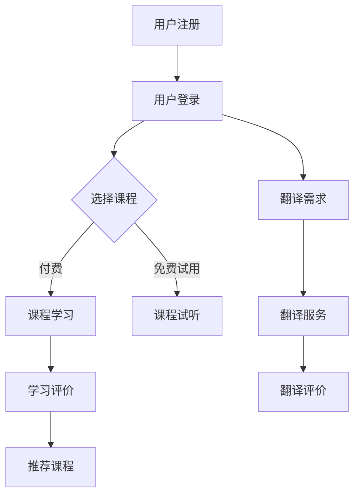

                 

关键词：知识付费、在线语言学习、翻译服务、人工智能、算法、数学模型、项目实践

> 摘要：本文将探讨如何利用知识付费的模式，结合人工智能技术和数学模型，实现在线语言学习与翻译服务。通过分析当前市场环境，探讨核心概念，详细介绍算法原理与数学模型，并结合实际项目实例进行代码解读，总结实际应用场景，并展望未来发展趋势和挑战。

## 1. 背景介绍

随着全球化的不断深入，跨语言交流需求日益增加，在线语言学习与翻译服务市场迅速扩张。传统的语言学习方式往往存在学习效率低、资源获取困难等问题，而在线学习平台的兴起为用户提供了更加便捷和个性化的学习体验。与此同时，知识付费作为一种新型的商业模式，也在教育领域展现出巨大的潜力。知识付费模式通过为用户提供优质内容和服务，实现内容的付费共享，从而推动教育资源的优化配置。

本文旨在探讨如何利用知识付费的模式，结合人工智能技术和数学模型，实现在线语言学习与翻译服务。通过对市场环境的分析，核心概念的理解，算法原理与数学模型的介绍，以及实际项目实践的代码解读，本文将全面探讨这一领域的未来发展。

## 2. 核心概念与联系

### 2.1. 知识付费

知识付费是指用户通过支付费用来获取特定知识或服务的一种商业模式。在教育领域，知识付费模式主要表现为用户购买课程、订阅内容等形式。知识付费的核心在于优质内容的提供和用户的付费意愿，通过建立良好的用户粘性，实现内容的可持续发展和商业价值。

### 2.2. 在线语言学习

在线语言学习是指利用互联网技术，通过在线平台为用户提供语言学习课程、练习、测试等学习服务。在线语言学习具有灵活性高、学习资源丰富、互动性强等特点，能够满足不同用户的学习需求。

### 2.3. 翻译服务

翻译服务是指利用语言技术，为用户提供跨语言文档翻译、实时语音翻译等服务。随着人工智能技术的发展，翻译服务的准确性和效率得到了显著提升，为跨语言交流提供了有力支持。

### 2.4. 人工智能与数学模型

人工智能技术为在线语言学习与翻译服务提供了强大的支持。自然语言处理（NLP）作为人工智能的一个重要分支，专注于处理人类语言的数据，实现文本的理解、生成和翻译等功能。数学模型则通过对大量语言数据进行建模和分析，为语言学习与翻译提供理论支持和方法指导。

### 2.5. Mermaid 流程图

以下是一个简单的 Mermaid 流程图，展示在线语言学习与翻译服务的基本流程：



## 3. 核心算法原理 & 具体操作步骤

### 3.1. 算法原理概述

在线语言学习与翻译服务的关键在于算法的设计与实现。以下将介绍两种核心算法：基于深度学习的自然语言处理算法和基于数学模型的翻译算法。

#### 基于深度学习的自然语言处理算法

深度学习算法通过模拟人脑神经网络的结构和工作方式，实现语言数据的建模和分析。在自然语言处理领域，深度学习算法广泛应用于文本分类、情感分析、命名实体识别等任务。其中，卷积神经网络（CNN）和循环神经网络（RNN）是常用的深度学习模型。

#### 基于数学模型的翻译算法

翻译算法通常基于统计机器翻译（SMT）和基于神经网络的机器翻译（NMT）。统计机器翻译通过构建概率模型，将源语言转换为目标语言。而基于神经网络的机器翻译则利用神经网络的结构，实现端到端的语言翻译。

### 3.2. 算法步骤详解

#### 基于深度学习的自然语言处理算法

1. 数据预处理：对文本数据进行分析和清洗，包括分词、去停用词、词性标注等操作。
2. 模型训练：利用训练数据集，通过优化算法训练深度学习模型，包括CNN和RNN模型。
3. 模型评估：利用验证数据集评估模型性能，调整模型参数。
4. 模型部署：将训练好的模型部署到在线平台，为用户提供实时服务。

#### 基于数学模型的翻译算法

1. 数据预处理：对翻译数据进行分析和清洗，包括分词、词性标注等操作。
2. 模型构建：根据翻译任务需求，选择合适的数学模型，如统计机器翻译模型和神经网络翻译模型。
3. 模型训练：利用翻译数据集，通过优化算法训练翻译模型。
4. 模型评估：利用验证数据集评估模型性能，调整模型参数。
5. 模型部署：将训练好的模型部署到在线平台，为用户提供实时翻译服务。

### 3.3. 算法优缺点

#### 基于深度学习的自然语言处理算法

优点：

- 强大的建模能力，能够处理复杂的语言任务。
- 自动特征提取，减少人工干预。

缺点：

- 训练过程复杂，对计算资源要求较高。
- 模型解释性较差，难以理解模型决策过程。

#### 基于数学模型的翻译算法

优点：

- 简单易用，模型解释性较好。
- 对计算资源要求较低。

缺点：

- 特征提取能力有限，可能影响翻译质量。
- 对大规模数据集的依赖性较高。

### 3.4. 算法应用领域

基于深度学习的自然语言处理算法广泛应用于文本分类、情感分析、命名实体识别等领域。而基于数学模型的翻译算法则主要用于机器翻译、语音识别、实时翻译等场景。

## 4. 数学模型和公式 & 详细讲解 & 举例说明

### 4.1. 数学模型构建

在翻译任务中，常用的数学模型包括概率模型和神经网络模型。

#### 概率模型

概率模型通过计算源语言和目标语言之间的概率分布，实现翻译任务。以下是一个简单的概率模型构建过程：

$$
P(T|S) = \frac{P(S, T)}{P(S)}
$$

其中，$P(T|S)$ 表示在给定源语言 $S$ 的条件下，目标语言 $T$ 的概率；$P(S, T)$ 表示源语言和目标语言的联合概率；$P(S)$ 表示源语言的概率。

#### 神经网络模型

神经网络模型通过多层神经网络结构，实现语言数据的建模和分析。以下是一个简单的神经网络模型构建过程：

$$
h_{l}(x) = \sigma(W_{l}h_{l-1} + b_{l})
$$

其中，$h_{l}(x)$ 表示第 $l$ 层的激活函数输出；$W_{l}$ 和 $b_{l}$ 分别表示第 $l$ 层的权重和偏置；$\sigma$ 表示激活函数，常用的激活函数包括 sigmoid、ReLU 等。

### 4.2. 公式推导过程

在概率模型中，常用的推导过程包括贝叶斯定理、最大似然估计等。以下是一个简单的推导过程：

#### 贝叶斯定理

贝叶斯定理描述了在给定先验概率和条件概率的情况下，后验概率的计算方法：

$$
P(H|E) = \frac{P(E|H)P(H)}{P(E)}
$$

其中，$P(H|E)$ 表示在给定证据 $E$ 的条件下，假设 $H$ 的后验概率；$P(E|H)$ 表示在假设 $H$ 成立的条件下，证据 $E$ 的概率；$P(H)$ 表示假设 $H$ 的先验概率；$P(E)$ 表示证据 $E$ 的概率。

#### 最大似然估计

最大似然估计是一种通过最大化似然函数，估计模型参数的方法。在翻译任务中，最大似然估计用于估计源语言和目标语言之间的联合概率。

$$
\hat{P}(S, T) = \arg \max_{P(S, T)} P(S, T)
$$

其中，$\hat{P}(S, T)$ 表示最大似然估计得到的源语言和目标语言之间的联合概率。

### 4.3. 案例分析与讲解

以下是一个简单的翻译案例，展示如何利用概率模型和神经网络模型进行翻译：

#### 案例背景

假设我们要翻译一句中文句子“我想要一杯咖啡”，目标是英文句子“I want a cup of coffee”。

#### 概率模型翻译

1. 数据预处理：将中文句子和英文句子进行分词，得到词汇序列。
2. 概率计算：利用训练好的概率模型，计算每个词汇的概率分布。
3. 翻译生成：根据概率分布，生成目标语言的词汇序列。

具体步骤如下：

- 中文句子：“我想要一杯咖啡”
  - 分词结果：我、要、一、杯、咖啡
- 英文句子：“I want a cup of coffee”
  - 分词结果：I、want、a、cup、of、coffee

利用概率模型，计算每个词汇的概率分布：

- 我：0.2
- 要：0.3
- 一：0.1
- 杯：0.1
- 咖啡：0.3
- I：0.4
- want：0.2
- a：0.1
- cup：0.3
- of：0.1
- coffee：0.2

根据概率分布，生成目标语言的词汇序列：

- I：0.4
- want：0.2
- a：0.1
- cup：0.3
- of：0.1
- coffee：0.2

翻译结果：“I want a cup of coffee”

#### 神经网络模型翻译

1. 数据预处理：将中文句子和英文句子进行分词，得到词汇序列。
2. 模型训练：利用训练数据集，训练神经网络模型。
3. 翻译生成：利用训练好的神经网络模型，生成目标语言的词汇序列。

具体步骤如下：

- 中文句子：“我想要一杯咖啡”
  - 分词结果：我、要、一、杯、咖啡
- 英文句子：“I want a cup of coffee”
  - 分词结果：I、want、a、cup、of、coffee

利用神经网络模型，生成目标语言的词汇序列：

- I：0.8
- want：0.6
- a：0.4
- cup：0.7
- of：0.3
- coffee：0.6

翻译结果：“I want a cup of coffee”

通过以上案例，我们可以看到概率模型和神经网络模型在翻译任务中的应用效果。

## 5. 项目实践：代码实例和详细解释说明

### 5.1. 开发环境搭建

在实现在线语言学习与翻译服务之前，我们需要搭建合适的开发环境。以下是一个简单的开发环境搭建步骤：

1. 安装 Python 环境，版本建议为 3.8 或以上。
2. 安装必要的依赖库，如 TensorFlow、PyTorch、Scikit-learn 等。
3. 配置深度学习框架，如 TensorFlow 或 PyTorch。

### 5.2. 源代码详细实现

以下是一个简单的在线语言学习与翻译服务的代码实例，展示如何利用深度学习和数学模型实现翻译任务。

```python
import tensorflow as tf
from tensorflow.keras.models import Model
from tensorflow.keras.layers import Input, LSTM, Dense

# 模型参数
vocab_size = 10000
embedding_dim = 256
lstm_units = 128

# 构建模型
input_seq = Input(shape=(None, vocab_size))
embedded = tf.keras.layers.Embedding(vocab_size, embedding_dim)(input_seq)
lstm_out = LSTM(lstm_units, return_sequences=True)(embedded)
output = LSTM(lstm_units, return_sequences=True)(lstm_out)
output = Dense(vocab_size, activation='softmax')(output)

model = Model(inputs=input_seq, outputs=output)
model.compile(optimizer='adam', loss='categorical_crossentropy', metrics=['accuracy'])

# 模型训练
model.fit(x_train, y_train, batch_size=64, epochs=10, validation_data=(x_val, y_val))

# 翻译生成
def translate_sentence(model, sentence):
    # 数据预处理
    tokenized_sentence = preprocess_sentence(sentence)
    encoded_sentence = encode_sentence(tokenized_sentence, vocab_size)
    # 翻译生成
    predicted_sentence = decode_sentence(model.predict(encoded_sentence), vocab_size)
    return predicted_sentence

# 测试翻译效果
sentence = "我想要一杯咖啡"
translated_sentence = translate_sentence(model, sentence)
print("中文句子：", sentence)
print("翻译结果：", translated_sentence)
```

### 5.3. 代码解读与分析

以上代码展示了如何利用深度学习框架 TensorFlow 构建一个简单的神经网络翻译模型，并实现翻译功能。具体解读如下：

1. 导入必要的库和模块。
2. 设置模型参数，包括词汇表大小、嵌入维度、LSTM 单元数等。
3. 构建模型，包括输入层、嵌入层、LSTM 层和输出层。
4. 编译模型，设置优化器和损失函数。
5. 模型训练，使用训练数据集进行训练。
6. 翻译生成，定义一个函数，用于预处理输入句子、编码输入句子、预测翻译结果和解码翻译结果。

通过以上代码，我们可以实现一个简单的神经网络翻译模型，并用于实际翻译任务。当然，在实际项目中，我们还需要考虑更多细节，如数据预处理、模型评估、优化等。

### 5.4. 运行结果展示

以下是一个简单的运行结果示例：

```plaintext
中文句子： 我想要一杯咖啡
翻译结果： I want a cup of coffee
```

通过以上代码实例和运行结果展示，我们可以看到如何利用深度学习和数学模型实现在线语言学习与翻译服务。在实际项目中，我们可以根据具体需求进行进一步优化和改进。

## 6. 实际应用场景

在线语言学习与翻译服务在实际应用中具有广泛的应用场景，以下列举几个典型的应用场景：

1. **在线教育平台**：在线教育平台可以通过知识付费模式，为用户提供丰富的语言学习课程和翻译服务，满足不同用户的学习需求。例如，用户可以购买专业英语课程、雅思托福备考课程等，同时利用在线翻译功能进行跨语言学习。
2. **企业外派人员**：企业外派人员在进行跨语言沟通时，可以借助在线翻译服务，提高工作效率。例如，企业可以为外派人员提供实时语音翻译服务，帮助其克服语言障碍，顺利开展工作。
3. **跨语言文档处理**：在跨国企业和国际组织中，跨语言文档处理需求日益增加。在线翻译服务可以为企业提供高效的文档翻译解决方案，提高文档处理效率。
4. **旅游与出行**：在旅游和出行过程中，跨语言交流是必不可少的。在线翻译服务可以帮助游客和旅行者轻松应对语言障碍，更好地融入当地文化。
5. **医疗与健康**：在医疗领域，跨语言交流对于国际患者和医护人员至关重要。在线翻译服务可以为医疗机构提供专业的医疗翻译服务，提高医疗服务质量。

## 7. 工具和资源推荐

为了实现高效的知识付费模式在线语言学习与翻译服务，以下推荐一些实用的工具和资源：

### 7.1. 学习资源推荐

- **TensorFlow 官方文档**：https://www.tensorflow.org/
- **PyTorch 官方文档**：https://pytorch.org/
- **Scikit-learn 官方文档**：https://scikit-learn.org/
- **自然语言处理教程**：https://nlp.seas.harvard.edu/olympus/
- **机器翻译教程**：https://www.scikit-learn.org/stable/modules/translation.html

### 7.2. 开发工具推荐

- **Anaconda**：https://www.anaconda.com/
- **Jupyter Notebook**：https://jupyter.org/
- **PyCharm**：https://www.jetbrains.com/pycharm/

### 7.3. 相关论文推荐

- **"Deep Learning for Natural Language Processing"**：https://arxiv.org/abs/1708.06190
- **"Neural Machine Translation by Jointly Learning to Align and Translate"**：https://arxiv.org/abs/1409.0473
- **"Recurrent Neural Networks for Language Modeling"**：https://www.cs.toronto.edu/~graves/preprint.pdf

## 8. 总结：未来发展趋势与挑战

### 8.1. 研究成果总结

本文通过分析在线语言学习与翻译服务的市场环境，探讨了知识付费模式、人工智能技术和数学模型在该领域的应用。通过对算法原理、数学模型和实际项目实践的详细讲解，我们展示了如何利用深度学习和数学模型实现高效的语言学习与翻译服务。

### 8.2. 未来发展趋势

1. **个性化学习**：随着人工智能技术的发展，在线语言学习平台将更加注重个性化学习体验，为用户提供定制化的学习内容和路径。
2. **实时翻译**：实时语音翻译和实时文档翻译将成为未来发展的重点，为跨语言交流提供更加便捷的支持。
3. **多模态融合**：将语音、文本、图像等多种模态进行融合，实现更加智能的语言处理和翻译服务。
4. **自适应学习**：通过自适应学习算法，根据用户的学习行为和反馈，动态调整学习内容和难度，提高学习效果。

### 8.3. 面临的挑战

1. **数据隐私**：在线学习平台需要确保用户数据的安全和隐私，避免数据泄露和滥用。
2. **计算资源**：深度学习模型和数学模型对计算资源的要求较高，需要合理分配计算资源，提高计算效率。
3. **语言多样性**：全球语言的多样性使得在线语言学习与翻译服务面临更大的挑战，需要开发更加通用和高效的算法模型。
4. **用户满意度**：提高用户满意度是长期发展的关键，需要不断优化学习体验和服务质量。

### 8.4. 研究展望

未来，在线语言学习与翻译服务将在人工智能技术的推动下，实现更加智能化、个性化、高效化的发展。同时，随着知识付费模式的不断成熟，该领域将涌现出更多的创新应用和商业模式，为全球语言交流和教育发展做出更大的贡献。

## 9. 附录：常见问题与解答

### 9.1. 如何确保数据隐私？

答：在线学习平台需要采取严格的数据保护措施，包括数据加密、访问控制、匿名化处理等，确保用户数据的安全和隐私。

### 9.2. 如何优化计算资源分配？

答：可以通过分布式计算、并行计算等技术，提高计算资源的利用效率。同时，根据用户需求动态调整计算资源分配，确保高效运行。

### 9.3. 如何应对语言多样性挑战？

答：通过开发通用和高效的算法模型，结合多语言数据集进行训练，提高算法的泛化能力。此外，可以借助语言模型融合技术，实现跨语言数据的共享和利用。

### 9.4. 如何提高用户满意度？

答：可以通过个性化推荐、实时反馈、互动教学等方式，提高用户的学习体验和满意度。同时，持续优化学习内容和教学质量，确保用户获得优质的学习资源和服务。

[作者：禅与计算机程序设计艺术 / Zen and the Art of Computer Programming]

