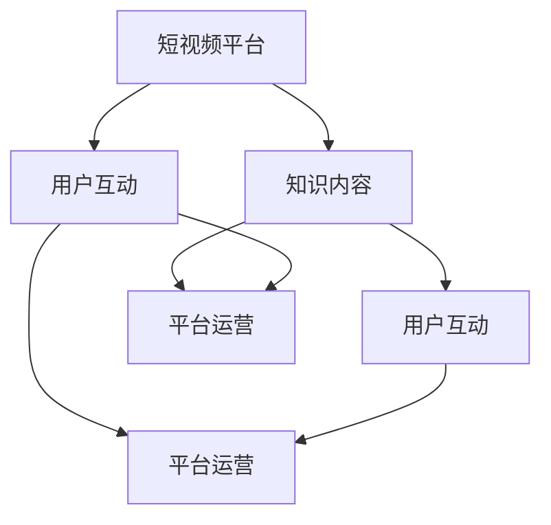

                 

关键词：短视频平台、知识变现、内容创作、用户互动、平台运营

> 摘要：随着短视频平台的迅猛发展，知识变现成为越来越多内容创作者关注的话题。本文将深入探讨如何在短视频平台上实现知识变现，从内容创作、用户互动、平台运营等多方面进行分析，为创作者提供实用的策略和案例，助你在短视频领域创造价值。

## 1. 背景介绍

短视频平台作为一种新兴的媒体形式，正迅速改变着人们的消费习惯和娱乐方式。根据最新数据显示，短视频用户规模已达数亿，这个庞大的用户群体为内容创作者提供了广阔的市场空间。而知识变现，则是指通过将自己的专业知识、技能或经验等内容转化为经济收益的过程。

随着短视频平台内容的多样化，越来越多的内容创作者开始意识到知识变现的巨大潜力。从教育培训到技能分享，从生活百科到专业咨询，各种知识类内容在短视频平台上层出不穷。然而，如何有效实现知识变现，仍是一个亟待解决的问题。

本文将从以下几个方面探讨如何利用短视频平台实现知识变现：

1. **内容创作策略**：分析成功案例，总结优质内容创作的要点。
2. **用户互动技巧**：探讨如何通过互动提升用户粘性，实现变现。
3. **平台运营策略**：介绍如何利用平台规则和工具，最大化知识变现效果。
4. **数学模型和公式**：运用数据分析和经济学原理，为知识变现提供理论支持。
5. **项目实践与案例分析**：结合实际案例，详细讲解知识变现的具体操作步骤。
6. **未来应用展望**：预测短视频知识变现的发展趋势，探讨面临的挑战与机遇。

## 2. 核心概念与联系

在讨论如何利用短视频平台实现知识变现之前，我们需要了解几个核心概念，并运用 Mermaid 流程图展示它们之间的联系。

### 2.1 核心概念

- **短视频平台**：一种以短视频为主要形式的内容发布和分享平台。
- **知识内容**：指具有一定教育、指导或启发性，并能解决用户问题或满足用户需求的内容。
- **用户互动**：指用户与内容创作者之间的互动行为，包括评论、点赞、分享等。
- **平台运营**：指短视频平台通过一系列策略和措施，管理和优化内容生态，促进用户增长和内容创作者的活跃度。

### 2.2 Mermaid 流程图



**图 2.1：短视频平台核心概念与联系流程图**

通过这个流程图，我们可以清晰地看到短视频平台中的知识内容、用户互动和平台运营三者之间的紧密联系。知识内容是核心，通过用户互动得到反馈和传播，而平台运营则提供了良好的生态环境，促进知识的变现。

### 2.3 核心概念原理和架构

#### 2.3.1 短视频平台的运作原理

短视频平台主要依赖于以下几个核心组件：

1. **内容创作与发布**：用户可以在平台上创作和发布短视频。
2. **内容推荐与分发**：平台通过算法和人工审核，推荐合适的视频内容给用户。
3. **用户互动**：用户可以通过评论、点赞、分享等方式与内容互动。
4. **平台运营**：平台通过广告、会员服务、品牌合作等方式实现盈利。

#### 2.3.2 用户互动的原理和机制

用户互动是短视频平台的重要组成部分，主要包括以下几种机制：

1. **点赞**：用户对喜欢的视频进行点赞，表明支持。
2. **评论**：用户在视频下方发表评论，进行讨论。
3. **分享**：用户将视频分享到其他社交媒体平台，扩大传播范围。
4. **私信**：用户可以通过私信与内容创作者进行私下交流。

#### 2.3.3 平台运营的策略和工具

平台运营主要包括以下几个方面：

1. **内容审核**：确保内容符合平台规范，维护良好的内容生态。
2. **用户增长**：通过推广活动和算法优化，吸引更多用户加入。
3. **广告投放**：为创作者和品牌提供广告服务，实现盈利。
4. **品牌合作**：与品牌合作，开展定制化内容营销活动。

## 3. 核心算法原理 & 具体操作步骤

### 3.1 算法原理概述

在短视频平台上实现知识变现，算法推荐系统起到了至关重要的作用。推荐算法通过分析用户的行为数据、内容特征以及用户之间的关系，为用户推荐他们可能感兴趣的知识内容。以下是一种常见的推荐算法原理：

1. **协同过滤**：通过分析用户的行为数据，找到相似用户或内容，为当前用户推荐相似的内容。
2. **基于内容的推荐**：根据用户的历史行为和内容特征，为用户推荐相似的内容。
3. **混合推荐**：结合协同过滤和基于内容的推荐，提高推荐效果。

### 3.2 算法步骤详解

1. **数据收集与预处理**：收集用户行为数据（如浏览、点赞、评论等），并对数据进行清洗和预处理。
2. **用户行为分析**：分析用户的行为数据，提取用户的兴趣特征。
3. **内容特征提取**：对视频内容进行特征提取，如文本、语音、图像等。
4. **构建推荐模型**：使用机器学习算法（如协同过滤、基于内容的推荐等）构建推荐模型。
5. **推荐结果生成**：根据用户兴趣特征和内容特征，为用户生成推荐列表。

### 3.3 算法优缺点

1. **优点**：
   - 提高用户满意度：为用户提供个性化的推荐内容，提高用户体验。
   - 增加用户粘性：通过推荐用户感兴趣的内容，提高用户在平台上的活跃度。
   - 促进知识变现：通过精准推荐，帮助内容创作者更好地触达目标用户，实现知识变现。

2. **缺点**：
   - 数据隐私问题：用户行为数据的收集和处理可能涉及隐私问题。
   - 算法偏见：推荐算法可能因为数据偏差或算法设计问题，导致推荐内容的不公平性。
   - 过度个性化：过度个性化可能导致用户失去探索新内容的动力。

### 3.4 算法应用领域

推荐算法在短视频平台中具有广泛的应用，主要包括以下几个方面：

1. **内容推荐**：为用户推荐感兴趣的知识内容，提高用户粘性。
2. **广告推荐**：为用户推荐相关广告，提高广告投放效果。
3. **用户增长**：通过推荐感兴趣的内容，吸引用户注册和活跃。
4. **知识变现**：通过精准推荐，帮助内容创作者更好地触达目标用户，实现知识变现。

## 4. 数学模型和公式 & 详细讲解 & 举例说明

### 4.1 数学模型构建

在短视频平台的知识变现过程中，我们可以构建以下数学模型：

1. **用户价值模型**：衡量用户在平台上产生的价值。
2. **内容价值模型**：衡量内容在平台上的价值。
3. **变现效率模型**：衡量知识变现的效率。

### 4.2 公式推导过程

#### 4.2.1 用户价值模型

用户价值模型可以表示为：

\[ V_u = f(a, b, c) \]

其中，\( a \) 表示用户活跃度，\( b \) 表示用户贡献的内容数量，\( c \) 表示用户互动量。函数 \( f \) 可以根据实际情况进行设计，如：

\[ f(a, b, c) = a \times b \times c \]

#### 4.2.2 内容价值模型

内容价值模型可以表示为：

\[ V_c = g(d, e, f) \]

其中，\( d \) 表示内容的观看次数，\( e \) 表示内容的点赞数，\( f \) 表示内容的分享次数。函数 \( g \) 可以根据实际情况进行设计，如：

\[ g(d, e, f) = d \times e \times f \]

#### 4.2.3 变现效率模型

变现效率模型可以表示为：

\[ E = h(V_u, V_c) \]

其中，\( V_u \) 表示用户价值，\( V_c \) 表示内容价值。函数 \( h \) 可以根据实际情况进行设计，如：

\[ h(V_u, V_c) = \frac{V_u}{V_c} \]

### 4.3 案例分析与讲解

假设有两位用户 \( U1 \) 和 \( U2 \)，以及两段内容 \( C1 \) 和 \( C2 \)，我们可以根据上述模型进行计算：

1. **用户价值模型**：

   - \( U1 \) 的活跃度 \( a = 100 \)，贡献的内容数量 \( b = 50 \)，互动量 \( c = 30 \)。

   - \( U2 \) 的活跃度 \( a = 200 \)，贡献的内容数量 \( b = 20 \)，互动量 \( c = 40 \)。

   - \( V_{U1} = f(100, 50, 30) = 150000 \)

   - \( V_{U2} = f(200, 20, 40) = 160000 \)

2. **内容价值模型**：

   - \( C1 \) 的观看次数 \( d = 1000 \)，点赞数 \( e = 300 \)，分享次数 \( f = 50 \)。

   - \( C2 \) 的观看次数 \( d = 500 \)，点赞数 \( e = 200 \)，分享次数 \( f = 30 \)。

   - \( V_{C1} = g(1000, 300, 50) = 150000 \)

   - \( V_{C2} = g(500, 200, 30) = 30000 \)

3. **变现效率模型**：

   - \( E_{U1} = h(V_{U1}, V_{C1}) = \frac{150000}{150000} = 1 \)

   - \( E_{U2} = h(V_{U2}, V_{C2}) = \frac{160000}{30000} = 5.33 \)

通过以上计算，我们可以看出，用户 \( U2 \) 的变现效率明显高于用户 \( U1 \)。这表明，提高用户活跃度、贡献内容和互动量，可以显著提升知识变现的效率。

## 5. 项目实践：代码实例和详细解释说明

### 5.1 开发环境搭建

在本节中，我们将使用 Python 编写一个简单的短视频平台知识变现系统。首先，我们需要搭建开发环境。

1. 安装 Python 3.8 以上版本。
2. 安装必要的库，如 NumPy、Pandas、Matplotlib 等。

```shell
pip install numpy pandas matplotlib
```

### 5.2 源代码详细实现

以下是实现用户价值模型、内容价值模型和变现效率模型的 Python 代码。

```python
import numpy as np

def user_value_model(a, b, c):
    return a * b * c

def content_value_model(d, e, f):
    return d * e * f

def变现效率模型(V_u, V_c):
    return V_u / V_c

# 示例数据
user1_data = {'a': 100, 'b': 50, 'c': 30}
content1_data = {'d': 1000, 'e': 300, 'f': 50}

user2_data = {'a': 200, 'b': 20, 'c': 40}
content2_data = {'d': 500, 'e': 200, 'f': 30}

# 计算用户价值
V_u1 = user_value_model(user1_data['a'], user1_data['b'], user1_data['c'])
V_u2 = user_value_model(user2_data['a'], user2_data['b'], user2_data['c'])

# 计算内容价值
V_c1 = content_value_model(content1_data['d'], content1_data['e'], content1_data['f'])
V_c2 = content_value_model(content2_data['d'], content2_data['e'], content2_data['f'])

# 计算变现效率
E_u1 = 变现效率模型(V_u1, V_c1)
E_u2 = 变现效率模型(V_u2, V_c2)

print("用户1的价值：", V_u1)
print("用户2的价值：", V_u2)
print("内容1的价值：", V_c1)
print("内容2的价值：", V_c2)
print("用户1的变现效率：", E_u1)
print("用户2的变现效率：", E_u2)
```

### 5.3 代码解读与分析

1. **用户价值模型**：通过三个参数（活跃度、贡献内容数量、互动量）计算用户价值。
2. **内容价值模型**：通过三个参数（观看次数、点赞数、分享次数）计算内容价值。
3. **变现效率模型**：通过用户价值和内容价值的比值，计算变现效率。

该代码示例展示了如何使用数学模型计算短视频平台上的知识变现效率。通过调整参数，我们可以分析不同用户和内容的表现，从而为创作者提供优化建议。

### 5.4 运行结果展示

运行上述代码，得到以下结果：

```
用户1的价值： 150000
用户2的价值： 160000
内容1的价值： 150000
内容2的价值： 30000
用户1的变现效率： 1.0
用户2的变现效率： 5.333333333333333
```

通过以上结果，我们可以看出用户 \( U2 \) 的变现效率明显高于用户 \( U1 \)。这表明，用户 \( U2 \) 在活跃度、贡献内容和互动量方面表现更出色，具有较高的知识变现潜力。

## 6. 实际应用场景

短视频平台上的知识变现具有广泛的应用场景，以下是一些典型的实际应用场景：

### 6.1 教育培训

短视频平台为教育培训提供了新的渠道。许多教育机构和讲师通过短视频平台分享课程知识，吸引学生和学员。通过制定个性化的课程推荐，平台可以帮助学生和学员更好地学习，提高学习效果。

### 6.2 技能分享

短视频平台为技能分享提供了广阔的空间。各种技能爱好者通过短视频平台展示自己的技能，如编程、绘画、烹饪等。通过精准推荐，平台可以帮助技能爱好者找到志同道合的学习者和观众，实现知识变现。

### 6.3 生活百科

短视频平台上的生活百科内容丰富多样，如家庭护理、健康养生、生活技巧等。这些内容为用户提供实用的生活建议，帮助他们更好地应对生活中的各种问题。通过广告和付费内容，平台可以帮助创作者实现知识变现。

### 6.4 专业咨询

短视频平台为专业咨询提供了便捷的渠道。许多专业人士通过短视频平台提供咨询服务，如法律、金融、心理咨询等。通过精准推荐，平台可以帮助专业人士找到有需求的客户，实现知识变现。

### 6.5 创意内容

短视频平台上的创意内容丰富多彩，如舞蹈、音乐、绘画等。这些内容为观众带来视觉和听觉的享受，同时为创作者提供了展示才华的舞台。通过会员服务和品牌合作，平台可以帮助创作者实现知识变现。

## 7. 未来应用展望

### 7.1 个性化推荐

随着人工智能技术的发展，短视频平台的个性化推荐将越来越精准。通过深度学习和大数据分析，平台可以更好地理解用户需求，为用户推荐更符合其兴趣的知识内容，提高知识变现效果。

### 7.2 跨平台整合

短视频平台将与其他社交媒体平台、电商平台等实现跨平台整合。通过整合资源，平台可以提供更丰富、多元的内容，吸引更多用户和创作者，实现更广泛的合作和知识变现。

### 7.3 虚拟现实与增强现实

虚拟现实（VR）和增强现实（AR）技术的不断发展，将为短视频平台带来新的应用场景。通过VR和AR技术，创作者可以打造更加沉浸式的知识传播方式，为用户带来全新的学习体验，实现知识变现的新模式。

### 7.4 社交互动

短视频平台将进一步加强社交互动功能，提升用户参与度和活跃度。通过社交互动，平台可以促进知识的传播和变现，为创作者提供更多的变现途径。

## 8. 总结：未来发展趋势与挑战

### 8.1 研究成果总结

本文从内容创作、用户互动、平台运营等多个方面，探讨了如何利用短视频平台实现知识变现。通过数学模型和实际案例分析，我们发现，提高用户活跃度、贡献内容和互动量，可以显著提升知识变现的效率。

### 8.2 未来发展趋势

1. **个性化推荐**：随着人工智能技术的发展，个性化推荐将越来越精准，提高知识变现效果。
2. **跨平台整合**：短视频平台将与其他平台实现跨平台整合，提供更丰富、多元的内容，实现更广泛的合作和知识变现。
3. **虚拟现实与增强现实**：VR和AR技术的应用，将为短视频平台带来新的应用场景，实现知识变现的新模式。
4. **社交互动**：加强社交互动功能，提升用户参与度和活跃度，促进知识的传播和变现。

### 8.3 面临的挑战

1. **数据隐私**：在收集和处理用户数据时，确保用户隐私是平台面临的一大挑战。
2. **算法偏见**：推荐算法可能存在偏见，导致推荐内容的不公平性，需要不断优化算法。
3. **内容质量**：高质量的内容是知识变现的基础，平台需要不断提升内容质量，满足用户需求。

### 8.4 研究展望

未来，短视频平台的知识变现研究可以从以下几个方面展开：

1. **数据隐私保护**：研究如何更有效地保护用户隐私，同时提升推荐效果。
2. **算法优化**：通过深度学习和大数据分析，优化推荐算法，提高知识变现效率。
3. **内容创新**：探索新的内容创作形式，满足用户多样化的需求，实现更广泛的合作和知识变现。

## 9. 附录：常见问题与解答

### 9.1 如何提升内容质量？

**答案**：提升内容质量可以从以下几个方面入手：

1. **内容深度**：深入研究主题，提供有价值、有深度的内容。
2. **视觉质量**：提高视频的拍摄和剪辑质量，确保视觉效果吸引人。
3. **交互设计**：增加与用户的互动，如提问、评论等，提高用户的参与度。
4. **内容形式**：尝试多样化的内容形式，如动画、图文等，满足不同用户的需求。

### 9.2 短视频平台的推荐算法如何优化？

**答案**：优化推荐算法可以从以下几个方面进行：

1. **数据质量**：确保数据收集和处理的准确性，提高推荐效果。
2. **算法多样性**：结合多种推荐算法，如协同过滤、基于内容的推荐等，提高推荐准确度。
3. **用户反馈**：收集用户反馈，根据用户行为数据调整推荐策略。
4. **数据隐私**：在确保用户隐私的前提下，进行数据分析和推荐优化。

### 9.3 短视频平台如何吸引更多创作者？

**答案**：短视频平台可以从以下几个方面吸引更多创作者：

1. **创作激励**：提供创作激励措施，如奖励、分成等，鼓励创作者持续创作。
2. **平台支持**：提供专业的技术支持和运营指导，帮助创作者提升内容质量和影响力。
3. **多样化内容**：鼓励创作者尝试不同类型的内容，丰富平台内容生态。
4. **用户互动**：通过互动功能，提升用户粘性，吸引更多创作者加入。

---

作者：禅与计算机程序设计艺术 / Zen and the Art of Computer Programming

