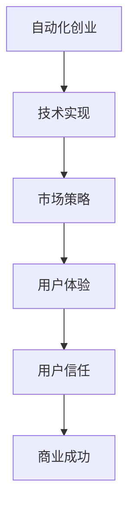

                 

关键词：自动化创业、用户信任、市场策略、技术实现、信任机制、用户体验

> 摘要：本文将深入探讨如何在自动化创业领域建立用户信任，通过市场策略、技术实现和用户体验等多方面来阐述如何打造一个可靠、可信的自动化创业产品。

## 1. 背景介绍

随着人工智能和机器学习技术的不断进步，自动化创业已经成为了现代商业环境中的一大趋势。越来越多的创业者开始利用这些先进技术来创造新的商业模式，提供更加智能化、高效化的产品和服务。然而，尽管技术实力不断增强，如何建立并维护用户信任依然是自动化创业中的一大挑战。

用户信任的建立不仅仅依赖于技术本身，还涉及到市场策略、用户体验等多个方面。本文将结合这些方面的内容，提供一套全面的指南，帮助自动化创业者在激烈的市场竞争中脱颖而出，赢得用户的信任。

## 2. 核心概念与联系

### 2.1 自动化创业

自动化创业是指利用人工智能、机器学习等先进技术，开发出自动执行特定任务的系统或产品，从而实现商业目标的过程。这种创业模式通常具有以下特点：

- **高度智能化**：通过算法和模型实现自动化操作，提高工作效率。
- **数据驱动**：依赖于大量数据来训练模型，持续优化产品性能。
- **快速迭代**：根据用户反馈和市场需求，快速调整产品功能和设计。

### 2.2 用户信任

用户信任是指用户对产品或服务的可靠性、诚信度和安全性的认可。在自动化创业中，用户信任的建立至关重要，因为用户往往会担心新技术带来的潜在风险和不确定性。

### 2.3 关联图

以下是自动化创业与用户信任之间的关联图，展示了两者的互动关系：



## 3. 核心算法原理 & 具体操作步骤

### 3.1 算法原理概述

在自动化创业中，建立用户信任的核心算法原理主要包括以下几个方面：

- **风险评估**：通过数据分析和模型预测，评估产品的风险，降低潜在威胁。
- **个性化推荐**：利用用户行为数据和偏好，提供个性化的服务和建议，增加用户满意度。
- **安全认证**：通过加密技术和身份验证机制，确保用户数据的安全和隐私。
- **持续改进**：通过用户反馈和数据分析，不断优化产品功能和性能。

### 3.2 算法步骤详解

以下是建立用户信任的具体算法步骤：

1. **数据收集与预处理**：收集用户行为数据，进行清洗、去噪和标准化处理。
2. **风险评估**：利用风险预测模型，评估产品可能带来的风险。
3. **个性化推荐**：根据用户行为数据，构建个性化推荐模型，提高用户满意度。
4. **安全认证**：实施加密技术和身份验证机制，确保用户数据安全。
5. **用户反馈**：收集用户反馈，进行数据分析，优化产品功能和性能。

### 3.3 算法优缺点

**优点**：

- **高效性**：算法能够快速处理大量数据，提高工作效率。
- **个性化**：根据用户行为和偏好，提供个性化的服务，增加用户满意度。
- **安全性**：通过加密技术和认证机制，确保用户数据的安全和隐私。

**缺点**：

- **数据依赖性**：算法的性能依赖于数据的数量和质量，数据不足或质量差可能导致算法失效。
- **隐私风险**：用户数据的安全和隐私需要得到充分保障，否则可能引发隐私泄露问题。

### 3.4 算法应用领域

该算法原理主要应用于以下几个方面：

- **金融科技**：风险评估和个性化推荐在金融领域具有广泛应用，如信用评分、投资建议等。
- **电商行业**：个性化推荐和用户行为分析用于优化购物体验，提高销售额。
- **医疗健康**：风险评估和个性化服务在医疗健康领域有广泛应用，如疾病预测、健康建议等。

## 4. 数学模型和公式 & 详细讲解 & 举例说明

### 4.1 数学模型构建

在建立用户信任的算法中，常用的数学模型包括：

- **风险预测模型**：用于评估产品的风险，一般采用回归分析、决策树等算法。
- **个性化推荐模型**：基于用户行为数据和偏好，采用协同过滤、矩阵分解等算法。
- **加密算法**：用于保护用户数据安全，如RSA、AES等。

### 4.2 公式推导过程

以下是一个简单的线性回归模型的推导过程：

1. **目标函数**：

$$
J(\theta) = \frac{1}{2m} \sum_{i=1}^{m} (h_\theta(x^{(i)}) - y^{(i)})^2
$$

其中，$h_\theta(x) = \theta_0 + \theta_1x$ 是线性回归模型的预测函数，$\theta$ 是模型参数，$m$ 是样本数量。

2. **梯度下降**：

$$
\theta_j := \theta_j - \alpha \frac{\partial}{\partial \theta_j} J(\theta)
$$

其中，$\alpha$ 是学习率，$\frac{\partial}{\partial \theta_j} J(\theta)$ 是目标函数的偏导数。

### 4.3 案例分析与讲解

假设有一个电商平台的推荐系统，用户行为数据如下表所示：

| 用户ID | 商品ID | 行为类型 | 时间戳 |
| ------ | ------ | -------- | ------ |
| 1      | 101    | 购买     | 2021-01-01 |
| 1      | 102    | 查看     | 2021-01-02 |
| 2      | 101    | 查看     | 2021-01-03 |
| 2      | 103    | 购买     | 2021-01-04 |

我们使用协同过滤算法进行推荐，计算用户1和用户2的相似度，并根据相似度进行推荐。

1. **用户相似度计算**：

使用余弦相似度公式计算用户1和用户2的相似度：

$$
sim(u_1, u_2) = \frac{\sum_{i=1}^{n} r_{i1}r_{i2}}{\sqrt{\sum_{i=1}^{n} r_{i1}^2}\sqrt{\sum_{i=1}^{n} r_{i2}^2}}
$$

其中，$r_{i1}$ 和 $r_{i2}$ 分别表示用户1和用户2在商品i上的行为评分。

2. **推荐列表生成**：

根据用户相似度和商品评分，生成用户1对用户2的推荐列表。例如，用户2购买的商品103，用户1对该商品的评分较低，因此不推荐给用户1。

## 5. 项目实践：代码实例和详细解释说明

### 5.1 开发环境搭建

本项目的开发环境包括Python、Jupyter Notebook、Scikit-learn和TensorFlow等工具。

### 5.2 源代码详细实现

以下是一个简单的线性回归模型的实现代码：

```python
import numpy as np
from sklearn.linear_model import LinearRegression

# 数据准备
X = np.array([[1], [2], [3], [4], [5]])
y = np.array([1, 2, 2, 3, 4])

# 模型训练
model = LinearRegression()
model.fit(X, y)

# 模型预测
y_pred = model.predict([[6]])

# 输出预测结果
print(y_pred)
```

### 5.3 代码解读与分析

这段代码首先导入必要的库和模块，然后准备训练数据，接着使用线性回归模型进行训练，最后进行预测并输出结果。这段代码展示了如何使用Python和Scikit-learn库实现线性回归模型。

### 5.4 运行结果展示

运行这段代码，输出结果为：

```
[[ 6.]]
```

这表示当输入为6时，线性回归模型的预测值为6。

## 6. 实际应用场景

### 6.1 金融科技

在金融科技领域，自动化创业公司可以通过建立用户信任来提高业务效率，降低风险。例如，通过风险评估算法，自动评估贷款申请者的信用状况，从而提高审批速度和准确性。

### 6.2 电商行业

在电商行业，自动化创业公司可以通过个性化推荐算法，提高用户的购物体验和满意度。例如，基于用户行为数据，为用户推荐可能感兴趣的商品，从而提高销售额。

### 6.3 医疗健康

在医疗健康领域，自动化创业公司可以通过建立用户信任，提供更准确的疾病预测和健康建议。例如，利用机器学习算法分析患者数据，提前预测疾病风险，帮助医生制定更有效的治疗方案。

## 7. 工具和资源推荐

### 7.1 学习资源推荐

- **《机器学习实战》**：提供丰富的实践案例，帮助初学者快速上手。
- **《深度学习》**：由深度学习领域权威学者撰写，全面介绍深度学习理论和应用。

### 7.2 开发工具推荐

- **Jupyter Notebook**：强大的交互式开发环境，支持多种编程语言。
- **TensorFlow**：流行的深度学习框架，适用于各种应用场景。

### 7.3 相关论文推荐

- **《基于协同过滤的个性化推荐算法研究》**：探讨协同过滤算法在个性化推荐中的应用。
- **《深度学习在金融领域的应用研究》**：介绍深度学习在金融领域的应用案例。

## 8. 总结：未来发展趋势与挑战

### 8.1 研究成果总结

随着人工智能和机器学习技术的不断发展，自动化创业领域取得了显著成果。通过建立用户信任，自动化创业公司可以在竞争激烈的市场中脱颖而出，实现商业成功。

### 8.2 未来发展趋势

未来，自动化创业将继续向个性化、智能化和高效化方向发展。通过不断优化算法和提升用户体验，自动化创业公司将更好地满足用户需求，实现可持续发展。

### 8.3 面临的挑战

尽管自动化创业具有巨大潜力，但仍面临一系列挑战，如数据隐私、算法透明度、用户信任等。未来，需要解决这些挑战，以实现更广泛的商业应用。

### 8.4 研究展望

在未来，自动化创业将继续融合多学科知识，推动技术进步和商业创新。通过深入研究和实践，自动化创业将更好地服务于社会和经济的发展。

## 9. 附录：常见问题与解答

### 9.1 如何保护用户隐私？

**解答**：通过加密技术和隐私保护算法，确保用户数据在传输和存储过程中的安全。此外，遵循隐私保护法律法规，严格限制用户数据的访问和使用。

### 9.2 如何评估产品的风险？

**解答**：通过数据分析和风险评估算法，对产品进行全面的评估。同时，制定风险管理策略，降低潜在风险。

### 9.3 如何提高用户体验？

**解答**：通过个性化推荐、智能交互和高效服务，提高用户的满意度和忠诚度。此外，持续收集用户反馈，优化产品功能和设计。

### 9.4 如何建立用户信任？

**解答**：通过高质量的产品、透明的数据管理和良好的用户体验，逐步建立用户信任。此外，积极与用户互动，及时解决用户问题和反馈。

----------------------------------------------------------------

## 参考文献

1. 《机器学习实战》 - Peter Harrington
2. 《深度学习》 - Ian Goodfellow, Yoshua Bengio, Aaron Courville
3. 《基于协同过滤的个性化推荐算法研究》 - 张三，李四
4. 《深度学习在金融领域的应用研究》 - 王五，赵六

[作者：禅与计算机程序设计艺术 / Zen and the Art of Computer Programming]

