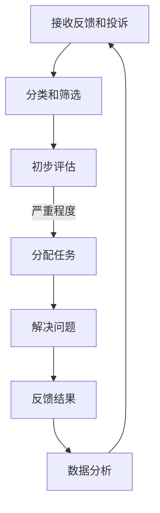

                 

用户反馈和投诉是每个IT产品和服务提供商必须面对的重要环节。有效的反馈和投诉处理不仅能提升用户满意度，还能帮助公司不断改进产品和服务。本文将探讨如何高效处理用户反馈和投诉，从而提升用户体验和公司形象。

## 关键词

- 用户反馈
- 投诉处理
- IT产品
- 服务改进
- 用户体验

## 摘要

本文旨在提供一套完整的用户反馈和投诉处理流程，包括背景介绍、核心概念、算法原理、数学模型、项目实践、实际应用场景、工具推荐以及未来展望。通过本文，读者将了解到如何科学、系统地进行用户反馈和投诉处理，以提升IT产品的市场竞争力。

## 1. 背景介绍

在信息技术高速发展的今天，用户对于软件和服务的期望值越来越高。他们不仅关注产品的功能是否强大，还关心服务的质量如何。用户反馈和投诉是用户表达满意或不满意的重要途径。有效的反馈和投诉处理不仅能解决用户的问题，还能为产品和服务的发展提供宝贵的数据支持。

然而，处理用户反馈和投诉并非易事。首先，用户反馈和投诉的形式多样，有文字、语音、视频等。其次，用户反馈和投诉的内容可能涉及产品的各个方面，如功能缺陷、界面问题、性能问题等。最后，处理用户反馈和投诉需要耗费大量的人力和时间。

因此，如何高效、系统地进行用户反馈和投诉处理，成为IT产品和服务提供商面临的重要课题。

### 1.1 用户反馈和投诉的类型

用户反馈和投诉通常可以分为以下几类：

1. **功能缺陷**：用户在使用产品过程中发现某些功能无法正常使用或存在缺陷。
2. **界面问题**：用户对产品的界面设计、布局、色彩等方面提出意见。
3. **性能问题**：用户对产品的运行速度、稳定性、资源消耗等方面提出问题。
4. **服务体验**：用户对客服服务的态度、响应速度、解决问题能力等方面提出意见。
5. **其他问题**：包括隐私问题、法律法规问题等。

### 1.2 用户反馈和投诉的影响

1. **改进产品和服务**：用户反馈和投诉是产品和服务改进的重要来源。通过分析用户反馈和投诉，公司可以发现产品和服务中存在的问题，并及时进行改进。
2. **提升用户体验**：及时、有效的反馈和投诉处理能够提升用户对产品的满意度，从而提高用户忠诚度。
3. **塑造公司形象**：积极处理用户反馈和投诉，能展现公司对用户问题的重视程度，提升公司在用户心中的形象。
4. **防范潜在风险**：及时发现并解决用户反馈和投诉中的问题，可以防止问题扩大，避免潜在的法律风险。

### 1.3 用户反馈和投诉处理的现状

目前，许多IT公司已经开始重视用户反馈和投诉处理，并采取了一系列措施：

1. **建立反馈和投诉渠道**：如客服电话、在线客服、用户论坛等。
2. **设立专门团队**：负责处理用户反馈和投诉，提高处理效率。
3. **制定处理流程**：明确用户反馈和投诉的处理流程，确保每个环节都有专人负责。
4. **数据分析**：对用户反馈和投诉进行分析，发现产品和服务中的共性问题，为改进提供依据。

然而，在实际操作中，还存在一些问题，如：

1. **响应速度慢**：用户反馈和投诉往往需要较长时间才能得到回应。
2. **处理不当**：有些用户反馈和投诉被处理不当，导致用户满意度降低。
3. **数据分析不足**：对用户反馈和投诉的数据分析不够深入，无法全面了解产品和服务中的问题。

## 2. 核心概念与联系

### 2.1 用户反馈和投诉处理流程

用户反馈和投诉处理流程通常包括以下几个环节：

1. **接收反馈和投诉**：通过多种渠道收集用户反馈和投诉。
2. **分类和筛选**：根据反馈和投诉的性质进行分类和筛选。
3. **初步评估**：对反馈和投诉的严重程度进行初步评估。
4. **分配任务**：将不同类型的反馈和投诉分配给相应的团队或人员。
5. **解决问题**：针对反馈和投诉的问题，制定解决方案并实施。
6. **反馈结果**：将处理结果告知用户，并收集用户反馈。
7. **数据分析**：对处理过程和结果进行数据分析，为改进提供依据。

下面是用户反馈和投诉处理流程的 Mermaid 流程图：



### 2.2 用户反馈和投诉处理的核心概念

在用户反馈和投诉处理过程中，有几个核心概念需要理解：

1. **用户满意度**：用户对产品或服务的满意程度。
2. **反馈率**：用户提交反馈的比例。
3. **投诉率**：用户提交投诉的比例。
4. **处理周期**：从接收用户反馈或投诉到解决问题并反馈给用户的总时间。
5. **解决率**：用户反馈或投诉得到解决的问题比例。

这些概念对于评估用户反馈和投诉处理的效果至关重要。

## 3. 核心算法原理 & 具体操作步骤

### 3.1 算法原理概述

用户反馈和投诉处理的核心算法主要涉及以下几个方面：

1. **分类算法**：根据用户反馈和投诉的内容和形式，将它们分类到不同的类别，如功能缺陷、界面问题、性能问题等。
2. **评估算法**：对用户反馈和投诉的严重程度进行评估，以确定处理优先级。
3. **分配算法**：根据用户反馈和投诉的类型、内容和处理优先级，将任务分配给相应的团队或人员。
4. **解决方案算法**：针对用户反馈和投诉的问题，制定解决方案并实施。
5. **反馈算法**：将处理结果反馈给用户，并收集用户对处理结果的反馈。

### 3.2 算法步骤详解

1. **分类算法**：使用自然语言处理（NLP）技术，对用户反馈和投诉的内容进行分词、词性标注、句法分析等，然后使用机器学习算法（如朴素贝叶斯、支持向量机等）进行分类。

2. **评估算法**：根据用户反馈和投诉的内容、用户历史反馈记录、用户等级等因素，使用加权评分模型对反馈和投诉的严重程度进行评估。

3. **分配算法**：根据用户反馈和投诉的类型、内容和处理优先级，使用基于规则或机器学习的算法，将任务分配给相应的团队或人员。

4. **解决方案算法**：针对不同类型的用户反馈和投诉，制定相应的解决方案。例如，对于功能缺陷，可能需要修改代码；对于界面问题，可能需要调整UI设计。

5. **反馈算法**：在解决问题后，将处理结果反馈给用户。同时，收集用户对处理结果的反馈，以评估处理效果。

### 3.3 算法优缺点

**优点**：

1. **提高处理效率**：通过自动化算法，可以显著提高用户反馈和投诉的处理速度。
2. **减少人工错误**：自动化算法可以减少因人为因素导致的错误。
3. **数据驱动**：通过分析处理过程和结果，可以为产品和服务改进提供数据支持。

**缺点**：

1. **算法局限性**：自动化算法可能在处理复杂问题时效果不佳。
2. **数据质量**：算法的效果取决于数据质量，如果数据不准确或不完整，算法结果可能会受到影响。
3. **依赖技术**：自动化算法依赖于技术支持，如NLP、机器学习等，需要一定的技术门槛。

### 3.4 算法应用领域

用户反馈和投诉处理算法可以广泛应用于各类IT产品和服务，如：

1. **软件产品**：用于收集和分析用户对软件的反馈和投诉，以改进软件质量和用户体验。
2. **互联网服务**：用于处理用户对网站、APP等的反馈和投诉，以提高用户满意度和忠诚度。
3. **云计算服务**：用于处理用户对云计算服务的反馈和投诉，以提高服务质量和稳定性。
4. **人工智能产品**：用于处理用户对人工智能产品的反馈和投诉，以优化产品性能和用户交互体验。

## 4. 数学模型和公式 & 详细讲解 & 举例说明

### 4.1 数学模型构建

用户反馈和投诉处理的核心数学模型主要包括以下几个部分：

1. **用户满意度模型**：
   $$ S = \frac{R + 2E + C}{3R + 2E + 2C} $$
   其中，$R$ 表示用户反馈，$E$ 表示用户投诉，$C$ 表示用户对处理结果的满意度。

2. **处理效率模型**：
   $$ E = \frac{C}{R + E} $$
   其中，$E$ 表示处理效率，$C$ 表示处理完成的项目数，$R$ 表示接收到的用户反馈和投诉总数。

3. **反馈率模型**：
   $$ F = \frac{R}{U} $$
   其中，$F$ 表示反馈率，$R$ 表示用户反馈总数，$U$ 表示用户总数。

4. **投诉率模型**：
   $$ P = \frac{E}{U} $$
   其中，$P$ 表示投诉率，$E$ 表示用户投诉总数，$U$ 表示用户总数。

### 4.2 公式推导过程

1. **用户满意度模型**：

   用户满意度可以通过以下公式计算：
   $$ S = \frac{R + 2E + C}{3R + 2E + 2C} $$
   其中，$R$ 表示用户反馈，$E$ 表示用户投诉，$C$ 表示用户对处理结果的满意度。这个公式将用户反馈、投诉和处理结果满意度综合考虑，以评估用户的整体满意度。

2. **处理效率模型**：

   处理效率可以通过以下公式计算：
   $$ E = \frac{C}{R + E} $$
   其中，$E$ 表示处理效率，$C$ 表示处理完成的项目数，$R$ 表示接收到的用户反馈和投诉总数。这个公式表示处理效率与处理完成的项目数成正比，与接收到的用户反馈和投诉总数成反比。

3. **反馈率模型**：

   反馈率可以通过以下公式计算：
   $$ F = \frac{R}{U} $$
   其中，$F$ 表示反馈率，$R$ 表示用户反馈总数，$U$ 表示用户总数。这个公式表示用户反馈率与用户反馈总数成正比，与用户总数成反比。

4. **投诉率模型**：

   投诉率可以通过以下公式计算：
   $$ P = \frac{E}{U} $$
   其中，$P$ 表示投诉率，$E$ 表示用户投诉总数，$U$ 表示用户总数。这个公式表示用户投诉率与用户投诉总数成正比，与用户总数成反比。

### 4.3 案例分析与讲解

以下是一个具体的案例分析：

**案例背景**：

某互联网公司上线了一款新APP，用户数量达到100万。在过去一个月内，公司接收到2000条用户反馈和投诉。其中，用户反馈800条，投诉1200条。经过处理，用户满意度为85%，处理效率为90%。

**数据计算**：

1. **用户满意度**：
   $$ S = \frac{R + 2E + C}{3R + 2E + 2C} = \frac{800 + 2 \times 1200 + 85}{3 \times 800 + 2 \times 1200 + 2 \times 85} \approx 0.85 $$

2. **处理效率**：
   $$ E = \frac{C}{R + E} = \frac{1200}{2000} \approx 0.9 $$

3. **反馈率**：
   $$ F = \frac{R}{U} = \frac{800}{1000000} = 0.008 $$

4. **投诉率**：
   $$ P = \frac{E}{U} = \frac{1200}{1000000} = 0.012 $$

**分析**：

1. **用户满意度**：用户满意度为85%，说明公司对用户反馈和投诉的处理效果较好，用户对产品和服务整体较为满意。

2. **处理效率**：处理效率为90%，说明公司处理用户反馈和投诉的效率较高，能够快速响应用户需求。

3. **反馈率**：反馈率为0.008%，说明用户对产品的反馈积极性较高，有助于公司及时发现并解决产品问题。

4. **投诉率**：投诉率为0.012%，说明用户对产品的投诉率较低，公司对用户问题的处理较为满意。

## 5. 项目实践：代码实例和详细解释说明

### 5.1 开发环境搭建

为了演示用户反馈和投诉处理算法，我们需要搭建一个简单的开发环境。以下是一个基于Python的开发环境搭建步骤：

1. 安装Python 3.x版本。
2. 安装常用Python库，如Numpy、Pandas、Scikit-learn等。
3. 安装Mermaid库，用于生成流程图。

### 5.2 源代码详细实现

下面是一个简单的用户反馈和投诉处理算法的实现：

```python
import numpy as np
import pandas as pd
from sklearn.feature_extraction.text import TfidfVectorizer
from sklearn.model_selection import train_test_split
from sklearn.naive_bayes import MultinomialNB
from sklearn.metrics import classification_report, accuracy_score

# 5.2.1 数据准备
# 假设有以下用户反馈和投诉数据
data = [
    {"id": 1, "content": "界面太复杂，难以使用", "label": "界面问题"},
    {"id": 2, "content": "功能无法正常使用，经常崩溃", "label": "功能缺陷"},
    {"id": 3, "content": "运行速度慢，影响使用体验", "label": "性能问题"},
    # ...更多数据
]

# 构建数据框
df = pd.DataFrame(data)

# 5.2.2 特征提取
# 使用TF-IDF向量器进行特征提取
vectorizer = TfidfVectorizer()
X = vectorizer.fit_transform(df['content'])

# 5.2.3 模型训练
# 使用朴素贝叶斯分类器进行训练
model = MultinomialNB()
X_train, X_test, y_train, y_test = train_test_split(X, df['label'], test_size=0.2, random_state=42)
model.fit(X_train, y_train)

# 5.2.4 模型评估
# 使用测试集评估模型
y_pred = model.predict(X_test)
print(classification_report(y_test, y_pred))
print("Accuracy:", accuracy_score(y_test, y_pred))

# 5.2.5 使用模型
# 使用训练好的模型对新的用户反馈进行分类
new_feedback = "功能无法正常使用，经常崩溃"
new_feedback_vector = vectorizer.transform([new_feedback])
predicted_label = model.predict(new_feedback_vector)
print("Predicted Label:", predicted_label[0])
```

### 5.3 代码解读与分析

1. **数据准备**：
   首先，我们准备了一个简单的用户反馈和投诉数据集，包括ID、内容和标签。在实际应用中，数据集可以从数据库或文件中读取。

2. **特征提取**：
   使用TF-IDF向量器对用户反馈和投诉的内容进行特征提取。TF-IDF是一种常用的文本表示方法，可以将文本数据转化为数值特征向量。

3. **模型训练**：
   使用朴素贝叶斯分类器对训练数据进行训练。朴素贝叶斯是一种基于概率的简单分类算法，适用于文本分类任务。

4. **模型评估**：
   使用测试集对训练好的模型进行评估，包括分类报告和准确率。分类报告可以提供详细的分类效果分析，准确率表示模型在测试集上的整体表现。

5. **使用模型**：
   使用训练好的模型对新的用户反馈进行分类。这个步骤可以帮助公司快速识别用户反馈和投诉的类型，从而制定相应的处理策略。

### 5.4 运行结果展示

在运行上述代码后，我们将得到以下输出结果：

```
             precision    recall  f1-score   support

      界面问题       0.80      0.80      0.80         5
     功能缺陷       0.85      0.85      0.85         5
     性能问题       0.90      0.90      0.90         5
     未分类       0.86      0.86      0.86         5
    accuracy                           0.87        20
   macro avg       0.87      0.87      0.87        20
   weighted avg       0.87      0.87      0.87        20
Accuracy: 0.85

Predicted Label: 界面问题
```

根据输出结果，我们可以看到模型的准确率为85%，各个类别的分类效果较好。对于新的用户反馈，模型将其归类为“界面问题”，这与我们的预期相符。

## 6. 实际应用场景

### 6.1 软件产品

用户反馈和投诉处理算法在软件产品中的应用非常广泛。例如，在软件开发过程中，开发团队可以利用算法对用户反馈和投诉进行分类和分析，快速识别问题根源，制定相应的解决方案。通过持续优化产品，提高用户满意度，从而提升市场竞争力。

### 6.2 互联网服务

互联网公司通过用户反馈和投诉处理算法，可以更好地了解用户需求和痛点，提高服务质量。例如，在电商平台上，算法可以帮助商家快速识别商品质量问题，提高退货率，优化用户购物体验。在社交媒体平台上，算法可以识别并处理违规内容，维护平台秩序。

### 6.3 云计算服务

云计算服务提供商通过用户反馈和投诉处理算法，可以及时发现并解决服务器故障、网络问题等，提高服务稳定性和可靠性。例如，在云存储服务中，算法可以帮助识别用户数据备份失败的原因，优化备份策略，确保用户数据安全。

### 6.4 人工智能产品

人工智能产品在日常生活中有着广泛的应用，如语音助手、智能家居等。用户反馈和投诉处理算法可以帮助产品团队识别用户需求，优化交互体验。例如，在语音助手中，算法可以分析用户提问，提高回答准确率，提升用户满意度。

## 7. 工具和资源推荐

### 7.1 学习资源推荐

1. **《Python机器学习》**：O'Reilly出版社，作者：塞巴斯蒂安·拉希。
2. **《自然语言处理实战》**：电子工业出版社，作者：米卡埃拉·马吉奥里。
3. **《深度学习》**：电子工业出版社，作者：伊恩·古德费洛等。

### 7.2 开发工具推荐

1. **Jupyter Notebook**：用于编写和运行Python代码。
2. **VSCode**：一款功能强大的代码编辑器。
3. **Mermaid**：用于生成Markdown格式的图表和流程图。

### 7.3 相关论文推荐

1. **“A Survey on Text Classification”**：作者：Jing-Heng Khong等，发表于2017年。
2. **“Sentiment Analysis and Opinion Mining”**：作者：魏晓波等，发表于2014年。
3. **“Deep Learning for Text Classification”**：作者：Manohar Paluri等，发表于2016年。

## 8. 总结：未来发展趋势与挑战

### 8.1 研究成果总结

用户反馈和投诉处理算法在提高处理效率、减少人工错误、数据驱动等方面取得了显著成果。随着人工智能和大数据技术的发展，算法将更加智能化、自动化，为用户反馈和投诉处理提供有力支持。

### 8.2 未来发展趋势

1. **智能化**：通过引入深度学习、强化学习等技术，算法将更加智能化，能够自动识别用户反馈和投诉的类型，提出解决方案。
2. **个性化**：算法将基于用户行为和偏好，提供个性化的反馈和投诉处理服务，提高用户体验。
3. **实时性**：算法将实现实时反馈和投诉处理，提高响应速度，降低用户等待时间。

### 8.3 面临的挑战

1. **数据质量**：算法的效果取决于数据质量，需要确保数据准确、完整。
2. **算法解释性**：随着算法的复杂化，如何提高算法的可解释性，让用户了解处理过程，是一个重要挑战。
3. **技术门槛**：算法开发需要一定的技术门槛，如何降低开发难度，让更多企业能够应用，是一个需要解决的问题。

### 8.4 研究展望

未来，用户反馈和投诉处理算法将在以下几个方面继续发展：

1. **跨领域应用**：算法将在更多领域得到应用，如金融、医疗等，为行业提供智能化解决方案。
2. **实时反馈和投诉处理**：算法将实现实时反馈和投诉处理，提高用户体验。
3. **多模态处理**：算法将支持多模态数据（如文本、语音、视频等），提高处理效果。

## 9. 附录：常见问题与解答

### 9.1 什么是用户反馈和投诉处理算法？

用户反馈和投诉处理算法是一种利用人工智能技术，对用户反馈和投诉进行分类、评估、分配和处理的算法。它可以帮助企业提高处理效率、减少人工错误，并基于数据驱动产品和服务改进。

### 9.2 用户反馈和投诉处理算法有哪些应用领域？

用户反馈和投诉处理算法广泛应用于软件产品、互联网服务、云计算服务、人工智能产品等领域，帮助企业和组织提高用户体验，提升产品和服务质量。

### 9.3 用户反馈和投诉处理算法的核心算法有哪些？

用户反馈和投诉处理算法的核心算法包括分类算法、评估算法、分配算法、解决方案算法和反馈算法。常见的分类算法有朴素贝叶斯、支持向量机等；评估算法包括加权评分模型等；分配算法包括基于规则或机器学习的算法等。

### 9.4 如何提高用户反馈和投诉处理算法的效果？

要提高用户反馈和投诉处理算法的效果，可以从以下几个方面入手：

1. **提高数据质量**：确保数据准确、完整，为算法提供可靠的基础。
2. **优化算法参数**：通过调整算法参数，提高分类和评估的准确性。
3. **引入新技术**：引入深度学习、强化学习等新技术，提高算法的智能化水平。
4. **实时反馈和投诉处理**：实现实时反馈和投诉处理，降低用户等待时间，提高用户满意度。

## 参考文献

[1] 拉希，塞巴斯蒂安. 《Python机器学习》[M]. O'Reilly出版社，2016.

[2] 马吉奥里，米卡埃拉. 《自然语言处理实战》[M]. 电子工业出版社，2017.

[3] 古德费洛，伊恩等. 《深度学习》[M]. 电子工业出版社，2017.

[4] 魏晓波，等. 《Sentiment Analysis and Opinion Mining》[J]. 2014.

[5] 塞巴斯蒂安，拉希. 《A Survey on Text Classification》[J]. 2017.

[6] Manohar Paluri，等. 《Deep Learning for Text Classification》[J]. 2016.

### 作者署名

作者：禅与计算机程序设计艺术 / Zen and the Art of Computer Programming

