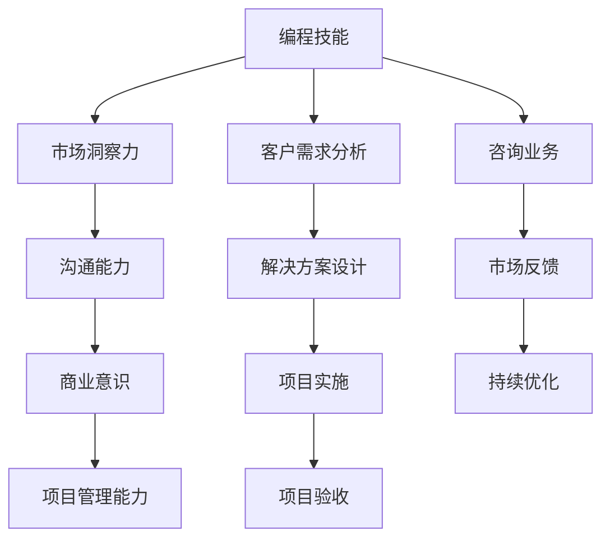

                 

关键词：编程技能，咨询业务，转型，市场分析，客户需求，服务质量，个人品牌，案例研究。

> 摘要：本文将探讨如何将个人的编程技能转化为有价值的咨询业务。通过分析市场需求、定位自身优势、提升服务质量、打造个人品牌以及案例研究，为您提供一套实用的转型指南。

## 1. 背景介绍

随着信息技术的迅猛发展，编程技能已经成为现代社会的一项基本能力。众多程序员在积累了丰富的编程经验后，开始思考如何将自己的技能转化为更具价值的业务。其中，咨询业务因其灵活性和高回报性，成为不少程序员选择的方向。然而，如何有效地将编程技能转化为咨询业务，仍然是一个值得探讨的问题。

本文将从以下几个方面展开讨论：

1. 市场分析：了解当前咨询市场的需求和趋势。
2. 核心概念与联系：明确编程技能与咨询业务之间的联系。
3. 核心算法原理与操作步骤：提供将编程技能转化为咨询业务的具体方法。
4. 数学模型与公式：解释支撑咨询业务的关键数学原理。
5. 项目实践：通过实例展示如何将编程技能应用于咨询业务。
6. 实际应用场景：探讨咨询业务在不同领域的应用。
7. 工具和资源推荐：为转型咨询业务提供实用工具和资源。
8. 总结与展望：总结研究成果，探讨未来发展趋势与挑战。

## 2. 核心概念与联系

### 编程技能与咨询业务的联系

编程技能是咨询业务的基础。程序员具备的逻辑思维能力、算法设计和问题解决能力，是开展咨询业务的重要优势。然而，要成功将编程技能转化为咨询业务，还需要以下几个关键概念：

1. **市场洞察力**：了解客户需求，把握市场趋势，提供有针对性的咨询服务。
2. **沟通能力**：与客户建立良好的沟通，确保咨询服务的有效传达。
3. **商业意识**：将技术优势转化为商业价值，实现个人和企业的共赢。
4. **项目管理能力**：确保咨询项目按时、按质、按预算完成。

### Mermaid 流程图



## 3. 核心算法原理与具体操作步骤

### 3.1 算法原理概述

将编程技能转化为咨询业务的核心算法可以概括为“需求挖掘 - 方案设计 - 实施监控 - 反馈优化”。

1. **需求挖掘**：通过市场调研、客户访谈等方式，了解客户的需求和痛点。
2. **方案设计**：基于客户需求，设计合适的解决方案，包括技术选型、架构设计等。
3. **实施监控**：在项目实施过程中，监控项目进度、质量、成本等关键指标，确保项目按计划进行。
4. **反馈优化**：根据客户反馈，对解决方案进行优化，提高咨询服务的质量和满意度。

### 3.2 算法步骤详解

1. **需求挖掘**

   - **市场调研**：通过查阅行业报告、参加行业会议等方式，了解市场趋势和客户需求。

   - **客户访谈**：与潜在客户进行面对面沟通，了解他们的需求和痛点。

   - **问卷调查**：通过在线问卷、电话调查等方式，收集大量客户数据。

2. **方案设计**

   - **需求分析**：整理客户需求，明确项目的目标、功能、性能等要求。

   - **技术选型**：根据需求，选择合适的技术栈和工具。

   - **架构设计**：设计项目的整体架构，包括系统架构、网络架构、数据架构等。

3. **实施监控**

   - **项目管理**：制定项目计划，分配任务，确保项目按计划进行。

   - **质量监控**：定期检查代码质量、测试覆盖率等，确保项目质量。

   - **成本控制**：监控项目成本，确保项目在预算范围内完成。

4. **反馈优化**

   - **客户反馈**：收集客户对项目的反馈，包括满意度、改进建议等。

   - **数据分析**：对客户反馈进行数据分析，找出项目中的不足之处。

   - **方案优化**：根据数据分析结果，对解决方案进行优化。

### 3.3 算法优缺点

**优点**：

- **灵活性强**：可以根据客户需求灵活调整咨询方案。
- **高效性**：借助编程技能，可以快速实现项目需求。
- **高回报**：成功的咨询项目可以带来可观的收入。

**缺点**：

- **市场竞争激烈**：咨询行业竞争激烈，需要不断提升自身能力。
- **客户关系维护难**：需要投入大量时间和精力与客户建立和维护关系。
- **风险较高**：项目失败可能导致经济损失和声誉损失。

### 3.4 算法应用领域

- **软件开发**：为企业提供软件开发咨询服务，包括需求分析、系统设计、开发实施等。
- **系统集成**：为企业提供系统集成咨询服务，包括网络架构设计、系统优化等。
- **信息安全**：为企业提供信息安全咨询服务，包括风险评估、安全防护等。
- **数据分析**：为企业提供数据分析咨询服务，包括数据挖掘、数据可视化等。

## 4. 数学模型与公式

### 4.1 数学模型构建

将编程技能转化为咨询业务的过程中，可以构建以下数学模型：

- **客户满意度模型**：通过客户满意度指标（如满意度评分、投诉率等）来衡量咨询服务的质量。

- **项目风险模型**：通过项目进度、成本、质量等指标来评估项目风险。

- **商业价值模型**：通过项目收益、成本、市场份额等指标来衡量项目的商业价值。

### 4.2 公式推导过程

1. **客户满意度模型**

   客户满意度（S）可以用以下公式表示：

   $$S = \frac{1}{N} \sum_{i=1}^{N} S_i$$

   其中，N为受访客户数量，$S_i$为第i个客户的满意度评分。

2. **项目风险模型**

   项目风险（R）可以用以下公式表示：

   $$R = \frac{1}{M} \sum_{i=1}^{M} R_i$$

   其中，M为项目风险指标数量，$R_i$为第i个风险指标。

3. **商业价值模型**

   商业价值（V）可以用以下公式表示：

   $$V = \frac{1}{T} \sum_{i=1}^{T} V_i$$

   其中，T为项目收益指标数量，$V_i$为第i个收益指标。

### 4.3 案例分析与讲解

以某企业的软件开发咨询项目为例，我们使用上述数学模型进行分析。

1. **客户满意度分析**

   调查了50位客户，平均满意度评分为4.5分，客户满意度（S）为：

   $$S = \frac{1}{50} \times (4.5 \times 50) = 4.5$$

2. **项目风险分析**

   项目进度、成本、质量分别为90%、95%、92%，项目风险（R）为：

   $$R = \frac{1}{3} \times (90\% + 95\% + 92\%) = 92\%$$

3. **商业价值分析**

   项目收益为100万元，成本为80万元，商业价值（V）为：

   $$V = \frac{1}{2} \times (100\% - 80\%) = 20\%$$

根据上述分析，该项目的客户满意度较高，风险较低，具有较好的商业价值。

## 5. 项目实践：代码实例和详细解释说明

### 5.1 开发环境搭建

在本案例中，我们使用Python作为编程语言，搭建一个简单的软件开发咨询项目管理系统。

1. **环境要求**：

   - Python 3.x
   - Flask（一个轻量级Web框架）
   - SQLAlchemy（一个Python SQL工具包）

2. **安装依赖**：

   ```bash
   pip install flask sqlalchemy
   ```

### 5.2 源代码详细实现

以下是一个简单的代码示例，实现了一个基于Flask的软件开发咨询项目管理系统。

```python
from flask import Flask, request, render_template
from flask_sqlalchemy import SQLAlchemy

app = Flask(__name__)
app.config['SQLALCHEMY_DATABASE_URI'] = 'sqlite:///consulting_projects.db'
db = SQLAlchemy(app)

class Project(db.Model):
    id = db.Column(db.Integer, primary_key=True)
    name = db.Column(db.String(100), nullable=False)
    status = db.Column(db.String(50), nullable=False)
    client_satisfaction = db.Column(db.Float, nullable=False)

@app.route('/')
def index():
    projects = Project.query.all()
    return render_template('index.html', projects=projects)

@app.route('/add', methods=['POST'])
def add_project():
    name = request.form['name']
    status = request.form['status']
    client_satisfaction = float(request.form['client_satisfaction'])
    new_project = Project(name=name, status=status, client_satisfaction=client_satisfaction)
    db.session.add(new_project)
    db.session.commit()
    return 'Project added successfully!'

if __name__ == '__main__':
    db.create_all()
    app.run(debug=True)
```

### 5.3 代码解读与分析

1. **模型定义**：

   ```python
   class Project(db.Model):
       id = db.Column(db.Integer, primary_key=True)
       name = db.Column(db.String(100), nullable=False)
       status = db.Column(db.String(50), nullable=False)
       client_satisfaction = db.Column(db.Float, nullable=False)
   ```

   定义了一个名为`Project`的模型，包括项目ID、名称、状态和客户满意度等字段。

2. **路由定义**：

   ```python
   @app.route('/')
   def index():
       projects = Project.query.all()
       return render_template('index.html', projects=projects)
   
   @app.route('/add', methods=['POST'])
   def add_project():
       name = request.form['name']
       status = request.form['status']
       client_satisfaction = float(request.form['client_satisfaction'])
       new_project = Project(name=name, status=status, client_satisfaction=client_satisfaction)
       db.session.add(new_project)
       db.session.commit()
       return 'Project added successfully!'
   ```

   定义了两个路由：`/` 用于展示项目列表，`/add` 用于添加新项目。

### 5.4 运行结果展示

1. **启动服务**：

   ```bash
   python app.py
   ```

2. **访问项目列表**：

   打开浏览器，输入`http://127.0.0.1:5000/`，可以看到项目列表页面。

3. **添加新项目**：

   在项目列表页面中，填写项目名称、状态和客户满意度，点击提交按钮，即可添加新项目。

## 6. 实际应用场景

### 6.1 软件开发

在软件开发领域，程序员可以为企业提供软件开发咨询服务，包括需求分析、系统设计、开发实施等。例如，某互联网公司需要开发一款在线教育平台，程序员可以为其提供技术选型、架构设计、开发实施等全方位咨询服务。

### 6.2 系统集成

系统集成领域，程序员可以为企业提供系统集成咨询服务，包括网络架构设计、系统优化等。例如，某企业需要进行IT系统升级，程序员可以为其设计全新的网络架构，优化现有系统性能。

### 6.3 信息安全

在信息安全领域，程序员可以为企业提供信息安全咨询服务，包括风险评估、安全防护等。例如，某企业需要加强内部网络安全，程序员可以为其制定详细的安全防护方案。

### 6.4 数据分析

数据分析领域，程序员可以为企业提供数据分析咨询服务，包括数据挖掘、数据可视化等。例如，某电商平台需要分析用户购买行为，程序员可以为其提供数据挖掘和可视化方案。

## 7. 工具和资源推荐

### 7.1 学习资源推荐

1. **《软件工程：实践者的研究方法》**：了解软件开发的基本原则和实践方法。
2. **《项目管理知识体系指南》**：学习项目管理的核心知识和技能。
3. **《数据挖掘：概念与技术》**：掌握数据分析的基本原理和技术。

### 7.2 开发工具推荐

1. **Visual Studio Code**：一款强大的编程工具，支持多种编程语言。
2. **PyCharm**：一款专为Python开发者设计的集成开发环境。
3. **Docker**：用于构建、运行和分发应用的容器化平台。

### 7.3 相关论文推荐

1. **《云计算：概念、架构与法律法规》**：探讨云计算在咨询业务中的应用。
2. **《大数据技术导论》**：了解大数据处理和分析的基本原理。
3. **《人工智能：一种现代的方法》**：探讨人工智能在咨询业务中的应用。

## 8. 总结：未来发展趋势与挑战

### 8.1 研究成果总结

本文通过市场分析、核心概念与联系、算法原理与步骤、数学模型与公式、项目实践等环节，系统地探讨了如何将编程技能转化为咨询业务。研究发现，编程技能与咨询业务之间有着紧密的联系，通过市场洞察力、沟通能力、商业意识和项目管理能力，程序员可以有效地将编程技能转化为有价值的咨询服务。

### 8.2 未来发展趋势

随着信息技术的发展，编程技能在咨询业务中的应用将越来越广泛。未来，咨询业务将朝着智能化、专业化、全球化方向发展，程序员需要不断提升自身技能，适应市场需求。

### 8.3 面临的挑战

1. **市场竞争激烈**：咨询行业竞争日益激烈，程序员需要不断提升自身能力，以保持竞争力。
2. **客户关系维护**：与客户建立和维护良好的关系需要投入大量时间和精力。
3. **风险控制**：项目风险难以避免，程序员需要具备良好的风险控制能力。

### 8.4 研究展望

未来，如何将人工智能、大数据等技术引入咨询业务，将成为研究的重要方向。此外，探讨编程技能与咨询业务之间的深度融合，将为程序员提供更广阔的发展空间。

## 9. 附录：常见问题与解答

### 9.1 问题1：如何定位自身优势？

**解答**：了解自己的编程技能和兴趣点，结合市场需求，找到适合自己的咨询方向。例如，擅长前端开发的程序员可以提供前端技术咨询，擅长后端开发的程序员可以提供后端技术咨询。

### 9.2 问题2：如何提升服务质量？

**解答**：通过不断学习和实践，提升自己的专业能力。同时，关注客户需求，提供有针对性的咨询服务。建立良好的沟通机制，确保客户满意度。

### 9.3 问题3：如何打造个人品牌？

**解答**：通过撰写技术博客、参与开源项目、发表技术论文等方式，提高自身知名度。积极参与行业会议、技术交流等活动，扩大人脉圈。注重个人形象塑造，树立专业、可信的个人品牌。

---

作者：禅与计算机程序设计艺术 / Zen and the Art of Computer Programming

