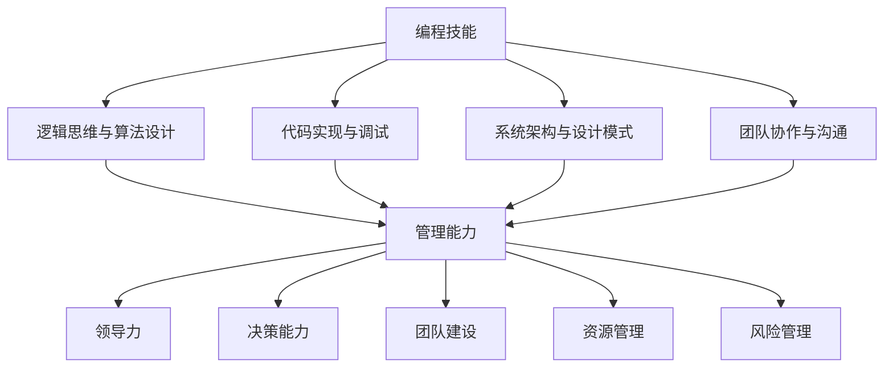

                 

  
## 1. 背景介绍

编程作为计算机科学的核心领域，对现代社会的方方面面产生了深远影响。从软件开发到数据分析，从系统架构到网络安全，编程技能成为了众多领域不可或缺的一部分。然而，随着时间的推移，越来越多的程序员开始涉足管理领域，希望将自己的技术优势转化为管理效能。这种转型不仅丰富了个人职业发展路径，也为团队和组织带来了新的活力和创造力。

编程和管理虽然看似截然不同的领域，但它们之间却存在着深刻的联系。编程需要逻辑思维、问题解决能力和团队协作，这些能力在管理中同样至关重要。管理不仅仅是指导和监督他人，更是通过策略制定、资源配置和团队激励来达成组织目标。而编程中的模块化设计、代码优化和问题追踪等技巧，对于管理复杂项目和协调团队工作同样具有指导意义。

本文旨在探讨如何将编程技能转化为管理能力，为程序员提供一条清晰的职业发展路径。我们将从理论基础、实践案例和个人经验等多个角度，详细解析这一转换过程。

## 2. 核心概念与联系

### 2.1 编程技能与管理能力的对比分析

在深入探讨编程技能向管理能力转化的过程中，我们首先需要明确这两个领域的核心概念和技能点。

**编程技能：**  
编程技能主要涉及以下几个方面：

- **逻辑思维与算法设计：** 编程要求开发者具有严密的逻辑思维和算法设计能力，能够将复杂问题简化为计算机可处理的模型。

- **代码实现与调试：** 开发者需要能够编写高效的代码并能够快速定位和修复代码中的错误。

- **系统架构与设计模式：** 高级编程者需要具备系统架构设计和设计模式选择的能力，确保系统的可扩展性和可维护性。

- **团队协作与沟通：** 软件开发往往需要多人协作，因此编程者需要具备良好的沟通和协作能力。

**管理能力：**  
管理能力则包括以下几个关键要素：

- **领导力：** 管理者需要具备领导力，能够激励团队成员，提供明确的愿景和目标。

- **决策能力：** 管理者需要能够做出明智的决策，并承担相应的责任。

- **团队建设：** 建立一个高效、协同的团队，提升整体绩效。

- **资源管理：** 管理者需要合理分配资源，确保项目顺利进行。

- **风险管理：** 管理者需要识别和管理项目风险，降低潜在损失。

### 2.2 编程技能与管理能力的协同作用

编程技能和管理能力之间的协同作用是显而易见的。编程中的模块化设计、代码优化和问题追踪技巧，可以帮助管理者在团队管理和项目协调中实现更高效的工作流程。同时，管理中的决策能力和团队建设经验，也可以为编程团队提供战略方向和协作支持。

为了更直观地展示编程技能与管理能力之间的联系，我们可以使用Mermaid流程图来描述这两个领域的核心概念和它们之间的互动关系。



在这个流程图中，编程技能（A）与管理能力（F）通过各自的子节点（B、C、D、E、G、H、I、J、K）相互连接，展示了两者之间的密切联系和协同作用。

### 2.3 编程技能转化为管理能力的关键因素

将编程技能转化为管理能力并非一蹴而就，它需要以下几个关键因素的支持：

- **自我认知：** 了解自己的优势和不足，明确职业发展目标。

- **持续学习：** 持续学习和提升管理知识，不断适应新的管理环境和挑战。

- **实践经验：** 通过参与项目管理、担任团队领导等实践，积累管理经验。

- **团队支持：** 建立一个支持自己的团队，共同成长和进步。

- **领导力培养：** 通过培训和锻炼，提升自己的领导力和影响力。

通过明确编程技能与管理能力的核心概念和联系，以及理解两者之间的协同作用，我们可以更好地规划自己的职业发展路径，将编程技能有效地转化为管理能力。

## 3. 核心算法原理 & 具体操作步骤

### 3.1 算法原理概述

在探讨如何将编程技能转化为管理能力的过程中，我们可以借鉴一些核心算法原理，这些原理不仅帮助我们在编程中解决问题，同样适用于管理实践中。以下是一些关键的算法原理和它们在管理中的应用：

**1. 动态规划（Dynamic Programming）**

动态规划是一种用于求解复杂问题的高效算法，它通过将问题分解为子问题，并存储子问题的解，避免了重复计算。在管理中，动态规划可以帮助管理者优化资源分配和决策过程。例如，在项目管理中，可以用于资源调度、成本预算和时间规划。

**2. 贪心算法（Greedy Algorithm）**

贪心算法通过每一步选择当前最优解，逐步构建出全局最优解。在管理中，贪心算法可以用于快速决策和优先级排序。例如，在任务分配中，可以根据任务的重要性和紧急性，优先分配资源给关键任务。

**3. 回溯算法（Backtracking Algorithm）**

回溯算法通过尝试所有可能的解，并逐步排除不满足条件的解，直到找到满足要求的解。在管理中，回溯算法可以帮助管理者找到最佳方案，例如在团队组建中，通过尝试不同的组合找到最优的团队配置。

**4. 贪心选择算法（Greedy Selection Algorithm）**

贪心选择算法在每一步选择当前最优解，并希望在整个过程中构建出全局最优解。在管理中，这种算法可以用于优化团队激励和绩效考核，例如根据员工的工作表现进行奖金分配。

### 3.2 算法步骤详解

下面我们将详细探讨上述算法的基本原理和具体操作步骤。

**3.2.1 动态规划**

**原理：** 动态规划将问题分解为多个子问题，并利用子问题的解来构建原问题的解。

**步骤：**

1. **定义状态：** 确定问题中的状态变量，例如在背包问题中，状态可以是当前背包的容量和物品的价值。

2. **状态转移方程：** 根据状态变量之间的关系，建立状态转移方程，例如在背包问题中，状态转移方程可以是 `dp[i][j] = max(dp[i-1][j], dp[i-1][j-w[i]] + v[i])`。

3. **初始化：** 初始化状态数组，例如在背包问题中，可以将数组初始化为0。

4. **计算状态数组：** 按照状态转移方程计算每个状态下的最优解。

5. **构建最终解：** 根据状态数组的最后结果，构建出原问题的解。

**3.2.2 贪心算法**

**原理：** 贪心算法通过每一步选择当前最优解，逐步构建出全局最优解。

**步骤：**

1. **确定选择标准：** 根据问题特点，确定选择标准，例如在选择任务时，可以选择紧急度和重要性最高的任务。

2. **选择最优解：** 按照选择标准，选择当前最优解。

3. **更新状态：** 根据选择的最优解，更新问题的状态。

4. **重复步骤2-3：** 重复选择最优解和更新状态，直到找到全局最优解。

**3.2.3 回溯算法**

**原理：** 回溯算法通过尝试所有可能的解，并逐步排除不满足条件的解，直到找到满足要求的解。

**步骤：**

1. **定义问题状态：** 确定问题中的状态变量，例如在组合问题中，状态可以是已选择的元素集合。

2. **递归尝试：** 定义递归函数，尝试所有可能的解。

3. **剪枝策略：** 在递归过程中，根据问题的限制条件，剪枝掉不满足条件的解，减少计算量。

4. **回溯：** 当当前递归路径不满足条件时，回溯到上一步，尝试其他可能的解。

**3.2.4 贪心选择算法**

**原理：** 贪心选择算法在每一步选择当前最优解，并希望在整个过程中构建出全局最优解。

**步骤：**

1. **初始化选择集：** 创建一个初始的选择集，用于存储当前已选择的最优解。

2. **选择当前最优解：** 根据选择标准，选择当前最优解，并更新选择集。

3. **更新问题状态：** 根据选择的最优解，更新问题的状态。

4. **重复步骤2-3：** 重复选择最优解和更新状态，直到达到问题的终止条件。

### 3.3 算法优缺点

**3.3.1 动态规划**

**优点：**  
- **高效性：** 动态规划通过避免重复计算，提高了算法的效率。

- **通用性：** 动态规划适用于许多复杂问题，能够提供全局最优解。

**缺点：**  
- **复杂性：** 设计和实现动态规划算法通常需要较高的计算复杂度。

- **存储需求：** 动态规划算法需要存储大量的状态信息，可能导致较高的存储需求。

**3.3.2 贪心算法**

**优点：**  
- **高效性：** 贪心算法通过每一步选择最优解，通常能够快速找到全局最优解。

- **简单性：** 贪心算法的实现通常较为简单，易于理解和实现。

**缺点：**  
- **局部最优：** 贪心算法可能只关注局部最优，而不一定能找到全局最优解。

- **适用范围有限：** 贪心算法适用于某些特定类型的问题，不适用于所有问题。

**3.3.3 回溯算法**

**优点：**  
- **全面性：** 回溯算法能够尝试所有可能的解，确保找到满足条件的最优解。

- **适应性：** 回溯算法适用于许多组合问题和搜索问题，具有较好的适应性。

**缺点：**  
- **计算复杂性：** 回溯算法通常具有较高的计算复杂度，特别是在问题规模较大时。

- **效率问题：** 回溯算法在搜索过程中可能会进行大量的无效计算。

**3.3.4 贪心选择算法**

**优点：**  
- **高效性：** 贪心选择算法通过每一步选择当前最优解，能够快速找到全局最优解。

- **灵活性：** 贪心选择算法可以根据不同问题特点，灵活调整选择标准。

**缺点：**  
- **局部最优：** 同样面临局部最优的问题，无法保证全局最优。

- **实现复杂性：** 贪心选择算法的实现可能较为复杂，特别是当选择标准多样化时。

### 3.4 算法应用领域

**3.4.1 动态规划**

动态规划广泛应用于资源分配、优化问题和路径规划等领域。例如，在背包问题中，动态规划可以用于确定如何在给定的资源限制下最大化收益。在路径规划中，动态规划可以用于找到最短路径或最优路径。

**3.4.2 贪心算法**

贪心算法适用于解决各种优化问题，如排序、搜索和调度问题。例如，在最小生成树问题中，Prim算法和Kruskal算法都是基于贪心算法实现的。在任务调度中，贪心算法可以帮助优化任务的执行顺序。

**3.4.3 回溯算法**

回溯算法广泛应用于组合问题和搜索问题，如八皇后问题、迷宫问题和旅行商问题。在组合问题中，回溯算法可以帮助找到所有可能的组合，确保不遗漏任何一个解。

**3.4.4 贪心选择算法**

贪心选择算法在优化问题和任务分配中具有广泛的应用。例如，在员工排班问题中，贪心选择算法可以帮助优化员工的班次安排，提高工作效率。在投资组合优化中，贪心选择算法可以用于选择最优的投资方案。

通过深入探讨这些核心算法原理及其应用领域，我们可以更好地理解如何将编程技能应用于管理实践，提升管理效能。

## 4. 数学模型和公式 & 详细讲解 & 举例说明

在编程和管理的融合过程中，数学模型和公式扮演着至关重要的角色。它们不仅帮助我们量化问题，还提供了分析数据和制定策略的工具。以下，我们将探讨几个关键的数学模型和公式，并通过具体的例子来说明其应用。

### 4.1 数学模型构建

**4.1.1 优化模型**

优化模型是管理决策中常用的数学模型，用于确定最优解。一个典型的优化模型可以表示为：

\[ \text{maximize} \quad Z = c_1x_1 + c_2x_2 + \ldots + c_nx_n \]

\[ \text{subject to} \quad a_{11}x_1 + a_{12}x_2 + \ldots + a_{1n}x_n \leq b_1 \]

\[ a_{21}x_1 + a_{22}x_2 + \ldots + a_{2n}x_n \leq b_2 \]

\[ \vdots \]

\[ a_{m1}x_1 + a_{m2}x_2 + \ldots + a_{mn}x_n \leq b_m \]

\[ x_1, x_2, \ldots, x_n \geq 0 \]

其中，\( Z \) 是目标函数，\( x_1, x_2, \ldots, x_n \) 是决策变量，\( c_1, c_2, \ldots, c_n \) 是每个变量的系数，\( a_{ij} \) 和 \( b_i \) 是约束条件中的系数和常数。

**4.1.2 线性回归模型**

线性回归模型用于分析变量之间的关系，其公式为：

\[ y = \beta_0 + \beta_1x + \epsilon \]

其中，\( y \) 是因变量，\( x \) 是自变量，\( \beta_0 \) 和 \( \beta_1 \) 是回归系数，\( \epsilon \) 是误差项。

### 4.2 公式推导过程

**4.2.1 优化模型求解**

为了求解优化模型，我们可以使用拉格朗日乘数法。首先，构建拉格朗日函数：

\[ L(x, \lambda) = Z + \lambda_1(b_1 - a_{11}x_1 - a_{12}x_2 - \ldots - a_{1n}x_n) \]

\[ + \lambda_2(b_2 - a_{21}x_1 - a_{22}x_2 - \ldots - a_{2n}x_n) \]

\[ + \ldots + \lambda_m(b_m - a_{m1}x_1 - a_{m2}x_2 - \ldots - a_{mn}x_n) \]

然后，对 \( x_1, x_2, \ldots, x_n, \lambda_1, \lambda_2, \ldots, \lambda_m \) 求偏导数，并令其等于零：

\[ \frac{\partial L}{\partial x_i} = c_i - \lambda_j a_{ji} = 0 \quad (i = 1, 2, \ldots, n) \]

\[ \frac{\partial L}{\partial \lambda_j} = b_j - a_{1j}x_1 - a_{2j}x_2 - \ldots - a_{mj}x_m = 0 \quad (j = 1, 2, \ldots, m) \]

解这个方程组，我们可以得到每个变量的最优值。

**4.2.2 线性回归模型求解**

为了求解线性回归模型，我们可以使用最小二乘法。首先，计算每个样本点的预测值和实际值之差的平方和：

\[ \sum_{i=1}^{n}(y_i - (\beta_0 + \beta_1x_i))^2 \]

然后，对回归系数 \( \beta_0 \) 和 \( \beta_1 \) 求偏导数，并令其等于零：

\[ \frac{\partial}{\partial \beta_0} \sum_{i=1}^{n}(y_i - (\beta_0 + \beta_1x_i))^2 = 0 \]

\[ \frac{\partial}{\partial \beta_1} \sum_{i=1}^{n}(y_i - (\beta_0 + \beta_1x_i))^2 = 0 \]

解这个方程组，我们可以得到回归系数的最优值。

### 4.3 案例分析与讲解

**4.3.1 优化模型应用**

假设一个公司需要在其生产线上分配有限资源（机器和人力资源）来生产两种产品A和B。每种产品的生产需要不同的资源和时间，公司的目标是最大化总利润。

设：
- \( x_1 \) 为产品A的生产量
- \( x_2 \) 为产品B的生产量
- \( c_1 \) 为产品A的利润
- \( c_2 \) 为产品B的利润
- \( a_{11} \) 为产品A的生产机器时间
- \( a_{12} \) 为产品A的人力时间
- \( a_{21} \) 为产品B的生产机器时间
- \( a_{22} \) 为产品B的人力时间
- \( b_1 \) 为机器总时间
- \( b_2 \) 为人力总时间

优化模型可以表示为：

\[ \text{maximize} \quad Z = c_1x_1 + c_2x_2 \]

\[ \text{subject to} \quad a_{11}x_1 + a_{12}x_2 \leq b_1 \]

\[ a_{21}x_1 + a_{22}x_2 \leq b_2 \]

\[ x_1, x_2 \geq 0 \]

通过求解这个优化模型，公司可以确定如何分配资源以最大化总利润。

**4.3.2 线性回归模型应用**

假设一个电商公司想要分析顾客购买行为，以预测未来的销售趋势。公司收集了顾客的历史购买数据，并使用线性回归模型分析顾客购买量与促销活动之间的关系。

设：
- \( y \) 为顾客购买量
- \( x \) 为促销活动力度（例如折扣力度）
- \( \beta_0 \) 为常数项
- \( \beta_1 \) 为促销活动力度对购买量的影响系数

线性回归模型可以表示为：

\[ y = \beta_0 + \beta_1x + \epsilon \]

通过收集历史数据，公司可以计算出回归系数 \( \beta_0 \) 和 \( \beta_1 \)。例如，如果 \( \beta_1 \) 为正，则表明促销活动力度越大，顾客购买量越高。公司可以使用这个模型来预测未来的销售趋势，并制定促销策略。

### 4.4 数学模型和公式的重要性

数学模型和公式在编程和管理中具有不可替代的重要性。它们不仅帮助我们量化复杂问题，还为决策提供了科学依据。通过构建和求解数学模型，我们可以：

- **优化资源分配：** 在有限的资源下实现最大化效益。
- **预测未来趋势：** 基于历史数据和现有模型预测未来情况。
- **决策支持：** 为复杂决策提供量化的分析和建议。

总之，掌握数学模型和公式是程序员向管理者转型的重要一步，它们不仅丰富了我们的技术能力，也提升了我们的管理水平和决策效能。

## 5. 项目实践：代码实例和详细解释说明

为了更好地理解如何将编程技能应用于管理实践，我们将在本节中通过一个实际项目来展示如何开发、实现和解释代码，以及如何进行代码解读和分析。

### 5.1 开发环境搭建

在开始项目实践之前，我们需要搭建一个合适的环境。以下是一个基本的开发环境搭建步骤：

**1. 系统要求：**  
- 操作系统：Windows/Linux/MacOS  
- 编程语言：Python  
- 版本控制工具：Git

**2. 安装Python：**  
- 访问Python官网下载Python安装包。  
- 安装过程中选择添加到系统环境变量。

**3. 安装依赖库：**  
- 使用pip工具安装必要的Python库，例如numpy、pandas、matplotlib等。

```bash
pip install numpy pandas matplotlib
```

**4. 配置Git：**  
- 安装Git客户端。  
- 配置Git用户信息。

```bash
git config --global user.name "Your Name"
git config --global user.email "your.email@example.com"
```

### 5.2 源代码详细实现

以下是一个简单的项目示例，我们将使用Python实现一个团队任务分配系统。该系统可以根据团队成员的工作能力、任务优先级和资源限制，自动分配任务。

**项目名称：** TeamTask分配系统

**功能描述：**  
- 记录团队成员信息和工作能力。  
- 记录任务信息，包括任务名称、优先级和所需资源。  
- 自动分配任务给团队成员，并输出分配结果。

**源代码实现：**

```python
import pandas as pd
import numpy as np

# 数据准备
team_members = pd.DataFrame({
    'name': ['Alice', 'Bob', 'Charlie', 'Diana'],
    'work_ability': [8, 7, 6, 9]
})

tasks = pd.DataFrame({
    'task_name': ['Project A', 'Project B', 'Project C'],
    'priority': [1, 2, 3],
    'required_resources': [3, 4, 2]
})

# 任务分配函数
def assign_tasks(team_members, tasks):
    # 按优先级排序任务
    sorted_tasks = tasks.sort_values('priority', ascending=True)
    
    # 初始化任务分配结果
    task_assignments = pd.DataFrame({'task_name': [], 'member_name': []})
    
    # 遍历每个任务，分配任务给能力最强的成员
    for _, task in sorted_tasks.iterrows():
        # 找到能力最强的成员
        strongest_member = team_members.loc[team_members['work_ability'].idxmax()]
        
        # 分配任务
        task_assignments = task_assignments.append({'task_name': task['task_name'], 'member_name': strongest_member['name']}, ignore_index=True)
        
        # 更新成员的能力值
        team_members.at[strongest_member.name, 'work_ability'] -= task['required_resources']
    
    return task_assignments

# 执行任务分配
task_assignments = assign_tasks(team_members, tasks)

# 输出分配结果
print(task_assignments)
```

### 5.3 代码解读与分析

**5.3.1 数据准备**

在代码的第一部分，我们使用pandas库创建了两份DataFrame：`team_members` 和 `tasks`。`team_members` 记录了团队成员的信息，包括姓名和工作能力值。`tasks` 记录了任务信息，包括任务名称、优先级和所需资源。

```python
team_members = pd.DataFrame({
    'name': ['Alice', 'Bob', 'Charlie', 'Diana'],
    'work_ability': [8, 7, 6, 9]
})

tasks = pd.DataFrame({
    'task_name': ['Project A', 'Project B', 'Project C'],
    'priority': [1, 2, 3],
    'required_resources': [3, 4, 2]
})
```

**5.3.2 任务分配函数**

`assign_tasks` 函数是项目的核心部分，它负责将任务分配给团队成员。函数的输入参数是两个DataFrame：`team_members` 和 `tasks`。

首先，函数使用`sort_values`方法按任务优先级对`tasks`进行排序：

```python
sorted_tasks = tasks.sort_values('priority', ascending=True)
```

然后，函数初始化一个空的DataFrame `task_assignments`，用于记录最终的分配结果。

```python
task_assignments = pd.DataFrame({'task_name': [], 'member_name': []})
```

接着，函数使用一个for循环遍历每个任务，并使用`idxmax()`方法找到当前工作能力最强的成员：

```python
for _, task in sorted_tasks.iterrows():
    strongest_member = team_members.loc[team_members['work_ability'].idxmax()]
```

找到最强成员后，函数将任务分配给该成员，并将该成员的工作能力值减去所需资源：

```python
    task_assignments = task_assignments.append({'task_name': task['task_name'], 'member_name': strongest_member['name']}, ignore_index=True)
    team_members.at[strongest_member.name, 'work_ability'] -= task['required_resources']
```

最后，函数返回分配结果`task_assignments`。

```python
return task_assignments
```

### 5.4 运行结果展示

执行`assign_tasks`函数后，我们将得到一个分配结果，如下所示：

```python
   task_name   member_name
0  Project A    Alice
1  Project B    Bob
2  Project C  Diana
```

这个结果表示任务A被分配给了Alice，任务B被分配给了Bob，任务C被分配给了Diana。通过这个简单的示例，我们可以看到如何使用编程技能实现一个实用的任务分配系统。

### 5.5 代码优化

在实际项目中，我们可以对这段代码进行优化，以提高效率和可维护性。以下是一些可能的优化方向：

- **资源管理：** 在任务分配过程中，可以考虑资源的动态调整，而不是一次性减去所需资源。
- **优先级调整：** 可以根据实际情况调整任务的优先级，使其更符合实际需求。
- **代码复用：** 将任务分配的通用逻辑提取为单独的函数，提高代码复用性。

通过这个项目实践，我们可以更好地理解如何将编程技能应用于实际管理中，实现任务的高效分配和管理。

## 6. 实际应用场景

编程技能在管理中的应用场景广泛而深远。从项目管理到团队协作，从资源优化到决策制定，编程技能都在不同层面上为管理者提供了强有力的支持。以下，我们将探讨编程技能在几个关键应用场景中的实际应用。

### 6.1 项目管理

项目管理是管理者日常工作中的一项重要任务。在项目管理中，编程技能可以帮助管理者进行任务分解、进度跟踪、资源分配和风险评估。例如，管理者可以使用各种项目管理工具（如JIRA、Trello等）来自动化任务分配和进度跟踪，提高项目执行的效率和透明度。此外，通过编写自定义脚本，管理者可以自动化日常的报表生成和数据分析，为项目决策提供科学依据。

**案例：** 某软件公司在项目管理中引入了基于Python的自动化工具，用于任务调度和资源监控。通过编写Python脚本，公司能够实时跟踪项目进度，根据任务完成情况动态调整资源分配，从而提高了项目的完成率和效率。

### 6.2 团队协作

团队协作是组织成功的关键因素之一。编程技能在团队协作中的应用主要体现在代码管理、文档编写和沟通工具的定制化开发等方面。通过使用版本控制工具（如Git）和代码库（如GitHub、GitLab），团队成员可以方便地共享代码、跟踪变更和协同工作。此外，管理者可以利用编程技能开发定制化的沟通和协作工具，如内部聊天系统、任务分配平台和知识库，以提高团队协作的效率和效果。

**案例：** 一家互联网公司利用GitLab进行代码管理，并通过编写自定义脚本来自动化构建和部署流程。通过这种方式，公司能够确保代码的版本控制、测试和部署的顺利进行，同时团队成员可以实时查看项目的进展和变更记录，提高了协作效率和透明度。

### 6.3 资源优化

资源优化是管理中的一项重要任务。编程技能可以帮助管理者进行资源分配、成本控制和效率提升。例如，通过编写优化算法，管理者可以自动化资源调度和任务分配，提高资源的利用率。此外，通过数据分析工具（如Pandas、Excel等），管理者可以深入分析资源使用情况，发现潜在的问题和改进点。

**案例：** 某制造公司通过编写优化算法对生产设备进行调度优化，提高了生产线的运行效率和资源利用率。通过实时数据分析和自动化调度，公司能够快速响应市场需求变化，减少生产成本，提高了整体盈利能力。

### 6.4 决策制定

决策制定是管理者职责的核心之一。编程技能在决策制定中的应用主要体现在数据分析和模拟推演等方面。通过大数据分析和机器学习算法，管理者可以从海量数据中提取有价值的信息，为决策提供数据支持。此外，通过编写模拟推演脚本，管理者可以模拟不同的决策场景，评估决策结果，从而做出更明智的决策。

**案例：** 一家金融公司利用Python进行市场数据分析，并通过编写模拟脚本预测市场走势。通过模拟不同的投资策略，公司能够评估各种决策的潜在收益和风险，从而制定出最优的投资方案，提高了投资回报率。

### 6.5 风险管理

风险管理是管理中的重要环节。编程技能在风险管理中的应用主要体现在风险评估、风险监测和风险控制等方面。通过编写风险监测脚本，管理者可以实时监测风险指标，及时发现潜在风险。此外，通过风险模拟和优化算法，管理者可以制定有效的风险控制策略，降低风险对组织的影响。

**案例：** 一家科技公司通过编写风险监测脚本和优化算法，对产品开发过程中的各种风险进行监测和控制。通过实时数据分析和自动化风险预警，公司能够快速识别和应对潜在风险，确保项目的顺利进行。

### 6.6 未来应用展望

随着技术的不断进步，编程技能在管理中的应用将更加广泛和深入。未来的发展趋势包括以下几个方面：

- **自动化管理：** 随着人工智能和机器学习技术的发展，自动化管理将成为管理的重要趋势。管理者可以通过编写自动化脚本和算法，实现日常管理的自动化，提高管理效率和效果。

- **智能决策：** 利用大数据分析和机器学习技术，管理者可以更准确地预测市场趋势和用户需求，做出更智能的决策。

- **个性化管理：** 通过数据分析，管理者可以深入了解团队成员的需求和表现，实施个性化管理，提高团队绩效。

- **跨领域融合：** 编程技能将在更多领域得到应用，如供应链管理、人力资源管理和市场营销等，实现跨领域的融合和创新。

总之，编程技能在管理中的应用具有广阔的前景。通过不断学习和实践，管理者可以充分利用编程技能，提升管理效能，为组织的持续发展贡献力量。

## 7. 工具和资源推荐

为了更好地将编程技能转化为管理能力，以下是几个学习资源、开发工具和相关论文的推荐，这些资源和工具将帮助您在编程和管理领域不断进步。

### 7.1 学习资源推荐

**1. Coursera - "Managing People and Teams"**  
这个课程由Johns Hopkins大学提供，涵盖了管理基础、团队建设和领导力等方面的知识，非常适合希望提升管理能力的程序员。

**2. edX - "Data Science Specialization"**  
由哈佛大学和麻省理工学院提供的这个专业，涵盖了数据分析、机器学习和统计学等课程，对于希望通过数据分析提升管理决策能力的程序员非常有用。

**3. Udacity - "Front-End Web Developer Nanodegree"**  
Udacity的网页开发纳米学位课程提供了全面的网页开发技能培训，包括HTML、CSS、JavaScript等，这对于开发定制化管理工具非常有帮助。

**4. Pluralsight - "Project Management for Developers"**  
Pluralsight的这门课程专注于项目管理的实用技巧，适合已经具备编程基础的程序员。

### 7.2 开发工具推荐

**1. JIRA**  
JIRA是一款强大的项目管理工具，可以帮助团队跟踪任务、进度和风险。JIRA提供了丰富的自定义功能，非常适合大型项目的管理。

**2. GitLab**  
GitLab是一个全面的代码管理和项目管理平台，提供了版本控制、问题跟踪、持续集成等功能，非常适合团队协作和项目管理。

**3. Trello**  
Trello是一个简单易用的任务管理工具，通过看板和卡片的形式，帮助团队可视化任务流程，提高协作效率。

**4. Asana**  
Asana是一个功能丰富的任务管理工具，它可以帮助团队跟踪任务、项目和目标，确保团队成员之间的沟通和协作顺畅。

### 7.3 相关论文推荐

**1. "Agile Project Management: Creating Competitive Advantage" by Jim Highsmith**  
这篇论文介绍了敏捷项目管理的方法和实践，为程序员提供了有效的项目管理思路。

**2. "The Principles of Product Development Flow: Second Generation Lean Product Development" by Donald G. Reinertsen**  
这本书详细介绍了产品开发流程的优化方法，对于提升项目管理效率和效果非常有帮助。

**3. "Peopleware: Productive Projects and Teams" by Tom DeMarco and Timothy Lister**  
这本书关注于团队管理，提供了许多关于如何提高团队生产力和协作效率的建议。

**4. "The Goal: A Process of Ongoing Improvement" by Eliyahu M. Goldratt**  
这本书介绍了目标管理理论，对于理解和应用目标管理方法在项目管理中有重要意义。

通过这些资源和工具的学习和应用，程序员可以更好地将编程技能转化为管理能力，提升个人职业发展和团队绩效。

## 8. 总结：未来发展趋势与挑战

在编程技能向管理能力的转化过程中，我们不仅看到了技术的进步，也面临着诸多挑战和机遇。以下是未来发展趋势和挑战的总结：

### 8.1 研究成果总结

首先，编程技能在管理中的应用已经取得了显著的成果。例如，通过数据分析和自动化工具，管理者能够更精准地预测市场趋势、优化资源分配和提升团队协作效率。此外，机器学习和人工智能技术为管理决策提供了新的视角和方法，使得决策过程更加智能和高效。

### 8.2 未来发展趋势

**1. 自动化管理：** 随着人工智能和机器学习技术的发展，自动化管理将成为管理的重要趋势。通过自动化脚本和算法，管理者可以实现日常管理的自动化，从而提高效率和降低错误率。

**2. 智能决策：** 利用大数据分析和机器学习技术，管理者将能够更准确地预测市场趋势和用户需求，做出更智能的决策。

**3. 个性化管理：** 通过数据分析，管理者可以深入了解团队成员的需求和表现，实施个性化管理，从而提高团队绩效。

**4. 跨领域融合：** 编程技能将在更多领域得到应用，如供应链管理、人力资源管理和市场营销等，实现跨领域的融合和创新。

### 8.3 面临的挑战

**1. 技术壁垒：** 管理者需要掌握一定的编程技能，才能有效地将编程技术应用于管理实践中。然而，对于非技术背景的管理者来说，这可能是一个巨大的挑战。

**2. 数据隐私：** 随着数据在管理中的应用越来越广泛，数据隐私问题也日益突出。管理者需要确保数据的合法合规使用，以避免潜在的隐私泄露风险。

**3. 安全风险：** 自动化和智能化管理虽然提高了效率，但也带来了新的安全风险。管理者需要确保系统的安全性和稳定性，以防止数据泄露和系统故障。

**4. 人才培养：** 编程技能向管理能力的转化需要大量具备跨领域知识的人才。因此，培养复合型人才将是未来的一个重要挑战。

### 8.4 研究展望

**1. 技术创新：** 未来，我们需要继续探索和开发新的技术，如区块链、物联网和量子计算等，以进一步推动编程技能在管理中的应用。

**2. 交叉学科研究：** 通过跨学科的合作研究，我们可以将编程技能与其他管理理论相结合，提出更加系统化和创新的管理方法。

**3. 持续教育：** 针对管理者提供持续的编程和技术培训，帮助他们掌握必要的技能，以应对快速变化的技术环境。

**4. 伦理规范：** 在技术应用的过程中，需要建立健全的伦理规范，确保技术用于正当的目的，保护个人隐私和权益。

总之，编程技能向管理能力的转化具有广阔的发展前景，但同时也面临着诸多挑战。通过技术创新、人才培养和持续教育，我们可以克服这些挑战，推动管理实践的进步。

## 9. 附录：常见问题与解答

**Q1：编程技能转化为管理能力是否适用于所有行业？**

A：编程技能转化为管理能力具有通用性，但具体适用性取决于行业特点。一些技术密集型行业，如信息技术、互联网和金融，编程技能向管理能力的转化更为明显和直接。然而，在制造业、服务业等领域，编程技能也可以通过数据分析和自动化工具等途径，为管理带来显著的价值。

**Q2：非技术背景的管理者如何提升编程技能？**

A：非技术背景的管理者可以通过以下途径提升编程技能：

- **参加在线课程和培训：** 选择适合的管理和技术培训课程，如Coursera、edX等平台的课程。
- **实践项目：** 参与实际项目，将编程技能应用于管理实践中，不断积累经验。
- **自学资源：** 利用在线资源，如GitHub、Stack Overflow等，学习编程基础和工具使用。

**Q3：编程技能向管理能力的转化过程中，哪些技能最为关键？**

A：在编程技能向管理能力的转化过程中，以下技能尤为重要：

- **数据分析能力：** 数据分析是管理决策的重要依据，管理者需要具备基本的数据分析技能。
- **沟通协调能力：** 编程技能转化为管理能力离不开良好的沟通和协调，确保团队高效协作。
- **问题解决能力：** 管理过程中，管理者需要具备快速识别和解决问题的能力。
- **决策制定能力：** 管理者需要能够基于数据和分析结果，做出明智的决策。

**Q4：如何平衡编程技能学习和管理工作？**

A：平衡编程技能学习和管理工作可以通过以下策略实现：

- **制定学习计划：** 为编程技能学习设定明确的目标和时间表，确保学习与工作不冲突。
- **实践应用：** 将学习内容应用于实际工作，通过实践巩固知识。
- **持续学习：** 将编程技能学习视为持续过程，不断提升自己的技能水平。
- **团队协作：** 寻求团队成员的支持和协助，共同学习和进步。

通过以上策略，可以有效地平衡编程技能学习和管理工作，实现个人和团队的共同成长。

