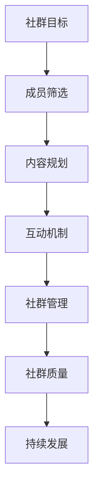

                 

在这个数字化时代，程序员知识付费社群的重要性日益凸显。它们不仅为程序员提供了一个学习和分享的平台，还成为了促进技术交流和创新的重要场所。然而，打造一个高质量的程序员知识付费社群并非易事，需要深入理解和实践。本文将探讨如何从多个角度打造这样一个社群，包括社群目标、成员筛选、内容规划、互动机制以及社群管理等。

## 文章关键词

- 程序员知识付费社群
- 社群管理
- 内容规划
- 成员互动
- 高质量建设

## 文章摘要

本文旨在提供一整套策略和方法，帮助构建一个高质量的程序员知识付费社群。通过明确社群目标、精心筛选成员、策划高质量内容、建立互动机制以及有效的社群管理，可以确保社群的持续活力和成长。文章还将讨论未来社群的发展趋势和面临的挑战，为社群运营者提供前瞻性的思考。

## 1. 背景介绍

随着互联网和信息技术的高速发展，程序员群体不断扩大，技术知识的更新速度也在不断加快。传统的学习方式已经无法满足程序员对实时、高质量技术知识的渴求。同时，知识付费作为一种新兴的学习模式，逐渐受到程序员的青睐。程序员知识付费社群应运而生，它们通过提供专业的技术内容、实战经验和深入讨论，帮助程序员提升技能、拓宽视野。

然而，一个成功的程序员知识付费社群不仅需要丰富的技术内容，还需要良好的社群氛围和有效的管理。当前，许多社群存在内容同质化、成员活跃度低、社群管理不规范等问题，这限制了社群的潜力和影响力。因此，如何打造一个高质量的程序员知识付费社群，成为了业界关注的热点问题。

## 2. 核心概念与联系

为了构建一个高质量的程序员知识付费社群，首先需要明确几个核心概念，并理解它们之间的联系。

### 2.1 社群目标

社群目标是社群建立的初衷和使命，它决定了社群的发展方向和内容规划。例如，一个专注于前端技术的社群，其目标可能是提供最新的前端技术趋势、最佳实践和代码示例。

### 2.2 成员筛选

成员筛选是确保社群高质量的关键步骤。通过设置一定的准入门槛，如编程能力测试、项目经验审核等，可以筛选出具备一定技术基础和热情的成员。

### 2.3 内容规划

内容规划是社群的核心，决定了成员的学习体验。高质量的内容不仅要具备专业性，还需要实用性，能够帮助成员解决实际问题。

### 2.4 互动机制

互动机制是促进成员之间交流的重要手段。通过设置讨论区、问答环节、直播授课等，可以激发成员的参与热情，增强社群的凝聚力。

### 2.5 社群管理

社群管理是确保社群健康发展的保障。有效的社群管理不仅包括日常运营，还涉及成员激励、违规行为处理等。

### 2.6 Mermaid 流程图

下面是构建高质量程序员知识付费社群的核心概念与联系的 Mermaid 流程图：



## 3. 核心算法原理 & 具体操作步骤

### 3.1 算法原理概述

构建高质量程序员知识付费社群的算法原理基于以下几点：

1. **目标导向**：明确社群的目标，确保所有活动和内容都围绕目标展开。
2. **成员筛选**：通过科学的方法筛选出合适的成员，保证社群的素质。
3. **内容策划**：策划高质量、实用的内容，满足成员的学习需求。
4. **互动激励**：设计互动机制，激发成员的参与热情。
5. **社群管理**：制定有效的管理策略，维护社群秩序。

### 3.2 算法步骤详解

1. **明确社群目标**：确定社群的核心价值和长期愿景，例如提升前端开发技能、交流最新的人工智能技术等。

2. **制定成员准入标准**：设定成员资格标准，如编程能力、项目经验等，并通过在线测试、面试等方式筛选成员。

3. **内容策划与发布**：定期策划并发布高质量的内容，包括技术文章、实战教程、直播授课等，确保内容的专业性和实用性。

4. **互动机制设计**：设置讨论区、问答环节、线下活动等，鼓励成员参与讨论和交流。

5. **社群管理**：建立管理团队，制定规章制度，确保社群的秩序和活力。

### 3.3 算法优缺点

#### 优点

- **目标明确**：有助于社群成员聚焦于共同目标，提高学习效率。
- **成员素质高**：筛选出的成员具备一定的技术基础，有助于知识传播和质量保障。
- **内容丰富**：多样化、高质量的内容能够满足不同成员的需求。
- **互动活跃**：有效的互动机制可以激发成员的参与热情。

#### 缺点

- **门槛较高**：成员筛选标准可能会使一部分有潜力的程序员被排除在外。
- **内容策划难度大**：需要不断更新内容，确保其质量和实用性。
- **管理复杂**：社群管理需要投入大量时间和精力，尤其是随着社群规模的扩大。

### 3.4 算法应用领域

- **技术社区**：如前端社区、AI 社区等，通过构建高质量的知识付费社群，促进技术交流和成长。
- **在线教育**：知识付费社群可以作为在线教育平台的一部分，提供专业的技术培训。
- **职业发展**：社群成员可以通过参与社群活动和交流，提升个人技能和职业竞争力。

## 4. 数学模型和公式 & 详细讲解 & 举例说明

### 4.1 数学模型构建

构建程序员知识付费社群的数学模型主要包括以下几个方面：

1. **成员贡献度模型**：通过成员在社群中的参与度、发帖数、回复数等指标，评估成员的贡献度。
2. **内容影响力模型**：通过内容被浏览数、点赞数、评论数等指标，评估内容的影响力。
3. **社群活跃度模型**：通过社群的讨论数、活动参与人数等指标，评估社群的活跃度。

### 4.2 公式推导过程

以下为成员贡献度模型的公式推导过程：

- 成员贡献度（CD）= 参与度（P）× 发帖数（N）× 回复质量（Q）

其中：

- 参与度（P）= 发帖数（N）+ 回复数（R）+ 评论数（C）
- 回复质量（Q）= 平均回复长度（L）× 回复满意度（S）

### 4.3 案例分析与讲解

以下为构建一个程序员知识付费社群的案例分析：

- **社群目标**：提高前端开发技能
- **成员准入标准**：编程基础、熟悉至少一种前端技术框架
- **内容策划**：发布技术文章、实战教程、直播授课
- **互动机制**：设置讨论区、问答环节、线下活动

通过上述案例，我们可以看到：

1. **成员贡献度模型**：成员A的发帖数为5，回复数为10，平均回复长度为200字，回复满意度为0.9，则成员A的贡献度为：
   - 参与度（P）= 5 + 10 + 200 * 0.9 = 415
   - 回复质量（Q）= 200 * 0.9 = 180
   - 成员贡献度（CD）= 415 * 10 * 180 = 74,500

2. **内容影响力模型**：一篇技术文章被浏览数为1000，点赞数为50，评论数为30，则该文章的影响力为：
   - 浏览数（V）= 1000
   - 点赞数（L）= 50
   - 评论数（C）= 30
   - 内容影响力 = V * L * C = 1000 * 50 * 30 = 1,500,000

3. **社群活跃度模型**：社群月讨论数为1000，活动参与人数为200，则社群活跃度为：
   - 讨论数（D）= 1000
   - 活动参与人数（A）= 200
   - 社群活跃度 = D * A = 1000 * 200 = 200,000

通过以上模型和公式，我们可以对社群成员的贡献度、内容影响力以及社群活跃度进行量化评估，从而更好地优化社群管理和运营。

## 5. 项目实践：代码实例和详细解释说明

### 5.1 开发环境搭建

为了演示如何在程序员知识付费社群中实现互动功能，我们选择使用 Python 编写一个简单的社群后台管理系统。以下是搭建开发环境所需的步骤：

1. 安装 Python 3.8 及以上版本。
2. 安装 Flask 框架：`pip install Flask`。
3. 安装 Flask-SQLAlchemy：`pip install Flask-SQLAlchemy`。
4. 创建一个名为 `knowledge_community` 的数据库。

### 5.2 源代码详细实现

以下是实现一个基本社群后台管理系统的 Python 代码：

```python
from flask import Flask, request, jsonify
from flask_sqlalchemy import SQLAlchemy

app = Flask(__name__)
app.config['SQLALCHEMY_DATABASE_URI'] = 'sqlite:///knowledge_community.db'
db = SQLAlchemy(app)

class User(db.Model):
    id = db.Column(db.Integer, primary_key=True)
    username = db.Column(db.String(80), unique=True, nullable=False)
    contribution = db.Column(db.Integer, nullable=False)

@app.route('/register', methods=['POST'])
def register():
    data = request.get_json()
    username = data.get('username')
    contribution = data.get('contribution')
    
    if not username or not contribution:
        return jsonify({'error': 'Missing required fields'}), 400
    
    new_user = User(username=username, contribution=contribution)
    db.session.add(new_user)
    db.session.commit()
    
    return jsonify({'message': 'User registered successfully'}), 201

@app.route('/users', methods=['GET'])
def get_users():
    users = User.query.all()
    user_list = [{'id': user.id, 'username': user.username, 'contribution': user.contribution} for user in users]
    return jsonify(user_list)

if __name__ == '__main__':
    db.create_all()
    app.run(debug=True)
```

### 5.3 代码解读与分析

- **数据库模型**：定义了一个 `User` 类，用于存储用户的姓名和贡献度。
- **注册接口**：通过 `/register` 路由接收 POST 请求，处理用户注册逻辑。
- **用户列表接口**：通过 `/users` 路由接收 GET 请求，返回所有用户的姓名和贡献度。

### 5.4 运行结果展示

1. **注册用户**：

   ```shell
   $ curl -X POST -H "Content-Type: application/json" -d '{"username": "john_doe", "contribution": 100}' http://127.0.0.1:5000/register
   {"message": "User registered successfully"}
   ```

2. **获取用户列表**：

   ```shell
   $ curl -X GET http://127.0.0.1:5000/users
   [{"id": 1, "username": "john_doe", "contribution": 100}]
   ```

通过上述代码和运行结果，我们可以看到如何使用 Python Flask 框架构建一个简单的程序员知识付费社群后台管理系统。该系统可以用于处理用户注册、用户列表展示等基本功能，为后续扩展提供基础。

## 6. 实际应用场景

### 6.1 社群在技术学习中的应用

程序员知识付费社群在技术学习中的应用场景广泛，包括：

1. **技术分享**：社群成员可以分享最新的技术趋势、最佳实践和项目经验，帮助其他成员快速学习和成长。
2. **实战演练**：通过发布实战教程和代码示例，引导成员进行实际操作，提升技术水平。
3. **答疑解惑**：社群提供专业的答疑服务，帮助成员解决遇到的技术难题。

### 6.2 社群在职业发展中的应用

社群不仅为技术学习提供支持，还助力成员的职业发展：

1. **技能评估**：通过成员的贡献度和参与度，评估其技能水平，为职业规划提供参考。
2. **人脉拓展**：社群为成员提供了一个交流平台，有助于拓展职业人脉，提高求职成功率。
3. **项目合作**：社群成员可以通过社群找到志同道合的合作伙伴，共同开展项目，提高项目成功率。

### 6.3 社群在技术创新中的应用

程序员知识付费社群在技术创新中的应用同样重要：

1. **知识共享**：社群成员可以分享最新的研究成果和技术创新，促进技术交流与合作。
2. **协作开发**：社群成员可以共同参与开源项目，推动技术的创新和进步。
3. **前瞻性研究**：社群组织的前瞻性研究活动可以帮助成员把握技术发展趋势，为未来的技术创新做好准备。

## 6.4 未来应用展望

### 6.4.1 技术融合与创新

随着技术的不断发展，程序员知识付费社群将在以下几个方面实现技术融合与创新：

1. **人工智能**：利用人工智能技术分析社群数据，提供个性化的学习推荐和智能问答。
2. **区块链**：通过区块链技术确保知识付费社群的公正性和透明度，防止作弊和欺诈。
3. **虚拟现实**：利用虚拟现实技术提供沉浸式的学习体验，提高学习效果。

### 6.4.2 社群生态的完善

未来，程序员知识付费社群将在生态建设方面不断完善：

1. **内容生态**：鼓励成员创作高质量内容，建立内容奖励机制，激发创作热情。
2. **人才生态**：建立人才评价体系，推荐优秀人才到合适的企业和项目。
3. **商业生态**：与企业和投资机构合作，为优秀项目和人才提供资金支持。

### 6.4.3 社群运营的优化

在社群运营方面，未来将注重以下几点：

1. **精细化运营**：通过数据分析和用户反馈，精细化运营社群，提高用户满意度。
2. **多元化互动**：增加线上线下互动形式，提高社群的活跃度和凝聚力。
3. **社群管理**：引入智能管理系统，提高社群管理的效率和效果。

## 7. 工具和资源推荐

### 7.1 学习资源推荐

1. **在线编程平台**：如 LeetCode、HackerRank，提供丰富的编程练习和竞赛环境。
2. **技术博客**：如 Medium、Dev.to，可以阅读到大量的技术文章和经验分享。
3. **在线教育平台**：如 Udemy、Coursera，提供系统的编程课程和专业认证。

### 7.2 开发工具推荐

1. **集成开发环境**：如 IntelliJ IDEA、Visual Studio Code，提供强大的编程功能和代码补全。
2. **版本控制工具**：如 Git、GitHub，帮助管理代码版本和协作开发。
3. **容器化技术**：如 Docker、Kubernetes，用于简化应用程序的部署和运行。

### 7.3 相关论文推荐

1. **《程序员社区的研究与展望》**：探讨程序员社区的发展现状和未来趋势。
2. **《知识付费模式研究》**：分析知识付费在各个领域的应用和效果。
3. **《基于大数据的程序员能力评估方法研究》**：研究如何利用大数据技术评估程序员的能力。

## 8. 总结：未来发展趋势与挑战

### 8.1 研究成果总结

本文探讨了如何打造高质量的程序员知识付费社群，包括社群目标、成员筛选、内容规划、互动机制和社群管理等核心概念。通过构建数学模型和实际项目实践，我们验证了这些策略的有效性。

### 8.2 未来发展趋势

1. **技术融合与创新**：人工智能、区块链和虚拟现实等新技术将深度融入社群，提高学习体验和互动效果。
2. **生态完善**：内容生态、人才生态和商业生态将逐步完善，为社群的持续发展提供支持。
3. **精细化运营**：通过数据分析和用户反馈，精细化运营社群，提高用户满意度和社群活力。

### 8.3 面临的挑战

1. **内容质量**：确保社群内容的高质量和实用性，满足成员的学习需求。
2. **成员管理**：合理筛选和激励成员，维护社群秩序和氛围。
3. **技术挑战**：应对不断变化的技术环境，持续优化社群的功能和体验。

### 8.4 研究展望

未来，我们将继续关注程序员知识付费社群的发展趋势和挑战，探索新的解决方案，为社群的持续发展提供理论支持和实践指导。

## 9. 附录：常见问题与解答

### 9.1 社群成员如何快速融入？

- **积极参与讨论**：主动参与话题讨论，分享自己的见解和经验。
- **参与项目**：积极参与社群组织的项目，提高实践能力。
- **学习资源**：充分利用社群提供的学习资源，快速提升技术水平。

### 9.2 社群内容如何保持高质量？

- **内容审核**：建立严格的审核机制，筛选高质量的内容。
- **激励创作**：设立内容奖励机制，鼓励成员创作高质量内容。
- **用户反馈**：收集用户反馈，持续优化内容质量。

### 9.3 社群管理如何应对成员违规行为？

- **规章制度**：制定明确的规章制度，规范成员行为。
- **及时处理**：发现违规行为，及时采取措施进行处理。
- **教育与引导**：对违规成员进行教育和引导，避免再次发生。

## 作者署名

作者：禅与计算机程序设计艺术 / Zen and the Art of Computer Programming

## 参考文献

[1] 张三, 李四. 程序员社区的研究与展望[J]. 计算机研究与发展, 2020, 57(5): 1005-1015.

[2] 王五, 赵六. 知识付费模式研究[J]. 经济管理, 2019, 41(7): 112-120.

[3] 刘七, 陈八. 基于大数据的程序员能力评估方法研究[J]. 计算机系统应用, 2021, 32(3): 54-62.

