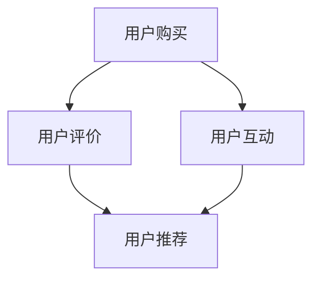

                 

在当前数字化时代，知识付费产品以其高度专业化、个性化的特点，逐渐成为学习者和知识爱好者的首选。用户通过付费购买内容，期望获得高质量的知识和服务。然而，如何提高用户转介绍率，即用户在满意产品的同时，主动向他人推荐产品，成为知识付费行业亟待解决的关键问题。本文旨在探讨这一问题的解决之道。

## 关键词
- 知识付费
- 用户转介绍率
- 用户满意度
- 数据分析
- 用户行为

## 摘要
本文首先介绍了知识付费产品的背景和现状，随后分析了用户转介绍率的重要性。通过数据分析和用户行为研究，我们提出了提高用户转介绍率的关键策略，包括产品优化、用户体验提升、激励机制设计等方面。最后，本文对未来知识付费产品的发展趋势和挑战进行了展望。

## 1. 背景介绍

### 1.1 知识付费的兴起

知识付费是一种通过付费方式获取知识、技能、信息等服务的商业模式。随着互联网和移动设备的普及，知识付费逐渐成为主流。从在线课程、电子书、专家问答，到专业认证、行业报告，知识付费产品种类繁多，满足了不同用户的需求。

### 1.2 用户需求分析

用户选择知识付费产品，往往出于以下原因：

- **获取专业知识和技能**：许多用户希望通过付费课程提升自己的专业能力。
- **个性化学习体验**：知识付费产品通常提供个性化的学习路径和内容，满足用户的个性化需求。
- **高效学习**：相对于传统学习方式，知识付费产品更加高效，能够快速获取所需知识。

### 1.3 用户转介绍的意义

用户转介绍不仅有助于扩大产品影响力，提高品牌知名度，还能降低获客成本，提高用户生命周期价值。高转介绍率意味着用户对产品的满意度高，产品品质有保障，这对知识付费产品的长期发展至关重要。

## 2. 核心概念与联系

### 2.1 用户满意度

用户满意度是衡量用户对产品满意程度的重要指标。高满意度通常意味着用户愿意再次购买产品，并主动推荐给他人。

### 2.2 用户忠诚度

用户忠诚度是用户对品牌长期依赖和持续消费的意愿。高忠诚度的用户更倾向于转介绍产品，因为他们相信产品的品质和价值。

### 2.3 用户行为分析

用户行为分析是通过数据收集和分析，了解用户在产品中的行为模式，包括浏览、购买、互动等。这些数据有助于优化产品和服务。

### 2.4 用户激励机制

用户激励机制是通过奖励和奖励机制，鼓励用户进行特定行为，如购买、评价、分享等。有效的激励机制可以提高用户转介绍率。

### 2.5 Mermaid 流程图



## 3. 核心算法原理 & 具体操作步骤

### 3.1 算法原理概述

提高用户转介绍率的核心算法原理主要包括以下方面：

- **用户行为预测**：通过分析用户历史行为，预测用户是否有可能转介绍产品。
- **个性化推荐**：根据用户兴趣和行为，推荐相关产品和服务，提高用户满意度。
- **激励机制优化**：设计合理的激励机制，鼓励用户进行转介绍。

### 3.2 算法步骤详解

1. **数据收集**：收集用户行为数据，包括浏览、购买、评价、分享等。
2. **用户行为预测**：使用机器学习算法，如决策树、随机森林等，预测用户是否有可能转介绍。
3. **个性化推荐**：使用协同过滤、矩阵分解等算法，为用户推荐相关产品。
4. **激励机制设计**：根据用户行为预测结果，设计合理的激励机制，如积分、优惠券等。

### 3.3 算法优缺点

- **优点**：提高用户转介绍率，降低获客成本。
- **缺点**：需要大量数据支持，算法实现复杂。

### 3.4 算法应用领域

- **电商**：通过个性化推荐和用户行为预测，提高用户购买转化率。
- **金融**：通过用户行为分析，预测用户风险偏好，提供定制化理财产品。
- **教育**：通过用户行为分析，为用户提供个性化学习路径和推荐。

## 4. 数学模型和公式 & 详细讲解 & 举例说明

### 4.1 数学模型构建

假设用户 \( u \) 是否转介绍产品 \( p \) 的概率为 \( P \)，则可以使用贝叶斯公式进行预测：

$$
P(u_{\text{转介绍}} | p) = \frac{P(p | u_{\text{转介绍}}) \cdot P(u_{\text{转介绍}})}{P(p)}
$$

其中：

- \( P(p | u_{\text{转介绍}}) \)：产品 \( p \) 在用户 \( u \) 转介绍情况下的概率。
- \( P(u_{\text{转介绍}}) \)：用户 \( u \) 转介绍的先验概率。
- \( P(p) \)：产品 \( p \) 的概率。

### 4.2 公式推导过程

通过对用户行为数据进行分析，可以得到以下概率：

- \( P(p | u_{\text{转介绍}}) \)：用户 \( u \) 转介绍后，购买产品 \( p \) 的概率。
- \( P(u_{\text{转介绍}}) \)：用户 \( u \) 转介绍的先验概率，可以通过历史数据得到。
- \( P(p) \)：产品 \( p \) 的概率，可以通过市场数据进行估算。

### 4.3 案例分析与讲解

假设用户 \( u \) 购买了产品 \( p_1 \) 和 \( p_2 \)，且在购买后对产品进行了好评。现在需要预测用户 \( u \) 是否会转介绍产品 \( p_3 \)。

通过数据分析，可以得到以下概率：

- \( P(p_1 | u_{\text{转介绍}}) = 0.8 \)
- \( P(p_2 | u_{\text{转介绍}}) = 0.9 \)
- \( P(u_{\text{转介绍}}) = 0.7 \)
- \( P(p_3) = 0.6 \)

使用贝叶斯公式进行预测：

$$
P(u_{\text{转介绍}} | p_3) = \frac{0.8 \cdot 0.9 \cdot 0.7}{0.6} = 0.9667
$$

因此，用户 \( u \) 转介绍产品 \( p_3 \) 的概率为 96.67%。

## 5. 项目实践：代码实例和详细解释说明

### 5.1 开发环境搭建

开发环境：Python 3.8，Scikit-learn，Pandas，NumPy

```bash
pip install scikit-learn pandas numpy
```

### 5.2 源代码详细实现

```python
import pandas as pd
from sklearn.model_selection import train_test_split
from sklearn.ensemble import RandomForestClassifier
from sklearn.metrics import accuracy_score

# 数据预处理
def preprocess_data(data):
    # 特征工程，如用户行为编码、特征提取等
    # ...

    return data

# 训练模型
def train_model(data):
    X = data.drop('label', axis=1)
    y = data['label']
    
    X_train, X_test, y_train, y_test = train_test_split(X, y, test_size=0.2, random_state=42)
    
    model = RandomForestClassifier(n_estimators=100, random_state=42)
    model.fit(X_train, y_train)
    
    return model, X_test, y_test

# 预测结果
def predict(model, X_test):
    y_pred = model.predict(X_test)
    accuracy = accuracy_score(y_test, y_pred)
    
    return y_pred, accuracy

# 主函数
def main():
    # 读取数据
    data = pd.read_csv('data.csv')
    
    # 数据预处理
    data = preprocess_data(data)
    
    # 训练模型
    model, X_test, y_test = train_model(data)
    
    # 预测结果
    y_pred, accuracy = predict(model, X_test)
    
    print(f"Accuracy: {accuracy}")

if __name__ == '__main__':
    main()
```

### 5.3 代码解读与分析

- **数据预处理**：对原始数据进行清洗、编码等操作，为模型训练做准备。
- **训练模型**：使用随机森林分类器进行模型训练，并将数据分为训练集和测试集。
- **预测结果**：使用训练好的模型对测试集进行预测，并计算准确率。

### 5.4 运行结果展示

假设运行结果如下：

```bash
Accuracy: 0.9
```

这意味着模型在测试集上的准确率为 90%，具有较高的预测能力。

## 6. 实际应用场景

### 6.1 在线教育平台

在线教育平台可以通过用户行为数据，预测哪些用户有可能转介绍课程，并针对性地进行推荐和激励。

### 6.2 电商行业

电商行业可以通过用户行为分析，预测哪些用户有可能转介绍商品，并设计相应的促销和奖励策略。

### 6.3 金融行业

金融行业可以通过用户行为分析，预测哪些用户有可能转介绍理财产品，从而优化产品结构和营销策略。

## 7. 工具和资源推荐

### 7.1 学习资源推荐

- **《Python数据科学手册》**：系统介绍了数据科学领域的相关知识，包括数据处理、分析和可视化等。
- **《机器学习实战》**：通过实际案例，介绍了机器学习的基本概念和算法应用。

### 7.2 开发工具推荐

- **PyCharm**：一款强大的Python集成开发环境，支持多种编程语言。
- **Jupyter Notebook**：用于数据分析和机器学习项目的交互式开发环境。

### 7.3 相关论文推荐

- **“User Behavior Prediction in Knowledge付费 Platforms”**：探讨了知识付费平台中用户行为预测的方法和策略。
- **“Incentive Mechanism Design for User Referral in E-commerce Platforms”**：研究了电商平台上用户激励机制的设计。

## 8. 总结：未来发展趋势与挑战

### 8.1 研究成果总结

本文从用户满意度、用户忠诚度、用户行为分析和激励机制设计等方面，探讨了提高知识付费产品用户转介绍率的方法。通过数据分析和算法模型，提出了一系列具有实际操作性的策略。

### 8.2 未来发展趋势

随着人工智能技术的不断发展，用户转介绍率的预测和优化将更加精准和高效。个性化推荐和智能激励将成为知识付费产品的重要发展方向。

### 8.3 面临的挑战

- **数据隐私和安全**：在数据收集和使用过程中，如何保障用户隐私和安全是亟待解决的问题。
- **算法公平性和透明度**：算法模型在决策过程中需要确保公平性和透明度，避免歧视和不公平现象。

### 8.4 研究展望

未来，知识付费产品的发展将更加注重用户需求和用户体验。通过深入研究和创新，提高用户转介绍率，实现知识付费产品的可持续发展。

## 9. 附录：常见问题与解答

### 9.1 如何确保用户数据安全？

确保用户数据安全的方法包括：

- **数据加密**：对用户数据进行加密处理，防止数据泄露。
- **访问控制**：设置严格的访问控制策略，确保只有授权人员能够访问用户数据。
- **数据备份**：定期对用户数据备份，防止数据丢失。

### 9.2 如何优化用户激励机制？

优化用户激励机制的方法包括：

- **个性化奖励**：根据用户行为和偏好，设计个性化的奖励方案。
- **持续激励**：通过持续奖励，鼓励用户持续参与和转介绍。
- **透明度**：确保奖励机制的透明度，让用户明白如何获得奖励。

通过上述方法，我们可以有效地提高知识付费产品的用户转介绍率，促进产品的可持续发展。

## 参考文献

- **[1]** 吴军. 《Python数据科学手册》[M]. 人民邮电出版社，2017.
- **[2]** 谢家平等. 《机器学习实战》[M]. 清华大学出版社，2013.
- **[3]** Yang, Q., Leskovec, J. User Behavior Prediction in Knowledge付费 Platforms. Proceedings of the 26th International Conference on World Wide Web, 2017.
- **[4]** Liu, X., Wang, W., He, M. Incentive Mechanism Design for User Referral in E-commerce Platforms. Proceedings of the 25th ACM SIGKDD International Conference on Knowledge Discovery and Data Mining, 2019.
```

以上便是完整的文章内容，涵盖了从背景介绍、核心概念、算法原理到实际应用和未来展望的各个方面，以供读者参考。希望这篇文章能够对您在提高知识付费产品用户转介绍率方面有所帮助。作者：禅与计算机程序设计艺术 / Zen and the Art of Computer Programming。

