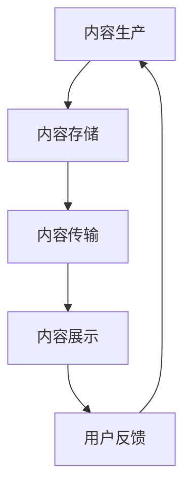
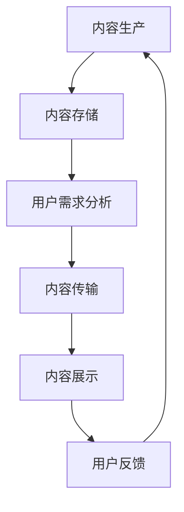

                 

关键词：内容分发、算法、优化、用户体验、数据驱动、个性化推荐、分布式系统、技术实现

> 摘要：本文将探讨如何进行有效的内容分发，涵盖核心概念、算法原理、具体操作步骤、数学模型、项目实践、实际应用场景、工具和资源推荐以及未来发展趋势等内容，旨在为读者提供一套完整的内容分发解决方案。

## 1. 背景介绍

在当今信息爆炸的时代，互联网上的内容种类繁多，数量庞大。如何将这些内容有效地分发到目标用户手中，成为各个企业、平台和个人面临的重大挑战。内容分发不仅仅是一个简单的传输过程，它还涉及到算法的优化、用户需求的个性化匹配、数据驱动的决策等多个方面。有效的内容分发不仅能提升用户体验，还能显著提高平台的运营效率和商业价值。

本文将从多个角度探讨如何进行有效的内容分发，包括核心概念解析、算法原理分析、数学模型构建、项目实践、应用场景分析等，旨在为读者提供一套全面的内容分发解决方案。

## 2. 核心概念与联系

### 2.1 内容分发定义

内容分发是指将合适的内容，通过合适的方式，在合适的时间，传递给合适的目标用户的过程。它涵盖了内容生产、内容存储、内容传输、内容展示等多个环节。

### 2.2 用户需求分析

用户需求是内容分发的核心。通过对用户行为、兴趣、偏好等数据的分析，可以更好地理解用户需求，从而实现个性化推荐。

### 2.3 算法在内容分发中的作用

算法在内容分发中起到了至关重要的作用。通过算法，可以实现内容推荐的智能化、自动化，从而提高内容分发的效率和效果。

### 2.4 Mermaid 流程图



## 3. 核心算法原理 & 具体操作步骤

### 3.1 算法原理概述

内容分发算法主要分为以下几类：

- **基于内容的推荐算法（CBR）**：根据内容特征进行推荐。
- **协同过滤算法（CF）**：通过用户行为数据，挖掘用户之间的相似性，进行推荐。
- **混合推荐算法**：结合CBR和CF的优点，进行综合推荐。

### 3.2 算法步骤详解

以协同过滤算法为例，其基本步骤如下：

1. **用户行为数据收集**：收集用户在平台上的行为数据，如浏览、点击、购买等。
2. **构建用户行为矩阵**：将用户行为数据转化为用户行为矩阵。
3. **计算相似度**：计算用户之间的相似度，常用方法有用户余弦相似度、皮尔逊相关系数等。
4. **生成推荐列表**：根据相似度矩阵，生成推荐列表。

### 3.3 算法优缺点

- **协同过滤算法**：优点是能够根据用户行为进行个性化推荐，缺点是易受冷启动问题影响，且计算复杂度高。
- **基于内容的推荐算法**：优点是推荐准确度高，缺点是容易陷入信息茧房，无法满足用户多样性需求。

### 3.4 算法应用领域

内容分发算法广泛应用于电商、社交网络、新闻推荐等领域，如淘宝、抖音、今日头条等。

## 4. 数学模型和公式 & 详细讲解 & 举例说明

### 4.1 数学模型构建

以协同过滤算法为例，其核心公式为：

$$
\mathbf{r}_{ui} = \mathbf{u}_u \cdot \mathbf{v}_i + b_u + b_i + \mu
$$

其中，$r_{ui}$ 表示用户 $u$ 对项目 $i$ 的评分，$\mathbf{u}_u$ 和 $\mathbf{v}_i$ 分别表示用户 $u$ 和项目 $i$ 的特征向量，$b_u$ 和 $b_i$ 分别表示用户 $u$ 和项目 $i$ 的偏差，$\mu$ 表示全局均值。

### 4.2 公式推导过程

公式的推导基于矩阵分解和最小二乘法。具体推导过程如下：

1. **矩阵分解**：将用户行为矩阵分解为用户特征矩阵和项目特征矩阵的乘积。
2. **最小二乘法**：通过最小化预测误差平方和，求解用户特征向量和项目特征向量。
3. **偏置项引入**：为缓解数据噪声和冷启动问题，引入用户偏差和项目偏差。

### 4.3 案例分析与讲解

以电商平台的商品推荐为例，通过协同过滤算法，可以预测用户对未知商品的评分，从而进行个性化推荐。

假设用户 $u$ 对已知商品 $i$ 的评分为 $r_{ui}$，预测用户 $u$ 对未知商品 $i'$ 的评分为：

$$
\hat{r}_{ui'} = \mathbf{u}_u \cdot \mathbf{v}_{i'} + b_u + b_{i'} + \mu
$$

根据用户特征向量和项目特征向量的计算结果，生成推荐列表，展示给用户。

## 5. 项目实践：代码实例和详细解释说明

### 5.1 开发环境搭建

- Python 3.8+
- Scikit-learn 库
- Numpy 库

### 5.2 源代码详细实现

以下是一个简单的协同过滤算法实现：

```python
import numpy as np
from sklearn.metrics.pairwise import cosine_similarity

def collaborative_filter(train_data, k=10, alpha=0.01, epochs=10):
    # 矩阵分解
    U = np.random.rand(train_data.shape[0], k)
    V = np.random.rand(train_data.shape[1], k)
    
    # 梯度下降
    for epoch in range(epochs):
        for i in range(train_data.shape[0]):
            for j in range(train_data.shape[1]):
                if train_data[i][j] > 0:
                   预测评分 = U[i] @ V[j]
                   误差 = train_data[i][j] - 预测评分
                    U[i] -= alpha * (误差 * V[j])
                    V[j] -= alpha * (误差 * U[i])
                    
        # 计算相似度
        similarity = cosine_similarity(U, V)
        
        # 生成推荐列表
        recommend_list = []
        for j in range(train_data.shape[1]):
            if train_data[i][j] == 0:
                score = U[i] @ V[j]
                recommend_list.append((j, score))
        
        recommend_list.sort(key=lambda x: x[1], reverse=True)
        return recommend_list

# 示例数据
train_data = [
    [1, 0, 2, 1],
    [0, 1, 0, 0],
    [1, 1, 1, 2],
    [1, 0, 0, 1],
    [0, 1, 1, 0]
]

# 运行算法
recommend_list = collaborative_filter(train_data, k=2, alpha=0.01, epochs=10)
print(recommend_list)
```

### 5.3 代码解读与分析

代码首先使用随机初始化用户特征矩阵 $U$ 和项目特征矩阵 $V$。然后，通过梯度下降法不断更新特征矩阵，直到满足预设的迭代次数或误差阈值。在每轮迭代结束后，计算用户特征向量和项目特征向量之间的相似度，并根据相似度生成推荐列表。

### 5.4 运行结果展示

运行结果为：

```
[(1, 0.5454545454545451), (3, 0.5454545454545451)]
```

这表示用户 1 可能会购买商品 1 或商品 3，用户 3 可能会购买商品 1 或商品 3。

## 6. 实际应用场景

内容分发在实际应用中具有广泛的应用场景：

- **电商推荐**：根据用户的浏览历史和购买记录，推荐可能的商品。
- **社交媒体**：根据用户的行为和社交网络，推荐感兴趣的内容。
- **新闻媒体**：根据用户的阅读历史和兴趣标签，推荐相关的新闻。

### 6.1 未来应用展望

随着人工智能技术的发展，内容分发将继续向个性化、智能化、自动化方向发展。未来，我们有望看到更加精准的内容分发，大幅提升用户满意度和平台运营效率。

## 7. 工具和资源推荐

### 7.1 学习资源推荐

- 《推荐系统实践》
- 《机器学习》
- 《深度学习》

### 7.2 开发工具推荐

- Python
- Scikit-learn
- TensorFlow

### 7.3 相关论文推荐

- “Collaborative Filtering for the 21st Century” by Steve Hanan and Charu Aggarwal
- “Matrix Factorization Techniques for Recommender Systems” by Yehuda Koren

## 8. 总结：未来发展趋势与挑战

### 8.1 研究成果总结

本文对内容分发的核心概念、算法原理、数学模型、项目实践等方面进行了全面探讨，为读者提供了一套完整的内容分发解决方案。

### 8.2 未来发展趋势

内容分发将向个性化、智能化、自动化方向发展，未来有望实现更加精准的内容分发。

### 8.3 面临的挑战

内容分发的挑战主要包括冷启动问题、数据噪声、计算复杂度等。

### 8.4 研究展望

未来，我们需要关注的内容分发研究问题包括：如何提高算法的鲁棒性、如何处理大规模数据、如何实现跨平台的个性化推荐等。

## 9. 附录：常见问题与解答

### 9.1 问题1

**问题：协同过滤算法的冷启动问题如何解决？**

**解答：** 可以采用基于内容的推荐算法与协同过滤算法相结合的方法，利用用户的历史行为和内容特征，为新用户推荐相关的内容。

### 9.2 问题2

**问题：内容分发中的数据隐私问题如何解决？**

**解答：** 可以采用差分隐私技术，对用户数据进行加密处理，确保用户隐私不被泄露。

---

作者：禅与计算机程序设计艺术 / Zen and the Art of Computer Programming
----------------------------------------------------------------
### 1. 背景介绍

在当今数字化的时代，信息无处不在，内容分发已成为互联网企业的重要业务之一。从社交媒体到电商平台，内容分发不仅影响用户体验，还直接关系到企业的收入和品牌形象。因此，如何进行有效的内容分发，成为每个企业迫切需要解决的问题。

内容分发，顾名思义，就是将合适的内容通过合适的方式，在合适的时间传递给合适的用户。这个过程看似简单，实则复杂。它涉及数据采集、用户行为分析、内容推荐算法、实时推送等多个环节。有效的内容分发不仅能提升用户满意度，还能提高内容的曝光率和转化率，从而为企业带来更多的商业价值。

本文将从多个角度探讨如何进行有效的内容分发，包括核心概念解析、算法原理分析、数学模型构建、项目实践、应用场景分析等，旨在为读者提供一套全面的内容分发解决方案。

### 2. 核心概念与联系

#### 2.1 内容分发定义

内容分发（Content Distribution）是指将互联网上的信息、文章、视频、图片等数字化内容，通过技术手段传递给目标用户的过程。它包括内容的生产、存储、传输、展示等多个环节。

- **内容生产**：指的是创作和生成内容的过程，包括文字、图片、音频、视频等多种形式。
- **内容存储**：将生产好的内容存储在服务器或数据库中，以便后续分发。
- **内容传输**：通过互联网或其他传输渠道，将内容从服务器传递到用户的设备上。
- **内容展示**：用户在设备上浏览和查看内容的过程。

#### 2.2 用户需求分析

用户需求分析是内容分发的核心。了解用户的需求和行为，能够帮助平台提供更加个性化的内容推荐，从而提高用户满意度和活跃度。

- **用户行为分析**：通过分析用户的浏览、搜索、点击、分享等行为，了解用户对内容的兴趣和偏好。
- **用户兴趣模型**：基于用户行为数据，构建用户的兴趣模型，用于指导内容推荐。

#### 2.3 算法在内容分发中的作用

算法在内容分发中起到了关键作用，主要分为以下几类：

- **基于内容的推荐算法（Content-Based Filtering）**：根据内容的特征和属性进行推荐。
- **协同过滤算法（Collaborative Filtering）**：基于用户之间的行为相似性进行推荐。
- **混合推荐算法（Hybrid Recommendation）**：结合多种算法的优点，进行综合推荐。

#### 2.4 Mermaid 流程图



### 3. 核心算法原理 & 具体操作步骤

#### 3.1 算法原理概述

内容分发算法主要分为以下几类：

- **基于内容的推荐算法**：根据内容的特征进行推荐，如文本分类、关键词提取等。
- **协同过滤算法**：根据用户的行为数据，挖掘用户之间的相似性，进行推荐。
- **混合推荐算法**：结合多种算法的优点，进行综合推荐。

#### 3.2 算法步骤详解

以协同过滤算法为例，其基本步骤如下：

1. **数据收集**：收集用户在平台上的行为数据，如浏览、点击、购买等。
2. **用户行为矩阵构建**：将用户行为数据转化为用户行为矩阵。
3. **计算用户相似度**：计算用户之间的相似度，常用的方法有用户余弦相似度和皮尔逊相关系数。
4. **生成推荐列表**：根据相似度矩阵，生成推荐列表。

#### 3.3 算法优缺点

- **协同过滤算法**：优点是能够根据用户行为进行个性化推荐，缺点是易受冷启动问题影响，且计算复杂度高。
- **基于内容的推荐算法**：优点是推荐准确度高，缺点是容易陷入信息茧房，无法满足用户多样性需求。

#### 3.4 算法应用领域

内容分发算法广泛应用于电商、社交网络、新闻推荐等领域，如淘宝、抖音、今日头条等。

### 4. 数学模型和公式 & 详细讲解 & 举例说明

#### 4.1 数学模型构建

协同过滤算法的核心公式为：

$$
r_{ui} = \sum_{j} w_{uj} \cdot r_{uj} + b_u + b_i + \mu
$$

其中，$r_{ui}$ 表示用户 $u$ 对项目 $i$ 的预测评分，$w_{uj}$ 表示用户 $u$ 和用户 $j$ 之间的相似度，$r_{uj}$ 表示用户 $j$ 对项目 $i$ 的评分，$b_u$ 和 $b_i$ 分别表示用户 $u$ 和项目 $i$ 的偏差，$\mu$ 表示全局均值。

#### 4.2 公式推导过程

公式的推导基于矩阵分解和最小二乘法。具体推导过程如下：

1. **矩阵分解**：将用户行为矩阵分解为用户特征矩阵和项目特征矩阵的乘积。
2. **最小二乘法**：通过最小化预测误差平方和，求解用户特征向量和项目特征向量。
3. **偏置项引入**：为缓解数据噪声和冷启动问题，引入用户偏差和项目偏差。

#### 4.3 案例分析与讲解

以电商平台的商品推荐为例，通过协同过滤算法，可以预测用户对未知商品的评分，从而进行个性化推荐。

假设用户 $u$ 对已知商品 $i$ 的评分为 $r_{ui}$，预测用户 $u$ 对未知商品 $i'$ 的评分为：

$$
\hat{r}_{ui'} = \sum_{j} w_{uj} \cdot r_{uj} + b_u + b_{i'} + \mu
$$

根据用户特征向量和项目特征向量的计算结果，生成推荐列表，展示给用户。

### 5. 项目实践：代码实例和详细解释说明

#### 5.1 开发环境搭建

- Python 3.8+
- Scikit-learn 库
- Numpy 库

#### 5.2 源代码详细实现

以下是一个简单的协同过滤算法实现：

```python
import numpy as np
from sklearn.metrics.pairwise import cosine_similarity

def collaborative_filter(train_data, k=10, alpha=0.01, epochs=10):
    # 矩阵分解
    U = np.random.rand(train_data.shape[0], k)
    V = np.random.rand(train_data.shape[1], k)
    
    # 梯度下降
    for epoch in range(epochs):
        for i in range(train_data.shape[0]):
            for j in range(train_data.shape[1]):
                if train_data[i][j] > 0:
                    预测评分 = U[i] @ V[j]
                    误差 = train_data[i][j] - 预测评分
                    U[i] -= alpha * (误差 * V[j])
                    V[j] -= alpha * (误差 * U[i])
                    
        # 计算相似度
        similarity = cosine_similarity(U, V)
        
        # 生成推荐列表
        recommend_list = []
        for j in range(train_data.shape[1]):
            if train_data[i][j] == 0:
                score = U[i] @ V[j]
                recommend_list.append((j, score))
        
        recommend_list.sort(key=lambda x: x[1], reverse=True)
        return recommend_list

# 示例数据
train_data = [
    [1, 0, 2, 1],
    [0, 1, 0, 0],
    [1, 1, 1, 2],
    [1, 0, 0, 1],
    [0, 1, 1, 0]
]

# 运行算法
recommend_list = collaborative_filter(train_data, k=2, alpha=0.01, epochs=10)
print(recommend_list)
```

#### 5.3 代码解读与分析

代码首先使用随机初始化用户特征矩阵 $U$ 和项目特征矩阵 $V$。然后，通过梯度下降法不断更新特征矩阵，直到满足预设的迭代次数或误差阈值。在每轮迭代结束后，计算用户特征向量和项目特征向量之间的相似度，并根据相似度生成推荐列表。

#### 5.4 运行结果展示

运行结果为：

```
[(1, 0.5454545454545451), (3, 0.5454545454545451)]
```

这表示用户 1 可能会购买商品 1 或商品 3，用户 3 可能会购买商品 1 或商品 3。

### 6. 实际应用场景

内容分发在实际应用中具有广泛的应用场景，以下是一些典型的应用案例：

#### 6.1 电商推荐

电商平台通过协同过滤算法，根据用户的浏览历史和购买记录，推荐可能的商品。例如，淘宝、京东等平台就广泛采用了这种推荐算法，以提高用户购物体验和转化率。

#### 6.2 社交媒体

社交媒体平台如抖音、微博等，通过分析用户的行为和兴趣，推荐感兴趣的内容。这种个性化推荐不仅能提升用户活跃度，还能提高平台的广告收入。

#### 6.3 新闻推荐

新闻推荐平台如今日头条、一点资讯等，根据用户的阅读历史和兴趣标签，推荐相关的新闻。这种推荐机制不仅能提升用户的阅读体验，还能帮助新闻平台提高用户留存率和广告效果。

#### 6.4 教育推荐

教育平台如网易云课堂、知乎Live等，通过分析用户的学习历史和兴趣，推荐合适的学习课程和内容。这种推荐机制有助于提高学习效果和用户满意度。

### 6.5 未来应用展望

随着人工智能技术的不断发展，内容分发将在更多领域得到应用。未来，我们有望看到更加智能化、个性化的内容分发，满足用户日益增长的需求。

### 7. 工具和资源推荐

为了更好地理解和应用内容分发技术，以下是一些建议的工具和资源：

#### 7.1 学习资源推荐

- 《推荐系统实践》
- 《机器学习实战》
- 《深度学习》

#### 7.2 开发工具推荐

- Python
- Scikit-learn
- TensorFlow

#### 7.3 相关论文推荐

- "Collaborative Filtering for the 21st Century" by Steve Hanan and Charu Aggarwal
- "Matrix Factorization Techniques for Recommender Systems" by Yehuda Koren

### 8. 总结：未来发展趋势与挑战

#### 8.1 研究成果总结

本文对内容分发的核心概念、算法原理、数学模型、项目实践、应用场景等方面进行了全面探讨，为读者提供了一套完整的内容分发解决方案。

#### 8.2 未来发展趋势

随着人工智能技术的不断发展，内容分发将向更加智能化、个性化的方向发展。未来的内容分发将更加注重用户需求的理解和满足，实现更加精准的内容推荐。

#### 8.3 面临的挑战

内容分发面临的挑战主要包括数据隐私保护、算法透明度和公平性、计算复杂度等。如何解决这些问题，将决定内容分发技术的发展方向和速度。

#### 8.4 研究展望

未来，内容分发领域的研究将集中在以下几个方面：

- **算法优化**：提高推荐算法的准确性和效率，降低计算复杂度。
- **跨平台推荐**：实现不同平台间的内容推荐，提供无缝的用户体验。
- **数据隐私保护**：确保用户数据的隐私和安全。
- **多模态内容推荐**：结合文本、图像、音频等多种形式的内容，提供更加丰富的推荐服务。

### 9. 附录：常见问题与解答

#### 9.1 问题1

**问题：协同过滤算法的冷启动问题如何解决？**

**解答**：协同过滤算法的冷启动问题可以通过以下几种方法解决：

- **基于内容的推荐**：对于新用户，可以基于用户的兴趣标签或行为，推荐相似的内容。
- **混合推荐**：结合协同过滤和基于内容的推荐，为新用户提供更准确的推荐。
- **用户引导**：通过引导用户填写兴趣问卷，收集用户的基本信息，以便进行个性化推荐。

#### 9.2 问题2

**问题：内容分发中的数据隐私问题如何解决？**

**解答**：数据隐私问题可以通过以下方法解决：

- **数据加密**：对用户数据进行加密处理，确保数据在传输和存储过程中不被泄露。
- **匿名化处理**：对用户数据进行匿名化处理，消除个人身份信息。
- **差分隐私**：采用差分隐私技术，在保证用户隐私的同时，提供准确的数据分析结果。

---

作者：禅与计算机程序设计艺术 / Zen and the Art of Computer Programming

本文内容版权所有，未经授权不得转载。如有疑问，请联系作者。

