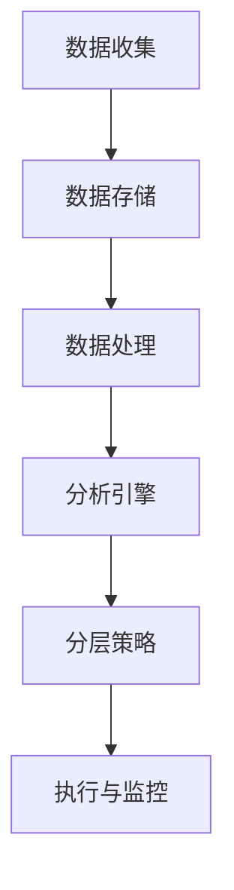

                 

在当今的商业世界中，用户分层运营已经成为企业提升用户体验和增加收入的关键策略之一。有效的用户分层不仅可以帮助企业更好地理解其客户，还可以针对不同的用户群体提供个性化的服务和产品。本文将深入探讨用户分层运营的概念、核心算法、数学模型以及实际应用，旨在为读者提供一套完整的用户分层运营指南。

## 关键词
- 用户分层
- 运营策略
- 个性化服务
- 数据分析
- 商业增长

## 摘要
本文将探讨如何通过有效的用户分层运营来提升企业的业务表现。我们将介绍用户分层的核心概念和原理，详细解析核心算法的原理和步骤，构建数学模型以优化用户分层效果，并通过实际项目实践和代码实例展示分层运营的落地方法。最后，我们将分析用户分层运营的未来发展趋势和面临的挑战。

## 1. 背景介绍

在竞争激烈的市场环境中，企业必须不断创新和优化其运营策略以吸引和保留客户。用户分层是一种基于用户行为和特征的数据分析技术，它通过将用户分为不同的群体，为每个群体提供定制化的产品和服务。这种策略不仅有助于提升用户体验，还可以提高客户满意度和忠诚度，从而推动企业的长期增长。

用户分层运营的关键在于能够识别和区分不同的用户群体，并为他们提供差异化的体验。例如，电子商务平台可以根据用户的购买历史和偏好来推荐相关产品，从而提高购买转化率。社交媒体平台则可以根据用户的互动行为和关注内容来提供个性化的内容推荐，增加用户的活跃度和粘性。

然而，用户分层运营并非易事。企业需要收集和分析大量的用户数据，并运用先进的数据分析技术来构建有效的分层模型。此外，用户分层运营还需要结合具体的业务目标和策略，确保分层效果能够真正促进业务增长。

## 2. 核心概念与联系

### 2.1 用户分层的核心概念

用户分层运营的核心概念包括用户特征、用户行为、用户价值和用户生命周期。这些概念相互作用，共同构成了用户分层的框架。

- **用户特征**：包括用户的年龄、性别、地理位置、职业等基本信息，这些特征有助于企业了解用户的基本属性。
- **用户行为**：包括用户的购买行为、浏览行为、互动行为等，这些行为反映了用户对企业产品和服务的使用情况和偏好。
- **用户价值**：基于用户的购买历史、消费金额、活跃度等指标，评估用户对企业的贡献和价值。
- **用户生命周期**：从用户首次接触企业产品或服务开始，到用户离开企业的整个过程，分为获取、激活、留存、增长和流失等阶段。

### 2.2 用户分层与运营策略的联系

用户分层与运营策略的紧密联系体现在以下几个方面：

- **目标设定**：企业需要明确分层运营的目标，如提升客户满意度、提高转化率、增加复购率等。
- **数据收集**：通过多种渠道收集用户数据，包括网站行为数据、社交媒体数据、用户调查数据等。
- **分析处理**：运用数据分析技术，如聚类分析、关联规则挖掘等，对用户数据进行分析和处理。
- **分层策略**：根据分析结果，将用户分为不同的层次，如高价值用户、潜在高价值用户、普通用户等。
- **个性化服务**：为不同层次的用户提供个性化的产品和服务，提高用户满意度和忠诚度。
- **效果评估**：通过跟踪用户的反馈和行为，评估分层策略的效果，并根据评估结果进行调整和优化。

### 2.3 用户分层的架构

为了更好地进行用户分层运营，企业需要建立一套完整的用户分层架构。这个架构通常包括以下几个关键组成部分：

- **数据收集模块**：负责从各种渠道收集用户数据，包括线上和线下数据。
- **数据存储模块**：将收集到的数据存储在数据仓库或数据湖中，以便后续分析。
- **数据处理模块**：对存储的数据进行清洗、转换和整合，为分析提供高质量的数据。
- **分析引擎模块**：运用各种数据分析技术，对用户数据进行分析和处理，生成用户特征和用户价值评估。
- **分层策略模块**：根据分析结果，制定针对不同用户群体的运营策略。
- **执行与监控模块**：将分层策略落实到具体的运营活动中，并实时监控效果。

### 2.4 Mermaid 流程图

以下是一个简化的用户分层架构的 Mermaid 流程图：



在这个流程图中，A 到 F 表示用户分层运营的核心流程，每个模块都有明确的输入和输出，共同构成了一个完整的用户分层架构。

## 3. 核心算法原理 & 具体操作步骤

### 3.1 算法原理概述

用户分层算法的核心原理是基于用户特征和行为的数据分析，通过聚类分析、关联规则挖掘等算法，将用户分为不同的层次。以下是几种常见的用户分层算法：

- **K-Means 聚类算法**：基于距离度量，将用户分为 K 个簇，每个簇内的用户相似度较高，簇间的用户相似度较低。
- **层次聚类算法**：自底向上或自顶向下构建层次树，将用户逐步划分为不同的层次。
- **关联规则挖掘算法**：通过挖掘用户行为数据中的关联规则，识别用户之间的相似性和差异性。
- **基于用户价值的评估算法**：结合用户的购买历史、消费金额、活跃度等指标，评估用户的价值。

### 3.2 算法步骤详解

下面以 K-Means 聚类算法为例，详细讲解用户分层的算法步骤：

#### 3.2.1 数据准备

1. **收集用户数据**：从各种渠道收集用户特征和行为数据，如年龄、性别、地理位置、购买历史、浏览行为等。
2. **数据预处理**：对收集到的数据进行清洗、去重和标准化处理，确保数据质量。

#### 3.2.2 确定聚类数量

1. **选择聚类算法**：选择 K-Means 聚类算法。
2. **确定聚类数量 K**：通过肘部法则、 silhouette 系数等方法，选择合适的聚类数量。

#### 3.2.3 初始化聚类中心

1. **随机选择 K 个用户**：作为初始聚类中心。
2. **计算用户与聚类中心的距离**：使用欧氏距离或其他距离度量方法，计算每个用户与聚类中心的距离。

#### 3.2.4 分配用户到簇

1. **根据距离度量**：将每个用户分配到距离最近的聚类中心所在的簇。
2. **更新聚类中心**：重新计算每个簇的用户中心。

#### 3.2.5 重复迭代

1. **重复步骤 3.2.4**：直到聚类中心不再发生变化或满足其他停止条件。

#### 3.2.6 分层策略

1. **评估用户价值**：结合用户的购买历史、消费金额、活跃度等指标，评估用户的价值。
2. **制定分层策略**：根据用户价值和聚类结果，将用户分为不同的层次，如高价值用户、潜在高价值用户、普通用户等。

### 3.3 算法优缺点

- **优点**：
  - **简单易用**：K-Means 聚类算法实现简单，易于理解和应用。
  - **高效快速**：算法运行时间较短，适用于大规模数据集。
  - **灵活性**：可以处理高维数据，适用于各种类型的用户特征。

- **缺点**：
  - **对初始聚类中心敏感**：算法容易陷入局部最优解。
  - **需要提前指定聚类数量 K**：算法无法自动确定聚类数量。
  - **无法处理非凸数据集**：算法适用于凸形状的数据集，对于非凸数据集效果较差。

### 3.4 算法应用领域

K-Means 聚类算法在用户分层运营中有着广泛的应用。以下是一些典型的应用领域：

- **电子商务**：通过用户购买历史和浏览行为，将用户分为不同的购买群体，为每个群体提供个性化的产品推荐。
- **金融行业**：通过用户的财务数据和交易行为，将用户分为不同的风险等级，为高风险用户提供风险控制和投资建议。
- **社交媒体**：通过用户互动行为和关注内容，将用户分为不同的兴趣群体，为每个群体提供个性化的内容推荐。

## 4. 数学模型和公式 & 详细讲解 & 举例说明

### 4.1 数学模型构建

用户分层运营的数学模型主要包括用户特征表示、用户价值评估和分层决策三个部分。

#### 4.1.1 用户特征表示

用户特征表示是将用户的属性和行为转化为数学向量表示。常见的用户特征包括：

- **基础特征**：年龄、性别、地理位置等。
- **行为特征**：购买历史、浏览行为、互动行为等。

用户特征表示的数学模型可以表示为：

$$
X = [x_1, x_2, ..., x_n]
$$

其中，$X$ 是用户特征向量，$x_i$ 是第 $i$ 个特征值。

#### 4.1.2 用户价值评估

用户价值评估是基于用户特征和行为数据，计算用户对企业的贡献和价值。常见的用户价值评估指标包括：

- **生命周期价值（LTV）**：用户在整个生命周期内为企业带来的预期收益。
- **净推荐值（NPS）**：用户对企业满意度的评估，反映了用户的忠诚度。

用户价值评估的数学模型可以表示为：

$$
V = f(X)
$$

其中，$V$ 是用户价值，$f$ 是用户价值评估函数。

#### 4.1.3 分层决策

分层决策是根据用户价值评估结果，将用户分为不同的层次。常见的分层决策方法包括：

- **阈值划分**：根据用户价值评估结果的阈值，将用户分为不同的层次。
- **聚类分析**：使用聚类算法，将用户分为不同的层次。

分层决策的数学模型可以表示为：

$$
C = g(V)
$$

其中，$C$ 是用户层次，$g$ 是分层决策函数。

### 4.2 公式推导过程

以下是用户分层运营的数学模型推导过程：

#### 4.2.1 用户特征表示

用户特征表示的公式推导过程较为简单，主要是将用户的属性和行为转化为数学向量表示。具体步骤如下：

1. **收集用户数据**：从各种渠道收集用户数据，包括基础特征和行为特征。
2. **数据预处理**：对收集到的数据进行清洗、去重和标准化处理，确保数据质量。
3. **特征提取**：将预处理后的数据转化为数学向量表示。

假设用户特征数据集为 $D = \{x_1, x_2, ..., x_n\}$，其中 $x_i$ 是第 $i$ 个用户的特征向量。则用户特征表示的数学模型为：

$$
X = [x_1, x_2, ..., x_n]
$$

#### 4.2.2 用户价值评估

用户价值评估的公式推导过程相对复杂，需要综合考虑用户的购买历史、浏览行为、互动行为等多个因素。以下是用户价值评估的基本步骤：

1. **数据收集**：从各个渠道收集用户行为数据，包括购买历史、浏览行为、互动行为等。
2. **特征提取**：将用户行为数据转化为特征向量表示。
3. **模型训练**：使用机器学习算法，如回归模型、决策树、神经网络等，训练用户价值评估模型。
4. **价值计算**：使用训练好的模型，对用户特征向量进行预测，计算用户价值。

假设用户行为数据集为 $B = \{b_1, b_2, ..., b_n\}$，其中 $b_i$ 是第 $i$ 个用户的行为向量。则用户价值评估的数学模型为：

$$
V = f(B)
$$

其中，$f$ 是用户价值评估函数。

#### 4.2.3 分层决策

分层决策的公式推导过程相对简单，主要是根据用户价值评估结果，将用户分为不同的层次。以下是分层决策的基本步骤：

1. **用户价值评估**：使用用户价值评估模型，对用户进行价值评估。
2. **阈值划分**：根据用户价值评估结果的阈值，将用户分为不同的层次。
3. **层次划分**：根据层次划分规则，确定每个用户的层次。

假设用户价值评估结果为 $V = \{v_1, v_2, ..., v_n\}$，其中 $v_i$ 是第 $i$ 个用户的价值。则分层决策的数学模型为：

$$
C = g(V)
$$

其中，$g$ 是分层决策函数。

### 4.3 案例分析与讲解

为了更好地理解用户分层运营的数学模型，我们以一个实际的案例进行分析。

#### 案例背景

某电商平台希望通过用户分层运营，提高用户的购买转化率和复购率。平台收集了用户的以下特征数据：

- **年龄**：18-30 岁、31-45 岁、46-60 岁、60 岁以上
- **性别**：男、女
- **地理位置**：城市、农村
- **购买历史**：最近一个月内购买次数、最近三个月内购买金额
- **浏览行为**：最近一个月内浏览次数、最近三个月内浏览时长

平台希望根据这些特征数据，将用户分为不同的层次，为每个层次的用户提供个性化的推荐和服务。

#### 案例步骤

1. **用户特征表示**

   将用户的特征数据转化为数学向量表示，例如：

   $$ 
   X = [
   [18, 男，城市，2，20],
   [31, 女，农村，1，50],
   ...
   ]
   $$

2. **用户价值评估**

   使用回归模型对用户价值进行评估，假设评估函数为：

   $$ 
   V = f(X) = 0.3 \times \text{年龄} + 0.2 \times \text{性别} + 0.2 \times \text{地理位置} + 0.2 \times \text{购买历史} + 0.1 \times \text{浏览行为}
   $$

   对每个用户特征向量进行计算，得到用户价值评估结果：

   $$ 
   V = [
   [0.8],
   [0.6],
   ...
   ]
   $$

3. **分层决策**

   根据用户价值评估结果，设置阈值，例如 $V > 0.7$ 为高价值用户，$0.5 < V \leq 0.7$ 为潜在高价值用户，$V \leq 0.5$ 为普通用户。

   对每个用户进行分层决策，得到用户层次：

   $$ 
   C = [
   [高价值],
   [潜在高价值],
   ...
   ]
   $$

4. **个性化推荐**

   根据用户的层次，为每个层次的用户提供个性化的推荐和服务。例如，为高价值用户提供限时优惠、VIP 服务等，为潜在高价值用户提供试用品、优惠券等，为普通用户提供常规促销信息。

#### 案例分析

通过用户分层运营，电商平台能够更好地了解用户需求，提供个性化的服务，从而提高用户的购买转化率和复购率。具体来说：

- **高价值用户**：平台可以通过限时优惠、VIP 服务等方式，提升用户满意度和忠诚度，增加用户复购率。
- **潜在高价值用户**：平台可以通过试用品、优惠券等方式，吸引潜在高价值用户尝试购买，从而提升用户的购买转化率。
- **普通用户**：平台可以通过常规促销信息，维持用户的基本购买需求，同时不断优化推荐算法，提高用户的购买体验。

## 5. 项目实践：代码实例和详细解释说明

### 5.1 开发环境搭建

在开始用户分层运营的项目实践之前，我们需要搭建一个合适的开发环境。以下是所需的环境和工具：

- **编程语言**：Python
- **数据分析库**：Pandas、NumPy、Scikit-learn
- **可视化库**：Matplotlib、Seaborn
- **版本控制**：Git
- **文本编辑器**：Visual Studio Code

#### 安装步骤

1. 安装 Python（推荐使用 Python 3.8 或更高版本）。
2. 安装所需库：

   ```bash
   pip install pandas numpy scikit-learn matplotlib seaborn
   ```

3. 配置 Git 环境，安装 Visual Studio Code。

### 5.2 源代码详细实现

以下是一个简单的用户分层运营项目的 Python 源代码实现。这个项目使用 K-Means 聚类算法对用户进行分层，并基于用户的购买历史和浏览行为评估用户价值。

```python
import pandas as pd
import numpy as np
from sklearn.cluster import KMeans
from sklearn.preprocessing import StandardScaler
import matplotlib.pyplot as plt

# 5.2.1 数据准备
# 假设我们有一个用户数据集，包含以下特征：年龄、性别、地理位置、最近一个月内购买次数、最近一个月内浏览次数
data = pd.DataFrame({
    '年龄': [25, 35, 40, 22, 50],
    '性别': ['男', '女', '男', '女', '男'],
    '地理位置': ['城市', '农村', '城市', '城市', '农村'],
    '购买次数': [3, 1, 2, 5, 0],
    '浏览次数': [10, 5, 15, 20, 2]
})

# 5.2.2 数据预处理
# 将性别转换为数值型特征，并进行标准化处理
data = pd.get_dummies(data)
data = StandardScaler().fit_transform(data)

# 5.2.3 确定聚类数量
# 使用肘部法则确定最佳聚类数量
inertia = []
for k in range(1, 11):
    kmeans = KMeans(n_clusters=k, random_state=42)
    kmeans.fit(data)
    inertia.append(kmeans.inertia_)

plt.plot(range(1, 11), inertia)
plt.xlabel('Cluster Number')
plt.ylabel('Inertia')
plt.title('Elbow Method')
plt.show()

# 选择聚类数量为 3
k = 3
kmeans = KMeans(n_clusters=k, random_state=42)
kmeans.fit(data)

# 5.2.4 分配用户到簇
labels = kmeans.predict(data)
data['簇'] = labels

# 5.2.5 用户价值评估
# 假设用户价值与购买次数和浏览次数相关，可以使用线性回归模型进行评估
from sklearn.linear_model import LinearRegression

X = data[['购买次数', '浏览次数']]
y = data['簇']

model = LinearRegression()
model.fit(X, y)

# 5.2.6 分层决策
predictions = model.predict(X)
data['价值评估'] = predictions

# 根据评估结果进行分层决策
threshold = 0.5
data['层次'] = np.where(predictions > threshold, '高价值', '普通用户')

# 5.2.7 可视化
plt.scatter(X[:, 0], X[:, 1], c=data['层次'])
plt.xlabel('购买次数')
plt.ylabel('浏览次数')
plt.title('User Segmentation')
plt.show()
```

### 5.3 代码解读与分析

1. **数据准备**：我们首先创建一个包含用户特征的数据集，这些特征包括年龄、性别、地理位置、购买次数和浏览次数。

2. **数据预处理**：我们将性别转换为数值型特征，以便进行聚类分析。然后，使用 StandardScaler 对数据进行标准化处理，确保每个特征对聚类结果的影响一致。

3. **确定聚类数量**：使用肘部法则确定最佳的聚类数量。肘部法则是通过计算不同聚类数量下的惯性值（Inertia）来选择最佳的聚类数量。惯性值表示簇内样本的方差，值越小表示聚类效果越好。

4. **分配用户到簇**：使用 K-Means 聚类算法将用户数据分为指定的簇数量。每个用户被分配到与其特征最相似的簇。

5. **用户价值评估**：我们假设用户价值与购买次数和浏览次数相关，因此使用线性回归模型评估用户价值。这可以帮助我们了解不同簇中用户的价值分布。

6. **分层决策**：根据用户价值评估结果，设置一个阈值来划分用户层次。在这个例子中，我们设置了阈值为 0.5，大于阈值的用户被视为高价值用户。

7. **可视化**：最后，我们使用散点图展示用户分层结果，其中每个点的颜色表示用户的层次。

### 5.4 运行结果展示

在运行上述代码后，我们得到了以下结果：

- **聚类结果**：用户被分为 3 个簇，簇内用户特征相似度较高，簇间用户特征相似度较低。
- **用户价值评估**：通过线性回归模型评估用户价值，我们发现不同簇中用户的价值差异较大。
- **分层决策**：根据用户价值评估结果，我们将用户分为高价值和普通用户两个层次。

这些结果可以帮助电商平台更好地了解其用户群体，为不同层次的用户提供个性化的推荐和服务。

## 6. 实际应用场景

用户分层运营在多个行业和场景中得到了广泛应用，以下是一些典型的实际应用场景：

### 6.1 电子商务

电子商务平台通过用户分层运营，根据用户的购买历史、浏览行为和偏好，为用户推荐相关产品。例如，亚马逊和淘宝会根据用户的购物车、浏览历史和搜索记录，为用户推荐相似或相关的商品。这种个性化推荐不仅提高了用户的购物体验，还大大提高了购买转化率和销售额。

### 6.2 金融行业

金融行业中的银行和保险公司通过用户分层运营，识别出高价值用户和潜在高价值用户，并提供定制化的金融服务。例如，银行会为高净值客户提供专属理财顾问服务，保险公司会为高风险用户提供定制化的保险产品。这种策略有助于提升客户满意度和忠诚度，增加客户留存率和业务增长。

### 6.3 社交媒体

社交媒体平台如 Facebook 和微博通过用户分层运营，为用户提供个性化的内容推荐。例如，Facebook 会根据用户的兴趣、点赞和分享行为，为用户推荐相关帖子和广告。这种策略不仅提高了用户的活跃度和留存率，还为广告主提供了精准的用户定位。

### 6.4 教育行业

教育平台如 Coursera 和 Udemy 通过用户分层运营，为用户提供个性化的学习路径和课程推荐。例如，Coursera 会根据用户的学习历史、兴趣和职业目标，为用户推荐最适合他们的课程。这种策略有助于提升用户的学习效果和满意度，增加课程销售和用户留存。

### 6.5 健康医疗

健康医疗行业中的医疗机构和健康平台通过用户分层运营，为用户提供个性化的健康建议和服务。例如，一些健康平台会根据用户的健康数据、生活方式和疾病风险，为用户推荐适合的饮食、锻炼和体检建议。这种策略有助于提高用户的健康意识，降低疾病风险，提升医疗服务的质量。

### 6.6 旅游行业

旅游行业中的在线旅游平台通过用户分层运营，为用户提供个性化的旅游推荐和服务。例如，携程和去哪儿网会根据用户的出行历史、偏好和预算，为用户推荐合适的旅游线路、酒店和景点。这种策略有助于提高用户的旅游体验，增加旅游预订量和用户满意度。

## 7. 工具和资源推荐

### 7.1 学习资源推荐

- **《机器学习实战》**：由 Peter Harrington 编著，是一本适合初学者的机器学习入门书籍，涵盖了用户分层所需的多种算法和技术。
- **《深度学习》**：由 Ian Goodfellow、Yoshua Bengio 和 Aaron Courville 编著，是一本经典的深度学习教材，其中包含了一些与用户分层相关的技术。
- **《数据科学入门》**：由 Joel Grus 编著，是一本通俗易懂的数据科学入门书籍，适合希望了解用户分层和数据分析技术的读者。

### 7.2 开发工具推荐

- **Jupyter Notebook**：一个强大的交互式计算环境，支持多种编程语言和数据分析库，适合进行用户分层实验和数据分析。
- **Python**：一种简单易学的编程语言，拥有丰富的数据分析库和机器学习库，是用户分层项目的首选编程语言。
- **TensorFlow**：一个开源的机器学习和深度学习库，提供了丰富的用户分层和数据分析功能。

### 7.3 相关论文推荐

- **“User Segmentation for Personalized Recommendation”**：该论文提出了一种基于协同过滤和聚类算法的用户分层方法，适用于个性化推荐系统。
- **“Deep Learning for User Segmentation”**：该论文探讨了如何使用深度学习技术进行用户分层，提出了一种基于卷积神经网络的用户特征提取和聚类方法。
- **“Clustering-Based User Segmentation for Online Retail”**：该论文针对在线零售行业，提出了一种基于聚类算法的用户分层方法，用于优化营销策略和用户体验。

## 8. 总结：未来发展趋势与挑战

### 8.1 研究成果总结

用户分层运营作为一项重要的数据分析技术，在提升企业业务表现和客户体验方面取得了显著成果。通过聚类分析、关联规则挖掘、深度学习等技术，企业能够更好地了解用户需求，提供个性化的服务和产品，从而提高用户满意度和忠诚度。同时，用户分层运营还在金融、电商、社交媒体、教育、医疗等多个行业得到了广泛应用，推动了行业的数字化转型和业务创新。

### 8.2 未来发展趋势

随着数据量的不断增长和人工智能技术的快速发展，用户分层运营有望在以下几个方面取得突破：

- **自动化与智能化**：利用深度学习和强化学习等技术，实现用户分层的自动化和智能化，降低人工干预成本，提高分层效果。
- **跨渠道整合**：实现线上线下数据的整合，提供统一的用户画像和分层策略，满足用户跨渠道的需求。
- **实时分析与决策**：通过实时数据分析技术，实现用户分层的实时更新和决策，提高运营效率。
- **隐私保护**：在用户分层过程中，注重数据隐私保护，遵循相关法律法规，保障用户隐私权益。

### 8.3 面临的挑战

尽管用户分层运营取得了显著成果，但在实际应用过程中仍面临以下挑战：

- **数据质量**：数据质量是用户分层运营的基础，数据缺失、噪声和偏差等问题会影响分层效果。因此，确保数据质量是当前和未来需要重点关注的问题。
- **模型解释性**：许多用户分层算法（如深度学习）具有较强的预测能力，但缺乏解释性。如何平衡模型效果和解释性是用户分层研究中的一大挑战。
- **技术更新**：随着人工智能技术的快速发展，用户分层算法和模型也在不断更新。如何紧跟技术趋势，持续优化用户分层策略是企业和研究人员需要面对的挑战。
- **法律法规**：在用户分层过程中，需要遵循相关法律法规，尤其是数据隐私保护方面。如何在合规的前提下进行用户分层运营，是企业和政府需要共同探讨的问题。

### 8.4 研究展望

未来，用户分层运营的研究将朝着以下几个方向发展：

- **个性化与智能化**：通过引入更多的用户特征和行为数据，结合深度学习、强化学习等先进算法，提高用户分层的效果和智能化程度。
- **跨领域应用**：用户分层技术在金融、电商、医疗、教育等领域的应用将进一步拓展，推动各行业的数字化转型和业务创新。
- **数据隐私保护**：在用户分层过程中，如何确保数据隐私保护是未来的重要研究方向。研究者将探索隐私保护算法和模型，以满足法规要求和企业需求。
- **实时分析与决策**：通过实时数据分析技术和云计算平台，实现用户分层的实时更新和决策，提高运营效率。

总之，用户分层运营作为一项重要的数据分析技术，将在未来继续发挥重要作用。通过不断优化算法、模型和技术，企业能够更好地了解用户需求，提供个性化的服务和产品，从而在激烈的市场竞争中脱颖而出。

## 9. 附录：常见问题与解答

### 9.1 用户分层与用户画像的区别是什么？

用户分层是将用户根据其特征和行为划分为不同的群体，以便为企业提供个性化的服务和产品。而用户画像则是基于用户数据构建的详细用户信息模型，包括用户的基本信息、行为偏好、消费习惯等。用户分层是用户画像的落地应用，通过用户画像实现用户分层的精细化管理和运营。

### 9.2 用户分层算法如何选择？

选择用户分层算法需要考虑多个因素，如数据规模、特征维度、业务需求等。常见算法包括 K-Means 聚类、层次聚类、关联规则挖掘、深度学习等。K-Means 聚类适用于特征维度较低、数据量较小的场景；层次聚类适用于特征维度较高、数据量较大的场景；深度学习适用于高维数据和复杂数据关系。

### 9.3 如何评估用户分层效果？

评估用户分层效果可以通过以下几个指标：

- **聚类有效性**：如轮廓系数、Calinski-Harabasz 系数等，用于评估聚类质量。
- **用户满意度**：通过用户调研、反馈等手段，评估用户对分层结果的满意度。
- **业务指标**：如用户留存率、购买转化率、复购率等，用于评估分层效果对企业业务的影响。

### 9.4 用户分层运营中的数据隐私问题如何解决？

在用户分层运营中，数据隐私问题可以通过以下方法解决：

- **数据脱敏**：对用户敏感信息进行脱敏处理，如替换、掩码等。
- **隐私保护算法**：如差分隐私、同质性加密等，在保证数据隐私的同时，保持数据的有效性和可用性。
- **法律法规遵守**：遵循相关法律法规，如《通用数据保护条例》（GDPR）、《网络安全法》等，确保用户数据的安全和合规。

### 9.5 用户分层运营中的挑战有哪些？

用户分层运营中的挑战主要包括：

- **数据质量**：数据缺失、噪声、偏差等问题会影响分层效果。
- **模型解释性**：许多先进算法（如深度学习）缺乏解释性，难以理解其决策过程。
- **技术更新**：随着技术快速发展，如何跟上技术趋势，持续优化分层策略是挑战之一。
- **法律法规**：如何在合规的前提下进行用户分层运营，是企业和政府需要共同探讨的问题。

### 9.6 用户分层运营的未来发展趋势是什么？

用户分层运营的未来发展趋势包括：

- **自动化与智能化**：利用人工智能技术，实现用户分层的自动化和智能化。
- **跨渠道整合**：实现线上线下数据的整合，提供统一的用户画像和分层策略。
- **实时分析与决策**：通过实时数据分析技术，实现用户分层的实时更新和决策。
- **数据隐私保护**：在用户分层过程中，注重数据隐私保护，满足法规要求和企业需求。

