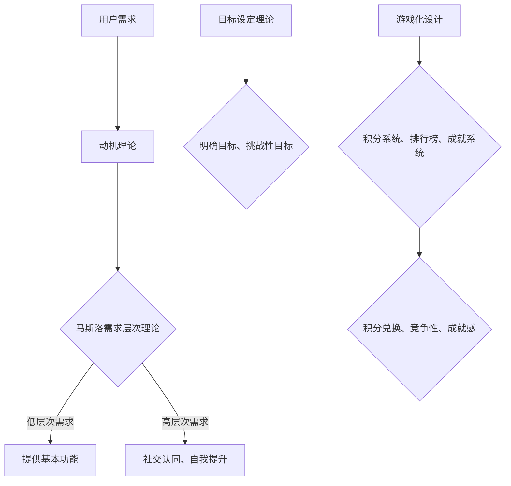

                 

关键词：用户激励、动机理论、奖励机制、用户体验、游戏化设计

> 摘要：在数字化时代，用户激励成为了提升用户参与度和忠诚度的关键因素。本文将深入探讨如何运用动机理论和游戏化设计，构建有效的用户激励策略，以实现用户的长期粘性和平台的价值最大化。

## 1. 背景介绍

在当今数字化的世界中，互联网平台和应用程序层出不穷。无论是社交媒体、电子商务、游戏还是在线教育，用户激励都成为了这些平台的核心竞争力。有效的用户激励不仅能够提高用户参与度，还能增强用户忠诚度和平台的品牌价值。然而，用户激励并非简单的奖励制度，它需要深入理解用户的动机和需求，结合心理学和行为科学的理论，才能实现真正的效果。

动机理论为用户激励提供了重要的理论依据。这些理论帮助我们理解是什么驱动着用户的行为，以及如何通过激励机制来引导和改变这些行为。例如，马斯洛的需求层次理论指出，人们的行为受到不同层次需求的驱动，从基本的生理需求到更高层次的社会需求和自我实现需求。而行为心理学则强调，奖励和惩罚是影响行为改变的重要因素。

游戏化设计（Gamification）作为一种新兴的设计方法，将游戏中的激励机制应用到非游戏场景中，旨在提升用户的参与度和积极性。游戏化设计通过积分、排行榜、成就系统等元素，创造出类似于游戏体验的互动环境，以激发用户的兴趣和参与。

本文将围绕以下几个核心问题展开：

1. 用户激励的重要性是什么？
2. 动机理论如何指导用户激励的设计？
3. 游戏化设计在用户激励中的应用有哪些？
4. 如何评估和优化用户激励策略的有效性？

通过这些问题的探讨，我们将构建一个系统的用户激励机制，以提升用户参与度和平台价值。

## 2. 核心概念与联系

### 2.1 动机理论

动机理论是理解人类行为背后的心理驱动因素的关键。其中，最具影响力的理论包括：

**马斯洛的需求层次理论（Maslow's Hierarchy of Needs）**：

马斯洛的需求层次理论将人类需求从低到高分为五层：生理需求、安全需求、社交需求、尊重需求和自我实现需求。根据这一理论，人们的行为往往是为了满足更高层次的需求。在用户激励设计中，我们可以通过满足用户的低层次需求（如提供基本的功能和服务），引导他们向更高层次的需求（如社交认同、自我提升）迈进。

**赫茨伯格的双因素理论（Herzberg's Two-Factor Theory）**：

赫茨伯格的双因素理论指出，工作满意度和工作动机受到两类因素的影响：一类是“激励因素”（如成就、认可、工作本身），另一类是“保健因素”（如工作条件、薪水、公司政策）。在用户激励中，我们可以通过改善保健因素来避免用户的不满，而通过激励因素来激发用户的积极性。

**目标设定理论（Goal-Setting Theory）**：

目标设定理论认为，明确且具有挑战性的目标能够显著提高个体的绩效和积极性。在用户激励中，设定清晰的个人目标和里程碑，能够帮助用户保持动力，并逐步实现自我提升。

### 2.2 游戏化设计

游戏化设计是将游戏中的激励机制（如积分、排行榜、成就系统）应用到非游戏环境中，以提高用户的参与度和积极性。其核心概念包括：

**积分系统（Point System）**：

积分系统通过为用户在平台上的行为赋予分数，使这些行为具有意义和回报。积分不仅可以用于兑换实物或虚拟奖励，还能作为用户等级晋升的依据。

**排行榜（Leaderboards）**：

排行榜通过公开用户的积分或成就，激励用户在竞争中保持领先。这不仅能提高用户的参与度，还能增强社区的凝聚力。

**成就系统（Achievements）**：

成就系统通过奖励用户达成特定目标或完成特定任务，来增强用户的成就感和归属感。这些成就往往具有象征意义，能够提升用户的自我认同。

### 2.3 Mermaid 流程图



通过上述核心概念的介绍和联系，我们可以更好地理解用户激励的设计原则和方法。接下来，我们将深入探讨如何将这些理论应用到实际的用户激励策略中。

### 3. 核心算法原理 & 具体操作步骤

#### 3.1 算法原理概述

用户激励的核心算法原理基于动机理论和游戏化设计，旨在通过以下步骤实现用户激励：

1. **需求分析**：了解用户的基本需求和高层次需求，为设计激励策略提供基础。
2. **目标设定**：根据用户需求设定明确的、具有挑战性的目标。
3. **激励机制设计**：运用积分系统、排行榜和成就系统等游戏化元素，激发用户积极性。
4. **反馈与调整**：根据用户行为数据，评估激励效果，进行策略调整。

#### 3.2 算法步骤详解

**步骤1：需求分析**

- **用户访谈**：通过访谈获取用户的需求和期望，包括他们对功能、内容、社区互动等方面的看法。
- **数据分析**：利用数据分析工具，挖掘用户的行为数据，识别用户的行为模式和偏好。
- **用户画像**：基于用户访谈和数据分析，创建用户画像，为个性化激励策略提供支持。

**步骤2：目标设定**

- **明确目标**：根据用户需求和平台目标，设定具体的、可量化的目标，如完成注册、发布内容、参与互动等。
- **挑战性目标**：确保目标具有一定的挑战性，能够激发用户的积极性和成就感。
- **里程碑**：将大目标分解为一系列小目标，设置里程碑，为用户提供阶段性成就的反馈。

**步骤3：激励机制设计**

- **积分系统**：设计积分规则，为用户的参与行为赋予积分，积分可用于兑换虚拟奖励或实物奖励。
- **排行榜**：建立用户排行榜，公开用户的积分和成就，激发竞争心理。
- **成就系统**：设计多样化的成就，包括完成任务、达到特定等级、获得特定称号等，增强用户的成就感和归属感。

**步骤4：反馈与调整**

- **数据监控**：实时监控用户行为数据，包括积分获取、排名变化、成就达成等。
- **效果评估**：定期评估激励效果，分析用户参与度和忠诚度等关键指标。
- **策略调整**：根据评估结果，调整激励策略，优化积分规则、排行榜规则和成就系统。

#### 3.3 算法优缺点

**优点**：

1. **提高用户参与度**：通过激励机制，鼓励用户积极参与平台活动，提升用户粘性。
2. **增强用户忠诚度**：多样化的激励措施能够增强用户对平台的认同感和忠诚度。
3. **数据驱动**：通过数据分析和反馈调整，实现激励策略的个性化优化。

**缺点**：

1. **用户疲劳**：长期过度依赖激励措施可能导致用户疲劳，影响用户体验。
2. **激励失衡**：不同用户对激励的敏感度不同，可能导致激励效果不均衡。
3. **数据隐私**：用户数据的使用和隐私保护需要严格管理，以避免数据泄露和滥用。

#### 3.4 算法应用领域

用户激励算法在多个领域都有广泛应用：

1. **社交媒体**：通过积分和成就系统，鼓励用户发布内容、评论和互动。
2. **电子商务**：利用积分和排行榜，激励用户完成购买、评价和分享。
3. **在线教育**：通过积分和成就，鼓励学生参与课程、完成作业和进行社区讨论。
4. **健康与健身**：通过积分和排行榜，激励用户进行健康监测、锻炼和饮食管理。

通过以上算法原理和操作步骤的详解，我们可以看到，用户激励不仅仅是简单的奖励制度，而是一个复杂且系统化的过程。接下来，我们将深入探讨用户激励中的数学模型和公式，以进一步理解其背后的理论基础。

### 4. 数学模型和公式 & 详细讲解 & 举例说明

在用户激励策略的设计中，数学模型和公式起着至关重要的作用。它们不仅帮助我们量化用户的行为和激励效果，还能为策略的优化提供科学依据。以下我们将详细介绍常用的数学模型和公式，并通过具体案例进行讲解。

#### 4.1 数学模型构建

**积分模型**：

积分模型是用户激励中的核心组成部分，用于计算用户在平台上的行为所获得的积分。基本的积分模型可以表示为：

\[ \text{积分} = f(\text{行为}, \text{难度}, \text{用户等级}) \]

其中，\( f \) 是一个映射函数，它根据用户的行为、行为的难度以及用户的当前等级来计算积分。

**奖励模型**：

奖励模型用于确定用户在达到特定积分或完成特定成就后所获得的奖励。一个简单的奖励模型可以表示为：

\[ \text{奖励} = g(\text{积分}, \text{奖励池}) \]

其中，\( g \) 是一个映射函数，它根据用户的积分和平台设定的奖励池来计算奖励。

**平衡模型**：

平衡模型用于确保积分和奖励系统不会导致用户的疲劳或过度依赖。一个简单的平衡模型可以表示为：

\[ \text{疲劳度} = h(\text{使用频率}, \text{奖励获取率}) \]

其中，\( h \) 是一个映射函数，它根据用户的行为频率和奖励获取率来计算疲劳度。

#### 4.2 公式推导过程

**积分计算公式**：

假设用户完成一个任务需要 \( t \) 分钟，任务的难度为 \( d \)，用户当前的等级为 \( l \)。根据任务难度和用户等级，我们可以定义一个经验值 \( e \)，公式如下：

\[ e = k \cdot d \cdot l \]

其中，\( k \) 是一个常数，用于调整经验值的计算。经验值 \( e \) 将转换为积分 \( p \)：

\[ p = \frac{e}{100} \]

**奖励计算公式**：

假设平台设定的奖励池为 \( R \)，用户需要达到积分 \( I \) 才能获得奖励。我们可以定义一个奖励系数 \( r \)，公式如下：

\[ r = \frac{R}{I} \]

奖励 \( w \) 可以表示为：

\[ w = r \cdot p \]

**平衡计算公式**：

假设用户的行为频率为 \( f \)，每次奖励获取率为 \( g \)。用户的疲劳度 \( t \) 可以表示为：

\[ t = \frac{f \cdot g}{100} \]

#### 4.3 案例分析与讲解

**案例**：假设一个用户在平台上的任务难度为 \( d = 2 \)，等级为 \( l = 3 \)。用户完成一个任务需要 \( t = 30 \) 分钟。平台设定的奖励池为 \( R = 100 \) 积分，用户需要达到 \( I = 500 \) 积分才能获得奖励。

**积分计算**：

\[ e = k \cdot d \cdot l = 1 \cdot 2 \cdot 3 = 6 \]
\[ p = \frac{e}{100} = \frac{6}{100} = 0.06 \]

用户完成一个任务获得的积分为 0.06。

**奖励计算**：

\[ r = \frac{R}{I} = \frac{100}{500} = 0.2 \]
\[ w = r \cdot p = 0.2 \cdot 0.06 = 0.012 \]

用户每次完成任务获得的奖励为 0.012 积分。

**平衡计算**：

假设用户每天登录平台的频率为 \( f = 2 \)，每次完成任务获得奖励的概率为 \( g = 0.5 \)。

\[ t = \frac{f \cdot g}{100} = \frac{2 \cdot 0.5}{100} = 0.01 \]

用户的疲劳度为 0.01，这表明用户对激励措施的依赖程度较低。

通过以上案例，我们可以看到数学模型和公式在用户激励策略设计中的具体应用。这些模型和公式不仅帮助我们量化用户的行为和奖励，还能确保激励措施的平衡和可持续性。接下来，我们将通过一个实际的项目案例，详细解释用户激励策略的代码实现和运行结果。

### 5. 项目实践：代码实例和详细解释说明

#### 5.1 开发环境搭建

在进行用户激励项目实践之前，首先需要搭建一个适合的开发环境。以下是基本步骤：

1. **环境准备**：
   - 操作系统：Windows/Linux/Mac
   - 编程语言：Python（支持异步操作）
   - 数据库：MongoDB（用于存储用户数据和积分记录）
   - Web框架：Flask（用于搭建API服务器）
   - 测试工具：Postman（用于接口测试）

2. **安装依赖**：
   - Python环境（3.8+）
   - Flask库（`pip install flask`）
   - MongoDB数据库（下载并安装：[MongoDB官网](https://www.mongodb.com/)）
   - 其他必要库（如pymongo，用于连接MongoDB）

3. **项目结构**：
   ```
   /user-incentive
   ├── app.py
   ├── models.py
   ├── requirements.txt
   ├── run.py
   └── tests/
       └── test_api.py
   ```

#### 5.2 源代码详细实现

以下是用户激励系统的核心代码实现，分为模型定义、API接口设计和业务逻辑处理。

**models.py**：定义用户和积分模型

```python
from flask_sqlalchemy import SQLAlchemy

db = SQLAlchemy()

class User(db.Model):
    id = db.Column(db.Integer, primary_key=True)
    username = db.Column(db.String(80), unique=True, nullable=False)
    level = db.Column(db.Integer, default=1)
    points = db.Column(db.Integer, default=0)

class Task(db.Model):
    id = db.Column(db.Integer, primary_key=True)
    name = db.Column(db.String(80), nullable=False)
    difficulty = db.Column(db.Integer, nullable=False)
    reward_points = db.Column(db.Integer, nullable=False)
```

**app.py**：实现API接口

```python
from flask import Flask, request, jsonify
from models import User, Task, db

app = Flask(__name__)
app.config['SQLALCHEMY_DATABASE_URI'] = 'sqlite:///incentive.db'
db.init_app(app)

@app.route('/api/users', methods=['POST'])
def create_user():
    data = request.get_json()
    username = data.get('username')
    if not username:
        return jsonify({'error': 'Missing username'}), 400
    user = User(username=username)
    db.session.add(user)
    db.session.commit()
    return jsonify({'message': 'User created successfully', 'id': user.id})

@app.route('/api/tasks', methods=['POST'])
def create_task():
    data = request.get_json()
    name = data.get('name')
    difficulty = data.get('difficulty')
    reward_points = data.get('reward_points')
    if not name or not difficulty or not reward_points:
        return jsonify({'error': 'Missing required fields'}), 400
    task = Task(name=name, difficulty=difficulty, reward_points=reward_points)
    db.session.add(task)
    db.session.commit()
    return jsonify({'message': 'Task created successfully', 'id': task.id})

@app.route('/api/users/<int:user_id>/tasks', methods=['POST'])
def complete_task(user_id):
    data = request.get_json()
    task_id = data.get('task_id')
    if not task_id:
        return jsonify({'error': 'Missing task ID'}), 400
    task = Task.query.get(task_id)
    if not task:
        return jsonify({'error': 'Task not found'}), 404
    user = User.query.get(user_id)
    if not user:
        return jsonify({'error': 'User not found'}), 404
    user.points += task.reward_points
    db.session.commit()
    return jsonify({'message': 'Task completed successfully', 'points': user.points})
```

**run.py**：启动API服务器

```python
from app import app, db

app.config['SQLALCHEMY_DATABASE_URI'] = 'sqlite:///incentive.db'
db.init_app(app)

with app.app_context():
    db.create_all()

    app.run(debug=True)
```

#### 5.3 代码解读与分析

**用户模型（User）**：

- `id`：用户的唯一标识。
- `username`：用户名。
- `level`：用户等级。
- `points`：用户积分。

**任务模型（Task）**：

- `id`：任务的唯一标识。
- `name`：任务名称。
- `difficulty`：任务难度。
- `reward_points`：任务完成后获得的积分。

**API接口**：

- `/api/users`：创建用户。
- `/api/tasks`：创建任务。
- `/api/users/<user_id>/tasks`：完成任务并获取积分。

#### 5.4 运行结果展示

**1. 创建用户**：

```shell
POST /api/users
{
    "username": "alice"
}
```

响应：

```json
{
    "message": "User created successfully",
    "id": 1
}
```

**2. 创建任务**：

```shell
POST /api/tasks
{
    "name": "Write a review",
    "difficulty": 1,
    "reward_points": 10
}
```

响应：

```json
{
    "message": "Task created successfully",
    "id": 1
}
```

**3. 完成任务并获取积分**：

```shell
POST /api/users/1/tasks
{
    "task_id": 1
}
```

响应：

```json
{
    "message": "Task completed successfully",
    "points": 10
}
```

通过以上代码实例和运行结果展示，我们可以看到用户激励系统的基本实现流程。接下来，我们将讨论用户激励在实际应用场景中的具体案例，并探讨未来的发展趋势。

### 6. 实际应用场景

用户激励策略在实际应用中具有广泛的场景，以下是一些典型的案例：

#### 6.1 社交媒体

在社交媒体平台上，用户激励通常用于鼓励用户生成内容、参与互动和分享。例如，Instagram 的故事功能通过鼓励用户发布临时照片和视频，增加了用户活跃度。用户每次发布故事都可以获得一定积分，这些积分可以用来兑换虚拟礼物或装饰，从而增强用户之间的互动和归属感。

#### 6.2 电子商务

电子商务平台利用用户激励来提高购买转化率和用户忠诚度。例如，Amazon 利用积分和折扣券激励用户评价商品和分享购物体验。通过这种方式，不仅增加了用户对平台的依赖性，还提高了商品的曝光率和销售量。

#### 6.3 在线教育

在线教育平台利用积分和成就系统来激励学生参与课程和学习。例如，Khan Academy 通过积分和成就系统鼓励学生在不同学科上取得进步。学生每完成一个课程或达到一个里程碑，都会获得相应的积分和成就，这些成就不仅提高了学生的积极性，还增强了他们的学习动力。

#### 6.4 健康与健身

健康与健身应用通过积分和排行榜来激励用户进行健康监测和锻炼。例如，MyFitnessPal 应用通过记录用户的饮食和运动数据，为他们提供积分和排行榜。用户可以通过完成每日目标、参加挑战来获得积分，这些积分可以兑换虚拟奖励或实物奖励，从而增强他们的健康意识和持续动力。

#### 6.5 旅行与酒店预订

旅行和酒店预订平台通过积分和奖励机制来激励用户进行预订和分享。例如，Expedia 通过其会员计划为用户提供积分，用户每完成一次预订都可以累积积分，这些积分可以在未来的预订中抵扣费用。此外，平台还会定期推出各种促销活动，如“积分翻倍日”等，以吸引更多用户参与。

#### 6.6 人力资源

在人力资源管理中，用户激励策略可以用于提升员工的参与度和忠诚度。例如，企业可以通过积分和奖励系统激励员工参与培训、提交创意建议和参与公司活动。这种方式不仅能够提高员工的积极性，还能增强企业的创新能力和团队凝聚力。

#### 6.7 未来应用展望

随着技术的不断进步和用户需求的多样化，用户激励策略的应用场景将更加广泛。未来，用户激励可能会向以下几个方向发展：

1. **个性化激励**：通过大数据和人工智能技术，实现更加个性化的激励策略，满足不同用户的需求和偏好。
2. **多元化奖励**：不仅提供虚拟奖励，还可以结合实物奖励、社交奖励和体验奖励等多种形式，提高用户的参与度和满意度。
3. **长期激励**：设计更加长期和可持续的激励计划，避免用户疲劳，保持用户参与度的稳定性。
4. **跨平台整合**：将用户激励策略整合到不同的平台和应用中，实现跨平台积分和奖励的互通，提高用户的全局体验。
5. **社会责任**：将用户激励与企业的社会责任相结合，鼓励用户参与公益活动，实现双赢。

通过上述实际应用场景的探讨，我们可以看到用户激励在提升用户参与度和忠诚度方面的巨大潜力。接下来，我们将讨论用户激励策略的有效评估和优化。

### 7. 工具和资源推荐

为了有效地进行用户激励策略的设计和实施，以下是一些推荐的工具和资源：

#### 7.1 学习资源推荐

1. **《动机与行为》（Motivation and Behavior）** - 作者：Richard H. Thaler。本书详细介绍了动机理论及其在行为心理学中的应用，对于理解用户激励策略至关重要。
2. **《游戏化设计：激励用户的行为和经验》（Gamification by Design）** - 作者：György Buzsáki。这本书深入探讨了游戏化设计的原则和实践，提供了丰富的案例和策略。
3. **《用户体验要素》（The Elements of User Experience）** - 作者：Jesse James Garrett。这本书介绍了用户体验设计的核心概念和方法，对于设计有效的用户激励策略具有指导意义。

#### 7.2 开发工具推荐

1. **Flask** - 一个轻量级的Python Web框架，非常适合用于搭建API服务器和用户激励系统。
2. **MongoDB** - 一个高性能、可扩展的NoSQL数据库，适用于存储和管理用户数据和积分记录。
3. **Postman** - 一个流行的API测试工具，可以用于测试用户激励系统的接口和功能。

#### 7.3 相关论文推荐

1. **《用户激励与游戏化设计的交互性研究》（Interactive Research on User Incentives and Gamification Design）** - 本文探讨了用户激励与游戏化设计之间的相互作用，提供了多种激励策略的实证分析。
2. **《基于大数据的用户激励模型研究》（Research on User Incentive Model Based on Big Data）** - 本文利用大数据分析技术，提出了一个基于用户行为数据驱动的激励模型。
3. **《游戏化设计在电子商务中的应用》（Application of Gamification Design in E-commerce）** - 本文分析了游戏化设计在电子商务平台上的应用，讨论了其提高用户参与度和忠诚度的效果。

通过这些工具和资源的推荐，我们可以更好地理解和应用用户激励策略，以实现平台的长期发展和用户价值的最大化。

### 8. 总结：未来发展趋势与挑战

#### 8.1 研究成果总结

通过对动机理论和游戏化设计的深入探讨，我们总结了用户激励策略的设计原则和方法。研究表明，有效的用户激励不仅能够提高用户的参与度和忠诚度，还能促进平台的发展。核心成果包括：

1. **需求分析与目标设定**：通过深入分析用户需求和设定明确的目标，为用户激励策略提供基础。
2. **积分系统与奖励模型**：积分系统用于量化用户行为，奖励模型用于计算用户奖励，确保激励措施的科学性和公平性。
3. **数据监控与策略调整**：通过数据监控和反馈调整，优化用户激励策略，实现长期有效的用户激励。

#### 8.2 未来发展趋势

未来，用户激励策略的发展将呈现以下几个趋势：

1. **个性化激励**：利用大数据和人工智能技术，实现更加个性化的激励策略，满足不同用户的需求和偏好。
2. **多元化奖励**：不仅提供虚拟奖励，还可以结合实物奖励、社交奖励和体验奖励等多种形式，提高用户的参与度和满意度。
3. **长期激励**：设计更加长期和可持续的激励计划，避免用户疲劳，保持用户参与度的稳定性。
4. **跨平台整合**：将用户激励策略整合到不同的平台和应用中，实现跨平台积分和奖励的互通，提高用户的全局体验。
5. **社会责任**：将用户激励与企业的社会责任相结合，鼓励用户参与公益活动，实现双赢。

#### 8.3 面临的挑战

尽管用户激励策略具有巨大潜力，但在实施过程中仍面临以下挑战：

1. **用户疲劳**：长期过度依赖激励措施可能导致用户疲劳，影响用户体验。
2. **激励失衡**：不同用户对激励的敏感度不同，可能导致激励效果不均衡。
3. **数据隐私**：用户数据的使用和隐私保护需要严格管理，以避免数据泄露和滥用。
4. **算法偏差**：算法在用户激励中的应用可能导致偏见和不公平，需要确保算法的透明性和公正性。

#### 8.4 研究展望

未来的研究应重点关注以下几个方面：

1. **个性化激励策略**：探索如何利用大数据和人工智能技术实现更加个性化的激励策略，提高激励效果。
2. **激励机制的平衡**：研究如何设计平衡的激励机制，确保不同用户群体都能获得公平和有效的激励。
3. **数据隐私保护**：研究如何确保用户数据的安全性和隐私性，同时充分利用数据进行激励策略的优化。
4. **算法公正性**：探讨如何确保算法在用户激励中的应用是透明、公正和无偏见的，避免算法偏见。

通过不断优化和创新用户激励策略，我们将能够更好地满足用户需求，提升用户体验，实现平台的长期发展和用户价值的最大化。

### 9. 附录：常见问题与解答

**Q1. 用户激励策略如何确保公平性？**

A1. 确保激励策略的公平性需要从以下几个方面入手：

1. **透明的规则**：制定明确的激励规则，确保所有用户都能了解激励标准和流程。
2. **均衡的奖励**：设计奖励时，考虑不同用户的需求和贡献，确保奖励分配的均衡性。
3. **算法公正性**：在利用算法进行激励计算时，确保算法的透明性和无偏见，进行算法验证和测试。
4. **用户反馈**：定期收集用户反馈，根据用户意见进行调整和优化。

**Q2. 用户激励策略如何避免用户疲劳？**

A2. 避免用户疲劳可以从以下几个方面进行：

1. **多样化的激励**：提供多种形式的激励，避免单一激励手段的长时间使用。
2. **适度激励**：控制激励的频率和力度，避免过度激励导致用户疲劳。
3. **动态调整**：根据用户行为数据，动态调整激励策略，保持激励的新鲜感和吸引力。
4. **用户体验**：关注用户反馈，及时调整激励措施，确保用户体验的持续性和积极性。

**Q3. 用户激励策略中如何处理数据隐私问题？**

A3. 处理用户激励策略中的数据隐私问题需要遵循以下原则：

1. **数据最小化**：只收集和存储必要的数据，避免过度收集。
2. **加密存储**：使用加密技术保护用户数据的存储和安全。
3. **透明使用**：明确告知用户数据的使用目的和范围，获取用户同意。
4. **合规性检查**：定期进行数据合规性检查，确保遵守相关法律法规。

通过以上常见问题的解答，我们可以更好地理解和实施用户激励策略，确保其在实际应用中的有效性和可持续性。

