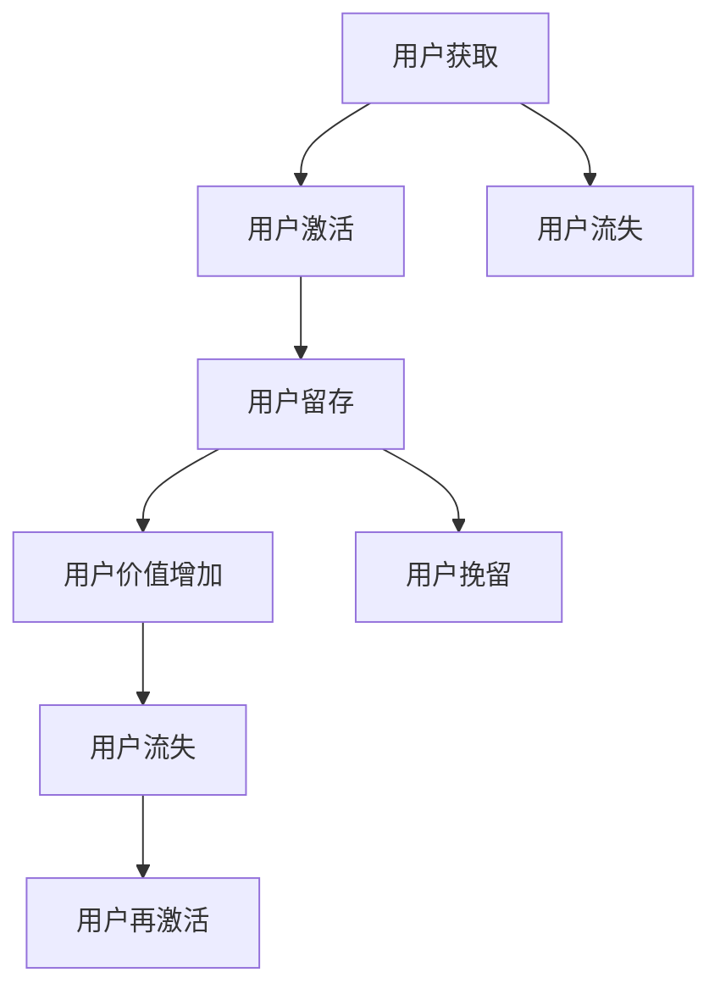

                 

用户生命周期管理是现代企业和产品运营中至关重要的一环。有效的用户生命周期管理不仅能够提升用户满意度，还能显著增加用户忠诚度和企业收益。本文将探讨如何进行有效的用户生命周期管理，包括核心概念、算法原理、数学模型、项目实践以及实际应用场景等。

## 文章关键词

- 用户生命周期管理
- 用户满意度
- 用户忠诚度
- 企业收益
- 算法原理
- 数学模型

## 文章摘要

本文旨在提供一个全面的方法论，帮助企业和产品团队有效进行用户生命周期管理。文章首先介绍了用户生命周期的基本概念和重要性，然后深入探讨了用户生命周期管理的核心算法原理和数学模型。通过实际项目实践和详细解释，读者可以了解如何将理论知识应用到实际开发中。最后，文章还探讨了用户生命周期管理在不同应用场景中的实际应用，并对未来的发展进行了展望。

### 1. 背景介绍

用户生命周期管理是一种系统化的方法，用于跟踪和管理用户从首次接触产品到最终离开产品的整个过程。这一过程通常分为几个阶段，包括获取用户（Acquisition）、激活用户（Activation）、留存用户（Retention）、增加用户价值（Conversion）和挽留用户（Churn Prevention）。每个阶段都有其特定的目标和策略，而有效的用户生命周期管理就是确保这些目标得到实现。

#### 1.1 用户生命周期管理的重要性

用户生命周期管理对企业的重要性不言而喻：

1. **提升用户满意度**：通过精确的用户数据分析和个性化的服务，用户可以得到更加贴合自己需求的产品和服务，从而提升满意度。
2. **增加用户忠诚度**：持续的互动和优质的服务体验可以增强用户的品牌忠诚度，减少用户流失。
3. **提升企业收益**：通过深入分析用户行为和偏好，企业可以更好地定位市场，提高营销效率，从而增加收益。
4. **优化运营效率**：系统化的用户生命周期管理可以帮助企业更高效地分配资源，提高运营效率。

#### 1.2 用户生命周期管理的发展趋势

随着大数据和人工智能技术的快速发展，用户生命周期管理的方法和工具也在不断进步：

1. **数据驱动的决策**：利用大数据技术，企业可以获取更全面、更准确的用户数据，从而做出更加科学的决策。
2. **个性化服务**：通过分析用户行为和偏好，提供个性化的产品推荐和服务，提升用户体验。
3. **智能化预测**：利用机器学习算法，可以预测用户的行为和需求，提前采取措施挽留潜在流失用户。
4. **跨渠道整合**：随着多渠道营销的普及，如何整合线上线下数据，提供一致的用户体验成为了一大挑战。

### 2. 核心概念与联系

在用户生命周期管理中，有几个核心概念和它们之间的联系至关重要。以下是这些概念以及它们之间的Mermaid流程图：



#### 2.1 用户获取（Acquisition）

用户获取是指企业通过各种渠道吸引新用户的过程。这包括广告投放、社交媒体营销、搜索引擎优化（SEO）等。用户获取的目的是增加用户数量，但仅仅吸引新用户是不够的，还需要确保这些用户能够真正使用并喜爱产品。

#### 2.2 用户激活（Activation）

用户激活是指确保新用户能够成功开始使用产品，并达到企业设定的激活标准。例如，对于一款应用程序，激活可能是指用户完成了首次购买或注册。

#### 2.3 用户留存（Retention）

用户留存是指企业通过各种策略和手段，维持现有用户的使用和忠诚度。高留存率表明用户对产品满意，且产品能够持续满足用户需求。

#### 2.4 用户价值增加（Conversion）

用户价值增加是指通过提升用户的活跃度和使用频率，增加用户的总体价值。这可以通过提供额外的功能、促销活动或增值服务来实现。

#### 2.5 用户挽留（Churn Prevention）

用户挽留是指采取措施减少用户流失率。这包括改进产品、提供更好的客户服务、个性化推荐等。

#### 2.6 用户流失（Churn）

用户流失是指用户停止使用产品的行为，可能是由于产品不符合用户需求、竞争对手的介入或用户自身的生活变化等原因。

#### 2.7 用户再激活（Reactivation）

用户再激活是指采取措施让曾经流失的用户重新开始使用产品。这可以通过提供激励、促销或改进产品功能来实现。

### 3. 核心算法原理 & 具体操作步骤

#### 3.1 算法原理概述

用户生命周期管理中的核心算法主要包括用户行为分析、机器学习预测和优化策略。以下是对这些算法的简要概述：

1. **用户行为分析**：通过分析用户在产品中的行为数据，如登录次数、使用时长、操作路径等，来了解用户的偏好和使用习惯。
2. **机器学习预测**：利用机器学习算法，如回归分析、决策树、随机森林等，预测用户的行为和留存概率。
3. **优化策略**：根据预测结果，制定相应的优化策略，如个性化推荐、用户分组、促销活动等，以提升用户留存和满意度。

#### 3.2 算法步骤详解

1. **数据收集**：收集用户在产品中的行为数据，包括登录、使用时长、操作路径、购买记录等。
2. **数据预处理**：清洗和整合数据，去除异常值和重复数据，并进行特征工程，提取有用的特征。
3. **用户行为分析**：利用统计方法，如聚类分析、关联规则挖掘等，分析用户的行为特征。
4. **机器学习模型训练**：选择合适的机器学习算法，如决策树、随机森林、神经网络等，训练模型。
5. **预测与评估**：使用训练好的模型对用户进行预测，评估模型的准确性和效果。
6. **优化策略制定**：根据预测结果和用户行为分析，制定相应的优化策略，如个性化推荐、用户分组、促销活动等。
7. **实施与反馈**：实施优化策略，收集用户反馈，并根据反馈调整策略。

#### 3.3 算法优缺点

- **优点**：
  - 高效：利用机器学习和大数据技术，可以快速分析大量用户数据，提供准确的预测和优化建议。
  - 个性化：通过用户行为分析和预测，可以提供个性化的产品和服务，提升用户体验。
  - 持续优化：通过持续的数据收集和模型训练，可以不断优化策略，提高用户留存和满意度。

- **缺点**：
  - 复杂性：算法的建立和实施过程复杂，需要专业的技术和设备支持。
  - 数据依赖：算法的效果高度依赖于数据的质量和完整性，数据质量不好会导致预测不准确。

#### 3.4 算法应用领域

- **电子商务**：通过用户行为分析和个性化推荐，提高用户购买转化率。
- **在线教育**：根据用户的学习行为，提供个性化的学习路径和课程推荐。
- **金融行业**：通过用户行为分析，预测用户的流失风险，采取相应的挽留措施。
- **互联网服务**：通过用户行为分析，优化用户体验，提高用户满意度和忠诚度。

### 4. 数学模型和公式 & 详细讲解 & 举例说明

#### 4.1 数学模型构建

在用户生命周期管理中，常用的数学模型包括回归模型、决策树、随机森林等。以下是这些模型的构建方法和适用场景：

1. **回归模型**：
   - **构建方法**：通过最小二乘法或其他优化算法，建立用户留存率与特征变量之间的关系。
   - **适用场景**：预测用户留存概率，用于用户挽留策略的制定。
   - **示例**：
     $$ Y = \beta_0 + \beta_1X_1 + \beta_2X_2 + ... + \beta_nX_n $$

2. **决策树**：
   - **构建方法**：通过递归划分数据集，构建决策树模型。
   - **适用场景**：分类问题，如用户流失预测。
   - **示例**：
     ```mermaid
     graph TD
         A[用户年龄]
         B[用户购买历史]
         C[用户留存]
     
         A -->|<20岁| B
         B -->|购买次数多| C
         B -->|购买次数少| D
     ```

3. **随机森林**：
   - **构建方法**：通过构建多个决策树，并使用随机抽样和特征选择，提高模型的预测能力。
   - **适用场景**：回归和分类问题，如用户留存预测。
   - **示例**：
     ```python
     from sklearn.ensemble import RandomForestClassifier
     model = RandomForestClassifier(n_estimators=100)
     model.fit(X_train, y_train)
     ```

#### 4.2 公式推导过程

以回归模型为例，推导用户留存率的预测公式。假设我们有以下特征变量：

- 用户年龄（$X_1$）
- 用户购买历史（$X_2$）
- 用户使用时长（$X_3$）

我们希望通过这些特征变量预测用户留存率（$Y$）。根据最小二乘法，回归模型的公式可以表示为：

$$ Y = \beta_0 + \beta_1X_1 + \beta_2X_2 + \beta_3X_3 $$

其中，$\beta_0$、$\beta_1$、$\beta_2$、$\beta_3$是模型的参数，需要通过训练数据集进行估计。

#### 4.3 案例分析与讲解

假设我们有一个电商平台的用户留存预测问题。我们有以下数据：

- 用户年龄：20、30、40、50
- 用户购买历史：0次、1次、2次、3次
- 用户使用时长：100小时、200小时、300小时、400小时
- 用户留存率：0.8、0.9、0.85、0.7

我们希望通过这些数据训练一个回归模型，预测用户留存率。

1. **数据预处理**：
   - 对年龄、购买历史和使用时长进行归一化处理。
   - 将留存率作为目标变量，其余特征变量作为输入变量。

2. **模型训练**：
   - 使用最小二乘法，建立回归模型。
   - 通过交叉验证，选择最佳参数。

3. **模型评估**：
   - 使用测试集评估模型效果，计算预测准确率。

4. **结果分析**：
   - 根据预测结果，制定相应的用户挽留策略。

通过上述案例，我们可以看到数学模型在用户生命周期管理中的应用，以及如何利用数学模型优化用户留存和满意度。

### 5. 项目实践：代码实例和详细解释说明

在本文的第五部分，我们将通过一个实际项目实例，详细讲解如何进行用户生命周期管理。我们将使用Python和相关的机器学习库，如scikit-learn和pandas，来实现用户留存预测。

#### 5.1 开发环境搭建

1. **安装Python**：
   - 访问Python官方网站（https://www.python.org/）下载Python安装包。
   - 按照安装向导进行安装。

2. **安装必要的库**：
   - 打开命令行终端，执行以下命令：
     ```shell
     pip install numpy pandas scikit-learn matplotlib
     ```

#### 5.2 源代码详细实现

以下是一个简单的用户留存预测项目的实现步骤：

1. **数据加载与预处理**：
   - 读取用户数据，包括年龄、购买历史和使用时长。
   - 对数据进行归一化处理。

2. **数据划分**：
   - 将数据集划分为训练集和测试集。

3. **模型训练**：
   - 使用训练集训练回归模型。

4. **模型评估**：
   - 使用测试集评估模型效果。

5. **结果分析**：
   - 根据预测结果，制定用户挽留策略。

具体代码如下：

```python
import numpy as np
import pandas as pd
from sklearn.model_selection import train_test_split
from sklearn.linear_model import LinearRegression
from sklearn.metrics import mean_squared_error

# 1. 数据加载与预处理
data = pd.read_csv('user_data.csv')
data = (data - data.mean()) / data.std()

# 2. 数据划分
X = data.drop('retention_rate', axis=1)
y = data['retention_rate']
X_train, X_test, y_train, y_test = train_test_split(X, y, test_size=0.2, random_state=42)

# 3. 模型训练
model = LinearRegression()
model.fit(X_train, y_train)

# 4. 模型评估
y_pred = model.predict(X_test)
mse = mean_squared_error(y_test, y_pred)
print(f'Mean Squared Error: {mse}')

# 5. 结果分析
# 根据预测结果，制定用户挽留策略
```

#### 5.3 代码解读与分析

- **数据加载与预处理**：
  - 使用pandas读取用户数据，并进行归一化处理，确保模型输入的数据在相同的尺度上。

- **数据划分**：
  - 使用scikit-learn的train_test_split函数将数据集划分为训练集和测试集，用于模型的训练和评估。

- **模型训练**：
  - 使用LinearRegression类创建线性回归模型，并使用fit方法进行训练。

- **模型评估**：
  - 使用模型预测测试集的结果，并计算均方误差（MSE），评估模型的性能。

- **结果分析**：
  - 根据模型的预测结果，可以制定相应的用户挽留策略，如发送个性化优惠券、提供定制化服务等。

通过上述代码实例，我们可以看到如何利用Python和机器学习技术进行用户生命周期管理。这个实例虽然简单，但已经包含了用户生命周期管理的基本流程和关键步骤。

### 6. 实际应用场景

用户生命周期管理在不同行业和领域中有着广泛的应用。以下是一些典型的实际应用场景：

#### 6.1 电子商务

在电子商务领域，用户生命周期管理可以通过以下方式应用：

- **个性化推荐**：根据用户的历史购买行为和浏览记录，推荐相关商品，提升购买转化率。
- **促销活动**：通过用户留存预测，识别高价值用户，并针对他们进行促销活动，提高用户忠诚度。
- **流失预警**：利用用户行为数据，预测可能流失的用户，提前采取挽留措施，减少用户流失。

#### 6.2 在线教育

在线教育平台可以利用用户生命周期管理实现以下目标：

- **学习路径优化**：根据用户的学习行为和成绩，推荐适合的学习路径和课程，提高学习效果。
- **用户留存提升**：通过分析用户的学习行为，识别潜在流失用户，提供额外的学习资源和激励，提高用户留存率。
- **课程推荐**：利用用户行为数据，推荐可能感兴趣的课程，增加用户活跃度。

#### 6.3 金融行业

金融行业可以利用用户生命周期管理实现以下目标：

- **风险评估**：通过分析用户的交易行为和信用记录，预测潜在的风险，采取相应的风险控制措施。
- **用户挽留**：识别可能流失的用户，提供个性化的金融服务和优惠，提高用户忠诚度。
- **精准营销**：通过用户行为数据，识别潜在的目标客户，进行精准的营销活动，提高营销效果。

#### 6.4 其他领域

除了上述领域，用户生命周期管理还可以应用于以下领域：

- **互联网服务**：通过用户行为分析，优化产品功能和用户体验，提高用户满意度。
- **健康医疗**：通过用户健康数据，提供个性化的健康建议和治疗方案，提高健康管理水平。
- **智能硬件**：通过用户使用数据，优化产品设计和功能，提高用户满意度。

### 7. 未来应用展望

随着大数据和人工智能技术的不断发展，用户生命周期管理将在未来得到更广泛的应用和进一步的发展：

- **智能化预测**：利用深度学习等先进算法，实现更准确的用户行为预测和留存预测。
- **跨渠道整合**：实现线上线下数据的整合，提供一致的用户体验。
- **个性化服务**：通过更加精准的用户数据分析，提供个性化的产品和服务。
- **自动化运营**：利用自动化工具和机器人，实现用户生命周期管理的自动化运营，提高运营效率。

### 8. 工具和资源推荐

在进行用户生命周期管理时，以下工具和资源可能对您有所帮助：

#### 8.1 学习资源推荐

- 《用户行为分析：理论与实践》
- 《机器学习实战》
- 《Python数据分析》

#### 8.2 开发工具推荐

- Jupyter Notebook：用于编写和运行代码，方便数据分析和机器学习实验。
- scikit-learn：用于机器学习模型的训练和评估。
- pandas：用于数据处理和分析。

#### 8.3 相关论文推荐

- "User Behavior Analysis in E-commerce: A Survey"
- "Machine Learning Techniques for User Churn Prediction"
- "Deep Learning for User Retention"

### 9. 总结：未来发展趋势与挑战

用户生命周期管理是现代企业和产品运营的关键。随着大数据和人工智能技术的不断发展，用户生命周期管理将在未来得到更广泛的应用和进一步的发展。然而，这也带来了一系列的挑战：

- **数据隐私**：如何在保证用户隐私的前提下，进行有效的用户数据分析？
- **算法透明度**：如何确保算法的透明度和可解释性，提高用户信任？
- **跨渠道整合**：如何实现线上线下数据的整合，提供一致的用户体验？

面对这些挑战，企业和产品团队需要不断创新和优化，以实现有效的用户生命周期管理。

### 附录：常见问题与解答

#### 1. 用户生命周期管理的关键指标有哪些？

关键指标包括用户留存率、用户活跃度、用户流失率、用户转化率等。

#### 2. 如何进行有效的用户行为分析？

进行有效的用户行为分析，需要收集全面、准确的用户行为数据，并利用统计方法和机器学习算法进行分析。

#### 3. 机器学习在用户生命周期管理中的应用有哪些？

机器学习可以用于用户留存预测、用户流失预警、个性化推荐等。

#### 4. 如何提高用户满意度？

提高用户满意度，可以通过个性化服务、优质客户支持、持续的产品优化等方式实现。

#### 5. 如何制定有效的用户挽留策略？

制定用户挽留策略，需要根据用户数据和行为分析，识别潜在流失用户，并采取针对性的挽留措施。

作者：禅与计算机程序设计艺术 / Zen and the Art of Computer Programming
----------------------------------------------------------------

这篇文章详细探讨了用户生命周期管理的核心概念、算法原理、数学模型以及项目实践。通过实际案例和代码实例，读者可以了解如何将理论知识应用到实际开发中。同时，文章还分析了用户生命周期管理在不同应用场景中的实际应用，并对未来的发展进行了展望。希望这篇文章对读者在用户生命周期管理领域的学习和应用有所帮助。

