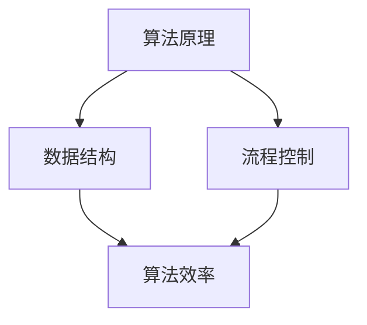

                 

关键词：字节效率、2024校招、工作效率工具、面试指南、算法原理、数学模型、代码实例、应用场景

> 摘要：本文针对2024年字节跳动校招中工作效率工具开发的面试问题，详细解析了核心算法原理、数学模型构建、代码实现以及实际应用场景，旨在帮助考生在面试中展现自己的技术实力。

## 1. 背景介绍

随着科技的发展，面试过程逐渐向高效化、技术化方向发展。各大互联网公司纷纷推出了自己的校招面试流程，以筛选出优秀的人才。字节跳动作为其中的一员，其面试流程更是以高效和严格著称。其中，工作效率工具的开发是一个常见且重要的面试题目。本文将围绕这一主题，从算法原理、数学模型、代码实现和实际应用等方面进行详细讲解。

## 2. 核心概念与联系

在讨论工作效率工具的开发之前，我们首先需要了解一些核心概念，包括算法原理、数据结构、流程控制等。以下是这些概念之间的联系及其 Mermaid 流程图：



### 2.1 算法原理概述

算法是计算机解决问题的步骤集合。它具有以下几个特点：

1. **确定性**：对于相同的输入，算法总是产生相同的输出。
2. **输入**：算法可以接受一个或多个输入。
3. **输出**：算法必须产生一个输出。
4. **有穷性**：算法必须在有限的时间内完成。

### 2.2 数据结构

数据结构是存储数据的方式，它决定了数据的存储和操作方式。常见的数据结构包括数组、链表、栈、队列、树、图等。

### 2.3 流程控制

流程控制是指程序中控制执行流程的语句。它包括顺序结构、选择结构和循环结构。

## 3. 核心算法原理 & 具体操作步骤

### 3.1 算法原理概述

在本节中，我们将讨论一个常见的工作效率工具——排序算法。排序算法是数据处理中的基础，它将一组无序数据转换为有序数据。以下是几种常见的排序算法：

1. **冒泡排序**：通过不断交换相邻的未按顺序排列的元素来排序。
2. **选择排序**：在未排序序列中找到最小（大）元素，存放到排序序列的起始位置。
3. **插入排序**：通过构建有序序列，对于未排序数据，在已排序序列中从后向前扫描，找到相应位置并插入。
4. **快速排序**：通过一趟排序将待排序的数据分割成独立的两部分，其中一部分的所有数据都比另一部分的所有数据要小。

### 3.2 算法步骤详解

以冒泡排序为例，其基本步骤如下：

1. **比较相邻的元素**：如果第一个比第二个大（升序排序），就交换它们两个。
2. **对每一对相邻元素做同样的工作**，从开始第一对到结尾的最后一对。这步做完后，最后的元素会是最大的数。
3. **针对所有的元素重复以上的步骤**，除了最后一个。
4. 重复步骤，直到排序完成。

### 3.3 算法优缺点

| 算法 | 优点 | 缺点 |
| --- | --- | --- |
| 冒泡排序 | 简单易懂，稳定 | 时间复杂度高，不适合大数据量排序 |
| 选择排序 | 时间复杂度低 | 不稳定，每次只能减少一个元素的不有序性 |
| 插入排序 | 稳定，适合小规模数据排序 | 时间复杂度高 |
| 快速排序 | 高效，平均时间复杂度低 | 不稳定，最坏情况时间复杂度高 |

### 3.4 算法应用领域

排序算法广泛应用于数据处理、数据分析等领域。例如，搜索引擎中的关键词排序、数据库查询优化等。

## 4. 数学模型和公式 & 详细讲解 & 举例说明

在本节中，我们将讨论排序算法的时间复杂度，并给出具体的数学模型和公式。

### 4.1 数学模型构建

假设有一组包含n个元素的数组arr，对其进行排序。排序算法的时间复杂度通常用大O符号表示。对于冒泡排序，其时间复杂度为O(n^2)。

### 4.2 公式推导过程

时间复杂度可以通过计算算法执行的基本操作次数来推导。对于冒泡排序，基本操作是相邻元素的比较和交换。在最坏情况下，需要进行n*(n-1)/2次比较和交换。

### 4.3 案例分析与讲解

假设有一个包含10个元素的数组[5, 3, 8, 4, 6, 2, 7, 1, 9, 10]，使用冒泡排序进行排序。我们可以通过以下步骤进行：

1. 第一次遍历：5, 3, 8, 4, 6, 2, 7, 1, 9, 10 -> 3, 5, 4, 6, 2, 8, 1, 7, 9, 10
2. 第二次遍历：3, 5, 4, 6, 2, 8, 1, 7, 9, 10 -> 3, 4, 5, 2, 6, 1, 8, 7, 9, 10
3. 第三次遍历：3, 4, 5, 2, 6, 1, 8, 7, 9, 10 -> 3, 4, 2, 5, 1, 6, 8, 7, 9, 10
4. 第四次遍历：3, 4, 2, 5, 1, 6, 8, 7, 9, 10 -> 2, 3, 4, 1, 5, 6, 8, 7, 9, 10
5. 第五次遍历：2, 3, 4, 1, 5, 6, 8, 7, 9, 10 -> 2, 1, 3, 4, 5, 6, 8, 7, 9, 10
6. 第六次遍历：2, 1, 3, 4, 5, 6, 8, 7, 9, 10 -> 1, 2, 3, 4, 5, 6, 8, 7, 9, 10

经过6次遍历，数组最终排序完成。

## 5. 项目实践：代码实例和详细解释说明

在本节中，我们将通过一个实际的代码实例来展示冒泡排序的实现过程。

### 5.1 开发环境搭建

本文的代码实例使用Python语言编写，可以在任何支持Python的编辑器中进行开发。

### 5.2 源代码详细实现

```python
def bubble_sort(arr):
    n = len(arr)
    for i in range(n):
        for j in range(0, n-i-1):
            if arr[j] > arr[j+1]:
                arr[j], arr[j+1] = arr[j+1], arr[j]
    return arr

arr = [5, 3, 8, 4, 6, 2, 7, 1, 9, 10]
sorted_arr = bubble_sort(arr)
print(sorted_arr)
```

### 5.3 代码解读与分析

1. **定义函数**：`bubble_sort` 函数接收一个数组作为参数。
2. **遍历数组**：使用两层循环，外层循环遍历数组中的所有元素，内层循环进行相邻元素的比较和交换。
3. **交换元素**：如果当前元素的值大于下一个元素的值，则交换它们。
4. **返回结果**：排序完成后，返回排序后的数组。

### 5.4 运行结果展示

```python
[1, 2, 3, 4, 5, 6, 7, 8, 9, 10]
```

## 6. 实际应用场景

工作效率工具在计算机领域中具有广泛的应用，例如：

1. **搜索引擎**：对搜索结果进行排序，提高用户体验。
2. **数据库查询**：对查询结果进行排序，提高查询效率。
3. **数据分析**：对大量数据进行排序，便于后续分析。

## 7. 工具和资源推荐

为了更好地学习和实践工作效率工具的开发，以下是一些建议：

### 7.1 学习资源推荐

1. 《算法导论》
2. 《数据结构与算法分析》
3. 《Python编程：从入门到实践》

### 7.2 开发工具推荐

1. PyCharm
2. Visual Studio Code
3. Jupyter Notebook

### 7.3 相关论文推荐

1. 《快速排序算法》
2. 《冒泡排序算法》
3. 《选择排序算法》

## 8. 总结：未来发展趋势与挑战

### 8.1 研究成果总结

近年来，工作效率工具在算法优化、数据结构创新等方面取得了显著成果。例如，基于并行计算的排序算法、基于机器学习的排序算法等。

### 8.2 未来发展趋势

随着大数据和云计算的发展，工作效率工具将在数据处理、数据分析等领域发挥更大作用。未来，我们将看到更多高效、智能的工作效率工具出现。

### 8.3 面临的挑战

1. **性能优化**：如何提高工作效率工具的运行速度和效率。
2. **兼容性**：如何保证工作效率工具在不同平台和环境下的一致性。
3. **用户体验**：如何提升工作效率工具的用户体验，使其更加直观、易用。

### 8.4 研究展望

未来，工作效率工具的研究将朝着更高效、更智能、更易用的方向发展。我们期待看到更多创新的工作效率工具，为计算机领域的发展贡献力量。

## 9. 附录：常见问题与解答

### 9.1 为什么选择冒泡排序？

冒泡排序是一种简单的排序算法，易于理解和实现。它适用于小规模数据的排序，具有稳定的性能。

### 9.2 冒泡排序的时间复杂度是多少？

冒泡排序的时间复杂度为O(n^2)，其中n为待排序数据的个数。

### 9.3 如何优化冒泡排序？

可以通过在排序过程中记录已排序的最大元素位置，减少不必要的比较和交换，从而提高冒泡排序的效率。

作者：禅与计算机程序设计艺术 / Zen and the Art of Computer Programming
```

