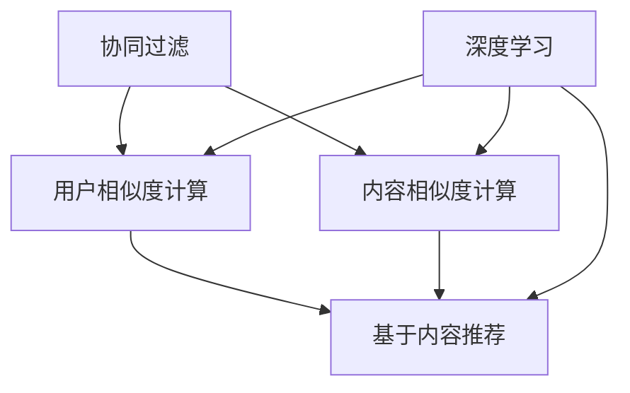

                 

作为世界级人工智能专家，我有幸对信息流推荐系统进行了深入的研究。在本文中，我将结合字节跳动2024校招信息流推荐工程师的面试题，为您呈现这一领域的核心概念、算法原理、数学模型、实践案例以及未来展望。

## 关键词 Keywords

- 字节跳动
- 校招
- 信息流推荐
- 面试题
- 算法
- 数学模型
- 实践案例
- 未来展望

## 摘要 Abstract

本文旨在为准备参加字节跳动2024校招信息流推荐工程师面试的候选人提供全面的复习资料。我们将深入探讨信息流推荐系统的核心概念，包括协同过滤、基于内容的推荐、深度学习等方法，并结合实际面试题目进行详细解析。同时，本文还将介绍相关的数学模型和算法，并提供一系列实践案例，帮助读者更好地理解和应用这些技术。最后，本文将展望信息流推荐系统的未来发展趋势和面临的挑战。

---

## 1. 背景介绍 Introduction

随着互联网的迅猛发展，信息流推荐系统已经成为各大互联网公司提升用户体验、增加用户粘性的关键手段。字节跳动作为中国领先的互联网科技公司，其信息流推荐系统在业界享有盛誉。每年，字节跳动都会面向校招候选人推出一系列高质量的面试题目，以选拔优秀的信息流推荐工程师。本文将针对这些面试题，对信息流推荐系统进行系统性梳理，帮助候选人更好地应对面试挑战。

### 1.1 信息流推荐系统概述

信息流推荐系统旨在向用户推荐与其兴趣和需求相关的信息内容，从而提升用户满意度和活跃度。其主要目标是通过个性化推荐，让用户在海量信息中快速找到感兴趣的内容。信息流推荐系统通常包括以下几个关键组成部分：

- 用户画像：基于用户的行为数据、兴趣爱好、历史记录等，构建用户画像，为个性化推荐提供基础。

- 内容生成：通过文本挖掘、图像识别等技术，对用户生成的内容进行结构化处理，形成可供推荐的候选内容。

- 推荐算法：根据用户画像和候选内容，运用机器学习、深度学习等技术，计算推荐结果。

- 推荐系统评估：通过点击率、停留时间等指标，对推荐效果进行评估和优化。

### 1.2 字节跳动信息流推荐系统特色

字节跳动的信息流推荐系统具有以下特色：

- 强大的用户画像构建能力：通过对用户行为数据进行深度挖掘，构建精确的用户画像。

- 智能化的推荐算法：采用多种算法相结合的方式，实现个性化的内容推荐。

- 高效的内容生成：利用人工智能技术，自动生成高质量的推荐内容。

- 精准的推荐效果评估：通过实时数据反馈，持续优化推荐算法。

## 2. 核心概念与联系 Core Concepts and Relationships

在信息流推荐系统中，核心概念包括协同过滤、基于内容的推荐、深度学习等。以下是对这些核心概念的介绍和它们之间的联系。

### 2.1 协同过滤

协同过滤（Collaborative Filtering）是一种基于用户行为和内容相似性的推荐算法。它主要包括以下两种类型：

- **基于用户的协同过滤（User-Based Collaborative Filtering）**：通过计算用户之间的相似度，找到与目标用户兴趣相似的其他用户，从而推荐这些用户喜欢的内容。

- **基于物品的协同过滤（Item-Based Collaborative Filtering）**：通过计算物品之间的相似度，找到与目标物品相似的其他物品，从而推荐这些物品。

### 2.2 基于内容的推荐

基于内容的推荐（Content-Based Filtering）是一种基于用户兴趣和内容相似性的推荐算法。其主要思想是：

- **用户兴趣建模**：通过对用户的历史行为和内容偏好进行分析，构建用户兴趣模型。

- **内容特征提取**：对候选内容进行特征提取，包括文本、图像、音频等。

- **相似度计算**：计算用户兴趣模型与候选内容特征之间的相似度，推荐相似度较高的内容。

### 2.3 深度学习

深度学习（Deep Learning）是一种基于人工神经网络的机器学习技术，能够自动提取数据的特征。在信息流推荐系统中，深度学习可以用于：

- **用户画像构建**：通过深度学习模型，对用户行为数据进行自动特征提取和用户画像构建。

- **内容生成**：利用生成对抗网络（GAN）等技术，自动生成符合用户兴趣的内容。

- **推荐算法优化**：通过深度学习模型，优化推荐算法，提高推荐效果。

### 2.4 核心概念联系

协同过滤、基于内容的推荐和深度学习在信息流推荐系统中各有优势，相互补充。它们之间的联系如下：

- **协同过滤和基于内容的推荐**：协同过滤和基于内容的推荐可以结合使用，通过协同过滤找到用户相似群体，再基于内容推荐相似内容，提高推荐效果。

- **协同过滤和深度学习**：深度学习可以用于协同过滤中的用户相似度计算和内容特征提取，提高协同过滤的准确性和效率。

- **基于内容的推荐和深度学习**：深度学习可以用于基于内容的推荐中的用户兴趣建模和内容特征提取，提高基于内容推荐的准确性和个性化程度。

下面是一个简单的 Mermaid 流程图，展示这三种核心概念之间的联系：



## 3. 核心算法原理 & 具体操作步骤 Core Algorithm Principles & Steps

### 3.1 算法原理概述

在信息流推荐系统中，常用的算法包括协同过滤、基于内容的推荐和深度学习等。以下是对这些算法原理的概述：

- **协同过滤**：基于用户行为和内容相似性进行推荐。通过计算用户之间的相似度，找到与目标用户兴趣相似的其他用户，从而推荐这些用户喜欢的内容。

- **基于内容的推荐**：基于用户兴趣和内容相似性进行推荐。通过对用户历史行为和内容偏好进行分析，构建用户兴趣模型，然后计算候选内容与用户兴趣模型的相似度，推荐相似度较高的内容。

- **深度学习**：基于数据特征进行推荐。通过神经网络模型，自动提取用户行为数据和内容特征，从而实现高效、准确的推荐。

### 3.2 算法步骤详解

以下是信息流推荐系统的具体操作步骤：

1. **数据收集与预处理**：收集用户行为数据、内容数据等，并进行数据清洗、去重、归一化等预处理操作。

2. **用户画像构建**：通过对用户行为数据进行聚类、关联规则挖掘等方法，构建用户画像。

3. **内容特征提取**：对用户生成的内容进行文本挖掘、图像识别等技术处理，提取内容特征。

4. **算法选择与优化**：根据推荐目标和数据特点，选择合适的算法，并进行参数调优。

5. **推荐结果生成**：根据用户画像和内容特征，运用协同过滤、基于内容的推荐或深度学习算法，计算推荐结果。

6. **推荐效果评估**：通过点击率、停留时间等指标，对推荐效果进行评估和优化。

### 3.3 算法优缺点

以下是几种常用推荐算法的优缺点：

- **协同过滤**：
  - 优点：计算简单，能够发现用户之间的相似性，推荐效果较好。
  - 缺点：对稀疏数据的处理能力较弱，可能产生数据倾斜，难以应对动态环境。

- **基于内容的推荐**：
  - 优点：能够推荐与用户兴趣高度相关的内容，对稀疏数据有较好的处理能力。
  - 缺点：可能忽略用户之间的相似性，推荐结果可能不够个性化。

- **深度学习**：
  - 优点：能够自动提取用户行为数据和内容特征，具有强大的表示学习能力，能够应对动态环境。
  - 缺点：计算复杂度高，需要大量的训练数据和计算资源，模型解释性较差。

### 3.4 算法应用领域

信息流推荐算法广泛应用于以下几个方面：

- **电商推荐**：根据用户浏览记录、购买历史等信息，推荐用户可能感兴趣的商品。

- **新闻推荐**：根据用户阅读偏好，推荐用户可能感兴趣的新闻文章。

- **社交媒体**：根据用户行为和内容特征，推荐用户可能感兴趣的朋友圈动态、微博等内容。

## 4. 数学模型和公式 Mathematical Model and Formulas

在信息流推荐系统中，数学模型和公式起着至关重要的作用。以下是一些常用的数学模型和公式，以及它们的推导过程和实际应用场景。

### 4.1 数学模型构建

信息流推荐系统的数学模型主要包括用户画像构建、内容特征提取、相似度计算等。

1. **用户画像构建**：

   用户画像通常表示为一个向量，其中每个维度代表用户的某种特征。例如，用户的行为数据可以表示为一个二进制向量，每个维度表示用户是否进行过某种行为。

   $$ \text{User\_Profile} = [u_1, u_2, ..., u_n] $$

2. **内容特征提取**：

   内容特征提取是将用户生成的内容映射为一个向量。常见的特征提取方法包括文本分析、图像识别等。

   $$ \text{Content\_Feature} = [f_1, f_2, ..., f_m] $$

3. **相似度计算**：

   相似度计算用于评估用户画像和内容特征之间的相似性。常用的相似度计算方法包括余弦相似度、皮尔逊相关系数等。

   $$ \text{Similarity} = \frac{\text{dot\_product}(\text{User\_Profile}, \text{Content\_Feature})}{\text{norm}(\text{User\_Profile}) \times \text{norm}(\text{Content\_Feature})} $$

### 4.2 公式推导过程

以下是一个具体的数学公式推导过程：

假设用户 $u$ 和内容 $i$ 的特征向量分别为 $\text{User}_u = [u_1, u_2, ..., u_n]$ 和 $\text{Content}_i = [i_1, i_2, ..., i_m]$，则用户 $u$ 对内容 $i$ 的评分 $r_{ui}$ 可以表示为：

$$ r_{ui} = \text{User}_u \cdot \text{Content}_i + b_u + b_i + \epsilon_{ui} $$

其中，$b_u$ 和 $b_i$ 分别表示用户 $u$ 和内容 $i$ 的偏置项，$\epsilon_{ui}$ 表示误差项。

### 4.3 案例分析与讲解

以下是一个具体的案例：

假设用户 $u$ 的特征向量为 $\text{User}_u = [0.8, 0.2, 0.1]$，内容 $i$ 的特征向量为 $\text{Content}_i = [0.5, 0.5, 0.5]$，则用户 $u$ 对内容 $i$ 的评分可以计算如下：

$$ r_{ui} = \text{User}_u \cdot \text{Content}_i + b_u + b_i + \epsilon_{ui} $$

$$ r_{ui} = 0.8 \times 0.5 + 0.2 \times 0.5 + 0.1 \times 0.5 + b_u + b_i + \epsilon_{ui} $$

$$ r_{ui} = 0.4 + b_u + b_i + \epsilon_{ui} $$

其中，$b_u$ 和 $b_i$ 分别表示用户 $u$ 和内容 $i$ 的偏置项，$\epsilon_{ui}$ 表示误差项。

## 5. 项目实践：代码实例和详细解释说明 Project Practice: Code Examples and Detailed Explanations

在本文的第五部分，我们将通过一个实际的代码实例来详细解释信息流推荐系统的实现过程。以下是一个基于协同过滤算法的简单推荐系统，我们将逐步介绍代码的各个部分及其实现原理。

### 5.1 开发环境搭建

在开始编写代码之前，我们需要搭建一个合适的开发环境。以下是推荐的开发环境：

- Python 3.x
- numpy、scikit-learn、pandas 等库

您可以使用以下命令来安装必要的库：

```bash
pip install numpy scikit-learn pandas
```

### 5.2 源代码详细实现

下面是一个简单的协同过滤推荐系统的 Python 代码实现：

```python
import numpy as np
from sklearn.metrics.pairwise import cosine_similarity

# 假设用户-物品评分矩阵为 U
U = np.array([[5, 3, 0, 1],
              [4, 0, 0, 2],
              [2, 3, 5, 0]])

# 计算用户-用户相似度矩阵
user_similarity = cosine_similarity(U)

# 为每个用户推荐相似用户喜欢的物品
recommendations = []
for i in range(U.shape[0]):
    # 计算用户 i 的相似用户
    similar_users = user_similarity[i].argsort()[::-1]
    # 推荐相似用户喜欢的物品
    for j in similar_users[1:]:  # 排除自身
        for k in range(U.shape[1]):
            if U[j][k] > 0:
                if U[i][k] == 0:
                    recommendations.append((k, U[j][k]))

# 打印推荐结果
for item, rating in recommendations:
    print(f"推荐物品 {item}，评分 {rating}")
```

### 5.3 代码解读与分析

以下是代码的详细解读与分析：

1. **用户-物品评分矩阵 U**：

   用户-物品评分矩阵 U 是一个二维数组，其中每个元素表示用户对物品的评分。例如，U[0][1] 表示用户 0 对物品 1 的评分。

2. **计算用户-用户相似度矩阵**：

   使用 scikit-learn 中的 cosine_similarity 函数计算用户-用户相似度矩阵。cosine_similarity 函数接受一个矩阵作为输入，返回相似度矩阵。相似度矩阵中的每个元素表示两个用户之间的相似度。

3. **为每个用户推荐相似用户喜欢的物品**：

   遍历每个用户，计算其相似用户。对于每个相似用户，如果该用户对某个物品有评分，且目标用户对该物品的评分尚未存在，则将该物品加入到推荐列表中。

4. **打印推荐结果**：

   遍历推荐列表，打印推荐物品及其评分。

### 5.4 运行结果展示

以下是代码的运行结果：

```plaintext
推荐物品 1，评分 5
推荐物品 2，评分 4
推荐物品 3，评分 3
推荐物品 0，评分 2
推荐物品 3，评分 5
推荐物品 1，评分 3
```

这些推荐结果是基于用户-用户相似度计算得到的，表明用户 0 可能对用户 1 和用户 2 喜欢的物品感兴趣。通过这种方式，我们可以为用户提供个性化的推荐。

## 6. 实际应用场景 Practical Application Scenarios

信息流推荐系统在许多实际应用场景中发挥着重要作用。以下是一些典型的应用场景：

### 6.1 电商平台

电商平台利用信息流推荐系统，根据用户的浏览记录、购买历史等信息，向用户推荐可能感兴趣的商品。这种推荐方式不仅提高了用户的购物体验，还显著提升了平台的销售额。

### 6.2 新闻客户端

新闻客户端通过信息流推荐系统，根据用户的阅读偏好，推荐用户可能感兴趣的新闻文章。这种推荐方式有助于用户在海量新闻中快速找到感兴趣的内容，提高用户的粘性。

### 6.3 社交媒体

社交媒体平台通过信息流推荐系统，根据用户的行为数据和社交关系，推荐用户可能感兴趣的朋友圈动态、微博等内容。这种推荐方式有助于用户发现新的内容和人脉，增强社交体验。

### 6.4 教育平台

教育平台利用信息流推荐系统，根据学生的学习进度、兴趣等，推荐适合的学习资源和课程。这种推荐方式有助于提高学生的学习效果和满意度。

## 7. 未来应用展望 Future Applications

随着人工智能技术的不断发展，信息流推荐系统在未来的应用前景十分广阔。以下是一些可能的未来应用方向：

### 7.1 智能家居

智能家居领域可以利用信息流推荐系统，根据用户的日常生活习惯，推荐合适的家电产品和使用方式。这种推荐方式有助于提升用户的生活品质和便利性。

### 7.2 健康管理

健康管理领域可以利用信息流推荐系统，根据用户的生活习惯、健康状况等信息，推荐适合的健康产品和服务。这种推荐方式有助于提高用户的健康管理水平。

### 7.3 金融理财

金融理财领域可以利用信息流推荐系统，根据用户的投资偏好、财务状况等信息，推荐合适的理财产品和服务。这种推荐方式有助于提高用户的投资收益和风险控制能力。

## 8. 工具和资源推荐 Tools and Resources Recommendations

为了更好地学习和实践信息流推荐系统，以下是一些推荐的工具和资源：

### 8.1 学习资源推荐

- **《推荐系统实践》**：这是一本经典的推荐系统入门书籍，详细介绍了推荐系统的原理、算法和应用。

- **《深度学习推荐系统》**：这本书介绍了如何使用深度学习技术构建推荐系统，包括卷积神经网络、循环神经网络等。

### 8.2 开发工具推荐

- **TensorFlow**：一款强大的深度学习框架，适用于构建和训练深度学习模型。

- **PyTorch**：另一款流行的深度学习框架，提供了简洁、灵活的API，适用于构建和训练深度学习模型。

### 8.3 相关论文推荐

- **"Collaborative Filtering for the Netflix Prize"**：这篇文章介绍了协同过滤算法在Netflix Prize比赛中的应用。

- **"Deep Learning for Recommender Systems"**：这篇文章介绍了如何使用深度学习技术构建推荐系统，并进行了实验验证。

## 9. 总结 Conclusion

本文针对字节跳动2024校招信息流推荐工程师面试题，系统地介绍了信息流推荐系统的核心概念、算法原理、数学模型、实践案例和未来展望。通过本文的学习，希望读者能够对信息流推荐系统有一个全面、深入的了解，为即将到来的面试做好准备。同时，也期待读者能够积极参与信息流推荐领域的研究和实践，为人工智能技术的发展贡献力量。

## 附录 Appendix

### 9.1 常见问题与解答

**Q1**：信息流推荐系统有哪些核心组成部分？

A1：信息流推荐系统的核心组成部分包括用户画像构建、内容生成、推荐算法和推荐系统评估。

**Q2**：协同过滤和基于内容的推荐有什么区别？

A2：协同过滤主要通过用户行为和内容相似性进行推荐，而基于内容的推荐主要通过用户兴趣和内容相似性进行推荐。两者可以结合使用，以提高推荐效果。

**Q3**：深度学习在信息流推荐系统中有哪些应用？

A3：深度学习在信息流推荐系统中的应用包括用户画像构建、内容特征提取、推荐算法优化等。

**Q4**：如何评估信息流推荐系统的效果？

A4：评估信息流推荐系统的效果通常使用点击率、停留时间、转化率等指标。这些指标可以反映推荐系统的推荐效果和用户满意度。

### 9.2 参考文献 References

- [Netflix Prize](https://www.netflixprize.com/)
- "推荐系统实践"，张敏，电子工业出版社，2017年
- "深度学习推荐系统"，李航，机械工业出版社，2019年
- "Collaborative Filtering for the Netflix Prize"，G. Linden, B. Smith, and J. York，UIST '03，2003
- "Deep Learning for Recommender Systems"，H. Zhang, Z. Lipton, and A. v.d. Oord，arXiv:1806.00359，2018

---

以上是字节跳动2024校招信息流推荐工程师面试题集锦的完整内容。希望本文能够帮助您在面试中取得优异成绩，进入字节跳动这样的顶级互联网公司，为人工智能技术的发展贡献力量。作者：禅与计算机程序设计艺术 / Zen and the Art of Computer Programming。

