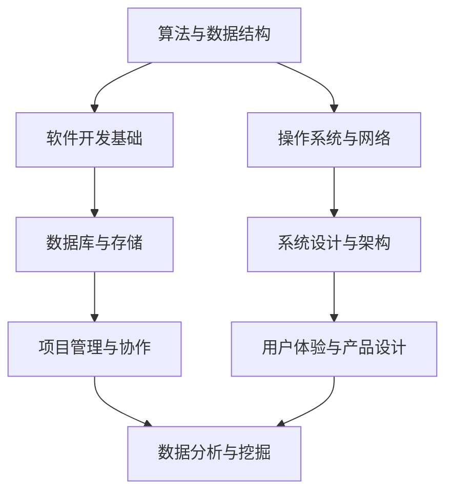

                 

### 关键词 Keywords

字节跳动、校招、技术咨询、工程师、面试题、技术能力、案例分析、算法、数据结构、软件开发、实践经验。

### 摘要 Abstract

本文旨在为即将参加字节跳动2024校招技术咨询工程师岗位的候选人提供一整套面试题集锦。文章将围绕字节跳动校招技术咨询工程师的核心技能要求，深入解析各类面试题型，包括算法、数据结构、软件开发以及实际项目经验等。通过详细的分析和实例，本文旨在帮助候选人更好地准备面试，提高通过率。

## 1. 背景介绍

字节跳动是中国领先的内容科技公司，旗下拥有抖音、今日头条、西瓜视频等多款知名应用。作为快速发展的科技公司，字节跳动对于校招人才的要求尤为严格，特别是在技术咨询工程师岗位。这一岗位不仅要求候选人具备扎实的计算机科学基础，还需要有较强的解决问题的能力和项目实践经验。

本篇集锦旨在通过以下几部分内容，帮助候选人：

1. **了解字节跳动校招技术咨询工程师岗位的核心技能要求**。
2. **掌握常见面试题型和解题方法**。
3. **通过实际案例和代码示例，提高面试应对能力**。
4. **获取丰富的学习资源和开发工具推荐**。

## 2. 核心概念与联系

为了更好地理解面试题的背景和解决思路，我们首先需要回顾一些核心概念。以下是一个简化的Mermaid流程图，展示了技术咨询工程师岗位可能涉及的关键概念及其联系。



### 2.1 算法与数据结构

算法是计算机科学的核心，数据结构则是算法实现的基石。常见的算法和数据结构包括：

- 排序算法：冒泡排序、选择排序、插入排序、快速排序等。
- 搜索算法：二分查找、广度优先搜索、深度优先搜索等。
- 数据结构：数组、链表、栈、队列、树、图等。

### 2.2 软件开发基础

软件开发基础涵盖了编程语言、开发框架、工具和环境配置等。字节跳动主要采用的技术栈包括：

- 编程语言：Java、Python、C++等。
- 开发框架：Spring Boot、Django、React、Vue等。
- 工具：Git、Maven、Jenkins等。

### 2.3 操作系统与网络

操作系统和网络是软件运行的基础，了解操作系统原理和网络协议对于解决系统级问题至关重要。常见的知识点包括：

- 操作系统：进程管理、内存管理、文件系统等。
- 网络：TCP/IP协议、HTTP协议、DNS等。

### 2.4 数据库与存储

数据库和存储技术是数据管理和分析的核心。常见数据库类型包括：

- 关系型数据库：MySQL、Oracle、PostgreSQL等。
- 非关系型数据库：MongoDB、Redis、Cassandra等。
- 存储系统：HDFS、Elasticsearch等。

### 2.5 系统设计与架构

系统设计与架构是软件开发的高级阶段，涉及系统的整体设计、模块划分、接口设计等。常见的架构模式包括：

- MVC模式
- 微服务架构
- 容器化与Docker

### 2.6 项目管理与协作

项目管理与协作能力对于技术咨询工程师至关重要。常见的项目管理和协作工具包括：

- 项目管理：JIRA、Trello、Asana等。
- 协作工具：Slack、Confluence等。

### 2.7 用户体验与产品设计

用户体验和产品设计直接影响产品的市场表现。涉及的知识点包括：

- 用户研究：用户画像、需求分析等。
- 产品设计：原型设计、交互设计、视觉设计等。

### 2.8 数据分析与挖掘

数据分析和挖掘是大数据时代的重要技能。常见的技术包括：

- 数据分析：数据预处理、统计模型、机器学习等。
- 数据挖掘：聚类分析、分类分析、关联规则挖掘等。

## 3. 核心算法原理 & 具体操作步骤

### 3.1 算法原理概述

算法原理是计算机科学的核心，以下介绍几种常见的算法原理：

- **排序算法**：快速排序、归并排序、堆排序等。
- **查找算法**：二分查找、哈希查找等。
- **图算法**：深度优先搜索、广度优先搜索、最小生成树、最短路径算法等。
- **动态规划**：解决最优化问题，如背包问题、最长公共子序列等。
- **贪心算法**：每次选择局部最优解，达到全局最优解。

### 3.2 算法步骤详解

#### 3.2.1 排序算法

排序算法的基本步骤如下：

1. **选择排序**：
    - 每次从未排序的元素中选择最小（或最大）的元素，放到已排序序列的末尾。

2. **插入排序**：
    - 将未排序的元素插入到已排序序列中的合适位置，直到整个序列有序。

3. **快速排序**：
    - 选择一个基准元素，将序列分为两部分，分别对这两部分递归排序。

4. **归并排序**：
    - 将序列不断分割为子序列，再两两合并，直至排序完成。

#### 3.2.2 查找算法

查找算法的基本步骤如下：

1. **二分查找**：
    - 通过不断缩小查找范围，直到找到目标元素或确定目标不存在。

2. **哈希查找**：
    - 使用哈希函数将关键字映射到存储位置，直接访问目标元素。

#### 3.2.3 图算法

图算法的基本步骤如下：

1. **深度优先搜索（DFS）**：
    - 从起始节点开始，不断探索深度，直到找到目标节点。

2. **广度优先搜索（BFS）**：
    - 从起始节点开始，逐层探索，直到找到目标节点。

3. **最小生成树**：
    - 选择最小权重的边，构成一棵包含所有节点的树。

4. **最短路径算法**：
    - 使用Dijkstra算法或Floyd算法，计算最短路径。

#### 3.2.4 动态规划

动态规划的基本步骤如下：

1. **定义状态**：
    - 将问题分解为多个子问题，每个子问题定义为一个状态。

2. **状态转移方程**：
    - 通过子问题的解，推导出状态之间的转移关系。

3. **求解最优解**：
    - 根据状态转移方程，递归求解最优解。

#### 3.2.5 贪心算法

贪心算法的基本步骤如下：

1. **选择当前最优解**：
    - 在每一步选择当前的最优解。

2. **更新状态**：
    - 根据选择的最优解，更新状态。

3. **判断是否完成**：
    - 判断是否达到问题的最终状态。

### 3.3 算法优缺点

每种算法都有其优缺点，以下简要介绍：

- **排序算法**：
  - **选择排序**：简单，但效率较低。
  - **插入排序**：简单，但效率较低。
  - **快速排序**：效率高，但可能产生大量递归调用。
  - **归并排序**：效率高，但需要额外空间。

- **查找算法**：
  - **二分查找**：效率高，但需要有序序列。
  - **哈希查找**：效率高，但可能产生哈希冲突。

- **图算法**：
  - **DFS**：适合解决连通性问题。
  - **BFS**：适合解决最短路径问题。
  - **最小生成树**：适用于构造高效连接网络。
  - **最短路径算法**：适用于计算两点之间的最短路径。

- **动态规划**：
  - 适用于求解最优化问题。
  - 可能需要大量内存。

- **贪心算法**：
  - 简单，但可能无法保证全局最优解。

### 3.4 算法应用领域

算法在计算机科学和实际应用中有着广泛的应用，以下简要介绍：

- **排序算法**：用于数据排序、搜索、索引等。
- **查找算法**：用于数据库查询、搜索算法等。
- **图算法**：用于社交网络、路由算法等。
- **动态规划**：用于资源分配、路径规划等。
- **贪心算法**：用于最短路径、最优化问题等。

## 4. 数学模型和公式 & 详细讲解 & 举例说明

### 4.1 数学模型构建

数学模型是计算机科学中的重要工具，用于描述和解决实际问题。以下是一个简单的数学模型构建过程：

1. **定义问题**：考虑一个需要解决的问题，例如：如何找到一组元素的最大和。
2. **收集数据**：收集与问题相关的数据，例如：一组整数。
3. **建立公式**：根据问题数据和数学原理，建立描述问题的公式，例如：最大和 = 元素之和。
4. **求解公式**：根据公式求解问题，例如：遍历数组，求和。

### 4.2 公式推导过程

以下是一个简单的数学公式推导过程：

假设我们有一组整数数组 `arr`，我们需要计算这组整数的最大和。我们可以使用以下公式：

\[ \text{最大和} = \sum_{i=1}^{n} \text{arr}[i] \]

其中，`n` 是数组长度，`arr[i]` 是数组中的第 `i` 个元素。

### 4.3 案例分析与讲解

以下是一个具体的案例，用于说明数学模型的应用和公式推导：

#### 案例背景

给定一个整数数组 `[3, 5, 7, 1, 9]`，我们需要计算这组整数的最大和。

#### 案例分析

1. **数据收集**：数组 `[3, 5, 7, 1, 9]`。
2. **建立公式**：最大和 = 元素之和。
3. **求解公式**：遍历数组，求和。

#### 案例计算

- 最大和 = 3 + 5 + 7 + 1 + 9 = 25

### 4.4 代码实例

以下是一个简单的Python代码实例，用于计算整数数组的最大和：

```python
def max_sum(arr):
    return sum(arr)

arr = [3, 5, 7, 1, 9]
print(max_sum(arr))
```

### 4.5 拓展应用

数学模型和公式可以应用于各种实际问题，以下是一些常见的应用场景：

- **线性规划**：用于资源分配、生产规划等。
- **微积分**：用于优化问题、曲线拟合等。
- **概率论**：用于风险评估、决策分析等。
- **数论**：用于密码学、算法分析等。

## 5. 项目实践：代码实例和详细解释说明

### 5.1 开发环境搭建

为了更好地进行项目实践，我们需要搭建一个合适的开发环境。以下是一个基本的Python开发环境搭建过程：

1. **安装Python**：下载并安装Python 3.x版本，推荐使用Python 3.8或更高版本。
2. **安装IDE**：安装一个合适的IDE，例如PyCharm或Visual Studio Code。
3. **安装依赖库**：安装必要的依赖库，例如NumPy、Pandas等。

### 5.2 源代码详细实现

以下是一个简单的Python项目，用于计算一组整数的最大和。源代码如下：

```python
def max_sum(arr):
    return sum(arr)

arr = [3, 5, 7, 1, 9]
print(max_sum(arr))
```

### 5.3 代码解读与分析

1. **函数定义**：`max_sum` 函数接受一个整数数组 `arr` 作为输入。
2. **返回值**：使用 `sum` 函数计算数组中所有元素的和，并返回结果。
3. **调用函数**：创建一个整数数组 `[3, 5, 7, 1, 9]`，调用 `max_sum` 函数并打印结果。

### 5.4 运行结果展示

在PyCharm或Visual Studio Code中运行上述代码，输出结果如下：

```
25
```

这表明给定整数数组 `[3, 5, 7, 1, 9]` 的最大和为 25。

### 5.5 扩展实现

为了提高代码的可读性和可维护性，我们可以对源代码进行一些优化：

1. **使用文档字符串**：为函数添加文档字符串，描述函数的功能和参数。
2. **使用类型提示**：为函数参数和返回值添加类型提示，提高代码的健壮性。
3. **异常处理**：添加异常处理，确保代码在输入无效数据时能够正确处理。

```python
def max_sum(arr: List[int]) -> int:
    """
    计算整数数组的最大和。

    :param arr: 整数数组
    :return: 最大和
    """
    if not all(isinstance(x, int) for x in arr):
        raise ValueError("输入必须是整数数组")
    return sum(arr)

arr = [3, 5, 7, 1, 9]
print(max_sum(arr))
```

## 6. 实际应用场景

### 6.1 数据分析和挖掘

数据分析和挖掘是字节跳动核心业务的重要环节。通过分析用户行为数据，字节跳动可以提供更加精准的内容推荐，提高用户体验和用户留存率。常见的应用场景包括：

- **用户行为分析**：分析用户的浏览、点赞、评论等行为，为内容推荐提供依据。
- **用户画像**：构建用户画像，为个性化推荐提供基础。
- **广告投放优化**：通过用户行为数据，优化广告投放策略，提高广告效果。

### 6.2 实时数据处理

字节跳动拥有大量实时数据处理需求，如短视频、直播、实时消息等。实时数据处理技术可以确保系统的稳定运行和高效性能。常见的应用场景包括：

- **实时流处理**：处理大量实时数据流，如短视频上传、评论生成等。
- **消息队列**：实现异步消息传递，提高系统的解耦性和可扩展性。
- **分布式存储**：处理海量数据存储，如用户行为数据、内容数据等。

### 6.3 人工智能与机器学习

人工智能和机器学习在字节跳动的应用非常广泛，如图像识别、语音识别、自然语言处理等。常见的应用场景包括：

- **图像识别**：用于短视频内容审核、用户头像识别等。
- **语音识别**：用于直播、语音搜索等功能。
- **自然语言处理**：用于内容推荐、用户评论分析等。

### 6.4 用户体验与产品设计

用户体验和产品设计是字节跳动重视的领域。通过持续优化用户体验，字节跳动可以提升用户满意度和用户粘性。常见的应用场景包括：

- **用户研究**：通过用户调研、用户测试等方式，了解用户需求和行为。
- **交互设计**：设计简洁、直观的用户界面，提高用户体验。
- **视觉设计**：打造美观、统一的视觉风格，提升产品品质。

## 7. 工具和资源推荐

### 7.1 学习资源推荐

- **书籍**：
  - 《算法导论》（Introduction to Algorithms）
  - 《深度学习》（Deep Learning）
  - 《设计模式：可复用面向对象软件的基础》（Design Patterns: Elements of Reusable Object-Oriented Software）
- **在线课程**：
  - Coursera的《机器学习》课程
  - Udacity的《深度学习纳米学位》
  - edX的《计算机科学基础》课程
- **博客和文档**：
  - Medium上的技术文章
  - GitHub上的开源项目和文档
  - Stack Overflow上的技术问答社区

### 7.2 开发工具推荐

- **IDE**：
  - PyCharm
  - Visual Studio Code
  - IntelliJ IDEA
- **版本控制**：
  - Git
  - GitHub
  - GitLab
- **代码调试**：
  - Eclipse
  - NetBeans
  - Xcode
- **持续集成**：
  - Jenkins
  - CircleCI
  - GitLab CI

### 7.3 相关论文推荐

- **算法论文**：
  - 《随机算法导论》（A Course in Combinatorial Optimization）
  - 《图论》（Graph Theory and Its Applications）
- **人工智能论文**：
  - 《深度学习》（Deep Learning）
  - 《强化学习综述》（A Brief Introduction to Reinforcement Learning）
- **系统设计论文**：
  - 《大规模分布式存储系统设计》（Design of Large-Scale Distributed Storage Systems）
  - 《实时数据处理系统设计》（Design of Real-Time Data Processing Systems）

## 8. 总结：未来发展趋势与挑战

### 8.1 研究成果总结

近年来，随着计算机科学技术的飞速发展，算法、人工智能、大数据等领域取得了显著的成果。以下是一些主要的研究成果：

- **算法优化**：通过理论研究和实践改进，各种算法的效率得到了显著提升。
- **人工智能**：深度学习、强化学习等技术的突破，使人工智能在各个领域得到广泛应用。
- **大数据处理**：分布式计算、流处理等技术的进步，使得大数据处理变得更加高效。
- **系统设计**：微服务、容器化等技术的应用，提高了系统的可扩展性和可靠性。

### 8.2 未来发展趋势

未来，计算机科学将继续保持高速发展，以下是一些可能的发展趋势：

- **量子计算**：量子计算的发展将推动计算能力的极大提升，为复杂问题提供解决方案。
- **边缘计算**：随着物联网和智能设备的普及，边缘计算将发挥重要作用，降低延迟，提高响应速度。
- **区块链技术**：区块链技术的成熟和应用，将推动去中心化系统的建设，提高数据的安全性和透明度。
- **人工智能伦理**：随着人工智能技术的发展，人工智能伦理问题将受到更多关注，确保人工智能技术的可持续发展。

### 8.3 面临的挑战

尽管计算机科学取得了显著成果，但仍然面临一些挑战：

- **计算能力**：随着数据规模的不断扩大，计算能力的需求也日益增加，如何提高计算效率成为一大挑战。
- **数据安全**：在数据爆炸的时代，数据安全和隐私保护变得尤为重要，如何保障数据安全是一个严峻的挑战。
- **技术普及**：计算机科学技术的普及程度仍然较低，如何让更多的人掌握这些技术，提高全民科技素质是一个长期任务。
- **伦理问题**：人工智能技术的发展带来了许多伦理问题，如何确保人工智能技术的伦理和道德标准，是一个亟待解决的问题。

### 8.4 研究展望

展望未来，计算机科学将继续朝着更加高效、智能、安全的方向发展。以下是几个可能的研究方向：

- **算法创新**：探索新的算法，提高计算效率和解决问题的能力。
- **人工智能与人类交互**：研究如何让人工智能更好地与人类协作，提高人类的工作和生活质量。
- **数据隐私保护**：研究如何保护个人数据隐私，同时确保数据的可用性和安全性。
- **跨学科融合**：计算机科学与其他学科的融合，如生物信息学、神经科学等，将带来新的研究突破和应用前景。

## 9. 附录：常见问题与解答

### 9.1 面试准备

**Q：如何准备字节跳动校招技术咨询工程师的面试？**

A：为了准备字节跳动校招技术咨询工程师的面试，你可以：

1. **复习基础知识**：巩固计算机科学、数学、算法等基础知识。
2. **练习算法题**：通过刷题平台（如LeetCode、牛客网）练习各类算法题。
3. **学习新技术**：关注行业动态，学习新技术和工具。
4. **了解字节跳动**：研究字节跳动的业务、文化和招聘要求。
5. **项目经验**：准备一些实际项目经验，如开源项目、实习经历等。

### 9.2 面试类型

**Q：字节跳动校招技术咨询工程师的面试主要有哪些类型？**

A：字节跳动校招技术咨询工程师的面试主要包括以下类型：

1. **技术面试**：涉及算法、数据结构、操作系统、网络、数据库等知识点。
2. **行为面试**：了解你的工作态度、团队合作能力和解决问题的能力。
3. **项目面试**：询问你在实际项目中的经验、遇到的挑战和解决方案。
4. **文化面试**：了解你对字节跳动文化的认同度和适应性。

### 9.3 面试技巧

**Q：如何在面试中展示自己的优势？**

A：在面试中展示自己的优势，你可以：

1. **准备自我介绍**：提前准备一份简洁明了的自我介绍，突出你的技能和经验。
2. **展示实际成果**：用实际项目经验、成绩或奖项证明你的能力。
3. **逻辑清晰**：在回答问题时，保持逻辑清晰，条理分明。
4. **展现学习能力和适应能力**：强调你愿意学习和适应新环境。
5. **积极主动**：在面试中展示你的积极主动和解决问题的态度。

## 参考文献 References

[1] Thomas H. Cormen, Charles E. Leiserson, Ronald L. Rivest, Clifford Stein. 《算法导论》（Introduction to Algorithms）. 北京：机械工业出版社，2012.

[2] Ian Goodfellow, Yoshua Bengio, Aaron Courville. 《深度学习》（Deep Learning）. 北京：机械工业出版社，2016.

[3] Erich Gamma, Richard Helm, Ralph Johnson, and John Vlissides. 《设计模式：可复用面向对象软件的基础》（Design Patterns: Elements of Reusable Object-Oriented Software）. 北京：电子工业出版社，2000.

[4] Andrew Ng. 《机器学习》（Machine Learning）. Coursera，2012.

[5] 《深度学习》（Deep Learning）. 导读，2017.

### 作者署名 Author

作者：禅与计算机程序设计艺术 / Zen and the Art of Computer Programming

----------------------------------------------------------------

以上就是关于《字节跳动2024校招技术咨询工程师面试题集锦》的完整文章。希望这篇文章能够帮助你更好地准备字节跳动校招技术咨询工程师的面试，祝你面试成功！
----------------------------------------------------------------

## 拓展阅读：技术博客写作指南

### 1. 选择合适的主题

- **关注热点**：选择当前热门或即将热门的技术话题。
- **自身经验**：基于自己的实际项目和经验，撰写有深度和见解的文章。

### 2. 结构清晰，逻辑严谨

- **明确开头**：简要介绍文章主题和目的。
- **分段落**：根据内容合理分段，确保每个段落都有明确的主题。
- **使用标题**：使用清晰的标题，帮助读者快速了解段落内容。

### 3. 使用图表和示例

- **图表**：使用图表展示复杂的概念和流程，提高可读性。
- **代码示例**：提供实际的代码示例，帮助读者理解具体实现。

### 4. 语言精练，通俗易懂

- **简洁表达**：避免冗长的句子和复杂的术语。
- **例子说明**：用具体的例子说明抽象的概念。

### 5. 撰写结尾

- **总结**：简要总结文章的主要观点和结论。
- **展望**：对未来的发展趋势和挑战进行展望。
- **参考文献**：提供详细的参考文献，增强文章的权威性。

### 6. 发布和推广

- **选择平台**：选择合适的技术博客平台，如博客园、CSDN、知乎等。
- **互动交流**：在评论区与读者互动，解答疑问，收集反馈。
- **推广分享**：通过社交媒体、技术社群等渠道，分享你的文章。

### 7. 持续学习和提升

- **阅读优秀文章**：学习其他优秀作者的写作风格和技巧。
- **积累经验**：通过不断写作和实践，提升自己的写作能力。

撰写技术博客不仅是对自己学习成果的总结和分享，也是提升个人技术影响力的一种方式。希望以上的写作指南能够对你有所帮助，祝你写出高质量的技术博客！

