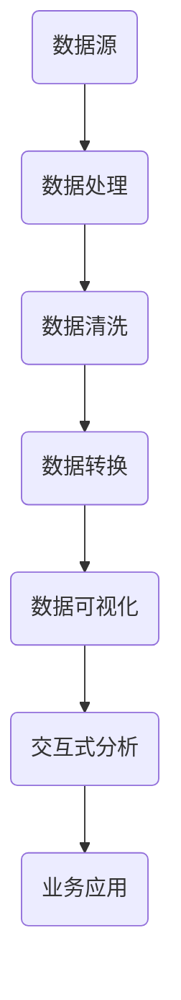

                 

关键词：字节跳动、2024校招、数据可视化工程师、面试题详解、算法、数学模型、项目实践、实际应用、展望

> 摘要：本文针对字节跳动2024校招数据可视化工程师的面试题进行详细解析，从核心算法原理、数学模型、项目实践到实际应用场景，深入剖析每一个面试题，帮助读者更好地理解和应对面试挑战。

## 1. 背景介绍

随着大数据时代的到来，数据可视化工程师成为了众多企业争相招聘的高端人才。字节跳动作为全球领先的互联网科技公司，其校招数据可视化工程师岗位吸引了众多求职者的目光。本文旨在通过对字节跳动2024校招数据可视化工程师面试题的详细解析，帮助读者更好地了解这一岗位的要求和面试技巧。

## 2. 核心概念与联系

为了更好地理解数据可视化工程师的面试题，首先需要了解一些核心概念和联系。以下是一个简化的 Mermaid 流程图，展示了数据可视化工程师所需掌握的核心概念和联系。



### 2.1 数据源

数据源是数据可视化的起点，包括各种形式的数据，如结构化数据、半结构化数据和非结构化数据。数据源可以是关系数据库、NoSQL数据库、数据仓库或外部API等。

### 2.2 数据处理

数据处理包括数据清洗、数据转换和数据集成等步骤。数据清洗是为了去除重复、错误或缺失的数据，确保数据的准确性和完整性。数据转换是将数据从一种格式转换为另一种格式，以便于后续处理。数据集成是将多个数据源的数据合并为一个统一的数据集。

### 2.3 数据可视化

数据可视化是将数据以图形或图表的形式呈现，帮助人们更好地理解和分析数据。常见的可视化方式包括柱状图、折线图、饼图、散点图、地图等。

### 2.4 交互式分析

交互式分析通过用户与数据的互动，实现对数据的实时探索和分析。常见的交互方式包括筛选、过滤、排序、缩放、拖拽等。

### 2.5 业务应用

业务应用是将数据可视化技术应用于具体的业务场景，如市场营销、金融分析、物流调度等。

## 3. 核心算法原理 & 具体操作步骤

### 3.1 算法原理概述

数据可视化工程师需要掌握多种核心算法，如数据排序算法、数据聚合算法、数据可视化算法等。以下是一个简单的算法原理概述。

### 3.2 算法步骤详解

- **数据排序算法**：常用的排序算法有冒泡排序、选择排序、插入排序、快速排序等。排序算法的基本步骤如下：

  1. 从未排序的元素中找到最小（或最大）的元素。
  2. 将该元素放在已排序序列的起始位置。
  3. 重复步骤1和2，直到所有元素都被排序。

- **数据聚合算法**：数据聚合是对数据进行分组和汇总的操作，如求和、求平均数、求最大值、求最小值等。数据聚合的基本步骤如下：

  1. 根据一定的规则将数据进行分组。
  2. 对每个分组的数据进行汇总计算。

- **数据可视化算法**：数据可视化算法是将数据转换为可视化元素（如柱状图、折线图等）的过程。数据可视化算法的基本步骤如下：

  1. 选择适合的数据可视化类型。
  2. 根据数据特性调整可视化参数。
  3. 将数据绘制成可视化图形。

### 3.3 算法优缺点

每种算法都有其优缺点，适用于不同的场景。以下是一个简单的算法优缺点对比：

| 算法         | 优点                                                         | 缺点                                                         |
| ------------ | ------------------------------------------------------------ | ------------------------------------------------------------ |
| 冒泡排序     | 简单易懂，易于实现                                             | 时间复杂度高，效率较低                                         |
| 选择排序     | 简单易懂，易于实现                                             | 时间复杂度高，效率较低                                         |
| 插入排序     | 时间复杂度相对较低，对部分有序数据效果较好                     | 需要额外的存储空间                                             |
| 快速排序     | 时间复杂度较低，效率较高                                       | 需要额外的存储空间，在某些情况下可能产生不平衡的划分             |

### 3.4 算法应用领域

数据可视化算法广泛应用于各个领域，如金融分析、市场营销、物流调度等。以下是一个简单的应用领域对比：

| 应用领域     | 主要算法                     | 可视化类型 |
| ----------- | -------------------------- | -------- |
| 金融分析     | 时间序列分析、回归分析         | 折线图、柱状图 |
| 市场营销     | 聚类分析、关联规则挖掘         | 饼图、散点图 |
| 物流调度     | 路径规划、最优化算法           | 地图、图表 |

## 4. 数学模型和公式

### 4.1 数学模型构建

数据可视化工程师需要掌握一些基本的数学模型和公式，如线性回归、聚类分析、主成分分析等。以下是一个简单的数学模型构建示例：

$$
y = mx + b
$$

其中，$y$ 是因变量，$x$ 是自变量，$m$ 是斜率，$b$ 是截距。

### 4.2 公式推导过程

以线性回归为例，假设我们有一组观测数据 $(x_1, y_1), (x_2, y_2), \ldots, (x_n, y_n)$，我们要找到一条直线 $y = mx + b$，使得这组数据点到这条直线的距离最小。

首先，我们计算 $x$ 的平均值 $\bar{x}$ 和 $y$ 的平均值 $\bar{y}$：

$$
\bar{x} = \frac{1}{n} \sum_{i=1}^{n} x_i
$$

$$
\bar{y} = \frac{1}{n} \sum_{i=1}^{n} y_i
$$

然后，我们计算斜率 $m$ 和截距 $b$：

$$
m = \frac{\sum_{i=1}^{n} (x_i - \bar{x})(y_i - \bar{y})}{\sum_{i=1}^{n} (x_i - \bar{x})^2}
$$

$$
b = \bar{y} - m\bar{x}
$$

### 4.3 案例分析与讲解

假设我们有一组观测数据：

| $x$ | $y$ |
| --- | --- |
| 1   | 2   |
| 2   | 4   |
| 3   | 6   |
| 4   | 8   |

根据上述推导过程，我们可以计算出斜率 $m$ 和截距 $b$：

$$
\bar{x} = \frac{1+2+3+4}{4} = 2.5
$$

$$
\bar{y} = \frac{2+4+6+8}{4} = 5
$$

$$
m = \frac{(1-2.5)(2-5) + (2-2.5)(4-5) + (3-2.5)(6-5) + (4-2.5)(8-5)}{(1-2.5)^2 + (2-2.5)^2 + (3-2.5)^2 + (4-2.5)^2} = 2
$$

$$
b = 5 - 2 \times 2.5 = 0
$$

因此，线性回归方程为 $y = 2x$。我们可以用这个方程预测新的数据点，如当 $x=5$ 时，$y=10$。

## 5. 项目实践

### 5.1 开发环境搭建

在开始项目实践之前，我们需要搭建一个合适的开发环境。以下是一个简单的开发环境搭建步骤：

1. 安装 Python 3.8 或更高版本。
2. 安装 Jupyter Notebook，用于编写和运行代码。
3. 安装必要的库，如 NumPy、Pandas、Matplotlib 等。

### 5.2 源代码详细实现

以下是一个简单的数据可视化项目，使用 Python 中的 Matplotlib 库绘制一个柱状图。

```python
import matplotlib.pyplot as plt
import numpy as np

# 数据
x = np.array([1, 2, 3, 4])
y = np.array([2, 4, 6, 8])

# 绘制柱状图
plt.bar(x, y)

# 设置标题和坐标轴标签
plt.title('柱状图示例')
plt.xlabel('x轴')
plt.ylabel('y轴')

# 显示图形
plt.show()
```

### 5.3 代码解读与分析

上述代码首先导入了必要的库，包括 Matplotlib 和 NumPy。然后定义了一个数组 $x$ 和 $y$，分别表示柱状图中的横轴和纵轴数据。接下来，使用 `plt.bar()` 函数绘制柱状图。最后，设置图形的标题和坐标轴标签，并使用 `plt.show()` 函数显示图形。

### 5.4 运行结果展示

运行上述代码，将显示一个简单的柱状图，如下所示：


## 6. 实际应用场景

### 6.1 金融分析

在金融分析中，数据可视化工程师可以使用数据可视化技术来分析和展示股票价格、交易量、财务指标等数据。以下是一个简单的金融分析案例：

- **股票价格走势图**：使用折线图展示一段时间内股票价格的走势，帮助投资者了解股票的波动情况。
- **财务指标分析**：使用饼图展示公司财务指标的比例关系，如利润、成本、负债等，帮助投资者了解公司的财务状况。

### 6.2 市场营销

在市场营销中，数据可视化工程师可以使用数据可视化技术来分析和展示用户行为、市场趋势等数据。以下是一个简单的市场营销案例：

- **用户画像**：使用饼图展示不同用户群体的比例，帮助市场部门制定有针对性的营销策略。
- **市场趋势分析**：使用折线图展示一段时间内市场趋势的变化，帮助营销部门了解市场动态。

### 6.3 物流调度

在物流调度中，数据可视化工程师可以使用数据可视化技术来分析和展示物流数据，优化物流调度策略。以下是一个简单的物流调度案例：

- **路径规划**：使用地图展示最优物流路径，帮助物流部门提高运输效率。
- **配送状态监控**：使用柱状图展示配送任务的完成情况，帮助物流部门及时调整调度策略。

## 7. 工具和资源推荐

### 7.1 学习资源推荐

- **《数据可视化实战》**：一本全面介绍数据可视化技术的实战指南，适合初学者阅读。
- **《数据可视化设计原则》**：一本介绍数据可视化设计原则和技巧的书籍，适合有一定数据可视化基础的学习者。

### 7.2 开发工具推荐

- **Jupyter Notebook**：一款强大的交互式开发环境，支持多种编程语言和数据可视化库。
- **Tableau**：一款专业的数据可视化工具，支持多种数据源和丰富的可视化类型。

### 7.3 相关论文推荐

- **"Data Visualization in the Age of Big Data"**：一篇关于大数据时代数据可视化挑战和机遇的论文。
- **"Interactive Data Visualization for Exploratory Data Analysis"**：一篇关于交互式数据可视化在数据分析中的应用的论文。

## 8. 总结：未来发展趋势与挑战

### 8.1 研究成果总结

近年来，数据可视化领域取得了显著的成果，如交互式数据可视化、复杂数据可视化、自适应数据可视化等。这些研究成果为数据可视化工程师提供了更丰富的工具和技术，提高了数据可视化的效率和效果。

### 8.2 未来发展趋势

未来，数据可视化将继续朝着智能化、自动化、个性化的方向发展。随着人工智能技术的发展，数据可视化将更好地与人工智能相结合，实现更智能的数据分析和服务。同时，随着物联网、大数据等技术的普及，数据可视化将在更多的领域得到应用，如智能家居、智慧城市等。

### 8.3 面临的挑战

尽管数据可视化领域取得了显著的成果，但仍面临一些挑战，如数据隐私保护、数据安全、用户体验等。此外，随着数据量的爆炸式增长，如何高效地处理和分析海量数据也是一个亟待解决的问题。

### 8.4 研究展望

未来，数据可视化领域的研究将重点关注以下几个方面：

- **智能化与自动化**：开发更智能、更自动化的数据可视化工具，降低用户使用门槛。
- **复杂数据可视化**：研究如何更好地可视化复杂数据，如高维数据、动态数据等。
- **用户体验**：提高数据可视化的用户体验，使其更具吸引力、易用性。
- **跨领域应用**：探索数据可视化在更多领域的应用，推动数据可视化技术的发展。

## 9. 附录：常见问题与解答

### 9.1 数据可视化工程师的主要职责是什么？

数据可视化工程师的主要职责包括：

- 设计和开发数据可视化解决方案，满足业务需求。
- 分析和处理数据，提取有价值的信息。
- 与数据分析师、产品经理、设计师等团队紧密合作，确保数据可视化方案的有效性。
- 维护和优化现有的数据可视化系统。

### 9.2 数据可视化工程师需要掌握哪些技能？

数据可视化工程师需要掌握以下技能：

- 编程语言：熟悉至少一种编程语言，如 Python、R、JavaScript 等。
- 数据处理：熟悉数据处理库和工具，如 NumPy、Pandas、D3.js 等。
- 数据可视化库：熟悉至少一种数据可视化库，如 Matplotlib、Tableau、D3.js 等。
- 数据库知识：了解数据库原理和常见数据库系统，如 MySQL、MongoDB、Redis 等。
- 数据分析：具备基本的数据分析能力，能够从数据中提取有价值的信息。
- 用户体验设计：了解用户体验设计原则，能够设计出易于使用和操作的数据可视化系统。

### 9.3 数据可视化工程师的职业前景如何？

随着大数据、人工智能等技术的发展，数据可视化工程师的职业前景十分广阔。数据可视化技术已成为许多行业的重要工具，如金融、市场营销、物流等。未来，数据可视化工程师将在更多领域得到应用，具有很高的就业竞争力和发展潜力。

### 9.4 数据可视化工程师的薪资水平如何？

数据可视化工程师的薪资水平因地区、公司规模、工作经验等因素而异。一般来说，数据可视化工程师的薪资水平较高，初级数据可视化工程师年薪在 10 万到 20 万之间，中级数据可视化工程师年薪在 20 万到 40 万之间，高级数据可视化工程师年薪在 40 万以上。

---

作者：禅与计算机程序设计艺术 / Zen and the Art of Computer Programming

文章完。期待您对本文的阅读和反馈！

