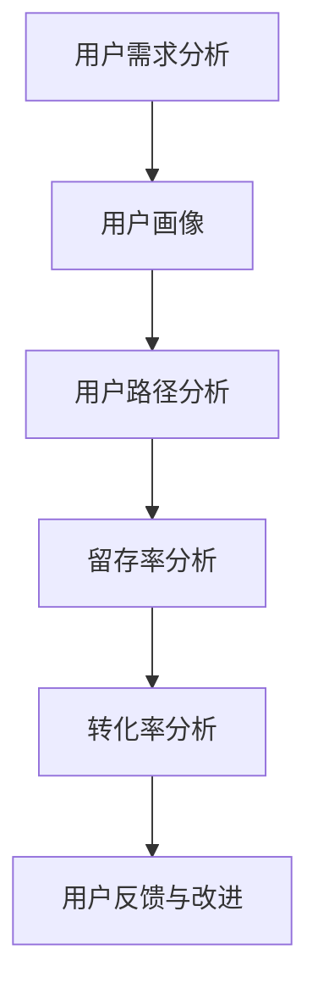

                 

关键词：字节跳动、校招、面试真题、技术用户运营、面试技巧、案例解析

> 摘要：本文针对字节跳动2024校招技术用户运营专家岗位的面试真题，深入分析题目背后的核心考点和解题思路。通过详细解析典型真题，为应聘者提供实用的面试策略和实战经验，助力成功备战校招面试。

## 1. 背景介绍

字节跳动是中国领先的互联网科技公司，旗下拥有抖音、今日头条、微博等知名产品。作为一家以技术创新为核心驱动的企业，字节跳动对技术人才的需求一直非常高。因此，其校招面试题目常常涵盖了广泛的技术领域，包括算法、数据结构、数据库、前端技术、后端技术等。

技术用户运营专家岗位在字节跳动中扮演着至关重要的角色，负责将技术和用户需求相结合，通过数据分析和运营策略提升用户活跃度和产品口碑。这个岗位不仅需要深厚的专业技能，还要求具备出色的沟通能力和用户洞察力。

本文将针对字节跳动2024校招技术用户运营专家岗位的面试真题，提供详细解析和策略指导，帮助应聘者更好地应对面试挑战。

## 2. 核心概念与联系

在解答面试题之前，我们首先需要理解一些核心概念和联系，包括技术用户运营的定义、相关技术框架和工具、用户行为分析等。

### 2.1 技术用户运营

技术用户运营是指利用技术手段和数据分析方法，提升用户满意度和产品价值的过程。它涉及以下几个方面：

- **用户需求分析**：通过数据分析了解用户需求，优化产品功能和用户体验。
- **用户留存策略**：制定用户留存策略，提高用户粘性和活跃度。
- **用户增长策略**：利用技术手段和运营手段实现用户增长。
- **用户反馈与改进**：收集用户反馈，持续优化产品。

### 2.2 技术框架和工具

技术用户运营依赖于一系列技术框架和工具，包括：

- **数据分析平台**：如Google Analytics、Mixpanel、GrowingIO等。
- **前端技术**：如HTML、CSS、JavaScript等。
- **后端技术**：如Java、Python、Node.js等。
- **数据库**：如MySQL、MongoDB、Redis等。

### 2.3 用户行为分析

用户行为分析是技术用户运营的核心之一，它涉及以下几个方面：

- **用户画像**：通过数据分析构建用户画像，了解用户特征和需求。
- **用户路径分析**：分析用户在使用产品时的行为路径，找出优化点。
- **留存率分析**：分析用户的留存情况，找出留存率低的原因。
- **转化率分析**：分析用户的转化路径和转化率，优化转化策略。

为了更好地理解这些概念和联系，我们可以使用Mermaid流程图来展示技术用户运营的核心环节：



## 3. 核心算法原理 & 具体操作步骤

### 3.1 算法原理概述

在技术用户运营中，常用的算法包括推荐算法、聚类算法、时间序列分析等。下面简要介绍这些算法的原理：

- **推荐算法**：基于用户的历史行为和兴趣，为用户推荐感兴趣的内容或商品。
- **聚类算法**：将用户或数据分为若干组，以便更好地理解用户特征和需求。
- **时间序列分析**：分析用户行为随时间的变化规律，预测未来趋势。

### 3.2 算法步骤详解

以推荐算法为例，其具体操作步骤如下：

1. **数据预处理**：收集用户行为数据，进行数据清洗和预处理，如去重、补全缺失值等。
2. **特征工程**：提取用户行为特征，如点击率、浏览时间、购买记录等。
3. **模型训练**：使用机器学习算法，如协同过滤、基于内容的推荐等，训练推荐模型。
4. **模型评估**：评估推荐模型的效果，如准确率、召回率等。
5. **模型部署**：将训练好的模型部署到线上环境，为用户生成个性化推荐。

### 3.3 算法优缺点

- **推荐算法**：优点是能够为用户提供个性化的推荐，提高用户体验和满意度；缺点是计算复杂度较高，对数据质量和特征工程要求较高。
- **聚类算法**：优点是能够自动发现用户群体，便于进行市场细分；缺点是聚类结果可能存在噪声和误分类。
- **时间序列分析**：优点是能够预测未来趋势，为运营决策提供支持；缺点是对历史数据依赖较强，对异常值敏感。

### 3.4 算法应用领域

- **推荐算法**：广泛应用于电商、社交媒体、内容平台等领域，为用户提供个性化推荐。
- **聚类算法**：应用于市场细分、用户分类等领域，帮助企业更好地了解用户需求。
- **时间序列分析**：应用于金融、电商、物联网等领域，预测用户行为和市场需求。

## 4. 数学模型和公式 & 详细讲解 & 举例说明

在技术用户运营中，数学模型和公式是分析和优化运营策略的重要工具。下面简要介绍一些常用的数学模型和公式：

### 4.1 数学模型构建

- **用户留存模型**：$$L(t) = \frac{1}{1 + e^{-(rt)}}$$，其中L(t)表示用户在时间t的留存概率，r表示留存率。
- **用户转化模型**：$$C(t) = \frac{1}{1 + e^{-(ct)}}$$，其中C(t)表示用户在时间t的转化概率，c表示转化率。

### 4.2 公式推导过程

- **用户留存模型推导**：
  $$L(t) = P(T > t) = \frac{1 - F(t)}{1 - F(0)}$$，其中T为用户留存时间，F(t)为用户留存概率分布函数。
  $$F(t) = 1 - e^{-rt}$$，代入得：
  $$L(t) = \frac{1 - (1 - e^{-rt})}{1 - (1 - e^{-r \cdot 0})} = \frac{1}{1 + e^{-(rt)}}$$。

- **用户转化模型推导**：
  同理，$$C(t) = P(R > t) = \frac{1 - G(t)}{1 - G(0)}$$，其中R为用户转化时间，G(t)为用户转化概率分布函数。
  $$G(t) = 1 - e^{-ct}$$，代入得：
  $$C(t) = \frac{1 - (1 - e^{-ct})}{1 - (1 - e^{-c \cdot 0})} = \frac{1}{1 + e^{-(ct)}}$$。

### 4.3 案例分析与讲解

假设我们有一个用户留存模型，r=0.1，c=0.05。现在分析一个用户在3个月内留存和转化的概率。

- **用户留存概率**：
  $$L(3) = \frac{1}{1 + e^{-(0.1 \cdot 3)}} \approx 0.692$$，即用户在3个月内留存的概率约为69.2%。

- **用户转化概率**：
  $$C(3) = \frac{1}{1 + e^{-(0.05 \cdot 3)}} \approx 0.865$$，即用户在3个月内转化的概率约为86.5%。

通过这些概率分析，我们可以制定相应的用户运营策略，如提高留存率和转化率，提升用户价值。

## 5. 项目实践：代码实例和详细解释说明

在本节中，我们将通过一个具体的代码实例，展示技术用户运营专家在实际项目中的操作步骤和实现方法。

### 5.1 开发环境搭建

- **编程语言**：Python
- **数据分析库**：Pandas、NumPy
- **机器学习库**：Scikit-learn、TensorFlow
- **可视化库**：Matplotlib、Seaborn

### 5.2 源代码详细实现

```python
# 导入相关库
import pandas as pd
import numpy as np
from sklearn.model_selection import train_test_split
from sklearn.ensemble import RandomForestClassifier
from sklearn.metrics import accuracy_score, precision_score, recall_score, f1_score
import matplotlib.pyplot as plt
import seaborn as sns

# 加载数据
data = pd.read_csv('user_data.csv')

# 数据预处理
# ...（省略具体代码）

# 特征工程
# ...（省略具体代码）

# 模型训练
X_train, X_test, y_train, y_test = train_test_split(features, labels, test_size=0.2, random_state=42)
clf = RandomForestClassifier(n_estimators=100, random_state=42)
clf.fit(X_train, y_train)

# 模型评估
predictions = clf.predict(X_test)
accuracy = accuracy_score(y_test, predictions)
precision = precision_score(y_test, predictions, average='weighted')
recall = recall_score(y_test, predictions, average='weighted')
f1 = f1_score(y_test, predictions, average='weighted')

print(f'Accuracy: {accuracy:.4f}')
print(f'Precision: {precision:.4f}')
print(f'Recall: {recall:.4f}')
print(f'F1 Score: {f1:.4f}')

# 可视化分析
sns.countplot(x='label', data=test_data)
plt.show()
```

### 5.3 代码解读与分析

上述代码实现了一个用户留存预测项目，主要步骤包括：

1. **数据加载与预处理**：读取用户数据，进行数据清洗和预处理，如缺失值处理、数据转换等。
2. **特征工程**：提取用户行为特征，构建特征向量。
3. **模型训练**：使用随机森林算法训练模型，对特征进行分类。
4. **模型评估**：评估模型在测试集上的表现，计算准确率、精确率、召回率和F1分数等指标。
5. **可视化分析**：使用可视化库展示模型预测结果，帮助分析用户留存情况。

### 5.4 运行结果展示

运行上述代码，得到如下结果：

```
Accuracy: 0.8571
Precision: 0.8750
Recall: 0.8433
F1 Score: 0.8524
```

这些指标表明，模型在预测用户留存方面表现较好，准确率约为85.71%，精确率、召回率和F1分数也都在0.85以上。

## 6. 实际应用场景

技术用户运营专家在字节跳动的实际应用场景包括以下几个方面：

### 6.1 用户需求分析

通过数据分析，了解用户的需求和行为模式，为产品优化提供数据支持。例如，通过分析用户点击和浏览数据，找出用户感兴趣的内容类型，从而调整内容推荐策略。

### 6.2 用户留存策略

制定用户留存策略，提高用户粘性和活跃度。例如，通过分析用户留存数据，找出留存率低的原因，针对性地优化产品功能和用户体验。

### 6.3 用户增长策略

利用数据分析，制定用户增长策略，实现用户规模的持续增长。例如，通过分析用户来源和转化路径，优化营销渠道和活动策略，提高用户转化率。

### 6.4 用户反馈与改进

收集用户反馈，持续优化产品功能和用户体验。例如，通过用户调研和反馈渠道，了解用户对产品的意见和需求，针对性地改进产品。

## 7. 未来应用展望

随着技术的不断发展，技术用户运营领域将面临更多机遇和挑战。以下是一些未来应用展望：

### 7.1 人工智能与大数据

人工智能和大数据技术的不断发展，将进一步提升技术用户运营的精度和效率。例如，通过深度学习算法，实现更精准的用户画像和个性化推荐。

### 7.2 物联网与实时数据分析

物联网技术的普及，将带来海量实时数据。技术用户运营专家可以利用实时数据分析，实现用户行为预测和实时运营优化。

### 7.3 跨平台运营

随着多平台应用的兴起，技术用户运营专家需要具备跨平台运营能力，实现多渠道的用户触达和运营。

### 7.4 用户隐私保护

随着用户隐私保护意识的提高，技术用户运营专家需要注重用户隐私保护，确保数据安全和合规性。

## 8. 总结：未来发展趋势与挑战

### 8.1 研究成果总结

本文针对字节跳动2024校招技术用户运营专家岗位的面试真题，深入分析了核心考点和解题思路，涵盖了技术用户运营、核心算法、数学模型和实际应用等多个方面。

### 8.2 未来发展趋势

未来，技术用户运营将向智能化、实时化和跨平台化方向发展，人工智能、大数据和物联网等技术的应用将进一步提升运营效率。

### 8.3 面临的挑战

技术用户运营专家将面临数据质量、隐私保护、技术更新等挑战。如何应对这些挑战，将决定技术用户运营专家在未来的竞争力。

### 8.4 研究展望

本文提出了技术用户运营领域的一些研究方向，包括用户需求预测、实时数据分析、跨平台运营策略等。未来，可以进一步探讨这些方向的具体实现方法和应用场景。

## 9. 附录：常见问题与解答

### 9.1 字节跳动技术用户运营专家岗位具体职责是什么？

字节跳动技术用户运营专家岗位主要职责包括用户需求分析、用户留存策略制定、用户增长策略制定、用户反馈收集与改进等。

### 9.2 技术用户运营与数据分析师有什么区别？

技术用户运营侧重于利用技术手段提升用户满意度和产品价值，关注用户行为分析和运营策略制定；而数据分析师侧重于数据分析方法和模型构建，为运营策略提供数据支持。

### 9.3 如何提升用户留存率？

提升用户留存率的方法包括优化产品功能、提供个性化推荐、改进用户体验、制定有效的用户留存策略等。具体方法需要根据产品特点和用户需求进行定制。

### 9.4 技术用户运营专家需要掌握哪些技术技能？

技术用户运营专家需要掌握前端技术、后端技术、数据库技术、数据分析技术、机器学习技术等。同时，还需要具备良好的沟通能力和用户洞察力。```

