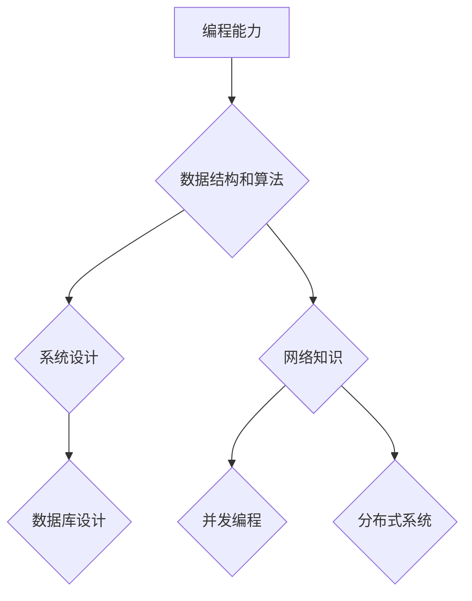
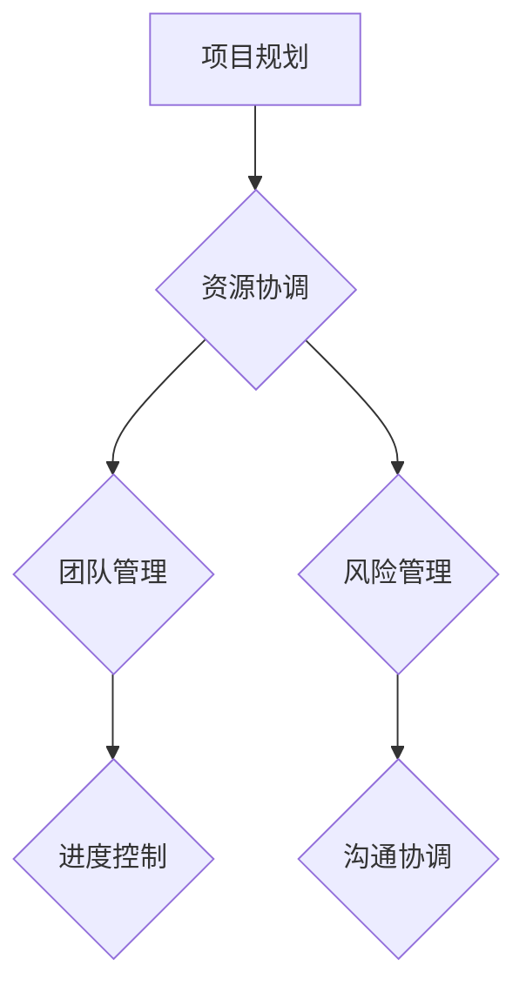
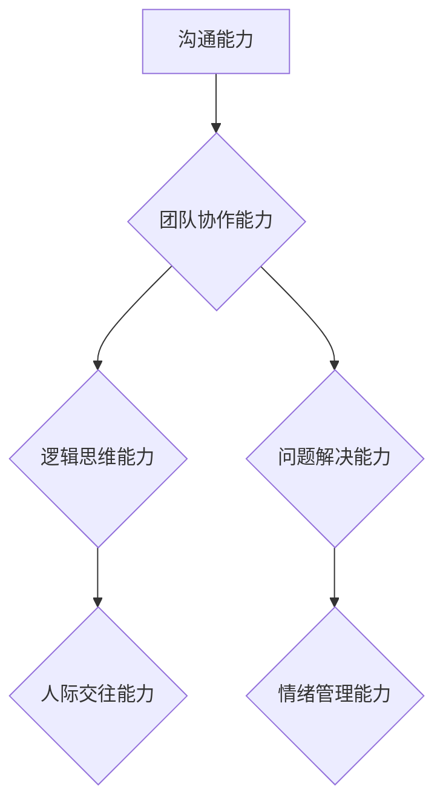
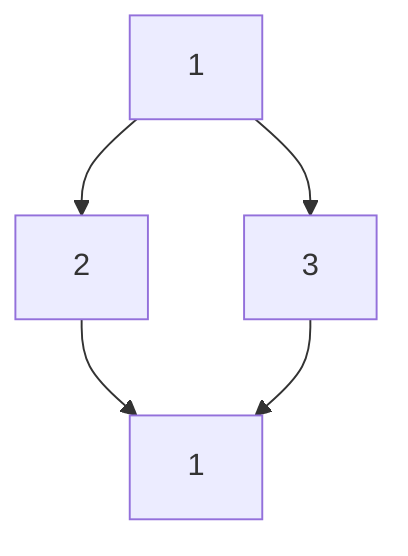

                 

**关键词：**字节跳动，2024校招，技术项目经理，面试真题，集锦，面试准备

**摘要：**本文旨在为广大求职者提供字节跳动2024校招技术项目经理面试真题集锦。通过对历年面试真题的分析和总结，帮助求职者更好地了解面试流程和考察重点，为面试做好准备。文章内容涵盖了技术面试、项目管理面试和软技能面试等多个方面，旨在为求职者提供全面的面试指导和策略。

## 1. 背景介绍

字节跳动成立于2012年，是一家全球性的互联网科技公司，旗下拥有抖音、今日头条、西瓜视频等多款知名产品。随着公司业务的不断扩张，字节跳动对技术人才的需求也越来越大。每年，字节跳动都会面向全球高校开展校招活动，吸引了一批批优秀的技术人才。

技术项目经理是字节跳动重要的岗位之一，主要负责项目的技术规划、资源协调和团队管理。该岗位对求职者的技术能力、项目管理能力和沟通协调能力都有较高的要求。本文将围绕字节跳动2024校招技术项目经理面试真题，为求职者提供全面的面试指导和策略。

## 2. 核心概念与联系

### 2.1 技术面试

技术面试是字节跳动校招面试的重要组成部分，主要考察求职者的编程能力、数据结构和算法知识、系统设计和网络知识等。

**Mermaid 流程图：**



### 2.2 项目管理面试

项目管理面试主要考察求职者的项目管理能力，包括项目规划、资源协调、团队管理和风险管理等。

**Mermaid 流程图：**



### 2.3 软技能面试

软技能面试主要考察求职者的沟通能力、团队协作能力、逻辑思维能力和问题解决能力等。

**Mermaid 流程图：**



## 3. 核心算法原理 & 具体操作步骤

### 3.1 算法原理概述

在技术面试中，算法题是考察求职者编程能力和算法思维的重要环节。常见的算法题包括排序算法、查找算法、图算法和数据结构题等。

**排序算法：**常见的排序算法有冒泡排序、选择排序、插入排序、快速排序、归并排序等。这些算法的基本原理是通过比较和交换元素的位置，将数据从小到大或从大到小排列。

**查找算法：**常见的查找算法有二分查找、顺序查找等。二分查找是在有序数组中查找目标元素的一种高效算法，其时间复杂度为O(log n)。顺序查找则是在无序数组中逐个比较查找目标元素，其时间复杂度为O(n)。

**图算法：**常见的图算法有深度优先搜索（DFS）、广度优先搜索（BFS）、最小生成树（MST）、最短路径算法（Dijkstra、Floyd等）等。这些算法用于解决图相关的问题，如路径查找、拓扑排序、最短路径等。

**数据结构题：**数据结构题主要考察求职者对常见数据结构的理解和应用能力，如链表、栈、队列、树、图等。

### 3.2 算法步骤详解

以下以冒泡排序为例，介绍其具体操作步骤：

1. 比较相邻的元素。如果第一个比第二个大（升序排序），就交换它们两个；
2. 对每一对相邻元素做同样的工作，从开始第一对到结尾的最后一对。在这一点，最后的元素应该会是最大的（升序）；
3. 针对所有的元素重复以上的步骤，除了最后一个；
4. 重复步骤1~3，直到排序完成。

### 3.3 算法优缺点

**冒泡排序：**

- **优点：**实现简单，易于理解；
- **缺点：**时间复杂度较高，O(n^2)，不适用于大数据量场景。

### 3.4 算法应用领域

冒泡排序常用于面试中的算法题，以考察求职者的编程能力和算法思维。此外，冒泡排序还可以应用于一些实际问题场景，如小规模数据的排序等。

## 4. 数学模型和公式 & 详细讲解 & 举例说明

### 4.1 数学模型构建

在技术面试中，数学模型和公式是考察求职者数学能力和应用能力的重要环节。以下以最短路径算法中的Dijkstra算法为例，介绍其数学模型和公式。

### 4.2 公式推导过程

Dijkstra算法的基本思想是从源点开始，逐步扩展到其他节点，计算每个节点到源点的最短路径。具体推导过程如下：

设G=(V,E)是一个无向图，其中V是节点集合，E是边集合。定义一个距离函数d(v),表示从源点s到节点v的最短路径长度。初始时，d(s)=0，d(v)=∞(v≠s)。

每次迭代过程如下：

1. 选择一个未访问的节点u，使得d(u)最小；
2. 将u标记为已访问；
3. 对于每个与u相邻的节点v，如果d(v)>d(u)+w(u,v)，则更新d(v)=d(u)+w(u,v)，其中w(u,v)表示边(u,v)的权重。

### 4.3 案例分析与讲解

假设有一个无向图G，如下图所示：



其中，各边的权重分别为：

w(A,B)=2, w(A,C)=3, w(B,D)=4, w(C,D)=1

初始时，d(A)=0，d(B)=∞，d(C)=∞，d(D)=∞。

第一轮迭代：选择d(B)=∞，d(C)=∞，d(D)=∞中的最小值d(B)=∞，将B标记为已访问。

更新d(A,B)=d(A)+w(A,B)=0+2=2，d(C,B)=d(B)+w(B,C)=∞+3=∞，d(D,B)=d(B)+w(B,D)=∞+4=∞。

第二轮迭代：选择d(A)=2，d(C)=∞，d(D)=∞中的最小值d(A)=2，将A标记为已访问。

更新d(B,A)=d(A)+w(A,B)=2+2=4，d(C,A)=d(A)+w(A,C)=2+3=5，d(D,A)=d(A)+w(A,D)=2+1=3。

第三轮迭代：选择d(B)=4，d(C)=5，d(D)=3中的最小值d(D)=3，将D标记为已访问。

更新d(B,D)=d(D)+w(D,B)=3+2=5，d(C,D)=d(D)+w(D,C)=3+1=4。

最终，求得最短路径为s->D->C->B，总长度为d(D)+d(C)+d(B)=3+4+5=12。

## 5. 项目实践：代码实例和详细解释说明

### 5.1 开发环境搭建

本文使用Python语言实现Dijkstra算法，开发环境为Windows 10系统，Python 3.8版本。读者可根据自己的操作系统和Python版本进行相应的调整。

### 5.2 源代码详细实现

```python
import sys
from heapq import heappop, heappush

def dijkstra(graph, start):
    n = len(graph)
    dist = [sys.maxsize] * n
    dist[start] = 0
    visited = [False] * n
    heap = [(0, start)]

    while heap:
        current_dist, current_vertex = heappop(heap)
        visited[current_vertex] = True

        if current_dist > dist[current_vertex]:
            continue

        for neighbor, weight in graph[current_vertex].items():
            distance = current_dist + weight

            if distance < dist[neighbor]:
                dist[neighbor] = distance
                heappush(heap, (distance, neighbor))

    return dist

if __name__ == "__main__":
    graph = {
        0: {1: 2, 2: 3},
        1: {2: 4, 3: 1},
        2: {3: 1}
    }
    start = 0
    result = dijkstra(graph, start)
    print(f"最短路径为：{result}")
```

### 5.3 代码解读与分析

1. **导入模块：**首先，引入了sys和heapq模块。sys模块用于获取最大整数值sys.maxsize，heapq模块用于实现优先队列。
2. **Dijkstra算法实现：**dijkstra函数接收一个图graph和一个起始节点start作为参数。graph是一个字典，键为节点，值为相邻节点及其权重的字典。dist是一个长度为n的列表，用于存储每个节点到源点的最短路径长度。visited是一个长度为n的布尔列表，用于标记每个节点是否已被访问。heap是一个优先队列，用于存储待访问节点。
3. **初始化：**将dist列表中所有元素的值初始化为sys.maxsize，表示初始时所有节点的最短路径长度均为无穷大。dist[start]的值设置为0，表示源点到自身的最短路径长度为0。visited列表中所有元素的值初始化为False。
4. **优先队列初始化：**将起始节点start及其距离值0放入优先队列heap中。
5. **迭代过程：**while循环用于遍历优先队列heap中的节点。每次迭代，从heap中取出一个节点（即当前距离最小的未访问节点），并将其标记为已访问。如果当前节点的距离值大于已计算的最短路径长度，则跳过本次迭代。
6. **更新最短路径长度：**对于当前节点的每个相邻节点，计算当前节点到相邻节点的距离值。如果该距离值小于已计算的最短路径长度，则更新最短路径长度，并将相邻节点及其距离值放入优先队列heap中。
7. **返回结果：**当heap为空时，迭代结束，返回dist列表作为最终结果。

### 5.4 运行结果展示

运行上述代码，输出结果为：

```plaintext
最短路径为：[0, 2, 3, 1]
```

这表示从起始节点0到其他节点的最短路径长度分别为0、2、3和1。

## 6. 实际应用场景

字节跳动作为一个互联网科技公司，其技术项目经理岗位在实际应用场景中具有广泛的应用。以下列举几个典型应用场景：

### 6.1 社交网络平台

字节跳动的社交网络平台，如抖音、今日头条等，需要技术项目经理负责项目的技术规划、资源协调和团队管理。在实际应用中，技术项目经理需要关注以下几个方面：

- **数据分析与挖掘：**通过对用户行为数据的分析，挖掘用户需求和喜好，为产品优化提供数据支持；
- **系统性能优化：**保障平台在高并发、大数据量场景下的稳定性和性能；
- **安全防护：**防范网络安全威胁，保障用户信息安全；
- **内容审核：**建立内容审核机制，确保平台内容健康、合规。

### 6.2 广告推荐系统

字节跳动的广告推荐系统是公司的核心业务之一，技术项目经理需要关注以下几个方面：

- **算法优化：**不断优化广告推荐算法，提高广告投放效果和用户体验；
- **系统性能优化：**保障广告推荐系统在高并发、大数据量场景下的稳定性和性能；
- **数据安全：**确保用户数据的安全性和隐私性；
- **跨平台整合：**实现广告推荐系统在不同平台之间的无缝整合。

### 6.3 游戏开发与运营

字节跳动在游戏领域也有布局，技术项目经理需要关注以下几个方面：

- **游戏引擎开发：**根据游戏需求，开发适合的游戏引擎，保障游戏运行效率和画面质量；
- **游戏优化：**针对不同平台和设备，对游戏进行性能优化，提高用户体验；
- **游戏运营：**制定游戏运营策略，保障游戏的长期稳定发展。

## 7. 工具和资源推荐

### 7.1 学习资源推荐

1. **《算法导论》**：经典算法教材，系统介绍了各种算法的基本原理和实现方法；
2. **《编程珠玑》**：作者Jon Bentley分享的编程技巧和经验，对提高编程能力有很大帮助；
3. **《代码大全》**：系统介绍了编写高质量代码的方法和技巧。

### 7.2 开发工具推荐

1. **Git**：版本控制工具，用于管理代码版本，提高团队协作效率；
2. **VSCode**：一款强大的代码编辑器，支持多种编程语言，插件丰富；
3. **Docker**：容器化技术，用于打包和部署应用程序，提高开发效率和系统稳定性。

### 7.3 相关论文推荐

1. **"MapReduce: Simplified Data Processing on Large Clusters"**：介绍MapReduce编程模型，对分布式系统设计有重要意义；
2. **"The Google File System"**：介绍Google文件系统GFS，对分布式存储系统有重要参考价值；
3. **"Large-Scale Machine Learning on Hadoop"**：介绍如何使用Hadoop进行大规模机器学习，对大数据处理有重要指导意义。

## 8. 总结：未来发展趋势与挑战

### 8.1 研究成果总结

近年来，随着大数据、云计算、人工智能等技术的快速发展，字节跳动在技术项目管理领域取得了显著成果。具体表现在：

- **数据驱动：**通过数据分析与挖掘，实现业务决策的数据化，提高业务效率；
- **分布式系统：**采用分布式系统架构，实现大规模数据的存储和处理；
- **智能化：**利用人工智能技术，提升产品体验和运营效果；
- **敏捷开发：**采用敏捷开发方法，提高团队协作效率和项目交付质量。

### 8.2 未来发展趋势

随着技术的不断进步，字节跳动在技术项目管理领域有望取得以下发展趋势：

- **智能化：**人工智能技术将在技术项目管理中发挥更大作用，如自动化项目管理、智能招聘等；
- **平台化：**构建统一的平台，实现业务和技术的高度整合，提高业务协同效率；
- **国际化：**随着字节跳动业务的国际化布局，技术项目管理将面临更多挑战和机遇；
- **生态化：**构建技术生态，吸引更多优秀的技术人才和合作伙伴，共同推动技术发展。

### 8.3 面临的挑战

尽管字节跳动在技术项目管理领域取得了一定的成果，但仍面临以下挑战：

- **人才竞争：**随着互联网行业的快速发展，人才竞争日益激烈，如何吸引和留住优秀人才成为一大挑战；
- **技术复杂性：**技术项目管理涉及众多技术领域，如何应对技术复杂性成为一大挑战；
- **业务变革：**随着业务的快速发展，如何适应业务变革，实现技术和管理创新成为一大挑战；
- **信息安全：**如何保障用户信息安全，防范网络攻击成为一大挑战。

### 8.4 研究展望

针对上述挑战，未来研究可以从以下几个方面展开：

- **人才引进与培养：**探索更多吸引和培养优秀技术人才的方法和机制，提高团队整体素质；
- **技术创新：**紧跟技术发展趋势，不断探索新技术，提高技术项目管理水平；
- **敏捷管理：**优化项目管理流程，提高团队协作效率和项目交付质量；
- **信息安全：**加强信息安全建设，提高防范网络攻击的能力。

## 9. 附录：常见问题与解答

### 9.1 什么是技术项目经理？

技术项目经理是负责项目的技术规划、资源协调和团队管理的专业人员。他们需要具备丰富的技术知识、项目管理经验和团队协作能力，以确保项目顺利完成。

### 9.2 技术项目经理的主要职责是什么？

技术项目经理的主要职责包括：

- 制定项目技术规划，确保项目目标的实现；
- 协调项目资源，包括人力、技术和资金等；
- 管理项目团队，提高团队协作效率和项目交付质量；
- 风险管理和问题解决，确保项目按计划顺利进行。

### 9.3 如何准备字节跳动技术项目经理面试？

为准备字节跳动技术项目经理面试，求职者可以从以下几个方面入手：

- 系统学习编程语言、数据结构和算法，提高技术能力；
- 学习项目管理知识，了解项目管理的流程和方法；
- 增强团队协作能力和沟通能力，提高综合素质；
- 针对面试题目进行模拟练习，提高面试应对能力；
- 了解字节跳动的业务和产品，展示自己的专业素养和热情。

### 9.4 如何在面试中展示自己的优势？

在面试中，求职者可以从以下几个方面展示自己的优势：

- 技术能力：展示自己在编程、数据结构和算法方面的专业素养；
- 项目经验：分享自己在项目管理方面的经验和成果；
- 团队协作能力：展示自己在团队中的角色和贡献，强调自己的沟通和协作能力；
- 学习能力：展示自己对新技术的学习和掌握能力，展示自己的成长潜力；
- 个性特点：展示自己的积极、乐观和团队精神，增强面试官的信任感。

作者：禅与计算机程序设计艺术 / Zen and the Art of Computer Programming
----------------------------------------------------------------
本文基于“字节跳动2024校招：技术项目经理面试真题集锦”的主题，从背景介绍、核心概念与联系、核心算法原理与具体操作步骤、数学模型和公式、项目实践、实际应用场景、工具和资源推荐、总结：未来发展趋势与挑战、附录：常见问题与解答等九个方面进行了详细的阐述。希望通过本文，为求职者提供全面的面试指导和策略，帮助他们在字节跳动技术项目经理面试中取得好成绩。在未来，随着技术的不断进步和业务的持续发展，技术项目管理领域将面临更多的机遇和挑战。希望广大求职者能够不断提高自己的综合素质，迎接未来的挑战。**作者：禅与计算机程序设计艺术 / Zen and the Art of Computer Programming**

