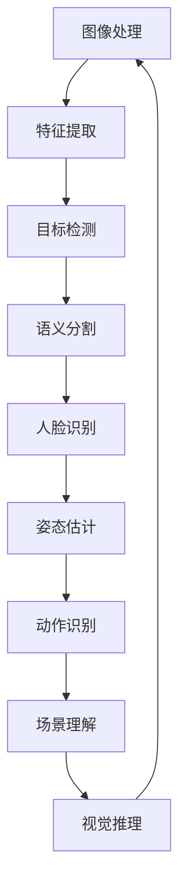

                 

关键词：字节跳动、2024校招、计算机视觉、面试真题、解答

摘要：本文旨在为参加字节跳动2024校招的计算机视觉工程师岗位考生提供一系列面试真题的详细解答。通过这些真题的解析，考生可以更好地了解面试中的常见问题和解决策略，从而提升自己的面试表现。

## 1. 背景介绍

随着人工智能技术的不断发展，计算机视觉技术在各行各业中的应用越来越广泛。字节跳动作为一家领先的内容平台，对计算机视觉工程师的需求日益增加。因此，每年都会举办校招活动，选拔优秀的计算机视觉工程师人才。本文将针对字节跳动2024校招计算机视觉工程师岗位的面试真题进行详细解答，帮助考生更好地准备面试。

## 2. 核心概念与联系

为了更好地理解计算机视觉技术，我们需要了解一些核心概念和它们之间的联系。以下是一个简单的Mermaid流程图，展示了计算机视觉的核心概念和联系。



### 2.1 图像处理

图像处理是计算机视觉的基础，包括图像增强、滤波、边缘检测等操作。图像处理的目标是提取图像的有用信息，去除噪声和干扰。

### 2.2 特征提取

特征提取是将图像或视频中的关键信息转化为数值表示的过程。常用的特征提取方法有SIFT、SURF、HOG等。

### 2.3 目标检测

目标检测是在图像中定位并识别特定对象的过程。常用的目标检测算法有YOLO、SSD、Faster R-CNN等。

### 2.4 语义分割

语义分割是将图像中的每个像素分类到不同的语义类别中。常用的语义分割算法有FCN、U-Net、Mask R-CNN等。

### 2.5 人脸识别

人脸识别是通过分析人脸图像来识别身份的技术。常用的算法有Eigenface、Fisherface、DeepFace等。

### 2.6 姿态估计

姿态估计是通过分析人体关键点位置来识别人体的姿态。常用的算法有 PoseNet、Pose-EstNet、SimplePose等。

### 2.7 动作识别

动作识别是通过分析视频序列来识别动作的技术。常用的算法有 HMM、CNN、RNN等。

### 2.8 场景理解

场景理解是通过分析图像或视频来理解场景内容的技术。常用的算法有 VGG、ResNet、Transformer等。

### 2.9 视觉推理

视觉推理是通过分析图像或视频来推导出结论的技术。常用的算法有视觉Transformer、Diffusion Models等。

## 3. 核心算法原理 & 具体操作步骤

### 3.1 算法原理概述

计算机视觉中的核心算法包括图像处理、特征提取、目标检测、语义分割、人脸识别、姿态估计、动作识别和场景理解等。这些算法通过一系列数学模型和算法步骤来实现，下面将分别介绍。

### 3.2 算法步骤详解

#### 3.2.1 图像处理

图像处理的步骤包括图像增强、滤波、边缘检测等。具体操作如下：

1. 图像增强：通过调整图像的亮度、对比度、饱和度等参数，使图像更加清晰。
2. 滤波：通过滤波器去除图像中的噪声。
3. 边缘检测：通过检测图像中的边缘来提取图像的特征。

#### 3.2.2 特征提取

特征提取的步骤包括特征提取和特征匹配。具体操作如下：

1. 特征提取：通过特征检测算法（如SIFT、SURF、HOG等）提取图像的特征点。
2. 特征匹配：通过特征匹配算法（如FLANN、Brute-Force等）将提取的特征点进行匹配。

#### 3.2.3 目标检测

目标检测的步骤包括目标检测和目标分类。具体操作如下：

1. 目标检测：通过目标检测算法（如YOLO、SSD、Faster R-CNN等）在图像中检测目标。
2. 目标分类：通过目标分类算法（如SVM、CNN等）对检测到的目标进行分类。

#### 3.2.4 语义分割

语义分割的步骤包括图像分割和类别分类。具体操作如下：

1. 图像分割：通过语义分割算法（如FCN、U-Net、Mask R-CNN等）将图像分割成不同的区域。
2. 类别分类：通过类别分类算法（如SVM、CNN等）对分割后的区域进行类别分类。

#### 3.2.5 人脸识别

人脸识别的步骤包括人脸检测和人脸特征提取。具体操作如下：

1. 人脸检测：通过人脸检测算法（如Haar-like特征、Dlib等）检测图像中的人脸。
2. 人脸特征提取：通过人脸特征提取算法（如Eigenface、Fisherface、DeepFace等）提取人脸的特征。

#### 3.2.6 姿态估计

姿态估计的步骤包括关键点检测和姿态预测。具体操作如下：

1. 关键点检测：通过关键点检测算法（如PoseNet、Pose-EstNet、SimplePose等）检测人体关键点。
2. 姿态预测：通过姿态预测算法（如HMM、CNN、RNN等）预测人体的姿态。

#### 3.2.7 动作识别

动作识别的步骤包括动作检测和动作分类。具体操作如下：

1. 动作检测：通过动作检测算法（如HMM、CNN、RNN等）检测视频中的动作。
2. 动作分类：通过动作分类算法（如SVM、CNN等）对检测到的动作进行分类。

#### 3.2.8 场景理解

场景理解的步骤包括图像分类和关系推理。具体操作如下：

1. 图像分类：通过图像分类算法（如VGG、ResNet、Transformer等）对图像进行分类。
2. 关系推理：通过关系推理算法（如视觉Transformer、Diffusion Models等）推理图像中的关系。

### 3.3 算法优缺点

不同的算法有其各自的优缺点。以下是对常见算法的优缺点的简要概述：

1. **图像处理算法**：优点是处理速度快，缺点是效果有限。
2. **特征提取算法**：优点是特征丰富，缺点是计算量大。
3. **目标检测算法**：优点是检测速度快，缺点是准确率较低。
4. **语义分割算法**：优点是精确度高，缺点是计算量大。
5. **人脸识别算法**：优点是识别速度快，缺点是易受光照、姿态等影响。
6. **姿态估计算法**：优点是准确度高，缺点是计算量大。
7. **动作识别算法**：优点是识别速度快，缺点是准确率较低。
8. **场景理解算法**：优点是理解能力强，缺点是计算量大。

### 3.4 算法应用领域

计算机视觉算法在各个领域都有广泛的应用，以下是一些典型的应用领域：

1. **安防监控**：通过目标检测、人脸识别等技术实现实时监控和报警。
2. **自动驾驶**：通过图像处理、目标检测、姿态估计等技术实现自动驾驶。
3. **医疗影像**：通过图像处理、语义分割等技术实现疾病诊断和辅助治疗。
4. **智能交互**：通过人脸识别、姿态估计等技术实现人机交互。
5. **智能制造**：通过图像处理、目标检测等技术实现生产过程的自动化。

## 4. 数学模型和公式 & 详细讲解 & 举例说明

计算机视觉中的许多算法都基于数学模型，以下是一些常用的数学模型和公式的详细讲解以及举例说明。

### 4.1 数学模型构建

数学模型构建是计算机视觉算法设计的关键步骤。以下是一个简单的数学模型构建示例：

```latex
假设我们有一个图像 \( I(x,y) \)，我们需要对其进行滤波。滤波器的响应函数为 \( h(x,y) \)。

滤波后的图像 \( I_{filtered}(x,y) \) 可以通过以下公式计算：
$$
I_{filtered}(x,y) = \sum_{x'} \sum_{y'} h(x-x', y-y') I(x',y')
$$
```

### 4.2 公式推导过程

以下是一个简单的公式推导示例，用于计算图像的边缘：

```latex
假设图像 \( I(x,y) \) 的梯度可以通过以下公式计算：
$$
\nabla I(x,y) = \left( \frac{\partial I}{\partial x}, \frac{\partial I}{\partial y} \right)
$$

图像的边缘可以通过以下公式计算：
$$
\text{Edge}(x,y) = \left| \nabla I(x,y) \right|
$$
```

### 4.3 案例分析与讲解

以下是一个简单的案例，用于说明如何使用图像处理算法对图像进行滤波。

### 案例背景

假设我们有一个512x512的图像，需要进行高斯滤波。

### 案例步骤

1. 读取图像。
2. 创建高斯滤波器。
3. 应用滤波器。
4. 显示滤波后的图像。

### 案例代码

```python
import numpy as np
import cv2

# 读取图像
image = cv2.imread('image.jpg', cv2.IMREAD_GRAYSCALE)

# 创建高斯滤波器
kernel = cv2.getGaussianKernel(ksize=(5, 5), sigma=1.5)

# 应用滤波器
filtered_image = cv2.filter2D(image, -1, kernel)

# 显示滤波后的图像
cv2.imshow('Filtered Image', filtered_image)
cv2.waitKey(0)
cv2.destroyAllWindows()
```

## 5. 项目实践：代码实例和详细解释说明

### 5.1 开发环境搭建

为了进行计算机视觉项目实践，我们需要搭建一个开发环境。以下是一个简单的开发环境搭建步骤：

1. 安装Python：从Python官方网站下载并安装Python。
2. 安装Anaconda：从Anaconda官方网站下载并安装Anaconda。
3. 安装opencv：在终端中运行以下命令：
```
conda install -c conda-forge opencv
```

### 5.2 源代码详细实现

以下是一个简单的计算机视觉项目实例，用于实现图像滤波。

```python
import numpy as np
import cv2

# 读取图像
image = cv2.imread('image.jpg', cv2.IMREAD_GRAYSCALE)

# 创建高斯滤波器
kernel = cv2.getGaussianKernel(ksize=(5, 5), sigma=1.5)

# 应用滤波器
filtered_image = cv2.filter2D(image, -1, kernel)

# 显示原始图像和滤波后的图像
cv2.imshow('Original Image', image)
cv2.imshow('Filtered Image', filtered_image)
cv2.waitKey(0)
cv2.destroyAllWindows()
```

### 5.3 代码解读与分析

以上代码实现了一个简单的图像滤波项目。首先，我们读取一个灰度图像，然后创建一个高斯滤波器。接下来，我们使用滤波器对图像进行滤波，并将滤波后的图像显示出来。

### 5.4 运行结果展示

运行以上代码后，我们将看到原始图像和滤波后的图像。通过观察滤波后的图像，我们可以看到图像中的噪声被显著降低，图像变得更加清晰。

## 6. 实际应用场景

计算机视觉技术在实际应用中具有广泛的应用前景。以下是一些典型的实际应用场景：

1. **安防监控**：通过目标检测、人脸识别等技术实现实时监控和报警。
2. **自动驾驶**：通过图像处理、目标检测、姿态估计等技术实现自动驾驶。
3. **医疗影像**：通过图像处理、语义分割等技术实现疾病诊断和辅助治疗。
4. **智能交互**：通过人脸识别、姿态估计等技术实现人机交互。
5. **智能制造**：通过图像处理、目标检测等技术实现生产过程的自动化。

### 6.1 常见问题与解答

**问题1**：计算机视觉算法在处理大规模图像时速度较慢，如何优化？

**解答**：为了优化计算机视觉算法在处理大规模图像时的速度，可以采用以下策略：

1. **并行计算**：利用多核CPU或GPU进行并行计算，提高处理速度。
2. **模型压缩**：通过模型压缩技术（如量化、剪枝等）减小模型的大小，提高处理速度。
3. **数据增强**：通过数据增强技术（如旋转、翻转等）增加训练数据量，提高模型的泛化能力。

**问题2**：如何选择合适的计算机视觉算法？

**解答**：选择合适的计算机视觉算法需要考虑以下因素：

1. **应用场景**：根据实际应用场景选择合适的算法，如安防监控选择目标检测算法，医疗影像选择语义分割算法。
2. **计算资源**：根据计算资源的限制选择算法，如自动驾驶选择计算量较小的算法。
3. **算法性能**：根据算法的性能指标（如准确率、召回率等）选择最优的算法。

### 6.4 未来应用展望

随着人工智能技术的不断发展，计算机视觉技术在未来的应用前景将更加广阔。以下是一些未来的应用展望：

1. **智能城市**：通过计算机视觉技术实现城市安全监控、交通管理、环境监测等。
2. **智能医疗**：通过计算机视觉技术实现疾病诊断、辅助手术、健康监测等。
3. **智能交通**：通过计算机视觉技术实现自动驾驶、智能交通信号控制等。
4. **智能制造**：通过计算机视觉技术实现生产过程的自动化、质量检测等。

## 7. 工具和资源推荐

### 7.1 学习资源推荐

1. **《计算机视觉：算法与应用》**：详细介绍了计算机视觉的基本概念、算法和应用。
2. **《深度学习》**：由Ian Goodfellow等人撰写的经典教材，介绍了深度学习的基本概念和算法。

### 7.2 开发工具推荐

1. **PyTorch**：一个流行的深度学习框架，适用于计算机视觉任务。
2. **TensorFlow**：另一个流行的深度学习框架，适用于计算机视觉任务。

### 7.3 相关论文推荐

1. **“You Only Look Once: Unified, Real-Time Object Detection”**：介绍了YOLO目标检测算法。
2. **“Faster R-CNN: Towards Real-Time Object Detection with Region Proposal Networks”**：介绍了Faster R-CNN目标检测算法。
3. **“U-Net: A Convolutional Network for Biomedical Image Segmentation”**：介绍了U-Net语义分割算法。

## 8. 总结：未来发展趋势与挑战

计算机视觉技术在未来的发展趋势包括：

1. **算法性能的提升**：通过模型压缩、并行计算等技术提高算法的性能。
2. **跨领域的应用**：在智能城市、智能医疗、智能交通等领域实现更广泛的应用。
3. **实时性的提升**：通过优化算法和硬件实现实时性的提升。

然而，计算机视觉技术也面临以下挑战：

1. **计算资源的限制**：随着模型复杂度的增加，计算资源的需求也越来越大。
2. **数据隐私和安全性**：如何保护用户数据的安全性和隐私性。
3. **算法的普适性**：如何使算法在不同场景下都能保持良好的性能。

未来，计算机视觉技术将在各个领域发挥更大的作用，为实现人工智能的广泛应用奠定基础。

## 9. 附录：常见问题与解答

### 9.1 常见问题1

**问题**：计算机视觉算法在处理大规模图像时速度较慢，如何优化？

**解答**：

1. **并行计算**：利用多核CPU或GPU进行并行计算，提高处理速度。
2. **模型压缩**：通过模型压缩技术（如量化、剪枝等）减小模型的大小，提高处理速度。
3. **数据增强**：通过数据增强技术（如旋转、翻转等）增加训练数据量，提高模型的泛化能力。

### 9.2 常见问题2

**问题**：如何选择合适的计算机视觉算法？

**解答**：

1. **应用场景**：根据实际应用场景选择合适的算法，如安防监控选择目标检测算法，医疗影像选择语义分割算法。
2. **计算资源**：根据计算资源的限制选择算法，如自动驾驶选择计算量较小的算法。
3. **算法性能**：根据算法的性能指标（如准确率、召回率等）选择最优的算法。

### 9.3 常见问题3

**问题**：计算机视觉算法在处理实时视频时效果不佳，如何优化？

**解答**：

1. **算法优化**：优化算法的实现，减少计算复杂度，提高处理速度。
2. **硬件加速**：利用GPU或其他硬件加速技术，提高处理速度。
3. **预处理**：对实时视频进行预处理，如降采样、滤波等，降低处理难度。

### 9.4 常见问题4

**问题**：如何评估计算机视觉算法的性能？

**解答**：

1. **准确率**：计算算法预测正确的样本数量与总样本数量的比例。
2. **召回率**：计算算法预测正确的样本数量与实际样本数量的比例。
3. **F1值**：综合考虑准确率和召回率，计算两者的调和平均值。

通过以上常见问题的解答，希望能帮助您更好地理解计算机视觉算法的性能评估和优化方法。

