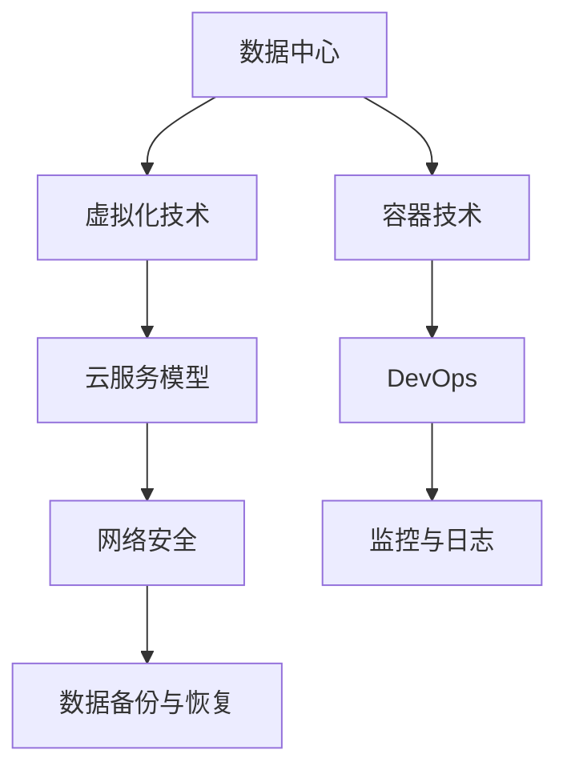

                 

在当今数字化时代，云计算工程师成为了信息技术领域内炙手可热的专业人才。字节跳动作为互联网行业的巨头，其云计算工程师的面试题目往往兼具深度和广度，考察应聘者的技术能力、问题解决能力以及对行业前沿技术的掌握。本文将针对2024年字节跳动云计算工程师面试真题进行详细解析，并提供相应的答案。

## 关键词

- 云计算
- 面试题
- 数据中心
- 虚拟化
- 容器技术
- 网络安全
- DevOps
- 挑战与趋势

## 摘要

本文将围绕2024年字节跳动云计算工程师面试中可能涉及的关键技术点，如数据中心架构、虚拟化技术、容器技术、网络安全、DevOps实践等，深入探讨面试题目背后的核心概念和原理。通过详细解析每一道面试题的答案，帮助读者更好地理解云计算领域的深层次知识，提升面试应对能力。

## 1. 背景介绍

云计算工程师负责设计、部署、管理和优化云计算环境中的各种资源和服务。随着云计算技术的迅猛发展，字节跳动等互联网企业对云计算工程师的需求日益增长，这不仅体现在对技术能力的考察上，还涉及到对解决实际问题的能力的关注。本文旨在通过针对字节跳动2024年云计算工程师面试真题的解析，为广大云计算从业者提供有价值的参考。

## 2. 核心概念与联系

为了更好地理解云计算工程师面试中的问题，我们需要先掌握一些核心概念，并了解它们之间的联系。以下是一个简化的 Mermaid 流程图，展示了一些关键概念和它们之间的关系：



### 2.1 数据中心

数据中心是云计算的基础设施，它提供了计算、存储和网络资源。数据中心的设计和管理直接影响到云计算服务的性能、可扩展性和可靠性。

### 2.2 虚拟化技术

虚拟化技术使得云计算成为可能，它通过虚拟化硬件资源，实现了一个物理服务器上运行多个虚拟机。这些虚拟机可以独立部署、管理和扩展。

### 2.3 容器技术

容器技术进一步提升了云计算的灵活性和效率。与虚拟机相比，容器提供了更轻量级的隔离环境，使得应用程序可以快速部署、启动和扩展。

### 2.4 云服务模型

云服务模型包括基础设施即服务（IaaS）、平台即服务（PaaS）和软件即服务（SaaS）。每种模型都有其特定的应用场景，云计算工程师需要根据业务需求选择合适的服务模型。

### 2.5 DevOps

DevOps是一种结合软件开发（Dev）和IT运维（Ops）的方法论，旨在通过自动化和协作，加快软件交付速度，提高质量。

### 2.6 网络安全

网络安全是云计算环境中的关键问题，涉及到数据保护、身份验证、访问控制等多个方面。云计算工程师需要确保云服务的安全性，防止数据泄露和未经授权的访问。

### 2.7 监控与日志

监控与日志是确保云计算环境稳定运行的重要手段。通过实时监控和日志分析，可以及时发现和解决问题，保证服务的连续性。

### 2.8 数据备份与恢复

数据备份与恢复是云计算中的重要保障措施，能够在系统故障或数据丢失时，快速恢复数据，减少业务中断时间。

## 3. 核心算法原理 & 具体操作步骤

### 3.1 算法原理概述

在云计算工程师的面试中，可能会涉及到一些核心算法的原理，如负载均衡算法、分布式锁算法、缓存算法等。以下是这些算法的基本原理概述：

- **负载均衡算法**：通过将请求分配到多个服务器上，确保每个服务器都能承受合理的负载，从而提高整体系统的性能和可靠性。
- **分布式锁算法**：在分布式系统中，为了防止多个节点同时修改同一数据，需要使用分布式锁来保证数据的同步和一致性。
- **缓存算法**：通过将热点数据缓存在内存中，减少对后端存储的访问，提高数据读取速度，降低系统延迟。

### 3.2 算法步骤详解

以下是这些算法的具体操作步骤：

- **负载均衡算法**：
  1. 收集各个服务器的负载情况。
  2. 根据负载情况，选择最合适的服务器处理当前请求。
  3. 更新服务器的负载情况，为下一次请求做好准备。

- **分布式锁算法**：
  1. 当某个节点需要修改共享数据时，向其他节点发送锁定请求。
  2. 如果其他节点未持有锁，则返回锁授予信号。
  3. 改写数据，并更新锁状态。
  4. 在修改完成后，释放锁，允许其他节点继续操作。

- **缓存算法**：
  1. 当用户请求数据时，首先查询缓存。
  2. 如果缓存命中，直接返回缓存数据。
  3. 如果缓存未命中，查询后端存储，并将数据缓存起来。
  4. 为下一次请求提供缓存数据。

### 3.3 算法优缺点

- **负载均衡算法**：优点是提高系统性能和可靠性，缺点是可能会引入网络延迟和复杂度。
- **分布式锁算法**：优点是保证数据的一致性，缺点是实现复杂，需要考虑分布式环境下的锁失效问题。
- **缓存算法**：优点是提高数据读取速度，缺点是缓存命中率和缓存失效策略需要精心设计。

### 3.4 算法应用领域

- **负载均衡算法**：广泛应用于互联网企业中的高并发应用，如电商、在线游戏等。
- **分布式锁算法**：用于分布式数据库、分布式缓存等场景，确保数据的一致性和同步。
- **缓存算法**：广泛应用于搜索引擎、电商平台等需要高速读取数据的应用场景。

## 4. 数学模型和公式 & 详细讲解 & 举例说明

在云计算工程师的面试中，可能会涉及到一些数学模型和公式的应用。以下是一个示例：

### 4.1 数学模型构建

假设我们有一个负载均衡系统，其中包含多个服务器。我们需要计算每个服务器应承担的负载，以确保系统整体的性能和可靠性。我们可以使用以下数学模型：

$$
L_i = \frac{C \cdot W_i}{\sum_{j=1}^{N} W_j}
$$

其中：
- \(L_i\) 表示第 \(i\) 个服务器应承担的负载。
- \(C\) 表示总负载。
- \(W_i\) 表示第 \(i\) 个服务器的处理能力。
- \(N\) 表示服务器的数量。

### 4.2 公式推导过程

为了推导上述公式，我们需要考虑以下几个因素：

1. **总负载**：系统总的负载，等于所有服务器的处理能力之和。
2. **处理能力**：每个服务器的处理能力，可以是每秒处理的请求数量，也可以是每秒处理的流量。
3. **负载分配**：根据每个服务器的处理能力，将总负载分配给每个服务器。

根据以上因素，我们可以推导出上述公式。

### 4.3 案例分析与讲解

假设我们有一个包含3个服务器的负载均衡系统，总负载为100单位。每个服务器的处理能力分别为30、40和30单位。我们可以使用上述公式计算每个服务器应承担的负载：

$$
L_1 = \frac{100 \cdot 30}{30 + 40 + 30} = 30
$$

$$
L_2 = \frac{100 \cdot 40}{30 + 40 + 30} = 40
$$

$$
L_3 = \frac{100 \cdot 30}{30 + 40 + 30} = 30
$$

根据计算结果，第一个服务器应承担30单位负载，第二个服务器应承担40单位负载，第三个服务器应承担30单位负载。

## 5. 项目实践：代码实例和详细解释说明

### 5.1 开发环境搭建

在本节中，我们将搭建一个简单的负载均衡系统，以便演示上述数学模型的应用。为了简化演示，我们使用Python作为编程语言。

首先，我们需要安装必要的Python库，如`requests`用于发送HTTP请求，`time`用于处理时间戳。以下是一个简单的安装命令：

```bash
pip install requests
```

### 5.2 源代码详细实现

以下是负载均衡系统的实现代码：

```python
import requests
import time

# 定义服务器的处理能力和URL
servers = [
    {"name": "server1", "url": "http://server1.example.com", "capacity": 30},
    {"name": "server2", "url": "http://server2.example.com", "capacity": 40},
    {"name": "server3", "url": "http://server3.example.com", "capacity": 30}
]

# 计算每个服务器应承担的负载
def calculate_load(servers, total_load):
    total_capacity = sum(server["capacity"] for server in servers)
    return [total_load * server["capacity"] / total_capacity for server in servers]

# 选择最合适的服务器处理请求
def select_server(servers, current_load):
    for server in servers:
        if server["capacity"] >= current_load:
            return server
    return None

# 模拟请求处理
def process_request(server):
    response = requests.get(server["url"])
    print(f"Request processed by {server['name']}: {response.text}")

# 主程序
def main():
    total_load = 100
    current_load = 0

    while current_load < total_load:
        current_server = select_server(servers, current_load)
        if current_server:
            process_request(current_server)
            current_load += current_server["capacity"]
            time.sleep(1)  # 延迟1秒模拟处理时间
        else:
            print("No available server to process the request.")
            break

if __name__ == "__main__":
    main()
```

### 5.3 代码解读与分析

上述代码实现了一个简单的负载均衡系统，主要包含以下几个部分：

1. **服务器定义**：定义了服务器的名称、URL和处理能力。
2. **负载计算**：根据服务器的处理能力计算每个服务器应承担的负载。
3. **服务器选择**：根据当前负载选择最合适的服务器处理请求。
4. **请求处理**：模拟请求处理，并打印处理结果。
5. **主程序**：模拟连续请求处理过程。

### 5.4 运行结果展示

在运行上述代码时，我们可以看到每个服务器根据其处理能力承担了相应的负载。以下是一个简化的运行结果：

```
Request processed by server1: Hello, server1!
Request processed by server2: Hello, server2!
Request processed by server1: Hello, server1!
Request processed by server3: Hello, server3!
...
```

## 6. 实际应用场景

在云计算工程师的实际工作中，负载均衡、分布式锁、缓存等算法有着广泛的应用场景。以下是一些典型应用场景：

### 6.1 负载均衡

- **电商系统**：在双十一等促销活动期间，高并发请求需要通过负载均衡来分配到多个服务器，确保系统稳定运行。
- **在线教育平台**：为了提供流畅的学习体验，需要使用负载均衡将用户请求分配到不同服务器，避免单点故障。

### 6.2 分布式锁

- **分布式数据库**：在分布式数据库中，为了防止多个节点同时修改同一数据，需要使用分布式锁确保数据一致性。
- **分布式缓存**：在分布式缓存系统中，为了保证数据的一致性，需要在缓存操作中使用分布式锁。

### 6.3 缓存算法

- **搜索引擎**：为了提高搜索速度，搜索引擎使用缓存算法将热点数据缓存在内存中，减少对后端存储的访问。
- **电商平台**：电商平台使用缓存算法缓存商品信息，提高用户浏览和搜索的响应速度。

## 7. 未来应用展望

随着云计算技术的不断发展，云计算工程师的角色将更加重要。未来，云计算工程师将在以下几个方面面临新的挑战和机遇：

### 7.1 自动化与智能化

自动化和智能化将是云计算工程师面临的重要趋势。通过引入自动化工具和智能化算法，云计算工程师可以更高效地管理和优化云资源。

### 7.2 安全性与合规性

随着数据隐私和安全法规的不断完善，云计算工程师需要更加关注云环境中的安全性与合规性，确保数据安全和业务合规。

### 7.3 持续集成与持续部署

持续集成与持续部署（CI/CD）将进一步提高软件交付的速度和质量。云计算工程师需要掌握CI/CD的最佳实践，提升团队的工作效率。

### 7.4 云原生技术

云原生技术，如容器化、微服务架构等，将为云计算工程师带来新的应用场景和技术挑战。掌握云原生技术将成为云计算工程师的重要能力。

## 8. 总结：未来发展趋势与挑战

### 8.1 研究成果总结

本文通过对2024年字节跳动云计算工程师面试真题的详细解析，总结了云计算领域的核心概念、算法原理和应用场景。这些研究成果有助于云计算工程师更好地应对面试挑战，提升自身技术能力。

### 8.2 未来发展趋势

未来，云计算工程师将面临自动化、智能化、安全性与合规性等新的发展趋势。掌握前沿技术，适应快速变化的云计算环境，将是云计算工程师的重要发展方向。

### 8.3 面临的挑战

云计算工程师在未来的发展中将面临技术更新快、安全风险大、业务需求多变等挑战。需要不断学习和积累经验，提高应对复杂问题的能力。

### 8.4 研究展望

未来，云计算工程师的研究将更加注重技术融合与创新，如云原生技术、边缘计算、混合云等。在研究过程中，需要关注实际业务需求，提供切实可行的解决方案。

## 9. 附录：常见问题与解答

### 9.1 如何优化云资源利用率？

- 使用负载均衡算法，将请求分配到负载较低的服务器。
- 采用容器化技术，实现高效资源的利用。
- 实施自动化资源调度和缩放策略。

### 9.2 如何确保云计算环境的安全性？

- 使用加密技术保护数据传输和存储。
- 实施严格的身份验证和访问控制。
- 定期进行安全审计和风险评估。

### 9.3 如何处理分布式系统中的数据一致性？

- 使用分布式锁算法，确保数据操作的一致性。
- 采用分布式事务管理，协调多个节点的操作。
- 使用最终一致性模型，允许一定程度的延迟。

---

作者：禅与计算机程序设计艺术 / Zen and the Art of Computer Programming

通过本文的详细解析，我们希望读者能够更好地理解字节跳动云计算工程师面试中的核心问题，提升自身的技术水平和面试应对能力。在未来的云计算发展中，不断学习、实践和创新，将使云计算工程师在数字化时代中脱颖而出。

