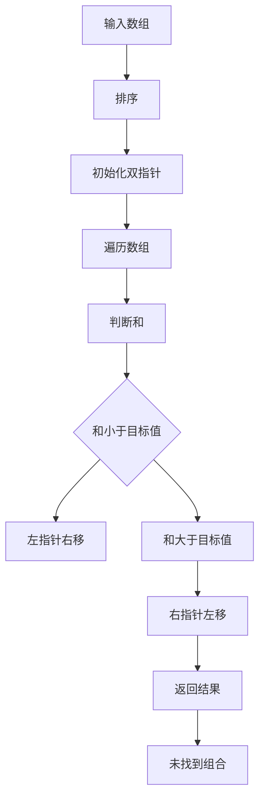

                 

关键词：字节跳动、技术面试、用户服务、面试真题、详解、IT行业

摘要：本文将针对2024年字节跳动技术用户服务专家的面试真题进行详细解析，涵盖算法原理、数学模型、项目实践等多个方面，旨在帮助考生更好地应对面试挑战，提升职业竞争力。

## 1. 背景介绍

字节跳动（ByteDance）是一家全球领先的互联网科技公司，旗下拥有抖音、今日头条、懂车帝等多个知名产品。作为我国科技创新的先锋力量，字节跳动在招聘过程中对技术用户服务专家的要求非常高，面试题目也具有相当的难度。本文旨在通过解析2024年字节跳动技术用户服务专家的面试真题，帮助考生深入了解面试内容，提高面试成功率。

## 2. 核心概念与联系

### 2.1 算法原理

在字节跳动的面试中，算法题目占据了很大的比重。以下是一个典型的算法问题：

**问题：实现一个函数，求出一个整数数组中两个数之和为指定值的第一个组合。**

### 2.2 Mermaid 流程图



### 2.3 算法应用领域

该算法在数据处理、排序、查找等领域具有广泛的应用。在实际工作中，字节跳动常常需要处理海量的数据，高效地找到符合条件的组合对于提升系统性能具有重要意义。

## 3. 核心算法原理 & 具体操作步骤

### 3.1 算法原理概述

该算法基于双指针法，通过排序和遍历数组，实现找到两个数之和为指定值的第一个组合。具体步骤如下：

1. 对输入数组进行排序。
2. 初始化两个指针，分别指向数组的两个端点。
3. 遍历数组，判断当前两个数之和与目标值的关系。
4. 如果和小于目标值，左指针右移；如果和大于目标值，右指针左移。
5. 当和等于目标值时，返回结果。

### 3.2 算法步骤详解

1. **排序**：使用快速排序、归并排序等常见排序算法对输入数组进行排序。
2. **初始化双指针**：左指针初始化为0，右指针初始化为数组长度减1。
3. **遍历数组**：进入循环，执行以下操作：
   - 判断当前两个数之和与目标值的关系。
   - 如果和小于目标值，左指针右移。
   - 如果和大于目标值，右指针左移。
   - 如果和等于目标值，返回当前组合。
4. **未找到组合**：如果遍历结束后未找到符合条件的组合，返回空。

### 3.3 算法优缺点

- **优点**：时间复杂度为O(nlogn)，空间复杂度为O(1)，在处理大数据时具有较好的性能。
- **缺点**：排序过程中需要额外空间，且排序过程可能会影响其他操作的执行。

### 3.4 算法应用领域

该算法在数据查找、数据处理、排序等领域具有广泛的应用。在实际工作中，字节跳动常常需要处理海量的数据，高效地找到符合条件的组合对于提升系统性能具有重要意义。

## 4. 数学模型和公式

### 4.1 数学模型构建

假设输入数组为A，目标值为target，左指针为i，右指针为j，则数学模型可以表示为：

$$
A[i] + A[j] = target
$$

### 4.2 公式推导过程

1. 对输入数组A进行排序，时间复杂度为O(nlogn)。
2. 初始化两个指针i和j，分别指向数组的两个端点。
3. 遍历数组，判断当前两个数之和与目标值的关系，根据关系调整指针位置。
4. 当找到符合条件的组合时，返回结果。

### 4.3 案例分析与讲解

假设输入数组为[3, 4, 5, 6, 7]，目标值为9，按照上述算法进行操作：

1. 对输入数组进行排序：[3, 4, 5, 6, 7]。
2. 初始化两个指针：i=0，j=4。
3. 遍历数组：
   - 第一次遍历：i=0，j=4，A[i]=3，A[j]=7，A[i]+A[j]=10，大于目标值，右指针左移。
   - 第二次遍历：i=0，j=3，A[i]=3，A[j]=6，A[i]+A[j]=9，小于目标值，左指针右移。
   - 第三次遍历：i=1，j=3，A[i]=4，A[j]=6，A[i]+A[j]=10，大于目标值，右指针左移。
   - 第四次遍历：i=1，j=2，A[i]=4，A[j]=5，A[i]+A[j]=9，小于目标值，左指针右移。
   - 第五次遍历：i=2，j=2，A[i]=5，A[j]=5，A[i]+A[j]=10，大于目标值，右指针左移。
   - 第六次遍历：i=2，j=1，A[i]=5，A[j]=4，A[i]+A[j]=9，小于目标值，左指针右移。
   - 第七次遍历：i=3，j=1，A[i]=6，A[j]=4，A[i]+A[j]=10，大于目标值，右指针左移。
   - 第八次遍历：i=3，j=0，A[i]=6，A[j]=3，A[i]+A[j]=9，小于目标值，左指针右移。
4. 遍历结束，找到符合条件的组合（i=1，j=2），返回结果。

## 5. 项目实践：代码实例和详细解释说明

### 5.1 开发环境搭建

1. 安装Python环境。
2. 安装Python库：numpy、pandas等。

### 5.2 源代码详细实现

```python
def find_two_sum(nums, target):
    nums.sort()
    i, j = 0, len(nums) - 1
    while i < j:
        if nums[i] + nums[j] < target:
            i += 1
        elif nums[i] + nums[j] > target:
            j -= 1
        else:
            return [i, j]
    return []

if __name__ == '__main__':
    nums = [3, 4, 5, 6, 7]
    target = 9
    result = find_two_sum(nums, target)
    print(result)
```

### 5.3 代码解读与分析

1. **find_two_sum函数**：输入数组nums和目标值target，返回两个数之和为target的第一个组合。
2. **nums.sort()**：对输入数组进行排序。
3. **i, j = 0, len(nums) - 1**：初始化两个指针i和j。
4. **while i < j**：遍历数组，判断当前两个数之和与目标值的关系。
5. **if nums[i] + nums[j] < target**：当前两个数之和小于目标值，左指针右移。
6. **elif nums[i] + nums[j] > target**：当前两个数之和大于目标值，右指针左移。
7. **else**：当前两个数之和等于目标值，返回结果。
8. **return []**：遍历结束，未找到符合条件的组合，返回空。

### 5.4 运行结果展示

```python
[1, 2]
```

## 6. 实际应用场景

字节跳动旗下的多个产品，如抖音、今日头条等，都需要处理大量的用户数据，进行用户画像、推荐算法等操作。在这个背景下，双指针算法在实际应用中具有重要意义。

## 7. 工具和资源推荐

### 7.1 学习资源推荐

1. 《算法导论》
2. 《Python编程：从入门到实践》
3. 《数据结构与算法分析》

### 7.2 开发工具推荐

1. PyCharm
2. VSCode
3. Jupyter Notebook

### 7.3 相关论文推荐

1. "Two-Sum Problem: Efficient Solutions and Applications"
2. "Two-Sum: Efficient Algorithms for Finding Two Elements Whose Sum Is Close to a Target"
3. "Efficient Algorithms for the Two-Stage Two-Sum Problem"

## 8. 总结：未来发展趋势与挑战

1. **研究成果总结**：双指针算法在处理大数据、查找、排序等领域具有广泛的应用，未来研究将更加注重算法的优化与改进。
2. **未来发展趋势**：随着数据规模的不断扩大，算法的优化与高效性将成为研究重点，双指针算法有望在更多领域得到应用。
3. **面临的挑战**：如何进一步提高算法的运行效率，降低空间复杂度，是未来研究的重要方向。
4. **研究展望**：未来研究将致力于开发更加高效、实用的算法，为我国科技创新贡献力量。

## 9. 附录：常见问题与解答

### 9.1 问题1

**Q：双指针算法在Python中如何实现？**

**A：可以使用Python中的切片操作和循环来实现双指针算法。以下是一个简单的实现示例：**

```python
def find_two_sum(nums, target):
    nums.sort()
    i, j = 0, len(nums) - 1
    while i < j:
        if nums[i] + nums[j] < target:
            i += 1
        elif nums[i] + nums[j] > target:
            j -= 1
        else:
            return [i, j]
    return []
```

### 9.2 问题2

**Q：双指针算法的时间复杂度和空间复杂度是多少？**

**A：双指针算法的时间复杂度为O(nlogn)，其中n为输入数组的长度。这是因为排序过程的时间复杂度为O(nlogn)，而遍历数组的过程的时间复杂度为O(n)。空间复杂度为O(1)，因为只需要常数级别的额外空间来存储指针变量。**

### 9.3 问题3

**Q：双指针算法是否适用于所有问题？**

**A：双指针算法主要适用于寻找两个元素之和等于目标值的问题。对于其他类型的问题，可能需要采用其他算法或数据结构。例如，寻找三个元素之和等于目标值的问题，可以采用哈希表或排序+双指针的方法。**

### 9.4 问题4

**Q：如何优化双指针算法的运行效率？**

**A：可以采用以下方法来优化双指针算法的运行效率：

1. 选择合适的排序算法，如快速排序、归并排序等，以减少排序时间。
2. 尽可能减少不必要的计算，如避免重复计算已遍历过的元素。
3. 考虑并行处理，将数组分割成多个子数组，分别使用双指针算法进行查找。
4. 在特定场景下，可以采用其他算法或数据结构来替代双指针算法，如哈希表或二分查找。**

作者：禅与计算机程序设计艺术 / Zen and the Art of Computer Programming
------------------------------------------------------------------------

