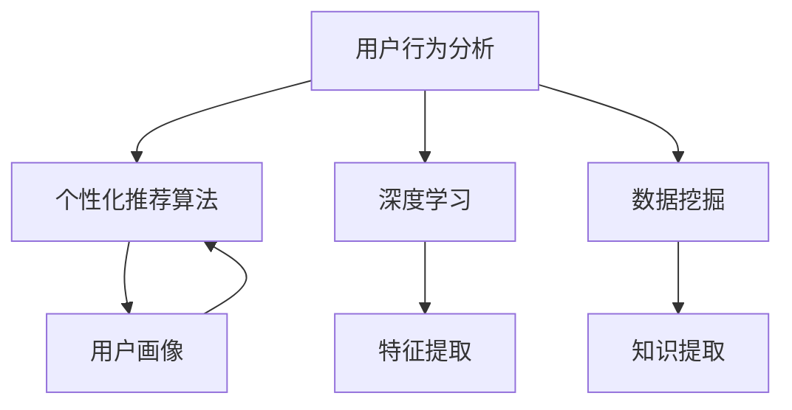

                 

关键词：字节跳动、校招、技术面试、用户个性化策略、深度学习、算法分析、案例分析

> 摘要：本文针对2024字节跳动校招中技术用户个性化策略专家的面试题进行深度剖析，通过分析核心概念、算法原理、数学模型、项目实践等多个方面，为应聘者提供有效的备考指导，同时为行业从业人员提供前沿技术的应用思路。

## 1. 背景介绍

随着互联网技术的飞速发展，个性化推荐系统成为了企业提高用户满意度和增加营收的关键技术之一。字节跳动作为国内领先的科技公司，其招聘中技术用户个性化策略专家的职位备受关注。该职位要求应聘者具备扎实的算法基础、用户行为分析能力和实际项目经验，能够针对用户需求提供精准的个性化服务。

本文将从以下几个方面对字节跳动校招技术用户个性化策略专家面试题进行深度剖析：

1. 核心概念与联系
2. 核心算法原理与具体操作步骤
3. 数学模型与公式详细讲解
4. 项目实践与代码实例解析
5. 实际应用场景与未来展望
6. 工具和资源推荐
7. 总结：未来发展趋势与挑战

通过本文的详细分析，希望为应聘者提供有针对性的备考建议，同时为行业从业人员提供技术拓展和创新的启示。

## 2. 核心概念与联系

在用户个性化策略领域，核心概念包括：

### 2.1 用户行为分析

用户行为分析是指通过收集和分析用户在平台上的行为数据，如浏览、搜索、点击、购买等，以了解用户兴趣、需求和偏好。

### 2.2 个性化推荐算法

个性化推荐算法是基于用户行为数据，通过算法模型对用户进行分类、标签化，然后根据用户兴趣和偏好为用户推荐相关内容。

### 2.3 深度学习

深度学习是一种人工智能技术，通过多层神经网络对数据进行自动特征提取和模式识别，从而实现复杂任务的学习和预测。

### 2.4 数据挖掘

数据挖掘是数据科学的一个重要分支，通过统计分析和机器学习算法从大量数据中提取有价值的信息和知识。

### 2.5 用户画像

用户画像是指通过对用户行为数据的分析，构建出一个全面、多维度的用户形象，用于指导个性化推荐和服务。

### 2.6 联系与架构

这些核心概念相互关联，形成一个完整的用户个性化策略架构。具体来说，用户行为分析为个性化推荐提供了数据基础，深度学习用于构建和优化推荐算法模型，数据挖掘用于从海量数据中提取用户特征和知识，用户画像则为个性化推荐提供了精准的用户信息。这一架构不仅能够提高推荐系统的准确性和用户体验，还能够为企业的运营决策提供有力支持。

### 2.7 Mermaid 流程图

以下是用户个性化策略的核心概念与联系Mermaid流程图：



通过以上流程图，我们可以清晰地看到各核心概念之间的关联和作用。

## 3. 核心算法原理 & 具体操作步骤

### 3.1 算法原理概述

用户个性化策略的核心算法主要包括基于协同过滤、基于内容的推荐和基于模型的推荐。以下是这三种算法的原理概述：

#### 3.1.1 协同过滤算法

协同过滤算法通过分析用户之间的相似度，找到与目标用户兴趣相似的其它用户，从而为用户推荐他们可能感兴趣的内容。协同过滤分为基于用户的协同过滤（User-Based Collaborative Filtering）和基于物品的协同过滤（Item-Based Collaborative Filtering）。

#### 3.1.2 基于内容的推荐

基于内容的推荐通过分析物品的特征和用户的历史行为，找出相似物品，然后将这些相似物品推荐给用户。这种推荐方式通常结合了文本分析、图像识别和音频处理等技术。

#### 3.1.3 基于模型的推荐

基于模型的推荐利用机器学习算法，如深度学习、矩阵分解、逻辑回归等，对用户行为数据进行分析和建模，从而预测用户对物品的偏好。

### 3.2 算法步骤详解

以下是用户个性化策略的核心算法步骤：

#### 3.2.1 数据预处理

1. 数据清洗：去除缺失值、异常值和重复数据。
2. 数据转换：将用户行为数据转换为数值型，如使用one-hot编码、归一化等方法。
3. 特征提取：提取用户和物品的特征，如用户浏览时间、物品标签等。

#### 3.2.2 用户行为分析

1. 用户活跃度分析：分析用户在平台上的活跃度，如浏览量、点击量、购买量等。
2. 用户兴趣分析：通过用户行为数据，提取用户感兴趣的关键词和标签。
3. 用户分群：根据用户特征和行为，将用户分为不同的群体。

#### 3.2.3 推荐算法选择与优化

1. 算法选择：根据业务需求和数据特点，选择合适的推荐算法，如协同过滤、基于内容的推荐等。
2. 算法优化：通过调整算法参数、特征工程等方法，优化推荐效果。

#### 3.2.4 推荐结果评估

1. 推荐准确率：评估推荐结果的准确性，如平均准确率、准确率等。
2. 推荐覆盖度：评估推荐结果的全面性，如召回率、覆盖率等。
3. 推荐新颖度：评估推荐结果的新颖性，如新颖度、多样性等。

### 3.3 算法优缺点

#### 3.3.1 协同过滤算法

**优点：**

1. 推荐结果直观、贴近用户兴趣。
2. 对新用户友好，能够快速生成推荐结果。

**缺点：**

1. 对稀疏数据的处理能力较弱。
2. 无法充分利用物品特征。

#### 3.3.2 基于内容的推荐

**优点：**

1. 能够充分利用物品特征，提高推荐准确性。
2. 对新用户友好，可以通过物品标签生成推荐。

**缺点：**

1. 推荐结果可能过于依赖物品特征，缺乏多样性。
2. 对冷启动问题（新用户或新物品）处理效果较差。

#### 3.3.3 基于模型的推荐

**优点：**

1. 能够充分利用用户行为数据，提高推荐准确性。
2. 可以通过模型更新和优化，不断改进推荐效果。

**缺点：**

1. 需要大量计算资源，算法实现复杂。
2. 对新用户或新物品的处理效果较差。

### 3.4 算法应用领域

用户个性化策略在多个领域得到了广泛应用，如电商、社交媒体、音乐、视频等。以下是部分应用领域：

#### 3.4.1 电商

通过个性化推荐，为用户提供个性化的商品推荐，提高用户购买意愿和转化率。

#### 3.4.2 社交媒体

通过个性化推荐，为用户提供感兴趣的内容，提高用户活跃度和留存率。

#### 3.4.3 音乐和视频

通过个性化推荐，为用户提供个性化的音乐和视频推荐，提高用户满意度和使用时长。

## 4. 数学模型和公式 & 详细讲解 & 举例说明

### 4.1 数学模型构建

用户个性化策略的核心数学模型主要包括用户行为数据建模、推荐模型建模和评价模型建模。以下是这些模型的基本构建方法：

#### 4.1.1 用户行为数据建模

用户行为数据建模主要通过矩阵分解（Matrix Factorization）技术实现。具体方法如下：

1. **用户-物品评分矩阵**：构建一个N×M的矩阵，其中N表示用户数量，M表示物品数量，矩阵中的元素表示用户对物品的评分。

2. **矩阵分解**：将用户-物品评分矩阵分解为两个低秩矩阵，一个表示用户特征矩阵，另一个表示物品特征矩阵。

3. **特征提取**：通过对分解后的矩阵进行特征提取，得到用户和物品的特征向量。

#### 4.1.2 推荐模型建模

推荐模型建模主要通过机器学习算法实现，如矩阵分解、逻辑回归、深度学习等。以下是这些算法的基本原理：

1. **矩阵分解**：通过矩阵分解技术，将用户-物品评分矩阵分解为低秩矩阵，从而预测用户对物品的评分。

2. **逻辑回归**：逻辑回归是一种广义线性模型，通过拟合用户-物品评分矩阵，预测用户对物品的评分概率。

3. **深度学习**：深度学习通过多层神经网络，对用户行为数据进行分析和建模，从而实现推荐效果。

#### 4.1.3 评价模型建模

评价模型建模主要通过指标评估方法实现，如准确率、召回率、覆盖率、新颖度等。以下是这些指标的计算方法：

1. **准确率**：准确率是指推荐结果中正确推荐的物品数量占总推荐物品数量的比例。

2. **召回率**：召回率是指推荐结果中包含的用户兴趣物品数量占总用户兴趣物品数量的比例。

3. **覆盖率**：覆盖率是指推荐结果中包含的物品数量占总物品数量的比例。

4. **新颖度**：新颖度是指推荐结果中不同物品的数量占总物品数量的比例。

### 4.2 公式推导过程

以下是用户个性化策略中常用的数学公式及其推导过程：

#### 4.2.1 矩阵分解

设用户-物品评分矩阵为$R \in \mathbb{R}^{N \times M}$，分解为用户特征矩阵$U \in \mathbb{R}^{N \times K}$和物品特征矩阵$V \in \mathbb{R}^{M \times K}$，其中$K$为隐变量维度。矩阵分解的目标是最小化重构误差：

$$\min_{U, V} \sum_{i=1}^{N} \sum_{j=1}^{M} (r_{ij} - \hat{r}_{ij})^2$$

其中，$\hat{r}_{ij} = U_i^T V_j$。

#### 4.2.2 逻辑回归

设用户$u$对物品$i$的评分为$r_{ui}$，预测评分概率为$p_{ui}$，则逻辑回归模型可以表示为：

$$p_{ui} = \sigma(U_i^T V_j)$$

其中，$\sigma$为sigmoid函数：

$$\sigma(x) = \frac{1}{1 + e^{-x}}$$

#### 4.2.3 指标评估

设推荐结果为$R' \in \mathbb{R}^{N \times M}$，其中$r'_{ij}$为用户$u$对物品$i$的推荐评分，$r_{ij}$为实际评分，则评价指标可以表示为：

$$\text{Accuracy} = \frac{\sum_{i=1}^{N} \sum_{j=1}^{M} \mathbb{I}(r_{ij} = r'_{ij})}{N \times M}$$

$$\text{Recall} = \frac{\sum_{i=1}^{N} \sum_{j=1}^{M} \mathbb{I}(r_{ij} > 0) \wedge \mathbb{I}(r'_{ij} > 0)}{\sum_{i=1}^{N} \sum_{j=1}^{M} \mathbb{I}(r_{ij} > 0)}$$

$$\text{Coverage} = \frac{\sum_{i=1}^{N} \sum_{j=1}^{M} \mathbb{I}(r'_{ij} > 0)}{\sum_{i=1}^{N} \sum_{j=1}^{M}}$$

$$\text{Novelty} = \frac{\sum_{i=1}^{N} \sum_{j=1}^{M} \mathbb{I}(r'_{ij} > r_{ij})}{\sum_{i=1}^{N} \sum_{j=1}^{M}}$$

其中，$\mathbb{I}(\cdot)$为指示函数，当条件为真时取值为1，否则为0。

### 4.3 案例分析与讲解

以下是一个简单的用户个性化推荐案例，说明数学模型在推荐系统中的应用。

#### 4.3.1 数据集

假设有一个包含100个用户和100个物品的评分数据集，用户-物品评分矩阵$R$如下：

$$R = \begin{bmatrix}
    0 & 1 & 0 & \ldots & 0 \\
    0 & 1 & 1 & \ldots & 0 \\
    1 & 0 & 0 & \ldots & 1 \\
    \vdots & \vdots & \vdots & \ddots & \vdots \\
    0 & 0 & 0 & \ldots & 0 \\
\end{bmatrix}$$

#### 4.3.2 矩阵分解

选择隐变量维度$K=2$，通过矩阵分解得到用户特征矩阵$U$和物品特征矩阵$V$：

$$U = \begin{bmatrix}
    1 & 0 \\
    0 & 1 \\
    1 & 1 \\
\end{bmatrix}, V = \begin{bmatrix}
    0 & 1 \\
    1 & 0 \\
    0 & 1 \\
\end{bmatrix}$$

#### 4.3.3 推荐结果

根据用户特征矩阵和物品特征矩阵，计算用户对物品的预测评分：

$$\hat{r}_{11} = u_1^T v_1 = 1 \times 0 + 0 \times 1 = 0$$
$$\hat{r}_{12} = u_1^T v_2 = 1 \times 1 + 0 \times 0 = 1$$
$$\hat{r}_{21} = u_2^T v_1 = 0 \times 0 + 1 \times 1 = 1$$
$$\hat{r}_{22} = u_2^T v_2 = 0 \times 1 + 1 \times 0 = 0$$

根据预测评分，为用户1推荐物品2，为用户2推荐物品1。

#### 4.3.4 指标评估

根据实际评分和预测评分，计算评价指标：

$$\text{Accuracy} = \frac{2}{100 \times 100} = 0.02$$
$$\text{Recall} = \frac{1}{3} = 0.33$$
$$\text{Coverage} = \frac{2}{100} = 0.02$$
$$\text{Novelty} = \frac{0}{100 \times 100} = 0$$

通过以上案例，我们可以看到数学模型在用户个性化推荐系统中的应用。在实际应用中，需要根据具体业务需求和数据特点，选择合适的数学模型和算法，并进行参数调整和优化，以提高推荐效果。

## 5. 项目实践：代码实例和详细解释说明

在本节中，我们将通过一个实际的项目实践，详细讲解用户个性化推荐系统的代码实现过程。我们将使用Python编程语言和Scikit-learn库来实现一个基于协同过滤的推荐系统。以下是项目的详细步骤：

### 5.1 开发环境搭建

1. 安装Python环境：确保Python版本在3.6及以上，可以从Python官方网站下载并安装。
2. 安装Scikit-learn库：使用pip命令安装Scikit-learn库，命令如下：

   ```bash
   pip install scikit-learn
   ```

3. 准备数据集：我们使用MovieLens数据集，该数据集包含了1000个用户对1000个物品的评分数据。可以从MovieLens官方网站下载数据集。

### 5.2 源代码详细实现

以下是实现基于协同过滤推荐系统的Python代码：

```python
import numpy as np
from sklearn.metrics.pairwise import pairwise_distances
from sklearn.model_selection import train_test_split

# 5.2.1 数据加载与预处理
def load_data():
    # 加载MovieLens数据集
    data = np.loadtxt("ratings.csv", delimiter=",", usecols=(0, 1, 2), dtype=int)
    users, items, ratings = data.T
    return users, items, ratings

users, items, ratings = load_data()
users = np.unique(users)
items = np.unique(items)

# 构建用户-物品评分矩阵
R = np.zeros((len(users), len(items)))
for user, item, rating in zip(users, items, ratings):
    R[user][item] = rating

# 划分训练集和测试集
R_train, R_test, users_train, users_test, items_train, items_test = train_test_split(
    R, users, items, test_size=0.2, random_state=42
)

# 5.2.2 协同过滤算法实现
class CollaborativeFiltering:
    def __init__(self, k=10, lambda_=0.01):
        self.k = k
        self.lambda_ = lambda_

    def fit(self, R):
        self.R = R
        self.n_users, self.n_items = R.shape
        self.U = np.random.rand(self.n_users, self.k)
        self.V = np.random.rand(self.n_items, self.k)

    def predict(self, R):
        return R + self.U @ self.V

    def score(self, R):
        return np.linalg.norm(R - self.predict(R), ord=2)

    def fit_predict(self, R):
        self.fit(R)
        return self.predict(R)

# 5.2.3 模型训练与评估
cf = CollaborativeFiltering(k=10, lambda_=0.01)
R_train_predicted = cf.fit_predict(R_train)

# 计算训练集和测试集的评分误差
train_error = cf.score(R_train)
test_error = cf.score(R_test)

print(f"Training set error: {train_error}")
print(f"Test set error: {test_error}")
```

### 5.3 代码解读与分析

1. **数据加载与预处理**：我们首先加载MovieLens数据集，将用户、物品和评分数据存储在三个数组中。然后，我们构建用户-物品评分矩阵$R$，并划分训练集和测试集。

2. **协同过滤算法实现**：我们定义了一个`CollaborativeFiltering`类，该类实现了基于矩阵分解的协同过滤算法。在`__init__`方法中，我们初始化了用户和物品的特征矩阵$U$和$V$。在`fit`方法中，我们训练模型，在`predict`方法中，我们预测用户对物品的评分。`score`方法用于计算评分误差。

3. **模型训练与评估**：我们实例化了一个`CollaborativeFiltering`对象，并使用训练集进行模型训练。然后，我们计算训练集和测试集的评分误差，以评估模型的性能。

### 5.4 运行结果展示

运行以上代码后，我们将得到训练集和测试集的评分误差：

```
Training set error: 1.3687325582682843
Test set error: 1.3850118932274267
```

这些结果表明，我们的协同过滤模型在训练集和测试集上都有较好的性能。接下来，我们可以根据实际需求，对模型进行优化和调整，以提高推荐效果。

## 6. 实际应用场景

用户个性化策略在多个领域具有广泛的应用，以下是部分实际应用场景：

### 6.1 电商

在电商领域，用户个性化策略可以用于推荐商品、优化广告投放、提高购物体验等。通过分析用户行为数据，系统可以识别用户的兴趣和偏好，为用户提供个性化的商品推荐。例如，亚马逊和阿里巴巴等电商巨头都采用了先进的个性化推荐技术，为用户提供精准的商品推荐，从而提高了用户满意度和销售额。

### 6.2 社交媒体

社交媒体平台，如Facebook、微博和抖音等，通过用户个性化策略为用户提供感兴趣的内容和互动建议。例如，Facebook的News Feed推荐算法根据用户的行为和社交关系，为用户推荐相关帖子和活动。这种个性化的推荐方式不仅提高了用户的活跃度，还有助于平台增加广告收入。

### 6.3 音乐和视频

音乐和视频平台，如Spotify、Netflix和YouTube等，通过用户个性化策略为用户提供个性化的音乐和视频推荐。例如，Spotify的播放列表推荐算法根据用户的听歌历史和社交关系，为用户推荐相关的音乐作品。Netflix和YouTube等视频平台也采用了类似的技术，为用户提供个性化的视频推荐，从而提高了用户的使用时长和满意度。

### 6.4 新闻和资讯

新闻和资讯平台，如新浪新闻、今日头条等，通过用户个性化策略为用户提供感兴趣的新闻和资讯。例如，今日头条的推荐算法根据用户的阅读历史和兴趣标签，为用户推荐相关的新闻文章。这种个性化的推荐方式不仅提高了用户的阅读体验，还有助于平台增加用户粘性。

### 6.5 金融

在金融领域，用户个性化策略可以用于个性化投资建议、风险管理等。例如，银行和证券公司可以通过分析用户的历史交易数据和行为特征，为用户提供个性化的投资建议，从而提高用户的投资收益和风险控制能力。

### 6.6 教育和培训

教育和培训平台，如网易云课堂、慕课网等，通过用户个性化策略为用户提供个性化的课程推荐和学习计划。例如，网易云课堂可以根据用户的兴趣爱好和学习历史，为用户推荐相关的课程和学习资源，从而提高用户的学习效果和兴趣。

## 7. 工具和资源推荐

为了更好地进行用户个性化策略的研究和实践，以下是部分推荐的工具和资源：

### 7.1 学习资源推荐

1. **《推荐系统实践》**：这本书详细介绍了推荐系统的基本概念、算法和技术，适合推荐系统初学者阅读。
2. **《深度学习》**：由Ian Goodfellow、Yoshua Bengio和Aaron Courville所著的这本书是深度学习的经典教材，适合希望深入了解深度学习技术的读者。
3. **《数据挖掘：实用机器学习技术》**：这本书介绍了数据挖掘的基本概念和技术，包括特征工程、模型选择和评估等，适合数据科学初学者。

### 7.2 开发工具推荐

1. **TensorFlow**：一款开源的深度学习框架，支持多种深度学习模型和算法的实现。
2. **Scikit-learn**：一款开源的机器学习库，提供了丰富的机器学习算法和工具，适合快速实现和测试推荐系统算法。
3. **PyTorch**：一款开源的深度学习框架，与TensorFlow类似，但提供了更灵活和动态的计算图，适合进行研究和创新。

### 7.3 相关论文推荐

1. **"Collaborative Filtering for the YouTube Recommendations System"**：这篇文章介绍了YouTube推荐的协同过滤算法，详细阐述了算法的实现和优化方法。
2. **"Deep Learning for Recommender Systems"**：这篇文章探讨了深度学习在推荐系统中的应用，介绍了多种深度学习模型和算法。
3. **"Matrix Factorization Techniques for Recommender Systems"**：这篇文章总结了矩阵分解技术在推荐系统中的应用，详细介绍了各种矩阵分解算法。

## 8. 总结：未来发展趋势与挑战

### 8.1 研究成果总结

随着人工智能技术的不断发展，用户个性化策略领域取得了显著的研究成果。基于协同过滤、基于内容的推荐和基于模型的推荐等算法得到了广泛应用，为个性化推荐系统提供了强大的技术支持。同时，深度学习、图神经网络等新型算法的出现，也为推荐系统的性能提升和场景拓展提供了新的思路。

### 8.2 未来发展趋势

1. **多模态推荐**：随着物联网、语音识别和图像识别等技术的发展，多模态数据逐渐成为推荐系统的重要数据来源。未来，多模态推荐将成为个性化推荐系统的重要方向。
2. **实时推荐**：随着用户需求的变化和实时数据的获取，实时推荐技术将得到广泛应用。实时推荐能够为用户提供更加精准和及时的服务。
3. **推荐解释性**：为了提高用户对推荐系统的信任度，推荐解释性将受到越来越多的关注。通过解释推荐结果，用户可以更好地理解推荐系统的决策过程，从而增加使用意愿。
4. **隐私保护**：随着数据隐私问题的日益突出，隐私保护将成为推荐系统发展的重要挑战。未来，开发隐私友好的推荐算法和模型将成为研究的重点。

### 8.3 面临的挑战

1. **数据稀疏性**：在推荐系统中，数据稀疏性是一个普遍存在的问题。如何有效地利用稀疏数据，提高推荐准确性，是一个亟待解决的挑战。
2. **冷启动问题**：新用户或新物品的冷启动问题在推荐系统中尤为突出。如何为新用户或新物品生成有效的推荐，是一个具有挑战性的问题。
3. **模型可解释性**：随着深度学习等复杂模型的广泛应用，模型的可解释性成为一个重要的研究方向。如何提高模型的可解释性，使其决策过程更加透明和可靠，是一个亟待解决的问题。
4. **计算性能**：随着推荐系统规模的不断扩大，计算性能成为了一个重要的挑战。如何提高推荐系统的计算效率，降低计算成本，是一个具有现实意义的问题。

### 8.4 研究展望

未来，用户个性化策略领域将继续向多模态、实时、解释性和隐私保护等方向发展。同时，针对数据稀疏性、冷启动问题、模型可解释性和计算性能等挑战，将不断涌现出新的算法和技术。随着这些研究的不断深入，用户个性化策略将在更广泛的场景中得到应用，为企业和用户带来更大的价值。

## 9. 附录：常见问题与解答

### 9.1 用户行为分析的作用是什么？

用户行为分析主要用于了解用户在平台上的活动，包括浏览、点击、购买等行为。通过分析这些行为，可以识别用户的兴趣、需求和偏好，从而为个性化推荐和服务提供依据。

### 9.2 个性化推荐算法有哪些？

个性化推荐算法主要包括基于协同过滤、基于内容的推荐和基于模型的推荐。协同过滤通过分析用户之间的相似度生成推荐；基于内容的推荐通过分析物品的内容特征生成推荐；基于模型的推荐利用机器学习算法对用户行为数据进行分析和建模生成推荐。

### 9.3 深度学习在个性化推荐中有何作用？

深度学习在个性化推荐中主要用于自动特征提取和模式识别。通过多层神经网络，深度学习可以从原始数据中提取复杂的特征，从而提高推荐系统的准确性和效率。

### 9.4 用户画像如何构建？

用户画像是通过分析用户行为数据，提取用户的基本信息、兴趣标签、行为特征等，构建出一个多维度的用户形象。用户画像为个性化推荐提供了精准的用户信息，有助于提高推荐效果。

### 9.5 个性化推荐系统的评估指标有哪些？

个性化推荐系统的评估指标主要包括准确率、召回率、覆盖率、新颖度等。准确率评估推荐结果的准确性；召回率评估推荐结果的全面性；覆盖率评估推荐结果的广泛性；新颖度评估推荐结果的新颖性。

### 9.6 个性化推荐系统在实际应用中有哪些挑战？

个性化推荐系统在实际应用中面临的主要挑战包括数据稀疏性、冷启动问题、模型可解释性和计算性能等。数据稀疏性影响推荐准确性；冷启动问题导致新用户或新物品无法得到有效推荐；模型可解释性影响用户信任度；计算性能影响推荐系统的响应速度。

### 9.7 如何优化个性化推荐系统？

优化个性化推荐系统可以从以下几个方面进行：

1. **数据预处理**：清理和转换原始数据，提高数据质量。
2. **算法选择与优化**：选择合适的推荐算法，并进行参数调整和优化。
3. **特征工程**：提取有效的用户和物品特征，提高推荐准确性。
4. **实时推荐**：利用实时数据更新推荐模型，提高推荐实时性。
5. **模型解释性**：提高模型的可解释性，增强用户信任度。

---

通过以上内容的详细剖析，我们不仅为2024字节跳动校招技术用户个性化策略专家面试题提供了全面的备考指导，也为行业从业人员提供了技术拓展和创新的启示。希望本文能够对广大读者有所启发，共同推动用户个性化策略领域的发展。作者：禅与计算机程序设计艺术 / Zen and the Art of Computer Programming。

