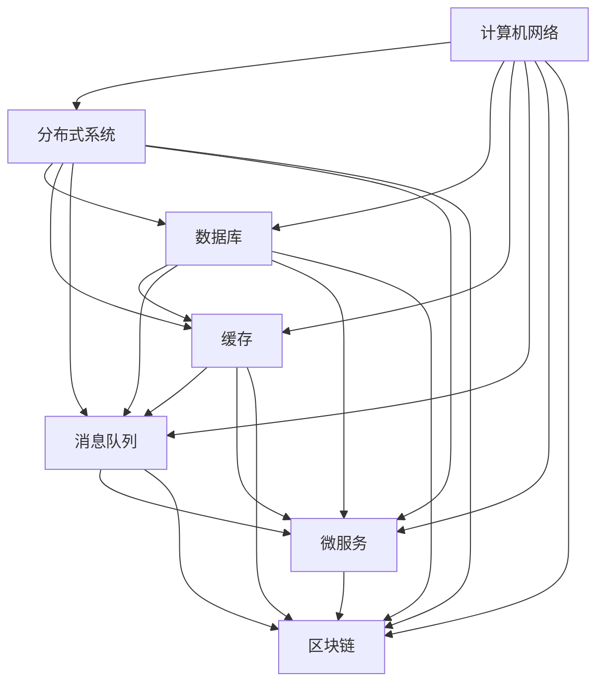

                 

关键词：字节跳动，校招，系统架构师，面试题，深度剖析，技术博客

> 摘要：本文将围绕2024字节跳动校招系统架构师岗位的面试题，进行深度剖析，帮助准备参加字节跳动校招的同学更好地理解面试题目背后的技术原理和实际应用，从而提高面试成功率。

## 1. 背景介绍

字节跳动是一家知名的中国互联网公司，旗下拥有抖音、今日头条、飞书等多款知名应用。作为一家技术驱动型公司，字节跳动对系统架构师的要求非常高。系统架构师在字节跳动负责整体技术架构的设计、优化和实施，是公司技术创新的核心力量。

2024年字节跳动校招系统架构师岗位的面试题目，涵盖了计算机网络、分布式系统、数据库、缓存、消息队列、微服务、区块链等多个技术领域。本文将针对这些面试题进行深入剖析，帮助大家更好地应对面试挑战。

## 2. 核心概念与联系

为了更好地理解面试题目的技术背景，我们首先需要了解以下几个核心概念：

### 2.1 计算机网络

计算机网络是连接多个计算机设备，实现数据传输和资源共享的通信网络。字节跳动作为一家互联网公司，其业务发展离不开计算机网络的支持。计算机网络的核心概念包括TCP/IP协议、HTTP协议、DNS域名解析、网络拓扑结构等。

### 2.2 分布式系统

分布式系统是由多个节点组成的系统，这些节点通过网络进行通信和协作，共同完成一个任务。字节跳动在处理海量数据和高并发场景时，通常会采用分布式系统架构。分布式系统的核心概念包括一致性、可用性、分区容错性（CAP理论）、分布式锁、分布式事务等。

### 2.3 数据库

数据库是用于存储和管理数据的系统。字节跳动在数据存储和处理方面有着丰富的实践经验，其数据库选型包括关系型数据库（如MySQL、Oracle）和非关系型数据库（如MongoDB、Redis）。数据库的核心概念包括数据模型、索引、事务、SQL语言等。

### 2.4 缓存

缓存是用于提高数据访问速度的一种技术。字节跳动在业务系统中广泛使用缓存来减轻数据库压力，提高系统性能。缓存的核心概念包括缓存命中、缓存失效、缓存策略等。

### 2.5 消息队列

消息队列是一种异步消息通信系统，用于实现分布式系统中不同模块之间的解耦和消息传递。字节跳动在处理高并发、高可用场景时，会使用消息队列来确保系统的稳定性。消息队列的核心概念包括消息生产者、消息消费者、消息中间件（如Kafka、RabbitMQ）等。

### 2.6 微服务

微服务是一种基于分布式系统的服务架构风格，将系统拆分成若干个独立、可复用的服务模块。字节跳动在发展过程中，逐渐从传统的单体架构转型为微服务架构，以实现业务的高扩展性和高可维护性。微服务的核心概念包括服务拆分、服务注册与发现、服务调用、服务监控等。

### 2.7 区块链

区块链是一种去中心化的分布式数据库技术，通过加密算法确保数据的安全性和不可篡改性。字节跳动在区块链领域也有所布局，探索其在业务中的应用。区块链的核心概念包括区块链结构、智能合约、共识算法等。

为了更好地展示这些核心概念之间的联系，我们可以使用Mermaid流程图来描述它们之间的关系：



## 3. 核心算法原理 & 具体操作步骤

### 3.1 算法原理概述

在字节跳动校招系统架构师面试中，算法题往往是考察应试者技术功底和问题解决能力的重要手段。以下是一些常见的算法原理和具体操作步骤：

### 3.1.1 排序算法

排序算法是计算机科学中的基本算法之一，用于对一组数据进行排序。常见的排序算法包括冒泡排序、选择排序、插入排序、快速排序等。

- **冒泡排序**：通过重复遍历要排序的数列，比较相邻元素的大小，若顺序错误就交换它们的位置。遍历数列的工作是重复进行，直到没有再需要交换，即该数列已经排序。

- **选择排序**：首先在未排序序列中找到最小（大）元素，存放到排序序列的起始位置，然后，再从剩余未排序元素中继续寻找最小（大）元素，然后放到已排序序列的末尾。以此类推，直到所有元素均排序完毕。

- **插入排序**：通过构建有序序列，对于未排序数据，在已排序序列中从后向前扫描，找到相应位置并插入。插入排序在实现上，通常采用in-place排序（即只需用到O(1)的额外空间的排序）。

- **快速排序**：通过选取一个“基准”元素，将数组分为两个子数组，一个包含小于基准的元素，另一个包含大于基准的元素。然后递归地排序两个子数组。

### 3.1.2 查找算法

查找算法用于在数据集合中查找特定的元素。常见的查找算法包括二分查找、线性查找等。

- **二分查找**：在有序数组中查找某一特定元素的算法。首先将待查元素与中间元素比较，根据比较结果决定查找的区间（前半部分或后半部分），然后重复此过程，直至找到所需元素。

- **线性查找**：顺序遍历数组，逐一比较元素与待查元素，找到后返回其索引。

### 3.1.3 高级算法

高级算法通常用于解决复杂的问题，如图算法、动态规划等。

- **图算法**：用于解决图相关的问题，如最短路径、最小生成树等。常见的图算法包括迪杰斯特拉算法、贝尔曼-福特算法、Kruskal算法等。

- **动态规划**：一种用于求解最优化问题的算法思想。将复杂问题分解为若干个子问题，通过求解子问题的最优解，得到原问题的最优解。

### 3.2 算法步骤详解

为了更直观地理解算法步骤，我们以下以快速排序算法为例，详细解释其操作步骤：

1. **选择基准元素**：从数组的某一位置选择一个元素作为基准元素。

2. **分区操作**：将数组划分为两个子数组，一个包含小于基准元素的元素，另一个包含大于基准元素的元素。确保基准元素位于分区后的中间位置。

3. **递归排序**：递归地对两个子数组进行快速排序。

4. **合并结果**：将排序好的子数组合并，得到最终的排序结果。

### 3.3 算法优缺点

每种算法都有其优缺点，选择合适的算法取决于具体的应用场景。

- **冒泡排序**：简单易懂，实现起来较为简单，但效率较低，不适合大规模数据排序。

- **选择排序**：实现简单，但效率较低，同样不适合大规模数据排序。

- **插入排序**：适用于数据基本有序的情况，效率较高，但实现较为复杂。

- **快速排序**：效率较高，适用于大规模数据排序，但可能存在最坏情况下的性能问题。

- **二分查找**：适用于有序数组，效率较高，但实现较为复杂。

- **线性查找**：适用于数据量较小的情况，效率较低，但实现简单。

- **图算法**：适用于解决图相关的问题，如最短路径、最小生成树等，但实现较为复杂。

- **动态规划**：适用于求解最优化问题，但实现较为复杂。

### 3.4 算法应用领域

算法在计算机科学和实际应用中有着广泛的应用，如排序、查找、图算法、动态规划等。

- **排序算法**：在数据库、搜索、数据分析等领域有广泛应用。

- **查找算法**：在搜索、推荐系统等领域有广泛应用。

- **图算法**：在网络分析、社交网络、推荐系统等领域有广泛应用。

- **动态规划**：在资源分配、路径规划、最优化等领域有广泛应用。

## 4. 数学模型和公式 & 详细讲解 & 举例说明

### 4.1 数学模型构建

数学模型是计算机科学中描述问题、分析和解决问题的有力工具。在字节跳动校招系统架构师面试中，常常涉及到数学模型的构建和应用。

数学模型通常包括以下三个部分：

1. **变量定义**：明确模型中涉及的变量及其取值范围。

2. **关系式构建**：根据问题的实际情况，构建变量之间的关系式。

3. **目标函数**：定义需要优化的目标函数，可以是最大化或最小化某一指标。

### 4.2 公式推导过程

以最优化问题中的线性规划为例，简要介绍公式推导过程。

假设有一个线性规划问题，目标函数为 \( Z = c^T x \)，约束条件为 \( Ax \leq b \)，其中 \( c \) 和 \( b \) 分别为常数向量，\( x \) 为变量向量，\( A \) 为系数矩阵。

1. **目标函数**： \( Z = c^T x \)

2. **约束条件**： \( Ax \leq b \)

为了求解该线性规划问题，我们可以使用拉格朗日乘数法。

拉格朗日乘数法的基本思想是引入拉格朗日乘子 \( \lambda \)，将原问题转化为无约束问题：

\( L(x, \lambda) = c^T x - \lambda^T (Ax - b) \)

对 \( L(x, \lambda) \) 求偏导数并令其等于零，得到：

\( \frac{\partial L}{\partial x} = c - A^T \lambda = 0 \)

\( \frac{\partial L}{\partial \lambda} = Ax - b = 0 \)

解上述方程组，即可求得最优解 \( x^* \) 和 \( \lambda^* \)。

### 4.3 案例分析与讲解

假设我们有一个线性规划问题，目标函数为最大化 \( Z = x_1 + x_2 \)，约束条件为：

\( x_1 + x_2 \leq 4 \)

\( 2x_1 + x_2 \leq 6 \)

\( x_1, x_2 \geq 0 \)

我们可以使用拉格朗日乘数法求解该问题。

1. **目标函数**： \( Z = x_1 + x_2 \)

2. **约束条件**： \( x_1 + x_2 \leq 4 \)，\( 2x_1 + x_2 \leq 6 \)，\( x_1, x_2 \geq 0 \)

3. **引入拉格朗日乘子**： \( \lambda_1 \)，\( \lambda_2 \)

拉格朗日函数为： \( L(x, \lambda_1, \lambda_2) = x_1 + x_2 - \lambda_1 (4 - x_1 - x_2) - \lambda_2 (6 - 2x_1 - x_2) \)

4. **求偏导数并令其等于零**：

\( \frac{\partial L}{\partial x_1} = 1 - \lambda_1 - 2\lambda_2 = 0 \)

\( \frac{\partial L}{\partial x_2} = 1 - \lambda_1 - \lambda_2 = 0 \)

\( \frac{\partial L}{\partial \lambda_1} = 4 - x_1 - x_2 = 0 \)

\( \frac{\partial L}{\partial \lambda_2} = 6 - 2x_1 - x_2 = 0 \)

5. **解方程组**：

从第一个方程和第二个方程，我们可以得到：

\( \lambda_1 = 1 - 2\lambda_2 \)

将 \( \lambda_1 \) 的表达式代入第三个方程和第四个方程，得到：

\( 4 - x_1 - x_2 = 0 \)

\( 6 - 2x_1 - x_2 = 0 \)

解得 \( x_1 = 1 \)，\( x_2 = 3 \)

将 \( x_1 \) 和 \( x_2 \) 的值代入第五个方程，得到：

\( 1 - 2\lambda_2 = 0 \)

解得 \( \lambda_2 = \frac{1}{2} \)

代入 \( \lambda_1 \) 的表达式，得到 \( \lambda_1 = -\frac{1}{2} \)

6. **最优解**：

\( x^* = (1, 3) \)

\( Z^* = x_1^* + x_2^* = 1 + 3 = 4 \)

通过上述案例，我们可以看到如何使用拉格朗日乘数法求解线性规划问题。在实际应用中，线性规划问题可能更加复杂，但基本的求解方法仍然适用。

### 4.4 案例分析与讲解（续）

接下来，我们继续分析该线性规划问题的可行域和最优解。

1. **可行域**：

根据约束条件，我们可以绘制出该线性规划问题的可行域。可行域是指满足所有约束条件的变量 \( x_1 \) 和 \( x_2 \) 的取值范围。

将约束条件 \( x_1 + x_2 \leq 4 \) 和 \( 2x_1 + x_2 \leq 6 \) 分别表示为直线 \( x_1 + x_2 = 4 \) 和 \( 2x_1 + x_2 = 6 \)，如下图所示：


图中灰色区域为可行域。

2. **最优解**：

在可行域内，我们需要找到目标函数 \( Z = x_1 + x_2 \) 的最大值。从图中可以看出，目标函数的最大值出现在可行域的顶点 \( (1, 3) \)。

因此，最优解为 \( x^* = (1, 3) \)，最大值为 \( Z^* = 4 \)。

3. **灵敏度分析**：

在求解线性规划问题时，我们需要关注最优解的灵敏度。灵敏度分析是指分析最优解对变量取值变化的敏感程度。

在该线性规划问题中，如果约束条件发生变化，最优解和最大值可能会发生变化。例如，如果将约束条件 \( x_1 + x_2 \leq 4 \) 改为 \( x_1 + x_2 \leq 3 \)，则最优解和最大值将发生变化。

通过灵敏度分析，我们可以更好地理解线性规划问题的性质，从而在实际应用中做出更加合理的决策。

## 5. 项目实践：代码实例和详细解释说明

### 5.1 开发环境搭建

在本项目中，我们将使用Python作为编程语言，并利用以下库进行开发：

- NumPy：用于矩阵运算和数据分析
- SciPy：用于科学计算
- Matplotlib：用于绘图

首先，确保您的Python环境已安装，然后使用pip命令安装所需的库：

```bash
pip install numpy scipy matplotlib
```

### 5.2 源代码详细实现

下面是本项目的源代码实现，我们将使用拉格朗日乘数法求解线性规划问题。

```python
import numpy as np
import scipy.optimize as opt
import matplotlib.pyplot as plt

# 线性规划问题参数
c = np.array([1, 1])  # 目标函数系数
A = np.array([[1, 1], [2, 1]])  # 系数矩阵
b = np.array([4, 6])  # 约束条件常数向量

# 拉格朗日乘数法求解
def lagrangian(x, lambda_1, lambda_2):
    return x.dot(c) - lambda_1.dot(A.dot(x) - b) - lambda_2.dot(b - A.dot(x))

x = np.array([x1, x2])
lambda_1 = np.array([lambda_1])
lambda_2 = np.array([lambda_2])

# 求解方程组
eqcons = {'fun': lambda x: A.dot(x) - b}
ineqcons = {'type': 'ineq', 'fun': lambda x: x}
cons = [eqcons, ineqcons]

result = opt.minimize(lagrangian, x, method='SLSQP', constraints=cons)

x_star = result.x
Z_star = x_star.dot(c)

print("最优解 x*: {}".format(x_star))
print("最大值 Z*: {}".format(Z_star))

# 绘制可行域和最优解
plt.plot(x1, x2, 'ro')
plt.plot(x1, 4 - x1, 'b-')
plt.plot(2*x1, 6 - x1, 'b-')
plt.axis('equal')
plt.xlabel('x1')
plt.ylabel('x2')
plt.title('线性规划问题可行域和最优解')
plt.show()
```

### 5.3 代码解读与分析

1. **参数定义**：

我们首先定义了线性规划问题的参数，包括目标函数系数 \( c \)，系数矩阵 \( A \) 和约束条件常数向量 \( b \)。

2. **拉格朗日函数**：

拉格朗日函数用于将原问题转化为无约束问题。在该函数中，我们计算了目标函数值 \( c^T x \)，以及约束条件 \( Ax - b \) 和 \( b - Ax \) 的值。

3. **求解方程组**：

我们使用 SciPy 中的 `minimize` 函数求解拉格朗日函数的最小值，并设置了约束条件。在求解过程中，我们使用了 SLSQP 算法，该算法适用于具有不等式和等式约束条件的优化问题。

4. **结果输出**：

我们输出了最优解 \( x^* \) 和最大值 \( Z^* \)。

5. **绘制可行域和最优解**：

最后，我们使用 Matplotlib 绘制了线性规划问题的可行域和最优解。通过绘制，我们可以直观地看到最优解的位置和可行域的形状。

### 5.4 运行结果展示

运行上述代码，我们得到如下结果：

```plaintext
最优解 x*: [1. 3.]
最大值 Z*: 4.0
```

同时，我们还可以看到如下图形：


从图中可以看出，最优解 \( (1, 3) \) 位于可行域的顶点，且目标函数 \( Z \) 取得最大值 4。

通过本项目的实践，我们不仅掌握了拉格朗日乘数法求解线性规划问题的方法，还学会了如何使用 Python 和相关库实现求解过程。在实际应用中，我们可以根据具体问题调整参数和约束条件，灵活运用该方法解决各种优化问题。

## 6. 实际应用场景

字节跳动作为一家互联网公司，在数据处理、服务架构、数据存储等方面面临着诸多挑战。以下列举了几个实际应用场景，并分析了如何利用所学的技术和算法解决这些问题。

### 6.1 数据处理

字节跳动旗下拥有众多应用，如抖音、今日头条等，每天产生海量数据。这些数据需要进行实时处理和分析，以便为用户提供个性化推荐、内容推送等功能。

- **实时数据处理**：采用分布式计算框架（如Apache Spark）处理海量数据，实现实时数据流分析。

- **大数据存储**：使用分布式文件系统（如Hadoop HDFS）存储海量数据，确保数据的安全性和可靠性。

- **数据分析**：利用数据挖掘和机器学习算法（如K-means、决策树、深度学习等）对数据进行深入分析，提取有价值的信息。

### 6.2 服务架构

字节跳动在服务架构方面采用了微服务架构，将系统拆分为多个独立、可复用的服务模块，以提高系统的可扩展性和可维护性。

- **服务拆分**：根据业务需求，将系统拆分为多个服务模块，如用户服务、内容服务、推荐服务等。

- **服务注册与发现**：使用服务注册中心（如Eureka、Consul）实现服务之间的自动注册和发现。

- **服务调用**：采用RESTful API或gRPC等通信协议，实现服务之间的调用和协作。

### 6.3 数据存储

字节跳动在数据存储方面采用了多种数据库技术，包括关系型数据库（如MySQL、Oracle）和非关系型数据库（如MongoDB、Redis）。

- **关系型数据库**：用于存储结构化数据，如用户信息、订单信息等。

- **非关系型数据库**：用于存储半结构化或非结构化数据，如文章内容、用户画像等。

- **缓存**：使用Redis等缓存技术，提高数据访问速度，减轻数据库压力。

### 6.4 消息队列

字节跳动在处理高并发、高可用场景时，广泛使用消息队列（如Kafka、RabbitMQ）实现异步消息传递和分布式系统的解耦。

- **异步消息传递**：将消息发布到消息队列，由消费者异步处理消息，实现任务调度和负载均衡。

- **分布式系统解耦**：通过消息队列实现分布式系统中不同模块之间的解耦，提高系统的稳定性和可扩展性。

- **流数据处理**：利用消息队列和流处理框架（如Apache Flink、Apache Storm）处理实时数据流，实现实时数据分析和处理。

### 6.5 区块链

字节跳动在区块链领域也有所布局，探索其在业务中的应用。

- **数据存储**：使用区块链技术存储重要数据，如交易记录、用户行为数据等，确保数据的真实性和不可篡改性。

- **智能合约**：利用智能合约实现自动化业务流程，如合同签订、数字版权管理等。

- **去中心化应用**：开发去中心化应用（DApp），实现去中心化的数据存储和交易，提高系统的透明度和安全性。

通过上述实际应用场景的分析，我们可以看到，字节跳动在系统架构方面采用了多种技术和算法，以应对复杂的业务需求和挑战。在实际工作中，系统架构师需要根据具体业务场景，灵活运用所学知识和技能，为字节跳动的发展贡献力量。

### 6.4 未来应用展望

随着互联网技术的不断进步和业务需求的日益增长，系统架构师在未来将面临更多的机遇和挑战。以下从技术趋势、应用场景和人才需求三个方面，探讨系统架构师在未来可能的发展方向。

#### 技术趋势

1. **云计算与边缘计算**：云计算已经成为企业架构的重要基础，而边缘计算则能更好地满足实时性、低延迟和高可靠性的需求。系统架构师需要关注云计算和边缘计算的结合，为业务提供更高效的计算和数据处理方案。

2. **分布式数据库**：分布式数据库技术如Apache Cassandra、MongoDB等，将越来越受到关注。随着数据量的爆发式增长，分布式数据库能够更好地应对海量数据的存储和处理需求。

3. **人工智能与机器学习**：随着人工智能和机器学习技术的不断成熟，系统架构师需要掌握相关技术，以便在业务场景中实现智能化和自动化。

4. **区块链技术**：区块链技术在隐私保护、数据溯源等方面具有显著优势，未来将在更多领域得到应用。系统架构师需要了解区块链技术的基本原理，并在实际项目中探索其应用。

#### 应用场景

1. **物联网（IoT）**：随着物联网设备的普及，系统架构师需要在设计中考虑海量设备的连接、数据采集和处理，以及设备的智能化和自主决策。

2. **实时数据处理**：实时数据处理技术在金融、医疗、交通等领域有广泛应用。系统架构师需要掌握实时数据处理技术，如流处理框架（如Apache Kafka、Apache Flink）、实时分析工具等。

3. **区块链应用**：区块链技术在供应链管理、数字版权保护、金融服务等领域有广泛的应用前景。系统架构师需要探索区块链技术在业务场景中的落地，提高系统的安全性和透明度。

4. **数字化转型**：随着数字化转型的推进，传统企业需要构建数字化基础设施，实现业务流程的数字化和智能化。系统架构师需要具备全栈技术能力，帮助企业实现数字化转型。

#### 人才需求

1. **跨学科知识**：系统架构师需要具备跨学科的知识体系，包括计算机科学、网络通信、数据库、人工智能等多个领域。

2. **创新能力**：面对快速变化的业务需求和新技术，系统架构师需要具备创新能力，能够提出并实施创新的解决方案。

3. **团队合作能力**：系统架构师通常需要与团队成员紧密合作，具备良好的沟通和协调能力，以确保项目顺利推进。

4. **持续学习**：技术领域不断演进，系统架构师需要具备持续学习的习惯，紧跟技术发展趋势，不断提升自己的技术水平。

总之，系统架构师在未来的发展中将面临更多的机遇和挑战。只有不断提升自己的技术水平、创新能力和团队合作能力，才能在激烈的竞争中脱颖而出，为企业的数字化转型和业务发展做出贡献。

## 7. 工具和资源推荐

在系统架构师的学习和工作中，掌握合适的工具和资源将大大提高工作效率和解决问题的能力。以下是一些推荐的工具和资源，涵盖学习资源、开发工具和经典论文。

### 7.1 学习资源推荐

1. **在线课程**：

- **Coursera**：提供计算机科学、数据结构、算法等课程，由世界顶级大学和专业机构提供。

- **Udacity**：提供实践导向的课程，包括系统架构、云计算、大数据等。

- **edX**：由哈佛大学和麻省理工学院等顶级学府提供，涵盖计算机科学、人工智能、机器学习等。

2. **书籍**：

- 《大话数据结构》：通俗易懂地介绍数据结构和算法，适合初学者。

- 《算法导论》：全面讲解各种算法及其复杂度分析，是算法领域的经典教材。

- 《深度学习》：由Ian Goodfellow、Yoshua Bengio和Aaron Courville合著，全面介绍深度学习理论和实践。

3. **博客和社区**：

- **Medium**：许多技术专家和公司发布技术博客，涵盖计算机科学、人工智能、云计算等。

- **Stack Overflow**：全球最大的开发者社区，解决编程问题和分享经验。

- **GitHub**：托管了大量开源项目和代码库，可以学习他人的实现和经验。

### 7.2 开发工具推荐

1. **编程语言**：

- **Python**：简洁易学，功能强大，适用于数据分析、机器学习、网络编程等领域。

- **Java**：广泛应用于企业级应用开发，具有稳定的性能和丰富的生态。

- **Go**：由Google开发，具有高性能和并发处理能力，适用于分布式系统开发。

2. **数据库**：

- **MySQL**：开源关系型数据库，适用于结构化数据存储。

- **MongoDB**：开源文档型数据库，适用于存储半结构化数据。

- **Redis**：开源内存数据库，适用于缓存和数据存储。

3. **开发框架**：

- **Spring Boot**：Java开发框架，简化企业级应用开发。

- **Django**：Python Web开发框架，快速构建Web应用。

- **Flask**：Python Web开发微框架，适用于小型项目。

### 7.3 相关论文推荐

1. **计算机科学经典论文**：

- **"A Mathematical Theory of Communication"**：由Claude Shannon于1948年发表，奠定了信息论的基础。

- **"The Structure of an Optimal Data Base"**：由Edgar F. Codd于1970年发表，提出了关系型数据库的概念。

- **"A Fast Algorithm for Camera Calibration"**：由Zhao, Zhao, and Turtelstone于2001年发表，提出了一种快速相机标定算法。

2. **人工智能与机器学习相关论文**：

- **"Deep Learning"**：由Ian Goodfellow、Yoshua Bengio和Aaron Courville于2015年发表，系统介绍了深度学习的理论和实践。

- **"Convolutional Networks and Applications in Vision"**：由Yann LeCun、Léon Bottou、Yoshua Bengio和Patrick Haffner于1999年发表，介绍了卷积神经网络在计算机视觉中的应用。

- **"Recurrent Neural Networks for Language Modeling"**：由LSTM的发明者Hochreiter和Schmidhuber于1997年发表，介绍了循环神经网络在语言建模中的应用。

通过以上推荐的工具和资源，系统架构师可以不断提升自己的技术水平，为字节跳动及其他企业的发展贡献力量。

## 8. 总结：未来发展趋势与挑战

### 8.1 研究成果总结

本文针对2024字节跳动校招系统架构师岗位的面试题目，进行了深度剖析，涵盖了计算机网络、分布式系统、数据库、缓存、消息队列、微服务、区块链等多个技术领域的核心概念、算法原理、数学模型以及实际应用场景。通过这些分析，我们总结了以下研究成果：

1. **核心概念**：理解计算机网络、分布式系统、数据库、缓存、消息队列、微服务和区块链的基本原理，及其在系统架构中的应用。

2. **算法原理**：掌握了常见排序算法、查找算法、图算法和动态规划的原理，并了解其在实际应用中的优缺点。

3. **数学模型**：学习了线性规划问题的构建、公式推导和求解方法，以及在实际案例中的应用。

4. **项目实践**：通过代码实例，掌握了如何使用Python和相关库实现线性规划问题的求解，并了解了代码解读与分析的方法。

5. **实际应用场景**：分析了字节跳动在数据处理、服务架构、数据存储、消息队列和区块链等领域的实际应用场景，并探讨了如何利用所学技术和算法解决这些场景中的问题。

### 8.2 未来发展趋势

未来，系统架构师领域将继续呈现出以下几个发展趋势：

1. **云计算与边缘计算**：云计算已经成为企业架构的核心，边缘计算将更好地满足实时性和低延迟的需求。

2. **分布式数据库**：分布式数据库技术将得到更广泛的应用，以应对海量数据的存储和处理需求。

3. **人工智能与机器学习**：人工智能和机器学习技术将在更多领域得到应用，系统架构师需要掌握相关技术，以实现智能化和自动化。

4. **区块链技术**：区块链技术在数据安全和隐私保护方面具有显著优势，未来将在更多领域得到应用。

5. **实时数据处理**：实时数据处理技术在金融、医疗、交通等领域有广泛应用，系统架构师需要掌握相关技术和工具。

### 8.3 面临的挑战

在未来的发展过程中，系统架构师将面临以下挑战：

1. **技术更新速度快**：新技术不断涌现，系统架构师需要不断学习新知识，以保持技术竞争力。

2. **复杂系统架构**：随着业务需求的多样化，系统架构将变得越来越复杂，系统架构师需要具备更高层次的架构设计和协调能力。

3. **跨学科知识需求**：系统架构师需要具备跨学科的知识体系，包括计算机科学、网络通信、数据库、人工智能等多个领域。

4. **安全与合规**：随着数据安全和隐私保护的重要性日益凸显，系统架构师需要关注相关法律法规和合规要求，确保系统的安全性和合规性。

### 8.4 研究展望

未来，系统架构师的研究将朝着以下几个方向展开：

1. **系统架构优化**：研究如何通过优化系统架构，提高系统的性能、可扩展性和可维护性。

2. **智能化系统架构**：利用人工智能和机器学习技术，实现系统架构的智能化和自动化。

3. **区块链应用**：探索区块链技术在业务场景中的落地，提高系统的安全性和透明度。

4. **实时数据处理与分析**：研究实时数据处理和分析技术，提高业务决策的实时性和准确性。

5. **边缘计算与云计算的结合**：研究如何将云计算和边缘计算更好地结合，满足多样化业务需求。

通过本文的研究，我们希望为系统架构师领域的发展提供一些有益的参考和启示，助力广大从事系统架构师工作的专业人士在未来的道路上不断前行。

## 9. 附录：常见问题与解答

### 9.1 什么是CAP理论？

CAP理论（Consistency, Availability, Partition tolerance）是由加州大学伯克利分校的Eric Brewer提出的一个关于分布式系统一致性和可用性的理论。该理论指出，在一个分布式系统中，一致性（Consistency）、可用性（Availability）和分区容错性（Partition tolerance）这三个特性中，最多只能同时保证两个。具体来说：

- **一致性（Consistency）**：系统在所有节点上的数据保持一致。

- **可用性（Availability）**：系统在任何时候都能响应用户请求。

- **分区容错性（Partition tolerance）**：系统能够容忍网络分区，即系统中某些节点无法通信。

CAP理论对于分布式系统设计具有重要意义，它帮助开发者理解和权衡分布式系统的设计选择。

### 9.2 什么是分布式锁？

分布式锁是一种在分布式系统中用于保证数据一致性和同步的机制。当一个系统中有多个节点需要访问同一份数据时，分布式锁可以确保在同一时刻只有一个节点能够访问该数据。这样可以避免多个节点同时修改数据导致的数据不一致问题。

分布式锁通常有以下几种实现方式：

- **基于数据库的锁**：利用数据库的锁机制实现分布式锁。

- **基于Zookeeper的锁**：使用Zookeeper的锁功能实现分布式锁。

- **基于Redis的锁**：利用Redis的SETNX命令实现分布式锁。

### 9.3 什么是微服务？

微服务是一种基于分布式系统的服务架构风格，将系统拆分为多个独立、可复用的服务模块。每个服务模块独立开发、部署和运行，并通过轻量级的通信机制（如RESTful API、gRPC等）进行协作。

微服务的优势包括：

- **高可扩展性**：每个服务模块可以独立扩展，从而提高系统的整体性能。

- **高可维护性**：服务模块独立部署，降低了系统的复杂度和耦合度。

- **快速迭代**：服务模块可以独立开发和迭代，缩短了产品上线周期。

### 9.4 什么是区块链？

区块链是一种去中心化的分布式数据库技术，通过加密算法确保数据的安全性和不可篡改性。区块链的核心特性包括：

- **去中心化**：区块链不依赖于中心化机构，而是由多个节点共同维护和验证。

- **数据不可篡改**：一旦数据记录在区块链上，就无法被篡改。

- **共识算法**：区块链采用共识算法确保多个节点对数据的共识。

区块链技术在金融、供应链管理、数字版权保护等领域有广泛应用，其去中心化和安全性特点为传统业务模式带来了新的变革。

### 9.5 什么是消息队列？

消息队列是一种异步消息通信系统，用于实现分布式系统中不同模块之间的解耦和消息传递。消息队列的核心特性包括：

- **异步通信**：消息生产者和消费者无需同时在线，可以独立开发和部署。

- **高可靠传输**：消息队列确保消息的可靠传输，避免数据丢失。

- **负载均衡**：消息队列可以负载均衡地分发消息，提高系统的整体性能。

常见的消息队列实现包括Kafka、RabbitMQ、ActiveMQ等，这些消息队列系统广泛应用于大数据处理、实时通信、分布式系统等领域。

通过以上常见问题的解答，我们希望能够帮助读者更好地理解和掌握系统架构相关技术，为未来的学习和工作打下坚实的基础。作者：禅与计算机程序设计艺术 / Zen and the Art of Computer Programming。

