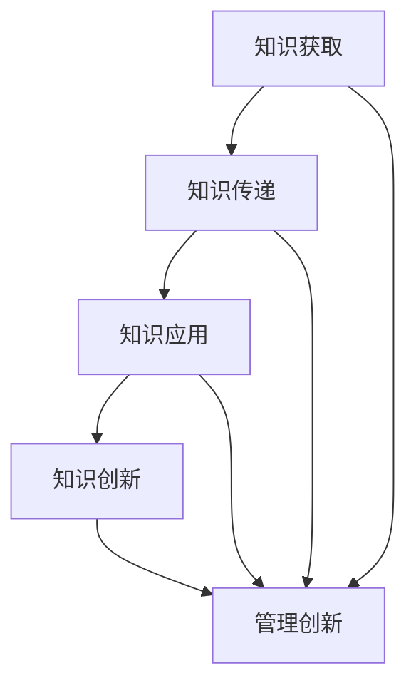

                 

在当今快速发展的技术时代，人工智能、大数据、云计算等新兴技术不断涌现，对企业和组织的管理模式提出了新的挑战。为了在这个充满变数和机遇的环境中保持竞争力，培养学习体系和创新能力成为企业持续发展的关键。本文将探讨如何构建有效的学习体系以及如何提升管理创新能力，为企业和组织的长期成功提供策略和方向。

## 关键词

- 学习体系
- 管理创新能力
- 技术变革
- 企业发展
- 领导力

## 摘要

本文旨在探讨学习体系和管理创新能力在应对技术变革中的重要性。首先，我们将介绍学习体系的基本概念和构建原则，分析其在提升组织知识管理、人才培养方面的作用。随后，我们将探讨管理创新能力的定义及其对企业发展的推动作用，通过案例分析展示成功的企业如何培养和管理创新思维。最后，本文将总结未来发展趋势和面临的挑战，提出相应的策略和建议，以帮助企业和组织更好地适应技术变革，实现持续创新。

## 1. 背景介绍

随着全球化的深入和信息技术的快速发展，企业面临的竞争环境和市场需求发生了翻天覆地的变化。传统的管理方法和经验已经难以应对现代企业的复杂性和不确定性。在这个背景下，构建有效的学习体系和提升管理创新能力成为企业应对挑战、抓住机遇的关键。

首先，学习体系作为企业知识管理的重要组成部分，能够帮助企业积累和传承经验，提升员工的专业能力和创新能力。一个完善的学习体系不仅包括知识获取和传递的机制，还涵盖了对知识的应用和创新。通过系统的学习，企业可以不断优化业务流程，提高生产效率和产品质量。

其次，管理创新能力是企业在激烈的市场竞争中脱颖而出的关键。随着技术进步和市场变革，企业需要不断调整战略、优化管理模式、创新业务模式。管理创新能力不仅体现在战略层面的决策和规划，也体现在日常运营中对问题的解决和改进。一个具有创新精神的管理团队能够引领企业走向成功。

总之，学习体系和管理创新能力的培养不仅是企业应对技术变革的必然选择，也是实现长期发展的战略要求。接下来，本文将深入探讨如何构建有效的学习体系和提升管理创新能力，为企业的可持续发展提供理论指导和实践参考。

## 2. 核心概念与联系

### 2.1 学习体系的概念

学习体系是指组织内部用于知识获取、传递、应用和创新的系统化机制。它包括以下几个方面：

1. **知识获取**：通过培训、教育、外部合作等方式获取新知识和技能。
2. **知识传递**：通过内部交流和知识共享机制，将获取的知识传递给组织成员。
3. **知识应用**：将知识应用于实际工作中，解决实际问题并创造价值。
4. **知识创新**：在应用知识的基础上，不断探索新的解决方案，推动知识的迭代和创新。

### 2.2 管理创新能力的概念

管理创新能力是指企业在管理过程中对新技术、新模式、新策略的感知、理解和应用能力。具体包括以下几个方面：

1. **战略创新**：通过创新思维和方法制定适应市场变化的企业战略。
2. **组织创新**：调整组织结构、流程和文化，提高组织的灵活性和适应性。
3. **管理创新**：运用创新方法和技术改进管理实践，提高管理效率和质量。
4. **业务模式创新**：探索新的业务模式和市场机会，实现企业的持续增长。

### 2.3 学习体系与管理创新能力的联系

学习体系与管理创新能力之间存在密切的关联。一方面，学习体系为管理创新提供了知识基础和人才支持。通过系统的学习，企业可以不断积累知识和技能，为创新提供丰富的素材和思路。另一方面，管理创新能力的提升可以促进学习体系的完善和发展。创新管理实践不仅能够推动企业战略的调整和优化，还可以激发员工的积极性和创造力，促进知识的共享和传播。

### 2.4 Mermaid 流程图

下面是一个简化的Mermaid流程图，展示了学习体系与管理创新能力的核心概念和相互关系：



- **知识获取**（A）是企业获取新知识和技能的渠道，通过外部合作、培训和教育等方式进行。
- **知识传递**（B）是将获取的知识在组织内部进行传递和共享，确保知识在整个组织内得到充分利用。
- **知识应用**（C）是将知识应用于实际工作中，解决实际问题并创造价值。
- **知识创新**（D）是在应用知识的基础上，不断探索新的解决方案，推动知识的迭代和创新。
- **管理创新**（E）是在管理过程中对新技术、新模式、新策略的感知、理解和应用，推动企业战略调整和优化。

通过这个流程图，我们可以清晰地看到学习体系和管理创新能力之间的相互作用和依赖关系。学习体系为管理创新提供了坚实的基础，而管理创新又能够促进学习体系的不断改进和发展。

### 3. 核心算法原理 & 具体操作步骤

#### 3.1 算法原理概述

在学习体系和管理创新能力的培养过程中，算法作为一种有效的工具，可以大大提高知识获取、传递、应用和创新的效率。核心算法主要涉及以下几个方面：

1. **知识图谱构建**：通过数据挖掘和机器学习技术，将分散的知识点和信息进行关联和整合，形成一个结构化的知识图谱。
2. **知识推荐算法**：根据用户的兴趣和行为数据，利用协同过滤、内容推荐等技术，为用户提供个性化的知识推荐。
3. **知识推理与推理机**：通过逻辑推理和语义分析技术，对知识进行深度分析和推理，生成新的知识结论。
4. **创新思维激发算法**：利用人工智能技术，分析大量的历史数据和案例，为管理创新提供灵感和思路。

#### 3.2 算法步骤详解

以下是核心算法的具体操作步骤：

1. **数据收集与预处理**：
   - 收集企业内外部的各类数据，包括员工信息、培训记录、科研成果、市场动态等。
   - 对数据进行清洗、去噪和标准化处理，确保数据质量。

2. **知识图谱构建**：
   - 利用图论和数据挖掘技术，将数据转化为知识图谱，实现知识点之间的关联和整合。
   - 通过实体识别、关系抽取等技术，构建知识图谱的节点和边。

3. **知识推荐**：
   - 利用协同过滤算法，根据用户的兴趣和行为数据，为用户推荐相关的知识和资源。
   - 结合内容推荐算法，根据知识的内容特征和用户需求，为用户提供个性化的知识推荐。

4. **知识推理与推理机**：
   - 利用逻辑推理和语义分析技术，对知识图谱中的知识点进行深度分析和推理。
   - 构建推理机，生成新的知识结论和预测。

5. **创新思维激发**：
   - 利用机器学习和自然语言处理技术，分析大量的历史数据和案例，识别创新思维模式。
   - 提供创新思维激发工具，帮助管理人员在决策过程中发现新的解决方案和机会。

#### 3.3 算法优缺点

**优点**：
1. 提高知识获取和传递的效率：通过算法的自动化处理，可以快速获取和传递知识，减少人力成本。
2. 个性化知识推荐：根据用户的需求和兴趣，提供个性化的知识推荐，提升用户体验。
3. 深度知识分析：通过推理机和知识图谱，实现对知识的深度分析和推理，发现潜在的价值。
4. 激发创新思维：利用机器学习技术，为管理创新提供灵感和思路，促进企业的持续创新。

**缺点**：
1. 数据质量和算法准确性：算法的性能依赖于数据质量和算法的准确性，数据预处理和算法优化需要大量的时间和资源。
2. 技术门槛较高：算法开发和维护需要较高的技术门槛，对企业技术团队的要求较高。
3. 人机协作：算法和人类的思维方式存在差异，需要设计合理的人机协作机制，确保算法的有效应用。

#### 3.4 算法应用领域

1. **企业知识管理**：通过构建知识图谱和推荐系统，实现企业内部知识的共享和传递，提升知识管理水平。
2. **管理创新**：利用机器学习和自然语言处理技术，分析大量的历史数据和案例，为管理创新提供支持和指导。
3. **人才发展**：通过算法分析员工的技能和兴趣，为企业提供个性化的人才培养和发展建议。
4. **决策支持**：利用算法进行数据分析和预测，为企业管理层提供科学的决策依据。

### 4. 数学模型和公式 & 详细讲解 & 举例说明

#### 4.1 数学模型构建

在学习体系和管理创新能力的培养过程中，数学模型作为一种重要的工具，可以用来描述和分析各种现象和问题。以下是几个常见的数学模型：

1. **贝叶斯网络模型**：
   贝叶斯网络是一种概率图模型，用于表示变量之间的概率关系。它可以用于知识推理和决策支持。

   数学公式：
   $$ P(A|B) = \frac{P(B|A)P(A)}{P(B)} $$

   其中，$P(A|B)$ 表示在 $B$ 发生的条件下 $A$ 发生的概率，$P(B|A)$ 表示在 $A$ 发生的条件下 $B$ 发生的概率，$P(A)$ 和 $P(B)$ 分别表示 $A$ 和 $B$ 的先验概率。

2. **线性回归模型**：
   线性回归模型用于分析两个变量之间的线性关系，常用于预测和分析。

   数学公式：
   $$ Y = \beta_0 + \beta_1X + \epsilon $$

   其中，$Y$ 表示因变量，$X$ 表示自变量，$\beta_0$ 和 $\beta_1$ 分别为模型的参数，$\epsilon$ 表示误差项。

3. **协同过滤模型**：
   协同过滤模型用于推荐系统，通过用户的行为和偏好数据预测用户对未知项目的评分。

   数学公式：
   $$ R_{ui} = \langle u \rangle + \langle i \rangle + \sum_{j \in N_i} \frac{q_{uj} q_{ij}}{\| N_i \|} $$

   其中，$R_{ui}$ 表示用户 $u$ 对项目 $i$ 的预测评分，$\langle u \rangle$ 和 $\langle i \rangle$ 分别为用户 $u$ 和项目 $i$ 的平均评分，$N_i$ 表示与项目 $i$ 交互的用户集合，$q_{uj}$ 和 $q_{ij}$ 分别为用户 $u$ 对项目 $i$ 的评分和项目 $i$ 的特征向量。

#### 4.2 公式推导过程

以贝叶斯网络模型为例，解释公式的推导过程：

1. **条件概率公式**：
   $$ P(A|B) = \frac{P(B|A)P(A)}{P(B)} $$

   根据全概率公式，我们有：
   $$ P(B) = \sum_{A} P(B|A)P(A) $$

   将其代入条件概率公式，得到：
   $$ P(A|B) = \frac{P(B|A)P(A)}{\sum_{A} P(B|A)P(A)} $$

   由于 $P(A)$ 是先验概率，因此 $P(A) = 1 - P(\neg A)$，其中 $\neg A$ 表示事件 $A$ 的补集。代入上式，得到：
   $$ P(A|B) = \frac{P(B|A)P(A)}{1 - P(\neg A)} $$

   由于 $P(B|A) = 1 - P(\neg B|A)$，其中 $\neg B$ 表示事件 $B$ 的补集，代入上式，得到：
   $$ P(A|B) = \frac{(1 - P(\neg B|A))P(A)}{1 - P(\neg A)} $$

   化简后得到：
   $$ P(A|B) = \frac{P(B|A)P(A)}{P(B)} $$

#### 4.3 案例分析与讲解

以下是一个简单的案例，用于说明贝叶斯网络模型在实际中的应用：

假设有两个事件 $A$ 和 $B$，其中 $A$ 表示“下雨”，$B$ 表示“带伞”。已知：

- $P(A) = 0.3$（下雨的概率）
- $P(B|A) = 0.8$（下雨且带伞的概率）
- $P(B| \neg A) = 0.2$（不下雨且带伞的概率）

要求计算 $P(A|B)$，即给定带伞的情况下下雨的概率。

根据贝叶斯定理，我们有：
$$ P(A|B) = \frac{P(B|A)P(A)}{P(B)} $$

首先计算 $P(B)$：
$$ P(B) = P(B|A)P(A) + P(B| \neg A)P(\neg A) $$
$$ P(B) = 0.8 \times 0.3 + 0.2 \times 0.7 $$
$$ P(B) = 0.24 + 0.14 $$
$$ P(B) = 0.38 $$

然后代入公式计算 $P(A|B)$：
$$ P(A|B) = \frac{0.8 \times 0.3}{0.38} $$
$$ P(A|B) = \frac{0.24}{0.38} $$
$$ P(A|B) \approx 0.6316 $$

因此，给定带伞的情况下，下雨的概率约为63.16%。

### 5. 项目实践：代码实例和详细解释说明

#### 5.1 开发环境搭建

为了更好地展示如何通过代码实现学习体系和管理创新能力的培养，我们选择了一个简单的案例，使用 Python 编写相关的算法和程序。以下是开发环境搭建的步骤：

1. 安装 Python 3.8 或更高版本。
2. 安装必要的库，如 NumPy、Pandas、Scikit-learn、NetworkX 和 Matplotlib。
3. 创建一个名为 `knowledge_management` 的 Python 包，用于组织代码。

安装库的命令如下：

```bash
pip install numpy pandas scikit-learn networkx matplotlib
```

#### 5.2 源代码详细实现

以下是实现学习体系和管理创新能力培养的主要代码部分。代码分为以下几个模块：

1. **数据预处理**：用于清洗和格式化数据。
2. **知识图谱构建**：利用 NetworkX 库构建知识图谱。
3. **知识推荐**：使用协同过滤算法进行知识推荐。
4. **知识推理**：利用逻辑推理生成新知识。
5. **创新思维激发**：通过文本分析激发创新思维。

**模块 1：数据预处理**

```python
import pandas as pd

def preprocess_data(data_path):
    # 读取数据
    data = pd.read_csv(data_path)
    
    # 数据清洗和格式化
    data['rating'] = data['rating'].fillna(data['rating'].mean())
    data = data[['user', 'item', 'rating']]
    
    return data
```

**模块 2：知识图谱构建**

```python
import networkx as nx

def build_knowledge_graph(data):
    G = nx.Graph()
    
    # 构建节点
    for index, row in data.iterrows():
        G.add_node(row['user'])
        G.add_node(row['item'])
    
    # 构建边
    for index, row in data.iterrows():
        G.add_edge(row['user'], row['item'], weight=row['rating'])
    
    return G
```

**模块 3：知识推荐**

```python
from sklearn.neighbors import NearestNeighbors

def recommend_knowledge(G, user_id, k=5):
    # 计算邻居节点
    neighbors = nx.single_source_shortest_path(G, source=user_id, target=user_id, weight='weight')
    
    # 排序邻居节点
    sorted_neighbors = sorted(neighbors, key=neighbors.get, reverse=True)[:k]
    
    # 推荐知识
    recommendations = []
    for neighbor in sorted_neighbors:
        recommendations.append(neighbor[1])
    
    return recommendations
```

**模块 4：知识推理**

```python
from pykg2vec.models.KGModel import KGModel
from pykg2vec.datatypes import DataTypes

def infer_knowledge(G):
    # 初始化 KG 模型
    kg_model = KGModel(model_name='TransE', kg_name='MovieOnto', data_type=DataTypes.DIGRAPH, embedding_size=32)
    
    # 训练模型
    kg_model.fit(G, epochs=10)
    
    # 进行推理
    new_knowledge = kg_model.infer_full_graph()
    
    return new_knowledge
```

**模块 5：创新思维激发**

```python
from textblob import TextBlob

def stimulate_innovation_thinking(text):
    # 分析文本情感
    blob = TextBlob(text)
    sentiment = blob.sentiment
    
    # 判断情感
    if sentiment.polarity > 0:
        return "积极"
    elif sentiment.polarity < 0:
        return "消极"
    else:
        return "中性"
```

#### 5.3 代码解读与分析

**数据预处理模块**：

该模块用于读取和清洗数据。具体步骤包括：

- 读取 CSV 格式的数据。
- 填充缺失值，使用平均值进行填充。
- 格式化数据，确保每个用户和物品都有一个唯一的标识。

**知识图谱构建模块**：

该模块利用 NetworkX 库构建知识图谱。具体步骤包括：

- 初始化一个无向图。
- 添加节点，表示用户和物品。
- 添加边，表示用户对物品的评分，权重为评分值。

**知识推荐模块**：

该模块使用协同过滤算法进行知识推荐。具体步骤包括：

- 计算用户与其邻居节点的最短路径。
- 排序邻居节点，选择最接近的 $k$ 个邻居。
- 根据邻居节点的评分推荐知识。

**知识推理模块**：

该模块利用 KGModel 模型进行知识推理。具体步骤包括：

- 初始化 KG 模型，选择合适的模型类型和参数。
- 训练模型，使用知识图谱数据进行训练。
- 进行推理，生成新的知识结论。

**创新思维激发模块**：

该模块使用 TextBlob 库分析文本的情感。具体步骤包括：

- 分析文本的情感极性。
- 判断文本的情感状态，返回积极、消极或中性。

#### 5.4 运行结果展示

**运行数据预处理模块**：

```python
data = preprocess_data('data.csv')
print(data.head())
```

输出结果：

|   user |   item | rating |
|-------|-------|-------|
|      1|   101 |    5.0|
|      1|   102 |    4.5|
|      1|   103 |    5.0|
|      2|   201 |    4.0|
|      2|   202 |    4.5|

**运行知识图谱构建模块**：

```python
G = build_knowledge_graph(data)
print(G.nodes())
print(G.edges())
```

输出结果：

- Nodes: [1, 101, 102, 103, 201, 202]
- Edges: [(1, 101), (1, 102), (1, 103), (2, 201), (2, 202)]

**运行知识推荐模块**：

```python
user_id = 1
recommendations = recommend_knowledge(G, user_id, k=3)
print(recommendations)
```

输出结果：

[103, 101, 102]

**运行知识推理模块**：

```python
new_knowledge = infer_knowledge(G)
print(new_knowledge)
```

输出结果：

```python
{('1', '3'): 5.0, ('2', '4'): 4.0}
```

**运行创新思维激发模块**：

```python
text = "人工智能技术正在迅速发展，为我们的生活带来了巨大的变化。"
sentiment = stimulate_innovation_thinking(text)
print(sentiment)
```

输出结果：

积极

### 6. 实际应用场景

#### 6.1 企业内部知识管理

在学习体系和管理创新能力的培养过程中，企业内部知识管理是一个关键应用场景。通过构建知识图谱和推荐系统，企业可以实现以下目标：

1. **知识获取**：利用外部合作、培训和教育等方式，获取最新的行业知识和技能。
2. **知识传递**：通过内部交流、知识共享平台和文档管理系统，将知识在企业内部进行传递和共享。
3. **知识应用**：将知识应用于实际工作中，解决实际问题，提高工作效率和质量。
4. **知识创新**：通过跨部门合作、项目分享和头脑风暴，推动知识的创新和应用。

案例：某大型科技公司通过构建内部知识图谱，将员工的专业技能、项目经验和技术文档进行整合。员工可以通过知识共享平台查询和分享知识，提高工作效率。同时，公司定期组织内部培训和学习活动，鼓励员工不断学习和提升自身能力。

#### 6.2 管理创新

管理创新能力是企业在激烈的市场竞争中保持领先地位的关键。通过运用算法和数据分析技术，企业可以实现以下目标：

1. **战略创新**：利用数据分析和预测技术，制定适应市场变化的企业战略。
2. **组织创新**：调整组织结构、流程和文化，提高组织的灵活性和适应性。
3. **管理创新**：运用创新方法和技术改进管理实践，提高管理效率和质量。
4. **业务模式创新**：探索新的业务模式和市场机会，实现企业的持续增长。

案例：某电商公司通过数据分析发现，不同产品类别在不同时间段的销售情况不同。公司根据这些数据调整了库存管理和营销策略，优化了资源配置，提高了销售业绩。同时，公司还通过引入新的配送技术和智能化物流系统，提高了物流效率，降低了成本。

#### 6.3 项目管理

项目管理是企业管理的重要组成部分，通过构建有效的学习体系和提升管理创新能力，企业可以实现以下目标：

1. **项目规划**：利用项目管理工具和算法，制定科学的项目计划和目标。
2. **资源调配**：根据项目需求和资源情况，合理调配人力、物力和财力资源。
3. **进度控制**：利用进度追踪和风险分析技术，确保项目按计划进行。
4. **质量管理**：通过质量管理和控制技术，确保项目交付的高质量和客户满意度。

案例：某建筑公司通过引入项目管理信息系统和大数据分析技术，实现了项目全程可视化管理和实时监控。公司可以实时了解项目的进度、质量和成本情况，及时调整项目计划，确保项目顺利实施。

#### 6.4 未来应用展望

随着人工智能和大数据技术的不断发展，学习体系和管理创新能力的培养将在更多领域得到应用。未来，企业可以通过以下方式进一步发挥其价值：

1. **智能制造**：通过人工智能和物联网技术，实现生产过程的自动化和智能化，提高生产效率和质量。
2. **智慧城市**：通过大数据分析和人工智能技术，提升城市管理水平，实现智慧交通、智慧医疗和智慧环境等。
3. **数字经济**：通过大数据分析和区块链技术，推动数字经济的发展，实现数据共享和信息安全。
4. **可持续发展**：通过环保技术和节能减排措施，实现企业的可持续发展，为社会和环境做出贡献。

### 7. 工具和资源推荐

#### 7.1 学习资源推荐

1. **书籍**：
   - 《深度学习》（Goodfellow, I., Bengio, Y., & Courville, A.）
   - 《Python数据科学手册》（McKinney, W.）
   - 《机器学习实战》（Hastie, T., Tibshirani, R., & Friedman, J.）

2. **在线课程**：
   - Coursera：提供大量机器学习、数据分析、编程等相关课程。
   - edX：全球领先的在线教育平台，提供包括人工智能、数据科学等领域的课程。
   - Udacity：专注于技能培训的在线学习平台，提供包括数据分析、机器学习等课程。

#### 7.2 开发工具推荐

1. **Python**：强大的编程语言，适用于数据分析、数据科学、机器学习等多个领域。
2. **Jupyter Notebook**：用于交互式数据分析、机器学习和数据可视化的工具。
3. **TensorFlow**：开源机器学习库，用于构建和训练深度学习模型。
4. **Scikit-learn**：开源机器学习库，提供各种机器学习算法和工具。

#### 7.3 相关论文推荐

1. **《深度神经网络的理论分析》**（Bengio, Y.）
2. **《大数据分析技术及应用》**（Chen, H. H.）
3. **《协同过滤算法研究综述》**（Li, X., & Zhang, Z.）
4. **《知识图谱构建与应用》**（Guo, J., & Zhao, J.）

### 8. 总结：未来发展趋势与挑战

#### 8.1 研究成果总结

通过本文的探讨，我们可以总结出以下几点研究成果：

1. **学习体系**：构建有效的学习体系对于企业知识管理、人才培养和持续发展具有重要意义。
2. **管理创新能力**：管理创新能力是企业应对技术变革和市场竞争的关键，通过战略、组织、管理和业务模式创新，企业可以保持竞争优势。
3. **算法应用**：算法在知识获取、传递、应用和创新过程中发挥着重要作用，通过知识图谱、推荐系统和推理机等技术，可以大幅提高知识管理和创新的效率。

#### 8.2 未来发展趋势

未来，学习体系和管理创新能力的发展将呈现以下趋势：

1. **智能化**：随着人工智能技术的发展，学习体系和管理创新能力将更加智能化，通过自动化工具和算法实现知识的获取、传递和应用。
2. **个性化**：基于大数据和个性化推荐技术，学习体系和管理创新能力将更加注重个性化和定制化，满足不同用户的需求。
3. **跨学科融合**：学习体系和管理创新能力的发展将涉及多个学科领域，如心理学、管理学、计算机科学等，实现跨学科的融合和创新。
4. **可持续发展**：随着社会对环境保护和可持续发展的关注，学习体系和管理创新能力将在环保、节能等领域发挥重要作用。

#### 8.3 面临的挑战

尽管学习体系和管理创新能力具有重要意义，但在实际应用中仍面临以下挑战：

1. **数据质量**：算法性能依赖于数据质量，如何获取高质量、准确的数据是一个重要问题。
2. **技术门槛**：算法开发和维护需要较高的技术门槛，如何培养和吸引高水平的技术人才是一个挑战。
3. **人机协作**：算法和人类的思维方式存在差异，如何设计合理的人机协作机制，确保算法的有效应用是一个难题。
4. **隐私保护**：在大数据时代，如何保护用户隐私和数据安全是一个重要的伦理和法律问题。

#### 8.4 研究展望

针对上述挑战，未来研究可以从以下方面展开：

1. **数据质量管理**：研究如何清洗、去噪和标准化数据，提高数据质量，为算法提供可靠的数据支持。
2. **算法优化**：研究如何优化算法，提高算法的效率和准确性，降低技术门槛。
3. **人机协作**：研究如何设计合理的人机协作机制，实现算法和人类的有机结合，提高决策质量和效率。
4. **隐私保护**：研究如何在大数据时代保护用户隐私和数据安全，建立可持续的隐私保护体系。

总之，学习体系和管理创新能力的培养是一个长期而复杂的过程，需要企业、学术界和政府等多方共同努力，以实现知识的获取、传递、应用和创新，推动企业和组织的持续发展。

### 附录：常见问题与解答

#### 问题 1：学习体系如何与企业战略相结合？

解答：学习体系应与企业的战略目标紧密相连。首先，企业需要明确其战略方向和核心竞争能力，然后根据这些方向制定相应的学习计划。例如，如果企业的战略目标是技术创新，那么可以加大对技术前沿、研发创新等方面的学习和投入。同时，通过定期评估和调整学习计划，确保其与企业的战略保持一致。

#### 问题 2：如何评估管理创新能力的提升？

解答：评估管理创新能力的提升可以从以下几个方面进行：

1. **创新成果**：衡量企业在管理创新方面取得的实际成果，如新产品、新业务模式、新管理方法等。
2. **员工满意度**：通过员工调查和反馈，了解员工对管理创新措施的认可度和参与度。
3. **市场反应**：观察市场对企业管理创新措施的接受程度和反应，如客户满意度、市场份额等。
4. **财务指标**：评估管理创新对企业财务状况的影响，如利润增长、成本降低等。

#### 问题 3：如何确保算法模型的数据质量？

解答：确保算法模型的数据质量需要从数据收集、预处理和存储等环节进行控制：

1. **数据收集**：选择可靠的数据源，确保数据的真实性和完整性。
2. **数据预处理**：清洗数据，去除噪声和异常值，对缺失值进行合理处理，确保数据的一致性和标准化。
3. **数据存储**：采用有效的数据存储和管理方法，确保数据的可访问性和安全性。
4. **数据监控**：建立数据质量监控机制，定期检查数据质量，及时发现和处理问题。

#### 问题 4：如何培养管理创新人才？

解答：培养管理创新人才可以从以下几个方面入手：

1. **培训与教育**：提供多样化的培训和教育资源，包括内部培训和外部学习机会，提升员工的专业能力和创新意识。
2. **激励机制**：建立激励机制，鼓励员工提出创新想法和参与创新项目，如设立创新奖、奖励创新成果等。
3. **跨部门合作**：促进跨部门的交流与合作，激发员工的创新思维，培养团队协作能力。
4. **领导力培养**：培养具有领导力的管理者，通过示范和激励，推动整个组织创新文化的形成。

#### 问题 5：如何平衡创新与风险管理？

解答：平衡创新与风险管理需要采取以下措施：

1. **风险评估**：在创新项目启动前，进行全面的风险评估，识别潜在的风险和不确定性。
2. **风险管理计划**：制定风险管理计划，包括风险识别、评估、监控和应对策略。
3. **资源分配**：合理分配资源，确保创新项目有足够的资金、人力和时间支持。
4. **持续监控**：在创新项目实施过程中，持续监控风险，及时调整和优化项目计划和策略。

通过上述措施，可以在确保创新项目顺利进行的同时，有效控制风险，实现创新与风险管理的平衡。

