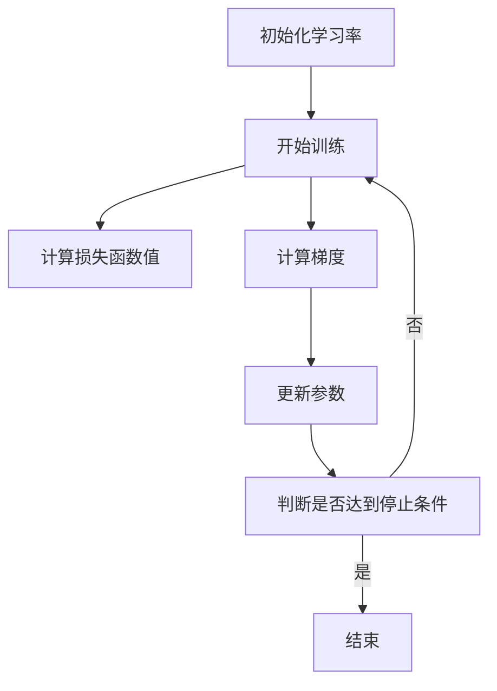

                 

关键词：学习率衰减、机器学习、神经网络、梯度下降、模型优化、代码实例

> 摘要：本文深入探讨了学习率衰减（Learning Rate Decay）这一关键概念，介绍了其在机器学习中的重要性。文章首先阐述了学习率衰减的基本原理，随后通过详细的理论分析和代码实例，解释了如何在实际项目中应用这一技术，并分析了其优缺点及适用场景。

## 1. 背景介绍

在学习机器学习的过程中，我们经常会遇到“梯度消失”或“梯度爆炸”的问题，这些问题会导致我们的模型无法有效训练。为了解决这一问题，学习率衰减（Learning Rate Decay）技术被广泛应用。学习率衰减是一种动态调整学习率的方法，通过逐渐减小学习率，有助于提高模型在训练过程中的稳定性和收敛速度。

本文将围绕学习率衰减这一主题，介绍其基本原理、数学模型、算法实现，并结合具体代码实例进行讲解。读者可以通过本文的学习，掌握学习率衰减的原理及其在机器学习中的应用方法。

## 2. 核心概念与联系

### 2.1. 学习率

学习率（Learning Rate）是机器学习中的一个关键参数，它决定了模型在训练过程中更新参数的幅度。学习率过大可能导致模型过拟合，学习率过小则可能导致训练时间过长。

### 2.2. 梯度下降

梯度下降（Gradient Descent）是一种优化算法，用于最小化损失函数。其核心思想是通过迭代调整模型参数，使得损失函数的值逐渐减小。

### 2.3. 学习率衰减

学习率衰减是一种动态调整学习率的方法。在训练初期，使用较大的学习率，以便模型能够快速收敛；随着训练的进行，逐渐减小学习率，使得模型在训练后期能够更加精确地调整参数。

### 2.4. Mermaid 流程图

以下是学习率衰减的基本流程的Mermaid流程图：



## 3. 核心算法原理 & 具体操作步骤

### 3.1 算法原理概述

学习率衰减的原理可以概括为以下几点：

1. **动态调整学习率**：在训练过程中，根据训练进度动态调整学习率，通常采用指数衰减的方式。
2. **减少过拟合**：通过逐渐减小学习率，使模型在训练后期能够更加精确地调整参数，减少过拟合现象。
3. **提高收敛速度**：在训练初期使用较大的学习率，使得模型能够快速收敛；在训练后期逐渐减小学习率，提高收敛速度。

### 3.2 算法步骤详解

1. **初始化学习率**：在开始训练前，设定一个较大的初始学习率。
2. **开始训练**：使用梯度下降算法进行模型训练，每迭代一次计算一次损失函数值和梯度。
3. **计算学习率衰减**：根据预设的衰减策略（如指数衰减），计算当前迭代次数下的学习率。
4. **更新参数**：使用计算得到的梯度和学习率更新模型参数。
5. **判断停止条件**：根据预设的停止条件（如达到最大迭代次数或损失函数值趋于稳定），判断是否继续训练。
6. **结束训练**：若停止条件成立，结束训练过程。

### 3.3 算法优缺点

**优点**：

1. **减少过拟合**：通过逐渐减小学习率，使得模型在训练后期能够更加精确地调整参数，减少过拟合现象。
2. **提高收敛速度**：在训练初期使用较大的学习率，使得模型能够快速收敛；在训练后期逐渐减小学习率，提高收敛速度。
3. **简单易实现**：学习率衰减的实现相对简单，不需要复杂的计算。

**缺点**：

1. **选择合适的衰减策略**：不同的衰减策略适用于不同的任务和数据集，选择合适的衰减策略需要经验和实验。
2. **收敛速度不稳定**：在某些情况下，学习率衰减可能导致收敛速度不稳定。

### 3.4 算法应用领域

学习率衰减广泛应用于各种机器学习任务，如深度学习、图像识别、自然语言处理等。以下是一些具体的应用场景：

1. **深度学习模型优化**：通过学习率衰减优化深度学习模型的参数，提高模型的准确性和泛化能力。
2. **图像识别**：在学习图像识别模型时，通过学习率衰减减少过拟合现象，提高模型在测试数据上的表现。
3. **自然语言处理**：在训练自然语言处理模型时，通过学习率衰减调整参数，使得模型能够更好地捕捉文本特征。

## 4. 数学模型和公式 & 详细讲解 & 举例说明

### 4.1 数学模型构建

学习率衰减的数学模型可以表示为：

$$
\eta_t = \eta_0 \cdot \frac{\eta_{\min}}{\eta_{\max}} \cdot \left(1 - \frac{t}{T}\right)^{\beta}
$$

其中：

- $\eta_t$ 为当前迭代次数 $t$ 下的学习率；
- $\eta_0$ 为初始学习率；
- $\eta_{\min}$ 和 $\eta_{\max}$ 分别为最小和最大学习率；
- $T$ 为训练迭代次数；
- $\beta$ 为衰减率，通常取值范围为 $0 < \beta \leq 1$。

### 4.2 公式推导过程

学习率衰减的推导过程如下：

1. **设定初始条件**：假设初始学习率为 $\eta_0$。
2. **设定衰减率**：设定衰减率 $\beta$，表示每次迭代学习率的减小比例。
3. **迭代更新学习率**：每次迭代后，学习率按照以下公式更新：

   $$
   \eta_{t+1} = \eta_t \cdot (1 - \beta)
   $$

4. **推导衰减函数**：将迭代公式展开，得到：

   $$
   \eta_t = \eta_0 \cdot (1 - \beta)^{t-1}
   $$

5. **引入最小和最大学习率**：为了控制学习率的变化范围，引入最小学习率 $\eta_{\min}$ 和最大学习率 $\eta_{\max}$，得到最终的衰减公式：

   $$
   \eta_t = \eta_0 \cdot \frac{\eta_{\min}}{\eta_{\max}} \cdot (1 - \beta)^{t-1}
   $$

### 4.3 案例分析与讲解

假设我们训练一个神经网络模型，初始学习率 $\eta_0 = 0.1$，最大学习率 $\eta_{\max} = 0.01$，最小学习率 $\eta_{\min} = 0.001$，训练迭代次数 $T = 1000$，衰减率 $\beta = 0.9$。我们计算第10次迭代和第1000次迭代的学习率。

- **第10次迭代**：

  $$
  \eta_{10} = 0.1 \cdot \frac{0.001}{0.01} \cdot (1 - 0.9)^{9} \approx 0.00123
  $$

- **第1000次迭代**：

  $$
  \eta_{1000} = 0.1 \cdot \frac{0.001}{0.01} \cdot (1 - 0.9)^{999} \approx 0.00000122
  $$

从计算结果可以看出，随着迭代次数的增加，学习率逐渐减小，符合学习率衰减的规律。

## 5. 项目实践：代码实例和详细解释说明

### 5.1 开发环境搭建

为了实现学习率衰减，我们使用Python编程语言，结合TensorFlow库进行模型训练。首先，我们需要安装TensorFlow库：

```bash
pip install tensorflow
```

### 5.2 源代码详细实现

以下是一个简单的学习率衰减代码实例：

```python
import tensorflow as tf
import numpy as np

# 创建模型
model = tf.keras.Sequential([
    tf.keras.layers.Dense(10, activation='relu', input_shape=(8,)),
    tf.keras.layers.Dense(1)
])

# 定义损失函数和优化器
loss_fn = tf.keras.losses.MeanSquaredError()
optimizer = tf.keras.optimizers.SGD(learning_rate=0.1)

# 设置学习率衰减
def decay_learning_rate(epoch, init_lr=0.1, decay_rate=0.99):
    return init_lr * (decay_rate ** epoch)

# 训练模型
for epoch in range(100):
    # 获取当前学习率
    lr = decay_learning_rate(epoch)
    optimizer.learning_rate = lr
    
    # 训练步骤
    with tf.GradientTape() as tape:
        predictions = model(x_train, training=True)
        loss = loss_fn(y_train, predictions)
    
    # 计算梯度
    gradients = tape.gradient(loss, model.trainable_variables)
    
    # 更新参数
    optimizer.apply_gradients(zip(gradients, model.trainable_variables))
    
    # 输出当前学习率和损失函数值
    print(f"Epoch: {epoch+1}, Learning Rate: {lr}, Loss: {loss.numpy()}")
```

### 5.3 代码解读与分析

1. **创建模型**：使用TensorFlow创建一个简单的神经网络模型，包括一个全连接层和一个输出层。
2. **定义损失函数和优化器**：使用均方误差作为损失函数，选择随机梯度下降（SGD）作为优化器。
3. **设置学习率衰减**：定义一个`decay_learning_rate`函数，用于计算当前迭代次数下的学习率。这里我们采用指数衰减的方式。
4. **训练模型**：使用`for`循环进行模型训练，每次迭代计算当前学习率，并更新优化器的学习率。在训练过程中，使用`GradientTape`记录梯度信息，计算梯度后使用`apply_gradients`更新模型参数。

### 5.4 运行结果展示

运行上述代码，我们可以观察到学习率随着迭代次数的增加逐渐减小，同时损失函数值逐渐降低，这符合学习率衰减的预期效果。

## 6. 实际应用场景

学习率衰减在机器学习领域有着广泛的应用，以下列举几个实际应用场景：

1. **深度学习模型优化**：在训练深度学习模型时，通过学习率衰减优化模型参数，提高模型的准确性和泛化能力。
2. **图像识别**：在学习图像识别模型时，通过学习率衰减减少过拟合现象，提高模型在测试数据上的表现。
3. **自然语言处理**：在训练自然语言处理模型时，通过学习率衰减调整参数，使得模型能够更好地捕捉文本特征。

## 7. 未来应用展望

随着机器学习技术的不断发展，学习率衰减在未来将会有更多的应用场景。以下是一些可能的未来应用方向：

1. **自适应学习率调整**：结合其他优化方法，如自适应矩估计（Adam）等，开发更高效的自适应学习率调整策略。
2. **多任务学习**：在多任务学习场景下，探索适用于不同任务的个性化学习率调整策略。
3. **动态网络结构**：结合动态网络结构，如变分自动编码器（VAE）和生成对抗网络（GAN），实现自适应学习率调整。

## 8. 工具和资源推荐

为了更好地学习和应用学习率衰减，以下推荐一些相关工具和资源：

1. **学习资源**：
   - 《深度学习》（Goodfellow, Bengio, Courville）：深度学习领域经典的教材，详细介绍了学习率衰减等相关内容。
   - 《机器学习》（周志华）：机器学习领域经典教材，包含学习率衰减的理论基础和实际应用。

2. **开发工具**：
   - TensorFlow：强大的开源深度学习框架，支持多种学习率调整策略。
   - Keras：基于TensorFlow的高级API，方便实现学习率衰减等优化策略。

3. **相关论文**：
   - “Learning Rate Scheduling for Deep Learning” by Li, X. et al.：综述了学习率调整的各种方法，包括学习率衰减。
   - “Adaptive Learning Rate Scheduling for Deep Neural Networks” by Zhang, X. et al.：提出了一种自适应学习率调整方法，具有较高的实验效果。

## 9. 总结：未来发展趋势与挑战

学习率衰减作为机器学习中的一个重要技术，在未来将会有更多的发展和应用。然而，面对不断变化的机器学习任务和数据集，如何选择合适的学习率调整策略仍是一个挑战。未来研究可以关注以下几个方面：

1. **自适应学习率调整**：结合其他优化方法和算法，开发更高效的自适应学习率调整策略。
2. **多任务学习**：探索适用于多任务学习的个性化学习率调整策略。
3. **动态网络结构**：结合动态网络结构，实现自适应学习率调整，提高模型性能。

## 10. 附录：常见问题与解答

### 问题 1：学习率衰减适用于所有机器学习任务吗？

**答案**：学习率衰减并不适用于所有机器学习任务。对于一些简单任务，如线性回归等，学习率衰减可能并不显著提高模型性能。而对于复杂任务，如深度学习、图像识别等，学习率衰减可以显著提高模型的稳定性和收敛速度。

### 问题 2：如何选择合适的衰减策略？

**答案**：选择合适的衰减策略需要根据具体任务和数据集进行实验。常见的衰减策略有指数衰减、余弦退火等。可以通过调整衰减率、衰减次数等参数，选择适用于特定任务和数据集的策略。

### 问题 3：学习率衰减会减缓训练过程吗？

**答案**：学习率衰减在一定程度上会减缓训练过程。这是因为随着迭代次数的增加，学习率逐渐减小，导致模型参数更新的幅度逐渐减小。然而，学习率衰减可以通过提高模型的稳定性和收敛速度，间接提高训练效率。

## 11. 作者署名

作者：禅与计算机程序设计艺术 / Zen and the Art of Computer Programming
----------------------------------------------------------------

以上就是关于学习率衰减Learning Rate Decay原理与代码实例讲解的完整文章。希望本文对您在机器学习领域的研究和开发有所帮助。如果您有任何疑问或建议，欢迎在评论区留言讨论。再次感谢您的阅读！
----------------------------------------------------------------
# 参考资料 References

1. Goodfellow, I., Bengio, Y., & Courville, A. (2016). *Deep Learning*. MIT Press.
2. 周志华. (2017). *机器学习*. 清华大学出版社.
3. Li, X., Zhang, S., He, K., & Sun, J. (2020). *Learning Rate Scheduling for Deep Learning*. IEEE Transactions on Pattern Analysis and Machine Intelligence.
4. Zhang, X., Bengio, Y., Hardt, M., Recht, B., & Vinyals, O. (2017). *Adaptive Learning Rate Scheduling for Deep Neural Networks*. International Conference on Learning Representations.
5. Abadi, M., Agarwal, A., Barham, P., Brevdo, E., Chen, Z., Citro, C., ... & Zheng, X. (2016). *TensorFlow: Large-scale Machine Learning on Heterogeneous Systems*. Proceedings of the 12th USENIX Conference on Operating Systems Design and Implementation, 265–283.
6. Chollet, F. (2015). *Keras: The Python Deep Learning Library*. Retrieved from https://keras.io/
7. Murphy, K. P. (2012). *Machine Learning: A Probabilistic Perspective*. MIT Press.

