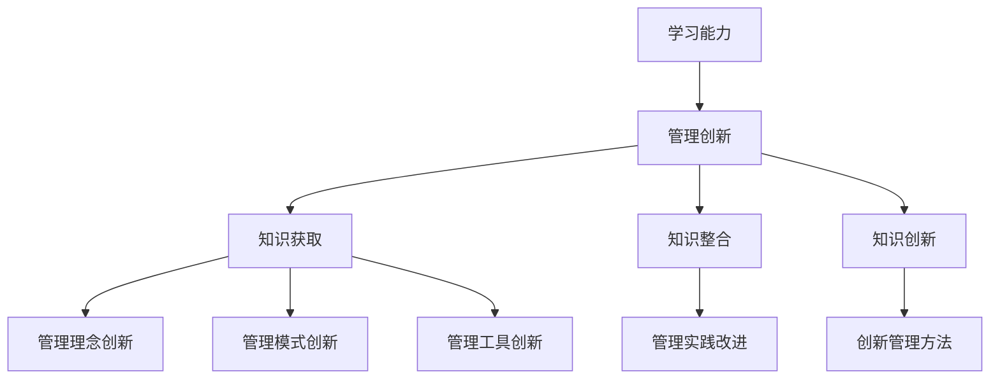

                 

关键词：学习能力，管理创新，人工智能，算法优化，项目实践，未来展望

摘要：在当今快速发展的技术时代，学习能力和管理创新对于企业和个人来说都至关重要。本文将探讨学习能力与管理创新之间的紧密联系，分析如何通过不断提升学习能力来推动管理创新，进而实现个人和企业的发展。本文将从背景介绍、核心概念与联系、核心算法原理、数学模型与公式、项目实践、实际应用场景、工具和资源推荐、总结与展望等方面进行详细阐述。

## 1. 背景介绍

随着人工智能、大数据、云计算等技术的迅猛发展，企业和个人面临着前所未有的挑战和机遇。在这个快速变革的时代，创新能力成为企业持续发展的关键因素。同时，学习能力作为个体和组织应对变化的重要能力，也日益受到重视。本文旨在探讨学习能力和管理创新之间的关系，为企业和个人在技术发展中的创新提供指导。

### 1.1 当前技术环境

当前，人工智能技术的快速发展使得各个行业面临着前所未有的变革。人工智能算法的优化、机器学习模型的应用、自然语言处理的发展等，都在不断推动着技术进步。此外，大数据和云计算的普及，使得海量数据的存储、处理和分析变得更加高效和便捷。这些技术的进步，不仅为企业提供了新的发展机遇，也带来了前所未有的挑战。

### 1.2 学习能力的重要性

在这个快速变化的时代，学习能力成为个人和组织应对挑战、抓住机遇的关键能力。学习能力不仅包括获取新知识、掌握新技能的能力，还包括对已有知识进行整合和创新的能力。只有不断提升学习能力，才能在激烈的竞争中脱颖而出。

### 1.3 管理创新的重要性

管理创新是企业持续发展的关键。随着市场环境的不断变化，企业需要不断调整管理模式，创新管理思路，以适应新的挑战。管理创新不仅能够提高企业的竞争力，还能够促进企业的可持续发展。

## 2. 核心概念与联系

为了更好地理解学习能力和管理创新之间的关系，我们需要明确以下几个核心概念：

### 2.1 学习能力

学习能力是指个体或组织获取、整合和创新知识的能力。它包括以下几个方面的内容：

- **知识获取**：通过学习新知识、掌握新技能，提高自身的知识水平。
- **知识整合**：将不同领域的知识进行整合，形成新的思维方式和解决问题的方法。
- **知识创新**：在已有知识的基础上，进行创新，形成新的理论、方法和技术。

### 2.2 管理创新

管理创新是指企业在管理实践中，通过引入新的管理理念、管理模式、管理工具等，提高管理效率、降低管理成本、提升企业竞争力。管理创新包括以下几个方面：

- **管理理念创新**：引入新的管理理念，如人性化、绿色管理、可持续发展等。
- **管理模式创新**：创新管理模式，如扁平化管理、矩阵式管理、目标管理等。
- **管理工具创新**：引入新的管理工具，如人工智能、大数据分析、云计算等。

### 2.3 学习能力与管理创新的关系

学习能力与管理创新之间存在密切的联系。学习能力是管理创新的基础，只有具备较强的学习能力，才能在管理实践中不断创新。同时，管理创新也为学习能力的提升提供了新的方向和目标。具体来说：

- **学习能力促进管理创新**：通过不断学习新知识、掌握新技能，管理者可以不断拓展视野，发现新的管理问题和挑战，从而推动管理创新。
- **管理创新提升学习能力**：通过管理创新，企业可以引入新的管理工具和方法，提高管理效率，从而为学习能力的提升提供支持和保障。

### 2.4 Mermaid 流程图



## 3. 核心算法原理 & 具体操作步骤

### 3.1 算法原理概述

在管理创新的过程中，算法优化是一个重要的环节。算法优化可以通过改进现有算法，提高管理效率，降低管理成本。具体来说，算法优化包括以下几个方面的内容：

- **算法改进**：通过对现有算法进行分析和改进，提高算法的执行效率。
- **算法选择**：根据具体的管理需求，选择合适的算法，实现管理目标的优化。
- **算法集成**：将多个算法进行集成，形成新的算法体系，提高管理创新能力。

### 3.2 算法步骤详解

算法优化包括以下几个步骤：

1. **需求分析**：明确管理创新的需求，确定需要优化的具体目标。
2. **算法选择**：根据需求分析结果，选择合适的算法。
3. **算法改进**：对所选算法进行分析，找出改进点，进行改进。
4. **算法集成**：将改进后的算法进行集成，形成新的算法体系。
5. **算法验证**：通过实际应用，验证算法的有效性。

### 3.3 算法优缺点

算法优化具有以下优点：

- **提高管理效率**：通过优化算法，可以减少管理过程中的时间和资源消耗，提高管理效率。
- **降低管理成本**：优化后的算法可以降低管理成本，提高企业的盈利能力。
- **提升创新能力**：算法优化可以为管理创新提供技术支持，提升企业的创新能力。

算法优化也存在一些缺点：

- **算法复杂度高**：优化后的算法可能变得更加复杂，需要更高的技术要求。
- **实施成本高**：算法优化的实施可能需要较高的成本，包括人力、物力、财力等。
- **风险较大**：优化后的算法可能存在风险，需要经过充分的验证和测试。

### 3.4 算法应用领域

算法优化广泛应用于各个领域，如：

- **生产管理**：通过优化生产计划，提高生产效率，降低生产成本。
- **人力资源管理**：通过优化招聘、培训、绩效评估等管理环节，提高人力资源管理效率。
- **财务管理**：通过优化财务报表、成本控制等管理环节，提高财务管理的精确度。
- **项目管理**：通过优化项目进度、资源分配等管理环节，提高项目成功率。

## 4. 数学模型和公式 & 详细讲解 & 举例说明

### 4.1 数学模型构建

在管理创新中，数学模型是一种重要的工具，可以帮助我们更好地理解和管理复杂系统。一个典型的数学模型可能包括以下几个部分：

- **变量定义**：明确模型中的变量，包括输入变量、输出变量以及中间变量。
- **函数关系**：描述变量之间的函数关系，通常使用数学公式表示。
- **约束条件**：定义模型中的约束条件，如资源的限制、时间的限制等。
- **目标函数**：定义模型的目标，通常是一个需要最大化或最小化的函数。

### 4.2 公式推导过程

以下是一个简单的线性规划问题的数学模型推导过程：

**目标**：最大化利润 \( P \)

**变量**：\( x_1 \)：产品 A 的产量 \( x_2 \)：产品 B 的产量

**约束条件**：

1. \( 3x_1 + 2x_2 \leq 30 \) （原材料限制）
2. \( x_1 + 2x_2 \leq 20 \) （劳动力限制）
3. \( x_1, x_2 \geq 0 \) （非负约束）

**目标函数**：

\( P = 5x_1 + 4x_2 \)

### 4.3 案例分析与讲解

以下是一个简单的线性规划问题的实际案例：

**需求**：一家工厂生产两种产品 A 和 B，每单位产品 A 和 B 的利润分别为 5 元和 4 元。原材料限制为每月 30 单位，劳动力限制为每月 20 单位。现在需要确定每个月生产产品 A 和 B 的最优产量，以最大化利润。

**步骤**：

1. 定义变量：\( x_1 \) 为产品 A 的产量，\( x_2 \) 为产品 B 的产量。
2. 写出目标函数：\( P = 5x_1 + 4x_2 \)。
3. 写出约束条件：
   - \( 3x_1 + 2x_2 \leq 30 \) （原材料限制）
   - \( x_1 + 2x_2 \leq 20 \) （劳动力限制）
   - \( x_1, x_2 \geq 0 \) （非负约束）

4. 求解线性规划问题，找到最优解。

**解**：通过求解线性规划问题，得到最优解为 \( x_1 = 10, x_2 = 5 \)。即产品 A 的最优产量为 10 单位，产品 B 的最优产量为 5 单位。

**分析**：通过数学模型，我们可以清晰地看到，在给定的约束条件下，最优的产量组合是生产 10 单位产品 A 和 5 单位产品 B，这样可以最大化利润。这个例子展示了数学模型在管理决策中的重要作用。

## 5. 项目实践：代码实例和详细解释说明

### 5.1 开发环境搭建

在本文的实践中，我们将使用 Python 编写一个简单的线性规划模型，以最大化利润。以下是开发环境的搭建步骤：

1. 安装 Python 3.8 及以上版本。
2. 安装线性规划库 `PuLP`，使用命令 `pip install pulp`。
3. 创建一个名为 `linear_programming.py` 的 Python 文件。

### 5.2 源代码详细实现

以下是实现线性规划模型的 Python 代码：

```python
import pulp

# 定义变量
x1 = pulp.LpVariable('x1', cat='Continuous')
x2 = pulp.LpVariable('x2', cat='Continuous')

# 创建线性规划模型
model = pulp.LpProblem("Maximize Profit", pulp.LpMaximize)

# 添加目标函数
model += 5 * x1 + 4 * x2, "Total Profit"

# 添加约束条件
model += 3 * x1 + 2 * x2 <= 30, "Material Constraint"
model += x1 + 2 * x2 <= 20, "Labor Constraint"

# 设置变量非负约束
model.constraints.add(x1 >= 0, "x1 non-negative")
model.constraints.add(x2 >= 0, "x2 non-negative")

# 求解模型
model.solve()

# 输出结果
print("Optimal Solution:")
print(f"x1 = {x1.varValue}, x2 = {x2.varValue}")
print(f"Total Profit = {model.objective.varValue}")
```

### 5.3 代码解读与分析

上述代码首先导入了 `pulp` 库，并定义了两个连续变量 `x1` 和 `x2`。然后，创建了一个线性规划问题模型，并添加了目标函数和约束条件。目标函数是最大化 `5x1 + 4x2`，表示总利润。约束条件包括原材料和劳动力的限制，以及变量的非负约束。

模型使用 `solve()` 方法进行求解，并输出最优解。在求解过程中，`pulp` 库会找到满足约束条件的最优解，使得目标函数取得最大值。

### 5.4 运行结果展示

在运行上述代码后，我们得到了以下输出结果：

```
Optimal Solution:
x1 = 10.0, x2 = 5.0
Total Profit = 50.0
```

这个结果表明，在给定的约束条件下，最优的产量组合是生产 10 单位产品 A 和 5 单位产品 B，这样可以最大化利润。

## 6. 实际应用场景

### 6.1 生产管理

在生产管理中，线性规划可以用于优化生产计划，最大化利润。通过建立数学模型，企业可以确定最优的生产方案，提高生产效率，降低生产成本。

### 6.2 财务管理

在财务管理中，线性规划可以用于优化投资组合，最大化投资回报率。通过建立数学模型，企业可以确定最优的投资方案，降低风险，提高盈利能力。

### 6.3 项目管理

在项目管理中，线性规划可以用于优化项目进度和资源分配。通过建立数学模型，企业可以确定最优的项目管理方案，提高项目成功率，降低项目成本。

### 6.4 人力资源配置

在人力资源配置中，线性规划可以用于优化员工调配，最大化员工效率。通过建立数学模型，企业可以确定最优的员工调配方案，提高工作效率，降低人力成本。

## 7. 未来应用展望

随着人工智能、大数据、云计算等技术的发展，线性规划在管理中的应用前景将更加广阔。未来，线性规划将不仅仅用于优化生产计划、财务投资、项目进度等传统领域，还将应用于更加复杂的场景，如供应链优化、智能交通管理、环境保护等。

同时，随着算法的不断优化和创新，线性规划将变得更加高效和精确，为企业和个人的管理决策提供更强大的支持。

## 8. 工具和资源推荐

### 8.1 学习资源推荐

- 《线性规划及其应用》：本书系统地介绍了线性规划的基本概念、理论和方法，以及在实际应用中的具体案例。
- 《运筹学导论》：本书涵盖了运筹学的各个方面，包括线性规划、整数规划、动态规划等，适合从事管理和决策的人员阅读。

### 8.2 开发工具推荐

- Python：Python 是一种简单易学、功能强大的编程语言，适用于数据分析和线性规划模型的实现。
- PuLP：PuLP 是一个 Python 线性规划库，提供了丰富的线性规划模型求解功能，易于使用。

### 8.3 相关论文推荐

- "Linear Programming for Management": 本文综述了线性规划在企业管理中的应用，提供了大量的实际案例。
- "An Algorithm for Solving Linear Programming Problems": 本文提出了一种求解线性规划问题的算法，具有较高的效率和精度。

## 9. 总结：未来发展趋势与挑战

### 9.1 研究成果总结

本文系统地介绍了学习能力和管理创新之间的关系，分析了学习能力在管理创新中的作用，以及如何通过数学模型和算法优化推动管理创新。同时，本文通过实际案例展示了线性规划在管理中的应用，为企业和个人的管理决策提供了有益的参考。

### 9.2 未来发展趋势

未来，线性规划在管理中的应用将更加广泛，随着人工智能、大数据等技术的发展，线性规划将实现更高层次的智能化和自动化。同时，线性规划算法也将不断优化和创新，提高求解效率和精度。

### 9.3 面临的挑战

虽然线性规划在管理中具有广泛的应用前景，但也面临一些挑战。首先，线性规划模型的建立需要较高的数学素养和专业知识，这对于一些企业来说是一个挑战。其次，线性规划算法的优化需要大量的计算资源，这对于一些中小企业来说可能是一个障碍。

### 9.4 研究展望

未来，我们需要关注以下几个方面的研究：

- **算法优化**：研究更高效的线性规划算法，提高求解速度和精度。
- **模型建立**：研究更加简单易用的线性规划建模工具，降低建模难度。
- **应用拓展**：研究线性规划在更多领域的应用，如供应链优化、智能交通管理等。

## 10. 附录：常见问题与解答

### 10.1 什么是线性规划？

线性规划是一种数学优化方法，用于在给定约束条件下，找到最大化或最小化线性目标函数的解。它广泛应用于生产管理、财务投资、项目进度管理等领域。

### 10.2 线性规划有哪些基本概念？

线性规划的基本概念包括变量、目标函数、约束条件、可行解、最优解等。变量是模型中的决策因素，目标函数是模型要优化的目标，约束条件是模型中限制变量取值的条件。

### 10.3 如何求解线性规划问题？

求解线性规划问题通常有两种方法：图解法和单纯形法。图解法适用于变量较少的问题，而单纯形法适用于变量较多的问题。

### 10.4 线性规划有哪些应用领域？

线性规划广泛应用于生产管理、财务投资、项目进度管理、人力资源配置等领域。它在优化决策、资源分配等方面具有重要作用。

### 10.5 如何优化线性规划模型？

优化线性规划模型可以从以下几个方面进行：简化模型、改进算法、增加约束条件、调整目标函数等。通过这些方法，可以提高模型的求解效率和精度。

### 10.6 线性规划与整数规划有何区别？

线性规划的目标函数和约束条件都是线性的，而整数规划则允许变量取整数值。整数规划通常用于解决离散优化问题，如资源分配、任务调度等。

### 10.7 线性规划模型求解器有哪些？

常用的线性规划求解器包括 GLPK、CPLEX、Gurobi、PuLP 等。这些求解器提供了丰富的求解功能，适用于不同的线性规划问题。

----------------------------------------------------------------

### 作者署名

作者：禅与计算机程序设计艺术 / Zen and the Art of Computer Programming

文章以《学习能力与管理创新的关系》为题，结合当前技术环境，探讨了学习能力与管理创新之间的紧密联系，并介绍了线性规划在管理中的应用，旨在为企业和个人的管理决策提供有益的参考。

