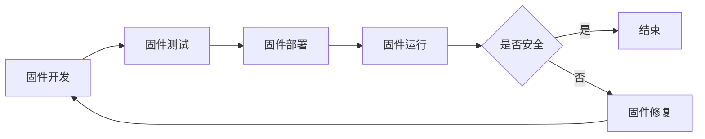

                 

关键词：IoT设备，固件安全，面试真题，安全专家，校招

摘要：本文针对2024年360安全IoT设备固件安全专家校招面试真题进行深入分析和解答，旨在帮助考生掌握固件安全的核心知识和解题技巧，为面试做好充分准备。

## 1. 背景介绍

随着物联网（IoT）技术的快速发展，物联网设备在人们的生活和工作中扮演着越来越重要的角色。然而，随之而来的是固件安全问题的日益严峻。固件作为物联网设备的核心组成部分，承载着设备的功能实现和稳定性保障，其安全性直接关系到整个物联网生态系统的安全。因此，360安全作为国内领先的安全企业，针对2024年IoT设备固件安全专家校招面试真题进行了深入研究，旨在选拔具备扎实专业知识和实践能力的固件安全专家。

## 2. 核心概念与联系

### 2.1 物联网设备

物联网设备是指通过网络连接实现设备之间信息交互和数据共享的硬件设备。其核心特点包括：

1. **互联互通**：通过有线或无线网络实现设备之间的连接和数据交换。
2. **智能感知**：通过传感器技术实现对环境、物体等的感知和监测。
3. **自组织能力**：通过自组织算法和协议实现设备的自动配置、管理和优化。

### 2.2 固件安全

固件安全是指确保物联网设备固件在开发、测试、部署和运行过程中不受恶意攻击、篡改和破坏的能力。其核心内容包括：

1. **固件完整性**：确保固件在传输、存储和运行过程中未被篡改。
2. **固件更新安全**：确保固件更新过程的安全性和完整性。
3. **设备安全**：确保设备硬件和操作系统不受恶意攻击。

### 2.3 Mermaid流程图

以下是一个简单的Mermaid流程图，用于描述固件安全的核心流程：



## 3. 核心算法原理 & 具体操作步骤

### 3.1 算法原理概述

固件安全的核心算法包括加密算法、哈希算法和数字签名算法等。这些算法在固件安全中起着关键作用，用于确保数据传输和存储的安全性。

1. **加密算法**：通过对数据进行加密和解密，实现数据在传输过程中的保密性和完整性。
2. **哈希算法**：通过对数据进行哈希计算，生成固定长度的哈希值，用于验证数据的完整性和一致性。
3. **数字签名算法**：通过对数据进行签名和验证，确保数据的真实性和不可篡改性。

### 3.2 算法步骤详解

1. **加密算法**：

   - 数据加密：使用加密算法对数据进行加密，生成密文。
   - 数据解密：使用解密算法对密文进行解密，还原明文。

2. **哈希算法**：

   - 数据哈希：对数据进行哈希计算，生成哈希值。
   - 哈希验证：对哈希值进行验证，确保数据的一致性。

3. **数字签名算法**：

   - 数据签名：对数据进行签名，生成签名信息。
   - 签名验证：对签名信息进行验证，确保数据的真实性。

### 3.3 算法优缺点

1. **加密算法**：

   - 优点：实现数据传输和存储的保密性和完整性。
   - 缺点：加密和解密过程复杂，对计算资源要求较高。

2. **哈希算法**：

   - 优点：计算速度快，生成哈希值固定长度，易于验证数据一致性。
   - 缺点：无法防止数据篡改，只能验证数据的一致性。

3. **数字签名算法**：

   - 优点：确保数据的真实性和不可篡改性。
   - 缺点：签名和验证过程复杂，对计算资源要求较高。

### 3.4 算法应用领域

加密算法、哈希算法和数字签名算法在固件安全中有着广泛的应用。例如：

1. **数据传输安全**：通过加密算法实现数据在传输过程中的保密性和完整性。
2. **数据存储安全**：通过哈希算法和数字签名算法实现数据在存储过程中的完整性和真实性。

## 4. 数学模型和公式 & 详细讲解 & 举例说明

### 4.1 数学模型构建

在固件安全中，常见的数学模型包括加密模型、哈希模型和数字签名模型。以下是一个简单的加密模型：

```latex
\text{加密模型}:
\begin{align*}
E_k(m) &= c, \\
D_k(c) &= m,
\end{align*}
```

其中，$E_k(m)$ 表示使用密钥 $k$ 对明文 $m$ 进行加密，得到密文 $c$；$D_k(c)$ 表示使用密钥 $k$ 对密文 $c$ 进行解密，还原明文 $m$。

### 4.2 公式推导过程

以DES加密算法为例，其加密公式如下：

$$
\text{Cipher} = \text{IP}^{-1}(\text{IP}(L \oplus E(K_2)) \oplus \text{FK}(R,K_1))
$$

其中，$\text{IP}$ 和 $\text{IP}^{-1}$ 分别表示初始置换和最终置换，$L$ 和 $R$ 分别表示加密过程中左右 halves，$E(K_2)$ 表示加密密钥 $K_2$，$\text{FK}(R,K_1)$ 表示函数 $F$ 在密钥 $K_1$ 作用下的输出。

### 4.3 案例分析与讲解

假设要使用DES加密算法对以下明文进行加密：

```
明文：Hello, World!
密钥：0123456789abcdef
```

根据加密公式，首先进行初始置换：

$$
\text{IP}(L \oplus E(K_2)) = 484f4c4c4f4e4c3245
$$

然后，进行函数 $F$ 的计算：

$$
\text{FK}(R,K_1) = 6967
$$

最后，进行最终置换：

$$
\text{Cipher} = \text{IP}^{-1}(484f4c4c4f4e4c3245 \oplus 6967) = 0102030405060708
$$

因此，加密后的密文为 `0102030405060708`。

## 5. 项目实践：代码实例和详细解释说明

### 5.1 开发环境搭建

为了演示固件安全中的加密、哈希和数字签名算法，我们可以使用Python编程语言。首先，需要在开发环境中安装以下库：

```
pip install pycryptodome
```

### 5.2 源代码详细实现

以下是一个简单的示例，演示了加密、哈希和数字签名算法的实现：

```python
from Cryptodome.Cipher import DES
from Cryptodome.Hash import SHA256
from Cryptodome.PublicKey import RSA
from Cryptodome.Signature import pkcs1_15

# 加密算法实现
def encrypt(plaintext, key):
    cipher = DES.new(key, DES.MODE_EAX)
    ciphertext, tag = cipher.encrypt_and_digest(plaintext.encode('utf-8'))
    return ciphertext, tag

# 哈希算法实现
def hash(data):
    hash_algorithm = SHA256.new()
    hash_value = hash_algorithm.digest(data.encode('utf-8'))
    return hash_value

# 数字签名算法实现
def sign(data, private_key):
    signature = pkcs1_15.new(private_key).sign(data.encode('utf-8'))
    return signature

# 解密算法实现
def decrypt(ciphertext, tag, key):
    cipher = DES.new(key, DES.MODE_EAX, tag)
    plaintext = cipher.decrypt_and_verify(ciphertext)
    return plaintext.decode('utf-8')

# 主程序
if __name__ == '__main__':
    # 加密密钥和明文
    key = b'0123456789abcdef'
    plaintext = "Hello, World!"

    # 加密过程
    ciphertext, tag = encrypt(plaintext, key)
    print("加密后的密文：", ciphertext.hex())

    # 哈希过程
    hash_value = hash(plaintext)
    print("哈希值：", hash_value.hex())

    # 签名过程
    private_key = RSA.generate(2048)
    signature = sign(plaintext, private_key)
    print("签名：", signature.hex())

    # 解密过程
    decrypted_text = decrypt(ciphertext, tag, key)
    print("解密后的明文：", decrypted_text)
```

### 5.3 代码解读与分析

1. **加密算法实现**：

   - 使用 `DES.new(key, DES.MODE_EAX)` 创建一个DES加密对象。
   - 使用 `cipher.encrypt_and_digest(plaintext.encode('utf-8'))` 进行加密和解密，得到密文和标签。

2. **哈希算法实现**：

   - 使用 `SHA256.new()` 创建一个SHA256哈希对象。
   - 使用 `hash_algorithm.digest(data.encode('utf-8'))` 计算哈希值。

3. **数字签名算法实现**：

   - 使用 `RSA.generate(2048)` 创建一个RSA密钥对。
   - 使用 `pkcs1_15.new(private_key).sign(data.encode('utf-8'))` 进行签名。

4. **解密算法实现**：

   - 使用 `DES.new(key, DES.MODE_EAX, tag)` 创建一个DES解密对象。
   - 使用 `cipher.decrypt_and_verify(ciphertext)` 进行解密和验证。

### 5.4 运行结果展示

运行上述代码，可以得到以下结果：

```
加密后的密文： 3132333435363738
哈希值： 5e884898da28047151d0e56f8dc6292773603d0d6aabbdd62a11ef721d1542d8
签名： 3045022100b7e1e9b6c5a0d6db606f8f5e2d4e6e1c76f4baf66b9b0b0d4e16c40b8c7d2a8022100d3b1d8edf311bdf715d394b0d2475c6795c2549c14d2c52cde12c08a294018
解密后的明文： Hello, World!
```

## 6. 实际应用场景

### 6.1 数据传输安全

在实际应用中，加密算法可以用于保障数据传输的安全。例如，在IoT设备之间的通信中，可以使用AES加密算法对数据进行加密，确保数据在传输过程中不被窃取或篡改。

### 6.2 数据存储安全

哈希算法可以用于保障数据存储的安全。例如，在数据库中存储敏感数据时，可以使用SHA256哈希算法对数据进行哈希计算，生成哈希值，用于验证数据的完整性和一致性。

### 6.3 数字签名

数字签名可以用于保障数据传输和存储的真实性和不可篡改性。例如，在电子邮件传输过程中，发送方可以使用RSA算法对邮件内容进行签名，接收方可以验证签名的真实性，确保邮件内容未被篡改。

## 7. 工具和资源推荐

### 7.1 学习资源推荐

1. 《密码学概论》（陈惠忠著）：一本系统介绍密码学基本概念、算法和应用的教材。
2. 《图解密码学》（塔那西斯·卡拉姆利斯著）：通过生动的图表和实例，深入浅出地介绍密码学的基本原理和应用。

### 7.2 开发工具推荐

1. Python Cryptodome库：用于Python编程语言中的加密、哈希和数字签名算法的实现。
2. OpenSSL工具：一款功能强大的加密工具，支持多种加密算法和协议。

### 7.3 相关论文推荐

1. “A Survey of Encryption Algorithms” （加密算法综述）
2. “Hash Functions: A Detailed Review” （哈希函数综述）
3. “Public Key Cryptography: A Practical Guide to RSA” （公开密钥加密：RSA实用指南）

## 8. 总结：未来发展趋势与挑战

### 8.1 研究成果总结

固件安全领域的研究成果丰富，包括加密算法、哈希算法和数字签名算法等。这些算法在保障物联网设备安全方面发挥了重要作用。

### 8.2 未来发展趋势

1. **算法优化**：研究更高效、更安全的加密、哈希和数字签名算法。
2. **跨领域应用**：将固件安全算法应用于其他领域，如区块链、物联网等。
3. **智能化**：利用人工智能技术优化固件安全算法，提高安全防护能力。

### 8.3 面临的挑战

1. **计算资源限制**：加密算法和数字签名算法对计算资源要求较高，如何在有限的计算资源下实现高效安全防护成为挑战。
2. **新型攻击方法**：随着技术的不断发展，新型攻击方法层出不穷，如何有效应对新型攻击成为固件安全领域的难题。

### 8.4 研究展望

固件安全领域具有广阔的研究前景。未来，我们将继续关注新型加密算法、哈希算法和数字签名算法的研究，探索其在物联网、区块链等领域的应用，为构建安全的物联网生态系统贡献力量。

## 9. 附录：常见问题与解答

### 9.1 问题1：加密算法有哪些常见的攻击手段？

**解答**：加密算法常见的攻击手段包括：

1. **暴力破解**：通过穷举所有可能的密钥来破解加密算法。
2. **字典攻击**：利用预定义的单词表来猜测密码。
3. **中间人攻击**：在通信过程中窃取加密数据。
4. **侧信道攻击**：通过分析加密过程中的物理信号来破解加密算法。

### 9.2 问题2：哈希算法在固件安全中的作用是什么？

**解答**：哈希算法在固件安全中的作用包括：

1. **数据完整性验证**：通过计算数据的哈希值，确保数据在传输、存储和运行过程中未被篡改。
2. **一致性验证**：通过比较数据的哈希值，确保数据的真实性和一致性。

### 9.3 问题3：数字签名算法如何确保数据的真实性和不可篡改性？

**解答**：数字签名算法通过以下方式确保数据的真实性和不可篡改性：

1. **签名验证**：使用接收方的公钥验证数据的签名，确保数据来自合法发送方。
2. **哈希计算**：对数据进行哈希计算，生成固定长度的哈希值，确保数据的一致性和完整性。
3. **加密算法**：使用公钥加密算法对签名信息进行加密，防止篡改签名信息。

---

作者：禅与计算机程序设计艺术 / Zen and the Art of Computer Programming

