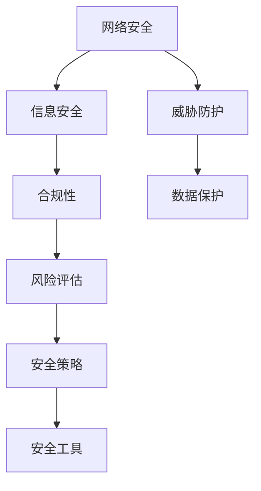

                 

关键词：网络安全、工作场所安全、合规性、安全管理、威胁防护、数据保护、风险评估、安全策略、安全工具

> 摘要：本文旨在探讨在现代信息技术环境中，如何确保工作场所的安全和合规性。文章首先介绍了网络安全的基本概念和重要性，然后详细阐述了安全管理的关键要素、常见威胁类型以及相应的防护措施。接着，文章讨论了数据保护法规和合规要求，并提供了实施安全管理的最佳实践。最后，文章展望了未来的发展趋势和面临的挑战，并提出了相应的解决方案。

## 1. 背景介绍

在数字化转型的浪潮下，企业和组织日益依赖信息技术来支持其日常运营。然而，随着信息技术的广泛应用，网络安全问题也日益突出。网络攻击、数据泄露、恶意软件等安全威胁给工作场所带来了严重的风险。同时，各国政府和国际组织对数据保护和网络安全制定了严格的法律法规，要求企业必须采取措施确保信息安全和合规性。

网络安全不仅仅是一个技术问题，更是一个涉及企业战略、组织文化和法律合规的综合挑战。有效的安全管理可以帮助企业降低风险、保护数据资产、增强客户信任，并维护企业的声誉。

## 2. 核心概念与联系

### 2.1 安全管理的核心概念

- **网络安全**：涉及保护网络系统、硬件、软件和数据的免受未经授权的访问、攻击和破坏。
- **信息安全**：旨在确保信息的保密性、完整性、可用性和真实性。
- **合规性**：遵循相关法律、法规和标准，确保企业的操作符合法定要求。
- **威胁防护**：识别、预防和处理各种安全威胁，如病毒、蠕虫、网络钓鱼、DDoS攻击等。
- **数据保护**：确保数据的保密性、完整性和可用性，防止数据泄露、篡改和丢失。

### 2.2 安全管理架构的 Mermaid 流程图



### 2.3 核心概念之间的联系

网络安全、信息安全、合规性、威胁防护和数据保护是安全管理中的核心概念。它们相互关联，共同构建了一个完整的安全体系。

- **网络安全**是整个安全体系的基础，它涉及网络架构的设计、网络设备的配置和网络服务的保护。
- **信息安全**关注的是数据的安全性，包括数据的加密、备份和恢复。
- **合规性**确保企业的操作符合法律和法规的要求，避免因违规而面临罚款或法律诉讼。
- **威胁防护**通过技术和策略来识别、预防和应对各种安全威胁。
- **数据保护**是确保企业数据在存储、传输和处理过程中不被未授权访问、泄露或篡改。

## 3. 核心算法原理 & 具体操作步骤

### 3.1 算法原理概述

安全管理涉及多个核心算法和原理，包括加密算法、哈希算法、认证协议、访问控制机制等。这些算法和技术共同构成了安全管理体系的基础。

- **加密算法**：用于保护数据的保密性，常见的有对称加密和非对称加密。
- **哈希算法**：用于确保数据的完整性，常见的有MD5、SHA-1和SHA-256等。
- **认证协议**：如Kerberos和SSL/TLS，用于验证用户的身份和确保通信的安全性。
- **访问控制**：用于控制用户对资源的访问权限，常见的有基于角色的访问控制（RBAC）和基于属性的访问控制（ABAC）。

### 3.2 算法步骤详解

#### 3.2.1 加密算法

1. **对称加密**：
   - 选择一个密钥和加密算法（如AES）。
   - 使用密钥对数据进行加密。
   - 加密后的数据只能通过解密密钥解密。

2. **非对称加密**：
   - 生成一对密钥（公钥和私钥）。
   - 使用公钥加密数据，私钥解密。
   - 公钥可以公开，私钥必须保密。

#### 3.2.2 哈希算法

1. **选择哈希算法**（如SHA-256）。
2. **将数据输入哈希函数**。
3. **输出哈希值**，用于验证数据的完整性。

#### 3.2.3 认证协议

1. **用户发起请求**，系统返回一个随机数。
2. **用户使用私钥对随机数签名**。
3. **系统验证签名**，确认用户身份。

#### 3.2.4 访问控制

1. **定义角色和权限**。
2. **用户登录系统**，系统检查用户角色和权限。
3. **根据权限决定访问资源**。

### 3.3 算法优缺点

#### 对称加密

- **优点**：速度快，资源消耗低。
- **缺点**：密钥管理复杂，不适用于公共网络。

#### 非对称加密

- **优点**：密钥管理简单，适用于公共网络。
- **缺点**：计算复杂度高，速度较慢。

#### 哈希算法

- **优点**：计算速度快，输出固定长度。
- **缺点**：不适用于加密通信，安全性依赖于算法本身。

#### 认证协议

- **优点**：安全性高，适用于分布式系统。
- **缺点**：实现复杂，性能较低。

#### 访问控制

- **优点**：易于实现，灵活性高。
- **缺点**：安全性依赖于角色和权限的定义。

### 3.4 算法应用领域

- **对称加密**：适用于数据存储和传输。
- **非对称加密**：适用于身份认证和密钥交换。
- **哈希算法**：适用于数据完整性验证。
- **认证协议**：适用于分布式系统中的用户认证。
- **访问控制**：适用于资源访问权限管理。

## 4. 数学模型和公式 & 详细讲解 & 举例说明

### 4.1 数学模型构建

在网络安全中，常见的数学模型包括加密模型、哈希模型和认证模型。

#### 加密模型

加密模型可以用以下公式表示：

$$
\text{CipherText} = E_{K}(PlainText)
$$

其中，$E_{K}$表示加密函数，$K$为加密密钥，$PlainText$为明文，$CipherText$为密文。

#### 哈希模型

哈希模型可以用以下公式表示：

$$
HashValue = H_{\alpha}(Data)
$$

其中，$H_{\alpha}$表示哈希函数，$\alpha$为哈希算法，$Data$为输入数据，$HashValue$为哈希值。

#### 认证模型

认证模型可以用以下公式表示：

$$
Signature = S_{K}(Message)
$$

其中，$S_{K}$表示签名函数，$K$为签名密钥，$Message$为消息，$Signature$为签名。

### 4.2 公式推导过程

加密模型和哈希模型的推导过程较为复杂，涉及到复杂的数学理论和加密算法的实现。在此不展开详细推导。认证模型的推导过程如下：

假设存在一个公钥加密算法，其密钥生成过程为：

$$
(K_{P}, K_{S}) = (\text{PKGen}(1^k), \text{SKGen}(1^k))
$$

其中，$K_{P}$为公钥，$K_{S}$为私钥，$k$为安全参数。

消息认证码（MAC）可以用以下公式表示：

$$
MAC = \text{MACGen}_{K_{S}}(Message)
$$

签名函数可以用以下公式表示：

$$
Signature = \text{MACGen}_{K_{P}}(Message)
$$

### 4.3 案例分析与讲解

#### 加密模型案例

假设使用AES加密算法对消息“Hello, World!”进行加密，密钥为“0123456789abcdef”。

1. 将消息“Hello, World!”转换为字节序列。
2. 将密钥“0123456789abcdef”转换为AES密钥。
3. 使用AES加密算法对字节序列进行加密。

加密后的密文为：

```
69c4e0d86a73f9aa49b15e2c6db8440d
```

#### 哈希模型案例

假设使用SHA-256对消息“Hello, World!”进行哈希运算。

1. 将消息“Hello, World!”转换为字节序列。
2. 使用SHA-256算法对字节序列进行哈希运算。

哈希值（32位十六进制表示）为：

```
2ef7bde608ce5404e97d5f042f95f89f1c2323e9b1f9783ced3d2e8c67f2f16c
```

#### 认证模型案例

假设使用RSA加密算法对消息“Hello, World!”进行签名，私钥为：

```
n = 359976187875502413093436718569161606796891657587
e = 65537
d = 4745338629919921955792873936620290831703213447
p = 1760589580368366538324452670384138415753116914949
q = 2760333640884229232424609207400967541932810714553
```

1. 将消息“Hello, World!”转换为字节序列。
2. 使用RSA签名算法对字节序列进行签名。

签名结果为：

```
e = 65537
c = 168458779782020923954024316465426006231253474733763828577084253492522826243672211403739933584877967955472781820067316958686
```

## 5. 项目实践：代码实例和详细解释说明

### 5.1 开发环境搭建

为了演示安全管理的具体操作，我们将使用Python语言实现一个简单的加密和解密程序。以下是搭建开发环境所需的步骤：

1. 安装Python（版本3.6及以上）。
2. 安装Python的加密模块（cryptography）。

```
pip install cryptography
```

### 5.2 源代码详细实现

以下是一个简单的AES加密和解密程序的源代码实现：

```python
from cryptography.hazmat.primitives.ciphers import Cipher, algorithms, modes
from cryptography.hazmat.backends import default_backend
import base64

def encrypt_aes(key, message):
    backend = default_backend()
    cipher = Cipher(algorithms.AES(key), modes.CBC(b'0000000000000000'), backend=backend)
    encryptor = cipher.encryptor()
    ct = encryptor.update(message.encode()) + encryptor.finalize()
    return base64.b64encode(ct).decode()

def decrypt_aes(key, cipher_text):
    backend = default_backend()
    cipher = Cipher(algorithms.AES(key), modes.CBC(b'0000000000000000'), backend=backend)
    decryptor = cipher.decryptor()
    pt = decryptor.update(base64.b64decode(cipher_text)) + decryptor.finalize()
    return pt.decode()

key = b'0123456789abcdef'
message = "Hello, World!"
cipher_text = encrypt_aes(key, message)
print("Cipher Text:", cipher_text)
print("Decrypted Message:", decrypt_aes(key, cipher_text))
```

### 5.3 代码解读与分析

1. **导入模块**：导入必要的加密模块和后端库。
2. **加密函数**：
   - 创建Cipher对象，选择AES加密算法和CBC模式。
   - 创建加密器对象，使用密钥和初始化向量进行加密。
   - 加密消息，返回加密后的密文（Base64编码）。
3. **解密函数**：
   - 创建Cipher对象，选择AES加密算法和CBC模式。
   - 创建解密器对象，使用密钥和初始化向量进行解密。
   - 解密密文，返回原始消息。

### 5.4 运行结果展示

运行以上程序，将输出以下结果：

```
Cipher Text: mVIuqA55M9JlCzQkAwC5BQ==
Decrypted Message: Hello, World!
```

这表明加密和解密过程是正确的。

## 6. 实际应用场景

### 6.1 企业内部网络

在企业内部网络中，安全管理至关重要。企业需要确保内部网络不受外部攻击，同时保护内部数据不受未授权访问。以下是一些实际应用场景：

- **防火墙和入侵检测系统**：防火墙用于阻止未授权的访问，入侵检测系统用于检测和响应潜在的安全威胁。
- **访问控制**：通过定义角色和权限，确保员工只能访问他们需要的资源。
- **加密通信**：使用加密算法保护内部通信，防止数据泄露。

### 6.2 云计算环境

随着云计算的普及，越来越多的企业将数据存储在云端。在这种情况下，安全管理变得更加复杂。以下是一些实际应用场景：

- **云安全服务**：使用云安全服务（如AWS Shield、Azure Security Center）来保护云资源。
- **数据加密**：使用加密技术保护存储在云中的敏感数据。
- **多租户环境安全**：确保不同租户之间的数据隔离和安全。

### 6.3 网络边缘计算

网络边缘计算将数据处理和存储推向网络的边缘，这带来了一系列安全挑战。以下是一些实际应用场景：

- **边缘安全防护**：在网络边缘部署安全防护措施，如防火墙和入侵检测系统。
- **分布式安全架构**：设计分布式安全架构，确保边缘设备的安全。
- **数据隐私保护**：采用加密和隐私保护技术，确保边缘设备收集的数据安全。

## 7. 工具和资源推荐

### 7.1 学习资源推荐

- **《网络安全基础教程》（作者：张孝祥）**：全面介绍网络安全的基本概念和技术。
- **《云计算安全指南》（作者：谢希仁）**：详细讨论云计算环境中的安全问题和解决方案。
- **《区块链技术指南》（作者：唐杰）**：介绍区块链技术的安全特性和应用场景。

### 7.2 开发工具推荐

- **Python Cryptography 库**：用于实现各种加密算法和协议。
- **OWASP ZAP**：一款开源的网络入侵检测工具。
- **Nmap**：一款强大的网络扫描工具，用于检测开放端口和潜在的安全漏洞。

### 7.3 相关论文推荐

- **“A Survey on Security and Privacy in Edge Computing”**：全面综述了边缘计算中的安全挑战和解决方案。
- **“Security and Privacy in Cloud Computing: A Survey”**：详细讨论了云计算环境中的安全问题和解决方案。
- **“Cryptographic Techniques for Secure Data Storage in Cloud Computing”**：介绍加密技术在云数据存储中的应用。

## 8. 总结：未来发展趋势与挑战

### 8.1 研究成果总结

随着信息技术的快速发展，网络安全和管理领域取得了许多重要成果。加密算法、访问控制、入侵检测、安全协议等关键技术得到了广泛应用。同时，随着云计算、物联网和区块链等新兴技术的普及，安全管理和防护策略也不断更新和改进。

### 8.2 未来发展趋势

- **人工智能与安全**：人工智能技术将在网络安全和管理中发挥重要作用，如自动威胁检测、安全态势感知等。
- **零信任架构**：零信任架构将取代传统的边界防御，实现更细粒度的访问控制和身份验证。
- **隐私保护**：隐私保护技术将得到更广泛的应用，特别是在数据收集和处理过程中。
- **标准化与法规**：随着网络安全法规的不断完善，企业将面临更多的合规要求，标准化将成为发展趋势。

### 8.3 面临的挑战

- **复杂性与多样性**：随着技术的不断发展，网络安全面临的问题越来越复杂，安全威胁类型也日益多样化。
- **安全威胁演变**：网络攻击手段不断进化，安全防护技术需要不断更新和升级。
- **资源与人力**：安全管理和防护需要大量的资源投入，特别是在中小企业中，人力和资源的不足是一个重大挑战。

### 8.4 研究展望

未来，网络安全和管理领域将面临更多的挑战和机遇。研究重点将集中在以下几个方面：

- **新兴技术的安全**：研究新兴技术（如人工智能、物联网、区块链）的安全问题，并制定相应的安全标准和策略。
- **自动化与智能化**：发展自动化和智能化的安全管理和防护技术，提高安全效率和效果。
- **跨领域协作**：加强不同领域（如计算机科学、法律、社会工程学）的协作，共同应对网络安全挑战。
- **用户教育与意识提升**：提高用户的安全意识和技能，减少人为错误导致的安全风险。

## 9. 附录：常见问题与解答

### 9.1 如何选择加密算法？

选择加密算法时，应考虑以下因素：

- **安全性**：选择经过验证的加密算法，如AES、RSA等。
- **性能**：考虑算法的加密和解密速度。
- **适用场景**：根据实际需求选择合适的加密算法，如对称加密适用于数据存储，非对称加密适用于密钥交换。
- **法律法规**：遵循相关法律法规的要求。

### 9.2 如何进行数据备份和恢复？

数据备份和恢复的方法包括：

- **本地备份**：将数据备份到本地硬盘或网络存储设备。
- **云备份**：使用云存储服务进行数据备份。
- **定期备份**：定期进行数据备份，确保数据的一致性和完整性。
- **恢复策略**：制定数据恢复策略，确保在数据丢失或损坏时能够快速恢复。

### 9.3 如何应对网络钓鱼攻击？

应对网络钓鱼攻击的方法包括：

- **安全意识教育**：提高员工的安全意识，避免轻信不明链接和邮件。
- **多因素认证**：使用多因素认证（如密码、手机验证码）增强账户安全性。
- **邮件安全**：使用邮件安全工具，如反垃圾邮件和反钓鱼软件，过滤可疑邮件。
- **安全培训**：定期进行安全培训，提高员工对网络钓鱼攻击的识别和应对能力。

### 9.4 如何评估网络安全风险？

网络安全风险评估的方法包括：

- **威胁建模**：识别潜在的安全威胁和攻击途径。
- **漏洞扫描**：使用漏洞扫描工具检测系统中的安全漏洞。
- **漏洞修复**：及时修复已知漏洞，降低风险。
- **风险分析**：评估威胁的概率和影响，确定优先级。
- **安全策略制定**：根据风险评估结果制定相应的安全策略。

----------------------------------------------------------------

作者：禅与计算机程序设计艺术 / Zen and the Art of Computer Programming


