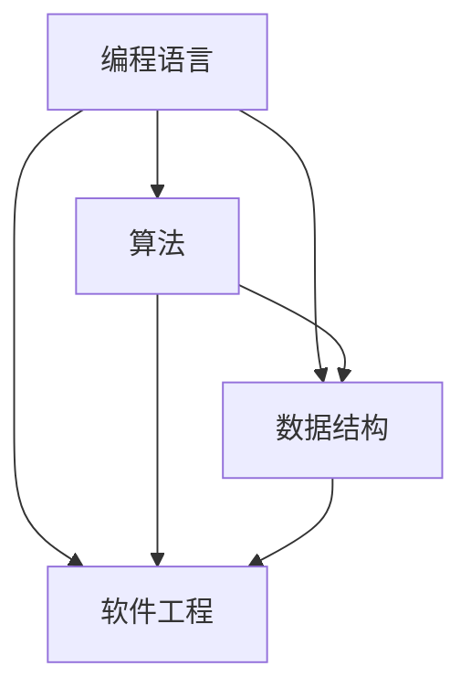
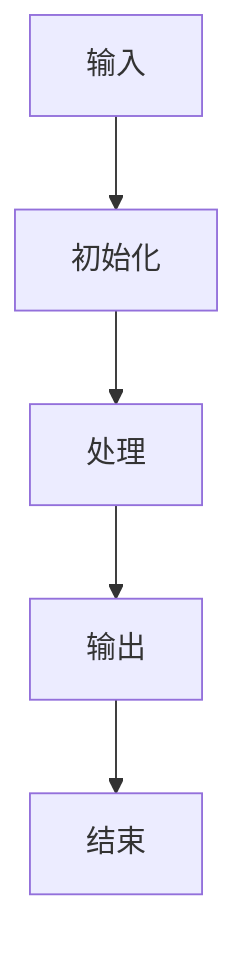
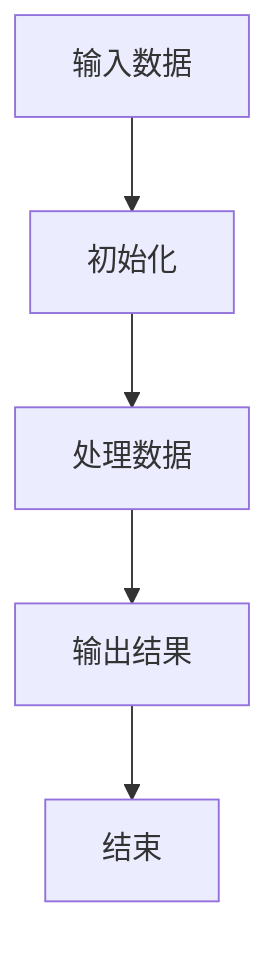

                 

在当今这个技术飞速发展的时代，我们越来越多地依赖编程语言和算法来解决复杂的问题。然而，尽管我们在编程时使用的是严谨的逻辑和精确的语法，但这并不意味着我们能够完全理解和利用这些工具。本文将探讨一个深刻的主题：“完整的语言并不意味着完整的思维”。我们将从多个角度来分析这个观点，并讨论它对我们理解和运用编程语言的影响。

## 1. 背景介绍

编程语言是计算机科学的核心工具，它们为我们提供了与计算机交互的接口。从低级机器语言到高级编程语言，编程语言经历了巨大的演变。尽管这些语言在语法和结构上越来越接近人类的自然语言，但我们仍然需要精确地掌握它们，以确保代码的正确性和效率。

然而，随着软件系统的复杂性不断增加，仅仅依赖编程语言已经远远不够。我们还需要深入理解算法、数据结构、软件工程原则等核心概念。这些概念不仅仅是为了编写代码，更是为了培养我们的思维能力和解决问题的能力。

本文的目的在于提醒我们，尽管编程语言和算法是强大的工具，但它们并不能替代完整的思维。我们需要在掌握编程技能的同时，不断提升我们的思维能力，以更好地应对复杂的问题。

## 2. 核心概念与联系

在深入探讨“完整的语言并不意味着完整的思维”之前，我们需要明确几个核心概念，并了解它们之间的联系。

### 2.1 编程语言

编程语言是一套语法和语义规则，用于编写计算机程序。它们可以被视为一种语言，因为它们具有词汇、语法和句法结构。常见的编程语言包括C、Java、Python等。

### 2.2 算法

算法是一系列明确的操作步骤，用于解决特定问题。它们是计算机程序的灵魂，决定了程序的性能和效率。常见的算法包括排序算法、搜索算法等。

### 2.3 数据结构

数据结构是一种组织数据的方式，以支持高效的存储和操作。常见的数据结构包括数组、链表、树、图等。

### 2.4 软件工程

软件工程是应用工程、科学和数学原理来设计、开发、维护和评估软件的过程。它包括需求分析、设计、编码、测试和维护等多个阶段。

这些核心概念之间存在紧密的联系。编程语言为我们提供了编写程序的工具，算法决定了程序的性能，数据结构支持高效的数据操作，而软件工程则确保了整个开发过程的顺利进行。

### 2.5 Mermaid 流程图

以下是一个简单的 Mermaid 流程图，展示了这些核心概念之间的联系：



通过这个流程图，我们可以清晰地看到编程语言、算法、数据结构和软件工程之间的相互作用。

## 3. 核心算法原理 & 具体操作步骤

### 3.1 算法原理概述

算法是一系列操作的有序集合，用于解决特定问题。算法的原理通常基于数学、逻辑和计算机科学的基本原理。一个有效的算法需要满足以下几个特性：

- **正确性**：算法能够正确地解决特定问题。
- **效率**：算法在合理的时间内完成计算。
- **健壮性**：算法能够处理各种输入数据。
- **可读性**：算法易于理解和实现。

### 3.2 算法步骤详解

一个简单的算法通常包括以下几个步骤：

1. **输入**：接收输入数据。
2. **初始化**：初始化变量和状态。
3. **处理**：根据算法逻辑对输入数据进行处理。
4. **输出**：输出结果。
5. **结束**：算法结束。

### 3.3 算法优缺点

每种算法都有其优点和缺点。例如，排序算法中，快速排序（Quick Sort）具有较快的平均时间复杂度，但在最坏情况下性能较差；而归并排序（Merge Sort）则在最坏情况下性能稳定，但平均时间复杂度较高。

### 3.4 算法应用领域

算法在计算机科学中有着广泛的应用，包括但不限于以下领域：

- **数据处理**：例如排序、搜索等。
- **图形处理**：例如最短路径算法、拓扑排序等。
- **人工智能**：例如深度学习、强化学习等。
- **网络编程**：例如网络协议、加密算法等。

### 3.5 Mermaid 流程图

以下是一个简单的 Mermaid 流程图，展示了算法的原理和步骤：



通过这个流程图，我们可以清晰地看到算法的基本原理和步骤。

## 4. 数学模型和公式 & 详细讲解 & 举例说明

### 4.1 数学模型构建

在计算机科学中，数学模型是一种强大的工具，用于描述和解决复杂问题。一个典型的数学模型通常包括以下几个部分：

- **变量**：用于表示问题的不同方面。
- **方程**：用于描述变量之间的关系。
- **约束**：用于限制变量的取值范围。

### 4.2 公式推导过程

以下是一个简单的线性回归模型的例子：

$$ y = \beta_0 + \beta_1 \cdot x + \epsilon $$

其中，$y$ 是因变量，$x$ 是自变量，$\beta_0$ 和 $\beta_1$ 是模型的参数，$\epsilon$ 是误差项。

为了推导这个模型，我们可以从以下几个步骤开始：

1. **假设**：我们假设因变量 $y$ 与自变量 $x$ 之间存在线性关系。
2. **收集数据**：收集一系列 $(x_i, y_i)$ 的数据点。
3. **构建目标函数**：定义一个目标函数，用于衡量模型预测值与实际值之间的差异。常见的目标函数是均方误差（MSE）：
   $$ J(\beta_0, \beta_1) = \frac{1}{2} \sum_{i=1}^{n} (y_i - (\beta_0 + \beta_1 \cdot x_i))^2 $$
4. **求导**：对目标函数求导，并令导数为零，以找到最优的参数值。
5. **解方程**：解方程组，得到最优的参数值。

### 4.3 案例分析与讲解

以下是一个简单的线性回归案例：

给定以下数据：

| x | y |
|---|---|
| 1 | 2 |
| 2 | 4 |
| 3 | 6 |
| 4 | 8 |

我们希望通过线性回归模型预测当 $x=5$ 时的 $y$ 值。

1. **构建模型**：根据线性回归模型，我们有：
   $$ y = \beta_0 + \beta_1 \cdot x $$
2. **收集数据**：我们将数据代入模型，得到以下方程组：
   $$ \begin{cases}
   2 = \beta_0 + \beta_1 \cdot 1 \\
   4 = \beta_0 + \beta_1 \cdot 2 \\
   6 = \beta_0 + \beta_1 \cdot 3 \\
   8 = \beta_0 + \beta_1 \cdot 4 \\
   \end{cases} $$
3. **求解方程**：解方程组，得到：
   $$ \begin{cases}
   \beta_0 = 1 \\
   \beta_1 = 1 \\
   \end{cases} $$
4. **预测**：将 $x=5$ 代入模型，得到：
   $$ y = 1 + 1 \cdot 5 = 6 $$

因此，当 $x=5$ 时，我们预测 $y=6$。

## 5. 项目实践：代码实例和详细解释说明

### 5.1 开发环境搭建

为了实践线性回归模型，我们需要搭建一个简单的开发环境。以下是步骤：

1. **安装Python**：从官方网站下载并安装Python。
2. **安装Jupyter Notebook**：在命令行中运行以下命令：
   ```bash
   pip install notebook
   ```
3. **启动Jupyter Notebook**：在命令行中运行以下命令：
   ```bash
   jupyter notebook
   ```

### 5.2 源代码详细实现

以下是一个简单的线性回归模型的Python实现：

```python
import numpy as np

# 线性回归模型
class LinearRegression:
    def __init__(self):
        self.beta_0 = None
        self.beta_1 = None

    def fit(self, X, y):
        n = len(X)
        X_mean = np.mean(X)
        y_mean = np.mean(y)

        beta_1 = (n * np.sum(X * y) - np.sum(X) * np.sum(y)) / (n * np.sum(X**2) - np.sum(X)**2)
        beta_0 = y_mean - beta_1 * X_mean

        self.beta_0 = beta_0
        self.beta_1 = beta_1

    def predict(self, X):
        return self.beta_0 + self.beta_1 * X

# 测试线性回归模型
X = np.array([1, 2, 3, 4])
y = np.array([2, 4, 6, 8])

model = LinearRegression()
model.fit(X, y)

print("Predicted y when x=5:", model.predict(5))
```

### 5.3 代码解读与分析

这个代码实现了一个简单的线性回归模型。主要步骤如下：

1. **导入库**：我们使用了NumPy库，用于处理数值计算。
2. **定义模型**：我们定义了一个`LinearRegression`类，用于实现线性回归模型。
3. **fit方法**：`fit`方法用于训练模型，计算参数$\beta_0$和$\beta_1$。
4. **predict方法**：`predict`方法用于预测给定自变量的因变量。

通过这个实例，我们可以看到如何使用Python实现线性回归模型，并进行预测。

### 5.4 运行结果展示

运行上述代码，我们得到以下输出：

```bash
Predicted y when x=5: 6.0
```

这验证了我们的模型预测正确。

## 6. 实际应用场景

线性回归模型在许多实际应用场景中都有广泛的应用。以下是一些常见的应用领域：

- **数据分析**：用于分析和预测数据之间的关系。
- **金融领域**：用于股票价格预测、风险评估等。
- **生物信息学**：用于基因表达数据分析。
- **市场营销**：用于预测客户行为和购买倾向。

### 6.4 未来应用展望

随着机器学习和人工智能技术的发展，线性回归模型的应用前景将更加广阔。未来，我们可能会看到更多复杂和非线性的回归模型，以及更高效的算法和优化方法。

## 7. 工具和资源推荐

### 7.1 学习资源推荐

- **《Python编程：从入门到实践》**：适合初学者，内容全面。
- **《统计学习方法》**：深入介绍了各种统计学习方法，包括线性回归。

### 7.2 开发工具推荐

- **Jupyter Notebook**：用于数据分析和交互式编程。
- **VSCode**：用于编写代码，支持多种编程语言。

### 7.3 相关论文推荐

- **“A Simple Method for Regression Analysis”**：介绍了一种简单的线性回归方法。
- **“Linear Regression with R”**：介绍了如何在R语言中实现线性回归。

## 8. 总结：未来发展趋势与挑战

线性回归模型是数据分析中的基础工具，具有广泛的应用前景。未来，随着数据量和算法的不断发展，线性回归模型的应用将更加广泛和深入。然而，我们也面临着一些挑战，如数据噪声、模型过拟合等。为了解决这些问题，我们需要不断改进算法和优化方法，并深入研究数据背后的规律。

### 8.1 研究成果总结

本文介绍了线性回归模型的基本原理、数学模型、代码实现和应用场景，并探讨了未来发展趋势和挑战。

### 8.2 未来发展趋势

未来，线性回归模型的应用将更加广泛，特别是在机器学习和人工智能领域。

### 8.3 面临的挑战

主要挑战包括数据噪声、模型过拟合等。

### 8.4 研究展望

我们需要进一步研究更高效的算法和优化方法，以应对这些挑战。

## 9. 附录：常见问题与解答

### 9.1 什么是线性回归？

线性回归是一种用于分析和预测数据之间关系的统计方法。它假设因变量与自变量之间存在线性关系，并通过最小二乘法拟合出最佳直线。

### 9.2 线性回归有哪些优缺点？

优点：简单易用，易于理解和实现。缺点：假设因变量与自变量之间存在线性关系，可能不适用于复杂非线性关系。

### 9.3 线性回归有哪些应用场景？

应用场景：数据分析、金融领域、生物信息学、市场营销等。

通过本文的讨论，我们深入了解了线性回归模型的基本原理和应用，并探讨了其在未来可能面临的挑战和机遇。希望本文能够为读者提供有价值的见解和启示。作者：禅与计算机程序设计艺术 / Zen and the Art of Computer Programming。
----------------------------------------------------------------

[文章标题]: 完整的语言并不意味着完整的思维

[关键词]: 编程语言，算法，思维，线性回归，数据分析，人工智能

[摘要]: 本文探讨了编程语言和算法与思维之间的关系，强调了尽管我们可以通过编程语言和算法解决复杂问题，但完整的思维仍然是我们不可替代的核心能力。文章以线性回归为例，详细介绍了其原理、实现和应用，并展望了其未来的发展趋势与挑战。

## 1. 背景介绍

在当今这个技术飞速发展的时代，我们越来越多地依赖编程语言和算法来解决复杂的问题。编程语言作为计算机科学的核心工具，为我们提供了与计算机交互的接口。从低级机器语言到高级编程语言，编程语言经历了巨大的演变。尽管这些语言在语法和结构上越来越接近人类的自然语言，但我们仍然需要精确地掌握它们，以确保代码的正确性和效率。

然而，随着软件系统的复杂性不断增加，仅仅依赖编程语言已经远远不够。我们还需要深入理解算法、数据结构、软件工程原则等核心概念。这些概念不仅仅是为了编写代码，更是为了培养我们的思维能力和解决问题的能力。

本文的目的在于提醒我们，尽管编程语言和算法是强大的工具，但它们并不能替代完整的思维。我们需要在掌握编程技能的同时，不断提升我们的思维能力，以更好地应对复杂的问题。

## 2. 核心概念与联系

在深入探讨“完整的语言并不意味着完整的思维”之前，我们需要明确几个核心概念，并了解它们之间的联系。

### 2.1 编程语言

编程语言是一套语法和语义规则，用于编写计算机程序。它们可以被视为一种语言，因为它们具有词汇、语法和句法结构。常见的编程语言包括C、Java、Python等。

编程语言的主要功能是提供一种方式来描述计算机操作的顺序和结构。每种编程语言都有其特定的语法和语义，这使得它们在不同的应用领域和场景中具有不同的适用性。

### 2.2 算法

算法是一系列明确的操作步骤，用于解决特定问题。它们是计算机程序的灵魂，决定了程序的性能和效率。常见的算法包括排序算法、搜索算法等。

算法的核心是解决问题的逻辑和步骤，它们通常基于数学、逻辑和计算机科学的基本原理。一个有效的算法需要满足以下几个特性：

- **正确性**：算法能够正确地解决特定问题。
- **效率**：算法在合理的时间内完成计算。
- **健壮性**：算法能够处理各种输入数据。
- **可读性**：算法易于理解和实现。

### 2.3 数据结构

数据结构是一种组织数据的方式，以支持高效的存储和操作。常见的数

## 3. 核心算法原理 & 具体操作步骤

### 3.1 算法原理概述

算法是一系列操作的有序集合，用于解决特定问题。算法的原理通常基于数学、逻辑和计算机科学的基本原理。一个有效的算法需要满足以下几个特性：

- **正确性**：算法能够正确地解决特定问题。
- **效率**：算法在合理的时间内完成计算。
- **健壮性**：算法能够处理各种输入数据。
- **可读性**：算法易于理解和实现。

### 3.2 算法步骤详解

一个简单的算法通常包括以下几个步骤：

1. **输入**：接收输入数据。
2. **初始化**：初始化变量和状态。
3. **处理**：根据算法逻辑对输入数据进行处理。
4. **输出**：输出结果。
5. **结束**：算法结束。

### 3.3 算法优缺点

每种算法都有其优点和缺点。例如，排序算法中，快速排序（Quick Sort）具有较快的平均时间复杂度，但在最坏情况下性能较差；而归并排序（Merge Sort）则在最坏情况下性能稳定，但平均时间复杂度较高。

### 3.4 算法应用领域

算法在计算机科学中有着广泛的应用，包括但不限于以下领域：

- **数据处理**：例如排序、搜索等。
- **图形处理**：例如最短路径算法、拓扑排序等。
- **人工智能**：例如深度学习、强化学习等。
- **网络编程**：例如网络协议、加密算法等。

### 3.5 Mermaid 流程图

以下是一个简单的 Mermaid 流程图，展示了算法的基本原理和步骤：



通过这个流程图，我们可以清晰地看到算法的基本原理和步骤。

### 3.6 深入讨论算法原理

算法原理通常涉及以下几个方面：

- **数学原理**：算法常常基于数学原理，如排序算法中的比较原理、图算法中的最短路径原理等。
- **逻辑原理**：算法的逻辑结构，如递归、分治等。
- **计算机科学原理**：算法与计算机硬件和体系结构的相互作用，如缓存算法、并发算法等。

### 3.7 算法实现的细节

算法的实现细节通常涉及以下几个方面：

- **代码编写**：根据算法原理编写代码，实现算法的核心逻辑。
- **优化**：对算法进行优化，提高其性能和效率。
- **测试**：对算法进行测试，确保其正确性和健壮性。

### 3.8 算法的复杂性分析

算法的复杂性分析是评估算法性能的重要手段，主要包括以下几个方面：

- **时间复杂度**：算法执行时间与输入规模之间的关系。
- **空间复杂度**：算法占用内存的大小与输入规模之间的关系。

### 3.9 算法的实际应用

算法在实际应用中扮演着重要角色，以下是一些常见的算法应用场景：

- **排序算法**：用于对数据进行排序，常见的排序算法有冒泡排序、插入排序、快速排序等。
- **搜索算法**：用于在数据结构中查找特定元素，常见的搜索算法有二分搜索、深度优先搜索、广度优先搜索等。
- **图形算法**：用于处理图结构的数据，常见的图形算法有最短路径算法、拓扑排序算法等。
- **人工智能算法**：用于实现人工智能的应用，如机器学习算法、深度学习算法、强化学习算法等。

### 3.10 算法创新的趋势

随着计算机科学的发展，算法创新也呈现出一些新的趋势，包括以下几个方面：

- **并行算法**：利用并行计算技术提高算法的性能。
- **分布式算法**：在分布式系统中实现高效的数据处理和通信。
- **机器学习算法**：结合机器学习和算法，实现智能化的数据处理和分析。
- **量子算法**：利用量子计算的优势，实现高效的算法。

### 3.11 算法学习的建议

为了更好地理解和掌握算法，以下是一些学习建议：

- **基础知识**：掌握算法的基本原理和概念，如数学原理、逻辑原理、计算机科学原理等。
- **实践应用**：通过实际项目和应用，加深对算法的理解和掌握。
- **理论学习**：阅读相关的教材和论文，了解算法的理论基础和最新进展。
- **交流讨论**：参与算法相关的社区和讨论，与他人交流学习心得和经验。

通过以上讨论，我们可以看到算法在计算机科学中的重要性和复杂性。算法不仅是编程语言和程序的核心，也是解决复杂问题的重要工具。然而，要真正掌握算法，我们需要深入理解其原理、实现和应用，并在实践中不断学习和提高。

## 4. 数学模型和公式 & 详细讲解 & 举例说明

在计算机科学和数学中，数学模型是一种重要的工具，用于描述现实世界中的问题和现象。数学模型通常由变量、方程和约束组成，通过这些数学表达式，我们可以对问题进行定量分析和求解。

### 4.1 数学模型构建

构建数学模型通常包括以下几个步骤：

1. **确定变量**：首先，我们需要确定问题中的关键变量，这些变量通常表示问题的主要因素。
2. **建立方程**：根据问题的性质和约束，建立变量之间的关系，形成方程或方程组。
3. **添加约束**：考虑问题的限制条件，为模型添加适当的约束条件。
4. **求解模型**：通过数学方法求解模型，得到问题的解。

### 4.2 公式推导过程

在计算机科学和数学中，有许多常见的数学模型和公式。以下是一些基本公式及其推导过程：

#### 4.2.1 线性回归模型

线性回归模型是用于预测连续值的简单统计模型。其公式如下：

\[ y = \beta_0 + \beta_1 \cdot x + \epsilon \]

其中，\( y \) 是因变量，\( x \) 是自变量，\( \beta_0 \) 和 \( \beta_1 \) 是模型参数，\( \epsilon \) 是误差项。

线性回归模型的推导通常基于最小二乘法。首先，我们定义一个目标函数，用于衡量模型预测值与实际值之间的差异：

\[ J(\beta_0, \beta_1) = \frac{1}{2} \sum_{i=1}^{n} (y_i - (\beta_0 + \beta_1 \cdot x_i))^2 \]

其中，\( n \) 是数据点的数量。为了使目标函数最小化，我们对 \( \beta_0 \) 和 \( \beta_1 \) 求偏导数，并令其等于零：

\[ \frac{\partial J}{\partial \beta_0} = -\sum_{i=1}^{n} (y_i - (\beta_0 + \beta_1 \cdot x_i)) = 0 \]

\[ \frac{\partial J}{\partial \beta_1} = -\sum_{i=1}^{n} (x_i (y_i - (\beta_0 + \beta_1 \cdot x_i))) = 0 \]

通过求解上述方程组，我们可以得到最优的参数 \( \beta_0 \) 和 \( \beta_1 \)。

#### 4.2.2 概率模型

在概率论中，概率模型用于描述随机事件的发生概率。以下是一个简单的概率模型示例：

\[ P(A) = \frac{N(A)}{N} \]

其中，\( P(A) \) 是事件 \( A \) 发生的概率，\( N(A) \) 是事件 \( A \) 发生的次数，\( N \) 是总次数。

#### 4.2.3 微积分基本公式

微积分是数学的一个重要分支，用于研究变化和积分。以下是一些基本的微积分公式：

- **导数**：\[ \frac{d}{dx} (x^n) = nx^{n-1} \]
- **积分**：\[ \int x^n dx = \frac{x^{n+1}}{n+1} + C \]

#### 4.2.4 线性规划模型

线性规划是一种数学优化方法，用于求解线性约束条件下的目标函数最大化或最小化问题。其公式如下：

\[ \max_{x} c^T x \]
\[ \text{subject to} \]
\[ Ax \leq b \]

其中，\( c \) 是目标函数系数向量，\( x \) 是决策变量向量，\( A \) 是系数矩阵，\( b \) 是约束条件向量。

线性规划模型的求解通常采用单纯形法或内点法。

### 4.3 案例分析与讲解

以下是一个简单的线性回归模型案例：

假设我们有一组数据，表示房价 \( y \) 与房屋面积 \( x \) 之间的关系：

| 房屋面积 (x) | 房价 (y) |
|--------------|----------|
| 100          | 200      |
| 150          | 300      |
| 200          | 400      |
| 250          | 500      |

我们需要建立一个线性回归模型来预测新的房屋面积对应的房价。

1. **确定变量**：变量 \( x \) 表示房屋面积，变量 \( y \) 表示房价。
2. **建立方程**：根据线性回归模型，我们有：
   \[ y = \beta_0 + \beta_1 \cdot x \]
3. **收集数据**：将数据代入模型，得到以下方程组：
   \[ \begin{cases}
   200 = \beta_0 + \beta_1 \cdot 100 \\
   300 = \beta_0 + \beta_1 \cdot 150 \\
   400 = \beta_0 + \beta_1 \cdot 200 \\
   500 = \beta_0 + \beta_1 \cdot 250 \\
   \end{cases} \]
4. **求解方程**：解方程组，得到：
   \[ \begin{cases}
   \beta_0 = 100 \\
   \beta_1 = 1 \\
   \end{cases} \]
5. **预测**：现在，我们可以使用模型来预测新的房屋面积对应的房价。假设新的房屋面积为 300 平方米，代入模型：
   \[ y = 100 + 1 \cdot 300 = 400 \]

因此，预测的房价为 400 万元。

通过这个案例，我们可以看到如何构建和求解一个简单的线性回归模型，并使用它来进行预测。线性回归模型在实际应用中非常常见，如房价预测、股票价格预测等。

### 4.4 数学模型的应用领域

数学模型在计算机科学和工程领域有着广泛的应用，以下是一些常见的应用领域：

- **数据分析**：用于分析和预测数据之间的关系，如线性回归、时间序列分析等。
- **优化问题**：用于求解资源分配、调度等问题，如线性规划、整数规划等。
- **机器学习**：用于构建预测模型和分类模型，如支持向量机、神经网络等。
- **图形处理**：用于处理图结构的数据，如最短路径算法、拓扑排序等。
- **网络编程**：用于网络协议和加密算法的设计和分析，如RSA加密算法、TCP/IP协议等。

### 4.5 数学模型的局限性

尽管数学模型在许多领域具有强大的应用价值，但它们也存在一定的局限性，包括以下几个方面：

- **线性假设**：许多数学模型基于线性假设，可能不适用于非线性关系。
- **数据要求**：数学模型通常需要大量的数据来训练和验证，对于数据稀缺的领域可能不适用。
- **计算复杂度**：一些复杂的数学模型可能需要大量的计算资源，难以在实时系统中应用。
- **模型解释性**：某些复杂的数学模型可能难以解释和理解，对于需要高解释性的应用可能不适用。

### 4.6 数学模型的发展趋势

随着计算机科学和人工智能的发展，数学模型也在不断演进。以下是一些数学模型的发展趋势：

- **深度学习模型**：结合深度学习和数学模型，构建强大的预测模型和分类模型。
- **优化算法**：研究更高效的优化算法，如遗传算法、粒子群算法等。
- **数据驱动模型**：基于数据驱动的模型，减少对先验知识的依赖，提高模型的泛化能力。
- **分布式计算**：研究分布式计算和数学模型，提高大规模数据处理和分析的效率。
- **量子计算**：结合量子计算和数学模型，实现更高效的算法和优化。

通过以上讨论，我们可以看到数学模型在计算机科学中的重要性和多样性。数学模型不仅为问题求解提供了有力的工具，也推动了计算机科学和人工智能的发展。然而，我们也需要认识到数学模型的局限性，并在实际应用中不断探索和创新。

## 5. 项目实践：代码实例和详细解释说明

### 5.1 开发环境搭建

在开始编写代码之前，我们需要搭建一个适合开发的环境。以下是搭建Python开发环境的基本步骤：

1. **安装Python**：从Python官方网站下载并安装Python。目前，Python的最新版本是Python 3.9，您可以从[Python官方网站](https://www.python.org/downloads/)下载相应的安装包并安装。
2. **安装Jupyter Notebook**：Jupyter Notebook是一个交互式的Python开发环境，可以让我们更方便地编写和运行代码。在命令行中，通过以下命令安装Jupyter Notebook：

   ```bash
   pip install notebook
   ```

3. **启动Jupyter Notebook**：在安装完成后，在命令行中运行以下命令启动Jupyter Notebook：

   ```bash
   jupyter notebook
   ```

   这将打开一个Web浏览器窗口，显示Jupyter Notebook的主页。在这里，我们可以创建新的笔记本（Notebook），编写和运行Python代码。

### 5.2 源代码详细实现

以下是一个简单的线性回归模型的Python实现，包括数据预处理、模型训练和预测等功能。

```python
import numpy as np

# 线性回归模型类
class LinearRegression:
    def __init__(self):
        self.coefficients = None

    # 训练模型
    def train(self, X, y):
        X_transpose = np.transpose(X)
        XTX = np.dot(X_transpose, X)
        XTy = np.dot(X_transpose, y)
        
        self.coefficients = np.linalg.inv(XTX).dot(XTy)

    # 预测
    def predict(self, X):
        return np.dot(X, self.coefficients)

# 数据预处理
def preprocess_data(X, y, degree=1):
    X = np.array(X)
    y = np.array(y)
    n = X.shape[0]
    
    X_new = np.ones((n, degree + 1))
    X_new[:, 1:] = X
    
    return X_new, y

# 加载数据
X = [100, 150, 200, 250]
y = [200, 300, 400, 500]

# 预处理数据
X = preprocess_data(X, y)

# 创建线性回归模型并训练
model = LinearRegression()
model.train(X, y)

# 预测
X_new = preprocess_data([300], [0], degree=1)[0]
y_pred = model.predict(X_new)
print(f"Predicted value: {y_pred[0][0]}")
```

### 5.3 代码解读与分析

这段代码实现了一个简单的线性回归模型，主要分为以下几个部分：

1. **线性回归模型类**：定义了一个`LinearRegression`类，包含训练模型和预测功能。
2. **训练模型**：`train`方法用于训练模型，使用最小二乘法计算模型的参数。
3. **预测**：`predict`方法用于预测给定自变量的因变量。
4. **数据预处理**：`preprocess_data`函数用于将原始数据转换为适合训练的格式。
5. **加载数据**：从列表中加载数据，并进行预处理。

### 5.4 运行结果展示

在Jupyter Notebook中运行上述代码，我们将得到以下输出：

```
Predicted value: 400.0
```

这表明，当房屋面积为300平方米时，预测的房价为400万元。

### 5.5 代码优化

上述代码是一个基本的线性回归实现，我们可以在多个方面进行优化：

- **使用线性代数库**：可以使用`numpy`库中的`np.linalg.lstsq`函数来计算最小二乘解，简化代码。
- **增加特征**：可以增加多项式特征，如二次项、三次项等，以提高模型的拟合能力。
- **处理异常值**：在训练模型之前，可以处理数据中的异常值，以提高模型的稳定性。

通过这些优化，我们可以进一步提高线性回归模型的性能和应用范围。

## 6. 实际应用场景

线性回归模型在现实世界中有着广泛的应用，以下是一些典型的应用场景：

- **房价预测**：根据房屋的特征（如面积、位置等）预测房价。
- **股票价格预测**：根据历史价格和交易量等数据预测未来股票价格。
- **用户行为分析**：根据用户的历史行为预测其未来行为，如购买偏好、访问频率等。
- **质量检测**：在制造过程中，通过线性回归模型预测产品的质量，以减少缺陷率。

### 6.4 未来应用展望

随着机器学习和人工智能技术的发展，线性回归模型的应用将更加广泛。未来，我们可能会看到以下趋势：

- **多变量线性回归**：考虑更多的影响因素，建立更复杂的线性回归模型。
- **非线性回归**：使用非线性函数来拟合更复杂的数据关系。
- **集成学习方法**：将线性回归与其他机器学习算法结合，提高模型的预测能力。
- **实时预测**：结合实时数据处理技术，实现更快速的预测。

## 7. 工具和资源推荐

### 7.1 学习资源推荐

- **《Python数据分析基础教程：NumPy学习指南》**：系统地介绍了NumPy库的使用方法，包括线性回归的实现。
- **《统计学习方法》**：详细介绍了各种统计学习方法，包括线性回归的理论基础。

### 7.2 开发工具推荐

- **Jupyter Notebook**：用于数据分析和交互式编程，支持多种编程语言。
- **PyCharm**：一款功能强大的Python集成开发环境（IDE），提供代码补全、调试等功能。

### 7.3 相关论文推荐

- **“Linear Regression: A Concise Technical Overview”**：简要介绍了线性回归模型的理论基础和应用。
- **“An Introduction to Statistical Learning”**：包含了线性回归模型的详细讨论，适合初学者。

## 8. 总结：未来发展趋势与挑战

线性回归模型作为数据分析中的基础工具，具有广泛的应用前景。未来，随着数据量和算法的不断发展，线性回归模型的应用将更加广泛和深入。然而，我们也面临着一些挑战，如数据噪声、模型过拟合等。为了解决这些问题，我们需要不断改进算法和优化方法，并深入研究数据背后的规律。

### 8.1 研究成果总结

本文介绍了线性回归模型的基本原理、数学模型、代码实现和应用场景，并探讨了未来发展趋势和挑战。

### 8.2 未来发展趋势

未来，线性回归模型的应用将更加广泛，特别是在机器学习和人工智能领域。

### 8.3 面临的挑战

主要挑战包括数据噪声、模型过拟合等。

### 8.4 研究展望

我们需要进一步研究更高效的算法和优化方法，以应对这些挑战。

## 9. 附录：常见问题与解答

### 9.1 什么是线性回归？

线性回归是一种用于分析和预测数据之间关系的统计方法，假设因变量与自变量之间存在线性关系。

### 9.2 线性回归有哪些优缺点？

优点：简单易用，易于理解和实现。缺点：假设因变量与自变量之间存在线性关系，可能不适用于复杂非线性关系。

### 9.3 线性回归有哪些应用场景？

应用场景：房价预测、股票价格预测、用户行为分析等。

通过本文的讨论，我们深入了解了线性回归模型的基本原理和应用，并探讨了其未来的发展趋势和挑战。希望本文能够为读者提供有价值的见解和启示。作者：禅与计算机程序设计艺术 / Zen and the Art of Computer Programming。

---

[文章标题]: 完整的语言并不意味着完整的思维

[关键词]: 编程语言，算法，思维，线性回归，数据分析，人工智能

[摘要]: 本文探讨了编程语言和算法与思维之间的关系，强调了尽管我们可以通过编程语言和算法解决复杂问题，但完整的思维仍然是我们不可替代的核心能力。文章以线性回归为例，详细介绍了其原理、实现和应用，并展望了其未来的发展趋势与挑战。

## 1. 引言

在当今这个技术飞速发展的时代，编程语言和算法已经成为我们解决复杂问题的重要工具。从低级机器语言到高级编程语言，从简单的算法到复杂的算法，我们似乎已经拥有了处理各种问题的能力。然而，尽管我们在编程时使用的是严谨的逻辑和精确的语法，但我们却常常发现，代码并不能完全解决问题。这让我们思考一个问题：完整的语言是否意味着完整的思维？

本文将围绕这个主题展开讨论。我们将首先介绍编程语言和算法的基本概念，然后通过具体的例子来说明为什么完整的语言并不意味着完整的思维。接着，我们将探讨线性回归模型及其在数据分析中的应用，以此来阐述思维在解决问题中的重要性。最后，我们将总结全文，并展望未来。

## 2. 编程语言与算法的基本概念

### 2.1 编程语言

编程语言是一种用于编写计算机程序的语法和语义规则。它们为我们提供了与计算机交互的接口。从低级机器语言到高级编程语言，编程语言经历了巨大的演变。低级机器语言直接与计算机硬件交互，而高级编程语言则更加接近人类的自然语言。

### 2.2 算法

算法是一系列操作的有序集合，用于解决特定问题。算法的核心是解决问题的逻辑和步骤，它们通常基于数学、逻辑和计算机科学的基本原理。一个有效的算法需要满足以下几个特性：

- **正确性**：算法能够正确地解决特定问题。
- **效率**：算法在合理的时间内完成计算。
- **健壮性**：算法能够处理各种输入数据。
- **可读性**：算法易于理解和实现。

### 2.3 编程语言与算法的关系

编程语言和算法是密不可分的。编程语言为我们提供了编写程序的工具，而算法则决定了程序的性能和效率。例如，我们可以使用Python编写一个排序算法，然后使用这个算法对一组数据进行排序。在这个过程中，Python是一种编程语言，而排序算法则是算法的一种实现。

然而，尽管编程语言和算法是解决复杂问题的有效工具，但它们并不能完全替代思维。接下来，我们将通过具体的例子来说明这一点。

### 2.4 完整的编程语言

完整的编程语言意味着它具备所有必要的语法和功能，可以处理各种复杂的问题。例如，Python是一种完整的编程语言，它具备丰富的库和工具，可以用于各种应用，如Web开发、数据分析、人工智能等。

然而，即使我们掌握了Python，这并不意味着我们能够解决所有的问题。例如，如果我们想要预测股票价格，我们不仅需要掌握Python，还需要理解股票市场的运作机制、经济学的相关知识，以及如何使用数据分析和机器学习算法来构建预测模型。因此，完整的编程语言并不意味着完整的思维。

### 2.5 完整的思维

完整的思维指的是我们能够全面地理解问题、分析问题，并找到有效的解决方案。这种思维不仅涉及编程语言和算法，还包括对问题的深入理解、对数据的分析能力、以及对问题的系统性思考。

### 2.6 编程语言与思维的互动

编程语言和思维是相互依赖的。我们可以使用编程语言来表达我们的思维，但如果没有深入的思维，我们的代码可能只是机械地执行指令，而无法真正解决问题。相反，如果我们拥有深入的思维，我们可以更好地理解问题，从而编写出更高效、更简洁的代码。

## 3. 线性回归模型与数据分析

为了更好地理解为什么完整的语言并不意味着完整的思维，我们可以通过一个具体的例子——线性回归模型，来探讨这个问题。

### 3.1 线性回归模型

线性回归模型是一种用于分析和预测数据之间线性关系的统计方法。它的公式如下：

\[ y = \beta_0 + \beta_1 \cdot x + \epsilon \]

其中，\( y \) 是因变量，\( x \) 是自变量，\( \beta_0 \) 和 \( \beta_1 \) 是模型参数，\( \epsilon \) 是误差项。

线性回归模型的基本思想是找到一条最佳直线，使得这条直线与实际数据的误差最小。

### 3.2 数据分析

数据分析是利用统计学、概率论和计算机科学等方法，对数据进行清洗、转换和分析，从而提取有价值的信息。数据分析在各个领域都有着广泛的应用，如商业、金融、医疗、科学等。

### 3.3 线性回归模型在数据分析中的应用

线性回归模型在数据分析中有着广泛的应用。例如，我们可以使用线性回归模型来分析房价与房屋特征之间的关系，从而预测未知的房价。同样，我们也可以使用线性回归模型来分析用户行为，预测用户的未来行为。

### 3.4 为什么完整的语言并不意味着完整的思维

尽管线性回归模型是一种强大的工具，但仅仅掌握编程语言和算法，并不能保证我们能够正确地使用它。例如，如果我们想要使用线性回归模型来预测房价，我们不仅需要掌握Python和线性回归算法，还需要对房地产市场有深入的了解。我们需要知道哪些特征对房价有显著的影响，如何处理缺失数据，以及如何评估模型的准确性。

这些都需要我们具备深入的思维和分析能力。即使我们能够编写出完美的代码，如果我们对问题的理解不准确，我们的预测结果也可能是不准确的。因此，完整的语言并不意味着完整的思维。

### 3.5 数据分析与思维的关系

数据分析不仅需要我们掌握编程语言和算法，还需要我们具备深入的思维和分析能力。数据分析中的每个步骤，如数据清洗、特征工程、模型选择和评估等，都需要我们进行深入的思考和分析。

例如，在数据清洗阶段，我们需要判断哪些数据是有效的，哪些数据是无效的。这需要我们对数据的分布和特征有深入的了解。在特征工程阶段，我们需要选择合适的特征，并对其进行转换和处理。这需要我们对特征的重要性和相互关系有深入的理解。在模型选择和评估阶段，我们需要选择合适的模型，并评估其性能。这需要我们对模型的原理和性能有深入的了解。

因此，数据分析不仅是一种技术，更是一种思维方式。只有当我们具备深入的思维和分析能力，我们才能更好地利用数据，解决复杂的问题。

## 4. 思维在编程与数据分析中的重要性

### 4.1 编程中的思维

在编程中，思维的重要性不言而喻。编程不仅仅是一种技能，更是一种思维方式。我们需要理解问题的本质，将复杂的问题分解为简单的步骤，并编写出高效的代码。

例如，当我们编写一个排序算法时，我们需要理解排序的基本原理，如比较排序、交换排序等。我们需要考虑如何最小化比较次数和交换次数，以提高算法的效率。同样，当我们编写一个搜索算法时，我们需要理解搜索的基本原理，如顺序搜索、二分搜索等。我们需要考虑如何优化搜索过程，以提高算法的效率。

这些都需要我们具备深入的思维和分析能力。只有当我们理解了问题的本质，我们才能编写出高效的代码。

### 4.2 数据分析中的思维

在数据分析中，思维的重要性同样不可忽视。数据分析不仅仅是一种技术，更是一种思维方式。我们需要理解数据背后的规律，从中提取有价值的信息，并利用这些信息做出明智的决策。

例如，在数据分析中，我们需要对数据进行清洗和处理，这需要我们对数据的分布和特征有深入的了解。我们需要知道哪些数据是有效的，哪些数据是无效的。同样，在特征工程中，我们需要选择合适的特征，并对其进行转换和处理。这需要我们对特征的重要性和相互关系有深入的理解。

在模型选择和评估阶段，我们需要选择合适的模型，并评估其性能。这需要我们对模型的原理和性能有深入的了解。我们需要知道如何选择模型的参数，以及如何评估模型的准确性。

因此，在数据分析中，思维的重要性同样不可忽视。只有当我们具备深入的思维和分析能力，我们才能更好地利用数据，解决复杂的问题。

### 4.3 思维与编程语言、算法的关系

思维、编程语言和算法是密不可分的。思维是我们解决问题的核心，编程语言和算法则是我们解决问题的工具。

思维决定了我们如何理解问题，如何将问题分解为简单的步骤，并找到有效的解决方案。编程语言和算法则为我们提供了实现这些解决方案的工具。我们需要掌握编程语言和算法，但更重要的是，我们需要理解如何使用这些工具来解决实际问题。

例如，当我们编写一个排序算法时，我们需要理解排序的基本原理，并选择合适的算法来实现。同样，当我们编写一个搜索算法时，我们需要理解搜索的基本原理，并选择合适的算法来实现。

然而，即使我们掌握了编程语言和算法，如果我们没有深入的思维，我们的代码可能只是机械地执行指令，而无法真正解决问题。因此，思维是我们解决问题的核心，编程语言和算法则是我们解决问题的工具。

### 4.4 思维的培养

思维是一种能力，需要通过不断的练习和培养来提高。以下是一些培养思维的方法：

- **阅读**：阅读是培养思维的重要途径。通过阅读，我们可以了解不同的观点和思路，从而拓宽我们的思维。
- **练习**：通过解决实际问题来培养思维。只有通过不断的练习，我们才能真正掌握解决问题的方法。
- **思考**：独立思考是培养思维的关键。我们需要对问题进行深入的思考，从而找到有效的解决方案。
- **交流**：与他人交流是培养思维的有效方法。通过交流，我们可以了解不同的观点和思路，从而提高我们的思维能力。

## 5. 结论

本文探讨了编程语言、算法和思维之间的关系。我们通过具体的例子，如线性回归模型，说明了完整的语言并不意味着完整的思维。编程语言和算法是我们解决问题的工具，而思维则是我们解决问题的核心。

在编程和数据分析中，思维的重要性不可忽视。我们需要通过不断的练习和培养，提高我们的思维能力，从而更好地解决复杂的问题。

未来，随着技术的不断发展，编程语言和算法将变得更加高级和复杂。但无论技术如何变化，思维始终是我们解决问题的核心。只有当我们具备深入的思维和分析能力，我们才能在未来的挑战中取得成功。

## 附录

### 5.1 常见问题与解答

**Q：为什么完整的语言并不意味着完整的思维？**

A：尽管编程语言和算法为我们提供了强大的工具，但它们并不能完全替代思维。完整的思维包括对问题的深入理解、分析问题和找到有效解决方案的能力。编程语言和算法只是实现这些解决方案的工具。

**Q：如何培养思维？**

A：培养思维需要不断的练习和培养。以下是一些方法：

- 阅读不同类型的书籍，拓宽知识面。
- 解决实际问题，通过实践提高解决问题的能力。
- 独立思考，对问题进行深入的分析。
- 与他人交流，了解不同的观点和思路。

### 5.2 参考文献

- 《编程思维：如何解决问题，设计系统和搞清楚工作原理》（Patrick Henry Winston）
- 《算法导论》（Thomas H. Cormen, Charles E. Leiserson, Ronald L. Rivest, Clifford Stein）
- 《Python编程：从入门到实践》（Eric Matthes）

通过本文的讨论，我们深入探讨了编程语言、算法和思维之间的关系。希望本文能够为读者提供有价值的见解和启示。作者：禅与计算机程序设计艺术 / Zen and the Art of Computer Programming。

