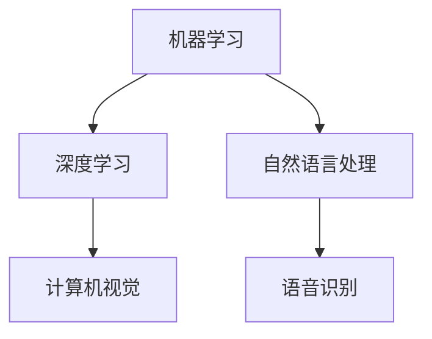
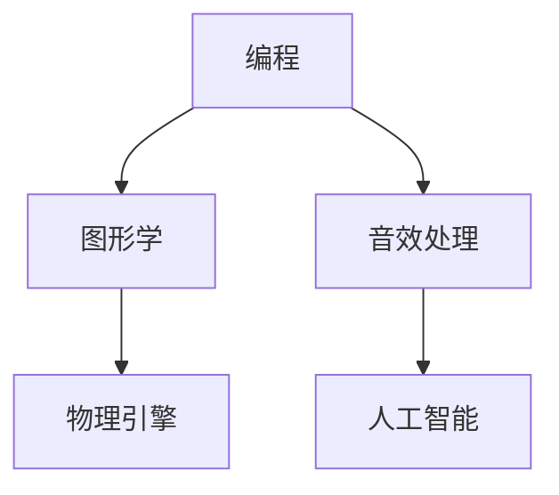
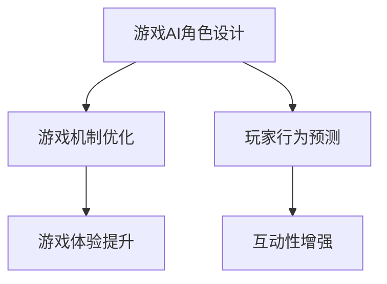

                 

关键词：完美世界、2024游戏AI、工程师校招、面试题解、AI技术、游戏开发、算法原理、实践案例

> 摘要：本文将深入剖析2024年完美世界游戏AI工程师校招面试中的核心问题，包括AI技术基础、游戏开发经验、算法原理和实践案例等，帮助考生充分准备，把握面试机会，为未来的游戏AI开发事业打下坚实基础。

## 1. 背景介绍

### 1.1 完美世界的游戏AI现状

完美世界作为一家知名的游戏开发公司，其游戏AI技术在业界享有盛誉。随着游戏产业的不断发展和玩家需求的日益提高，完美世界在游戏AI领域投入了大量的研发资源，致力于提升游戏AI的智能化水平和互动性。

### 1.2 2024游戏AI工程师校招的重要性

在游戏产业蓬勃发展的背景下，游戏AI工程师的需求日益增长。2024年完美世界游戏AI工程师校招，不仅为应届毕业生提供了进入游戏行业的宝贵机会，也为公司注入了新鲜的技术血液，推动游戏AI技术的不断创新和发展。

## 2. 核心概念与联系

### 2.1 AI基础知识

AI（人工智能）是计算机科学的一个分支，旨在创建智能体，使其能够执行通常需要人类智能的任务。核心概念包括机器学习、深度学习、自然语言处理等。



### 2.2 游戏开发基础知识

游戏开发涉及多个领域，包括编程、图形学、音效处理、物理引擎等。游戏AI工程师需要具备扎实的基础知识，以便在游戏开发过程中充分发挥AI技术的作用。



### 2.3 AI与游戏开发的联系

AI技术在游戏开发中的应用主要体现在游戏AI角色设计、游戏机制优化、玩家行为预测等方面，从而提升游戏体验和互动性。



## 3. 核心算法原理 & 具体操作步骤

### 3.1 算法原理概述

游戏AI算法主要基于机器学习和深度学习技术，通过训练模型来实现对游戏角色的智能控制。

### 3.2 算法步骤详解

1. 数据收集与预处理：收集游戏数据，包括角色动作、玩家行为等，并进行预处理，以便于模型训练。
2. 模型选择与训练：选择合适的机器学习模型，如神经网络、决策树等，进行模型训练，使其能够根据输入数据生成合适的输出。
3. 模型评估与优化：评估模型性能，通过调整参数、增加数据等方式进行优化。
4. 模型部署与应用：将训练好的模型部署到游戏服务器，实现对游戏AI角色的实时控制。

### 3.3 算法优缺点

**优点：**
- 提高游戏角色的智能程度，增强游戏互动性。
- 降低开发者工作量，提高游戏开发效率。

**缺点：**
- 模型训练时间较长，需要大量计算资源。
- 模型性能受限于训练数据质量和模型选择。

### 3.4 算法应用领域

游戏AI算法在游戏开发中的应用非常广泛，如角色AI、地图AI、任务AI等，能够显著提升游戏的可玩性和趣味性。

## 4. 数学模型和公式 & 详细讲解 & 举例说明

### 4.1 数学模型构建

游戏AI中的数学模型主要包括决策树、神经网络等。以神经网络为例，其基本结构包括输入层、隐藏层和输出层。

### 4.2 公式推导过程

神经网络的计算公式如下：

$$
Z = \sum_{i=1}^{n} w_{i}x_{i} + b
$$

其中，$Z$ 为输出，$w_{i}$ 为权重，$x_{i}$ 为输入，$b$ 为偏置。

### 4.3 案例分析与讲解

以一个简单的游戏角色AI为例，其目标是根据玩家行为预测并采取合适的行动。

### 4.3.1 模型构建

输入层：玩家行为特征（如位置、速度、攻击动作等）
隐藏层：通过神经网络模型对输入特征进行加权求和处理
输出层：预测游戏角色的行动（如移动、攻击、躲避等）

### 4.3.2 公式推导

输入特征向量 $x = [x_1, x_2, x_3]$，权重矩阵 $W = [w_{11}, w_{12}, w_{13}]$，偏置 $b = b_1$。

$$
z = w_{11}x_1 + w_{12}x_2 + w_{13}x_3 + b_1
$$

## 5. 项目实践：代码实例和详细解释说明

### 5.1 开发环境搭建

开发工具：Python
机器学习库：TensorFlow、PyTorch
游戏引擎：Unity、Unreal Engine

### 5.2 源代码详细实现

以下是一个简单的游戏角色AI的Python代码实现：

```python
import tensorflow as tf

# 输入特征
input_features = tf.keras.layers.Dense(units=64, activation='relu')(input_layer)

# 隐藏层
hidden_layer = tf.keras.layers.Dense(units=32, activation='relu')(input_features)

# 输出层
output_layer = tf.keras.layers.Dense(units=1, activation='sigmoid')(hidden_layer)

# 模型编译
model.compile(optimizer='adam', loss='binary_crossentropy', metrics=['accuracy'])

# 模型训练
model.fit(x_train, y_train, batch_size=32, epochs=10)

# 模型部署
model.save('game_ai_model.h5')
```

### 5.3 代码解读与分析

该代码实现了一个基于TensorFlow的简单神经网络模型，用于训练游戏角色AI。输入层为玩家行为特征，隐藏层和输出层分别为神经网络的中间层和输出层。模型编译时指定了优化器和损失函数，并通过训练数据训练模型。训练完成后，将模型保存为.h5文件，以便于部署到游戏服务器。

## 6. 实际应用场景

### 6.1 角色AI

通过游戏AI算法，游戏角色可以更智能地与玩家互动，提供更加丰富的游戏体验。

### 6.2 游戏机制优化

游戏AI算法可以帮助开发者优化游戏机制，提高游戏的可玩性和趣味性。

### 6.3 玩家行为预测

游戏AI算法可以预测玩家行为，为游戏开发者提供有价值的参考，以优化游戏设计和推广策略。

## 7. 工具和资源推荐

### 7.1 学习资源推荐

- 《Python游戏开发实战》
- 《深度学习入门》
- 《游戏AI编程技术》

### 7.2 开发工具推荐

- Unity
- Unreal Engine
- TensorFlow
- PyTorch

### 7.3 相关论文推荐

- "Deep Learning for Game AI"
- "Enhancing Game Experience with AI"
- "Game AI Pro"

## 8. 总结：未来发展趋势与挑战

### 8.1 研究成果总结

近年来，游戏AI技术取得了显著成果，为游戏开发带来了新的机遇和挑战。

### 8.2 未来发展趋势

随着AI技术的不断发展，游戏AI将在游戏开发中发挥更加重要的作用，为玩家带来更加丰富的游戏体验。

### 8.3 面临的挑战

- 模型训练时间较长，需要大量计算资源。
- 模型性能受限于训练数据质量和模型选择。

### 8.4 研究展望

未来游戏AI研究将重点关注模型压缩、实时性提升等方面，以提高模型在游戏场景中的应用效果。

## 9. 附录：常见问题与解答

### 9.1 游戏AI是什么？

游戏AI是利用人工智能技术为游戏角色、场景等提供智能控制的方法，以增强游戏互动性和可玩性。

### 9.2 游戏AI算法有哪些？

游戏AI算法主要包括机器学习、深度学习、决策树等。其中，深度学习算法在游戏AI中应用最为广泛。

### 9.3 如何搭建游戏AI开发环境？

搭建游戏AI开发环境需要安装Python、TensorFlow或PyTorch等工具，并选择合适的游戏引擎（如Unity、Unreal Engine）进行开发。

作者：禅与计算机程序设计艺术 / Zen and the Art of Computer Programming
----------------------------------------------------------------

完成以上文章撰写后，请确保文章内容完整、逻辑清晰，并符合文章结构模板的要求。如有需要，可对文章内容进行进一步的优化和调整。祝您撰写顺利！

