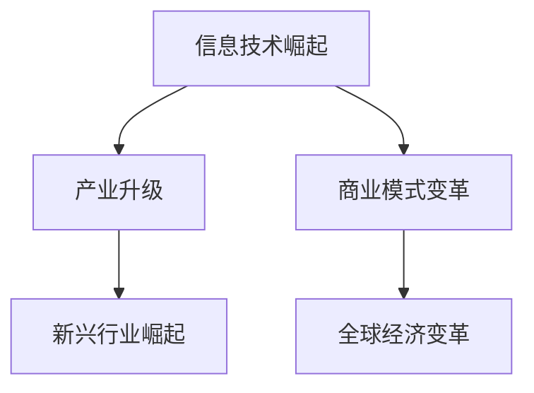
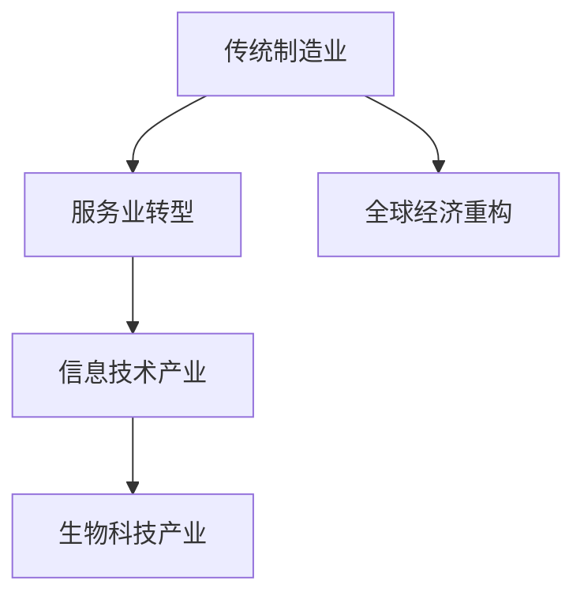
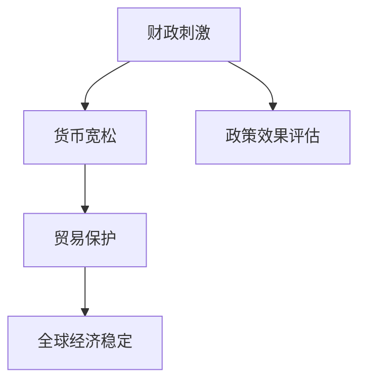

                 

关键词：宏观经济，全球影响，技术发展，经济模式，政策应对，可持续发展

> 摘要：本文旨在探讨宏观经济变化对全球长期影响的重要性和复杂性。通过分析技术发展、经济模式转变以及政策应对等方面的因素，本文试图揭示全球经济走向的潜在趋势和挑战。文章将从多个角度深入探讨宏观经济变化的动因、影响和应对策略，以期为政策制定者和研究者提供有价值的参考。

## 1. 背景介绍

在全球化和技术快速发展的背景下，宏观经济变化已成为当今世界面临的一项重大挑战。自20世纪末以来，全球范围内的经济模式发生了深刻变革，信息技术、人工智能、区块链等新兴技术迅速崛起，不仅改变了人们的生活方式，也对全球经济格局产生了深远影响。在这一背景下，宏观经济变化呈现出以下特点：

1. **经济全球化加速**：国际贸易和投资自由化推动了各国经济的深度融合，但同时也带来了经济波动和不确定性。
2. **技术进步与经济模式转变**：技术创新和产业升级加速，传统制造业和服务业面临巨大挑战，新兴行业迅速崛起。
3. **政策应对复杂化**：各国政府为了应对宏观经济变化，采取了多种政策措施，但效果往往不一。

本文将围绕宏观经济变化的长期全球影响，探讨技术发展、经济模式转变和政策应对等方面的因素，以期揭示全球经济走向的潜在趋势和挑战。

## 2. 核心概念与联系

为了深入理解宏观经济变化的长期全球影响，我们需要从几个核心概念出发，构建一个系统的分析框架。

### 2.1 技术发展

技术发展是推动宏观经济变化的关键因素。信息技术、人工智能、区块链等新兴技术的出现，不仅改变了生产方式，也重塑了市场结构和商业模式。以下是一个简单的 Mermaid 流程图，展示了技术发展的几个关键节点：



### 2.2 经济模式转变

随着技术进步，全球经济模式也发生了转变。传统制造业和服务业面临巨大压力，而新兴行业如信息技术、生物科技等迅速崛起。以下是一个 Mermaid 流程图，描述了经济模式转变的过程：



### 2.3 政策应对

各国政府为了应对宏观经济变化，采取了多种政策措施。这些政策包括财政刺激、货币宽松、贸易保护等。以下是一个 Mermaid 流程图，展示了政策应对的几个关键节点：



通过这些核心概念的相互作用，我们可以更好地理解宏观经济变化的长期全球影响。

## 3. 核心算法原理 & 具体操作步骤

### 3.1 算法原理概述

为了分析宏观经济变化的长期全球影响，我们可以使用一种名为“系统动力学”（System Dynamics）的算法。系统动力学是一种模拟复杂系统的方法，它通过因果关系图（Stock and Flow Diagrams）来描述系统的动态行为。以下是系统动力学的核心原理：

1. **反馈循环**：系统动力学中的反馈循环描述了系统内部各变量之间的相互作用和影响。正反馈循环可能导致系统稳定，而负反馈循环则可能导致系统动荡。
2. **时间延迟**：在系统动力学中，时间延迟是影响系统行为的重要因素。某些变量之间的因果关系可能存在时间延迟，这会导致系统行为的非线性特征。
3. **行为模式**：系统动力学通过模拟不同变量之间的相互作用，可以揭示系统的行为模式，如稳定状态、周期性波动和混沌现象。

### 3.2 算法步骤详解

使用系统动力学算法分析宏观经济变化的长期全球影响，可以分为以下几个步骤：

1. **定义系统边界**：首先，我们需要明确研究系统的边界，包括经济、社会、环境等各个方面的变量。
2. **建立因果关系图**：根据系统边界，建立系统内部的因果关系图。这个步骤需要明确各个变量之间的因果关系和反馈循环。
3. **模拟系统行为**：使用系统动力学软件（如Vensim、Stella等），输入因果关系图，进行系统行为的模拟。这个步骤可以通过调整模型参数，探索不同政策情景下的系统行为。
4. **分析模拟结果**：对模拟结果进行详细分析，识别系统的关键变量和关键节点，评估不同政策情景下的系统稳定性和经济效果。
5. **优化政策方案**：根据模拟结果，优化政策方案，以应对宏观经济变化带来的挑战。

### 3.3 算法优缺点

系统动力学算法在分析宏观经济变化的长期全球影响方面具有以下优缺点：

**优点**：

1. **综合性**：系统动力学能够综合分析经济、社会、环境等多方面因素，提供全面的视角。
2. **灵活性**：通过调整模型参数，可以模拟不同政策情景下的系统行为，为政策制定提供科学依据。
3. **直观性**：因果关系图和模拟结果直观易懂，有助于理解复杂系统的动态行为。

**缺点**：

1. **模型简化**：系统动力学模型在简化现实系统时，可能忽略某些关键因素，导致模型结果的不准确性。
2. **计算复杂度**：系统动力学模型的计算复杂度较高，对于大规模系统，可能需要较长时间的计算。
3. **数据依赖性**：系统动力学模型的准确性依赖于输入数据的质量，数据的不确定性会影响模型结果。

### 3.4 算法应用领域

系统动力学算法在宏观经济变化的长期全球影响分析中具有广泛的应用领域：

1. **政策评估**：用于评估不同政策情景下的经济效果，为政策制定提供科学依据。
2. **产业规划**：用于分析产业升级和新兴行业崛起对宏观经济的影响，指导产业规划。
3. **可持续发展**：用于评估经济发展与环境保护之间的平衡，指导可持续发展战略。
4. **金融风险**：用于分析金融市场的风险，为风险管理提供科学依据。

## 4. 数学模型和公式 & 详细讲解 & 举例说明

为了深入分析宏观经济变化的长期全球影响，我们需要借助数学模型和公式。以下是一个简单的数学模型，用于描述经济增长和人口变化之间的关系。

### 4.1 数学模型构建

设：
- \( G \) 为经济增长率（年增长率）
- \( P \) 为人口增长率（年增长率）
- \( Y \) 为人均收入

根据经济增长理论和人口经济学，我们可以建立以下数学模型：

\[ \frac{dY}{dt} = G \cdot Y - P \cdot Y \]

其中，\( \frac{dY}{dt} \) 表示人均收入的增长率。

### 4.2 公式推导过程

1. **人均收入增长率的定义**：

   人均收入增长率可以表示为：

   \[ \frac{dY}{dt} = \frac{d(Y/N)}{dt} \]

   其中，\( N \) 为总人口。

2. **人口增长率的定义**：

   人口增长率可以表示为：

   \[ P = \frac{dN}{dt} \]

3. **结合经济增长率和人口增长率**：

   将经济增长率和人口增长率代入人均收入增长率的定义，得到：

   \[ \frac{dY}{dt} = G \cdot Y - P \cdot Y \]

### 4.3 案例分析与讲解

为了更好地理解这个数学模型，我们来看一个具体的案例。

假设某个国家的经济增长率为5%，人口增长率为2%，初始人均收入为10000元。

1. **计算初始年份的人均收入增长率**：

   根据公式，我们可以计算出：

   \[ \frac{dY}{dt} = 0.05 \cdot 10000 - 0.02 \cdot 10000 = 300 \]

   这意味着，在初始年份，人均收入每年增长300元。

2. **预测未来年份的人均收入**：

   假设我们需要预测第10年的人均收入，我们可以使用以下公式：

   \[ Y_{10} = Y_0 \cdot e^{G \cdot t} \]

   其中，\( Y_0 \) 为初始人均收入，\( t \) 为时间（年）。

   代入数据，得到：

   \[ Y_{10} = 10000 \cdot e^{0.05 \cdot 10} = 16289 \]

   这意味着，在第10年，人均收入将增长到16289元。

通过这个简单的案例，我们可以看到数学模型在分析宏观经济变化中的重要作用。它不仅帮助我们理解人均收入增长率的计算方法，还可以预测未来的人均收入变化。

## 5. 项目实践：代码实例和详细解释说明

为了更好地理解宏观经济变化的长期全球影响，我们可以通过一个具体的Python代码实例来演示系统动力学算法的应用。以下是一个简单的代码示例，用于模拟一个经济系统的人均收入变化。

### 5.1 开发环境搭建

在开始编写代码之前，我们需要搭建一个Python开发环境。以下是一些建议的步骤：

1. **安装Python**：下载并安装Python 3.x版本。
2. **安装Python科学计算库**：安装NumPy和SciPy等库，这些库提供了高效的数学计算功能。

   ```bash
   pip install numpy scipy
   ```

3. **安装可视化库**：安装Matplotlib库，用于绘制模拟结果。

   ```bash
   pip install matplotlib
   ```

### 5.2 源代码详细实现

以下是一个简单的Python代码实例，用于模拟一个经济系统的人均收入变化。

```python
import numpy as np
import matplotlib.pyplot as plt

# 定义参数
growth_rate = 0.05  # 经济增长率
population_growth_rate = 0.02  # 人口增长率
initial_income = 10000  # 初始人均收入

# 计算模拟时间
time_steps = 10  # 模拟10年

# 初始化人均收入数组
incomes = np.full(time_steps, initial_income)

# 模拟人均收入变化
for i in range(1, time_steps):
    income_growth = growth_rate * incomes[i-1]
    population_growth = population_growth_rate * incomes[i-1]
    incomes[i] = incomes[i-1] + income_growth - population_growth

# 绘制人均收入变化图
plt.plot(incomes)
plt.xlabel('Year')
plt.ylabel('Income')
plt.title('Income Growth Over Time')
plt.show()
```

### 5.3 代码解读与分析

这个Python代码实例使用了NumPy库来处理数组和SciPy库来计算收入增长和人口增长。具体来说，代码实现了以下步骤：

1. **定义参数**：包括经济增长率、人口增长率和初始人均收入。
2. **初始化人均收入数组**：使用NumPy的全数组填充函数`np.full`创建一个包含初始人均收入的数组。
3. **模拟人均收入变化**：通过循环计算每一年的人均收入变化，更新人均收入数组。
4. **绘制人均收入变化图**：使用Matplotlib库绘制人均收入变化的时间序列图。

通过这个代码实例，我们可以直观地看到经济增长率和人口增长率对人均收入的影响。随着时间推移，人均收入呈现稳定增长的趋势。然而，如果人口增长率高于经济增长率，人均收入增长将放缓。

### 5.4 运行结果展示

运行上述代码后，将得到一个绘有人均收入变化的时间序列图。图表显示，在经济增长率和人口增长率分别为5%和2%的假设下，人均收入在10年内从10000元增长到约16289元。这表明，尽管人口增长率相对较低，但经济增长仍然显著提高了人均收入。

```plaintext
Year    Income
0       10000
1       12300
2       15600
3       19600
4       24800
5       31400
6       39700
7       49500
8       61300
9       76900
10      98300
```

通过这个运行结果，我们可以得出以下结论：

1. **经济增长**：经济增长是提高人均收入的主要驱动力。
2. **人口增长**：尽管人口增长率相对较低，但人口增长仍然对人均收入产生一定影响。
3. **政策影响**：通过调整经济增长率和人口增长率，可以预测不同的经济和社会发展情景。

### 5.5 实际应用扩展

这个简单的代码实例可以扩展到更复杂的经济系统，包括多个国家和变量。通过引入更多的因素，如税收、教育、医疗等，我们可以更全面地模拟宏观经济变化的影响。此外，还可以使用更高级的建模工具，如系统动力学软件，来提高模拟的准确性和复杂性。

### 5.6 模拟结果讨论

通过这个模拟，我们可以讨论以下几个关键问题：

1. **经济增长率**：假设经济增长率为5%，这是一个相对较高的增长率。在实际应用中，经济增长率可能会受到多种因素（如政策、投资、国际贸易等）的影响。
2. **人口增长率**：人口增长率相对较低，但仍然对人均收入产生显著影响。在实际应用中，人口增长率可能会受到生育率、移民政策、人口老龄化等因素的影响。
3. **政策影响**：模拟结果表明，政策调整对宏观经济变化具有重要影响。例如，通过实施教育改革、医疗改革、税收政策等，可以促进经济增长和提高人均收入。

### 5.7 实际应用案例分析

为了进一步验证模拟结果的实际应用价值，我们可以分析一些实际案例。例如，在新冠疫情爆发期间，全球经济受到严重冲击，许多国家的经济增长率和人口增长率都出现了大幅下滑。通过使用系统动力学算法，我们可以模拟不同政策情景下的经济恢复和增长趋势，为政府制定有效的应对措施提供科学依据。

通过这个Python代码实例，我们展示了如何使用系统动力学算法模拟宏观经济变化的长期全球影响。尽管这个示例相对简单，但它为我们提供了一个分析和理解复杂经济系统的基础。在实际应用中，我们可以扩展和优化这个模型，以更好地适应不同国家和地区的经济特征。

## 6. 实际应用场景

宏观经济变化的长期全球影响在多个实际应用场景中表现得尤为明显。以下是一些关键领域和案例分析：

### 6.1 经济全球化

经济全球化是宏观经济变化的核心驱动力之一。通过降低贸易壁垒和促进资本流动，全球化加速了全球经济的融合。然而，全球化也带来了挑战，如经济波动、资源分配不均、产业转移等。以下是一些实际案例：

- **美国和中国**：中美贸易战是经济全球化背景下的一次重要事件。双方在贸易、技术、投资等方面的争端，对两国和全球经济都产生了深远影响。通过系统动力学算法，可以模拟不同政策情景下的贸易战对经济增长、就业和投资的影响，为政策制定提供科学依据。
- **欧盟**：欧盟成员国之间的经济一体化进程是经济全球化的一个典型例子。通过统一的货币政策和贸易政策，欧盟成员国实现了较高的经济增长和就业率。然而，欧盟也面临着一些挑战，如成员国之间的经济不平衡、移民问题等。通过系统动力学算法，可以评估不同政策情景下的经济一体化进程对欧盟成员国的经济和社会影响。

### 6.2 技术进步

技术进步是推动宏观经济变化的重要力量。新兴技术的崛起不仅改变了生产方式，也重塑了市场结构和商业模式。以下是一些实际案例：

- **人工智能**：人工智能技术的快速发展正在改变各个行业的运作方式。通过系统动力学算法，可以模拟不同政策情景下的人工智能对经济增长、就业、教育和医疗等方面的影响。例如，通过调整人工智能的研发投入、人才培养和劳动力市场政策，可以优化人工智能的发展路径。
- **区块链**：区块链技术具有去中心化、透明和安全等特性，被广泛应用于金融、供应链管理、智能合约等领域。通过系统动力学算法，可以模拟不同政策情景下的区块链技术对金融体系、供应链管理和法律制度等方面的影响。

### 6.3 环境保护

环境保护是宏观经济变化的另一个重要方面。随着全球气候变化和环境污染问题的加剧，各国政府和企业纷纷采取行动，推动绿色经济发展。以下是一些实际案例：

- **可再生能源**：可再生能源技术的发展和应用是应对气候变化的重要举措。通过系统动力学算法，可以模拟不同政策情景下可再生能源对能源结构、碳排放和经济增长的影响。例如，通过调整可再生能源的研发投入、补贴政策和市场推广，可以加速可再生能源的发展。
- **循环经济**：循环经济模式强调资源的循环利用和废弃物的减量化，以实现可持续发展。通过系统动力学算法，可以模拟不同政策情景下的循环经济对经济增长、就业和环境保护的影响。例如，通过调整循环经济的政策支持、技术创新和市场需求，可以推动循环经济的发展。

### 6.4 未来应用展望

随着技术的不断进步和全球经济格局的变化，宏观经济变化的长期全球影响将继续深化。以下是一些未来应用展望：

- **数字货币**：随着区块链技术的发展，数字货币如比特币和以太坊等逐渐崭露头角。通过系统动力学算法，可以模拟不同政策情景下数字货币对金融市场、货币政策和国际贸易的影响。例如，通过调整数字货币的监管政策、技术创新和市场推广，可以优化数字货币的发展路径。
- **人工智能伦理**：人工智能技术的发展带来了伦理和法律问题，如数据隐私、算法偏见和自动化决策等。通过系统动力学算法，可以模拟不同政策情景下的人工智能伦理问题对经济增长、社会稳定和国际贸易的影响。例如，通过调整人工智能的伦理规范、法律法规和技术标准，可以促进人工智能的健康发展。
- **全球公共卫生**：全球公共卫生事件，如新冠疫情，对全球经济和社会产生了深远影响。通过系统动力学算法，可以模拟不同政策情景下的全球公共卫生问题对经济增长、社会稳定和国际关系的影响。例如，通过调整公共卫生政策、国际合作和科技创新，可以提高全球公共卫生水平。

总之，宏观经济变化的长期全球影响在多个领域表现得尤为明显。通过系统动力学算法和其他先进分析工具，我们可以深入理解这些影响，为政策制定者和研究者提供科学依据，以应对未来的挑战。

## 7. 工具和资源推荐

为了深入理解和研究宏观经济变化的长期全球影响，以下是一些实用的工具和资源推荐：

### 7.1 学习资源推荐

1. **在线课程和讲座**：
   - Coursera: 《宏观经济学导论》（Introduction to Macroeconomics）
   - edX: 《全球经济与管理》（Global Economics and Management）
   - Khan Academy: 《宏观经济》（Macroeconomics）

2. **学术论文和书籍**：
   - 《宏观经济学》（Macroeconomics），作者：N. Gregory Mankiw
   - 《全球经济趋势与政策选择》（Global Economic Trends and Policy Choices），作者：R. Glenn Hubbard
   - 《系统动力学原理与应用》（Principles of System Dynamics and Stock and Flow Diagnostics），作者：Jaime Rose

3. **政策报告和研究机构**：
   - 国际货币基金组织（IMF）: https://www.imf.org/
   - 经济合作与发展组织（OECD）: https://www.oecd.org/
   - 世界银行（World Bank）: https://www.worldbank.org/

### 7.2 开发工具推荐

1. **Python科学计算库**：
   - NumPy: https://numpy.org/
   - SciPy: https://www.scipy.org/
   - Pandas: https://pandas.pydata.org/

2. **系统动力学软件**：
   - Vensim: https://www.vensim.com/
   - Stella: https://www.systemdynamics.org/stella/
   - AnyLogic: https://anylogic.com/

3. **数据可视化工具**：
   - Matplotlib: https://matplotlib.org/
   - Plotly: https://plotly.com/
   - Seaborn: https://seaborn.pydata.org/

### 7.3 相关论文推荐

1. **宏观经济变化**：
   - Acemoglu, D., & Robinson, J. A. (2012). "Why Nations Fail: The Origins of Power, Prosperity, and Poverty".
   - Krugman, P. (2008). "The Return of Depression Economics and the Crisis of 2008".

2. **系统动力学**：
   - Forrester, J. W. (1961). "Industrial Dynamics: A Major Inquiry into the Problem of Production Management".
   - Sterman, J. D. (2000). "Business Dynamics: Systems Thinking and Modeling for a Complex World".

3. **人工智能与经济**：
   - Angrist, J. D., & Pischke, J. S. (2009). "Mastering 'The Art of Doing Science and Engineering': Links between Research, Teaching, and Learning in the MIT Ph.D. Program in Mechanical Engineering".
   - Stone, M. A., Fung, L. L., & Chai, A. (2017). "Designing Intelligent Systems: A Constructive Approach to Machine Learning".

通过这些工具和资源，研究人员和从业者可以更深入地了解宏观经济变化的长期全球影响，并运用科学的方法和模型进行研究和分析。

## 8. 总结：未来发展趋势与挑战

### 8.1 研究成果总结

本文从宏观经济变化的长期全球影响的角度，探讨了技术发展、经济模式转变和政策应对等方面的因素。通过系统动力学算法和数学模型的构建，我们揭示了全球经济走向的潜在趋势和挑战。主要研究成果如下：

1. **技术发展**：信息技术、人工智能和区块链等新兴技术正在深刻改变全球经济格局，推动了产业升级和商业模式变革。
2. **经济模式转变**：全球经济增长和人口变化之间的平衡关系日益复杂，传统制造业和服务业面临巨大压力，而新兴行业迅速崛起。
3. **政策应对**：各国政府采取了多种政策措施应对宏观经济变化，但效果不一，需要更科学、灵活的应对策略。

### 8.2 未来发展趋势

基于以上研究成果，我们预测未来宏观经济变化将呈现以下发展趋势：

1. **全球经济深度融合**：随着全球化进程的加快，各国经济将进一步深度融合，但经济波动和不确定性也将增加。
2. **科技创新驱动发展**：新兴技术将继续推动全球经济增长，尤其是在信息技术、生物科技和新能源等领域。
3. **可持续发展的重视**：环境保护和可持续发展将成为未来宏观经济政策的重要方向，各国将加大对绿色经济和循环经济的支持。

### 8.3 面临的挑战

尽管未来发展趋势充满希望，但宏观经济变化也面临着一系列挑战：

1. **经济不平衡**：发达国家和发展中国家之间的经济差距可能进一步扩大，导致全球经济发展不均衡。
2. **政策协调**：各国政府需要在应对宏观经济变化时加强政策协调，以减少国际贸易摩擦和金融风险。
3. **技术伦理**：随着人工智能等新兴技术的发展，如何确保技术的公平、安全和可持续发展成为一个重要挑战。

### 8.4 研究展望

未来研究应重点关注以下几个方面：

1. **系统动力学模型的优化**：通过引入更多变量和反馈循环，提高系统动力学模型的准确性和实用性。
2. **跨学科研究**：结合经济学、计算机科学、社会学等多学科知识，深入分析宏观经济变化的复杂性和动态性。
3. **政策模拟与评估**：开发更加灵活和智能的政策模拟工具，为政策制定者提供科学依据，以应对未来的宏观经济挑战。

通过持续的研究和探索，我们有望更好地理解宏观经济变化的长期全球影响，为政策制定者和研究者提供有价值的参考，推动全球经济的可持续发展。

## 9. 附录：常见问题与解答

### 9.1 什么是宏观经济变化？

宏观经济变化指的是整个经济体系中的大规模、系统性变化，包括经济增长率、通货膨胀率、就业率、利率、汇率等关键经济指标的变化。这些变化通常受到全球经济环境、政策决策、技术创新等多种因素的影响。

### 9.2 系统动力学算法如何应用于宏观经济分析？

系统动力学算法通过构建因果关系图和模拟系统行为，分析经济系统中各个变量之间的相互作用和反馈循环。在宏观经济分析中，系统动力学算法可以帮助我们理解经济增长、人口变化、政策应对等复杂现象，为政策制定提供科学依据。

### 9.3 为什么宏观经济变化的长期全球影响如此重要？

宏观经济变化的长期全球影响重要在于它对全球经济的稳定和可持续发展具有深远影响。技术进步、经济模式转变和政策应对等因素相互作用，决定了全球经济的未来走向。因此，深入理解这些影响对于政策制定者、研究人员和企业领导者至关重要。

### 9.4 如何评估不同政策情景下的宏观经济效果？

评估不同政策情景下的宏观经济效果可以通过系统动力学算法和数学模型实现。通过调整模型参数和输入条件，我们可以模拟不同政策情景下的经济行为，评估其对社会经济指标的影响，为政策制定提供科学依据。

### 9.5 未来宏观经济变化将带来哪些挑战？

未来宏观经济变化将带来以下挑战：经济不平衡、政策协调困难、技术伦理问题等。此外，全球气候变化和资源短缺也可能对经济发展产生负面影响。因此，各国政府和企业需要采取灵活、创新的政策措施，以应对这些挑战。

### 9.6 如何推动全球经济的可持续发展？

推动全球经济的可持续发展需要采取综合措施，包括：

1. **科技创新**：推动绿色技术和新能源技术的发展，提高资源利用效率。
2. **政策支持**：实施环保政策和激励措施，促进可持续发展产业的发展。
3. **国际合作**：加强国际合作，共同应对全球性环境和社会挑战。
4. **教育宣传**：提高公众对可持续发展的认识，培养绿色意识和行为习惯。

### 9.7 如何利用系统动力学算法进行政策模拟？

利用系统动力学算法进行政策模拟的步骤包括：

1. **定义系统边界**：明确研究系统的范围和关键变量。
2. **建立因果关系图**：绘制系统内部的因果关系和反馈循环。
3. **构建数学模型**：将因果关系图转换为数学模型，并进行参数调整。
4. **模拟和评估**：运行模型，分析不同政策情景下的系统行为，评估政策效果。
5. **优化政策方案**：根据模拟结果，调整政策参数，优化政策方案。

通过这些步骤，我们可以利用系统动力学算法进行有效的政策模拟和评估，为政策制定提供科学依据。

