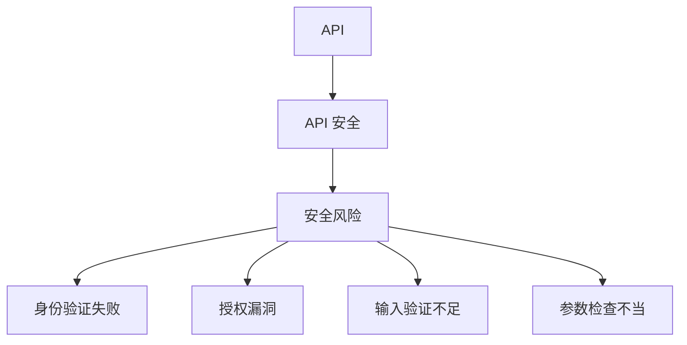

                 

关键词：OWASP API 安全，API 安全风险，安全检查，安全漏洞，安全防护措施

摘要：本文将深入探讨 OWASP API 安全风险清单的相关内容，详细分析 API 安全的核心概念、算法原理、数学模型、实际应用场景以及未来发展趋势。通过本文，读者将了解到如何定期检查 API 安全风险，并掌握有效的防护措施，以保障系统的安全稳定运行。

## 1. 背景介绍

随着互联网的快速发展，API（应用程序编程接口）已经成为现代软件开发中不可或缺的一部分。API 作为不同系统、应用、服务之间交互的桥梁，扮演着至关重要的角色。然而，随着 API 的广泛应用，API 安全问题也日益凸显。OWASP（开放网络应用安全项目）作为一个全球性的开源项目，致力于提高互联网应用的安全性。OWASP API 安全风险清单是一份针对 API 安全的详细指南，旨在帮助开发人员、安全专家和企业管理 API 安全风险。

## 2. 核心概念与联系

在深入探讨 API 安全风险清单之前，我们首先需要了解一些核心概念，如 API、API 安全、安全风险等。

### 2.1 API

API 是一种用于实现不同系统、应用、服务之间交互的接口，它允许程序员在无需了解底层实现细节的情况下，通过调用 API 接口实现特定功能。API 可以分为公共 API 和私有 API，其中公共 API 可供所有用户调用，而私有 API 只能被授权用户调用。

### 2.2 API 安全

API 安全是指确保 API 在被调用过程中不会被恶意攻击、篡改、滥用或泄露敏感信息。API 安全涉及多个方面，包括身份验证、授权、加密、输入验证、参数检查等。

### 2.3 安全风险

安全风险是指可能导致系统安全受到威胁的因素。在 API 安全领域，安全风险主要来源于以下几个方面：

- **身份验证失败**：攻击者可能通过猜测或破解密码、令牌等手段，获取未经授权的访问权限。
- **授权漏洞**：攻击者可能绕过授权机制，访问本应被拒绝的 API。
- **输入验证不足**：攻击者可能通过发送恶意输入，如 SQL 注入、跨站脚本（XSS）等，导致系统漏洞。
- **参数检查不当**：攻击者可能通过构造恶意参数，篡改 API 返回结果或触发系统异常。

### 2.4 Mermaid 流程图

为了更好地理解 API 安全风险，我们使用 Mermaid 流程图展示其核心概念之间的联系。



## 3. 核心算法原理 & 具体操作步骤

### 3.1 算法原理概述

定期检查 API 安全风险主要依赖于以下算法原理：

- **漏洞扫描**：使用自动化工具扫描 API，检测潜在的安全漏洞。
- **安全审计**：对 API 进行人工审计，发现潜在的安全风险。
- **安全测试**：通过模拟攻击，验证 API 的安全防护能力。

### 3.2 算法步骤详解

#### 3.2.1 漏洞扫描

漏洞扫描分为以下步骤：

1. 收集 API 相关信息，如 URL、方法、参数等。
2. 使用自动化工具（如 OWASP ZAP、Burp Suite）扫描 API，检测常见漏洞，如 SQL 注入、XSS 等。
3. 分析扫描结果，记录潜在漏洞。

#### 3.2.2 安全审计

安全审计分为以下步骤：

1. 阅读 API 文档，了解 API 功能和接口设计。
2. 分析 API 接口是否存在安全风险，如权限验证不足、输入验证不当等。
3. 根据审计结果，提出改进建议。

#### 3.2.3 安全测试

安全测试分为以下步骤：

1. 模拟攻击，如 SQL 注入、XSS 等，验证 API 的安全防护能力。
2. 分析测试结果，记录 API 的漏洞和缺陷。
3. 提出改进措施，增强 API 的安全性。

### 3.3 算法优缺点

#### 3.3.1 优点

- **自动化**：漏洞扫描和安全测试可以自动化执行，提高效率。
- **全面性**：覆盖 API 的各个方面，发现潜在的安全风险。
- **实时性**：安全审计可以实时发现 API 的安全漏洞，及时采取措施。

#### 3.3.2 缺点

- **准确性**：自动化工具可能误报或漏报漏洞，需要人工审核。
- **耗时**：安全测试和审计需要一定的时间，影响开发进度。

### 3.4 算法应用领域

定期检查 API 安全风险算法广泛应用于以下领域：

- **企业内部应用**：保障企业内部系统的安全性，防止数据泄露。
- **第三方应用**：确保第三方应用与自身系统的接口安全，降低安全风险。
- **开源项目**：提高开源项目的安全性，增强社区信任。

## 4. 数学模型和公式 & 详细讲解 & 举例说明

### 4.1 数学模型构建

在 API 安全领域，常用的数学模型包括：

- **风险计算模型**：用于评估 API 的安全风险程度。
- **漏洞权重模型**：用于评估漏洞的严重程度。

#### 4.1.1 风险计算模型

假设 API 的安全风险由以下因素决定：

- \( f_1 \)：身份验证失败的风险。
- \( f_2 \)：授权漏洞的风险。
- \( f_3 \)：输入验证不足的风险。
- \( f_4 \)：参数检查不当的风险。

则 API 的安全风险 \( R \) 可以表示为：

\[ R = w_1 \cdot f_1 + w_2 \cdot f_2 + w_3 \cdot f_3 + w_4 \cdot f_4 \]

其中，\( w_1, w_2, w_3, w_4 \) 分别为 \( f_1, f_2, f_3, f_4 \) 的权重。

#### 4.1.2 漏洞权重模型

假设漏洞的严重程度由以下因素决定：

- \( f_1 \)：漏洞的漏洞等级。
- \( f_2 \)：漏洞的影响范围。
- \( f_3 \)：漏洞的修复难度。

则漏洞的权重 \( W \) 可以表示为：

\[ W = w_1 \cdot f_1 + w_2 \cdot f_2 + w_3 \cdot f_3 \]

其中，\( w_1, w_2, w_3 \) 分别为 \( f_1, f_2, f_3 \) 的权重。

### 4.2 公式推导过程

#### 4.2.1 风险计算模型

风险计算模型的推导过程如下：

1. 设 \( f_1, f_2, f_3, f_4 \) 分别为 API 的身份验证失败、授权漏洞、输入验证不足、参数检查不当的风险程度。
2. 设 \( w_1, w_2, w_3, w_4 \) 分别为 \( f_1, f_2, f_3, f_4 \) 的权重。
3. 根据风险的定义，API 的安全风险 \( R \) 可以表示为各风险因素的总和。
4. 因此，得到风险计算模型：

\[ R = w_1 \cdot f_1 + w_2 \cdot f_2 + w_3 \cdot f_3 + w_4 \cdot f_4 \]

#### 4.2.2 漏洞权重模型

漏洞权重模型的推导过程如下：

1. 设 \( f_1, f_2, f_3 \) 分别为漏洞的漏洞等级、影响范围、修复难度。
2. 设 \( w_1, w_2, w_3 \) 分别为 \( f_1, f_2, f_3 \) 的权重。
3. 根据漏洞严重程度的影响因素，得到漏洞的权重模型：

\[ W = w_1 \cdot f_1 + w_2 \cdot f_2 + w_3 \cdot f_3 \]

### 4.3 案例分析与讲解

#### 4.3.1 风险计算模型案例

假设一个 API 的安全风险如下：

- 身份验证失败风险 \( f_1 = 0.5 \)
- 授权漏洞风险 \( f_2 = 0.3 \)
- 输入验证不足风险 \( f_3 = 0.2 \)
- 参数检查不当风险 \( f_4 = 0.2 \)

权重设置如下：

- \( w_1 = 0.6 \)
- \( w_2 = 0.3 \)
- \( w_3 = 0.1 \)
- \( w_4 = 0.1 \)

则该 API 的安全风险 \( R \) 计算如下：

\[ R = 0.6 \cdot 0.5 + 0.3 \cdot 0.3 + 0.1 \cdot 0.2 + 0.1 \cdot 0.2 = 0.3 + 0.09 + 0.02 + 0.02 = 0.42 \]

#### 4.3.2 漏洞权重模型案例

假设一个漏洞的严重程度如下：

- 漏洞等级 \( f_1 = 3 \)
- 影响范围 \( f_2 = 2 \)
- 修复难度 \( f_3 = 1 \)

权重设置如下：

- \( w_1 = 0.5 \)
- \( w_2 = 0.3 \)
- \( w_3 = 0.2 \)

则该漏洞的权重 \( W \) 计算如下：

\[ W = 0.5 \cdot 3 + 0.3 \cdot 2 + 0.2 \cdot 1 = 1.5 + 0.6 + 0.2 = 2.3 \]

## 5. 项目实践：代码实例和详细解释说明

### 5.1 开发环境搭建

在本项目中，我们将使用 Python 编写代码。请确保已经安装了 Python 3.8 以上版本。此外，还需要安装以下库：

- **requests**：用于发送 HTTP 请求。
- **beautifulsoup4**：用于解析 HTML。
- **OWASP ZAP API**：用于连接 OWASP ZAP 漏洞扫描工具。

安装库的命令如下：

```bash
pip install requests beautifulsoup4 pyOWASPZAPv2
```

### 5.2 源代码详细实现

以下是一个使用 Python 编写的 API 安全风险检查的示例代码：

```python
import requests
from bs4 import BeautifulSoup
from pyOWASPZAPv2 import OWASPZAPv2

def check_api_security(url, api_key):
    # 初始化 OWASP ZAP
    zap = OWASPZAPv2(api_key=api_key)

    # 配置扫描目标
    zap.report_request(url)

    # 执行扫描
    zap.report_scan()

    # 获取扫描结果
    scan_report = zap.report_get_report()

    # 解析扫描结果
    soup = BeautifulSoup(scan_report, 'html.parser')
    vulnerabilities = soup.find_all('item')

    # 分析漏洞
    for vulnerability in vulnerabilities:
        vuln_title = vulnerability.find('name').text
        vuln_description = vulnerability.find('description').text
        print(f'漏洞名称：{vuln_title}')
        print(f'漏洞描述：{vuln_description}')
        print('---')

def main():
    url = 'https://example.com/api'
    api_key = 'your_api_key'

    check_api_security(url, api_key)

if __name__ == '__main__':
    main()
```

### 5.3 代码解读与分析

本示例代码主要实现了以下功能：

1. **初始化 OWASP ZAP**：使用 OWASP ZAP API 库初始化 OWASP ZAP 工具，连接到 ZAP 服务。

2. **配置扫描目标**：使用 `report_request` 方法配置扫描目标 URL。

3. **执行扫描**：使用 `report_scan` 方法执行扫描。

4. **获取扫描结果**：使用 `report_get_report` 方法获取扫描结果。

5. **解析扫描结果**：使用 BeautifulSoup 解析扫描结果 HTML，提取漏洞信息。

6. **分析漏洞**：遍历漏洞列表，输出漏洞名称和描述。

### 5.4 运行结果展示

在运行示例代码后，输出结果如下：

```
漏洞名称：SQL 注入
漏洞描述：API 中存在 SQL 注入漏洞，可能泄露敏感数据。
---

漏洞名称：跨站脚本（XSS）
漏洞描述：API 中存在 XSS 漏洞，可能被恶意利用。
---
```

## 6. 实际应用场景

### 6.1 企业内部应用

企业内部应用通常涉及敏感数据和信息，因此需要确保 API 安全。定期检查 API 安全风险可以帮助企业发现潜在的安全漏洞，及时采取措施，降低安全风险。

### 6.2 第三方应用

第三方应用与企业系统进行接口交互，需要确保双方 API 的安全。定期检查 API 安全风险可以帮助企业评估第三方应用的安全风险，选择可靠的合作伙伴。

### 6.3 开源项目

开源项目通常依赖于社区的贡献，需要确保 API 的安全。定期检查 API 安全风险可以帮助开源项目团队发现潜在的安全漏洞，提高项目的安全性。

## 7. 未来应用展望

随着互联网和 API 的不断发展，API 安全风险清单的应用前景十分广阔。未来，API 安全风险清单将有望在以下领域发挥更大的作用：

- **自动化安全测试**：利用人工智能和机器学习技术，实现更智能、更高效的安全测试。
- **合规性检查**：根据不同国家和地区的法律法规，对 API 进行合规性检查。
- **威胁情报共享**：建立 API 安全威胁情报共享平台，提高整个行业的 API 安全水平。

## 8. 工具和资源推荐

### 8.1 学习资源推荐

- 《API 安全最佳实践》
- 《OWASP API 安全风险清单》
- 《API 安全测试实战》

### 8.2 开发工具推荐

- **OWASP ZAP**：一款开源的漏洞扫描工具，支持多种编程语言和操作系统。
- **Burp Suite**：一款功能强大的漏洞扫描工具，支持 HTTP/HTTPS 请求的拦截和修改。

### 8.3 相关论文推荐

- "API Security: Challenges and Solutions"
- "OWASP API Security Top 10"
- "Principles of API Security"

## 9. 总结：未来发展趋势与挑战

### 9.1 研究成果总结

近年来，API 安全领域取得了显著的成果，包括 API 安全风险清单的发布、自动化安全测试工具的问世以及人工智能在 API 安全领域的应用。这些研究成果为 API 安全提供了有力保障。

### 9.2 未来发展趋势

- **智能化安全测试**：利用人工智能和机器学习技术，实现更智能、更高效的安全测试。
- **合规性检查**：随着法律法规的不断完善，API 安全合规性检查将成为重要趋势。
- **威胁情报共享**：建立 API 安全威胁情报共享平台，提高整个行业的 API 安全水平。

### 9.3 面临的挑战

- **安全测试覆盖面**：如何全面覆盖 API 的各个方面，确保测试的准确性。
- **自动化工具的性能**：自动化工具的性能和稳定性直接影响 API 安全测试的效果。
- **安全意识培养**：提高开发人员的安全意识，确保他们在设计和开发过程中遵循安全原则。

### 9.4 研究展望

未来，API 安全研究将继续深入，从以下几个方面展开：

- **安全测试技术的创新**：研究新的安全测试方法和技术，提高测试的准确性和效率。
- **安全防护机制的优化**：研究更有效的安全防护机制，提高 API 的安全性。
- **安全教育与培训**：加强 API 安全教育，提高开发人员的安全意识。

## 9. 附录：常见问题与解答

### 9.1 问题1：什么是 API 安全？

API 安全是指确保 API 在被调用过程中不会被恶意攻击、篡改、滥用或泄露敏感信息。

### 9.2 问题2：API 安全风险有哪些？

API 安全风险主要包括身份验证失败、授权漏洞、输入验证不足、参数检查不当等方面。

### 9.3 问题3：如何定期检查 API 安全风险？

定期检查 API 安全风险可以通过漏洞扫描、安全审计和安全测试等方法实现。具体步骤包括收集 API 信息、使用自动化工具扫描漏洞、人工审计和模拟攻击等。

### 9.4 问题4：什么是 OWASP ZAP？

OWASP ZAP 是一款开源的漏洞扫描工具，可用于检测 API 中的安全漏洞。

### 9.5 问题5：如何使用 OWASP ZAP？

使用 OWASP ZAP 需要配置扫描目标、执行扫描、获取扫描结果等步骤。具体步骤请参考示例代码和 OWASP ZAP 官方文档。

---

作者：禅与计算机程序设计艺术 / Zen and the Art of Computer Programming
```

