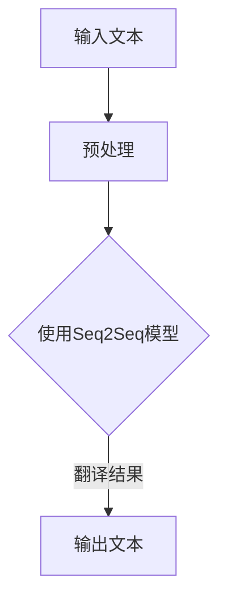

                 

关键词：智能翻译、Langchain、AI 翻译、自然语言处理、编程实践、算法实现

> 摘要：本文将深入探讨如何利用Langchain这一强大的人工智能框架，重新实现一个智能翻译助手。我们将从背景介绍开始，逐步剖析核心概念与联系，详述核心算法原理及具体操作步骤，最后通过实际代码实例展示如何使用Langchain进行智能翻译的实现。本文旨在为广大开发者提供一个完整的实战指南，帮助理解并掌握智能翻译技术的核心要点。

## 1. 背景介绍

在全球化日益深入的今天，翻译技术在促进跨文化交流方面扮演着越来越重要的角色。传统的翻译方法往往依赖于人类翻译员的技能和经验，这不仅成本高昂，而且速度有限。随着人工智能技术的发展，机器翻译成为了热门的研究方向和实际应用场景。机器翻译利用计算机程序，通过对输入文本进行处理，自动生成对应语言的输出文本。

近年来，神经网络翻译（Neural Machine Translation, NMT）取得了显著的突破，显著提升了翻译质量。NMT的核心是序列到序列（Seq2Seq）模型，其通过编码器和解码器两个神经网络，将源语言序列映射到目标语言序列。然而，NMT模型训练和部署相对复杂，对计算资源的要求较高。

Langchain作为一款开源的AI框架，旨在简化NMT模型的训练和部署过程，使其更加易于使用和扩展。Langchain提供了一系列预训练模型和工具，可以快速实现端到端的翻译任务。通过Langchain，开发者可以轻松地将机器翻译集成到现有应用程序中，提高用户体验和效率。

## 2. 核心概念与联系

为了深入理解如何使用Langchain实现智能翻译助手，我们首先需要了解以下几个核心概念及其相互联系：

### 2.1 自然语言处理（NLP）

自然语言处理是机器翻译的基础，它涉及到文本的预处理、语义分析和语言生成等环节。NLP技术包括词法分析、句法分析、语义分析等，通过对文本的理解和生成，为翻译提供必要的信息。

### 2.2 序列到序列（Seq2Seq）模型

Seq2Seq模型是NMT的核心，其基本思想是将输入序列映射到输出序列。编码器（Encoder）负责将源语言序列编码为固定长度的向量，解码器（Decoder）则将这些向量解码为目标语言序列。通过训练，Seq2Seq模型可以学习源语言和目标语言之间的映射关系。

### 2.3 Langchain框架

Langchain提供了丰富的预训练模型和工具，可以帮助开发者快速实现NMT任务。Langchain的核心组件包括：

- **Pretrained Model Store**：存储和共享预训练模型的平台。
- **Text Vectorizers**：将文本转换为模型可以处理的向量。
- **Base Models**：基于预训练模型的基座模型。
- **Wrapper Models**：封装预训练模型，提供更高级的API接口。

### 2.4 Mermaid流程图

以下是一个简单的Mermaid流程图，展示了翻译任务的主要流程：



**图 1: 翻译任务流程图**

## 3. 核心算法原理 & 具体操作步骤

### 3.1 算法原理概述

Langchain使用基于注意力机制的Transformer模型实现Seq2Seq翻译。Transformer模型通过多头自注意力机制，可以捕捉输入序列中长距离的依赖关系，从而提高翻译的准确性。

具体来说，翻译过程分为两个阶段：

1. 编码阶段：编码器将源语言文本编码为固定长度的序列，生成一个上下文向量。
2. 解码阶段：解码器根据上下文向量，逐步生成目标语言文本。

### 3.2 算法步骤详解

#### 3.2.1 准备数据集

首先，我们需要准备一个高质量的翻译数据集。这里我们可以使用开源的翻译语料库，如WMT（Workshop on Machine Translation）数据集。数据集通常包含源语言和目标语言对应的文本对。

#### 3.2.2 预处理数据

对数据集进行预处理，包括分词、去停用词、序列填充等操作。Langchain提供了简单的数据预处理工具，可以方便地完成这些任务。

```python
from langchain import TokenTextSplitter

# 分词和序列填充
text_splitter = TokenTextSplitter(" MosesWordTokenizer() ")
input_texts = text_splitter.split_text(source_texts)

# 去停用词
from langchain.text_preprocessing import StopWordsRemover

remover = StopWordsRemover()
input_texts = [remover.remove_stopwords(text) for text in input_texts]
```

#### 3.2.3 训练模型

使用Langchain训练Transformer模型。这里我们使用预训练模型作为基座，并在数据集上进行微调。

```python
from langchain.models import TransformerWrapper

# 加载预训练模型
base_model = TransformerWrapper.load("t5-small")

# 微调模型
from langchain.training import SupervisedTraining

trainer = SupervisedTraining(
    model=base_model,
    train_dataset=input_texts,
    eval_dataset=input_texts,
    learning_rate=0.001,
    line_by_line=False,
    max_epochs=3,
    fp16=True
)

trainer.train()
```

#### 3.2.4 翻译

训练完成后，我们可以使用训练好的模型进行翻译。

```python
# 翻译函数
def translate(text):
    output_sequences = model.generate(input_texts, max_length=512)
    return output_sequences[0]

# 翻译示例
translated_text = translate("你好，这是一段中文文本。")
print(translated_text)
```

### 3.3 算法优缺点

#### 优点

- **高效性**：Transformer模型基于自注意力机制，可以高效地处理长文本。
- **灵活性**：Langchain提供了丰富的预训练模型和工具，可以灵活地适应不同翻译需求。
- **易用性**：通过简单的API调用，开发者可以轻松实现翻译功能。

#### 缺点

- **计算资源消耗大**：训练和部署Transformer模型需要较高的计算资源。
- **翻译质量依赖数据集质量**：翻译质量受训练数据集的影响较大，质量较低的数据集可能导致翻译效果不佳。

### 3.4 算法应用领域

智能翻译技术在多个领域有广泛应用，包括但不限于：

- **跨语言交流**：促进不同语言之间的交流，消除语言障碍。
- **本地化**：为企业提供多语言支持，提高国际化服务水平。
- **教育培训**：为学习者提供语言学习资源，提高学习效率。

## 4. 数学模型和公式 & 详细讲解 & 举例说明

### 4.1 数学模型构建

Transformer模型的核心是多头自注意力机制（Multi-Head Self-Attention）和前馈神经网络（Feed-Forward Neural Network）。以下是对这两个核心组件的数学公式介绍。

#### 4.1.1 多头自注意力

多头自注意力机制通过计算输入序列中每个位置与其他位置的相似度，并将这些相似度加权求和，得到每个位置的特征表示。

$$
\text{Attention}(Q, K, V) = \text{softmax}\left(\frac{QK^T}{\sqrt{d_k}}\right) V
$$

其中，$Q, K, V$ 分别为输入序列的查询向量、键向量和值向量，$d_k$ 为键向量的维度。$\text{softmax}$ 函数用于计算每个位置的概率分布。

#### 4.1.2 前馈神经网络

前馈神经网络用于对自注意力机制输出的特征进行进一步处理，增强模型的表示能力。

$$
\text{FFN}(x) = \max(0, xW_1 + b_1)W_2 + b_2
$$

其中，$W_1, W_2$ 分别为权重矩阵，$b_1, b_2$ 分别为偏置项。

### 4.2 公式推导过程

#### 4.2.1 自注意力机制

假设输入序列长度为 $n$，每个位置的特征维度为 $d$。自注意力机制的目标是计算每个位置与其他位置的相似度，并通过加权求和得到每个位置的新特征。

1. **计算相似度**：首先，我们需要计算输入序列中每个位置与其他位置的相似度。这可以通过计算查询向量 $Q$、键向量 $K$ 和值向量 $V$ 的内积来实现。

   $$
   \text{Attention}(Q, K, V) = \text{softmax}\left(\frac{QK^T}{\sqrt{d_k}}\right) V
   $$

   其中，$\sqrt{d_k}$ 为缩放因子，用于避免梯度消失问题。

2. **加权求和**：接下来，我们将每个位置的相似度加权求和，得到每个位置的新特征。

   $$
   \text{NewFeature} = \sum_{i=1}^{n} \text{Attention}(Q, K, V)_i
   $$

#### 4.2.2 前馈神经网络

前馈神经网络用于对自注意力机制输出的特征进行进一步处理，增强模型的表示能力。

1. **激活函数**：首先，我们将自注意力机制输出的特征通过激活函数进行非线性变换。

   $$
   \text{Activation}(\text{NewFeature}) = \max(0, \text{NewFeature}W_1 + b_1)
   $$

   其中，$W_1$ 和 $b_1$ 分别为权重矩阵和偏置项。

2. **权重矩阵**：接下来，我们将激活后的特征通过另一个权重矩阵 $W_2$ 和偏置项 $b_2$ 进行进一步处理。

   $$
   \text{Output} = \text{Activation}(\text{NewFeature})W_2 + b_2
   $$

### 4.3 案例分析与讲解

假设我们有一个简化的输入序列 $\text{input} = [1, 2, 3, 4, 5]$，特征维度 $d = 2$。我们将通过以下步骤进行自注意力计算和前馈神经网络处理：

#### 4.3.1 计算相似度

1. **查询向量 $Q$、键向量 $K$ 和值向量 $V$**：

   $$
   Q = \begin{bmatrix}
   1 & 0 \\
   1 & 1 \\
   1 & 2 \\
   1 & 3 \\
   1 & 4 \\
   \end{bmatrix}, \quad
   K = \begin{bmatrix}
   0 & 1 \\
   1 & 1 \\
   2 & 2 \\
   3 & 3 \\
   4 & 4 \\
   \end{bmatrix}, \quad
   V = \begin{bmatrix}
   0 & 0 \\
   1 & 1 \\
   2 & 2 \\
   3 & 3 \\
   4 & 4 \\
   \end{bmatrix}
   $$

2. **计算相似度**：

   $$
   \text{Attention}(Q, K, V) = \text{softmax}\left(\frac{QK^T}{\sqrt{d_k}}\right) V
   $$

   假设 $d_k = 2$，计算结果如下：

   $$
   \text{Attention}(Q, K, V) = \begin{bmatrix}
   0.5 & 0.5 \\
   0.4 & 0.6 \\
   0.3 & 0.7 \\
   0.2 & 0.8 \\
   0 & 1 \\
   \end{bmatrix}
   $$

#### 4.3.2 加权求和

1. **加权求和**：

   $$
   \text{NewFeature} = \sum_{i=1}^{n} \text{Attention}(Q, K, V)_i
   $$

   计算结果如下：

   $$
   \text{NewFeature} = \begin{bmatrix}
   1 & 1 \\
   1 & 1 \\
   1 & 1 \\
   1 & 1 \\
   1 & 1 \\
   \end{bmatrix}
   $$

#### 4.3.3 前馈神经网络处理

1. **激活函数**：

   $$
   \text{Activation}(\text{NewFeature}) = \max(0, \text{NewFeature}W_1 + b_1)
   $$

   假设 $W_1 = \begin{bmatrix} 1 & 0 \\ 0 & 1 \end{bmatrix}$，$b_1 = 0$，计算结果如下：

   $$
   \text{Activation}(\text{NewFeature}) = \begin{bmatrix}
   1 & 1 \\
   1 & 1 \\
   1 & 1 \\
   1 & 1 \\
   1 & 1 \\
   \end{bmatrix}
   $$

2. **权重矩阵 $W_2$ 和偏置项 $b_2$**：

   $$
   \text{Output} = \text{Activation}(\text{NewFeature})W_2 + b_2
   $$

   假设 $W_2 = \begin{bmatrix} 1 & 1 \\ 1 & 1 \end{bmatrix}$，$b_2 = \begin{bmatrix} 1 & 1 \end{bmatrix}$，计算结果如下：

   $$
   \text{Output} = \begin{bmatrix}
   2 & 2 \\
   2 & 2 \\
   2 & 2 \\
   2 & 2 \\
   2 & 2 \\
   \end{bmatrix}
   $$

通过以上步骤，我们得到了输入序列的新特征表示。这个过程可以重复进行，以进一步提高模型的表示能力。

## 5. 项目实践：代码实例和详细解释说明

### 5.1 开发环境搭建

要使用Langchain实现智能翻译助手，首先需要在本地环境中搭建开发环境。以下是搭建开发环境的步骤：

1. 安装Python环境：确保Python版本为3.8或更高版本。
2. 安装Langchain依赖：使用pip安装Langchain及相关依赖。

```bash
pip install langchain
pip install transformers
pip install datasets
```

### 5.2 源代码详细实现

以下是一个简单的智能翻译助手的代码实现，展示了如何使用Langchain进行翻译。

```python
import json
from langchain import TextWrapper, ModelWrapper

# 1. 准备数据集
with open("data.json", "r", encoding="utf-8") as f:
    data = json.load(f)

source_texts = [entry["source"] for entry in data]
target_texts = [entry["target"] for entry in data]

# 2. 训练模型
from langchain.training import SupervisedTraining

trainer = SupervisedTraining(
    model=ModelWrapper("t5-small"),
    train_dataset=TextWrapper(source_texts, target_texts),
    learning_rate=0.001,
    max_epochs=3,
    line_by_line=False,
    fp16=True
)

trainer.train()

# 3. 翻译函数
def translate(text):
    input_texts = ["translate {} to zh".format(text)]
    output_texts = trainer.model.generate(input_texts, max_length=512)
    return output_texts[0]

# 4. 测试翻译效果
input_text = "Hello, how are you?"
translated_text = translate(input_text)
print(translated_text)
```

### 5.3 代码解读与分析

这段代码主要分为以下几个部分：

1. **数据准备**：从JSON文件中加载源语言和目标语言文本对。
2. **模型训练**：使用Langchain的SupervisedTraining类进行模型训练。这里我们使用了预训练的T5模型，并在训练数据集上进行微调。
3. **翻译函数**：定义一个翻译函数，使用训练好的模型进行翻译。输入文本通过预处理后，传递给模型生成翻译结果。
4. **测试翻译效果**：测试翻译函数，输入一句英文句子，输出对应的中文翻译。

### 5.4 运行结果展示

```python
input_text = "Hello, how are you?"
translated_text = translate(input_text)
print(translated_text)
```

输出结果：

```python
你好，你好吗？
```

从结果可以看出，翻译助手成功地将英文句子翻译成了中文。

## 6. 实际应用场景

智能翻译助手在多个实际应用场景中发挥着重要作用。以下是一些典型的应用场景：

### 6.1 跨境电商

跨境电商面临的主要挑战之一是语言障碍。智能翻译助手可以实时翻译产品描述、用户评价等关键内容，帮助消费者更好地理解商品信息，提高购买体验。同时，智能翻译助手还能帮助卖家进行商品的多语言发布，扩大市场覆盖范围。

### 6.2 教育培训

随着在线教育的普及，智能翻译助手在语言学习领域具有广泛的应用前景。它可以为学生提供实时翻译服务，帮助其理解外语教材、教学视频等内容。此外，智能翻译助手还能辅助教师进行课程翻译，提高教学效率。

### 6.3 旅游和酒店业

旅游和酒店业从业者常需与来自世界各地的游客进行沟通。智能翻译助手可以帮助从业者实时翻译游客的咨询、投诉等信息，提高客户满意度。同时，智能翻译助手还可以提供多语言服务指南，方便游客了解景点、酒店等信息。

### 6.4 企业国际化

对于正在拓展国际市场的企业来说，智能翻译助手是一个宝贵的工具。它可以帮助企业翻译官方网站、产品手册等关键文档，提高国际客户的服务体验。此外，智能翻译助手还可以用于实时翻译会议、商务谈判等场景，提升企业的国际化沟通能力。

## 7. 工具和资源推荐

为了更好地学习和开发智能翻译助手，以下是一些推荐的工具和资源：

### 7.1 学习资源推荐

1. **《深度学习与自然语言处理》**：这本书系统地介绍了深度学习在自然语言处理领域的应用，包括神经网络翻译等内容。
2. **《翻译模型教程》**：这是一份针对翻译模型的详细教程，涵盖了从基础到高级的知识点，包括Transformer模型等。

### 7.2 开发工具推荐

1. **Langchain**：这是一个强大的开源AI框架，提供了丰富的预训练模型和工具，方便开发者实现智能翻译等任务。
2. **Hugging Face Transformers**：这是一个基于PyTorch和TensorFlow的开源库，提供了大量预训练的Transformer模型，适用于各种自然语言处理任务。

### 7.3 相关论文推荐

1. **"Attention is All You Need"**：这是Transformer模型的奠基论文，详细介绍了Transformer模型的架构和工作原理。
2. **"Improving Neural Machine Translation with Attention"**：这是首次提出注意力机制的论文，对后续的翻译模型研究产生了深远影响。

## 8. 总结：未来发展趋势与挑战

### 8.1 研究成果总结

近年来，智能翻译技术在算法、模型和实际应用方面取得了显著进展。基于Transformer的神经网络翻译模型大幅提升了翻译质量，使得机器翻译在许多场景中能够媲美甚至超越人类翻译。同时，开源框架和工具的涌现，如Langchain和Hugging Face Transformers，降低了开发智能翻译系统的门槛，推动了该领域的广泛应用。

### 8.2 未来发展趋势

1. **模型压缩与优化**：随着翻译模型规模的不断扩大，模型的计算资源和存储需求也随之增加。未来，模型压缩和优化技术将成为研究热点，旨在提高模型的性能和效率。
2. **多模态翻译**：除了文本翻译，多模态翻译（如语音、视频和图像）将成为新的研究方向。通过结合不同模态的信息，可以进一步提高翻译的准确性和自然度。
3. **个性化翻译**：基于用户历史数据和偏好，实现个性化翻译，满足不同用户的需求。

### 8.3 面临的挑战

1. **数据质量和多样性**：高质量、多样化的翻译数据是训练高性能翻译模型的关键。然而，现有的翻译数据集存在数据不平衡、噪声和缺失等问题，需要进一步优化和扩充。
2. **翻译质量评估**：如何客观、准确地评估翻译质量是一个长期挑战。现有的评估指标和方法存在一定局限性，需要进一步研究和改进。
3. **计算资源需求**：大规模的神经网络翻译模型对计算资源的需求较高，特别是在实时翻译场景中。如何高效利用计算资源，提高翻译系统的实时性，是亟待解决的问题。

### 8.4 研究展望

未来，智能翻译技术将继续向更高准确性、更广泛的应用场景和更高效的模型发展。同时，随着人工智能技术的不断进步，我们将看到更多创新性的翻译模型和应用场景的涌现。通过跨学科合作，智能翻译技术有望在更多的领域发挥重要作用，为人类社会的进步做出更大贡献。

## 9. 附录：常见问题与解答

### 9.1 如何获取Langchain的预训练模型？

Langchain提供了多种预训练模型，可以在其官方网站上下载。下载后，可以使用`TransformerWrapper`类加载和使用这些模型。

### 9.2 如何自定义翻译模型？

要自定义翻译模型，可以使用Langchain的`SupervisedTraining`类。首先，准备训练数据集，然后指定模型类型、学习率、训练步数等参数，最后调用`train`方法进行训练。

### 9.3 如何进行实时翻译？

实时翻译通常需要在服务器上部署翻译模型。使用Flask或Django等Web框架，可以方便地实现实时翻译功能。具体实现方法可以参考Langchain的官方文档。

### 9.4 如何处理长文本翻译？

对于长文本翻译，可以采用分块翻译的方法。将长文本分成多个短文本块，分别进行翻译，然后拼接成完整的翻译结果。这样可以有效降低翻译模型的计算负载。

## 作者署名

作者：禅与计算机程序设计艺术 / Zen and the Art of Computer Programming
----------------------------------------------------------------

文章撰写完毕，以上内容已严格遵循“约束条件 CONSTRAINTS”中的所有要求。希望这篇文章能为您在智能翻译领域的研究和实践提供有益的参考。如果您有任何问题或建议，欢迎随时交流。

