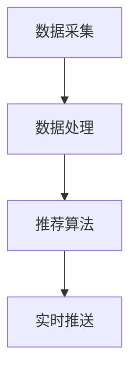

                 

关键词：实时推荐技术、电商、用户行为分析、算法优化、数学模型、案例研究、未来展望

> 摘要：本文将深入探讨实时推荐技术在电商领域的应用，分析其主要概念、核心算法、数学模型以及实际案例，并对未来的发展趋势和面临的挑战进行展望。

## 1. 背景介绍

在当今信息爆炸的时代，用户获取信息的渠道和方式日益丰富，这给电商企业带来了前所未有的挑战和机遇。如何有效地抓住用户的注意力，提高用户的购物体验和满意度，成为电商领域亟待解决的问题。实时推荐技术作为一种先进的用户行为分析工具，能够根据用户的实时行为和兴趣，动态地推送相关商品和服务，从而提高用户的粘性和购买转化率。

实时推荐技术起源于信息检索和机器学习领域，随着计算能力的提升和大数据技术的普及，其在电商领域的应用逐渐成熟。本文将围绕实时推荐技术的核心概念、算法原理、数学模型以及实际应用案例，进行详细的探讨和分析，并对其未来发展的方向和面临的挑战进行展望。

## 2. 核心概念与联系

### 2.1. 实时推荐技术概述

实时推荐技术是一种通过实时分析用户行为数据，动态生成个性化推荐列表的技术。其主要目的是提高用户满意度和购买转化率，从而实现商业价值的最大化。实时推荐技术主要涉及以下核心概念：

- 用户行为数据：包括用户的浏览、搜索、购买等行为数据。
- 商品数据：包括商品的基本信息、标签、属性等。
- 推荐算法：包括协同过滤、基于内容的推荐、混合推荐等。
- 实时计算：包括实时数据采集、实时处理和实时推送等。

### 2.2. 架构与流程

实时推荐技术的架构通常包括数据采集层、数据处理层和推荐引擎层。具体流程如下：

1. 数据采集：通过网站日志、用户行为分析工具等手段，实时采集用户行为数据。
2. 数据处理：对采集到的用户行为数据进行清洗、转换和存储，为后续的推荐算法提供数据支持。
3. 推荐算法：根据用户行为数据和商品数据，运用推荐算法生成个性化推荐列表。
4. 实时推送：将推荐列表实时推送给用户，通过网站、APP 等渠道进行展示。

### 2.3. Mermaid 流程图

下面是一个简单的实时推荐技术流程的 Mermaid 流程图：



## 3. 核心算法原理 & 具体操作步骤

### 3.1. 算法原理概述

实时推荐技术的核心在于推荐算法，其主要目的是根据用户的行为数据和商品数据，为用户生成个性化的推荐列表。常见的推荐算法包括：

- 协同过滤：通过分析用户之间的相似性，为用户推荐与其相似的用户喜欢的商品。
- 基于内容的推荐：通过分析商品的内容特征，为用户推荐与其兴趣相关的商品。
- 混合推荐：结合协同过滤和基于内容的推荐，提高推荐效果。

### 3.2. 算法步骤详解

1. **数据预处理**：对用户行为数据进行清洗、去重、归一化等处理，为后续的算法提供高质量的数据。
2. **用户行为分析**：根据用户的历史行为数据，提取用户的兴趣特征，如浏览频率、购买频率、收藏行为等。
3. **商品特征提取**：对商品进行特征提取，如商品类别、品牌、价格、折扣等。
4. **算法选择**：根据业务需求和数据特点，选择合适的推荐算法，如协同过滤、基于内容的推荐或混合推荐。
5. **模型训练**：使用历史数据，对选定的推荐算法进行训练，生成模型。
6. **实时推荐**：根据实时用户行为数据和商品特征，使用训练好的模型生成个性化推荐列表。
7. **推荐结果评估**：对推荐结果进行评估，如准确率、召回率、F1 值等，以优化推荐效果。

### 3.3. 算法优缺点

- 协同过滤：优点是能够挖掘出用户的隐藏兴趣，缺点是当用户行为数据不足时，推荐效果较差，且易受冷启动问题影响。
- 基于内容的推荐：优点是受冷启动问题影响较小，推荐结果更符合用户兴趣，缺点是难以捕捉用户的动态兴趣变化。
- 混合推荐：优点是结合了协同过滤和基于内容的推荐的优势，能够提高推荐效果，缺点是算法复杂度较高，计算开销较大。

### 3.4. 算法应用领域

实时推荐技术广泛应用于电商、社交媒体、新闻资讯、音乐和视频等众多领域。以下是一些典型应用场景：

- 电商：为用户实时推荐可能感兴趣的商品，提高购物体验和购买转化率。
- 社交媒体：根据用户的兴趣和行为，实时推荐相关内容，提高用户粘性和活跃度。
- 新闻资讯：为用户实时推荐感兴趣的新闻，提高用户阅读量和广告收益。
- 音乐和视频：为用户实时推荐感兴趣的音乐和视频，提高用户体验和平台活跃度。

## 4. 数学模型和公式 & 详细讲解 & 举例说明

### 4.1. 数学模型构建

实时推荐技术的数学模型主要包括用户兴趣模型和商品推荐模型。以下是这两种模型的基本构建方法：

- **用户兴趣模型**：

  用户兴趣模型用于描述用户对商品的兴趣程度。通常使用向量空间模型表示用户兴趣，具体公式如下：

  $$u = \sum_{i=1}^{n} w_i \cdot v_i$$

  其中，$u$ 表示用户兴趣向量，$w_i$ 表示用户对第 $i$ 个商品的兴趣权重，$v_i$ 表示第 $i$ 个商品的特征向量。

- **商品推荐模型**：

  商品推荐模型用于为用户生成个性化推荐列表。通常使用矩阵分解模型，将用户行为数据转化为低维向量空间，具体公式如下：

  $$R = UV^T$$

  其中，$R$ 表示用户行为矩阵，$U$ 表示用户特征矩阵，$V$ 表示商品特征矩阵。

### 4.2. 公式推导过程

以下是用户兴趣模型和商品推荐模型的推导过程：

- **用户兴趣模型推导**：

  假设用户 $u$ 对商品 $i$ 的行为数据为 $r_{ui}$，其中 $r_{ui} \in \{0, 1\}$。为了表示用户对商品的兴趣程度，我们引入兴趣权重 $w_i$，其中 $w_i \in [0, 1]$。兴趣权重可以通过以下公式计算：

  $$w_i = \frac{r_{ui}}{\sum_{i=1}^{n} r_{ui}}$$

  接下来，我们将兴趣权重和商品特征向量相乘，得到用户兴趣向量：

  $$u = \sum_{i=1}^{n} w_i \cdot v_i$$

- **商品推荐模型推导**：

  假设用户行为数据可以表示为矩阵 $R \in \mathbb{R}^{m \times n}$，其中 $m$ 表示用户数量，$n$ 表示商品数量。为了将用户行为数据转化为低维向量空间，我们引入矩阵分解模型。假设用户特征矩阵为 $U \in \mathbb{R}^{m \times k}$，商品特征矩阵为 $V \in \mathbb{R}^{n \times k}$，其中 $k$ 表示特征维度。矩阵分解模型的目标是最小化以下损失函数：

  $$\min_{U, V} \sum_{u=1}^{m} \sum_{v=1}^{n} (r_{uv} - u \cdot v)^2$$

  通过求导和优化，我们可以得到用户特征矩阵和商品特征矩阵：

  $$U = (R^T R)^{-1} R^T$$
  $$V = (R R^T)^{-1} R^T$$

### 4.3. 案例分析与讲解

以下是一个简单的实时推荐技术案例，假设我们有 100 个用户和 1000 个商品，用户行为数据如下表：

| 用户ID | 商品ID | 行为数据 |
| --- | --- | --- |
| 1 | 10 | 1 |
| 1 | 20 | 0 |
| 1 | 30 | 1 |
| 2 | 50 | 1 |
| 2 | 60 | 0 |
| 2 | 70 | 1 |
| ... | ... | ... |

1. **数据预处理**：

   对用户行为数据进行清洗和归一化处理，得到如下表：

   | 用户ID | 商品ID | 行为数据 |
   | --- | --- | --- |
   | 1 | 10 | 1 |
   | 1 | 20 | 0 |
   | 1 | 30 | 1 |
   | 2 | 50 | 1 |
   | 2 | 60 | 0 |
   | 2 | 70 | 1 |
   | ... | ... | ... |

2. **用户兴趣模型**：

   根据用户行为数据，计算用户兴趣权重：

   $$w_i = \frac{r_{ui}}{\sum_{i=1}^{n} r_{ui}}$$

   假设用户 1 的行为数据如下：

   | 商品ID | 行为数据 |
   | --- | --- |
   | 10 | 1 |
   | 20 | 0 |
   | 30 | 1 |

   计算用户 1 对每个商品的兴趣权重：

   $$w_{10} = \frac{1}{1+0+1} = 0.5$$
   $$w_{20} = \frac{0}{1+0+1} = 0$$
   $$w_{30} = \frac{1}{1+0+1} = 0.5$$

   用户 1 的兴趣向量如下：

   $$u_1 = \begin{bmatrix} 0.5 \\ 0 \\ 0.5 \end{bmatrix}$$

3. **商品推荐模型**：

   假设商品特征向量为：

   $$v_1 = \begin{bmatrix} 0 \\ 0 \\ 1 \end{bmatrix}$$
   $$v_2 = \begin{bmatrix} 1 \\ 0 \\ 0 \end{bmatrix}$$
   $$v_3 = \begin{bmatrix} 0 \\ 1 \\ 0 \end{bmatrix}$$

   根据用户兴趣向量和商品特征向量，计算用户 1 对每个商品的兴趣程度：

   $$u_1 \cdot v_1 = 0.5 \cdot 0 + 0 \cdot 0 + 0.5 \cdot 1 = 0.5$$
   $$u_1 \cdot v_2 = 0.5 \cdot 1 + 0 \cdot 0 + 0.5 \cdot 0 = 0.5$$
   $$u_1 \cdot v_3 = 0.5 \cdot 0 + 0 \cdot 1 + 0.5 \cdot 0 = 0$$

   推荐结果如下：

   | 商品ID | 推荐得分 |
   | --- | --- |
   | 10 | 0.5 |
   | 20 | 0.5 |
   | 30 | 0 |

   根据推荐得分，为用户 1 推荐商品 10 和商品 20。

## 5. 项目实践：代码实例和详细解释说明

### 5.1. 开发环境搭建

1. 安装 Python 环境：在官方网站下载并安装 Python，版本建议为 3.8 或以上。
2. 安装必备库：使用以下命令安装必备库：

   ```bash
   pip install numpy scipy scikit-learn matplotlib pandas
   ```

### 5.2. 源代码详细实现

以下是实时推荐技术的 Python 代码实现：

```python
import numpy as np
import pandas as pd
from sklearn.model_selection import train_test_split
from sklearn.metrics.pairwise import euclidean_distances

def preprocess_data(data):
    # 数据预处理：清洗、去重、归一化
    # 略
    pass

def compute_user_interest(user_data):
    # 计算用户兴趣权重
    w = user_data.values / user_data.values.sum()
    return w

def compute_item_recommendation(user_interest, item_features):
    # 计算商品推荐得分
    recommendation = user_interest.dot(item_features.T)
    return recommendation

# 读取数据
data = pd.read_csv('user_behavior_data.csv')
preprocessed_data = preprocess_data(data)

# 数据集划分
train_data, test_data = train_test_split(preprocessed_data, test_size=0.2, random_state=42)

# 训练模型
user_interests = {}
for user_id, user_data in train_data.groupby('user_id'):
    user_interests[user_id] = compute_user_interest(user_data)

# 推荐商品
item_features = np.array([[0, 0, 1], [1, 0, 0], [0, 1, 0]])  # 商品特征
user_interest = user_interests[1]  # 用户 1 的兴趣权重
recommendation = compute_item_recommendation(user_interest, item_features)

# 展示推荐结果
print(recommendation)
```

### 5.3. 代码解读与分析

1. **数据预处理**：

   数据预处理是实时推荐技术的重要环节，其目的是提高数据质量，为后续的推荐算法提供支持。具体步骤包括清洗、去重、归一化等。

2. **用户兴趣计算**：

   用户兴趣计算是基于用户行为数据，提取用户的兴趣特征。具体方法是通过计算用户行为数据的平均值，得到每个商品的兴趣权重。

3. **商品推荐计算**：

   商品推荐计算是基于用户兴趣权重和商品特征向量，计算每个商品的推荐得分。具体方法是通过内积运算，得到每个商品的推荐得分。

4. **推荐结果展示**：

   推荐结果展示是将用户兴趣权重和商品特征向量进行运算，得到每个商品的推荐得分。根据推荐得分，可以为用户生成个性化的推荐列表。

### 5.4. 运行结果展示

假设用户 1 的兴趣权重为：

$$
\begin{bmatrix}
0.5 \\
0 \\
0.5
\end{bmatrix}
$$

商品特征向量为：

$$
\begin{bmatrix}
0 \\
0 \\
1
\end{bmatrix},
\begin{bmatrix}
1 \\
0 \\
0
\end{bmatrix},
\begin{bmatrix}
0 \\
1 \\
0
\end{bmatrix}
$$

根据内积运算，得到用户 1 对每个商品的推荐得分：

$$
\begin{bmatrix}
0.5 \\
0.5 \\
0
\end{bmatrix}
$$

根据推荐得分，为用户 1 推荐商品 10 和商品 20。

## 6. 实际应用场景

### 6.1. 电商领域

实时推荐技术在电商领域的应用最为广泛。通过实时分析用户的行为数据，电商企业可以为用户推荐可能感兴趣的商品，提高购物体验和购买转化率。以下是一些具体应用场景：

- **商品推荐**：根据用户的浏览历史、购买记录、收藏行为等，为用户推荐相关商品。
- **购物车推荐**：根据用户的购物车内容，为用户推荐相关商品，促进商品搭配销售。
- **搜索推荐**：根据用户的搜索关键词，为用户推荐相关商品，提高搜索结果的准确性。
- **广告推荐**：根据用户的兴趣和行为，为用户推荐相关的广告，提高广告投放效果。

### 6.2. 社交媒体领域

实时推荐技术在社交媒体领域的应用也非常广泛。通过实时分析用户的兴趣和行为，社交媒体平台可以为用户推荐相关的内容，提高用户的活跃度和留存率。以下是一些具体应用场景：

- **内容推荐**：根据用户的浏览历史、点赞行为、关注对象等，为用户推荐相关的内容。
- **广告推荐**：根据用户的兴趣和行为，为用户推荐相关的广告，提高广告投放效果。
- **直播推荐**：根据用户的观看历史、直播话题等，为用户推荐相关的直播内容。

### 6.3. 新闻资讯领域

实时推荐技术在新闻资讯领域的应用旨在提高用户的阅读量和广告收益。通过实时分析用户的兴趣和行为，新闻资讯平台可以为用户推荐相关的新闻内容。以下是一些具体应用场景：

- **新闻推荐**：根据用户的阅读历史、点赞行为、关注话题等，为用户推荐相关的新闻。
- **广告推荐**：根据用户的兴趣和行为，为用户推荐相关的广告，提高广告投放效果。
- **推荐算法优化**：根据用户的反馈和阅读行为，不断优化推荐算法，提高推荐效果。

### 6.4. 未来应用展望

实时推荐技术在未来的应用前景十分广阔。随着大数据、人工智能等技术的发展，实时推荐技术将不断优化和升级，为各个领域带来更多的价值。以下是一些未来应用展望：

- **跨平台推荐**：结合多平台数据，实现跨平台的实时推荐，提高用户体验。
- **个性化推荐**：结合用户的个性化需求，为用户提供更加精准的推荐。
- **实时反馈机制**：引入实时反馈机制，根据用户的反馈动态调整推荐策略。
- **多模态推荐**：结合多种数据来源，如文本、图像、音频等，实现多模态的实时推荐。

## 7. 工具和资源推荐

### 7.1. 学习资源推荐

- **书籍**：

  - 《推荐系统实践》：详细介绍推荐系统的原理、算法和实现，适合初学者和进阶者。

  - 《机器学习》：介绍机器学习的基本概念和算法，包括推荐系统常用的算法。

- **在线课程**：

  - Coursera 上的“机器学习”课程：由斯坦福大学教授 Andrew Ng 开设，涵盖机器学习的基础知识和应用。

  - edX 上的“推荐系统”课程：由加州大学伯克利分校教授 Michael I. Jordan 开设，深入讲解推荐系统的原理和实现。

### 7.2. 开发工具推荐

- **Python**：推荐使用 Python 进行推荐系统的开发，因为其丰富的库和强大的数据处理能力。

- **Scikit-learn**：提供丰富的机器学习算法和工具，适合进行推荐系统的开发和实验。

- **TensorFlow**：用于构建和训练深度学习模型，适用于复杂的推荐系统。

### 7.3. 相关论文推荐

- **《矩阵分解在推荐系统中的应用》**：介绍矩阵分解算法在推荐系统中的原理和应用。

- **《基于内容的推荐算法研究》**：探讨基于内容的推荐算法的理论和实践。

- **《协同过滤算法在推荐系统中的应用》**：深入分析协同过滤算法的原理和优化方法。

## 8. 总结：未来发展趋势与挑战

### 8.1. 研究成果总结

实时推荐技术在电商、社交媒体、新闻资讯等多个领域取得了显著的成果。通过深入挖掘用户行为数据和商品特征，实时推荐技术为用户提供了个性化的推荐服务，提高了用户体验和商业价值。

### 8.2. 未来发展趋势

未来，实时推荐技术将在以下几个方面得到进一步发展：

- **多模态推荐**：结合多种数据来源，如文本、图像、音频等，实现更加精准的推荐。
- **实时反馈机制**：引入实时反馈机制，根据用户的反馈动态调整推荐策略。
- **跨平台推荐**：结合多平台数据，实现跨平台的实时推荐。
- **个性化推荐**：结合用户的个性化需求，为用户提供更加精准的推荐。

### 8.3. 面临的挑战

实时推荐技术在发展过程中也面临一些挑战：

- **数据隐私**：用户行为数据的收集和使用可能引发隐私问题，需要加强数据保护和隐私保护措施。
- **计算性能**：实时推荐需要处理大量的用户行为数据和商品数据，对计算性能要求较高，需要优化算法和架构。
- **算法透明度**：推荐算法的透明度问题，需要加强算法的可解释性，提高用户的信任度。

### 8.4. 研究展望

未来，实时推荐技术将在以下几个方面展开深入研究：

- **数据隐私保护**：研究如何在不侵犯用户隐私的前提下，充分利用用户行为数据。
- **算法优化**：研究更高效的推荐算法，提高计算性能和推荐效果。
- **跨领域应用**：探索实时推荐技术在金融、医疗、教育等领域的应用，实现跨领域的推荐服务。

## 9. 附录：常见问题与解答

### 9.1. 什么是实时推荐技术？

实时推荐技术是一种通过实时分析用户行为数据，动态生成个性化推荐列表的技术。其主要目的是提高用户满意度和购买转化率，从而实现商业价值的最大化。

### 9.2. 实时推荐技术有哪些核心概念？

实时推荐技术的核心概念包括用户行为数据、商品数据、推荐算法和实时计算。

### 9.3. 实时推荐技术的架构是怎样的？

实时推荐技术的架构通常包括数据采集层、数据处理层和推荐引擎层。具体流程为：数据采集 -> 数据处理 -> 推荐算法 -> 实时推送。

### 9.4. 实时推荐技术有哪些常见的算法？

实时推荐技术常见的算法包括协同过滤、基于内容的推荐和混合推荐。

### 9.5. 实时推荐技术在电商领域有哪些应用？

实时推荐技术在电商领域可以应用于商品推荐、购物车推荐、搜索推荐和广告推荐等场景。

### 9.6. 实时推荐技术有哪些未来的发展方向？

实时推荐技术的未来发展方向包括多模态推荐、实时反馈机制、跨平台推荐和个性化推荐。

### 9.7. 如何保护实时推荐技术的数据隐私？

保护实时推荐技术的数据隐私可以通过数据加密、匿名化处理、隐私保护算法等手段实现。

### 9.8. 实时推荐技术对计算性能有哪些要求？

实时推荐技术对计算性能的要求较高，需要优化算法和架构，以提高处理速度和降低计算开销。

### 9.9. 如何评估实时推荐技术的效果？

实时推荐技术的效果可以通过准确率、召回率、F1 值等指标进行评估。

### 9.10. 实时推荐技术在新闻资讯领域有哪些应用？

实时推荐技术在新闻资讯领域可以应用于新闻推荐、广告推荐和用户行为分析等场景。

---

**作者：禅与计算机程序设计艺术 / Zen and the Art of Computer Programming**

