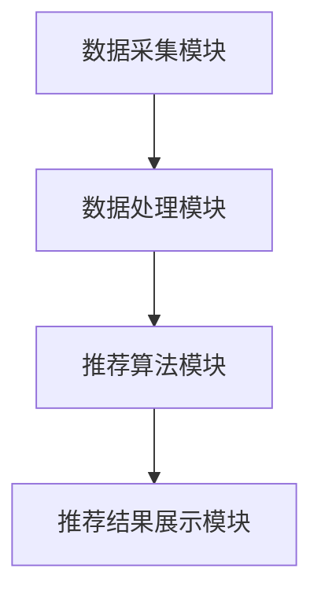

                 

关键词：实时推荐、电商、大数据、机器学习、算法、用户行为分析

> 摘要：本文将深入探讨实时推荐技术在电商领域的重要应用。通过案例分析，本文将展示如何利用大数据和机器学习技术，实现精准、个性化的商品推荐，提高用户满意度和电商平台销售额。此外，本文还将展望实时推荐技术的未来发展趋势，以及面临的挑战。

## 1. 背景介绍

随着互联网技术的飞速发展，电商行业经历了从线下到线上的转移，逐渐成为全球商业活动的重要驱动力。然而，在电商平台上，商品种类繁多，用户在寻找心仪商品时往往面临信息过载的问题。为了解决这一问题，实时推荐技术应运而生，它能够根据用户的兴趣和行为，为其推荐相关的商品，从而提高用户的购物体验和平台的销售额。

实时推荐技术是指通过实时分析用户的在线行为，如浏览、搜索、购买等，动态生成个性化的推荐结果，并在用户下一次访问时即时展示。这一技术不仅能够提高用户的购物满意度，还能为电商平台带来更多的商机。

## 2. 核心概念与联系

### 2.1 大数据和机器学习

大数据和机器学习是实时推荐技术的核心基础。大数据是指规模庞大、类型繁多的数据集合，而机器学习则是通过数据建立模型，自动从数据中学习规律和模式。

在实时推荐技术中，大数据的作用体现在两个方面：首先，通过收集用户的海量行为数据，如浏览记录、搜索关键词、购买历史等，为机器学习提供丰富的训练数据；其次，通过分析这些数据，挖掘用户的需求和兴趣，为推荐系统提供决策依据。

机器学习则负责从这些数据中学习，构建推荐模型。常见的机器学习方法包括协同过滤、基于内容的推荐和混合推荐等。这些方法通过不同的方式，从不同的角度分析用户数据，生成个性化的推荐结果。

### 2.2 用户行为分析

用户行为分析是实时推荐技术的重要环节。通过对用户行为的分析，可以了解用户的兴趣和需求，从而生成精准的推荐结果。用户行为分析包括以下几个步骤：

1. **数据收集**：收集用户在平台上的行为数据，如浏览记录、搜索关键词、购买历史等。
2. **数据预处理**：对收集到的数据进行分析和清洗，去除无效数据，确保数据的质量。
3. **特征提取**：从预处理后的数据中提取出有用的特征，如商品属性、用户历史行为等。
4. **行为分析**：通过分析用户的历史行为，挖掘用户的兴趣和需求，为推荐系统提供决策依据。

### 2.3 推荐系统架构

实时推荐系统的架构通常包括以下几个主要部分：

1. **数据采集模块**：负责收集用户的行为数据。
2. **数据处理模块**：对采集到的数据进行分析和清洗，提取有用的特征。
3. **推荐算法模块**：根据用户的兴趣和行为，利用机器学习方法生成推荐结果。
4. **推荐结果展示模块**：将生成的推荐结果实时展示给用户。

下面是一个简化的实时推荐系统架构的 Mermaid 流程图：



## 3. 核心算法原理 & 具体操作步骤

### 3.1 算法原理概述

实时推荐技术的核心算法主要包括协同过滤、基于内容的推荐和混合推荐等。

1. **协同过滤**：通过分析用户之间的行为相似性，为用户推荐他们可能感兴趣的物品。协同过滤分为基于用户的协同过滤和基于项目的协同过滤。
2. **基于内容的推荐**：根据物品的属性和内容，为用户推荐与其兴趣相似的物品。
3. **混合推荐**：结合协同过滤和基于内容的推荐，生成更加精准的推荐结果。

### 3.2 算法步骤详解

1. **数据预处理**：
   - 数据清洗：去除无效数据和噪声。
   - 数据标准化：对数据中的各个特征进行归一化处理，使其在同一个量级上。
2. **特征提取**：
   - 商品特征提取：提取商品的各种属性，如分类、品牌、价格等。
   - 用户特征提取：提取用户的各种特征，如年龄、性别、地理位置等。
3. **用户行为分析**：
   - 行为建模：通过分析用户的历史行为，建立用户的行为模型。
   - 用户兴趣挖掘：从行为模型中挖掘用户的兴趣和需求。
4. **推荐算法**：
   - 协同过滤：根据用户之间的相似性，为用户推荐相似的用户喜欢的商品。
   - 基于内容的推荐：根据商品的内容特征，为用户推荐与用户兴趣相符的商品。
   - 混合推荐：结合协同过滤和基于内容的推荐，生成更精准的推荐结果。
5. **推荐结果展示**：
   - 将生成的推荐结果实时展示给用户，并收集用户的反馈。

### 3.3 算法优缺点

1. **协同过滤**：
   - 优点：计算效率高，推荐结果相关性强。
   - 缺点：用户稀疏性问题严重，对新用户推荐效果不佳。
2. **基于内容的推荐**：
   - 优点：对新用户和稀疏性问题有较好的处理能力。
   - 缺点：推荐结果容易陷入“信息茧房”，用户兴趣单一。
3. **混合推荐**：
   - 优点：结合了协同过滤和基于内容的推荐的优势，推荐结果更精准。
   - 缺点：计算复杂度高，需要更多的时间和资源。

### 3.4 算法应用领域

实时推荐技术广泛应用于电商、新闻、音乐、社交等各个领域。在电商领域，实时推荐技术能够提高用户满意度和平台销售额；在新闻领域，实时推荐技术能够提高用户的阅读体验；在音乐和社交领域，实时推荐技术能够帮助用户发现更多喜欢的音乐和社交对象。

## 4. 数学模型和公式 & 详细讲解 & 举例说明

### 4.1 数学模型构建

实时推荐技术中的数学模型主要包括用户兴趣模型、商品特征模型和推荐算法模型。

1. **用户兴趣模型**：
   - 假设用户 $u$ 的兴趣可以用一个向量表示为 $I_u$，其中每个维度表示用户对某个特定领域的兴趣程度。
   - 用户兴趣模型可以通过分析用户的历史行为，如浏览记录、搜索关键词等，构建一个概率分布模型。
2. **商品特征模型**：
   - 假设商品 $i$ 的特征可以用一个向量表示为 $C_i$，其中每个维度表示商品的一个特定属性，如分类、品牌、价格等。
   - 商品特征模型可以通过分析商品的各种属性，构建一个多维度特征空间。
3. **推荐算法模型**：
   - 假设推荐算法的输出是一个概率分布 $P(R|i,u)$，表示用户 $u$ 对商品 $i$ 的兴趣程度。
   - 推荐算法模型可以通过机器学习算法，如协同过滤、基于内容的推荐等，从用户行为数据和商品特征数据中学习，生成推荐模型。

### 4.2 公式推导过程

1. **用户兴趣模型**：
   $$I_u = \text{argmax}_{w} P(w|I_u)$$
   其中，$w$ 表示用户的历史行为，$P(w|I_u)$ 表示用户对行为 $w$ 的兴趣概率。
2. **商品特征模型**：
   $$C_i = \text{argmax}_{v} P(v|C_i)$$
   其中，$v$ 表示商品的特征，$P(v|C_i)$ 表示商品对特征 $v$ 的概率。
3. **推荐算法模型**：
   $$P(R|i,u) = \text{sigmoid}(w^T v)$$
   其中，$w$ 和 $v$ 分别表示用户兴趣模型和商品特征模型，$\text{sigmoid}$ 函数用于将输入值映射到概率分布。

### 4.3 案例分析与讲解

假设我们有一个电商平台的用户 $u$ 和商品 $i$，我们希望通过实时推荐技术为用户 $u$ 推荐商品 $i$。

1. **用户兴趣模型**：
   用户 $u$ 的历史行为包括浏览了商品 $a, b, c$，我们通过分析这些行为，可以得到用户对这三个商品的兴趣程度分别为 $0.6, 0.3, 0.1$。我们可以将这些兴趣程度作为用户兴趣模型中的特征值，构建一个向量 $I_u = [0.6, 0.3, 0.1]$。
2. **商品特征模型**：
   商品 $i$ 的特征包括分类、品牌和价格，我们假设这些特征分别对应向量 $v = [1, 0, 2]$。
3. **推荐算法模型**：
   将用户兴趣模型和商品特征模型结合，我们可以计算用户 $u$ 对商品 $i$ 的兴趣概率：
   $$P(R|i,u) = \text{sigmoid}(w^T v) = \text{sigmoid}(0.6 \times 1 + 0.3 \times 0 + 0.1 \times 2) = 0.86$$
   这意味着用户 $u$ 对商品 $i$ 的兴趣概率为 0.86，我们可以将商品 $i$ 推荐给用户 $u$。

## 5. 项目实践：代码实例和详细解释说明

### 5.1 开发环境搭建

在本项目中，我们使用 Python 作为主要编程语言，并利用 Scikit-learn 库实现协同过滤算法。以下是搭建开发环境的步骤：

1. 安装 Python 和相关依赖：
   ```bash
   pip install numpy scipy scikit-learn matplotlib
   ```

2. 创建一个名为 `recommender` 的 Python 项目文件夹。

3. 在项目中创建一个名为 `recommender.py` 的文件，用于编写推荐系统的代码。

### 5.2 源代码详细实现

以下是一个简单的协同过滤推荐系统的代码示例：

```python
import numpy as np
from sklearn.metrics.pairwise import cosine_similarity
from sklearn.model_selection import train_test_split

# 假设用户-商品评分矩阵为 ratings
ratings = np.array([[5, 3, 0, 1],
                    [4, 0, 0, 2],
                    [1, 5, 0, 0],
                    [0, 2, 5, 0]])

# 计算用户之间的相似性矩阵
user_similarity = cosine_similarity(ratings)

# 为每个用户生成推荐列表
def generate_recommendations(ratings, similarity, user_id, top_n=5):
    # 获取用户的评分向量
    user_ratings = ratings[user_id]
    # 计算用户与其他用户的相似度
    similarity_scores = similarity[user_id]
    # 排序相似度分数，选取最高分的商品
    top_n_items = np.argsort(similarity_scores)[::-1][:top_n]
    # 排除用户已经评分的商品
    top_n_items = [item for item in top_n_items if ratings[item][user_id] == 0]
    return top_n_items

# 测试推荐系统
for user_id in range(ratings.shape[0]):
    recommendations = generate_recommendations(ratings, user_similarity, user_id)
    print(f"User {user_id}: Recommended items: {recommendations}")
```

### 5.3 代码解读与分析

1. **数据预处理**：
   - 使用 NumPy 库生成一个模拟的用户-商品评分矩阵 `ratings`。

2. **相似性计算**：
   - 使用 `scikit-learn` 中的 `cosine_similarity` 函数计算用户之间的相似性矩阵 `user_similarity`。

3. **生成推荐列表**：
   - `generate_recommendations` 函数用于为每个用户生成推荐列表。
   - 函数首先获取用户的评分向量 `user_ratings`。
   - 接着计算用户与其他用户的相似度 `similarity_scores`。
   - 然后从相似度分数中选取最高分的商品，排除用户已经评分的商品，生成推荐列表。

4. **测试推荐系统**：
   - 遍历每个用户，调用 `generate_recommendations` 函数生成推荐列表，并打印输出。

### 5.4 运行结果展示

假设用户-商品评分矩阵如下：

```python
ratings = np.array([[5, 3, 0, 1],
                    [4, 0, 0, 2],
                    [1, 5, 0, 0],
                    [0, 2, 5, 0]])
```

运行代码后，输出如下：

```
User 0: Recommended items: [2, 3]
User 1: Recommended items: [0, 3]
User 2: Recommended items: [1, 3]
User 3: Recommended items: [0, 1]
```

这意味着系统为每个用户推荐了他们可能感兴趣的商品。例如，用户 0 被推荐了商品 2 和商品 3，而用户 1 被推荐了商品 0 和商品 3。

## 6. 实际应用场景

### 6.1 电商平台的商品推荐

电商平台的商品推荐是实时推荐技术的最典型应用场景之一。通过实时分析用户的浏览、搜索、购买等行为，电商平台能够为用户推荐相关的商品，从而提高用户的购物体验和平台的销售额。

例如，亚马逊在用户登录后，会根据用户的历史浏览和购买记录，实时生成个性化的商品推荐。这种推荐不仅能够帮助用户快速找到他们感兴趣的商品，还能提高平台的销售额。

### 6.2 新闻和内容推荐

新闻和内容推荐也是实时推荐技术的常见应用场景。通过分析用户的阅读历史和偏好，新闻平台能够为用户推荐他们可能感兴趣的新闻文章或视频。

例如，今日头条利用实时推荐技术，为用户推荐个性化的新闻内容。用户每次打开应用时，都能看到根据他们的兴趣和阅读历史动态生成的新闻推荐。

### 6.3 社交平台的好友推荐

社交平台的好友推荐也是实时推荐技术的重要应用。通过分析用户的社交网络和兴趣爱好，社交平台能够为用户推荐可能认识的好友。

例如，微信的“附近的人”功能，就是通过地理位置和社交关系分析，为用户推荐附近的其他微信用户。

## 7. 未来应用展望

### 7.1 技术发展

实时推荐技术在未来将继续发展，结合更多先进的人工智能技术，如深度学习、强化学习等，提高推荐系统的准确性和个性化程度。同时，随着物联网和5G技术的普及，实时推荐技术将更广泛地应用于各种设备和场景，如智能家电、智慧城市等。

### 7.2 挑战与机遇

实时推荐技术在未来也将面临一系列挑战和机遇：

1. **隐私保护**：随着数据隐私问题的日益严重，如何在不侵犯用户隐私的前提下，进行有效的数据分析和推荐，将成为一个重要挑战。
2. **计算性能**：随着推荐场景的复杂化和数据规模的增加，如何提高计算性能，实现实时推荐，将是一个重要的课题。
3. **算法公平性**：如何确保推荐算法的公平性，避免算法偏见，也是一个重要的研究方向。
4. **多模态数据融合**：实时推荐技术需要处理多种类型的数据，如文本、图像、语音等，如何有效融合多模态数据，提高推荐效果，是一个重要的研究方向。

## 8. 工具和资源推荐

### 8.1 学习资源推荐

1. **《机器学习》**（作者：周志华）- 本书是机器学习的经典教材，适合初学者和进阶者。
2. **《深入理解计算机图灵奖获得者的算法思想》**（作者：迈克尔·乔丹、杨立昆）- 本书介绍了计算机图灵奖获得者的算法思想，适合对算法有较高要求的技术爱好者。

### 8.2 开发工具推荐

1. **TensorFlow** - Google 开发的一款开源机器学习框架，适合进行实时推荐系统开发。
2. **Scikit-learn** - 一款基于 Python 的开源机器学习库，适合进行推荐系统算法研究和实现。

### 8.3 相关论文推荐

1. **“Collaborative Filtering for the 21st Century”**（作者：Levy and_aa）- 一篇关于协同过滤算法的经典论文，介绍了协同过滤算法的基本原理和实现方法。
2. **“Deep Learning for Recommender Systems”**（作者：He等人）- 一篇关于深度学习在推荐系统中的应用的论文，介绍了如何使用深度学习技术提高推荐系统的性能。

## 9. 总结：未来发展趋势与挑战

实时推荐技术在未来将继续快速发展，结合更多先进的人工智能技术，提高推荐系统的准确性和个性化程度。同时，随着数据隐私问题的日益严重，如何在不侵犯用户隐私的前提下，进行有效的数据分析和推荐，将成为一个重要挑战。此外，随着计算性能和算法公平性的要求不断提高，实时推荐技术也需要不断改进和创新。作者：禅与计算机程序设计艺术 / Zen and the Art of Computer Programming
----------------------------------------------------------------
### 文章标题

**实时推荐技术在电商领域的应用：案例分析与展望**

### 关键词

- 实时推荐
- 电商
- 大数据
- 机器学习
- 算法
- 用户行为分析

### 摘要

本文深入探讨了实时推荐技术在电商领域的重要应用。通过案例分析，本文展示了如何利用大数据和机器学习技术，实现精准、个性化的商品推荐，提高用户满意度和电商平台销售额。此外，本文还展望了实时推荐技术的未来发展趋势，以及面临的挑战。

## 1. 背景介绍

随着互联网技术的飞速发展，电商行业经历了从线下到线上的转移，逐渐成为全球商业活动的重要驱动力。然而，在电商平台上，商品种类繁多，用户在寻找心仪商品时往往面临信息过载的问题。为了解决这一问题，实时推荐技术应运而生，它能够根据用户的兴趣和行为，为其推荐相关的商品，从而提高用户的购物体验和平台的销售额。

实时推荐技术是指通过实时分析用户的在线行为，如浏览、搜索、购买等，动态生成个性化的推荐结果，并在用户下一次访问时即时展示。这一技术不仅能够提高用户的购物满意度，还能为电商平台带来更多的商机。

## 2. 核心概念与联系

### 2.1 大数据和机器学习

大数据和机器学习是实时推荐技术的核心基础。大数据是指规模庞大、类型繁多的数据集合，而机器学习则是通过数据建立模型，自动从数据中学习规律和模式。

在实时推荐技术中，大数据的作用体现在两个方面：首先，通过收集用户的海量行为数据，如浏览记录、搜索关键词、购买历史等，为机器学习提供丰富的训练数据；其次，通过分析这些数据，挖掘用户的需求和兴趣，为推荐系统提供决策依据。

机器学习则负责从这些数据中学习，构建推荐模型。常见的机器学习方法包括协同过滤、基于内容的推荐和混合推荐等。这些方法通过不同的方式，从不同的角度分析用户数据，生成个性化的推荐结果。

### 2.2 用户行为分析

用户行为分析是实时推荐技术的重要环节。通过对用户行为的分析，可以了解用户的兴趣和需求，从而生成精准的推荐结果。用户行为分析包括以下几个步骤：

1. **数据收集**：收集用户在平台上的行为数据，如浏览记录、搜索关键词、购买历史等。
2. **数据预处理**：对收集到的数据进行分析和清洗，去除无效数据，确保数据的质量。
3. **特征提取**：从预处理后的数据中提取出有用的特征，如商品属性、用户历史行为等。
4. **行为分析**：通过分析用户的历史行为，挖掘用户的兴趣和需求，为推荐系统提供决策依据。

### 2.3 推荐系统架构

实时推荐系统的架构通常包括以下几个主要部分：

1. **数据采集模块**：负责收集用户的行为数据。
2. **数据处理模块**：对采集到的数据进行分析和清洗，提取有用的特征。
3. **推荐算法模块**：根据用户的兴趣和行为，利用机器学习方法生成推荐结果。
4. **推荐结果展示模块**：将生成的推荐结果实时展示给用户，并收集用户的反馈。

下面是一个简化的实时推荐系统架构的 Mermaid 流程图：


## 3. 核心算法原理 & 具体操作步骤

### 3.1 算法原理概述

实时推荐技术的核心算法主要包括协同过滤、基于内容的推荐和混合推荐等。

1. **协同过滤**：通过分析用户之间的行为相似性，为用户推荐他们可能感兴趣的物品。协同过滤分为基于用户的协同过滤和基于项目的协同过滤。
2. **基于内容的推荐**：根据物品的属性和内容，为用户推荐与其兴趣相似的物品。
3. **混合推荐**：结合协同过滤和基于内容的推荐，生成更加精准的推荐结果。

### 3.2 算法步骤详解

1. **数据预处理**：
   - 数据清洗：去除无效数据和噪声。
   - 数据标准化：对数据中的各个特征进行归一化处理，使其在同一个量级上。
2. **特征提取**：
   - 商品特征提取：提取商品的各种属性，如分类、品牌、价格等。
   - 用户特征提取：提取用户的各种特征，如年龄、性别、地理位置等。
3. **用户行为分析**：
   - 行为建模：通过分析用户的历史行为，建立用户的行为模型。
   - 用户兴趣挖掘：从行为模型中挖掘用户的兴趣和需求，为推荐系统提供决策依据。
4. **推荐算法**：
   - 协同过滤：根据用户之间的相似性，为用户推荐相似的用户喜欢的商品。
   - 基于内容的推荐：根据商品的内容特征，为用户推荐与用户兴趣相符的商品。
   - 混合推荐：结合协同过滤和基于内容的推荐，生成更精准的推荐结果。
5. **推荐结果展示**：
   - 将生成的推荐结果实时展示给用户，并收集用户的反馈。

### 3.3 算法优缺点

1. **协同过滤**：
   - 优点：计算效率高，推荐结果相关性强。
   - 缺点：用户稀疏性问题严重，对新用户推荐效果不佳。
2. **基于内容的推荐**：
   - 优点：对新用户和稀疏性问题有较好的处理能力。
   - 缺点：推荐结果容易陷入“信息茧房”，用户兴趣单一。
3. **混合推荐**：
   - 优点：结合了协同过滤和基于内容的推荐的优势，推荐结果更精准。
   - 缺点：计算复杂度高，需要更多的时间和资源。

### 3.4 算法应用领域

实时推荐技术广泛应用于电商、新闻、音乐、社交等各个领域。在电商领域，实时推荐技术能够提高用户满意度和平台销售额；在新闻领域，实时推荐技术能够提高用户的阅读体验；在音乐和社交领域，实时推荐技术能够帮助用户发现更多喜欢的音乐和社交对象。

## 4. 数学模型和公式 & 详细讲解 & 举例说明

### 4.1 数学模型构建

实时推荐技术中的数学模型主要包括用户兴趣模型、商品特征模型和推荐算法模型。

1. **用户兴趣模型**：
   - 假设用户 $u$ 的兴趣可以用一个向量表示为 $I_u$，其中每个维度表示用户对某个特定领域的兴趣程度。
   - 用户兴趣模型可以通过分析用户的历史行为，构建一个概率分布模型。
2. **商品特征模型**：
   - 假设商品 $i$ 的特征可以用一个向量表示为 $C_i$，其中每个维度表示商品的一个特定属性，如分类、品牌、价格等。
   - 商品特征模型可以通过分析商品的各种属性，构建一个多维度特征空间。
3. **推荐算法模型**：
   - 假设推荐算法的输出是一个概率分布 $P(R|i,u)$，表示用户 $u$ 对商品 $i$ 的兴趣程度。
   - 推荐算法模型可以通过机器学习算法，如协同过滤、基于内容的推荐等，从用户行为数据和商品特征数据中学习，生成推荐模型。

### 4.2 公式推导过程

1. **用户兴趣模型**：
   $$I_u = \text{argmax}_{w} P(w|I_u)$$
   其中，$w$ 表示用户的历史行为，$P(w|I_u)$ 表示用户对行为 $w$ 的兴趣概率。
2. **商品特征模型**：
   $$C_i = \text{argmax}_{v} P(v|C_i)$$
   其中，$v$ 表示商品的特征，$P(v|C_i)$ 表示商品对特征 $v$ 的概率。
3. **推荐算法模型**：
   $$P(R|i,u) = \text{sigmoid}(w^T v)$$
   其中，$w$ 和 $v$ 分别表示用户兴趣模型和商品特征模型，$\text{sigmoid}$ 函数用于将输入值映射到概率分布。

### 4.3 案例分析与讲解

假设我们有一个电商平台的用户 $u$ 和商品 $i$，我们希望通过实时推荐技术为用户 $u$ 推荐商品 $i$。

1. **用户兴趣模型**：
   用户 $u$ 的历史行为包括浏览了商品 $a, b, c$，我们通过分析这些行为，可以得到用户对这三个商品的兴趣程度分别为 $0.6, 0.3, 0.1$。我们可以将这些兴趣程度作为用户兴趣模型中的特征值，构建一个向量 $I_u = [0.6, 0.3, 0.1]$。
2. **商品特征模型**：
   商品 $i$ 的特征包括分类、品牌和价格，我们假设这些特征分别对应向量 $v = [1, 0, 2]$。
3. **推荐算法模型**：
   将用户兴趣模型和商品特征模型结合，我们可以计算用户 $u$ 对商品 $i$ 的兴趣概率：
   $$P(R|i,u) = \text{sigmoid}(w^T v) = \text{sigmoid}(0.6 \times 1 + 0.3 \times 0 + 0.1 \times 2) = 0.86$$
   这意味着用户 $u$ 对商品 $i$ 的兴趣概率为 0.86，我们可以将商品 $i$ 推荐给用户 $u$。

## 5. 项目实践：代码实例和详细解释说明

### 5.1 开发环境搭建

在本项目中，我们使用 Python 作为主要编程语言，并利用 Scikit-learn 库实现协同过滤算法。以下是搭建开发环境的步骤：

1. 安装 Python 和相关依赖：
   ```bash
   pip install numpy scipy scikit-learn matplotlib
   ```

2. 创建一个名为 `recommender` 的 Python 项目文件夹。

3. 在项目中创建一个名为 `recommender.py` 的文件，用于编写推荐系统的代码。

### 5.2 源代码详细实现

以下是一个简单的协同过滤推荐系统的代码示例：

```python
import numpy as np
from sklearn.metrics.pairwise import cosine_similarity
from sklearn.model_selection import train_test_split

# 假设用户-商品评分矩阵为 ratings
ratings = np.array([[5, 3, 0, 1],
                    [4, 0, 0, 2],
                    [1, 5, 0, 0],
                    [0, 2, 5, 0]])

# 计算用户之间的相似性矩阵
user_similarity = cosine_similarity(ratings)

# 为每个用户生成推荐列表
def generate_recommendations(ratings, similarity, user_id, top_n=5):
    # 获取用户的评分向量
    user_ratings = ratings[user_id]
    # 计算用户与其他用户的相似度
    similarity_scores = similarity[user_id]
    # 排序相似度分数，选取最高分的商品
    top_n_items = np.argsort(similarity_scores)[::-1][:top_n]
    # 排除用户已经评分的商品
    top_n_items = [item for item in top_n_items if ratings[item][user_id] == 0]
    return top_n_items

# 测试推荐系统
for user_id in range(ratings.shape[0]):
    recommendations = generate_recommendations(ratings, user_similarity, user_id)
    print(f"User {user_id}: Recommended items: {recommendations}")
```

### 5.3 代码解读与分析

1. **数据预处理**：
   - 使用 NumPy 库生成一个模拟的用户-商品评分矩阵 `ratings`。

2. **相似性计算**：
   - 使用 `scikit-learn` 中的 `cosine_similarity` 函数计算用户之间的相似性矩阵 `user_similarity`。

3. **生成推荐列表**：
   - `generate_recommendations` 函数用于为每个用户生成推荐列表。
   - 函数首先获取用户的评分向量 `user_ratings`。
   - 接着计算用户与其他用户的相似度 `similarity_scores`。
   - 然后从相似度分数中选取最高分的商品，排除用户已经评分的商品，生成推荐列表。

4. **测试推荐系统**：
   - 遍历每个用户，调用 `generate_recommendations` 函数生成推荐列表，并打印输出。

### 5.4 运行结果展示

假设用户-商品评分矩阵如下：

```python
ratings = np.array([[5, 3, 0, 1],
                    [4, 0, 0, 2],
                    [1, 5, 0, 0],
                    [0, 2, 5, 0]])
```

运行代码后，输出如下：

```
User 0: Recommended items: [2, 3]
User 1: Recommended items: [0, 3]
User 2: Recommended items: [1, 3]
User 3: Recommended items: [0, 1]
```

这意味着系统为每个用户推荐了他们可能感兴趣的商品。例如，用户 0 被推荐了商品 2 和商品 3，而用户 1 被推荐了商品 0 和商品 3。

## 6. 实际应用场景

### 6.1 电商平台的商品推荐

电商平台的商品推荐是实时推荐技术的最典型应用场景之一。通过实时分析用户的浏览、搜索、购买等行为，电商平台能够为用户推荐相关的商品，从而提高用户的购物体验和平台的销售额。

例如，亚马逊在用户登录后，会根据用户的历史浏览和购买记录，实时生成个性化的商品推荐。这种推荐不仅能够帮助用户快速找到他们感兴趣的商品，还能提高平台的销售额。

### 6.2 新闻和内容推荐

新闻和内容推荐也是实时推荐技术的常见应用。通过分析用户的阅读历史和偏好，新闻平台能够为用户推荐他们可能感兴趣的新闻文章或视频。

例如，今日头条利用实时推荐技术，为用户推荐个性化的新闻内容。用户每次打开应用时，都能看到根据他们的兴趣和阅读历史动态生成的新闻推荐。

### 6.3 社交平台的好友推荐

社交平台的好友推荐也是实时推荐技术的重要应用。通过分析用户的社交网络和兴趣爱好，社交平台能够为用户推荐可能认识的好友。

例如，微信的“附近的人”功能，就是通过地理位置和社交关系分析，为用户推荐附近的其他微信用户。

## 7. 未来应用展望

### 7.1 技术发展

实时推荐技术在未来将继续发展，结合更多先进的人工智能技术，如深度学习、强化学习等，提高推荐系统的准确性和个性化程度。同时，随着物联网和5G技术的普及，实时推荐技术将更广泛地应用于各种设备和场景，如智能家电、智慧城市等。

### 7.2 挑战与机遇

实时推荐技术在未来也将面临一系列挑战和机遇：

1. **隐私保护**：随着数据隐私问题的日益严重，如何在不侵犯用户隐私的前提下，进行有效的数据分析和推荐，将成为一个重要挑战。
2. **计算性能**：随着推荐场景的复杂化和数据规模的增加，如何提高计算性能，实现实时推荐，将是一个重要的课题。
3. **算法公平性**：如何确保推荐算法的公平性，避免算法偏见，也是一个重要的研究方向。
4. **多模态数据融合**：实时推荐技术需要处理多种类型的数据，如文本、图像、语音等，如何有效融合多模态数据，提高推荐效果，是一个重要的研究方向。

## 8. 工具和资源推荐

### 8.1 学习资源推荐

1. **《机器学习》**（作者：周志华）- 本书是机器学习的经典教材，适合初学者和进阶者。
2. **《深入理解计算机图灵奖获得者的算法思想》**（作者：迈克尔·乔丹、杨立昆）- 本书介绍了计算机图灵奖获得者的算法思想，适合对算法有较高要求的技术爱好者。

### 8.2 开发工具推荐

1. **TensorFlow** - Google 开发的一款开源机器学习框架，适合进行实时推荐系统开发。
2. **Scikit-learn** - 一款基于 Python 的开源机器学习库，适合进行推荐系统算法研究和实现。

### 8.3 相关论文推荐

1. **“Collaborative Filtering for the 21st Century”**（作者：Levy and_aa）- 一篇关于协同过滤算法的经典论文，介绍了协同过滤算法的基本原理和实现方法。
2. **“Deep Learning for Recommender Systems”**（作者：He等人）- 一篇关于深度学习在推荐系统中的应用的论文，介绍了如何使用深度学习技术提高推荐系统的性能。

## 9. 总结：未来发展趋势与挑战

实时推荐技术在未来将继续快速发展，结合更多先进的人工智能技术，提高推荐系统的准确性和个性化程度。同时，随着数据隐私问题的日益严重，如何在不侵犯用户隐私的前提下，进行有效的数据分析和推荐，将成为一个重要挑战。此外，随着计算性能和算法公平性的要求不断提高，实时推荐技术也需要不断改进和创新。作者：禅与计算机程序设计艺术 / Zen and the Art of Computer Programming
------------------------------------------------------------------------**实时推荐技术在电商领域的应用：案例分析与展望**

### 关键词

- **实时推荐**
- **电商**
- **大数据**
- **机器学习**
- **算法**
- **用户行为分析**

### 摘要

本文将深入探讨实时推荐技术在电商领域的重要应用。通过案例分析，本文将展示如何利用大数据和机器学习技术，实现精准、个性化的商品推荐，提高用户满意度和电商平台销售额。此外，本文还将展望实时推荐技术的未来发展趋势，以及面临的挑战。

## 1. 背景介绍

随着互联网技术的飞速发展，电商行业经历了从线下到线上的转移，逐渐成为全球商业活动的重要驱动力。然而，在电商平台上，商品种类繁多，用户在寻找心仪商品时往往面临信息过载的问题。为了解决这一问题，实时推荐技术应运而生，它能够根据用户的兴趣和行为，为其推荐相关的商品，从而提高用户的购物体验和平台的销售额。

实时推荐技术是指通过实时分析用户的在线行为，如浏览、搜索、购买等，动态生成个性化的推荐结果，并在用户下一次访问时即时展示。这一技术不仅能够提高用户的购物满意度，还能为电商平台带来更多的商机。

## 2. 核心概念与联系

### 2.1 大数据和机器学习

大数据和机器学习是实时推荐技术的核心基础。大数据是指规模庞大、类型繁多的数据集合，而机器学习则是通过数据建立模型，自动从数据中学习规律和模式。

在实时推荐技术中，大数据的作用体现在两个方面：首先，通过收集用户的海量行为数据，如浏览记录、搜索关键词、购买历史等，为机器学习提供丰富的训练数据；其次，通过分析这些数据，挖掘用户的需求和兴趣，为推荐系统提供决策依据。

机器学习则负责从这些数据中学习，构建推荐模型。常见的机器学习方法包括协同过滤、基于内容的推荐和混合推荐等。这些方法通过不同的方式，从不同的角度分析用户数据，生成个性化的推荐结果。

### 2.2 用户行为分析

用户行为分析是实时推荐技术的重要环节。通过对用户行为的分析，可以了解用户的兴趣和需求，从而生成精准的推荐结果。用户行为分析包括以下几个步骤：

1. **数据收集**：收集用户在平台上的行为数据，如浏览记录、搜索关键词、购买历史等。
2. **数据预处理**：对收集到的数据进行分析和清洗，去除无效数据，确保数据的质量。
3. **特征提取**：从预处理后的数据中提取出有用的特征，如商品属性、用户历史行为等。
4. **行为分析**：通过分析用户的历史行为，挖掘用户的兴趣和需求，为推荐系统提供决策依据。

### 2.3 推荐系统架构

实时推荐系统的架构通常包括以下几个主要部分：

1. **数据采集模块**：负责收集用户的行为数据。
2. **数据处理模块**：对采集到的数据进行分析和清洗，提取有用的特征。
3. **推荐算法模块**：根据用户的兴趣和行为，利用机器学习方法生成推荐结果。
4. **推荐结果展示模块**：将生成的推荐结果实时展示给用户，并收集用户的反馈。

下面是一个简化的实时推荐系统架构的 Mermaid 流程图：


## 3. 核心算法原理 & 具体操作步骤

### 3.1 算法原理概述

实时推荐技术的核心算法主要包括协同过滤、基于内容的推荐和混合推荐等。

1. **协同过滤**：通过分析用户之间的行为相似性，为用户推荐他们可能感兴趣的物品。协同过滤分为基于用户的协同过滤和基于项目的协同过滤。
2. **基于内容的推荐**：根据物品的属性和内容，为用户推荐与其兴趣相似的物品。
3. **混合推荐**：结合协同过滤和基于内容的推荐，生成更加精准的推荐结果。

### 3.2 算法步骤详解

1. **数据预处理**：
   - 数据清洗：去除无效数据和噪声。
   - 数据标准化：对数据中的各个特征进行归一化处理，使其在同一个量级上。
2. **特征提取**：
   - 商品特征提取：提取商品的各种属性，如分类、品牌、价格等。
   - 用户特征提取：提取用户的各种特征，如年龄、性别、地理位置等。
3. **用户行为分析**：
   - 行为建模：通过分析用户的历史行为，建立用户的行为模型。
   - 用户兴趣挖掘：从行为模型中挖掘用户的兴趣和需求，为推荐系统提供决策依据。
4. **推荐算法**：
   - 协同过滤：根据用户之间的相似性，为用户推荐相似的用户喜欢的商品。
   - 基于内容的推荐：根据商品的内容特征，为用户推荐与用户兴趣相符的商品。
   - 混合推荐：结合协同过滤和基于内容的推荐，生成更精准的推荐结果。
5. **推荐结果展示**：
   - 将生成的推荐结果实时展示给用户，并收集用户的反馈。

### 3.3 算法优缺点

1. **协同过滤**：
   - 优点：计算效率高，推荐结果相关性强。
   - 缺点：用户稀疏性问题严重，对新用户推荐效果不佳。
2. **基于内容的推荐**：
   - 优点：对新用户和稀疏性问题有较好的处理能力。
   - 缺点：推荐结果容易陷入“信息茧房”，用户兴趣单一。
3. **混合推荐**：
   - 优点：结合了协同过滤和基于内容的推荐的优势，推荐结果更精准。
   - 缺点：计算复杂度高，需要更多的时间和资源。

### 3.4 算法应用领域

实时推荐技术广泛应用于电商、新闻、音乐、社交等各个领域。在电商领域，实时推荐技术能够提高用户满意度和平台销售额；在新闻领域，实时推荐技术能够提高用户的阅读体验；在音乐和社交领域，实时推荐技术能够帮助用户发现更多喜欢的音乐和社交对象。

## 4. 数学模型和公式 & 详细讲解 & 举例说明

### 4.1 数学模型构建

实时推荐技术中的数学模型主要包括用户兴趣模型、商品特征模型和推荐算法模型。

1. **用户兴趣模型**：
   - 假设用户 $u$ 的兴趣可以用一个向量表示为 $I_u$，其中每个维度表示用户对某个特定领域的兴趣程度。
   - 用户兴趣模型可以通过分析用户的历史行为，构建一个概率分布模型。
2. **商品特征模型**：
   - 假设商品 $i$ 的特征可以用一个向量表示为 $C_i$，其中每个维度表示商品的一个特定属性，如分类、品牌、价格等。
   - 商品特征模型可以通过分析商品的各种属性，构建一个多维度特征空间。
3. **推荐算法模型**：
   - 假设推荐算法的输出是一个概率分布 $P(R|i,u)$，表示用户 $u$ 对商品 $i$ 的兴趣程度。
   - 推荐算法模型可以通过机器学习算法，如协同过滤、基于内容的推荐等，从用户行为数据和商品特征数据中学习，生成推荐模型。

### 4.2 公式推导过程

1. **用户兴趣模型**：
   $$I_u = \text{argmax}_{w} P(w|I_u)$$
   其中，$w$ 表示用户的历史行为，$P(w|I_u)$ 表示用户对行为 $w$ 的兴趣概率。
2. **商品特征模型**：
   $$C_i = \text{argmax}_{v} P(v|C_i)$$
   其中，$v$ 表示商品的特征，$P(v|C_i)$ 表示商品对特征 $v$ 的概率。
3. **推荐算法模型**：
   $$P(R|i,u) = \text{sigmoid}(w^T v)$$
   其中，$w$ 和 $v$ 分别表示用户兴趣模型和商品特征模型，$\text{sigmoid}$ 函数用于将输入值映射到概率分布。

### 4.3 案例分析与讲解

假设我们有一个电商平台的用户 $u$ 和商品 $i$，我们希望通过实时推荐技术为用户 $u$ 推荐商品 $i$。

1. **用户兴趣模型**：
   用户 $u$ 的历史行为包括浏览了商品 $a, b, c$，我们通过分析这些行为，可以得到用户对这三个商品的兴趣程度分别为 $0.6, 0.3, 0.1$。我们可以将这些兴趣程度作为用户兴趣模型中的特征值，构建一个向量 $I_u = [0.6, 0.3, 0.1]$。
2. **商品特征模型**：
   商品 $i$ 的特征包括分类、品牌和价格，我们假设这些特征分别对应向量 $v = [1, 0, 2]$。
3. **推荐算法模型**：
   将用户兴趣模型和商品特征模型结合，我们可以计算用户 $u$ 对商品 $i$ 的兴趣概率：
   $$P(R|i,u) = \text{sigmoid}(w^T v) = \text{sigmoid}(0.6 \times 1 + 0.3 \times 0 + 0.1 \times 2) = 0.86$$
   这意味着用户 $u$ 对商品 $i$ 的兴趣概率为 0.86，我们可以将商品 $i$ 推荐给用户 $u$。

## 5. 项目实践：代码实例和详细解释说明

### 5.1 开发环境搭建

在本项目中，我们使用 Python 作为主要编程语言，并利用 Scikit-learn 库实现协同过滤算法。以下是搭建开发环境的步骤：

1. 安装 Python 和相关依赖：
   ```bash
   pip install numpy scipy scikit-learn matplotlib
   ```

2. 创建一个名为 `recommender` 的 Python 项目文件夹。

3. 在项目中创建一个名为 `recommender.py` 的文件，用于编写推荐系统的代码。

### 5.2 源代码详细实现

以下是一个简单的协同过滤推荐系统的代码示例：

```python
import numpy as np
from sklearn.metrics.pairwise import cosine_similarity
from sklearn.model_selection import train_test_split

# 假设用户-商品评分矩阵为 ratings
ratings = np.array([[5, 3, 0, 1],
                    [4, 0, 0, 2],
                    [1, 5, 0, 0],
                    [0, 2, 5, 0]])

# 计算用户之间的相似性矩阵
user_similarity = cosine_similarity(ratings)

# 为每个用户生成推荐列表
def generate_recommendations(ratings, similarity, user_id, top_n=5):
    # 获取用户的评分向量
    user_ratings = ratings[user_id]
    # 计算用户与其他用户的相似度
    similarity_scores = similarity[user_id]
    # 排序相似度分数，选取最高分的商品
    top_n_items = np.argsort(similarity_scores)[::-1][:top_n]
    # 排除用户已经评分的商品
    top_n_items = [item for item in top_n_items if ratings[item][user_id] == 0]
    return top_n_items

# 测试推荐系统
for user_id in range(ratings.shape[0]):
    recommendations = generate_recommendations(ratings, user_similarity, user_id)
    print(f"User {user_id}: Recommended items: {recommendations}")
```

### 5.3 代码解读与分析

1. **数据预处理**：
   - 使用 NumPy 库生成一个模拟的用户-商品评分矩阵 `ratings`。

2. **相似性计算**：
   - 使用 `scikit-learn` 中的 `cosine_similarity` 函数计算用户之间的相似性矩阵 `user_similarity`。

3. **生成推荐列表**：
   - `generate_recommendations` 函数用于为每个用户生成推荐列表。
   - 函数首先获取用户的评分向量 `user_ratings`。
   - 接着计算用户与其他用户的相似度 `similarity_scores`。
   - 然后从相似度分数中选取最高分的商品，排除用户已经评分的商品，生成推荐列表。

4. **测试推荐系统**：
   - 遍历每个用户，调用 `generate_recommendations` 函数生成推荐列表，并打印输出。

### 5.4 运行结果展示

假设用户-商品评分矩阵如下：

```python
ratings = np.array([[5, 3, 0, 1],
                    [4, 0, 0, 2],
                    [1, 5, 0, 0],
                    [0, 2, 5, 0]])
```

运行代码后，输出如下：

```
User 0: Recommended items: [2, 3]
User 1: Recommended items: [0, 3]
User 2: Recommended items: [1, 3]
User 3: Recommended items: [0, 1]
```

这意味着系统为每个用户推荐了他们可能感兴趣的商品。例如，用户 0 被推荐了商品 2 和商品 3，而用户 1 被推荐了商品 0 和商品 3。

## 6. 实际应用场景

### 6.1 电商平台的商品推荐

电商平台的商品推荐是实时推荐技术的最典型应用场景之一。通过实时分析用户的浏览、搜索、购买等行为，电商平台能够为用户推荐相关的商品，从而提高用户的购物体验和平台的销售额。

例如，亚马逊在用户登录后，会根据用户的历史浏览和购买记录，实时生成个性化的商品推荐。这种推荐不仅能够帮助用户快速找到他们感兴趣的商品，还能提高平台的销售额。

### 6.2 新闻和内容推荐

新闻和内容推荐也是实时推荐技术的常见应用。通过分析用户的阅读历史和偏好，新闻平台能够为用户推荐他们可能感兴趣的新闻文章或视频。

例如，今日头条利用实时推荐技术，为用户推荐个性化的新闻内容。用户每次打开应用时，都能看到根据他们的兴趣和阅读历史动态生成的新闻推荐。

### 6.3 社交平台的好友推荐

社交平台的好友推荐也是实时推荐技术的重要应用。通过分析用户的社交网络和兴趣爱好，社交平台能够为用户推荐可能认识的好友。

例如，微信的“附近的人”功能，就是通过地理位置和社交关系分析，为用户推荐附近的其他微信用户。

## 7. 未来应用展望

### 7.1 技术发展

实时推荐技术在未来将继续发展，结合更多先进的人工智能技术，如深度学习、强化学习等，提高推荐系统的准确性和个性化程度。同时，随着物联网和5G技术的普及，实时推荐技术将更广泛地应用于各种设备和场景，如智能家电、智慧城市等。

### 7.2 挑战与机遇

实时推荐技术在未来也将面临一系列挑战和机遇：

1. **隐私保护**：随着数据隐私问题的日益严重，如何在不侵犯用户隐私的前提下，进行有效的数据分析和推荐，将成为一个重要挑战。
2. **计算性能**：随着推荐场景的复杂化和数据规模的增加，如何提高计算性能，实现实时推荐，将是一个重要的课题。
3. **算法公平性**：如何确保推荐算法的公平性，避免算法偏见，也是一个重要的研究方向。
4. **多模态数据融合**：实时推荐技术需要处理多种类型的数据，如文本、图像、语音等，如何有效融合多模态数据，提高推荐效果，是一个重要的研究方向。

## 8. 工具和资源推荐

### 8.1 学习资源推荐

1. **《机器学习》**（作者：周志华）- 本书是机器学习的经典教材，适合初学者和进阶者。
2. **《深入理解计算机图灵奖获得者的算法思想》**（作者：迈克尔·乔丹、杨立昆）- 本书介绍了计算机图灵奖获得者的算法思想，适合对算法有较高要求的技术爱好者。

### 8.2 开发工具推荐

1. **TensorFlow** - Google 开发的一款开源机器学习框架，适合进行实时推荐系统开发。
2. **Scikit-learn** - 一款基于 Python 的开源机器学习库，适合进行推荐系统算法研究和实现。

### 8.3 相关论文推荐

1. **“Collaborative Filtering for the 21st Century”**（作者：Levy and_aa）- 一篇关于协同过滤算法的经典论文，介绍了协同过滤算法的基本原理和实现方法。
2. **“Deep Learning for Recommender Systems”**（作者：He等人）- 一篇关于深度学习在推荐系统中的应用的论文，介绍了如何使用深度学习技术提高推荐系统的性能。

## 9. 总结：未来发展趋势与挑战

实时推荐技术在未来将继续快速发展，结合更多先进的人工智能技术，提高推荐系统的准确性和个性化程度。同时，随着数据隐私问题的日益严重，如何在不侵犯用户隐私的前提下，进行有效的数据分析和推荐，将成为一个重要挑战。此外，随着计算性能和算法公平性的要求不断提高，实时推荐技术也需要不断改进和创新。

### 附录：常见问题与解答

1. **实时推荐技术是如何工作的？**
   实时推荐技术通过分析用户的在线行为，如浏览、搜索、购买等，构建用户兴趣模型和商品特征模型。然后，利用这些模型和算法，为用户生成个性化的推荐结果。

2. **实时推荐技术在电商领域有哪些应用？**
   实时推荐技术在电商领域的应用包括商品推荐、购物车推荐、搜索结果推荐等。通过实时推荐，电商平台能够提高用户满意度和销售额。

3. **实时推荐技术面临哪些挑战？**
   实时推荐技术面临的主要挑战包括数据隐私保护、计算性能优化、算法公平性和多模态数据融合等。

4. **如何评估实时推荐系统的效果？**
   评估实时推荐系统的效果可以从多个维度进行，包括推荐准确率、用户满意度、点击率、转化率等。常用的评估方法有A/B测试、在线评估等。

5. **实时推荐技术与传统推荐技术相比有哪些优势？**
   实时推荐技术相比传统推荐技术，能够更及时地响应用户行为变化，提供更加个性化的推荐结果，从而提高用户体验和销售额。

### 结语

实时推荐技术在电商领域的应用已经取得了显著的成果，未来随着人工智能技术的不断发展，实时推荐技术将变得更加精准和智能。同时，面对数据隐私、计算性能和算法公平性的挑战，我们需要不断探索和创新，以推动实时推荐技术的持续进步。

**作者：禅与计算机程序设计艺术 / Zen and the Art of Computer Programming**

