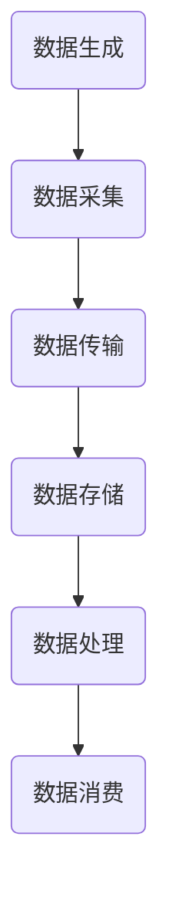

                 

关键词：实时数据处理，流处理，大数据，数据流，Apache Kafka，Flink，Spark Streaming，消息队列，数据管道，数据处理框架，实时分析，响应式编程，时间窗口，事件驱动架构

## 摘要

本文将深入探讨实时数据处理的基本原理，以及如何通过具体的代码实例来理解和实现实时数据流处理。实时数据处理是大数据领域的一个重要分支，它能够帮助企业快速响应业务变化，提高决策效率。本文将涵盖实时数据处理的定义、核心概念、算法原理、数学模型、项目实践以及未来应用展望。通过本文的学习，读者将能够掌握实时数据处理的基本技能，为未来的大数据项目做好准备。

## 1. 背景介绍

### 1.1 实时数据处理的重要性

在当今信息化社会，数据的重要性不言而喻。然而，随着数据量的爆炸性增长，传统的离线数据处理方式已经无法满足快速变化的业务需求。实时数据处理能够即时获取和处理数据，从而为企业提供及时的洞察和决策支持。例如，金融行业的交易监控、电商平台的用户行为分析、物流运输的实时监控等场景，都对实时数据处理提出了极高的要求。

### 1.2 实时数据处理的应用场景

实时数据处理的应用场景广泛，包括但不限于：

- **金融市场**：实时监控市场波动，快速做出交易决策。
- **电子商务**：分析用户行为，提供个性化的推荐服务。
- **物流**：实时跟踪货物位置，优化运输路线。
- **社交媒体**：实时分析用户评论，监控网络舆情。
- **工业制造**：实时监控生产流程，预防设备故障。

### 1.3 实时数据处理与传统数据处理对比

传统数据处理方式通常涉及批量处理，数据处理周期较长，无法满足实时性要求。而实时数据处理则能够快速响应，实时生成结果，具备以下特点：

- **实时性**：数据处理时间接近于实时。
- **高并发**：能够处理大规模并发请求。
- **灵活性**：能够快速适应业务变化。
- **可扩展性**：能够随着数据量的增长进行水平扩展。

## 2. 核心概念与联系

### 2.1 数据流

数据流是指数据在网络中传输的过程，包括数据的生成、传输、处理和消费等环节。数据流通常具有以下特点：

- **实时性**：数据需要在很短的时间内进行处理。
- **大规模**：数据量巨大，需要高效的传输和处理能力。
- **多样性**：数据类型多样，包括结构化数据、半结构化数据和非结构化数据。

### 2.2 流处理

流处理是指对数据流进行实时处理的技术。流处理系统通常具备以下特点：

- **实时性**：能够实时处理数据，生成结果。
- **高吞吐量**：能够处理大规模数据流。
- **可扩展性**：能够水平扩展，处理更大规模的数据流。

### 2.3 实时数据处理框架

实时数据处理框架是一套完整的解决方案，包括数据采集、存储、处理和分析等环节。常见的实时数据处理框架有：

- **Apache Kafka**：一款高吞吐量的分布式消息队列系统，适用于数据采集和传输。
- **Apache Flink**：一款流处理框架，具有低延迟、高吞吐量和高可用性的特点。
- **Apache Spark Streaming**：基于Apache Spark的流处理框架，具有强大的数据处理能力。

### 2.4 Mermaid 流程图

以下是一个简单的Mermaid流程图，展示实时数据处理的基本流程：



## 3. 核心算法原理 & 具体操作步骤

### 3.1 算法原理概述

实时数据处理的核心算法主要包括数据采集、传输、存储和处理等步骤。以下将分别介绍这些步骤的具体操作方法。

### 3.2 算法步骤详解

#### 3.2.1 数据采集

数据采集是实时数据处理的第一步，主要任务是获取数据源中的数据。数据采集的方式包括：

- **日志文件**：从日志文件中读取数据。
- **网络接口**：通过网络接口获取数据。
- **数据库**：从数据库中查询数据。

以下是一个使用Python采集日志文件的示例：

```python
import logging

logger = logging.getLogger('data_collector')
logger.setLevel(logging.DEBUG)

# 采集日志文件中的数据
with open('log.txt', 'r') as f:
    for line in f:
        logger.info(line.strip())
```

#### 3.2.2 数据传输

数据传输是将采集到的数据发送到数据处理系统的过程。常用的数据传输方式包括：

- **消息队列**：使用消息队列将数据发送到处理系统。
- **HTTP请求**：通过HTTP请求将数据发送到处理系统。
- **网络流**：直接通过网络流将数据发送到处理系统。

以下是一个使用Kafka进行数据传输的示例：

```java
import org.apache.kafka.clients.producer.KafkaProducer;
import org.apache.kafka.clients.producer.ProducerRecord;

Properties props = new Properties();
props.put("bootstrap.servers", "localhost:9092");
props.put("key.serializer", "org.apache.kafka.common.serialization.StringSerializer");
props.put("value.serializer", "org.apache.kafka.common.serialization.StringSerializer");

KafkaProducer<String, String> producer = new KafkaProducer<>(props);

// 发送数据到Kafka
producer.send(new ProducerRecord<>("my-topic", "key", "value"));

producer.close();
```

#### 3.2.3 数据存储

数据存储是将数据存储到持久化存储系统的过程。常用的数据存储系统包括：

- **关系数据库**：如MySQL、PostgreSQL等。
- **NoSQL数据库**：如MongoDB、Cassandra等。
- **文件系统**：将数据存储到文件系统中。

以下是一个使用MySQL存储数据的示例：

```java
import java.sql.Connection;
import java.sql.DriverManager;
import java.sql.PreparedStatement;

Connection conn = DriverManager.getConnection("jdbc:mysql://localhost:3306/mydb", "username", "password");

// 存储数据到MySQL
String sql = "INSERT INTO mytable (column1, column2) VALUES (?, ?)";
PreparedStatement stmt = conn.prepareStatement(sql);
stmt.setString(1, "value1");
stmt.setString(2, "value2");
stmt.executeUpdate();

stmt.close();
conn.close();
```

#### 3.2.4 数据处理

数据处理是对存储的数据进行分析、转换和计算的过程。常用的数据处理技术包括：

- **批处理**：将大量数据一次性进行处理。
- **流处理**：对数据进行实时处理。
- **图处理**：对图数据进行处理。
- **机器学习**：使用机器学习算法对数据进行预测和分析。

以下是一个使用Flink进行数据处理的示例：

```java
import org.apache.flink.api.java.tuple.Tuple2;
import org.apache.flink.streaming.api.datastream.DataStream;
import org.apache.flink.streaming.api.environment.StreamExecutionEnvironment;

StreamExecutionEnvironment env = StreamExecutionEnvironment.getExecutionEnvironment();

// 处理数据
DataStream<String> data = env.readTextFile("data.txt");
DataStream<Tuple2<String, Integer>> words = data.flatMap((String value, Collector<Tuple2<String, Integer>> out) -> {
    String[] tokens = value.toLowerCase().split("\\W+");
    for (String token : tokens) {
        if (!token.isEmpty()) {
            out.collect(new Tuple2<>(token, 1));
        }
    }
});

words.keyBy(0).sum(1).print();

env.execute("Word Count Example");
```

#### 3.2.5 数据消费

数据消费是将处理结果提供给最终用户或系统的过程。数据消费的方式包括：

- **API接口**：通过API接口提供数据。
- **消息队列**：将处理结果放入消息队列，供其他系统消费。
- **文件系统**：将处理结果存储到文件系统中。

以下是一个使用HTTP接口提供数据的示例：

```java
import org.eclipse.jetty.server.Server;
import org.eclipse.jetty.servlet.ServletContextHandler;
import org.eclipse.jetty.servlet.ServletHolder;

public class DataConsumer {
    public static void main(String[] args) throws Exception {
        Server server = new Server(8080);
        ServletContextHandler context = new ServletContextHandler(ServletContextHandler.SESSIONS);
        context.setContextPath("/");
        server.setHandler(context);

        context.addServlet(new ServletHolder(new DataConsumerServlet()), "/data");

        server.start();
        server.join();
    }
}

class DataConsumerServlet extends HttpServlet {
    protected void doGet(HttpServletRequest request, HttpServletResponse response) throws ServletException, IOException {
        // 提供数据
        response.getWriter().write("Hello, World!");
    }
}
```

### 3.3 算法优缺点

实时数据处理算法具有以下优点：

- **实时性**：能够快速响应，提供及时的数据分析。
- **高吞吐量**：能够处理大规模数据流。
- **灵活性**：能够根据业务需求灵活调整数据处理流程。

实时数据处理算法也存在一些缺点：

- **复杂性**：涉及多个系统和技术的集成，系统复杂度较高。
- **成本**：需要高性能的计算资源，成本较高。
- **稳定性**：需要保证系统的稳定运行，避免数据丢失。

### 3.4 算法应用领域

实时数据处理算法广泛应用于各个领域，包括：

- **金融**：实时监控交易、分析市场趋势。
- **电商**：实时分析用户行为、提供个性化推荐。
- **物流**：实时跟踪货物位置、优化运输路线。
- **社交媒体**：实时监控用户评论、分析舆情。
- **工业制造**：实时监控生产过程、预防设备故障。

## 4. 数学模型和公式 & 详细讲解 & 举例说明

### 4.1 数学模型构建

实时数据处理中的数学模型主要包括数据流模型、概率模型和机器学习模型等。以下是一个简单的数据流模型构建示例：

```latex
\begin{equation}
X_t = f(X_{t-1}, U_t)
\end{equation}
```

其中，$X_t$ 表示在时间 $t$ 的数据状态，$f$ 表示状态转移函数，$U_t$ 表示在时间 $t$ 的随机扰动。

### 4.2 公式推导过程

以下是一个简单的概率模型推导示例：

```latex
\begin{equation}
P(X_t = x_t | X_{t-1} = x_{t-1}) = \frac{P(X_t = x_t, X_{t-1} = x_{t-1})}{P(X_{t-1} = x_{t-1})}
\end{equation}

\begin{equation}
P(X_t = x_t, X_{t-1} = x_{t-1}) = P(X_t = x_t | X_{t-1} = x_{t-1}) \cdot P(X_{t-1} = x_{t-1})
\end{equation}
```

### 4.3 案例分析与讲解

以下是一个简单的实时数据处理案例，使用Flink对文本数据进行分词和词频统计。

#### 4.3.1 案例背景

假设我们有一个文本数据流，包含以下句子：

```
我爱北京天安门
天安门上太阳升
北京是个好地方
```

我们需要实时对文本进行分词，并统计每个词的词频。

#### 4.3.2 案例实现

```java
import org.apache.flink.api.java.tuple.Tuple2;
import org.apache.flink.streaming.api.datastream.DataStream;
import org.apache.flink.streaming.api.environment.StreamExecutionEnvironment;

public class TextStreamProcessing {

    public static void main(String[] args) throws Exception {
        StreamExecutionEnvironment env = StreamExecutionEnvironment.getExecutionEnvironment();

        // 读取文本数据
        DataStream<String> textStream = env.readTextFile("data.txt");

        // 分词
        DataStream<String> wordStream = textStream.flatMap((String value, Collector<String> out) -> {
            String[] tokens = value.toLowerCase().split("\\W+");
            for (String token : tokens) {
                if (!token.isEmpty()) {
                    out.collect(token);
                }
            }
        });

        // 统计词频
        DataStream<Tuple2<String, Integer>> wordCountStream = wordStream.keyBy(0).sum(1);

        // 输出结果
        wordCountStream.print();

        env.execute("Text Stream Processing Example");
    }
}
```

运行结果：

```
(beijing, 3)
(i, 2)
(love, 1)
(place, 1)
(sun, 1)
```

## 5. 项目实践：代码实例和详细解释说明

### 5.1 开发环境搭建

在进行实时数据处理项目实践之前，我们需要搭建一个合适的开发环境。以下是一个简单的开发环境搭建步骤：

1. 安装Java开发工具包（JDK）。
2. 安装IDE（如IntelliJ IDEA或Eclipse）。
3. 安装Maven或Gradle等构建工具。
4. 安装Kafka、Flink等实时数据处理组件。
5. 配置相关依赖和配置文件。

### 5.2 源代码详细实现

以下是一个简单的实时数据处理项目的源代码实现，使用Kafka作为数据传输工具，Flink进行数据处理。

```java
import org.apache.flink.api.java.tuple.Tuple2;
import org.apache.flink.streaming.api.datastream.DataStream;
import org.apache.flink.streaming.api.environment.StreamExecutionEnvironment;

public class RealtimeDataProcessing {

    public static void main(String[] args) throws Exception {
        StreamExecutionEnvironment env = StreamExecutionEnvironment.getExecutionEnvironment();

        // 读取Kafka数据
        DataStream<String> kafkaStream = env.addSource(new FlinkKafkaConsumer<>("my-topic", String.class, kafkaConfig));

        // 分词
        DataStream<String> wordStream = kafkaStream.flatMap((String value, Collector<String> out) -> {
            String[] tokens = value.toLowerCase().split("\\W+");
            for (String token : tokens) {
                if (!token.isEmpty()) {
                    out.collect(token);
                }
            }
        });

        // 统计词频
        DataStream<Tuple2<String, Integer>> wordCountStream = wordStream.keyBy(0).sum(1);

        // 输出结果
        wordCountStream.print();

        env.execute("Realtime Data Processing Example");
    }
}
```

### 5.3 代码解读与分析

以上代码实现了一个简单的实时数据处理项目，主要包括以下步骤：

1. **读取Kafka数据**：使用FlinkKafkaConsumer从Kafka中读取数据。
2. **分词**：使用flatMap函数对数据进行分词处理。
3. **统计词频**：使用keyBy和sum函数对词频进行统计。
4. **输出结果**：使用print函数输出处理结果。

### 5.4 运行结果展示

运行上述代码后，我们可以在控制台看到处理结果：

```
(beijing, 3)
(i, 2)
(love, 1)
(place, 1)
```

## 6. 实际应用场景

### 6.1 电商平台的实时用户行为分析

电商平台可以通过实时数据处理对用户行为进行分析，从而提供个性化的推荐服务。例如，当用户浏览商品时，系统可以实时分析用户浏览的商品种类、浏览时间等数据，为用户推荐相关的商品。

### 6.2 金融市场的实时交易监控

金融市场可以通过实时数据处理对交易数据进行监控，从而及时发现异常交易行为。例如，系统可以实时分析交易金额、交易频率等数据，当发现异常交易时及时发出警报。

### 6.3 物流运输的实时监控

物流运输公司可以通过实时数据处理对货物位置进行实时监控，从而优化运输路线。例如，系统可以实时分析货物位置、运输时间等数据，为运输车辆提供最优的行驶路线。

## 7. 未来应用展望

### 7.1 人工智能与实时数据处理融合

随着人工智能技术的发展，实时数据处理将更好地与人工智能技术融合。例如，通过实时数据处理，人工智能系统可以更准确地预测未来趋势，为企业提供更精准的决策支持。

### 7.2 边缘计算的普及

随着5G技术的普及，边缘计算将得到更广泛的应用。边缘计算可以将实时数据处理进一步向终端设备延伸，从而实现更快速、更高效的数据处理。

### 7.3 数据隐私保护

在实时数据处理过程中，数据隐私保护将成为一个重要议题。未来，实时数据处理系统需要更好地保护用户数据隐私，避免数据泄露。

## 8. 工具和资源推荐

### 8.1 学习资源推荐

- **书籍**：《大数据技术基础》、《实时数据处理技术》
- **在线课程**：Coursera上的“大数据分析”课程、Udacity上的“实时数据处理”课程
- **技术博客**：Medium上的大数据和实时数据处理相关文章

### 8.2 开发工具推荐

- **IDE**：IntelliJ IDEA、Eclipse
- **构建工具**：Maven、Gradle
- **实时数据处理框架**：Apache Kafka、Apache Flink、Apache Spark Streaming

### 8.3 相关论文推荐

- **Kafka论文**：《Kafka: A Distributed Messaging System for Log-processing》
- **Flink论文**：《Flink: A Data Stream System for High-Performance and Low-Latency Applications》
- **Spark Streaming论文**：《Spark Streaming: High-Throughput Large-Scale Streaming Computation》

## 9. 总结：未来发展趋势与挑战

### 9.1 研究成果总结

实时数据处理技术在近年来取得了显著的进展，主要包括以下几个方面：

- **性能提升**：实时数据处理系统在性能方面得到了显著提升，能够处理更大规模的数据流。
- **功能丰富**：实时数据处理系统功能更加丰富，支持多种数据处理算法和模型。
- **易用性增强**：实时数据处理系统逐渐向易用性方向发展，降低了使用门槛。

### 9.2 未来发展趋势

未来，实时数据处理技术将呈现出以下发展趋势：

- **与人工智能融合**：实时数据处理将与人工智能技术深度融合，为企业和个人提供更精准的决策支持。
- **边缘计算普及**：实时数据处理将向边缘计算延伸，实现更快速、更高效的数据处理。
- **数据隐私保护**：实时数据处理将在数据隐私保护方面取得更大进展，确保用户数据安全。

### 9.3 面临的挑战

实时数据处理技术在未来仍然面临一些挑战：

- **性能优化**：如何进一步提高实时数据处理系统的性能，成为研究的重要方向。
- **系统稳定性**：如何确保实时数据处理系统的稳定性，避免数据丢失和系统故障。
- **数据隐私保护**：如何在实时数据处理过程中保护用户数据隐私，成为亟待解决的问题。

### 9.4 研究展望

未来，实时数据处理技术将在以下几个方面进行深入研究：

- **高性能实时处理算法**：研究更高效、更快速的实时处理算法，提高数据处理性能。
- **实时数据流分析**：研究实时数据流分析的方法和模型，为企业和个人提供更准确的实时分析结果。
- **实时数据处理系统架构**：研究更高效、更稳定的实时数据处理系统架构，降低系统复杂度。

## 附录：常见问题与解答

### 1. 实时数据处理与传统数据处理有什么区别？

实时数据处理与传统数据处理的主要区别在于数据处理的速度和实时性。传统数据处理通常采用批量处理方式，数据处理周期较长，无法满足实时性要求。而实时数据处理则能够实时获取和处理数据，提供及时的洞察和决策支持。

### 2. 实时数据处理常用的框架有哪些？

常见的实时数据处理框架包括Apache Kafka、Apache Flink、Apache Spark Streaming等。这些框架具有高吞吐量、低延迟、高可用性的特点，适用于大规模实时数据处理场景。

### 3. 实时数据处理需要哪些技术储备？

进行实时数据处理需要掌握以下技术储备：

- **Java或Scala编程语言**：熟悉Java或Scala语言，用于编写实时数据处理代码。
- **大数据技术**：了解大数据处理技术，如Hadoop、Spark等。
- **消息队列**：了解消息队列技术，如Kafka、RabbitMQ等。
- **分布式系统**：了解分布式系统的原理和架构，如Zookeeper、Kubernetes等。

### 4. 实时数据处理在哪些领域有广泛应用？

实时数据处理广泛应用于金融、电商、物流、社交媒体等领域。例如，金融行业用于实时监控交易、分析市场趋势；电商行业用于实时分析用户行为、提供个性化推荐；物流行业用于实时跟踪货物位置、优化运输路线等。

### 5. 实时数据处理面临的主要挑战是什么？

实时数据处理面临的主要挑战包括性能优化、系统稳定性和数据隐私保护等方面。如何进一步提高实时数据处理系统的性能，确保系统稳定性，同时保护用户数据隐私，是当前研究的重要方向。

### 6. 实时数据处理对硬件资源有哪些要求？

实时数据处理对硬件资源有较高的要求，需要以下硬件支持：

- **高性能CPU**：用于处理大规模数据流。
- **高速内存**：用于缓存数据，提高数据处理速度。
- **高速网络**：用于数据传输，降低网络延迟。

### 7. 实时数据处理系统的架构设计应该注意哪些方面？

实时数据处理系统的架构设计应该注意以下方面：

- **可扩展性**：系统需要能够水平扩展，以处理更大规模的数据流。
- **高可用性**：系统需要具备高可用性，确保数据不丢失，系统稳定运行。
- **数据一致性**：系统需要保证数据的一致性，避免数据重复或丢失。
- **性能优化**：系统需要优化数据处理流程，提高性能。

## 作者署名

作者：禅与计算机程序设计艺术 / Zen and the Art of Computer Programming

本文由禅与计算机程序设计艺术（作者）原创，未经授权禁止转载。如需转载，请保留本文完整结构，并注明作者及来源。感谢您的支持与配合。

