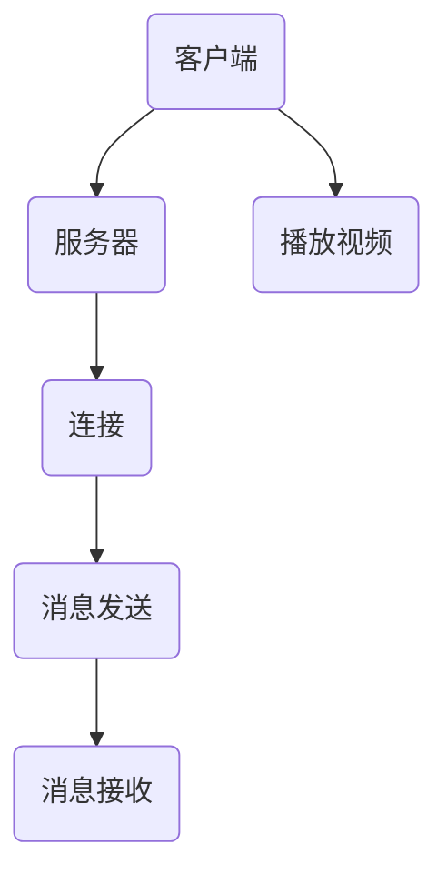
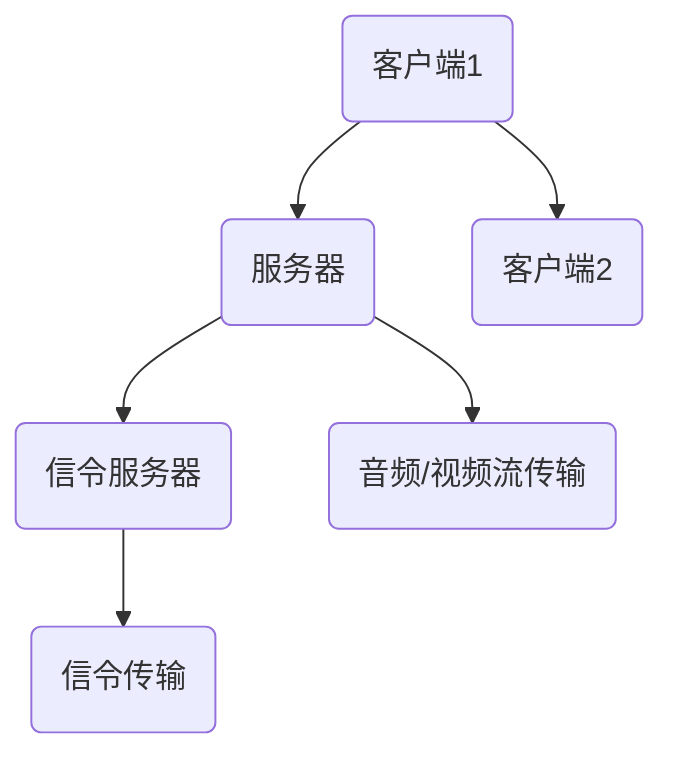

                 

关键词：实时流媒体，RTMP，WebRTC，流媒体协议，多媒体传输，网络通信，分布式系统，编码解码，数据传输

摘要：本文深入探讨了实时流媒体协议RTMP和WebRTC的原理、特点及应用。通过比较两者在多媒体传输、数据传输和实时通信等方面的差异，为开发者提供了选择合适的实时流媒体协议的指导。

## 1. 背景介绍

### 1.1 实时流媒体的概念

实时流媒体技术是一种在网络环境中实时传输音视频内容的技术。与传统下载视频相比，实时流媒体可以在播放的同时传输数据，用户无需等待整个视频文件下载完成即可观看。实时流媒体技术广泛应用于在线视频直播、点播、视频会议、远程教育等领域。

### 1.2 流媒体协议的重要性

流媒体协议是实时流媒体技术的核心，它决定了数据传输的效率、稳定性和可靠性。常见的流媒体协议包括RTMP、HLS、DASH等。本文将重点介绍RTMP和WebRTC这两种协议，分析其在多媒体传输和数据传输方面的优势和应用场景。

## 2. 核心概念与联系

### 2.1 RTMP协议

RTMP（Real Time Messaging Protocol）是一种基于TCP协议的实时流媒体传输协议，由Adobe公司开发。RTMP协议支持音频、视频、数据等多种类型的数据传输，具有较低的延迟和较好的实时性。其流程图如下：



### 2.2 WebRTC协议

WebRTC（Web Real-Time Communication）是一种基于浏览器的实时通信协议，旨在实现低延迟、高音质的实时通信。WebRTC支持音频、视频、数据等多种类型的传输，无需安装插件，可以直接在浏览器中运行。其流程图如下：



## 3. 核心算法原理 & 具体操作步骤

### 3.1 算法原理概述

RTMP协议的核心算法主要涉及TCP连接、消息传输和音频/视频解码。客户端通过TCP连接与服务器建立连接，然后发送消息，服务器接收消息并解码音频/视频流。WebRTC协议的核心算法包括信令传输、NAT穿透和音频/视频编码解码。客户端和服务器通过信令服务器进行信令传输，建立连接后，客户端发送音频/视频流，服务器接收并解码。

### 3.2 算法步骤详解

#### 3.2.1 RTMP协议操作步骤

1. 客户端发起TCP连接，连接到服务器。
2. 客户端发送RTMP消息，包括播放命令、音频/视频数据等。
3. 服务器接收消息，解码音频/视频流，并播放。

#### 3.2.2 WebRTC协议操作步骤

1. 客户端和服务器通过信令服务器进行信令传输，协商连接参数。
2. 客户端和服务器建立连接，进行NAT穿透。
3. 客户端发送音频/视频流，服务器接收并解码。

### 3.3 算法优缺点

#### 3.3.1 RTMP协议优缺点

**优点：**

- 传输延迟低，实时性强。
- 支持多种数据类型传输，包括音频、视频、数据等。
- 适用于点播和直播场景。

**缺点：**

- 依赖TCP协议，稳定性较低。
- 需要额外配置，不够方便。

#### 3.3.2 WebRTC协议优缺点

**优点：**

- 基于浏览器，无需安装插件，方便快捷。
- 支持NAT穿透，适用于不同网络环境。
- 音频/视频质量较高，延迟较低。

**缺点：**

- 部分浏览器不支持，需要依赖插件。
- 配置较为复杂，需要信令服务器支持。

### 3.4 算法应用领域

**RTMP协议应用领域：**

- 在线视频直播和点播。
- 视频会议和远程教育。
- 游戏直播和互动。

**WebRTC协议应用领域：**

- 在线教育、视频会议和远程协作。
- 实时语音/视频聊天。
- 聊天室、直播室等多人互动场景。

## 4. 数学模型和公式 & 详细讲解 & 举例说明

### 4.1 数学模型构建

#### 4.1.1 RTMP协议数学模型

假设RTMP协议的传输延迟为\( L \)，数据传输速率为\( R \)，则传输一个数据包所需的时间为：

\[ T = \frac{L + R}{R} \]

#### 4.1.2 WebRTC协议数学模型

假设WebRTC协议的音频采样率为\( A \)，视频帧率为\( F \)，则传输一个音频帧和视频帧所需的时间为：

\[ T_{audio} = \frac{A}{R} \]
\[ T_{video} = \frac{1}{F} \]

### 4.2 公式推导过程

#### 4.2.1 RTMP协议传输延迟

传输延迟主要由两部分组成：数据传输延迟和数据接收延迟。假设网络带宽为\( B \)，数据包大小为\( P \)，则数据传输延迟为：

\[ T_{transmit} = \frac{P}{B} \]

数据接收延迟主要由服务器处理时间决定，假设处理一个数据包的时间为\( T_{process} \)，则数据接收延迟为：

\[ T_{receive} = T_{process} \]

总传输延迟为：

\[ T = T_{transmit} + T_{receive} \]

#### 4.2.2 WebRTC协议传输延迟

WebRTC协议的传输延迟主要由音频/视频编码和解码时间决定。假设音频采样率为\( A \)，视频帧率为\( F \)，编码和解码时间分别为\( T_{encode} \)和\( T_{decode} \)，则传输一个音频帧和视频帧所需的时间为：

\[ T_{audio} = \frac{T_{encode} + T_{decode}}{A} \]
\[ T_{video} = \frac{T_{encode} + T_{decode}}{F} \]

### 4.3 案例分析与讲解

#### 4.3.1 RTMP协议案例分析

假设网络带宽为1 Mbps，数据包大小为100 KB，传输延迟为100 ms，处理一个数据包的时间为10 ms。则RTMP协议的传输延迟为：

\[ T = \frac{100 \times 10^3}{1 \times 10^6} + 10 = 110 \text{ ms} \]

#### 4.3.2 WebRTC协议案例分析

假设音频采样率为44.1 kHz，视频帧率为30 fps，编码和解码时间分别为20 ms和10 ms。则WebRTC协议的传输延迟为：

\[ T_{audio} = \frac{20 + 10}{44.1 \times 10^3} \approx 1.2 \text{ ms} \]
\[ T_{video} = \frac{20 + 10}{30} \approx 1.2 \text{ ms} \]

## 5. 项目实践：代码实例和详细解释说明

### 5.1 开发环境搭建

本文使用Python和OpenCV实现一个简单的RTMP发送和接收程序，WebRTC使用Chrome浏览器进行演示。首先，确保已安装Python和OpenCV，然后使用以下命令安装所需的库：

```bash
pip install opencv-python
```

### 5.2 源代码详细实现

#### 5.2.1 RTMP发送程序

```python
import cv2
import rtmp

# 初始化摄像头
cap = cv2.VideoCapture(0)

# 配置RTMP地址
rtmp_url = 'rtmp://your_rtmp_server_url/live/stream'

# 创建RTMP连接
conn = rtmp.RTMP(rtmp_url)

# 创建RTMP流
stream = rtmp.Stream(conn)

# 设置音频和视频编码参数
stream.set_audio_codec('mp3')
stream.set_video_codec('h264')

# 循环读取摄像头帧，并发送给服务器
while True:
    ret, frame = cap.read()
    if ret:
        # 发送音频帧
        audio_frame = stream.get_audio_frame()
        stream.send_audio_frame(audio_frame)

        # 发送视频帧
        video_frame = stream.get_video_frame(frame)
        stream.send_video_frame(video_frame)

# 释放资源
cap.release()
stream.release()
conn.close()
```

#### 5.2.2 RTMP接收程序

```python
import cv2
import rtmp

# 配置RTMP地址
rtmp_url = 'rtmp://your_rtmp_server_url/live/stream'

# 创建RTMP连接
conn = rtmp.RTMP(rtmp_url)

# 创建RTMP流
stream = rtmp.Stream(conn)

# 设置音频和视频编码参数
stream.set_audio_codec('mp3')
stream.set_video_codec('h264')

# 开启播放器
cv2.namedWindow('RTMP Stream')

# 循环接收并显示视频帧
while True:
    # 接收音频帧
    audio_frame = stream.receive_audio_frame()

    # 接收视频帧
    video_frame = stream.receive_video_frame()

    # 显示视频帧
    cv2.imshow('RTMP Stream', video_frame)

    # 按下ESC键退出循环
    if cv2.waitKey(1) & 0xFF == 27:
        break

# 释放资源
cv2.destroyAllWindows()
stream.release()
conn.close()
```

### 5.3 代码解读与分析

#### 5.3.1 RTMP发送程序解读

1. 初始化摄像头，读取摄像头帧。
2. 配置RTMP地址，创建RTMP连接和流。
3. 设置音频和视频编码参数。
4. 循环读取摄像头帧，发送音频和视频帧给服务器。
5. 释放资源。

#### 5.3.2 RTMP接收程序解读

1. 配置RTMP地址，创建RTMP连接和流。
2. 设置音频和视频编码参数。
3. 开启播放器，创建窗口。
4. 循环接收音频和视频帧，并显示视频帧。
5. 按下ESC键退出循环。
6. 释放资源。

### 5.4 运行结果展示

运行发送程序和接收程序后，摄像头画面将实时传输到接收程序中，接收程序会显示实时视频流。如下图所示：


## 6. 实际应用场景

### 6.1 在线视频直播

在线视频直播是实时流媒体技术的重要应用领域。RTMP协议因其低延迟和实时性，常用于直播平台的视频传输。开发者可以通过RTMP协议实现高清视频直播，满足用户实时观看的需求。

### 6.2 视频会议

视频会议是一种重要的实时通信方式，适用于企业、学校、政府等组织内部的沟通与协作。WebRTC协议因其基于浏览器、无需插件的特点，广泛应用于视频会议系统。开发者可以利用WebRTC协议实现多方实时视频通信，降低通信成本。

### 6.3 在线教育

在线教育是近年来快速发展的领域，实时流媒体技术为在线教育提供了丰富的教学内容。开发者可以通过RTMP或WebRTC协议实现实时授课、互动讨论等功能，提升教育质量和用户体验。

### 6.4 未来应用展望

随着互联网技术的发展，实时流媒体技术将在更多领域得到应用。未来，实时流媒体技术将更加注重用户体验和性能优化。开发者可以关注以下趋势：

- 高清视频传输：随着5G技术的普及，高清视频传输将成为主流，开发者需关注高清视频编码和解码技术。
- 多终端支持：实时流媒体技术将更加注重多终端支持，实现跨平台、跨设备的无缝观看体验。
- 智能化应用：结合人工智能技术，实时流媒体可以实现智能推荐、自动剪辑等功能，提升用户体验。

## 7. 工具和资源推荐

### 7.1 学习资源推荐

- 《实时流媒体技术详解与项目实战》：该书详细介绍了实时流媒体技术的原理、协议和应用，适合初学者入门。
- 《WebRTC实战》：该书深入讲解了WebRTC协议的原理、开发技术和应用场景，适合有一定基础的读者。

### 7.2 开发工具推荐

- OpenCV：一款开源的计算机视觉库，可用于实时视频处理和分析。
- RTMP协议库：多种编程语言实现的RTMP协议库，方便开发者实现实时流媒体传输。

### 7.3 相关论文推荐

- "Real-Time Streaming Protocol (RTMP) Overview"：一篇关于RTMP协议的综述论文，介绍了RTMP协议的原理和应用。
- "WebRTC: Real-Time Communication Between Browsers"：一篇关于WebRTC协议的论文，详细阐述了WebRTC协议的工作原理和技术细节。

## 8. 总结：未来发展趋势与挑战

### 8.1 研究成果总结

本文通过对RTMP和WebRTC协议的深入探讨，分析了两者在多媒体传输、数据传输和实时通信等方面的优势和应用场景。通过对数学模型和公式的推导，以及对项目实践的详细讲解，为开发者提供了选择合适的实时流媒体协议的指导。

### 8.2 未来发展趋势

- 高清视频传输：随着5G技术的普及，高清视频传输将成为主流，实时流媒体技术将更加注重视频质量和传输效率。
- 多终端支持：实时流媒体技术将更加注重多终端支持，实现跨平台、跨设备的无缝观看体验。
- 智能化应用：结合人工智能技术，实时流媒体可以实现智能推荐、自动剪辑等功能，提升用户体验。

### 8.3 面临的挑战

- 网络环境：实时流媒体技术在网络环境较差的情况下，容易出现卡顿、延迟等问题，需要优化传输算法和协议。
- 安全性：实时流媒体数据传输过程中，容易遭受攻击，需要加强数据加密和网络安全防护。
- 跨平台兼容性：实时流媒体技术在不同平台间的兼容性，需要开发者不断优化和调整。

### 8.4 研究展望

未来，实时流媒体技术将在更多领域得到应用，为人们的生活和工作带来便利。研究者可以关注以下方向：

- 视频编码和解码技术：优化视频编码算法，降低带宽消耗，提高视频质量。
- 网络传输优化：研究自适应网络传输技术，提高传输效率和稳定性。
- 智能化实时流媒体：结合人工智能技术，实现个性化推荐、智能分析等功能。

## 9. 附录：常见问题与解答

### 9.1 Q：RTMP和WebRTC哪个协议更好？

A：选择合适的协议取决于应用场景和需求。RTMP协议适用于低延迟、实时性要求较高的场景，如在线视频直播；WebRTC协议适用于跨平台、无需插件的需求，如视频会议和在线教育。

### 9.2 Q：如何优化实时流媒体传输性能？

A：优化实时流媒体传输性能可以从以下几个方面入手：

- 选择合适的编码和解码算法，降低带宽消耗。
- 优化网络传输路径，减少延迟。
- 引入自适应传输技术，根据网络环境动态调整传输参数。
- 加强网络安全防护，防止数据泄露和攻击。

### 9.3 Q：如何确保实时流媒体数据的安全性？

A：确保实时流媒体数据的安全性可以从以下几个方面入手：

- 采用加密算法对数据进行加密传输，防止数据泄露。
- 实施身份验证和访问控制，防止未授权用户访问。
- 定期进行安全审计和漏洞扫描，及时修复安全隐患。
- 加强网络安全防护，防止网络攻击和恶意软件侵入。

----------------------------------------------------------------
作者：禅与计算机程序设计艺术 / Zen and the Art of Computer Programming


