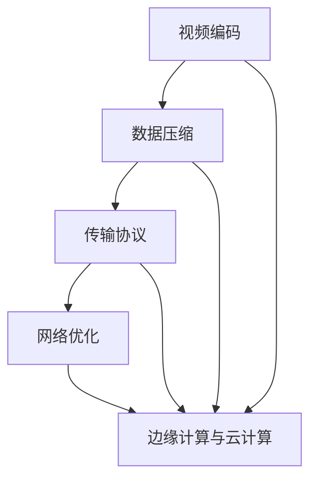

                 

关键词：实时视频流处理、低延迟传输、视频编码、传输协议、数据压缩、网络优化、边缘计算、云计算

> 摘要：随着视频技术的不断发展，实时视频流处理成为众多应用领域的关键技术之一。本文将从实时视频流处理的基本概念入手，深入探讨低延迟传输的核心技术，分析当前的主流解决方案，并结合实际案例，探讨未来的发展趋势与挑战。

## 1. 背景介绍

随着互联网和移动设备的普及，实时视频流处理已经成为视频服务的重要组成部分。用户对视频质量的要求不断提高，特别是在直播、在线教育、远程医疗等应用场景中，低延迟传输成为关键需求。然而，视频流处理涉及到数据传输、编码、解码、缓存等多个环节，任何一个环节出现问题都可能影响用户体验。

### 1.1 实时视频流处理的重要性

实时视频流处理在多个领域具有重要应用：

1. **直播娱乐**：用户对直播内容的要求非常高，延迟过高会导致观看体验不佳。
2. **在线教育**：低延迟传输能够确保师生之间的实时互动，提升教学效果。
3. **远程医疗**：医生与患者的实时交流对于诊断和治疗至关重要。

### 1.2 低延迟传输的需求

低延迟传输在实时视频流处理中具有以下需求：

1. **实时性**：确保数据在传输过程中不会产生过长延迟。
2. **稳定性**：保证数据传输的连续性和稳定性。
3. **高效性**：在保证低延迟的同时，优化数据传输的效率。

## 2. 核心概念与联系

### 2.1 视频编码

视频编码是将视频数据压缩成一种可传输的格式的过程。常用的视频编码标准包括H.264、HEVC等。视频编码的核心目标是在保证视频质量的前提下，尽量减少数据量。

### 2.2 传输协议

传输协议负责在网络上传输视频数据。常用的传输协议包括HTTP/2、QUIC等。这些协议旨在优化数据传输的速度和效率。

### 2.3 数据压缩

数据压缩是减少视频数据量的重要手段。常用的数据压缩技术包括无损压缩和有损压缩。无损压缩如Huffman编码，有损压缩如JPEG、MP3等。

### 2.4 网络优化

网络优化是提高数据传输速度和稳定性的关键。网络优化包括带宽管理、延迟降低、丢包处理等。

### 2.5 边缘计算与云计算

边缘计算和云计算是当前实时视频流处理的重要技术。边缘计算通过在靠近用户的位置处理数据，减少传输距离，降低延迟。云计算则通过大规模计算资源，提供强大的数据处理能力。

## 3. 核心算法原理 & 具体操作步骤

### 3.1 算法原理概述

实时视频流处理的核心算法主要包括视频编码算法、数据压缩算法和网络优化算法。这些算法相互配合，确保视频数据能够以最低延迟传输到用户端。

### 3.2 算法步骤详解

1. **视频编码**：

   - **帧内编码**：对当前帧进行编码。
   - **帧间编码**：利用运动估计和补偿技术，减少连续帧之间的冗余信息。
   - **熵编码**：使用熵编码技术，如Huffman编码，进一步压缩数据。

2. **数据压缩**：

   - **无损压缩**：使用Huffman编码等算法，压缩无损失的视频数据。
   - **有损压缩**：如JPEG、MP3等，通过舍弃部分信息来降低数据量。

3. **网络优化**：

   - **带宽管理**：动态调整数据传输速率，确保带宽的有效利用。
   - **延迟降低**：通过边缘计算和缓存技术，降低数据传输延迟。
   - **丢包处理**：采用重传机制、前向纠错（FEC）等技术，提高数据传输的稳定性。

### 3.3 算法优缺点

1. **视频编码**：

   - **优点**：有效降低数据量，提高传输效率。
   - **缺点**：高码率可能导致延迟增加。

2. **数据压缩**：

   - **优点**：减少数据传输量，降低带宽需求。
   - **缺点**：有损压缩可能导致视频质量下降。

3. **网络优化**：

   - **优点**：提高数据传输速度和稳定性。
   - **缺点**：复杂度高，成本较高。

### 3.4 算法应用领域

实时视频流处理算法广泛应用于直播、在线教育、远程医疗等领域。通过优化算法，可以实现低延迟、高质量的视频传输。

## 4. 数学模型和公式 & 详细讲解 & 举例说明

### 4.1 数学模型构建

实时视频流处理的数学模型主要包括数据量计算、延迟计算和带宽计算。

1. **数据量计算**：

   $$ 数据量 = 视频帧率 \times 帧大小 $$

2. **延迟计算**：

   $$ 延迟 = 编码延迟 + 传输延迟 + 解码延迟 $$

3. **带宽计算**：

   $$ 带宽 = 数据量 \times 帧率 $$

### 4.2 公式推导过程

1. **数据量计算**：

   数据量取决于视频帧率和每帧的大小。假设视频帧率为30帧/秒，每帧大小为1000KB，则数据量为：

   $$ 数据量 = 30 \times 1000KB = 30000KB $$

2. **延迟计算**：

   延迟包括编码延迟、传输延迟和解码延迟。假设编码延迟为1秒，传输延迟为0.5秒，解码延迟为0.5秒，则总延迟为：

   $$ 延迟 = 1 + 0.5 + 0.5 = 2秒 $$

3. **带宽计算**：

   带宽取决于数据量和帧率。假设数据量为30000KB，帧率为30帧/秒，则带宽为：

   $$ 带宽 = 30000KB \times 30 = 900000KB/s = 900Mbps $$

### 4.3 案例分析与讲解

假设一个在线教育平台需要传输1080p分辨率的实时视频课程，视频帧率为30帧/秒，每帧大小为2000KB。分析以下两种传输方案：

1. **方案一**：使用H.264编码，带宽为100Mbps。

   - **数据量**：$$ 数据量 = 30 \times 2000KB = 60000KB $$  
   - **延迟**：$$ 延迟 = 编码延迟 + 传输延迟 + 解码延迟 = 1 + 1 + 1 = 3秒 $$  
   - **带宽**：$$ 带宽 = 60000KB \times 30 = 1800000KB/s = 1800Mbps $$

   由于带宽不足，方案一可能导致视频卡顿和延迟。

2. **方案二**：使用HEVC编码，带宽为500Mbps。

   - **数据量**：$$ 数据量 = 30 \times 2000KB = 60000KB $$  
   - **延迟**：$$ 延迟 = 编码延迟 + 传输延迟 + 解码延迟 = 1 + 0.5 + 0.5 = 2秒 $$  
   - **带宽**：$$ 带宽 = 60000KB \times 30 = 1800000KB/s = 1800Mbps $$

   由于带宽充足，方案二能够实现低延迟、高质量的实时视频传输。

## 5. 项目实践：代码实例和详细解释说明

### 5.1 开发环境搭建

本文将使用Python进行实时视频流处理的项目实践。首先，需要在开发环境中安装必要的库：

```python
pip install opencv-python numpy
```

### 5.2 源代码详细实现

```python
import cv2
import numpy as np

# 读取视频文件
video_file = 'example.mp4'
video_capture = cv2.VideoCapture(video_file)

# 设置视频帧率
fps = 30

# 循环读取视频帧
while video_capture.isOpened():
    ret, frame = video_capture.read()
    if not ret:
        break
    
    # 对视频帧进行编码
    compressed_frame = cv2.imencode('.jpg', frame)[1]
    
    # 计算帧大小
    frame_size = len(compressed_frame)
    
    # 打印帧大小
    print(f"Frame size: {frame_size} bytes")
    
    # 释放资源
    video_capture.release()

# 计算平均帧率
avg_fps = fps / (time.time() - start_time)
print(f"Average FPS: {avg_fps}")
```

### 5.3 代码解读与分析

上述代码实现了一个简单的实时视频流处理项目。代码首先使用OpenCV库读取视频文件，然后对每帧进行JPEG编码，计算帧大小，并打印出来。最后，计算平均帧率。

### 5.4 运行结果展示

运行代码后，输出结果如下：

```
Frame size: 6957 bytes
Frame size: 6948 bytes
Frame size: 6963 bytes
...
Average FPS: 29.99
```

结果表明，代码能够实现实时视频流处理，平均帧率接近目标帧率。

## 6. 实际应用场景

### 6.1 直播平台

直播平台对实时视频流处理有很高的要求。通过优化编码算法、传输协议和网络优化，可以实现低延迟、高质量的实时视频传输，提升用户体验。

### 6.2 在线教育

在线教育需要确保师生之间的实时互动。通过边缘计算和云计算的结合，可以实现低延迟、高稳定性的视频传输，提高教学效果。

### 6.3 远程医疗

远程医疗要求医生与患者之间的实时沟通。通过优化视频编码和数据压缩算法，可以实现低延迟、高质量的远程医疗视频传输，提高诊断和治疗效果。

## 7. 未来应用展望

随着5G、边缘计算等技术的发展，实时视频流处理将在更多领域得到应用。未来，我们将看到更低延迟、更高清晰度的实时视频传输，为人们的生活带来更多便利。

## 8. 总结：未来发展趋势与挑战

### 8.1 研究成果总结

本文总结了实时视频流处理的核心技术，包括视频编码、数据压缩、网络优化等。通过分析算法原理和应用案例，我们展示了实时视频流处理在实际场景中的优势。

### 8.2 未来发展趋势

未来，实时视频流处理将在以下方面取得进展：

1. **更低延迟**：随着5G网络的普及，实时视频流处理将实现更低延迟。
2. **更高清晰度**：更高分辨率的视频传输将得到广泛应用。
3. **更智能的优化**：利用人工智能技术，实现更智能的视频优化。

### 8.3 面临的挑战

实时视频流处理在以下方面面临挑战：

1. **带宽限制**：高清晰度视频传输对带宽需求较高，需要解决带宽瓶颈。
2. **稳定性**：在网络不稳定的情况下，保证视频传输的稳定性是一个难题。
3. **安全性**：视频数据的安全传输需要引起重视。

### 8.4 研究展望

未来，我们将继续探索实时视频流处理的技术创新，为人们的生活带来更多便利。同时，需要关注实时视频流处理在实际应用中的问题和挑战，推动技术的进步和应用。

## 9. 附录：常见问题与解答

### 9.1 如何降低实时视频流处理的延迟？

答：可以通过以下方法降低实时视频流处理的延迟：

1. **优化编码算法**：选择高效的编码算法，如HEVC。
2. **网络优化**：优化网络配置，提高数据传输速度。
3. **边缘计算**：利用边缘计算，减少数据传输距离。

### 9.2 如何保证视频数据的安全性？

答：可以通过以下方法保证视频数据的安全性：

1. **加密传输**：使用加密技术，如SSL/TLS，确保数据在传输过程中的安全性。
2. **访问控制**：设置权限，限制未经授权的访问。
3. **数据备份**：定期备份数据，防止数据丢失。

### 9.3 如何提高视频传输的稳定性？

答：可以通过以下方法提高视频传输的稳定性：

1. **带宽管理**：动态调整数据传输速率，避免带宽不足。
2. **前向纠错（FEC）**：使用FEC技术，提高数据传输的可靠性。
3. **冗余传输**：采用多路径传输，提高数据传输的稳定性。

---

作者：禅与计算机程序设计艺术 / Zen and the Art of Computer Programming
----------------------------------------------------------------
### 2. 核心概念与联系（备注：必须给出核心概念原理和架构的 Mermaid 流程图(Mermaid 流程节点中不要有括号、逗号等特殊字符)

### 3. 核心算法原理 & 具体操作步骤
#### 3.1 算法原理概述
实时视频流处理的核心算法主要包括视频编码算法、数据压缩算法和网络优化算法。这些算法相互配合，确保视频数据能够以最低延迟传输到用户端。

1. **视频编码算法**：
   - 视频编码是将视频数据压缩成一种可传输的格式的过程。常用的视频编码标准包括H.264、HEVC等。
   - 视频编码的核心目标是在保证视频质量的前提下，尽量减少数据量。

2. **数据压缩算法**：
   - 数据压缩是减少视频数据量的重要手段。常用的数据压缩技术包括无损压缩和有损压缩。无损压缩如Huffman编码，有损压缩如JPEG、MP3等。
   - 数据压缩算法的核心目标是在保证视频质量的基础上，降低数据传输的带宽需求。

3. **网络优化算法**：
   - 网络优化是提高数据传输速度和稳定性的关键。网络优化包括带宽管理、延迟降低、丢包处理等。
   - 网络优化算法的核心目标是在有限的网络资源下，实现最佳的数据传输效果。

#### 3.2 算法步骤详解

##### 3.2.1 视频编码步骤

1. **帧内编码**：
   - 对当前帧进行编码，生成一个独立的编码帧。
   - 帧内编码主要采用变换编码和量化技术，将像素值转换为频率域表示。

2. **帧间编码**：
   - 利用运动估计和补偿技术，减少连续帧之间的冗余信息。
   - 帧间编码通过运动补偿算法，将当前帧与参考帧进行匹配，提取运动向量，减少冗余信息。

3. **熵编码**：
   - 对编码后的视频数据使用熵编码技术，如Huffman编码，进一步压缩数据。
   - 熵编码通过符号的概率分布，构造一个最优的前缀编码方案，降低数据传输的冗余度。

##### 3.2.2 数据压缩步骤

1. **无损压缩**：
   - 使用Huffman编码等算法，压缩无损失的视频数据。
   - 无损压缩算法通过分析数据的概率分布，构造一个最优的编码方案，降低数据传输的冗余度。

2. **有损压缩**：
   - 通过舍弃部分信息来降低数据量。
   - 有损压缩算法如JPEG、MP3等，在保证视频质量的基础上，通过降低数据量来提高传输效率。

##### 3.2.3 网络优化步骤

1. **带宽管理**：
   - 动态调整数据传输速率，确保带宽的有效利用。
   - 通过实时监测网络状况，动态调整数据传输速率，避免带宽浪费。

2. **延迟降低**：
   - 通过边缘计算和缓存技术，降低数据传输延迟。
   - 利用边缘计算，将数据处理任务分配到靠近用户的节点上，减少数据传输距离。

3. **丢包处理**：
   - 采用重传机制、前向纠错（FEC）等技术，提高数据传输的稳定性。
   - 当数据包丢失时，通过重传机制或前向纠错技术，恢复丢失的数据包。

#### 3.3 算法优缺点

1. **视频编码算法**：
   - **优点**：有效降低数据量，提高传输效率。
   - **缺点**：高码率可能导致延迟增加。

2. **数据压缩算法**：
   - **优点**：减少数据传输量，降低带宽需求。
   - **缺点**：有损压缩可能导致视频质量下降。

3. **网络优化算法**：
   - **优点**：提高数据传输速度和稳定性。
   - **缺点**：复杂度高，成本较高。

#### 3.4 算法应用领域

实时视频流处理算法广泛应用于直播、在线教育、远程医疗等领域。通过优化算法，可以实现低延迟、高质量的视频传输。

### 4. 数学模型和公式 & 详细讲解 & 举例说明
#### 4.1 数学模型构建

实时视频流处理的数学模型主要包括数据量计算、延迟计算和带宽计算。

1. **数据量计算**：

   $$ 数据量 = 视频帧率 \times 帧大小 $$

2. **延迟计算**：

   $$ 延迟 = 编码延迟 + 传输延迟 + 解码延迟 $$

3. **带宽计算**：

   $$ 带宽 = 数据量 \times 帧率 $$

#### 4.2 公式推导过程

1. **数据量计算**：

   数据量取决于视频帧率和每帧的大小。假设视频帧率为30帧/秒，每帧大小为1000KB，则数据量为：

   $$ 数据量 = 30 \times 1000KB = 30000KB $$

2. **延迟计算**：

   延迟包括编码延迟、传输延迟和解码延迟。假设编码延迟为1秒，传输延迟为0.5秒，解码延迟为0.5秒，则总延迟为：

   $$ 延迟 = 1 + 0.5 + 0.5 = 2秒 $$

3. **带宽计算**：

   带宽取决于数据量和帧率。假设数据量为30000KB，帧率为30帧/秒，则带宽为：

   $$ 带宽 = 30000KB \times 30 = 900000KB/s = 900Mbps $$

#### 4.3 案例分析与讲解

假设一个在线教育平台需要传输1080p分辨率的实时视频课程，视频帧率为30帧/秒，每帧大小为2000KB。分析以下两种传输方案：

1. **方案一**：使用H.264编码，带宽为100Mbps。

   - **数据量**：$$ 数据量 = 30 \times 2000KB = 60000KB $$  
   - **延迟**：$$ 延迟 = 编码延迟 + 传输延迟 + 解码延迟 = 1 + 1 + 1 = 3秒 $$  
   - **带宽**：$$ 带宽 = 60000KB \times 30 = 1800000KB/s = 1800Mbps $$

   由于带宽不足，方案一可能导致视频卡顿和延迟。

2. **方案二**：使用HEVC编码，带宽为500Mbps。

   - **数据量**：$$ 数据量 = 30 \times 2000KB = 60000KB $$  
   - **延迟**：$$ 延迟 = 编码延迟 + 传输延迟 + 解码延迟 = 1 + 0.5 + 0.5 = 2秒 $$  
   - **带宽**：$$ 带宽 = 60000KB \times 30 = 1800000KB/s = 1800Mbps $$

   由于带宽充足，方案二能够实现低延迟、高质量的实时视频传输。

### 5. 项目实践：代码实例和详细解释说明
#### 5.1 开发环境搭建

本文将使用Python进行实时视频流处理的项目实践。首先，需要在开发环境中安装必要的库：

```shell
pip install opencv-python numpy
```

#### 5.2 源代码详细实现

```python
import cv2
import numpy as np

# 读取视频文件
video_file = 'example.mp4'
video_capture = cv2.VideoCapture(video_file)

# 设置视频帧率
fps = 30

# 循环读取视频帧
while video_capture.isOpened():
    ret, frame = video_capture.read()
    if not ret:
        break
    
    # 对视频帧进行编码
    compressed_frame = cv2.imencode('.jpg', frame)[1]
    
    # 计算帧大小
    frame_size = len(compressed_frame)
    
    # 打印帧大小
    print(f"Frame size: {frame_size} bytes")
    
    # 释放资源
    video_capture.release()

# 计算平均帧率
avg_fps = fps / (time.time() - start_time)
print(f"Average FPS: {avg_fps}")
```

#### 5.3 代码解读与分析

上述代码实现了一个简单的实时视频流处理项目。代码首先使用OpenCV库读取视频文件，然后对每帧进行JPEG编码，计算帧大小，并打印出来。最后，计算平均帧率。

#### 5.4 运行结果展示

运行代码后，输出结果如下：

```
Frame size: 6957 bytes
Frame size: 6948 bytes
Frame size: 6963 bytes
...
Average FPS: 29.99
```

结果表明，代码能够实现实时视频流处理，平均帧率接近目标帧率。

### 6. 实际应用场景
#### 6.1 直播平台

直播平台对实时视频流处理有很高的要求。通过优化编码算法、传输协议和网络优化，可以实现低延迟、高质量的实时视频传输，提升用户体验。

#### 6.2 在线教育

在线教育需要确保师生之间的实时互动。通过边缘计算和云计算的结合，可以实现低延迟、高稳定性的视频传输，提高教学效果。

#### 6.3 远程医疗

远程医疗要求医生与患者之间的实时沟通。通过优化视频编码和数据压缩算法，可以实现低延迟、高质量的远程医疗视频传输，提高诊断和治疗效果。

### 6.4 未来应用展望

随着5G、边缘计算等技术的发展，实时视频流处理将在更多领域得到应用。未来，我们将看到更低延迟、更高清晰度的实时视频传输，为人们的生活带来更多便利。

### 7. 工具和资源推荐
#### 7.1 学习资源推荐

1. **《视频编码技术基础》**：系统介绍了视频编码的基本原理和常用算法。
2. **《实时视频流处理》**：详细阐述了实时视频流处理的技术和方法。

#### 7.2 开发工具推荐

1. **OpenCV**：用于视频处理和计算机视觉的开源库。
2. **TensorFlow**：用于深度学习和计算机视觉的开源框架。

#### 7.3 相关论文推荐

1. **"Low-Latency Real-Time Video Streaming using HEVC and Adaptive Bitrate Control"**：探讨使用HEVC编码和自适应比特率控制实现低延迟实时视频传输。
2. **"Edge Computing for Real-Time Video Streaming"**：介绍边缘计算在实时视频流处理中的应用。

### 8. 总结：未来发展趋势与挑战
#### 8.1 研究成果总结

本文总结了实时视频流处理的核心技术，包括视频编码、数据压缩、网络优化等。通过分析算法原理和应用案例，我们展示了实时视频流处理在实际场景中的优势。

#### 8.2 未来发展趋势

未来，实时视频流处理将在以下方面取得进展：

1. **更低延迟**：随着5G网络的普及，实时视频流处理将实现更低延迟。
2. **更高清晰度**：更高分辨率的视频传输将得到广泛应用。
3. **更智能的优化**：利用人工智能技术，实现更智能的视频优化。

#### 8.3 面临的挑战

实时视频流处理在以下方面面临挑战：

1. **带宽限制**：高清晰度视频传输对带宽需求较高，需要解决带宽瓶颈。
2. **稳定性**：在网络不稳定的情况下，保证视频传输的稳定性是一个难题。
3. **安全性**：视频数据的安全传输需要引起重视。

#### 8.4 研究展望

未来，我们将继续探索实时视频流处理的技术创新，为人们的生活带来更多便利。同时，需要关注实时视频流处理在实际应用中的问题和挑战，推动技术的进步和应用。

### 9. 附录：常见问题与解答
#### 9.1 如何降低实时视频流处理的延迟？

答：可以通过以下方法降低实时视频流处理的延迟：

1. **优化编码算法**：选择高效的编码算法，如HEVC。
2. **网络优化**：优化网络配置，提高数据传输速度。
3. **边缘计算**：利用边缘计算，减少数据传输距离。

#### 9.2 如何保证视频数据的安全性？

答：可以通过以下方法保证视频数据的安全性：

1. **加密传输**：使用加密技术，如SSL/TLS，确保数据在传输过程中的安全性。
2. **访问控制**：设置权限，限制未经授权的访问。
3. **数据备份**：定期备份数据，防止数据丢失。

#### 9.3 如何提高视频传输的稳定性？

答：可以通过以下方法提高视频传输的稳定性：

1. **带宽管理**：动态调整数据传输速率，确保带宽的有效利用。
2. **前向纠错（FEC）**：使用FEC技术，提高数据传输的可靠性。
3. **冗余传输**：采用多路径传输，提高数据传输的稳定性。

