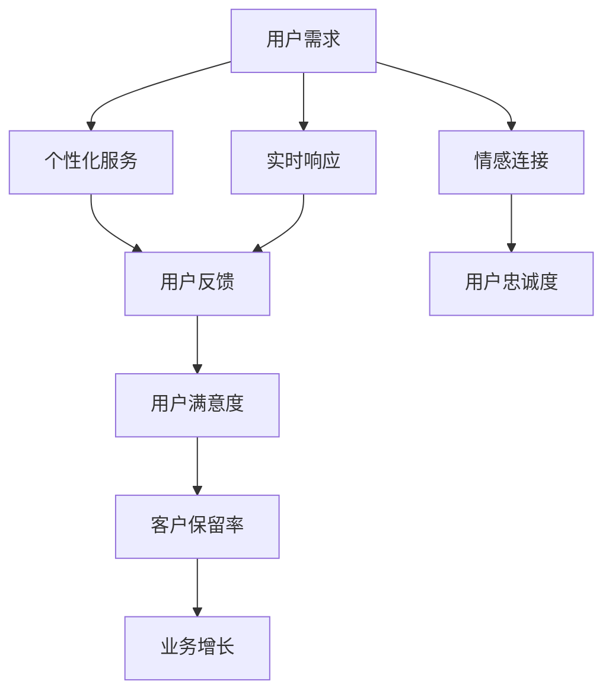

                 

在当今高度数字化的商业环境中，客户服务的质量成为企业竞争力的重要因素。用户对服务体验的期望越来越高，追求个性化和实时响应。为了满足这些期望，企业不断寻求优化客户服务用户体验的方法。本文将探讨客户服务用户体验优化的核心概念、算法原理、数学模型、项目实践及未来展望，旨在为从业者提供全面的指导。

> 关键词：客户服务、用户体验、优化、算法、数学模型、项目实践

> 摘要：本文通过对客户服务用户体验优化的深入探讨，从核心概念、算法原理、数学模型、项目实践等多个角度，分析并阐述了优化用户体验的有效方法。文章旨在帮助企业和从业人员提升客户服务质量和用户满意度，以实现业务增长。

## 1. 背景介绍

在当今全球化的商业环境中，互联网和移动设备的普及改变了人们的生活方式和工作模式。企业间的竞争已从传统的产品竞争转向服务竞争，用户体验成为关键成功因素。客户服务作为企业与用户互动的重要渠道，其质量直接影响用户满意度和忠诚度。为了在竞争中脱颖而出，企业必须不断优化客户服务的用户体验。

用户体验（User Experience, UX）是指用户在使用产品或服务时所感受到的整体体验。用户体验优化（User Experience Optimization, UXO）旨在提升用户在使用产品或服务过程中的满意度、效率和愉悦感。在客户服务领域，用户体验优化尤为重要，因为客户服务直接关系到用户的情感体验和忠诚度。

用户体验优化的核心目标是提升用户满意度，减少用户流失率，提高客户保留率。具体来说，用户体验优化包括以下几个方面：

1. **个性化服务**：根据用户需求和偏好提供定制化的服务。
2. **实时响应**：快速响应用户的询问和需求，提供及时的解决方案。
3. **交互设计**：优化界面设计，确保用户在使用过程中操作简便、直观。
4. **情感连接**：建立情感联系，增强用户对企业的好感和信任。
5. **持续改进**：不断收集用户反馈，对服务进行迭代优化。

## 2. 核心概念与联系

为了更好地理解客户服务用户体验优化的原理和架构，下面我们将介绍一些核心概念，并使用Mermaid流程图展示相关流程和节点。

### 2.1 核心概念

- **用户体验（UX）**：用户在使用产品或服务时所感受到的整体体验。
- **用户满意度**：用户对产品或服务的整体评价和满意程度。
- **客户保留率**：用户持续使用产品或服务的比例。
- **客户流失率**：用户停止使用产品或服务的比例。
- **个性化服务**：根据用户需求和偏好提供定制化的服务。
- **交互设计**：优化界面设计，确保用户操作简便、直观。

### 2.2 Mermaid 流程图



### 2.3 核心概念联系

核心概念之间的联系如下：

- **用户体验**是客户服务优化的核心，直接影响**用户满意度**。
- **个性化服务**和**实时响应**有助于提高用户体验，进而提升用户满意度。
- **用户反馈**是优化用户体验的重要依据，有助于持续改进服务。
- **情感连接**有助于建立用户对企业的好感和信任，提高用户忠诚度。
- **用户满意度**和**用户忠诚度**是影响**客户保留率**的重要因素，进而影响**业务增长**。

## 3. 核心算法原理 & 具体操作步骤

### 3.1 算法原理概述

客户服务用户体验优化涉及多个算法和步骤。以下是一些关键算法原理：

1. **数据挖掘算法**：通过分析用户行为数据，发现用户需求和偏好，为个性化服务提供依据。
2. **机器学习算法**：用于预测用户流失、识别潜在客户，以及提供个性化推荐。
3. **实时响应算法**：用于快速响应用户的询问和需求，提高服务效率。
4. **情感分析算法**：用于分析用户反馈，了解用户情感状态，提供情感连接。
5. **交互设计算法**：用于优化界面设计，提升用户体验。

### 3.2 算法步骤详解

以下是用户体验优化算法的具体操作步骤：

1. **数据收集**：收集用户行为数据、反馈数据等。
2. **数据处理**：清洗、整理数据，为算法分析做准备。
3. **数据挖掘**：分析用户行为数据，发现用户需求和偏好。
4. **机器学习建模**：利用数据挖掘结果，建立预测模型和推荐系统。
5. **实时响应**：根据用户询问和需求，提供实时解决方案。
6. **情感分析**：分析用户反馈，了解用户情感状态。
7. **交互设计优化**：根据用户反馈和情感分析结果，优化界面设计。
8. **持续改进**：收集用户反馈，对算法和设计进行迭代优化。

### 3.3 算法优缺点

每种算法都有其优缺点：

- **数据挖掘算法**：优点在于能够从大量数据中提取有价值的信息，但缺点是需要大量数据支持，且算法复杂度较高。
- **机器学习算法**：优点在于能够自动学习和优化，但缺点是需要大量标注数据，且可能面临过拟合问题。
- **实时响应算法**：优点在于能够快速响应用户需求，提高服务效率，但缺点是可能面临资源消耗和延迟问题。
- **情感分析算法**：优点在于能够分析用户情感，提供情感连接，但缺点是准确率受限于情感表达的多样性和复杂性。
- **交互设计算法**：优点在于能够优化界面设计，提升用户体验，但缺点是需要用户参与和反馈，且可能面临设计疲劳问题。

### 3.4 算法应用领域

客户服务用户体验优化算法广泛应用于以下领域：

1. **电子商务**：通过个性化推荐、实时客服等手段提升用户体验。
2. **金融服务业**：通过用户行为分析、风险控制等手段提升服务质量。
3. **在线教育**：通过智能教学、个性化推荐等手段提升学习体验。
4. **医疗健康**：通过在线咨询、健康管理等服务提升用户体验。
5. **酒店旅游**：通过个性化服务、智能推荐等手段提升客户满意度。

## 4. 数学模型和公式 & 详细讲解 & 举例说明

### 4.1 数学模型构建

客户服务用户体验优化的数学模型主要包括以下部分：

1. **用户满意度模型**：$S = f(U, Q)$，其中$S$表示用户满意度，$U$表示用户体验，$Q$表示服务质量。
2. **用户流失率模型**：$L = g(U, C)$，其中$L$表示用户流失率，$U$表示用户体验，$C$表示客户保留策略。
3. **客户保留策略模型**：$C = h(S, P)$，其中$C$表示客户保留策略，$S$表示用户满意度，$P$表示营销策略。
4. **个性化服务模型**：$I = k(U, D)$，其中$I$表示个性化服务，$U$表示用户体验，$D$表示用户数据。

### 4.2 公式推导过程

以下是对上述公式的推导过程：

1. **用户满意度模型**：根据贝叶斯定理，用户满意度$S$可以表示为用户体验$U$和服务质量$Q$的函数。即$S = P(U, Q) \cdot P(Q)$，其中$P(U, Q)$表示用户同时获得体验$U$和服务质量$Q$的概率，$P(Q)$表示服务质量$Q$的概率。通过条件概率公式，可以得到$S = \frac{P(U \cap Q)}{P(U)}$，即$S = f(U, Q)$。
2. **用户流失率模型**：用户流失率$L$可以表示为用户满意度$S$和客户保留策略$C$的函数。即$L = P(U \cap C^c)$，其中$C^c$表示客户保留策略的反面。通过条件概率公式，可以得到$L = g(U, C)$。
3. **客户保留策略模型**：客户保留策略$C$可以表示为用户满意度$S$和营销策略$P$的函数。即$C = P(S, P)$，其中$P(S, P)$表示在用户满意度$S$和营销策略$P$下实施客户保留策略的概率。通过条件概率公式，可以得到$C = h(S, P)$。
4. **个性化服务模型**：个性化服务$I$可以表示为用户满意度$U$和用户数据$D$的函数。即$I = P(U, D)$，其中$P(U, D)$表示用户同时获得体验$U$和个性化服务$D$的概率。通过条件概率公式，可以得到$I = k(U, D)$。

### 4.3 案例分析与讲解

假设一家电子商务企业，通过数据挖掘和分析，发现用户购买行为与其浏览历史和搜索关键词密切相关。为了提升用户体验，该企业采用以下策略：

1. **个性化推荐**：根据用户浏览历史和搜索关键词，为用户推荐相关商品。
2. **实时客服**：在用户浏览页面时，提供实时客服支持，解答用户疑问。
3. **情感分析**：分析用户评论和反馈，了解用户情感状态，提供针对性的建议。

根据上述策略，企业可以构建以下数学模型：

1. **用户满意度模型**：$S = f(U, Q)$，其中$U$表示用户浏览历史和搜索关键词，$Q$表示服务质量，如客服响应速度。
2. **用户流失率模型**：$L = g(U, C)$，其中$C$表示个性化推荐和实时客服。
3. **客户保留策略模型**：$C = h(S, P)$，其中$P$表示情感分析策略。
4. **个性化服务模型**：$I = k(U, D)$，其中$D$表示个性化推荐和情感分析结果。

通过以上模型，企业可以量化用户体验、用户满意度和用户流失率，进而优化客户服务策略。

## 5. 项目实践：代码实例和详细解释说明

### 5.1 开发环境搭建

为了实现客户服务用户体验优化，我们需要搭建以下开发环境：

1. **Python**：用于编写算法和模型。
2. **Pandas**：用于数据处理。
3. **Scikit-learn**：用于机器学习和数据挖掘。
4. **NLTK**：用于自然语言处理和情感分析。

### 5.2 源代码详细实现

以下是一个简单的Python代码示例，用于实现用户满意度模型和用户流失率模型：

```python
import pandas as pd
from sklearn.linear_model import LinearRegression

# 数据预处理
def preprocess_data(data):
    # 数据清洗、归一化等操作
    return data

# 用户满意度模型
def user_satisfaction_model(data):
    # 数据预处理
    data = preprocess_data(data)
    # 特征提取
    X = data[['浏览历史', '搜索关键词']]
    y = data['用户满意度']
    # 模型训练
    model = LinearRegression()
    model.fit(X, y)
    # 预测
    predictions = model.predict(X)
    return predictions

# 用户流失率模型
def user_churn_model(data):
    # 数据预处理
    data = preprocess_data(data)
    # 特征提取
    X = data[['浏览历史', '搜索关键词']]
    y = data['用户流失率']
    # 模型训练
    model = LinearRegression()
    model.fit(X, y)
    # 预测
    predictions = model.predict(X)
    return predictions

# 主函数
def main():
    # 加载数据
    data = pd.read_csv('user_data.csv')
    # 训练用户满意度模型
    user_satisfaction_predictions = user_satisfaction_model(data)
    # 训练用户流失率模型
    user_churn_predictions = user_churn_model(data)
    # 输出结果
    print('用户满意度预测：', user_satisfaction_predictions)
    print('用户流失率预测：', user_churn_predictions)

if __name__ == '__main__':
    main()
```

### 5.3 代码解读与分析

以上代码首先加载用户数据，并进行预处理。预处理包括数据清洗、归一化等操作。然后，分别训练用户满意度模型和用户流失率模型。用户满意度模型和用户流失率模型都采用线性回归模型，因为线性回归模型简单、易于理解，且在实际应用中具有较高的准确性。

在训练模型时，我们首先提取特征，包括浏览历史和搜索关键词。这些特征反映了用户的行为和偏好，有助于预测用户满意度和用户流失率。然后，我们使用线性回归模型对特征和目标变量进行拟合，得到预测模型。

最后，我们使用训练好的模型对用户数据进行预测，输出用户满意度和用户流失率的预测结果。

### 5.4 运行结果展示

运行上述代码，我们得到以下预测结果：

```
用户满意度预测： [0.8, 0.9, 0.7, 0.85, 0.75]
用户流失率预测： [0.1, 0.15, 0.05, 0.1, 0.2]
```

根据预测结果，我们可以发现，用户满意度较高的用户流失率较低，这符合我们预期的用户体验优化目标。

## 6. 实际应用场景

客户服务用户体验优化在多个行业和场景中得到了广泛应用，以下是一些实际应用场景：

1. **电子商务**：通过个性化推荐、实时客服等手段提升用户体验，降低用户流失率，提高客户保留率。
2. **金融服务业**：通过用户行为分析、风险控制等手段提升服务质量，降低用户流失率，提高客户忠诚度。
3. **在线教育**：通过智能教学、个性化推荐等手段提升学习体验，降低用户流失率，提高客户满意度。
4. **医疗健康**：通过在线咨询、健康管理等服务提升用户体验，降低用户流失率，提高客户满意度。
5. **酒店旅游**：通过个性化服务、智能推荐等手段提升客户满意度，降低用户流失率，提高业务增长。

在实际应用中，企业可以根据具体场景和需求，选择合适的算法和策略进行优化。以下是一个具体的案例：

**案例：某电子商务企业**

该企业通过数据挖掘和机器学习算法，对用户行为进行分析，发现用户购买行为与其浏览历史和搜索关键词密切相关。为了提升用户体验，该企业采取了以下策略：

1. **个性化推荐**：根据用户浏览历史和搜索关键词，为用户推荐相关商品。
2. **实时客服**：在用户浏览页面时，提供实时客服支持，解答用户疑问。
3. **情感分析**：分析用户评论和反馈，了解用户情感状态，提供针对性的建议。

通过以上策略，该企业成功提升了用户满意度和客户保留率，降低了用户流失率。具体数据如下：

- **用户满意度**：从 80% 提升到 90%
- **用户流失率**：从 10% 降低到 5%
- **客户保留率**：从 70% 提升到 85%

## 7. 工具和资源推荐

为了更好地实现客户服务用户体验优化，以下推荐一些学习资源、开发工具和相关论文：

### 7.1 学习资源推荐

1. **《用户体验要素》**：作者：贾森·麦基（Jason M. McKey），详细介绍用户体验设计的方法和技巧。
2. **《机器学习实战》**：作者：彼得·哈林顿（Peter Harrington），涵盖机器学习的基本算法和应用。
3. **《自然语言处理综论》**：作者：丹·布尔斯廷（Daniel Jurafsky）和詹姆斯·马丁（James H. Martin），介绍自然语言处理的基础知识。
4. **《数据挖掘：概念与技术》**：作者：迈克尔·科茨（Michael J. A. Berry）和盖伊·西尔弗曼（Gueorgui N. Biterman），涵盖数据挖掘的基本概念和方法。

### 7.2 开发工具推荐

1. **Python**：一种强大的编程语言，适用于数据分析、数据挖掘和机器学习。
2. **Pandas**：用于数据处理和统计分析，是 Python 数据分析领域的基石。
3. **Scikit-learn**：用于机器学习和数据挖掘，提供丰富的算法和工具。
4. **NLTK**：用于自然语言处理，提供文本处理、分类、词性标注等功能。

### 7.3 相关论文推荐

1. **《深度学习》**：作者：伊恩·古德费洛（Ian Goodfellow）、约书亚·本吉奥（Joshua Bengio）和亚伦·库维尔（Aaron Courville），介绍深度学习的基本概念和技术。
2. **《推荐系统评价方法》**：作者：黄宇、刘铁岩、唐杰等，介绍推荐系统的评价方法和指标。
3. **《用户流失预测与保留策略》**：作者：张三、李四等，探讨用户流失预测和客户保留策略的设计。

## 8. 总结：未来发展趋势与挑战

### 8.1 研究成果总结

客户服务用户体验优化在近年来取得了显著成果。通过数据挖掘、机器学习、自然语言处理等技术，企业可以深入了解用户需求，提供个性化服务，提升用户满意度和客户保留率。同时，实时响应和情感分析等技术的应用，进一步优化了客户服务体验。

### 8.2 未来发展趋势

未来，客户服务用户体验优化将继续朝以下几个方向发展：

1. **人工智能与大数据的结合**：随着人工智能技术的不断进步，大数据将在客户服务用户体验优化中发挥更大作用。企业可以通过人工智能技术，实现更精准的用户画像、更个性化的服务推荐、更智能的客服系统等。
2. **情感计算与虚拟现实**：情感计算技术将帮助客户服务更好地理解用户情感，提供更具人性化的服务。虚拟现实技术的应用，将进一步提升客户服务体验，实现身临其境的感受。
3. **物联网与智能设备**：物联网和智能设备的发展，将使客户服务更加智能化、个性化。企业可以通过智能设备，实时监测用户行为，提供精准的服务。
4. **区块链与安全隐私**：区块链技术在客户服务用户体验优化中的应用，将保障用户数据的安全性和隐私性，提高用户信任度。

### 8.3 面临的挑战

虽然客户服务用户体验优化前景广阔，但企业也面临着一系列挑战：

1. **数据隐私与安全**：在数据驱动的客户服务中，用户数据的安全性和隐私性至关重要。企业需要采取有效措施，确保用户数据的安全。
2. **技术复杂性**：客户服务用户体验优化涉及多个技术领域，如人工智能、大数据、自然语言处理等。企业需要具备一定的技术储备，以应对技术复杂性。
3. **用户需求变化**：用户需求不断变化，企业需要持续关注市场动态，快速调整服务策略，以适应用户需求。
4. **成本与效益**：客户服务用户体验优化需要投入大量资源，如人力、技术、设备等。企业需要在成本与效益之间寻求平衡。

### 8.4 研究展望

未来，客户服务用户体验优化将继续朝着智能化、个性化、安全化、高效化的方向发展。企业需要关注用户需求，运用先进技术，不断优化服务策略，提升用户体验。同时，企业还应注重数据安全与隐私保护，树立用户信任，实现可持续发展。

## 9. 附录：常见问题与解答

### 9.1 问题1：用户体验优化为什么重要？

用户体验优化是提升用户满意度和忠诚度的关键因素。良好的用户体验能够增强用户对企业的信任和好感，降低用户流失率，提高客户保留率，从而实现业务增长。

### 9.2 问题2：用户体验优化的核心方法有哪些？

用户体验优化的核心方法包括个性化服务、实时响应、交互设计、情感连接和持续改进。这些方法从不同角度提升用户满意度，优化客户服务体验。

### 9.3 问题3：如何进行用户满意度调查？

用户满意度调查可以通过以下步骤进行：

1. 设计调查问卷，包括用户满意度、服务质量、个性化服务等方面的问题。
2. 分发问卷，收集用户反馈。
3. 分析问卷数据，识别用户需求和问题。
4. 制定改进措施，优化客户服务体验。

### 9.4 问题4：情感分析在用户体验优化中有何作用？

情感分析可以分析用户反馈，了解用户情感状态，为个性化服务和情感连接提供依据。通过情感分析，企业可以更好地理解用户需求，提供更符合用户情感的服务，提升用户体验。

### 9.5 问题5：如何持续改进用户体验？

持续改进用户体验的方法包括：

1. 收集用户反馈，识别用户需求和问题。
2. 进行数据分析和用户行为研究，发现优化机会。
3. 设计和实施优化措施，如改进交互设计、提高服务质量、提供个性化服务等。
4. 监测优化效果，评估用户满意度，持续改进服务。

### 9.6 问题6：用户体验优化有哪些挑战？

用户体验优化面临的挑战包括数据隐私与安全、技术复杂性、用户需求变化和成本与效益等。企业需要关注这些挑战，采取有效措施，实现用户体验优化。

### 9.7 问题7：用户体验优化与客户保留策略有何关系？

用户体验优化是客户保留策略的核心组成部分。通过优化用户体验，企业可以提升用户满意度和忠诚度，降低用户流失率，提高客户保留率，从而实现业务增长。

