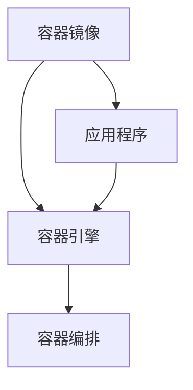

                 

 关键词：容器、Docker、Linux内核、资源隔离、容器编排、容器镜像、微服务架构

> 摘要：本文旨在深入探讨容器技术的原理，包括其核心概念、工作原理以及在实际应用中的具体实现。通过详尽的代码实例，我们将了解如何使用Docker等工具构建和管理容器，从而为微服务架构提供高效、可靠的运行环境。

## 1. 背景介绍

容器技术的发展可以追溯到20世纪90年代末的虚拟化技术。随着云计算和微服务架构的兴起，容器逐渐成为现代软件交付和部署的首选方案。容器提供了一种轻量级、可移植的运行环境，使得开发者能够将应用程序及其依赖环境封装在一起，实现环境的标准化和一致性。

### 1.1 容器与虚拟机的区别

容器与虚拟机（VM）在提供隔离环境方面有相似之处，但它们在实现方式和资源占用上有显著差异。虚拟机通过虚拟化技术模拟完整的硬件环境，为每一个虚拟机实例提供独立的操作系统。这导致虚拟机在资源占用上较高，启动速度较慢。

相比之下，容器通过操作系统级别的虚拟化技术（如cgroups和namespaces）实现资源隔离，但并不提供完整的独立操作系统。容器共享宿主机的操作系统内核，因此它们比虚拟机更轻量级，启动速度更快。

### 1.2 容器技术的发展历程

- **早期容器**：Linux容器（LXC）的引入标志着容器技术的起步。LXC利用cgroups和namespaces实现资源隔离，但缺乏管理工具。
- **Docker的兴起**：2013年，Docker的诞生为容器技术带来了革命性的变化。Docker提供了一个易于使用且功能强大的容器运行时平台，迅速获得了广泛的认可。
- **容器编排**：随着容器应用的普及，容器编排工具如Kubernetes应运而生，为容器集群的管理和调度提供了强大的支持。

## 2. 核心概念与联系

容器技术的核心概念包括容器镜像、容器引擎、容器编排等。以下是一个简化的Mermaid流程图，描述了这些概念之间的关系。



### 2.1 容器镜像

容器镜像是一个静态的文件系统，包含了应用程序及其运行所需的全部依赖和环境。容器引擎使用容器镜像创建和管理容器实例。

### 2.2 容器引擎

容器引擎是运行和管理容器的工具。Docker是最流行的容器引擎，它允许用户创建、启动、停止、移动或删除容器。其他容器引擎如rkt和Podman也在不断发展和完善。

### 2.3 容器编排

容器编排工具负责管理容器集群的创建、部署、扩展和监控。Kubernetes是目前最广泛使用的容器编排工具，它提供了自动化部署、扩展和管理容器化应用程序的能力。

## 3. 核心算法原理 & 具体操作步骤

### 3.1 算法原理概述

容器技术的核心算法包括资源隔离和容器编排。资源隔离通过cgroups和namespaces实现，容器编排则依赖于调度算法和资源管理策略。

### 3.2 算法步骤详解

#### 3.2.1 资源隔离

1. **创建cgroup**：容器引擎在宿主机上创建一个cgroup，用于隔离容器的资源使用。
2. **绑定容器到cgroup**：容器启动时，将其绑定到相应的cgroup，确保容器只能访问cgroup分配的资源。
3. **设置资源限制**：通过调整cgroup的参数，限制容器的CPU使用率、内存使用量等。

#### 3.2.2 容器编排

1. **定义部署配置**：开发者编写Kubernetes部署配置文件，指定应用程序的容器镜像、副本数量、资源限制等。
2. **创建部署对象**：使用Kubernetes API创建部署对象，启动容器编排过程。
3. **调度和部署**：Kubernetes调度器根据资源可用性和部署策略，将容器部署到合适的节点上。
4. **监控和管理**：Kubernetes监控系统持续监控容器状态，并在容器失败时进行自动重启或替换。

### 3.3 算法优缺点

#### 优点

- **轻量级**：容器通过共享宿主机操作系统内核，具有较低的资源和性能开销。
- **可移植性**：容器镜像封装了应用程序及其环境，使得应用程序在不同环境中具有一致的行为。
- **高效性**：容器编排工具自动化了容器的部署、扩展和管理，提高了开发运维效率。

#### 缺点

- **安全性**：容器共享宿主机内核，存在安全风险。
- **复杂性**：容器和编排工具的学习和使用需要一定的时间和实践。

### 3.4 算法应用领域

容器技术在以下领域得到了广泛应用：

- **微服务架构**：容器为微服务提供了高效、可移植的运行环境，使得服务之间可以独立部署和扩展。
- **云计算**：容器在云平台中用于部署和管理大量应用程序，提高了资源利用率和灵活性。
- **持续集成和持续部署（CI/CD）**：容器技术简化了测试和部署流程，加快了软件交付速度。

## 4. 数学模型和公式 & 详细讲解 & 举例说明

容器技术的核心算法涉及一些数学模型和公式，下面将进行详细讲解。

### 4.1 数学模型构建

容器调度问题可以建模为一个优化问题，目标是最大化资源利用率并最小化调度延迟。以下是基本模型：

- **资源需求**：每个容器 \(C_i\) 的资源需求为 \(R_i = (C_i^{CPU}, C_i^{MEM}, C_i^{DISK})\)。
- **资源容量**：宿主机 \(H\) 的资源容量为 \(R_H = (C_H^{CPU}, C_H^{MEM}, C_H^{DISK})\)。
- **调度延迟**：容器 \(C_i\) 的调度延迟为 \(T_i\)。

### 4.2 公式推导过程

为了最大化资源利用率并最小化调度延迟，可以建立以下目标函数：

\[ \max \sum_{i=1}^{N} \frac{R_i^{CPU} + R_i^{MEM} + R_i^{DISK}}{R_H^{CPU} + R_H^{MEM} + R_H^{DISK}} \]
\[ s.t. \ T_i \leq T_{max} \]

其中，\(N\) 为容器数量，\(T_{max}\) 为最大调度延迟。

### 4.3 案例分析与讲解

假设有一个宿主机和三个容器，其资源需求如下：

| 容器 | CPU需求 | 内存需求 | 磁盘需求 |
| ---- | ------ | ------ | ------ |
| C1   | 2      | 4      | 10     |
| C2   | 1      | 2      | 5      |
| C3   | 3      | 6      | 15     |

宿主机的资源容量为：

| 资源 | CPU容量 | 内存容量 | 磁盘容量 |
| ---- | ------ | ------ | ------ |
| H    | 4      | 8      | 20     |

根据目标函数和约束条件，我们可以列出以下优化问题：

\[ \max \frac{2 + 4 + 10}{4 + 8 + 20} + \frac{1 + 2 + 5}{4 + 8 + 20} + \frac{3 + 6 + 15}{4 + 8 + 20} \]
\[ s.t. \ T_1 + T_2 + T_3 \leq T_{max} \]

通过简单的计算，我们可以得出最优解，将C1和C2部署在同一节点上，将C3部署在另一个节点上，以满足资源需求并最小化调度延迟。

## 5. 项目实践：代码实例和详细解释说明

为了更好地理解容器技术的实际应用，我们将通过一个具体的例子来讲解如何使用Docker构建和管理容器。

### 5.1 开发环境搭建

首先，确保宿主机已经安装了Docker。可以通过以下命令检查Docker版本：

```bash
docker --version
```

### 5.2 源代码详细实现

#### 5.2.1 编写Dockerfile

在应用程序的根目录下创建一个名为`Dockerfile`的文件，内容如下：

```Dockerfile
# 使用官方Python镜像作为基础镜像
FROM python:3.8-slim

# 设置工作目录
WORKDIR /app

# 将当前目录的内容复制到容器内的/app目录
COPY . /app

# 安装依赖项
RUN pip install -r requirements.txt

# 暴露容器的8000端口供外部访问
EXPOSE 8000

# 运行应用程序
CMD ["python", "app.py"]
```

#### 5.2.2 编写Docker Compose文件

在应用程序的根目录下创建一个名为`docker-compose.yml`的文件，内容如下：

```yaml
version: '3.8'

services:
  web:
    build: .
    ports:
      - "8000:8000"
    depends_on:
      - db
    environment:
      - DATABASE_URL=mysql+pymysql://user:password@db:3306/mydatabase

  db:
    image: mysql:5.7
    environment:
      - MYSQL_ROOT_PASSWORD=example
      - MYSQL_DATABASE=mydatabase

networks:
  mynet:
```

### 5.3 代码解读与分析

#### 5.3.1 Dockerfile解读

- `FROM python:3.8-slim`：指定基础镜像，这里使用Python 3.8的精简版镜像。
- `WORKDIR /app`：设置容器的工作目录为`/app`。
- `COPY . /app`：将当前目录下的所有内容复制到容器的`/app`目录。
- `RUN pip install -r requirements.txt`：安装应用程序的依赖项。
- `EXPOSE 8000`：暴露容器的8000端口，以便外部访问。
- `CMD ["python", "app.py"]`：指定容器启动时运行的命令。

#### 5.3.2 docker-compose.yml解读

- `version`：指定Docker Compose文件的版本。
- `services`：定义应用程序的各个服务，包括web和db。
  - `web`：定义web服务的构建方式和依赖关系，以及环境变量。
  - `db`：定义数据库服务的镜像和环境变量。
- `networks`：定义容器网络。

### 5.4 运行结果展示

在项目根目录下执行以下命令，构建并启动容器：

```bash
docker-compose up -d
```

等待容器启动成功后，可以通过浏览器访问`http://localhost:8000`查看web服务的运行结果。同时，可以通过以下命令查看数据库服务的运行状态：

```bash
docker-compose logs db
```

## 6. 实际应用场景

容器技术已经在多个领域得到了广泛应用，以下是几个典型的应用场景：

### 6.1 微服务架构

容器为微服务架构提供了高效、可移植的运行环境，使得各个服务可以独立部署和扩展。容器编排工具如Kubernetes进一步简化了微服务的部署和管理。

### 6.2 云计算

容器在云平台上用于部署和管理大量应用程序，提高了资源利用率和灵活性。云服务提供商如AWS、Azure和Google Cloud都提供了强大的容器服务。

### 6.3 持续集成和持续部署（CI/CD）

容器技术简化了测试和部署流程，加快了软件交付速度。通过容器镜像和自动化工具，可以实现快速、可靠的持续集成和持续部署。

## 7. 未来应用展望

随着容器技术的不断发展，未来将出现以下几个趋势：

### 7.1 容器安全的加强

容器在共享宿主机内核的情况下，存在一定的安全风险。未来的容器技术将加强对容器安全性的关注，包括增强容器监控、隔离和漏洞管理。

### 7.2 容器编排的优化

容器编排工具将在资源利用率、调度性能和故障恢复方面进行优化，以提供更高效、可靠的容器集群管理。

### 7.3 容器与区块链的结合

容器技术可以与区块链相结合，为分布式应用程序提供高效的运行环境。这将进一步推动区块链技术的发展和应用。

## 8. 工具和资源推荐

### 8.1 学习资源推荐

- 《Docker实战》
- 《Kubernetes权威指南》
- 《容器化架构：设计、部署与管理》

### 8.2 开发工具推荐

- Docker Desktop
- Kubernetes CLI
- Helm

### 8.3 相关论文推荐

- “Docker: Lightweight Linux Containers for Developing, Shipping, and Running Applications”
- “Kubernetes: System Architecture”
- “Container-based Microservices Architecture”

## 9. 总结：未来发展趋势与挑战

容器技术在过去几年中取得了显著的发展，但未来仍面临一些挑战。通过不断优化和安全增强，容器技术将在更多领域得到应用。未来的发展趋势包括容器安全的加强、容器编排的优化以及容器与区块链的结合。同时，容器技术的研究和发展也将为软件工程带来新的机遇和挑战。

## 附录：常见问题与解答

### 9.1 如何解决容器资源不足的问题？

- **优化资源分配**：通过调整cgroup参数，合理分配资源。
- **水平扩展**：增加容器副本数量，提高资源利用率。
- **垂直扩展**：升级宿主机硬件，提高宿主机的资源容量。

### 9.2 容器与虚拟机在安全性方面有何区别？

- **容器**：容器通过共享宿主机内核，存在安全风险，如内核漏洞可能导致容器逃逸。
- **虚拟机**：虚拟机提供完整的独立操作系统，安全性较高，但资源占用较大。

### 9.3 如何保证容器的一致性？

- **使用容器镜像**：通过容器镜像封装应用程序及其环境，确保在不同环境中的一致性。
- **持续集成和持续部署**：自动化测试和部署流程，确保容器的一致性和稳定性。

作者：禅与计算机程序设计艺术 / Zen and the Art of Computer Programming
----------------------------------------------------------------

以上就是完整的文章内容。希望这篇文章能够帮助您深入了解容器技术的原理和应用，为您的开发工作提供有价值的参考。在撰写过程中，请务必遵循文中提及的要求，确保文章的完整性和质量。祝您撰写顺利！

