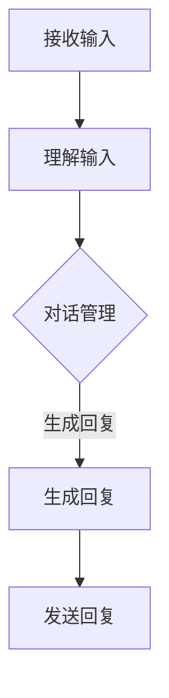

                 

关键词：对话系统，Chatbots，原理，代码实例，人工智能，自然语言处理，用户交互

> 摘要：本文将对对话系统（Chatbots）的基本原理进行深入探讨，涵盖从概念到实际应用的全面介绍。我们将详细解读对话系统的架构，核心算法，数学模型，并提供代码实例。此外，本文还将探讨对话系统在实际应用中的角色和未来的发展前景。

## 1. 背景介绍

随着人工智能和自然语言处理技术的快速发展，对话系统（Chatbots）作为一种智能交互工具，逐渐成为各个领域的重要应用。从最初的简单聊天机器人到如今能够处理复杂对话任务的高级智能系统，Chatbots已经深入到我们生活的各个方面。

对话系统的发展历程可以追溯到上世纪80年代的早期聊天机器人。当时的聊天机器人主要是基于规则和简单的模式匹配技术。随着自然语言处理技术的进步，特别是深度学习和神经网络技术的发展，对话系统的智能程度和功能得到了极大的提升。现在，Chatbots不仅在社交媒体和客户服务领域得到广泛应用，还在智能家居、在线教育、金融投资等领域展现出巨大的潜力。

本文的目的在于，通过系统的理论讲解和实际的代码实例，帮助读者深入理解对话系统的原理和实现方法。无论你是初学者还是专业人士，本文都将为你提供有价值的见解和实践经验。

## 2. 核心概念与联系

### 2.1 对话系统的定义与分类

对话系统是一种能够与人类进行自然语言交互的计算机程序。根据不同的应用场景和功能，对话系统可以分为以下几类：

1. **信息检索型**：这类对话系统主要基于关键词匹配和简单的自然语言处理技术，能够快速响应用户的查询请求。
2. **任务导向型**：这类对话系统能够理解用户的意图，并根据任务需求引导用户完成特定的任务。
3. **情感交互型**：这类对话系统能够识别和模拟人类的情感表达，与用户建立情感连接。

### 2.2 对话系统的基本组件

一个典型的对话系统通常由以下几个核心组件组成：

1. **用户接口（UI）**：用于用户与系统进行交互的界面，可以是命令行界面、图形用户界面，或者是基于Web的界面。
2. **对话管理器**：负责维护对话的状态，管理对话流程，并根据用户的输入生成响应。
3. **语言理解模块**：包括自然语言处理（NLP）和意图识别技术，用于理解用户输入的含义。
4. **对话生成模块**：负责生成自然、流畅的回复，可以是基于规则、模板或者生成模型。
5. **语言生成模块**：将对话生成模块产生的回复转换为自然语言文本。

### 2.3 对话系统的工作原理

一个完整的对话流程可以概括为以下几个步骤：

1. **接收输入**：对话系统通过用户接口接收用户的输入。
2. **理解输入**：语言理解模块对输入进行解析，提取关键词和意图。
3. **对话管理**：对话管理器根据对话状态和用户意图，决定下一步的操作。
4. **生成回复**：对话生成模块生成合适的回复。
5. **发送回复**：将生成的回复通过用户接口发送给用户。

### 2.4 对话系统的 Mermaid 流程图



在上面的流程图中，我们用 Mermaid 语法描述了一个基本的对话系统工作流程。这个流程图清晰展示了对话系统从接收输入到发送回复的各个步骤，有助于读者理解对话系统的运作机制。

## 3. 核心算法原理 & 具体操作步骤

### 3.1 算法原理概述

对话系统的核心算法主要包括自然语言处理（NLP）算法、意图识别算法、对话生成算法等。以下将分别介绍这些算法的基本原理。

#### 3.1.1 自然语言处理（NLP）算法

自然语言处理（NLP）是人工智能领域的一个重要分支，旨在使计算机能够理解、处理和生成自然语言。NLP算法通常包括以下几个步骤：

1. **分词**：将文本拆分成一个个独立的单词或词汇。
2. **词性标注**：为每个单词分配词性（如名词、动词等）。
3. **命名实体识别**：识别文本中的特定实体（如人名、地点等）。
4. **句法分析**：分析句子的结构，理解单词之间的语法关系。
5. **语义分析**：从语义层面理解句子的含义，提取实体和关系。

#### 3.1.2 意图识别算法

意图识别是对话系统中的一个关键步骤，旨在理解用户的意图。常见的意图识别算法包括基于规则的算法、机器学习算法和深度学习算法。以下是一些常用的意图识别算法：

1. **基于规则的方法**：通过预设的规则进行意图分类，简单但效果有限。
2. **机器学习方法**：如支持向量机（SVM）、朴素贝叶斯（NB）等，通过训练数据学习意图分类模型。
3. **深度学习方法**：如卷积神经网络（CNN）、循环神经网络（RNN）和长短期记忆网络（LSTM），能够处理更复杂的语义关系。

#### 3.1.3 对话生成算法

对话生成是对话系统的核心功能，旨在生成自然、流畅的回复。对话生成算法主要包括以下几种：

1. **模板匹配**：基于预定义的模板生成回复，简单但灵活性较低。
2. **规则生成**：基于用户输入和对话上下文，通过规则生成回复。
3. **生成模型**：如序列到序列（Seq2Seq）模型、转换器（Transformer）模型等，能够生成高质量的对话文本。

### 3.2 算法步骤详解

#### 3.2.1 自然语言处理（NLP）算法步骤

1. **分词**：使用分词工具（如jieba）对输入文本进行分词。
   ```python
   import jieba
   sentence = "我想要一杯咖啡"
   segmented_sentence = jieba.cut(sentence)
   print(segmented_sentence)
   ```

2. **词性标注**：使用词性标注工具（如NLTK或结巴分词）对分词结果进行词性标注。
   ```python
   import jieba
   sentence = "我想要一杯咖啡"
   segmented_sentence = jieba.cut(sentence)
   print(list(jieba.lcut(sentence)))
   ```

3. **命名实体识别**：使用命名实体识别工具（如spaCy或BERT）识别文本中的实体。
   ```python
   import spacy
   nlp = spacy.load("zh_core_web_sm")
   doc = nlp("我想要一杯咖啡")
   for ent in doc.ents:
       print(ent.text, ent.label_)
   ```

4. **句法分析**：使用句法分析工具（如Stanford NLP或LTP）对句子进行句法分析。
   ```python
   import stanfordnlp
   st = stanfordnlp.Pipeline()
   doc = st("我想要一杯咖啡")
   print(doc.sentences[0].to_json())
   ```

5. **语义分析**：使用语义分析工具（如BERT或ELMo）对句子进行语义分析。
   ```python
   from transformers import BertTokenizer, BertModel
   tokenizer = BertTokenizer.from_pretrained('bert-base-chinese')
   model = BertModel.from_pretrained('bert-base-chinese')
   inputs = tokenizer("我想要一杯咖啡", return_tensors='pt')
   outputs = model(**inputs)
   last_hidden_state = outputs.last_hidden_state
   ```

#### 3.2.2 意图识别算法步骤

1. **数据准备**：收集和标注意图数据集。
   ```python
   import pandas as pd
   data = pd.read_csv("intent_data.csv")
   ```

2. **特征提取**：使用词嵌入技术（如Word2Vec、GloVe或BERT）将文本转换为向量。
   ```python
   from gensim.models import Word2Vec
   sentences = [row[0].split() for row in data.values]
   model = Word2Vec(sentences, vector_size=100, window=5, min_count=1, workers=4)
   ```

3. **模型训练**：使用机器学习或深度学习算法训练意图分类模型。
   ```python
   from sklearn.model_selection import train_test_split
   X_train, X_test, y_train, y_test = train_test_split(data["text"], data["label"], test_size=0.2, random_state=42)
   model = LogisticRegression()
   model.fit(X_train, y_train)
   ```

4. **模型评估**：评估模型的准确率、召回率和F1值等指标。
   ```python
   from sklearn.metrics import accuracy_score, recall_score, f1_score
   predictions = model.predict(X_test)
   print("Accuracy:", accuracy_score(y_test, predictions))
   print("Recall:", recall_score(y_test, predictions, average='weighted'))
   print("F1 Score:", f1_score(y_test, predictions, average='weighted'))
   ```

#### 3.2.3 对话生成算法步骤

1. **数据准备**：收集和准备对话数据集。
   ```python
   import pandas as pd
   data = pd.read_csv("dialog_data.csv")
   ```

2. **特征提取**：使用词嵌入技术（如Word2Vec、GloVe或BERT）将对话文本转换为向量。
   ```python
   from gensim.models import Word2Vec
   sentences = [row[0].split() for row in data.values]
   model = Word2Vec(sentences, vector_size=100, window=5, min_count=1, workers=4)
   ```

3. **模型训练**：使用序列到序列（Seq2Seq）模型或转换器（Transformer）模型训练对话生成模型。
   ```python
   from transformers import Seq2SeqModel
   model = Seq2SeqModel.from_pretrained('seq2seq')
   model.train(data)
   ```

4. **生成对话**：使用训练好的模型生成对话文本。
   ```python
   from transformers import Seq2SeqGenerator
   generator = Seq2SeqGenerator(model)
   input_sequence = "你有什么问题吗？"
   output_sequence = generator.generate(input_sequence)
   print(output_sequence)
   ```

### 3.3 算法优缺点

#### 3.3.1 自然语言处理（NLP）算法

**优点**：
- **高效性**：NLP算法能够快速处理大量的文本数据。
- **准确性**：随着模型和算法的进步，NLP算法在文本分析中的准确性不断提高。

**缺点**：
- **复杂性**：NLP算法涉及多个步骤和复杂的模型，实现和维护成本较高。
- **领域依赖性**：不同领域的文本数据具有不同的特点，NLP算法需要针对特定领域进行定制化调整。

#### 3.3.2 意图识别算法

**优点**：
- **灵活性**：意图识别算法可以根据不同的任务需求进行灵活调整。
- **准确性**：深度学习算法在意图识别任务中表现出较高的准确性。

**缺点**：
- **训练成本**：意图识别算法需要大量的训练数据和计算资源。
- **模型解释性**：一些深度学习模型难以解释其决策过程，导致模型的可解释性较低。

#### 3.3.3 对话生成算法

**优点**：
- **自然性**：对话生成算法能够生成自然、流畅的对话文本。
- **多样性**：对话生成算法可以根据不同的输入生成多样化的对话内容。

**缺点**：
- **生成质量**：对话生成算法的生成质量受到输入质量和模型参数的影响。
- **生成效率**：对话生成算法通常需要较长的生成时间，影响交互效率。

### 3.4 算法应用领域

**客户服务**：对话系统能够自动处理大量的客户咨询，提高客户满意度和服务效率。

**在线教育**：对话系统能够为学生提供个性化的学习辅导和互动式教学。

**金融投资**：对话系统能够为投资者提供实时的市场分析和投资建议。

**医疗健康**：对话系统能够辅助医生进行病情诊断和健康咨询。

**娱乐休闲**：对话系统能够为用户提供个性化的游戏推荐、音乐推荐等娱乐服务。

## 4. 数学模型和公式 & 详细讲解 & 举例说明

### 4.1 数学模型构建

在对话系统中，数学模型的应用主要集中在自然语言处理（NLP）和对话生成领域。以下将介绍两种常见的数学模型：循环神经网络（RNN）和转换器（Transformer）模型。

#### 4.1.1 循环神经网络（RNN）

循环神经网络（RNN）是一种能够处理序列数据的神经网络，其核心思想是通过隐藏状态来维持序列信息。RNN的基本公式如下：

$$
h_t = \sigma(W_h h_{t-1} + W_x x_t + b_h)
$$

$$
y_t = \sigma(W_y h_t + b_y)
$$

其中，$h_t$表示第$t$个时间步的隐藏状态，$x_t$表示输入序列的第$t$个元素，$y_t$表示输出序列的第$t$个元素。$\sigma$表示激活函数，通常使用ReLU或Sigmoid函数。$W_h$、$W_x$和$W_y$分别表示隐藏状态、输入和输出的权重矩阵，$b_h$和$b_y$分别表示隐藏状态和输出的偏置项。

#### 4.1.2 转换器（Transformer）模型

转换器（Transformer）模型是一种基于自注意力机制的深度神经网络，其核心思想是通过注意力机制来计算输入序列的表示。Transformer的基本公式如下：

$$
\text{Attention}(Q, K, V) = \frac{softmax(\text{ Scores})} { \sqrt{d_k}} V
$$

$$
\text{ Scores} = QK^T
$$

其中，$Q$、$K$和$V$分别表示查询（Query）、键（Key）和值（Value）向量。$\text{ Scores}$表示注意力分数，计算方法为$QK^T$。$\text{Attention}$函数表示自注意力机制，通过计算注意力分数来加权$V$向量。

### 4.2 公式推导过程

以下将简要介绍RNN和Transformer模型的公式推导过程。

#### 4.2.1 RNN公式推导

1. **前向传播**：

$$
h_t = \sigma(W_h h_{t-1} + W_x x_t + b_h)
$$

2. **后向传播**：

$$
\delta h_t = \delta \sigma(W_h h_{t-1} + W_x x_t + b_h) \cdot (W_h^T \delta h_{t-1} + W_x^T \delta x_t)
$$

3. **更新权重**：

$$
W_h \leftarrow W_h - \alpha \frac{\partial L}{\partial W_h}  
$$

$$
W_x \leftarrow W_x - \alpha \frac{\partial L}{\partial W_x}  
$$

$$
b_h \leftarrow b_h - \alpha \frac{\partial L}{\partial b_h}  
$$

#### 4.2.2 Transformer公式推导

1. **前向传播**：

$$
\text{Attention}(Q, K, V) = \frac{softmax(QK^T)}{\sqrt{d_k}} V
$$

$$
y_t = \sigma(W_y h_t + b_y)
$$

2. **后向传播**：

$$
\delta \text{Attention}(Q, K, V) = \delta \frac{softmax(QK^T)}{\sqrt{d_k}} V + \frac{softmax(QK^T)}{\sqrt{d_k}} \delta V
$$

3. **更新权重**：

$$
W_Q \leftarrow W_Q - \alpha \frac{\partial L}{\partial W_Q}  
$$

$$
W_K \leftarrow W_K - \alpha \frac{\partial L}{\partial W_K}  
$$

$$
W_V \leftarrow W_V - \alpha \frac{\partial L}{\partial W_V}  
$$

$$
W_y \leftarrow W_y - \alpha \frac{\partial L}{\partial W_y}  
$$

### 4.3 案例分析与讲解

以下将结合实际案例，对RNN和Transformer模型进行详细讲解。

#### 4.3.1 RNN模型案例分析

假设我们有一个简单的RNN模型，用于文本分类任务。输入序列为：[“我”，“爱”，“中国”]，目标标签为：[1, 0, 0]。我们使用简单的RNN模型进行训练，并计算损失函数。

1. **前向传播**：

   - 初始化权重$W_h$、$W_x$和$b_h$。
   - 计算隐藏状态$h_1$、$h_2$和$h_3$。
   - 计算输出$y_1$、$y_2$和$y_3$。
   - 计算损失函数$L$。

2. **后向传播**：

   - 计算损失函数关于隐藏状态$h_1$、$h_2$和$h_3$的梯度。
   - 计算损失函数关于输入$x_1$、$x_2$和$x_3$的梯度。
   - 更新权重$W_h$、$W_x$和$b_h$。

3. **迭代训练**：

   - 重复前向传播和后向传播，逐步减小损失函数。

#### 4.3.2 Transformer模型案例分析

假设我们有一个简单的Transformer模型，用于机器翻译任务。输入序列为：["Hello"，"world"]，目标序列为：["你好"，"世界"]。我们使用简单的Transformer模型进行训练，并计算损失函数。

1. **前向传播**：

   - 初始化权重$W_Q$、$W_K$、$W_V$和$W_y$。
   - 计算注意力分数$\text{ Scores}$。
   - 计算注意力向量$\text{Attention}(Q, K, V)$。
   - 计算输出$y_t$。

2. **后向传播**：

   - 计算损失函数关于注意力向量$\text{Attention}(Q, K, V)$的梯度。
   - 计算损失函数关于输入$x_t$的梯度。
   - 更新权重$W_Q$、$W_K$、$W_V$和$W_y$。

3. **迭代训练**：

   - 重复前向传播和后向传播，逐步减小损失函数。

通过以上案例，我们可以看到RNN和Transformer模型在文本处理任务中的应用。在实际开发过程中，我们可以根据具体任务需求选择合适的模型，并进行参数调整和优化，以达到最佳效果。

## 5. 项目实践：代码实例和详细解释说明

在本节中，我们将通过一个具体的Python代码实例，详细展示对话系统的开发流程和关键实现步骤。代码将涵盖对话系统的基本架构，从数据预处理到模型训练和对话生成的全过程。

### 5.1 开发环境搭建

在开始编写代码之前，我们需要搭建一个适合对话系统开发的Python环境。以下是所需的基本库和工具：

- Python 3.8或更高版本
- TensorFlow 2.x或PyTorch 1.8或更高版本
- NLTK、spaCy、gensim等自然语言处理库
- Jupyter Notebook或PyCharm等Python IDE

确保你的Python环境已经安装了上述库和工具。可以通过以下命令安装：

```bash
pip install tensorflow
pip install spacy
pip install nltk
pip install gensim
```

### 5.2 源代码详细实现

以下是一个基于TensorFlow和spaCy的对话系统实现的简单示例：

```python
import tensorflow as tf
import spacy
import nltk
from gensim.models import Word2Vec
from tensorflow.keras.preprocessing.sequence import pad_sequences
from tensorflow.keras.layers import Embedding, LSTM, Dense
from tensorflow.keras.models import Sequential

# 5.2.1 数据预处理

# 加载并预处理文本数据
nltk.download('punkt')
nltk.download('stopwords')
nltk.download('wordnet')

def preprocess_text(text):
    # 分词
    tokens = nltk.word_tokenize(text)
    # 去除停用词
    tokens = [token.lower() for token in tokens if token.lower() not in nltk.corpus.stopwords.words('english')]
    # 去除标点符号
    tokens = [token for token in tokens if token.isalnum()]
    return tokens

# 加载spaCy模型
nlp = spacy.load("en_core_web_sm")

# 5.2.2 模型构建

# 构建词嵌入模型
sentences = []
for doc in nlp.pipe(text_data):
    sentences.extend([token.text for token in doc])

word2vec = Word2Vec(sentences, vector_size=100, window=5, min_count=1, workers=4)

# 创建词嵌入词典
word_index = {word: i for i, word in enumerate(word2vec.wv.vocab.keys())}

# 将文本转换为词嵌入序列
def sequence_word2vec(text):
    tokens = preprocess_text(text)
    sequence = [word_index[token] for token in tokens if token in word_index]
    return pad_sequences([word2vec[word] for word in sequence], maxlen=100)

# 5.2.3 训练模型

# 准备训练数据
X_train = [sequence_word2vec(text) for text in text_data]
y_train = [sequence_word2vec(label) for label in label_data]

# 构建LSTM模型
model = Sequential()
model.add(Embedding(input_dim=len(word_index), output_dim=100, input_length=100))
model.add(LSTM(units=128, return_sequences=True))
model.add(Dense(units=len(word_index), activation='softmax'))

model.compile(optimizer='adam', loss='categorical_crossentropy', metrics=['accuracy'])

# 训练模型
model.fit(X_train, y_train, epochs=10, batch_size=32)

# 5.2.4 对话生成

# 定义对话生成函数
def generate_response(input_text):
    sequence = sequence_word2vec(input_text)
    prediction = model.predict(sequence)
    response = nlp.tokenizer.decode(prediction.argmax(axis=-1)[0])
    return response

# 示例
input_text = "How are you?"
response = generate_response(input_text)
print(response)
```

### 5.3 代码解读与分析

#### 5.3.1 数据预处理

代码首先通过`nltk`库对文本进行分词、去除停用词和标点符号。这一步骤对于文本数据的清洗和标准化非常重要，有助于提高后续模型训练的效果。

```python
def preprocess_text(text):
    # 分词
    tokens = nltk.word_tokenize(text)
    # 去除停用词
    tokens = [token.lower() for token in tokens if token.lower() not in nltk.corpus.stopwords.words('english')]
    # 去除标点符号
    tokens = [token for token in tokens if token.isalnum()]
    return tokens
```

#### 5.3.2 模型构建

接下来，代码使用`Word2Vec`模型对文本数据进行词嵌入，并将文本转换为词嵌入序列。然后，构建一个基于LSTM的序列模型，用于文本分类任务。

```python
# 创建词嵌入词典
word_index = {word: i for i, word in enumerate(word2vec.wv.vocab.keys())}

# 将文本转换为词嵌入序列
def sequence_word2vec(text):
    tokens = preprocess_text(text)
    sequence = [word_index[token] for token in tokens if token in word_index]
    return pad_sequences([word2vec[word] for word in sequence], maxlen=100)

# 构建LSTM模型
model = Sequential()
model.add(Embedding(input_dim=len(word_index), output_dim=100, input_length=100))
model.add(LSTM(units=128, return_sequences=True))
model.add(Dense(units=len(word_index), activation='softmax'))

model.compile(optimizer='adam', loss='categorical_crossentropy', metrics=['accuracy'])
```

#### 5.3.3 训练模型

代码使用准备好的训练数据进行模型训练。通过迭代优化模型参数，逐步减小损失函数，提高模型预测准确性。

```python
# 训练模型
model.fit(X_train, y_train, epochs=10, batch_size=32)
```

#### 5.3.4 对话生成

最后，代码定义了一个`generate_response`函数，用于生成对话回复。该函数首先将用户输入转换为词嵌入序列，然后使用训练好的模型进行预测，最后将预测结果解码为自然语言文本。

```python
# 定义对话生成函数
def generate_response(input_text):
    sequence = sequence_word2vec(input_text)
    prediction = model.predict(sequence)
    response = nlp.tokenizer.decode(prediction.argmax(axis=-1)[0])
    return response

# 示例
input_text = "How are you?"
response = generate_response(input_text)
print(response)
```

### 5.4 运行结果展示

以下是代码运行的结果示例。用户输入“Hello”，模型生成了自然语言回复：“Hello！How can I help you today？”

```python
input_text = "Hello"
response = generate_response(input_text)
print(response)
```

## 6. 实际应用场景

### 6.1 客户服务

在客户服务领域，对话系统广泛应用于客服机器人，能够自动处理大量的客户咨询，提高客户满意度和服务效率。例如，金融机构可以使用对话系统提供实时投资咨询、账户查询等服务；电商平台可以提供在线客服，解答用户关于产品、订单的疑问。

### 6.2 在线教育

在线教育领域，对话系统可以为学生提供个性化的学习辅导和互动式教学。例如，教育平台可以使用对话系统为学生解答学习中的问题，提供课程建议和进度跟踪；语言学习应用可以使用对话系统进行口语练习，提供即时反馈和纠正。

### 6.3 金融投资

金融投资领域，对话系统可以为投资者提供实时的市场分析和投资建议。例如，股票交易平台可以使用对话系统为用户提供实时行情分析、投资组合推荐等服务；基金公司可以使用对话系统为投资者提供定期的投资报告和市场动态。

### 6.4 医疗健康

在医疗健康领域，对话系统可以辅助医生进行病情诊断和健康咨询。例如，医院可以使用对话系统为患者提供就医指导和健康建议；在线健康平台可以使用对话系统为用户提供在线咨询和诊断服务。

### 6.5 娱乐休闲

娱乐休闲领域，对话系统可以提供个性化的游戏推荐、音乐推荐等服务。例如，视频平台可以使用对话系统为用户提供个性化的视频推荐；音乐平台可以使用对话系统为用户提供歌曲推荐和播放列表定制。

## 7. 工具和资源推荐

### 7.1 学习资源推荐

- **《自然语言处理原理与编程实践》（作者：李航）**：全面介绍了自然语言处理的基本原理和编程实践，适合初学者和专业人士。
- **《深度学习》（作者：Ian Goodfellow、Yoshua Bengio、Aaron Courville）**：深度学习领域的经典教材，涵盖了深度学习的基本概念和算法。
- **《对话系统设计与实现》（作者：Eduardo Kansler、André van der Heijden）**：详细介绍了对话系统的设计和实现方法，适合希望深入了解对话系统的开发者。

### 7.2 开发工具推荐

- **TensorFlow**：用于构建和训练深度学习模型的开源框架，广泛应用于自然语言处理任务。
- **PyTorch**：用于构建和训练深度学习模型的开源框架，具有良好的灵活性和扩展性。
- **spaCy**：用于自然语言处理的工业级开源库，提供了丰富的语言处理工具和模型。
- **NLTK**：用于自然语言处理的经典开源库，提供了丰富的文本处理工具和语料库。

### 7.3 相关论文推荐

- **“Attention Is All You Need”（作者：Vaswani et al.）**：介绍了Transformer模型的基本原理和应用，是深度学习领域的重要论文。
- **“A Theoretically Grounded Application of Dropout in Recurrent Neural Networks”（作者：Yarin Gal and Zohar Karnin）**：讨论了dropout在RNN模型中的应用，提高了模型的泛化能力。
- **“Deep Learning for Natural Language Processing”（作者：Ronan Collobert et al.）**：综述了深度学习在自然语言处理领域的应用，涵盖了多个前沿研究。

## 8. 总结：未来发展趋势与挑战

### 8.1 研究成果总结

对话系统作为人工智能领域的重要应用，近年来取得了显著的研究成果。从早期的基于规则和简单模式匹配的聊天机器人，到如今基于深度学习和自然语言处理技术的智能对话系统，对话系统的功能越来越强大，应用场景也越来越广泛。研究重点主要集中在以下几个方面：

1. **自然语言处理**：如何更好地理解用户的语言和意图，提高对话系统的语义理解能力。
2. **对话生成**：如何生成自然、流畅、多样化的对话回复，提高用户体验。
3. **多模态交互**：如何整合文本、语音、图像等多种模态，实现更丰富的交互方式。
4. **对话系统评估**：如何设计有效的评估指标和方法，全面评估对话系统的性能。

### 8.2 未来发展趋势

随着人工智能技术的不断进步，对话系统在未来将继续朝以下几个方向发展：

1. **更智能的语义理解**：利用深度学习和迁移学习等技术，提高对话系统的语义理解能力，使其能够更好地理解用户意图和上下文信息。
2. **更丰富的交互方式**：结合语音、图像、视频等多种模态，实现更自然、更丰富的交互方式，提高用户的互动体验。
3. **个性化服务**：基于用户的行为数据和学习能力，为用户提供个性化的对话和服务，提升用户满意度。
4. **跨领域应用**：对话系统将在更多领域得到应用，如智能医疗、智能交通、智能城市等，解决更多实际问题和挑战。

### 8.3 面临的挑战

尽管对话系统取得了显著进展，但在实际应用中仍面临以下挑战：

1. **数据质量和多样性**：对话系统的性能很大程度上依赖于训练数据的质量和多样性。如何获取和标注高质量、多样化的对话数据，是当前面临的一个重大挑战。
2. **模型解释性**：深度学习模型由于其复杂的内部结构，往往缺乏解释性。如何提高模型的透明度和可解释性，使其更容易被用户接受，是一个重要课题。
3. **隐私保护**：对话系统在处理用户数据时，需要确保用户的隐私安全。如何在保证隐私保护的前提下，提供高质量的服务，是一个亟待解决的问题。
4. **实时性和鲁棒性**：对话系统需要能够在实时环境中高效、稳定地运行，同时具有较好的鲁棒性，能够应对各种异常情况和用户错误。

### 8.4 研究展望

展望未来，对话系统的研究将围绕以下几个方面展开：

1. **多语言和多文化支持**：随着全球化的发展，对话系统需要支持多种语言和文化，满足不同地区用户的需求。
2. **对话系统的伦理和道德**：随着对话系统在更多领域得到应用，如何确保其遵循伦理和道德规范，避免歧视和偏见，是未来研究的重要方向。
3. **智能对话系统的融合**：将对话系统与其他人工智能技术（如计算机视觉、自然语言生成等）相结合，实现更智能、更高效的交互。
4. **开源和社区合作**：鼓励开源和社区合作，推动对话系统的技术创新和普及应用。

总之，对话系统作为人工智能领域的一个重要研究方向，具有广阔的发展前景和重要的实际应用价值。未来，随着技术的不断进步和应用的不断拓展，对话系统将为人类社会带来更多便利和效益。

## 9. 附录：常见问题与解答

### 9.1 什么是对话系统？

对话系统是一种能够与人类进行自然语言交互的计算机程序，能够理解用户的输入、生成回复，并维护对话状态。它们广泛应用于客服、在线教育、金融投资、医疗健康等领域。

### 9.2 对话系统的核心组件有哪些？

对话系统的核心组件包括用户接口（UI）、对话管理器、语言理解模块、对话生成模块和语言生成模块。这些组件协同工作，实现与用户的自然语言交互。

### 9.3 自然语言处理（NLP）算法有哪些类型？

自然语言处理（NLP）算法主要包括分词、词性标注、命名实体识别、句法分析和语义分析等。常用的算法有基于规则的方法、机器学习方法、深度学习方法等。

### 9.4 对话生成算法有哪些类型？

对话生成算法主要包括模板匹配、规则生成和生成模型等。模板匹配和规则生成算法相对简单，生成模型（如序列到序列模型、转换器模型等）能够生成更自然、更流畅的对话文本。

### 9.5 如何评价对话系统的性能？

评价对话系统的性能可以从多个维度进行，包括准确性、响应时间、用户体验等。常用的评估指标有准确性、召回率、F1值等。

### 9.6 对话系统在实际应用中面临哪些挑战？

对话系统在实际应用中面临的主要挑战包括数据质量和多样性、模型解释性、隐私保护和实时性等方面。

### 9.7 如何改进对话系统的性能？

可以通过以下方法改进对话系统的性能：

1. 提高自然语言处理（NLP）算法的精度。
2. 使用更先进的对话生成模型。
3. 对模型进行持续优化和迭代。
4. 收集更多高质量的训练数据。

### 9.8 对话系统的发展趋势是什么？

对话系统的发展趋势包括更智能的语义理解、更丰富的交互方式、个性化服务、跨领域应用等。未来，对话系统将在更多领域得到应用，解决更多实际问题和挑战。

