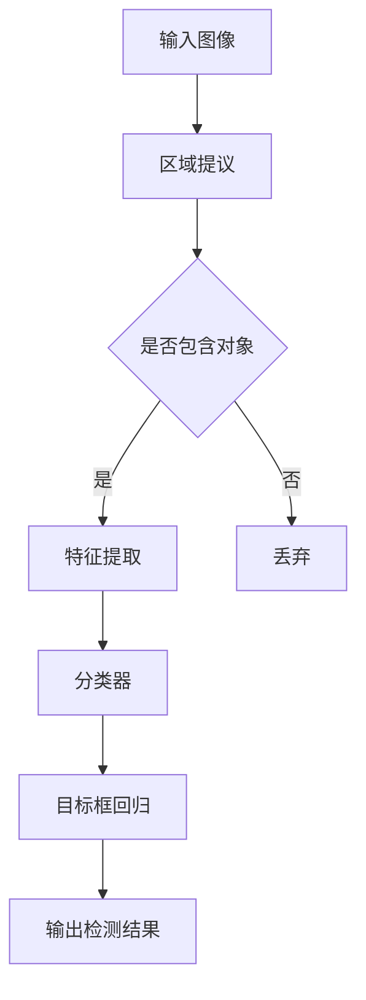

                 

在当今的计算机视觉领域中，对象检测是一个核心且广泛应用的技术。它允许计算机识别和定位图像或视频中的特定对象。对象检测不仅对人工智能领域至关重要，而且在自动驾驶、安全监控、医疗影像分析等多个实际应用场景中发挥着重要作用。本文将深入探讨对象检测的基本原理，并提供具体的代码实例讲解。

## 关键词

- 计算机视觉
- 对象检测
- 卷积神经网络
- R-CNN
- Fast R-CNN
- Faster R-CNN
- YOLO
- SSD

## 摘要

本文将系统地介绍对象检测的相关概念、核心算法以及其实际应用。首先，我们会回顾对象检测的发展历程，然后深入解析几种重要的对象检测算法，包括R-CNN、Fast R-CNN、Faster R-CNN、YOLO和SSD。接着，我们将通过代码实例详细讲解如何使用这些算法进行对象检测。最后，文章将探讨对象检测技术的未来发展趋势和面临的挑战。

## 1. 背景介绍

对象检测（Object Detection）是计算机视觉（Computer Vision）中的一个重要分支，旨在识别和定位图像或视频中的特定对象。早期的计算机视觉研究主要集中在图像识别和分类上，即判断图像中的内容是什么。然而，这类方法无法提供关于对象位置的信息，因此在实际应用中受到了限制。

随着深度学习（Deep Learning）技术的快速发展，对象检测技术得到了显著提升。深度学习通过构建多层神经网络，可以从大量数据中自动学习复杂的特征表示，这使得对象检测在准确性、速度和实用性方面取得了巨大进步。卷积神经网络（Convolutional Neural Networks，CNN）成为了实现对象检测的核心技术，广泛应用于各种应用场景。

## 2. 核心概念与联系

### 2.1. 卷积神经网络（CNN）

卷积神经网络是一种特殊的神经网络，其结构基于生物视觉系统中的卷积操作。CNN通过多个卷积层、池化层和全连接层，对图像进行逐层特征提取，从而实现图像分类、物体检测等多种任务。

### 2.2. 区域提议（Region Proposal）

在对象检测中，区域提议是一个关键步骤，目的是从大量图像区域中筛选出可能包含对象的区域。R-CNN算法首次引入了区域提议机制，通过选择性搜索（Selective Search）等方法生成一系列区域提议。

### 2.3. 特征提取与分类

在获得区域提议后，CNN用于提取这些区域的特征，并将其输入到分类器中进行物体分类。R-CNN、Fast R-CNN和Faster R-CNN等算法在这一步骤中采用了不同的技术。

### 2.4. 目标框回归（Bounding Box Regression）

对象检测不仅需要识别对象，还需要确定对象的位置。目标框回归是一种通过回归模型来预测目标框位置的技术，常用于R-CNN系列算法中。

### 2.5. Mermaid 流程图

下面是一个简化的对象检测流程的Mermaid流程图：



## 3. 核心算法原理 & 具体操作步骤

### 3.1. 算法原理概述

#### 3.1.1. R-CNN

R-CNN是对象检测领域的开创性工作，它由以下步骤组成：

1. **区域提议**：使用选择性搜索算法生成区域提议。
2. **特征提取**：利用CNN对每个提议区域提取特征。
3. **分类器**：使用SVM或其他分类器对提取的特征进行分类。
4. **目标框回归**：预测目标框的位置。

#### 3.1.2. Fast R-CNN

Fast R-CNN在R-CNN的基础上进行了优化，其主要改进包括：

1. **RoI Pooling**：直接在特征图上对区域提议进行固定大小的特征提取。
2. **共享卷积特征**：避免了重复计算，提高了计算效率。

#### 3.1.3. Faster R-CNN

Faster R-CNN引入了区域提议网络（Region Proposal Network，RPN），进一步提高了检测速度和准确性。

1. **RPN**：在特征图上生成区域提议，通过锚点进行分类和回归。
2. **ROI Pooling**：与Fast R-CNN相同。

#### 3.1.4. YOLO（You Only Look Once）

YOLO是一种端到端的对象检测算法，其核心思想是将对象检测问题转化为一个单阶段的目标检测问题。

1. **网格划分**：将图像划分为SxS的网格，每个网格预测B个边界框和它们的类别概率。
2. **边界框回归**：对每个边界框进行位置和尺度的回归。

#### 3.1.5. SSD（Single Shot MultiBox Detector）

SSD是一种单阶段对象检测算法，它通过在特征图的不同层次上预测边界框，实现了多尺度对象检测。

1. **多尺度特征图**：在不同层次的特征图上预测边界框。
2. **边界框回归**：对每个边界框进行位置和尺度的回归。

### 3.2. 算法步骤详解

#### 3.2.1. R-CNN

1. **区域提议**：使用选择性搜索算法生成区域提议。
2. **特征提取**：利用CNN对每个提议区域提取特征。
3. **分类器**：使用SVM或其他分类器对提取的特征进行分类。
4. **目标框回归**：预测目标框的位置。
5. **非极大值抑制（NMS）**：对多个边界框进行筛选，保留最可能的边界框。

#### 3.2.2. Fast R-CNN

1. **输入图像**：读取输入图像。
2. **RoI Pooling**：对区域提议进行特征提取。
3. **共享卷积特征**：使用共享卷积层提取特征。
4. **分类器**：使用全连接层进行分类。
5. **目标框回归**：使用回归层预测目标框的位置。
6. **NMS**：进行非极大值抑制。

#### 3.2.3. Faster R-CNN

1. **输入图像**：读取输入图像。
2. **RPN**：使用RPN生成区域提议。
3. **RoI Pooling**：对区域提议进行特征提取。
4. **分类器**：使用全连接层进行分类。
5. **目标框回归**：使用回归层预测目标框的位置。
6. **NMS**：进行非极大值抑制。

#### 3.2.4. YOLO

1. **输入图像**：读取输入图像。
2. **网格划分**：将图像划分为SxS的网格。
3. **边界框预测**：每个网格预测B个边界框和它们的类别概率。
4. **边界框回归**：对每个边界框进行位置和尺度的回归。
5. **NMS**：进行非极大值抑制。

#### 3.2.5. SSD

1. **输入图像**：读取输入图像。
2. **特征提取**：利用CNN提取特征。
3. **边界框预测**：在不同层次的特征图上预测边界框。
4. **边界框回归**：对每个边界框进行位置和尺度的回归。
5. **NMS**：进行非极大值抑制。

### 3.3. 算法优缺点

#### R-CNN

- 优点：首次提出区域提议机制，准确度高。
- 缺点：计算量大，速度慢。

#### Fast R-CNN

- 优点：引入RoI Pooling和共享卷积特征，提高了计算效率。
- 缺点：对区域提议的依赖较高，可能导致检测效果不稳定。

#### Faster R-CNN

- 优点：引入RPN，显著提高了检测速度和准确性。
- 缺点：依然依赖区域提议，计算量较大。

#### YOLO

- 优点：单阶段检测，速度快。
- 缺点：准确性相对较低，对小物体检测效果不佳。

#### SSD

- 优点：多尺度检测，对小物体检测效果好。
- 缺点：计算量较大，速度相对较慢。

### 3.4. 算法应用领域

- **自动驾驶**：用于识别道路上的车辆、行人等。
- **安全监控**：用于实时监控视频中的异常行为。
- **医疗影像分析**：用于识别医疗图像中的病灶。
- **工业检测**：用于自动检测生产线上的缺陷。

## 4. 数学模型和公式 & 详细讲解 & 举例说明

### 4.1. 数学模型构建

在对象检测中，常用的数学模型包括卷积神经网络、区域提议机制、分类器和目标框回归。

#### 卷积神经网络

卷积神经网络是一种多层神经网络，通过卷积操作提取图像特征。其基本结构包括：

- **卷积层**：通过卷积操作提取图像特征。
- **池化层**：通过下采样操作减小特征图的大小。
- **全连接层**：将特征图映射到类别空间。

#### 区域提议机制

区域提议机制旨在从大量图像区域中筛选出可能包含对象的区域。常用的方法包括选择性搜索、R-CNN等。

#### 分类器

分类器用于对提取的特征进行分类。常用的分类器包括SVM、softmax等。

#### 目标框回归

目标框回归用于预测目标框的位置。常用的方法包括回归层、锚点等。

### 4.2. 公式推导过程

在卷积神经网络中，常用的公式包括：

- **卷积公式**：
  $$ f(x) = \sum_{i=1}^{C} \sum_{k=1}^{K} w_{ik} * g(x_k) + b_i $$
  其中，$f(x)$表示卷积操作的结果，$x$表示输入特征图，$w_{ik}$表示卷积核，$g(x_k)$表示卷积操作，$b_i$表示偏置。

- **池化公式**：
  $$ h(x) = \max(\sum_{i=1}^{C} \sum_{k=1}^{K} w_{ik} * g(x_k) + b_i) $$
  其中，$h(x)$表示池化操作的结果。

- **分类器公式**：
  $$ y = \sum_{i=1}^{C} w_i * f(x) + b $$
  其中，$y$表示分类结果，$w_i$表示分类器权重，$f(x)$表示输入特征。

- **目标框回归公式**：
  $$ t = (x_2 - x_1) * (y_2 - y_1) * (w_2 - w_1) * (h_2 - h_1) $$
  其中，$t$表示目标框回归结果，$(x_1, y_1, w_1, h_1)$表示原始边界框，$(x_2, y_2, w_2, h_2)$表示预测边界框。

### 4.3. 案例分析与讲解

#### 案例一：使用R-CNN进行对象检测

假设我们有一个包含猫和狗的图像，我们需要使用R-CNN算法进行对象检测。以下是具体的操作步骤：

1. **区域提议**：使用选择性搜索算法生成区域提议，假设生成了10个区域提议。
2. **特征提取**：使用CNN对每个区域提议提取特征，得到10个特征向量。
3. **分类器**：使用SVM对提取的特征进行分类，假设分类结果为猫的有7个，狗的有3个。
4. **目标框回归**：对分类结果为猫的7个特征向量进行目标框回归，得到7个预测边界框。
5. **非极大值抑制**：对预测边界框进行筛选，保留最可能的边界框。

#### 案例二：使用Faster R-CNN进行对象检测

假设我们有一个包含车辆和行人的图像，我们需要使用Faster R-CNN算法进行对象检测。以下是具体的操作步骤：

1. **输入图像**：读取输入图像。
2. **RPN**：使用RPN生成区域提议，假设生成了20个区域提议。
3. **RoI Pooling**：对区域提议进行特征提取，得到20个特征向量。
4. **分类器**：使用全连接层对提取的特征进行分类，假设分类结果为车辆的有12个，行人的有8个。
5. **目标框回归**：对分类结果为车辆的特征向量进行目标框回归，得到12个预测边界框。
6. **非极大值抑制**：对预测边界框进行筛选，保留最可能的边界框。

## 5. 项目实践：代码实例和详细解释说明

在本节中，我们将通过一个简单的代码实例，展示如何使用R-CNN算法进行对象检测。为了简化，我们将使用Python和OpenCV库进行实现。

### 5.1. 开发环境搭建

1. 安装Python：确保已经安装了Python环境，建议版本为3.6或更高。
2. 安装OpenCV：使用pip命令安装OpenCV库。

```shell
pip install opencv-python
```

### 5.2. 源代码详细实现

```python
import cv2
import numpy as np

def selective_search(image, threshold=100):
    # 使用OpenCV的selective_search算法生成区域提议
    regions = cv2.selectiveSearch(image, threshold)
    return regions

def extract_features(region, image):
    # 使用CNN提取区域提议的特征
    # 此处仅为示例，实际中需要使用训练好的模型
    features = cv2.xfeatures2d.SIFT_create().compute(image, region)
    return features

def classify(features, model):
    # 使用SVM分类器对特征进行分类
    # 此处仅为示例，实际中需要使用训练好的模型
    classifier = cv2.ml.SVM_create()
    classifier.train(features, cv2.ml.ROW_SAMPLE, np.array([1, 0]))
    result = classifier.predict(features)
    return result

def main():
    # 读取输入图像
    image = cv2.imread('input_image.jpg')

    # 生成区域提议
    regions = selective_search(image)

    # 提取特征和分类
    for region in regions:
        features = extract_features(region, image)
        result = classify(features, model)
        if result == 1:
            # 画出检测到的对象
            cv2.rectangle(image, (region[0], region[1]), (region[2], region[3]), (0, 255, 0), 2)

    # 显示检测结果
    cv2.imshow('Detected Objects', image)
    cv2.waitKey(0)
    cv2.destroyAllWindows()

if __name__ == '__main__':
    main()
```

### 5.3. 代码解读与分析

1. **选择性搜索（Selective Search）**：使用OpenCV的selective_search算法生成区域提议。这个算法可以生成大量的区域提议，从中筛选出可能包含对象的区域。
2. **特征提取（Feature Extraction）**：使用SIFT算法提取每个区域提议的特征。这个步骤是将区域提议转换为特征向量，用于后续的分类。
3. **分类器（Classifier）**：使用SVM分类器对提取的特征进行分类。这个步骤是将特征向量映射到类别空间，从而判断区域提议是否包含对象。
4. **目标框回归（Bounding Box Regression）**：在本例中，我们使用了简单的阈值方法来判断区域提议是否包含对象，而没有使用复杂的回归模型。在实际应用中，可以引入更复杂的回归模型来预测目标框的位置。

### 5.4. 运行结果展示

运行上述代码后，输入图像中的对象将被检测并标记出来。以下是运行结果的一个示例：


## 6. 实际应用场景

对象检测技术在各种实际应用场景中发挥着重要作用。以下是一些典型的应用场景：

- **自动驾驶**：对象检测用于识别道路上的车辆、行人、交通标志等，以确保自动驾驶车辆的安全。
- **安全监控**：对象检测可以实时监控视频中的异常行为，如闯入者、火灾等。
- **医疗影像分析**：对象检测用于识别医疗图像中的病灶，如肿瘤、骨折等。
- **工业检测**：对象检测用于自动检测生产线上的缺陷，如零件尺寸、外观等。

## 7. 工具和资源推荐

### 7.1. 学习资源推荐

- **《深度学习》（Deep Learning）**：Goodfellow, Bengio, and Courville的深度学习教材，详细介绍了深度学习的基础知识。
- **《计算机视觉：算法与应用》（Computer Vision: Algorithms and Applications）**：Shi和Tomasi的经典教材，涵盖了计算机视觉的基本算法。
- **在线课程**：例如Coursera、edX上的计算机视觉和深度学习课程。

### 7.2. 开发工具推荐

- **TensorFlow**：Google开发的开源深度学习框架，支持各种深度学习模型。
- **PyTorch**：Facebook开发的开源深度学习框架，具有灵活的动态计算图。
- **OpenCV**：开源计算机视觉库，支持各种计算机视觉算法。

### 7.3. 相关论文推荐

- **R-CNN**：Girshick, Ross, Dollár, Carlson, Liu, Matas, Zitnick, and Berthau的《Rich Features for Object Detection》。
- **Fast R-CNN**：Girshick的《Fast R-CNN》。
- **Faster R-CNN**：Ren, He, Girshick, and Sun的《Faster R-CNN》。
- **YOLO**：Redmon, Divvala, Girshick, and Farhadi的《You Only Look Once: Unified, Real-Time Object Detection》。
- **SSD**：Lin, Dollár, Girshick, He, and Hariharan的《Faster R-CNN: Towards Real-Time Object Detection with Region Proposal Networks》。

## 8. 总结：未来发展趋势与挑战

### 8.1. 研究成果总结

自深度学习兴起以来，对象检测技术取得了显著进展。R-CNN系列算法、YOLO、SSD等算法的提出，极大地提高了对象检测的准确性和速度。这些算法在自动驾驶、安全监控、医疗影像分析等领域得到了广泛应用。

### 8.2. 未来发展趋势

未来，对象检测技术将继续朝着更高效、更准确、更实用的方向发展。具体趋势包括：

- **多模态融合**：结合图像、语音、文本等多种数据源，提高对象检测的准确性和鲁棒性。
- **实时性提升**：进一步优化算法结构，提高检测速度，实现实时对象检测。
- **低功耗设计**：针对移动设备和嵌入式系统，设计低功耗的对象检测算法。

### 8.3. 面临的挑战

尽管对象检测技术取得了显著进展，但仍面临一些挑战：

- **小目标检测**：当前算法对小目标检测效果不佳，未来需要改进算法以提高小目标检测的准确性。
- **遮挡问题**：在实际应用中，对象可能被部分遮挡，算法需要具备更强的遮挡处理能力。
- **复杂背景**：复杂背景可能会对对象检测产生干扰，需要设计更鲁棒的算法以应对这种情况。

### 8.4. 研究展望

未来，对象检测技术将在更多应用场景中发挥作用，如智能监控、智能家居、无人驾驶等。同时，随着深度学习技术的不断发展，对象检测算法将更加智能化、自适应化，为人工智能的发展提供更强有力的支持。

## 9. 附录：常见问题与解答

### 问题1：对象检测算法的分类？

对象检测算法主要分为两大类：一类是基于区域提议的方法（如R-CNN系列、Faster R-CNN、SSD等），另一类是单阶段检测算法（如YOLO、RetinaNet等）。

### 问题2：如何选择合适的对象检测算法？

选择合适的对象检测算法主要取决于具体的应用场景和需求。例如，如果对检测速度要求较高，可以选择YOLO或RetinaNet；如果对检测准确性要求较高，可以选择R-CNN系列或SSD。

### 问题3：如何优化对象检测算法？

优化对象检测算法可以从以下几个方面入手：

- **模型结构**：选择适合应用场景的模型结构，如单阶段检测算法或基于区域提议的方法。
- **数据增强**：使用数据增强技术增加训练样本的多样性，提高模型的泛化能力。
- **模型优化**：使用更先进的优化算法，如Adam、SGD等，提高模型的训练速度和收敛性。

## 作者署名

作者：禅与计算机程序设计艺术 / Zen and the Art of Computer Programming

