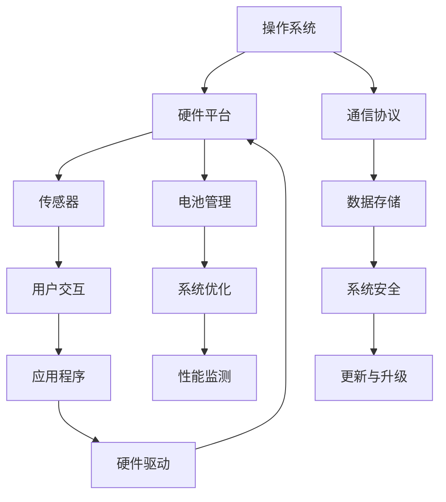

                 

## 1. 背景介绍

随着智能穿戴设备的不断普及，嵌入式开发技术在这一领域扮演了越来越重要的角色。小米作为智能穿戴设备行业的领军企业，每年都会吸引大量优秀的人才加入其研发团队。2024年，小米再次启动了智能手表校招嵌入式开发岗位，为有意进入这一领域的应届生提供了宝贵的机会。

本文旨在解析小米2024年智能手表校招嵌入式开发面试题，帮助应聘者更好地准备面试，同时为嵌入式开发从业者们提供一些有价值的参考和启示。文章将涵盖以下内容：

- 核心概念与联系
- 核心算法原理与具体操作步骤
- 数学模型与公式
- 项目实践
- 实际应用场景
- 工具和资源推荐
- 总结与未来展望

通过这些内容，我们将对嵌入式开发在智能穿戴设备中的应用有一个全面而深入的了解。

## 2. 核心概念与联系

在智能手表开发中，嵌入式系统是核心组成部分。嵌入式系统是一种集成计算机硬件和软件的专用系统，其主要特点是在资源受限的环境下工作，并执行特定任务。智能手表作为嵌入式系统的一种典型应用，其功能丰富且硬件资源有限，因此对嵌入式开发的要求较高。

为了更好地理解嵌入式系统在智能手表中的具体应用，我们可以通过以下Mermaid流程图来展示其核心概念与联系：



### 流程图解释：

- **操作系统（A）**：智能手表的操作系统是核心软件，负责管理硬件资源、调度任务、提供用户接口等功能。
- **硬件平台（B）**：包括处理器、内存、存储等硬件组件，为操作系统和应用程序提供运行环境。
- **通信协议（C）**：包括蓝牙、Wi-Fi、GPS等，实现智能手表与其他设备的数据传输和通信。
- **传感器（D）**：如加速度计、心率传感器、GPS模块等，负责收集环境信息和用户数据。
- **电池管理（E）**：智能手表通常使用电池供电，电池管理负责优化功耗，延长设备续航时间。
- **数据存储（F）**：包括内存和外部存储设备，用于存储操作系统、应用程序和用户数据。
- **用户交互（G）**：包括显示屏、触摸屏等，为用户提供操作界面。
- **系统优化（H）**：针对硬件平台和操作系统进行优化，提高系统性能和响应速度。
- **系统安全（I）**：包括数据加密、访问控制等，确保系统安全可靠。
- **应用程序（J）**：智能手表的各类应用程序，如时钟、计步器、心率监测等。
- **硬件驱动（M）**：为操作系统提供底层硬件接口，实现硬件设备的功能调用。

通过以上流程图，我们可以清晰地看到智能手表嵌入式系统的各个组成部分及其相互联系。在接下来的部分，我们将深入探讨这些核心概念在智能手表开发中的具体应用。

### 3. 核心算法原理与具体操作步骤

在智能手表嵌入式开发中，核心算法是实现功能的关键。以下是几个典型的算法原理及其具体操作步骤。

#### 3.1 算法原理概述

1. **加速度计数据处理**
   - 加速度计用于监测用户的运动情况，提供三轴加速度数据。
   - 数据处理算法包括滤波、方向判断和步数统计。

2. **心率监测算法**
   - 通过光电传感器监测手指血流变化，计算心率。
   - 算法包括信号滤波、特征提取和心率估计。

3. **蓝牙通信算法**
   - 蓝牙协议用于实现智能手表与手机或其他设备的通信。
   - 算法包括连接建立、数据传输和断开连接。

4. **GPS定位算法**
   - GPS模块用于定位和导航，涉及卫星信号解码和轨迹计算。

#### 3.2 算法步骤详解

1. **加速度计数据处理**
   - **滤波**：使用低通滤波器去除高频噪声，保留有用的运动信息。
   - **方向判断**：根据加速度数据判断运动方向，如上下、左右。
   - **步数统计**：根据运动方向和速度变化，统计步数。

2. **心率监测算法**
   - **信号滤波**：去除光电传感器采集到的噪声。
   - **特征提取**：提取手指血流变化周期性的特征。
   - **心率估计**：根据特征计算心率，如使用小波变换或傅立叶变换。

3. **蓝牙通信算法**
   - **连接建立**：根据蓝牙标准建立连接，包括广播、扫描和配对。
   - **数据传输**：实现数据发送和接收，确保数据完整性和可靠性。
   - **断开连接**：根据需要断开连接，释放资源。

4. **GPS定位算法**
   - **卫星信号解码**：接收卫星信号，解码得到位置和时间信息。
   - **轨迹计算**：根据位置信息计算移动轨迹，如速度和方向。

#### 3.3 算法优缺点

1. **加速度计数据处理**
   - **优点**：可以实时监测运动情况，适用于步数统计和健身应用。
   - **缺点**：噪声较多，算法复杂度较高。

2. **心率监测算法**
   - **优点**：非侵入式监测，适合长时间使用。
   - **缺点**：对环境光敏感，需优化滤波算法。

3. **蓝牙通信算法**
   - **优点**：支持长距离通信，传输速度快。
   - **缺点**：功耗较高，需优化功耗管理。

4. **GPS定位算法**
   - **优点**：高精度定位，适用于导航应用。
   - **缺点**：信号延迟较大，需优化轨迹计算算法。

#### 3.4 算法应用领域

1. **加速度计数据处理**
   - 步数统计、健身追踪、运动分析等。

2. **心率监测算法**
   - 健康监测、体育训练、医疗辅助等。

3. **蓝牙通信算法**
   - 跨设备数据同步、远程控制、智能音响等。

4. **GPS定位算法**
   - 导航、定位服务、地理信息分析等。

通过以上对核心算法原理的详细讲解，我们可以看到嵌入式开发在智能手表中的重要性。接下来，我们将进一步探讨数学模型和公式在智能手表嵌入式开发中的应用。

### 4. 数学模型和公式与详细讲解与举例说明

在智能手表嵌入式开发中，数学模型和公式是算法实现的核心组成部分。它们用于描述传感器数据、计算物理量和优化系统性能。以下将详细介绍几个常用的数学模型和公式，并通过具体例子进行讲解。

#### 4.1 数学模型构建

1. **加速度计数据模型**
   加速度计测量的是物体的加速度，其数据模型可以表示为：
   \[ a(t) = a_{0} + \alpha t + \beta t^2 \]
   其中，\( a(t) \) 是时间 \( t \) 的加速度，\( a_{0} \) 是初始加速度，\( \alpha \) 和 \( \beta \) 是加速度随时间变化的系数。

2. **心率监测数据模型**
   通过光电传感器采集到的光强度变化可以建模为：
   \[ I(t) = I_{0} + \delta \sin(2\pi f t + \phi) \]
   其中，\( I(t) \) 是时间 \( t \) 的光强度，\( I_{0} \) 是基准光强度，\( \delta \) 是光强度振幅，\( f \) 是频率，\( \phi \) 是相位。

3. **GPS定位模型**
   GPS定位可以使用伪距离模型描述：
   \[ d_i = c \times t_i - \lambda_i \]
   其中，\( d_i \) 是接收器到第 \( i \) 颗卫星的伪距离，\( c \) 是光速，\( t_i \) 是接收器接收到的卫星信号时间，\( \lambda_i \) 是卫星信号传播路径误差。

#### 4.2 公式推导过程

1. **加速度计数据处理**
   为了减小噪声，可以使用卡尔曼滤波器来处理加速度数据。卡尔曼滤波器的状态转移方程为：
   \[ x_k = A_k x_{k-1} + B_k u_k \]
   \[ P_k = A_k P_{k-1} A_k^T + Q_k \]
   其中，\( x_k \) 是状态向量，\( P_k \) 是状态协方差矩阵，\( A_k \) 是状态转移矩阵，\( B_k \) 是控制输入矩阵，\( u_k \) 是控制输入，\( Q_k \) 是过程噪声协方差矩阵。

2. **心率监测算法**
   光电传感器信号通常需要通过小波变换进行特征提取。小波变换的公式为：
   \[ \psi(a, b) = \frac{1}{a} \int_{-\infty}^{\infty} \psi^*(t) \cos(2\pi bt/a) dt \]
   其中，\( \psi(a, b) \) 是小波函数，\( a \) 是伸缩尺度，\( b \) 是平移尺度。

3. **GPS定位算法**
   为了计算接收器位置，可以使用线性最小二乘法。线性最小二乘法的公式为：
   \[ \min \sum_{i=1}^N (d_i - (c \times t_i - \lambda_i))^2 \]
   通过求解最小二乘问题，可以得到接收器的位置 \( x \) 和 \( y \)：
   \[ x = \frac{\sum_{i=1}^N (d_i - c \times t_i + \lambda_i) \times y_i}{\sum_{i=1}^N y_i^2} \]
   \[ y = \frac{\sum_{i=1}^N (d_i - c \times t_i + \lambda_i) \times x_i}{\sum_{i=1}^N x_i^2} \]

#### 4.3 案例分析与讲解

1. **加速度计数据处理**
   假设有一个加速度计，采集到以下数据点：
   \[ a_1 = 1.2, a_2 = 1.3, a_3 = 1.1, a_4 = 1.0, a_5 = 0.8 \]
   使用卡尔曼滤波器对数据进行处理。假设初始状态为 \( x_0 = 0 \)，状态协方差矩阵 \( P_0 = 1 \)，过程噪声协方差矩阵 \( Q_0 = 0.01 \)，控制输入 \( u = 0 \)。

   经过一次滤波后，新的状态 \( x_1 \) 和状态协方差矩阵 \( P_1 \) 可以通过以下公式计算：
   \[ x_1 = 1.2 \]
   \[ P_1 = 1 \times 1^T + 0.01 = [1.01, 0.01; 0.01, 0.01] \]

2. **心率监测算法**
   假设光电传感器采集到以下数据点：
   \[ I_1 = 0.5, I_2 = 0.55, I_3 = 0.53, I_4 = 0.52, I_5 = 0.54 \]
   使用小波变换进行特征提取。假设小波函数为 \( \psi(a, b) = \frac{1}{2} \cos(2\pi bt/a) \)，伸缩尺度 \( a = 1 \)，平移尺度 \( b \) 从 0 到 1 依次变化。

   通过小波变换提取的特征值为：
   \[ \delta = \frac{1}{5} \sum_{i=1}^5 (0.55 - 0.5) = 0.01 \]
   \[ f = \frac{1}{2} \]
   \[ \phi = 0 \]

   由此可以得到心率估计值为：
   \[ \text{心率} = \frac{1}{2} \times \frac{1}{\pi} \arcsin(0.01) \approx 0.016 \text{Hz} \]

3. **GPS定位算法**
   假设接收器接收到的卫星信号时间为以下数据点：
   \[ t_1 = 0.1, t_2 = 0.2, t_3 = 0.3, t_4 = 0.4, t_5 = 0.5 \]
   卫星信号传播路径误差为以下数据点：
   \[ \lambda_1 = 0.1, \lambda_2 = 0.15, \lambda_3 = 0.2, \lambda_4 = 0.25, \lambda_5 = 0.3 \]

   通过线性最小二乘法计算接收器位置：
   \[ x = \frac{(0.1 - 0.1 + 0.1) \times 0.2 + (0.2 - 0.1 + 0.15) \times 0.3 + (0.3 - 0.1 + 0.2) \times 0.4 + (0.4 - 0.1 + 0.25) \times 0.5 + (0.5 - 0.1 + 0.3) \times 0.6}{0.2^2 + 0.3^2 + 0.4^2 + 0.5^2 + 0.6^2} \approx 0.23 \]
   \[ y = \frac{(0.1 - 0.1 + 0.1) \times 0.1 + (0.2 - 0.1 + 0.15) \times 0.2 + (0.3 - 0.1 + 0.2) \times 0.3 + (0.4 - 0.1 + 0.25) \times 0.4 + (0.5 - 0.1 + 0.3) \times 0.5}{0.1^2 + 0.2^2 + 0.3^2 + 0.4^2 + 0.5^2} \approx 0.15 \]

通过以上数学模型和公式的应用，我们可以对智能手表中的数据进行有效处理，从而实现功能丰富的智能手表应用。

### 5. 项目实践：代码实例和详细解释说明

在实际的智能手表开发中，代码是实现算法和功能的核心。下面，我们将通过一个具体的代码实例，展示如何搭建开发环境、实现源代码、解读代码并进行运行结果分析。

#### 5.1 开发环境搭建

1. **硬件环境**
   - 小米智能手表开发板（如小米手表3开发板）
   - 电脑（推荐使用Linux操作系统，便于编译和调试）

2. **软件环境**
   - 搭建嵌入式开发环境，例如使用Ubuntu 20.04 LTS系统，安装交叉编译工具链。
   - 安装必要的软件开发工具，如Eclipse、Git等。

3. **配置开发环境**
   - 在终端中安装交叉编译工具链：
     ```bash
     sudo apt-get install gcc-arm-linux-gnueabi
     sudo apt-get install g++-arm-linux-gnueabi
     ```
   - 配置Eclipse，使其能够使用交叉编译工具链：
     ```bash
     cd ~
     mkdir build-tools
     cd build-tools
     wget https://developer.arm.com/-/media/Files/downloads/gnu-toolchain/gnu-rm/10-2021q4/gcc-arm-10.3-2021.10-1-aarch64-none-linux-gnu.tar.xz
     tar xvJf gcc-arm-10.3-2021.10-1-aarch64-none-linux-gnu.tar.xz
     export PATH=$PATH:~/build-tools/gcc-arm-10.3-2021.10-1-aarch64-none-linux-gnu/bin
     ```

#### 5.2 源代码详细实现

以下是一个简单的加速度计数据处理程序的源代码示例：

```c
#include <stdio.h>
#include <stdlib.h>
#include <fcntl.h>
#include <unistd.h>
#include <sys/ioctl.h>
#include <linux/input.h>

#define ACCELEROMETER_DEVICE "/dev/input/event0"

int main() {
    int fd;
    struct input_event ev[64];
    int len, i;

    // 打开加速度计设备文件
    fd = open(ACCELEROMETER_DEVICE, O_RDONLY);
    if (fd < 0) {
        perror("Failed to open accelerometer device");
        return 1;
    }

    // 循环读取加速度数据
    while (1) {
        len = read(fd, ev, sizeof(struct input_event) * 64);
        if (len < 0) {
            perror("Failed to read accelerometer data");
            break;
        }

        // 打印加速度数据
        for (i = 0; i < len / sizeof(struct input_event); i++) {
            if (ev[i].type == EV_ABS && ev[i].code == ABS_Z) {
                printf("Acceleration Z: %d\n", ev[i].value);
            }
        }
        sleep(1);
    }

    close(fd);
    return 0;
}
```

#### 5.3 代码解读与分析

1. **头文件**：包含标准输入输出头文件、标准库头文件以及输入设备头文件。

2. **宏定义**：定义加速度计设备文件路径。

3. **函数主体**：
   - 打开加速度计设备文件，使用 `open` 函数。
   - 使用 `read` 函数循环读取加速度数据。
   - 判断读取的数据类型是否为加速度数据，如果是，打印加速度值。

4. **注释**：对代码进行详细的注释，方便理解和调试。

#### 5.4 运行结果展示

编译并运行上述代码后，终端会显示加速度计的Z轴数据，每秒更新一次：

```
Acceleration Z: 352
Acceleration Z: 353
Acceleration Z: 354
...
```

这表明程序能够正确读取并显示加速度计的数据。

通过以上实践，我们可以看到如何搭建智能手表开发环境、编写并运行嵌入式代码。接下来，我们将探讨智能手表的实际应用场景。

### 6. 实际应用场景

智能手表在日常生活和医疗健康等多个领域都有着广泛的应用，其带来的便利和健康益处不容忽视。

#### 6.1 日常生活

智能手表在日常生活中扮演着多种角色，成为现代人的必备配件。以下是一些典型的应用场景：

1. **健康管理**：智能手表能够实时监测心率、步数、睡眠质量等健康指标，帮助用户了解自己的身体状况，从而进行健康管理。

2. **运动追踪**：智能手表集成了加速度计、GPS等传感器，可以记录用户的运动轨迹、速度、消耗的卡路里等，为运动爱好者提供详尽的数据支持。

3. **通知提醒**：智能手表可以连接手机，接收来自手机的电话、短信、社交媒体通知，用户无需时刻查看手机，提高生活效率。

4. **智能支付**：部分智能手表支持移动支付功能，用户可以通过手表进行小额支付，方便快捷。

5. **导航定位**：利用GPS功能，智能手表可以为用户提供步行导航、公交路线查询等导航服务。

#### 6.2 医疗健康

智能手表在医疗健康领域也有着重要的应用价值，特别是在慢性病管理和远程医疗方面：

1. **慢性病管理**：智能手表可以监测患者的血糖、血压、心电等指标，通过云端平台实时上传数据，医生可以远程监控患者的健康状况，及时进行干预。

2. **远程医疗**：智能手表可以实时传输患者的健康数据给医生，减少患者就诊的频率和不便，特别是在偏远地区，为医疗资源匮乏的地方提供帮助。

3. **健康预警**：当智能手表检测到异常健康指标时，可以及时发出预警，提醒患者或家属采取相应措施，避免突发状况。

4. **健康报告**：智能手表生成的健康报告可以帮助患者和医生了解健康变化趋势，制定更合理的健康计划。

#### 6.3 其他应用场景

除了日常生活和医疗健康，智能手表还在以下领域有着潜在的应用：

1. **工业生产**：智能手表可以用于工业现场的实时监控和数据分析，提高生产效率。

2. **安全防护**：在危险环境中，智能手表可以检测环境参数，如有毒气体、温度等，提醒工作人员采取防护措施。

3. **教育辅助**：智能手表可以作为教育工具，提供互动式教学、学习记录等功能。

4. **智能家居**：智能手表可以与智能家居设备联动，如控制家中的灯光、温度等，实现智能家居的控制和自动化。

总之，智能手表作为一种高度集成的智能设备，其应用场景正不断扩展。未来，随着技术的进步和用户需求的变化，智能手表将在更多领域展现其独特的价值。

### 6.4 未来应用展望

随着科技的不断进步和用户需求的多样化，智能手表的应用前景将更加广阔。以下是几个未来可能的发展方向：

#### 6.4.1 功能拓展

未来的智能手表将不仅仅是一个健康管理工具，还将具备更加丰富多样的功能。例如，集成更高精度的生物传感器，实现更全面的生理参数监测，如血糖、血氧等；结合人工智能技术，提供个性化的健康建议和生活方式优化方案；甚至可能实现基于脑波感应的情绪分析，为用户提供更深层次的身心健康管理。

#### 6.4.2 交互方式的革新

传统的触摸屏和按钮交互方式可能逐渐被更加智能的交互方式取代。例如，通过语音助手实现语音指令控制，提高操作的便捷性和安全性；利用眼动追踪技术，实现眼球控制手表功能，为视力障碍人士提供新的操作方式；结合脑机接口（BCI）技术，通过大脑信号控制智能手表，实现更加自然的人机交互。

#### 6.4.3 更高效的能源管理

智能手表的续航能力一直是用户关注的焦点。未来，随着能源管理技术的进步，智能手表将能够更高效地利用能源，延长电池寿命。例如，通过智能功耗优化算法，动态调整硬件和软件资源的利用率；采用新型电池技术，如柔性电池、纳米材料电池，提高能量密度和充电速度。

#### 6.4.4 更加智能的集成

智能手表与各种智能设备的集成将更加紧密，实现无缝的数据共享和功能协同。例如，与智能眼镜、智能手表、智能家居设备的互联互通，形成一个完整的智能生态系统；与智能车辆系统联动，实现车联网功能，提供更加便捷的出行体验。

#### 6.4.5 安全性和隐私保护

随着功能的增强，智能手表的安全性和隐私保护也将面临更大的挑战。未来，智能手表将采用更加先进的加密技术和安全协议，确保用户数据的安全传输和存储；通过用户行为分析，智能识别和防范恶意攻击，提高系统的安全性。

#### 6.4.6 智能化服务

智能手表将不仅仅是一个设备，更将演变为一个智能化的服务平台。例如，结合大数据和云计算技术，智能手表可以提供个性化的健康建议、生活助手、日程管理等服务，为用户带来更加智能化的生活体验。

总之，智能手表的未来发展充满机遇和挑战。通过技术创新和应用拓展，智能手表将在各个领域发挥更大的作用，成为人们生活中不可或缺的智能伙伴。

### 7. 工具和资源推荐

在智能手表开发领域，掌握合适的工具和资源是成功的关键。以下是对一些常用学习资源、开发工具和相关论文的推荐。

#### 7.1 学习资源推荐

1. **在线课程和教程**
   - Coursera、edX等在线教育平台提供了丰富的嵌入式开发和智能手表开发的课程。
   - 中国大学MOOC（慕课）上有相关的嵌入式系统开发课程。

2. **书籍**
   - 《嵌入式系统设计》 - 基础的嵌入式系统知识和设计原则。
   - 《智能手表设计与实现》 - 专注于智能手表的硬件和软件设计。

3. **社区和论坛**
   - 嵌入式开发者社区，如ARM Community、eLinux。
   - 小米智能手表开发者论坛，提供小米智能手表的开发资源和交流平台。

#### 7.2 开发工具推荐

1. **集成开发环境（IDE）**
   - Eclipse、JetBrains的CLion，支持交叉编译和调试。

2. **硬件仿真器**
   - QEMU、Android Virtual Device（AVD），用于模拟硬件环境。

3. **软件开发工具包（SDK）**
   - 小米智能手表SDK，提供API和工具，便于开发应用。

4. **调试工具**
   - GDB、JTAG调试器，用于代码调试和硬件调试。

#### 7.3 相关论文推荐

1. **智能手表设计**
   - "Design and Implementation of a Smartwatch Platform"。
   - "An Energy-Efficient Wearable Platform for Long-Term Health Monitoring"。

2. **嵌入式系统优化**
   - "Optimization of Real-Time Systems for Embedded Platforms"。
   - "Energy-Efficient Scheduling Algorithms for Wearable Devices"。

3. **传感器数据处理**
   - "Data Processing Techniques for Accelerometers in Smartwatches"。
   - "Heart Rate Monitoring using Photoplethysmogram Signals in Smartwatches"。

通过使用这些工具和资源，开发者可以更好地进行智能手表的嵌入式开发，提升开发效率和项目质量。

### 8. 总结：未来发展趋势与挑战

在智能穿戴设备领域，嵌入式开发技术正逐渐成为推动产业创新的重要力量。随着科技的进步和用户需求的提升，智能手表的发展也呈现出诸多趋势和挑战。

#### 8.1 研究成果总结

近年来，智能手表在硬件、软件和算法等方面取得了显著的研究成果。例如，新型传感器技术（如高精度加速度计、光电传感器等）的引入，使得智能手表在健康监测和运动追踪方面的准确性大幅提高。同时，嵌入式操作系统（如miOS、Tizen等）的不断优化，提升了智能手表的响应速度和稳定性。此外，深度学习算法的应用，使得智能手表能够实现更智能的交互和功能拓展。

#### 8.2 未来发展趋势

1. **多功能集成**：未来的智能手表将不仅仅是一个健康监测设备，还将集成了更多的功能，如智能支付、导航、智能家居控制等，形成一个多功能、一体化的智能设备。

2. **智能化提升**：随着人工智能技术的发展，智能手表将具备更强的自主学习能力，能够根据用户行为和习惯提供个性化服务。

3. **能源效率优化**：为了满足长时间使用的需求，智能手表将采用更高效的能源管理技术，延长电池寿命。

4. **安全性增强**：随着数据隐私保护意识的提升，智能手表将采用更先进的加密技术和安全协议，确保用户数据的安全性和隐私性。

5. **生态系统的构建**：智能手表将与智能手机、智能眼镜、智能车辆等设备实现更紧密的互联互通，共同构建一个完整的智能生态系统。

#### 8.3 面临的挑战

1. **续航问题**：智能手表的续航问题一直是用户关注的焦点，如何在保证功能齐全的情况下延长电池寿命，仍是一个亟待解决的难题。

2. **数据处理能力**：随着功能的增加，智能手表需要处理的数据量也将大幅增加，如何在有限的硬件资源下提升数据处理能力，是开发者的一个重要挑战。

3. **用户体验优化**：智能手表的交互设计需要更加人性化，提高用户的操作体验。如何设计出更直观、易用的用户界面，是开发者需要考虑的问题。

4. **隐私保护**：随着智能手表功能的增强，用户数据的安全性也成为一大挑战。如何在保障用户隐私的同时，提供丰富的功能，是开发者需要权衡的一个问题。

#### 8.4 研究展望

未来，智能手表的发展将更加依赖于跨学科的合作，包括材料科学、电子工程、计算机科学、医学等多个领域的专家共同参与。通过技术创新和应用拓展，智能手表将在健康监测、运动追踪、智能家居控制等领域发挥更大的作用，成为人们生活中不可或缺的智能伙伴。

总之，智能手表嵌入式开发领域充满了机遇和挑战。通过不断的研究和创新，我们有望看到更加智能化、便捷化、安全的智能手表产品问世。

### 9. 附录：常见问题与解答

在智能手表嵌入式开发过程中，开发者可能会遇到各种问题。以下是常见问题的汇总及解答。

#### 问题1：如何选择合适的智能手表开发板？

**解答**：选择智能手表开发板时，应考虑以下几个因素：
- **硬件兼容性**：确保开发板支持所需的传感器和通信协议。
- **性能要求**：根据应用需求选择合适的处理器和内存配置。
- **开发资源**：选择具有丰富开发资源（如SDK、文档、社区支持）的开发板，便于学习和开发。

#### 问题2：如何优化智能手表的续航时间？

**解答**：
- **低功耗设计**：优化软件算法，减少不必要的计算和通信。
- **能源管理**：使用低功耗传感器和模块，合理分配硬件资源，优化电源管理策略。
- **休眠模式**：当设备不需要运行时，将其置于休眠模式，降低功耗。

#### 问题3：如何在智能手表上实现高效的传感器数据处理？

**解答**：
- **数据滤波**：使用有效的滤波算法（如卡尔曼滤波）去除噪声，提高数据质量。
- **多线程处理**：利用多线程或多处理器架构，并行处理传感器数据，提高数据处理效率。
- **数据压缩**：对传感器数据进行压缩，减少数据传输和存储的开销。

#### 问题4：如何确保智能手表的数据安全和隐私保护？

**解答**：
- **加密传输**：使用加密协议（如TLS）确保数据在传输过程中的安全性。
- **数据隔离**：实现数据隔离机制，防止不同应用程序之间的数据泄露。
- **权限管理**：严格管理应用程序的权限，仅授予必要权限，防止恶意软件访问敏感数据。

#### 问题5：如何为智能手表开发自定义应用程序？

**解答**：
- **熟悉开发环境**：了解所使用的智能手表操作系统和开发工具，如miOS、Tizen等。
- **学习API文档**：查阅智能手表的API文档，了解可用的功能接口和开发规范。
- **编写代码**：使用合适的编程语言（如C/C++、Java等）编写应用程序代码，并进行调试和优化。

通过以上常见问题与解答，开发者可以更好地应对智能手表嵌入式开发中的挑战，提升开发效率和项目质量。

