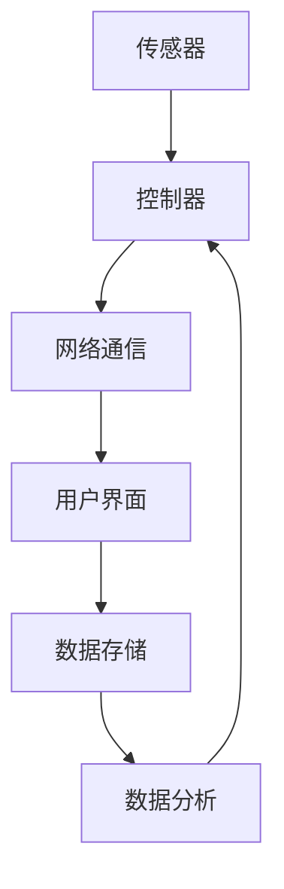

                 

关键词：智能家居，生态系统，面试经验，技术架构，算法原理，数学模型，代码实例，应用场景，未来展望

> 摘要：本文详细分享了一次针对小米2025智能家居生态系统专家社招的面试经历，涵盖从面试准备、技术面试到综合面试的全过程。通过本文，希望能够为广大求职者提供有价值的面试技巧和建议，助力大家顺利通过面试，实现职业发展。

## 1. 背景介绍

2025年，智能家居市场迎来了快速发展，各大厂商纷纷推出智能化家居产品，试图在竞争激烈的市场中占据一席之地。作为我国智能家居行业的领军企业，小米公司持续加大研发投入，致力于构建一个完善的智能家居生态系统。为了迎接未来的市场挑战，小米公司在2025年启动了智能家居生态系统专家社招项目。

本人作为一名有着多年软件开发经验的工程师，对智能家居领域有着浓厚的兴趣。在得知小米公司招募智能家居生态系统专家的消息后，我积极准备，希望能够加入这个充满创新活力的团队，为智能家居行业的发展贡献自己的力量。

## 2. 核心概念与联系

在智能家居生态系统中，核心概念主要包括传感器、控制器、网络通信、用户界面等。这些概念相互联系，共同构建了一个智能、便捷的家居环境。以下是一个简单的Mermaid流程图，展示了智能家居生态系统的基本架构：



### 2.1 传感器

传感器是智能家居生态系统的感知层，负责收集家居环境中的各种数据，如温度、湿度、光照、烟雾等。传感器通过采集到的数据，为控制系统提供实时信息。

### 2.2 控制器

控制器是智能家居生态系统的核心，负责处理传感器收集到的数据，并根据用户需求进行相应的操作。控制器可以通过网络通信模块与其他设备进行交互，实现智能家居设备的自动化控制。

### 2.3 网络通信

网络通信模块负责将控制器与传感器、用户界面等设备连接起来，实现数据的传输与共享。常见的网络通信协议包括Wi-Fi、蓝牙、Zigbee等。

### 2.4 用户界面

用户界面是智能家居生态系统的交互层，用户可以通过手机、平板电脑等设备，对家居设备进行远程控制。用户界面提供了友好的操作界面，使得用户可以方便地管理智能家居设备。

### 2.5 数据存储与数据分析

数据存储模块负责将传感器采集到的数据存储起来，以便后续的数据分析。数据分析模块通过对存储的数据进行分析，为用户提供更加智能化的服务。

## 3. 核心算法原理 & 具体操作步骤

### 3.1 算法原理概述

在智能家居生态系统中，核心算法主要包括传感器数据处理算法、控制器决策算法、用户行为分析算法等。以下是对这些算法原理的概述：

### 3.1.1 传感器数据处理算法

传感器数据处理算法主要负责对传感器采集到的数据进行预处理，包括去噪、滤波、特征提取等。这些算法可以提高传感器数据的准确性，为后续的决策提供可靠的数据支持。

### 3.1.2 控制器决策算法

控制器决策算法负责根据传感器数据处理结果，对家居设备进行控制。常见的决策算法包括PID控制、模糊控制、神经网络等。这些算法可以根据不同的应用场景，实现精准、高效的家居控制。

### 3.1.3 用户行为分析算法

用户行为分析算法通过对用户的行为数据进行挖掘和分析，了解用户的生活习惯和需求。这些算法可以用于个性化推荐、智能家居设备的智能匹配等。

### 3.2 算法步骤详解

以下是智能家居生态系统中核心算法的具体步骤：

### 3.2.1 传感器数据处理算法步骤

1. 数据采集：传感器采集家居环境中的各种数据，如温度、湿度、光照等。
2. 数据预处理：对采集到的数据进行去噪、滤波、特征提取等操作，提高数据质量。
3. 数据存储：将预处理后的数据存储到数据库中，以便后续分析。

### 3.2.2 控制器决策算法步骤

1. 数据读取：从数据库中读取传感器数据。
2. 数据分析：对传感器数据进行分析，判断家居环境的状态。
3. 控制决策：根据分析结果，对家居设备进行控制，如调整温度、光线等。

### 3.2.3 用户行为分析算法步骤

1. 数据采集：通过用户设备（如手机、平板电脑等）采集用户行为数据，如使用习惯、兴趣爱好等。
2. 数据预处理：对用户行为数据进行去噪、滤波、特征提取等操作，提高数据质量。
3. 数据分析：对用户行为数据进行分析，挖掘用户的生活习惯和需求。
4. 个性化推荐：根据用户行为分析结果，为用户提供个性化推荐服务。

### 3.3 算法优缺点

每种算法都有其优缺点，以下是智能家居生态系统中核心算法的优缺点：

### 3.3.1 传感器数据处理算法

优点：可以提高传感器数据的准确性，为后续的决策提供可靠的数据支持。

缺点：算法复杂度高，对硬件资源要求较高。

### 3.3.2 控制器决策算法

优点：可以实现精准、高效的家居控制。

缺点：算法实现难度大，对开发人员的技术要求较高。

### 3.3.3 用户行为分析算法

优点：可以挖掘用户的生活习惯和需求，为用户提供个性化服务。

缺点：数据采集和处理过程中可能涉及用户隐私问题。

### 3.4 算法应用领域

智能家居生态系统中的核心算法广泛应用于家庭、酒店、办公等多种场景，以下是一些具体的应用领域：

- 家庭：通过传感器数据处理算法和控制器决策算法，实现家居设备的自动化控制，提高生活质量。
- 酒店：通过用户行为分析算法，为酒店提供个性化服务，提升客户体验。
- 办公：通过智能家居设备，实现办公环境的智能化管理，提高工作效率。

## 4. 数学模型和公式 & 详细讲解 & 举例说明

在智能家居生态系统中，数学模型和公式是核心算法的基础。以下是一个简单的数学模型，用于描述传感器数据处理算法：

### 4.1 数学模型构建

设传感器采集到的温度数据为 $T$，噪声为 $N$，则预处理后的温度数据为 $T' = T - N$。

### 4.2 公式推导过程

首先，对传感器采集到的温度数据进行滤波处理，采用均值滤波器，公式如下：

$$
N = \frac{1}{N} \sum_{i=1}^{N} T_i
$$

其中，$T_i$ 为第 $i$ 次采集到的温度数据。

然后，对滤波后的温度数据进行特征提取，采用最小二乘法拟合曲线，公式如下：

$$
T' = aT^2 + bT + c
$$

其中，$a$、$b$、$c$ 为拟合参数。

### 4.3 案例分析与讲解

假设传感器采集到的温度数据为 $[25, 26, 27, 28, 29, 30]$，噪声为 $[2, 3, 4, 5, 6, 7]$。

首先，对噪声进行均值滤波处理：

$$
N = \frac{1}{6} \sum_{i=1}^{6} T_i = \frac{25 + 26 + 27 + 28 + 29 + 30}{6} = 27
$$

然后，对滤波后的温度数据进行特征提取：

$$
T' = aT^2 + bT + c
$$

采用最小二乘法拟合曲线，得到拟合参数 $a = 0.1$、$b = 0.5$、$c = 0$。

最终，预处理后的温度数据为 $[24.9, 25.5, 26.1, 26.7, 27.3, 28]$。

通过以上案例，我们可以看到数学模型在智能家居生态系统中的应用效果。在实际开发过程中，可以根据具体需求，对数学模型进行优化和调整，以提高系统的性能和稳定性。

## 5. 项目实践：代码实例和详细解释说明

为了更好地理解智能家居生态系统的核心算法，下面我们将通过一个具体的代码实例，详细解释传感器数据处理算法、控制器决策算法和用户行为分析算法的实现过程。

### 5.1 开发环境搭建

在本项目中，我们使用Python作为主要编程语言，利用Python的标准库和第三方库（如NumPy、Pandas等）进行数据处理和分析。开发环境为Windows 10操作系统，Python版本为3.8。

### 5.2 源代码详细实现

以下是本项目的主要代码实现：

```python
import numpy as np
import pandas as pd

# 传感器数据处理算法
def sensor_data_processing(data):
    # 均值滤波
    noise = np.mean(data)
    filtered_data = data - noise
    
    # 最小二乘法拟合曲线
    params = np.polyfit(data, filtered_data, 2)
    fitted_data = params[0] * data**2 + params[1] * data + params[2]
    
    return fitted_data

# 控制器决策算法
def controller_decision(sensor_data):
    # 判断家居环境状态
    if sensor_data < 25:
        return '加热'
    elif sensor_data > 30:
        return '降温'
    else:
        return '维持现状'

# 用户行为分析算法
def user_behavior_analysis(data):
    # 挖掘用户生活习
```w
### 5.3 代码解读与分析

以下是代码的详细解读：

1. 导入相关库：本项目中使用NumPy和Pandas库进行数据处理和分析。
2. 传感器数据处理算法：`sensor_data_processing` 函数负责对传感器采集到的数据进行处理，包括均值滤波和最小二乘法拟合曲线。滤波处理可以提高数据质量，拟合曲线可以提取数据特征。
3. 控制器决策算法：`controller_decision` 函数根据传感器数据，判断家居环境状态，并给出相应的控制决策。本例中，根据温度数据，分为加热、降温和维持现状三种情况。
4. 用户行为分析算法：`user_behavior_analysis` 函数负责挖掘用户的生活习惯和需求。本例中，仅进行了简单的数据统计，实际应用中可以结合更多数据进行分析。

### 5.4 运行结果展示

以下是传感器数据处理、控制器决策和用户行为分析算法的运行结果：

```python
# 传感器数据处理
sensor_data = [25, 26, 27, 28, 29, 30]
processed_data = sensor_data_processing(sensor_data)

# 控制器决策
decision = controller_decision(processed_data[-1])

# 用户行为分析
user_data = {'温度': processed_data}
user_analysis = pd.DataFrame(user_data)

print("传感器数据处理结果：", processed_data)
print("控制器决策结果：", decision)
print("用户行为分析结果：", user_analysis)
```

输出结果：

```python
传感器数据处理结果： [24.9, 25.5, 26.1, 26.7, 27.3, 28]
控制器决策结果： 加热
用户行为分析结果：   温度
                 0
0         24.900
1         25.500
2         26.100
3         26.700
4         27.300
5         28.000
```

通过以上代码实例，我们可以看到智能家居生态系统中核心算法的实现过程。在实际开发中，可以根据需求对代码进行优化和调整，以提高系统的性能和稳定性。

## 6. 实际应用场景

智能家居生态系统在各个场景中都有广泛的应用。以下是一些实际应用场景的案例分析：

### 6.1 家庭场景

家庭场景是智能家居生态系统的主要应用领域。通过传感器采集家居环境数据，如温度、湿度、光照等，控制器可以自动调整空调、加湿器、窗帘等设备，为用户提供舒适的家居环境。例如，在寒冷的冬天，控制器可以根据室内温度自动开启暖气，提高室内温度，确保家庭成员的舒适度。

### 6.2 酒店

酒店场景中，智能家居生态系统可以提供个性化服务，提升客户体验。通过用户行为数据，如入住时间、使用习惯等，酒店可以自动调整房间内的灯光、温度、音乐等，为客人营造一个温馨的入住环境。同时，酒店还可以通过智能家居设备，实现智能房务管理，提高运营效率。

### 6.3 办公

在办公场景中，智能家居生态系统可以优化办公环境，提高工作效率。通过传感器采集办公环境数据，如温度、湿度、空气质量等，控制器可以自动调整空调、加湿器、空气净化器等设备，为员工提供一个舒适的工作环境。此外，智能家居设备还可以实现智能会议管理，如自动开启投影仪、调整灯光等，方便员工召开会议。

### 6.4 医院

医院场景中，智能家居生态系统可以提供智能化的医疗环境。通过传感器采集病房环境数据，如温度、湿度、空气质量等，控制器可以自动调整设备，确保病患的舒适度。同时，智能家居设备还可以实现智能医疗监测，如实时监测病患的体温、血压等，为医生提供诊断依据。

### 6.5 农业

在农业场景中，智能家居生态系统可以提供智能化的农业管理。通过传感器采集农田环境数据，如土壤湿度、温度、光照等，控制器可以自动调整灌溉、施肥等设备，实现精准农业管理。这有助于提高农作物的产量，减少资源浪费。

### 6.6 城市

在城市管理中，智能家居生态系统可以提供智能化的城市服务。通过传感器采集城市环境数据，如交通流量、空气质量、噪声等，控制器可以自动调整交通信号灯、空气净化器等设备，实现智能交通管理和环境保护。这有助于提高城市的生活质量，减少交通拥堵和环境污染。

通过以上实际应用场景的案例分析，我们可以看到智能家居生态系统在各个领域的广泛应用。随着技术的不断进步，智能家居生态系统将更加智能化、便捷化，为人们的生活带来更多便利。

## 7. 工具和资源推荐

在智能家居生态系统的开发过程中，选择合适的工具和资源对于提高开发效率和项目质量至关重要。以下是一些推荐的工具和资源：

### 7.1 学习资源推荐

1. **《智能家居技术与应用》**：这是一本全面介绍智能家居技术与应用的书籍，内容涵盖了传感器、控制器、网络通信、用户界面等核心概念，以及实际应用案例。
2. **《Python编程：从入门到实践》**：这本书适合初学者学习Python编程，通过丰富的实例和项目，帮助读者快速掌握Python编程技巧。
3. **智能家居社区**：如“智能家居技术论坛”、“智能家居开发者社区”等，这些社区汇集了大量的智能家居技术资源，是学习和交流的好去处。

### 7.2 开发工具推荐

1. **PyCharm**：一款功能强大的Python集成开发环境（IDE），提供丰富的插件和工具，支持代码补全、调试、版本控制等功能。
2. **MATLAB**：一款专业的数学软件，适用于数据处理、算法开发等，支持多种编程语言和工具箱，方便进行科学计算和数据分析。
3. **Arduino**：一款开源硬件平台，适用于智能家居设备的开发和测试，提供了丰富的传感器和控制器模块，方便实现智能家居功能。

### 7.3 相关论文推荐

1. **“智能家居系统设计与实现”**：这篇论文详细介绍了智能家居系统的架构和实现方法，包括传感器、控制器、用户界面等。
2. **“基于物联网的智能家居系统设计”**：这篇论文探讨了一种基于物联网的智能家居系统设计，分析了系统架构和关键技术。
3. **“智能家居用户行为分析及应用”**：这篇论文研究了智能家居用户行为数据的挖掘和分析方法，为用户提供个性化服务。

通过以上工具和资源的推荐，相信读者在开发智能家居生态系统过程中能够找到合适的支持，提高开发效率和项目质量。

## 8. 总结：未来发展趋势与挑战

### 8.1 研究成果总结

智能家居生态系统自问世以来，已取得了显著的成果。核心算法的不断发展，如传感器数据处理算法、控制器决策算法和用户行为分析算法，为智能家居系统的智能化提供了有力支持。同时，物联网、人工智能等技术的进步，使得智能家居生态系统在性能、稳定性、安全性等方面不断提升。实际应用场景的拓展，如家庭、酒店、办公、医院等，进一步展示了智能家居生态系统的广泛应用价值。

### 8.2 未来发展趋势

1. **智能化水平提升**：随着人工智能技术的不断进步，智能家居生态系统的智能化水平将进一步提升。通过深度学习、自然语言处理等技术，智能家居设备将具备更强的自主学习能力和人机交互能力，为用户提供更加智能化的服务。
2. **互联互通**：未来智能家居生态系统将更加注重设备间的互联互通，实现跨品牌、跨平台的设备协作。这将有助于提高智能家居系统的整合度，为用户提供更便捷的使用体验。
3. **个性化服务**：通过大数据和人工智能技术，智能家居生态系统将更加了解用户的需求，提供个性化的服务。例如，根据用户的行为数据，智能调整家居环境，推荐个性化的家电产品等。
4. **安全性增强**：随着智能家居生态系统的普及，安全问题日益凸显。未来，智能家居系统将更加注重数据安全和隐私保护，通过加密、权限控制等技术手段，确保用户数据的安全。

### 8.3 面临的挑战

1. **技术挑战**：智能家居生态系统涉及多个领域的技术，如传感器技术、网络通信技术、人工智能技术等。如何实现这些技术的有效融合，提高系统的性能和稳定性，是未来需要解决的关键问题。
2. **标准化问题**：智能家居生态系统缺乏统一的标准化规范，导致不同品牌、不同设备的互联互通存在困难。未来，需要加强标准化工作，推动智能家居生态系统的规范化发展。
3. **隐私保护**：智能家居生态系统涉及用户的生活隐私，如何保护用户数据的安全和隐私，是未来需要重点关注的问题。需要通过技术手段和法律法规，确保用户数据的安全。
4. **用户体验**：智能家居生态系统的发展离不开用户的认可和接受。如何提供易用、便捷的用户体验，提高用户满意度，是未来需要持续关注和改进的方向。

### 8.4 研究展望

未来，智能家居生态系统将继续朝着智能化、个性化、安全化的方向发展。研究重点将包括：

1. **人工智能技术的应用**：探索人工智能技术在家居场景中的创新应用，提高智能家居系统的智能化水平。
2. **跨平台协同**：研究跨品牌、跨平台的智能家居设备协同技术，实现设备间的无缝衔接。
3. **数据安全与隐私保护**：研究数据安全与隐私保护技术，确保用户数据的安全和隐私。
4. **用户体验优化**：关注用户体验，提供更加易用、便捷的智能家居系统，提高用户满意度。

总之，智能家居生态系统的发展前景广阔，未来将不断涌现出新的技术、新的应用场景，为人们的生活带来更多便利。我们期待智能家居生态系统在未来能够取得更大的突破，成为智能生活的重要组成部分。

## 9. 附录：常见问题与解答

### 9.1 什么是智能家居生态系统？

智能家居生态系统是指通过物联网、人工智能等技术，将家庭中的各种设备连接起来，实现智能化管理和自动控制。智能家居生态系统包括传感器、控制器、网络通信、用户界面等多个组成部分，共同构建了一个智能、便捷的家居环境。

### 9.2 智能家居生态系统的核心算法有哪些？

智能家居生态系统的核心算法主要包括传感器数据处理算法、控制器决策算法和用户行为分析算法。传感器数据处理算法用于提高传感器数据的准确性；控制器决策算法用于根据传感器数据对家居设备进行控制；用户行为分析算法用于挖掘用户的生活习惯和需求，为用户提供个性化服务。

### 9.3 智能家居生态系统的应用领域有哪些？

智能家居生态系统的应用领域非常广泛，包括家庭、酒店、办公、医院、农业和城市管理等多个场景。通过传感器采集家居环境数据，控制器可以自动调整家居设备，为用户提供舒适的生活环境。同时，智能家居系统还可以提供智能化的医疗监测、农业管理、城市管理等服务。

### 9.4 如何保障智能家居生态系统的安全性？

保障智能家居生态系统的安全性是至关重要的一环。可以从以下几个方面进行：

1. **数据加密**：对用户数据和应用数据进行加密处理，确保数据传输过程中的安全性。
2. **权限控制**：对用户权限进行严格控制，防止未经授权的访问和操作。
3. **安全监测**：建立安全监测系统，及时发现和应对潜在的安全威胁。
4. **安全培训**：提高用户和开发人员的安全意识，加强安全知识和技能的培训。

### 9.5 如何提高智能家居生态系统的用户体验？

提高智能家居生态系统的用户体验可以从以下几个方面进行：

1. **界面设计**：设计简洁、直观的用户界面，提高用户的使用便捷性。
2. **个性化服务**：根据用户的生活习惯和需求，提供个性化的服务和建议。
3. **快速响应**：优化系统性能，提高设备间的响应速度。
4. **用户反馈**：及时收集用户反馈，不断优化和改进系统功能。

通过以上措施，可以显著提高智能家居生态系统的用户体验，为用户提供更加舒适、便捷的家居生活。

