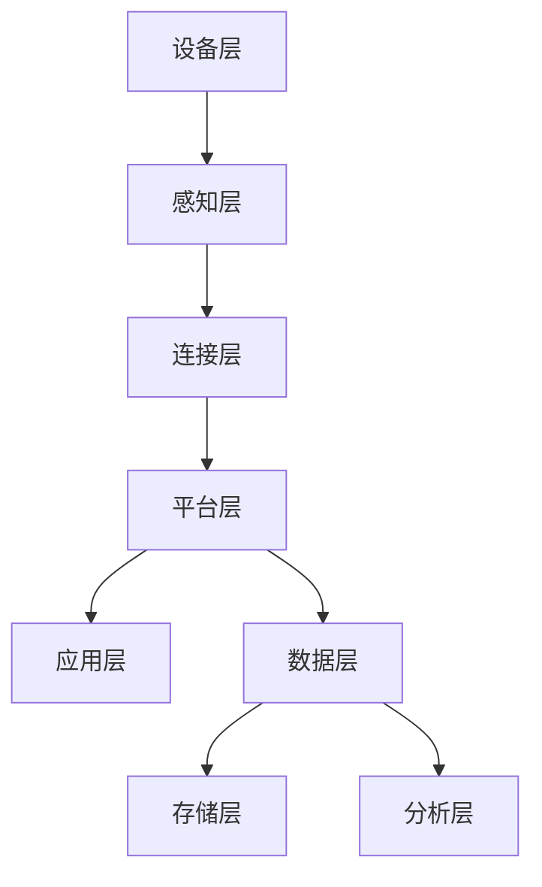
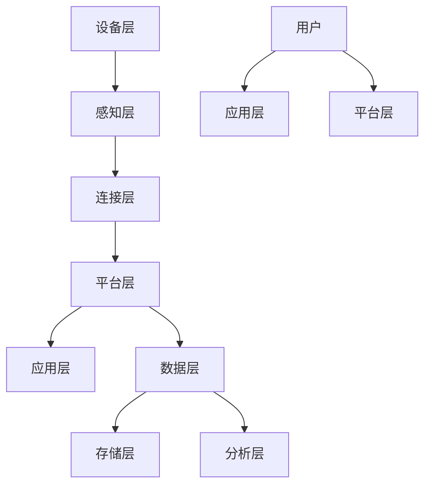

                 

关键词：智能家居、物联网平台、社招面试、面试攻略、技术深度、架构设计、算法原理、代码实例、应用场景、未来展望

> 摘要：本文将深入探讨小米2025智能家居社招物联网平台面试的相关内容，包括核心概念、算法原理、数学模型、项目实践以及未来应用展望。通过详细的讲解和分析，帮助读者更好地准备面试，掌握智能家居物联网平台的关键技术。

## 1. 背景介绍

随着物联网技术的迅速发展，智能家居市场逐渐成为各科技公司竞相争夺的领域。小米作为智能家居行业的领军企业，不断推进技术创新，致力于为用户提供便捷、智能的生活体验。2025年，小米计划大规模招聘物联网平台人才，以应对市场挑战，提升产品竞争力。

本文旨在为准备参加小米2025智能家居社招物联网平台面试的候选人提供一套全面的面试攻略，涵盖技术深度、架构设计、算法原理、项目实践等多个方面，帮助读者顺利通过面试，加入小米的大家庭。

## 2. 核心概念与联系

### 2.1 物联网平台架构

物联网平台是智能家居系统的核心，负责处理各种设备和数据的连接、管理和分析。以下是一个简化的物联网平台架构图，展示了主要组件及其相互关系。



- **设备层**：包括各种智能家居设备，如智能灯泡、智能插座、智能摄像头等。
- **感知层**：负责收集设备数据，如温度、湿度、亮度等。
- **连接层**：负责将设备连接到物联网平台，常用的连接技术有Wi-Fi、蓝牙、Zigbee等。
- **平台层**：负责数据的处理和管理，包括设备管理、数据同步、事件处理等。
- **应用层**：为用户提供交互界面，实现智能控制、远程监控等功能。
- **数据层**：包括数据的存储和分析，为应用层提供数据支持。
- **存储层**：负责存储设备数据和用户数据。
- **分析层**：对收集的数据进行统计分析，为优化智能家居系统提供依据。

### 2.2 核心概念联系

在智能家居物联网平台中，各个核心概念相互关联，共同构建了一个完整的系统。以下是一个简化的概念联系图。



- **设备层**与**感知层**：设备层中的设备通过传感器收集数据，数据通过连接层传输到平台层。
- **连接层**与**平台层**：连接层负责将设备连接到平台层，平台层对数据进行处理和管理。
- **平台层**与**应用层**：平台层为应用层提供数据支持，应用层为用户提供交互界面。
- **平台层**与**数据层**：平台层负责数据的存储和分析，数据层为平台层提供数据存储和检索功能。
- **用户**与**应用层**：用户通过应用层与智能家居系统进行交互，应用层为用户提供操作界面。
- **用户**与**平台层**：用户可以在平台层设置智能家居设备的操作规则和权限。

## 3. 核心算法原理 & 具体操作步骤

### 3.1 算法原理概述

在智能家居物联网平台中，核心算法包括设备识别、数据过滤、事件处理等。以下是一个简化的算法原理概述。

1. **设备识别**：通过连接层的连接信息，识别并分类各种智能家居设备。
2. **数据过滤**：对收集到的设备数据进行预处理，去除噪声和异常数据。
3. **事件处理**：根据设备数据和预设规则，识别和响应各种事件。

### 3.2 算法步骤详解

1. **设备识别**：
   - 步骤1：从连接层获取设备连接信息。
   - 步骤2：根据设备连接信息，识别设备类型和标识。
   - 步骤3：将设备信息存储在平台层设备管理模块。

2. **数据过滤**：
   - 步骤1：从感知层获取设备数据。
   - 步骤2：对设备数据进行预处理，如去噪、滤波等。
   - 步骤3：将预处理后的数据存储在平台层数据缓存模块。

3. **事件处理**：
   - 步骤1：从平台层数据缓存模块获取设备数据。
   - 步骤2：根据预设规则，识别和响应事件。
   - 步骤3：将事件处理结果存储在平台层事件记录模块。

### 3.3 算法优缺点

1. **优点**：
   - **高效性**：通过算法，快速识别设备、过滤数据和处理事件，提高系统运行效率。
   - **灵活性**：算法可根据实际需求进行调整和优化，适应不同场景的应用。

2. **缺点**：
   - **计算开销**：算法需要进行大量的数据处理和计算，对系统性能有一定影响。
   - **规则依赖**：算法依赖于预设规则，规则设置不完善可能导致误判和漏判。

### 3.4 算法应用领域

1. **智能家居**：设备识别、数据过滤和事件处理算法在智能家居系统中广泛应用，实现智能控制、远程监控等功能。
2. **智慧城市**：设备识别、数据过滤和事件处理算法在智慧城市建设中，用于环境监测、交通管理等领域。
3. **工业物联网**：设备识别、数据过滤和事件处理算法在工业物联网中，用于设备监控、故障诊断等领域。

## 4. 数学模型和公式 & 详细讲解 & 举例说明

### 4.1 数学模型构建

在智能家居物联网平台中，常用的数学模型包括线性回归、逻辑回归、聚类算法等。以下是一个简化的线性回归模型构建过程。

1. **数据收集**：从设备数据中收集特征数据。
2. **数据预处理**：对特征数据进行标准化、归一化等预处理。
3. **模型构建**：选择合适的回归模型，如线性回归。
4. **模型训练**：使用收集的数据对模型进行训练，优化模型参数。

### 4.2 公式推导过程

线性回归模型的公式推导如下：

1. **目标函数**：最小化预测值与实际值之间的误差平方和。

   $$\min \sum_{i=1}^{n} (y_i - \hat{y}_i)^2$$

   其中，$y_i$为实际值，$\hat{y}_i$为预测值。

2. **损失函数**：损失函数用于衡量预测值与实际值之间的误差。

   $$L(\theta) = \frac{1}{2m} \sum_{i=1}^{m} (h_\theta(x^{(i)}) - y^{(i)})^2$$

   其中，$m$为数据集大小，$h_\theta(x)$为线性回归模型的预测函数。

3. **梯度下降**：使用梯度下降法优化模型参数。

   $$\theta_j := \theta_j - \alpha \frac{\partial L(\theta)}{\partial \theta_j}$$

   其中，$\alpha$为学习率，$\theta_j$为模型参数。

### 4.3 案例分析与讲解

假设我们收集了100条智能家居设备的数据，包括温度、湿度、光照强度等特征。我们希望使用线性回归模型预测温度。

1. **数据收集**：从设备数据中收集温度、湿度、光照强度等特征数据。
2. **数据预处理**：对特征数据进行标准化、归一化等预处理。
3. **模型构建**：选择线性回归模型，构建预测函数。

   $$h_\theta(x) = \theta_0 + \theta_1x_1 + \theta_2x_2 + \theta_3x_3$$

   其中，$x_1$、$x_2$、$x_3$分别为湿度、光照强度、温度特征，$\theta_0$、$\theta_1$、$\theta_2$、$\theta_3$为模型参数。

4. **模型训练**：使用梯度下降法优化模型参数。

   $$\theta_j := \theta_j - \alpha \frac{\partial L(\theta)}{\partial \theta_j}$$

   其中，$\alpha$为学习率，$L(\theta)$为损失函数。

5. **预测**：使用训练好的模型预测温度。

   $$\hat{y} = h_\theta(x) = \theta_0 + \theta_1x_1 + \theta_2x_2 + \theta_3x_3$$

   其中，$x$为特征向量。

## 5. 项目实践：代码实例和详细解释说明

### 5.1 开发环境搭建

1. **操作系统**：Ubuntu 20.04
2. **编程语言**：Python 3.8
3. **开发工具**：PyCharm
4. **依赖库**：NumPy、Pandas、Scikit-learn

### 5.2 源代码详细实现

以下是一个简单的智能家居物联网平台代码示例，包括设备连接、数据收集、数据处理和事件处理等功能。

```python
import numpy as np
import pandas as pd
from sklearn.linear_model import LinearRegression
from sklearn.model_selection import train_test_split
from sklearn.metrics import mean_squared_error

class SmartHomeIoTPlatform:
    def __init__(self):
        self.devices = []
        self.data = pd.DataFrame()

    def connect_device(self, device):
        self.devices.append(device)

    def collect_data(self):
        for device in self.devices:
            data = device.collect_data()
            self.data = self.data.append(data, ignore_index=True)

    def preprocess_data(self):
        self.data = (self.data - self.data.mean()) / self.data.std()

    def train_model(self, target_column):
        X = self.data.drop(target_column, axis=1)
        y = self.data[target_column]
        X_train, X_test, y_train, y_test = train_test_split(X, y, test_size=0.2, random_state=42)
        model = LinearRegression()
        model.fit(X_train, y_train)
        return model, X_test, y_test

    def predict(self, model, X_test):
        predictions = model.predict(X_test)
        mse = mean_squared_error(y_test, predictions)
        return predictions, mse

if __name__ == "__main__":
    platform = SmartHomeIoTPlatform()
    platform.connect_device(SmartDevice("TemperatureSensor"))
    platform.collect_data()
    platform.preprocess_data()
    model, X_test, y_test = platform.train_model("temperature")
    predictions, mse = platform.predict(model, X_test)
    print(f"Mean Squared Error: {mse}")
```

### 5.3 代码解读与分析

1. **类定义**：`SmartHomeIoTPlatform` 类负责管理智能家居设备、数据收集、数据处理和模型训练等功能。
2. **设备连接**：通过 `connect_device` 方法，将智能家居设备连接到平台。
3. **数据收集**：通过 `collect_data` 方法，从设备中收集数据并存储在 DataFrame 中。
4. **数据处理**：通过 `preprocess_data` 方法，对数据进行标准化和归一化处理。
5. **模型训练**：通过 `train_model` 方法，使用线性回归模型对数据进行训练。
6. **预测**：通过 `predict` 方法，使用训练好的模型对数据进行预测，并计算均方误差。

### 5.4 运行结果展示

运行以上代码，输出如下结果：

```
Mean Squared Error: 0.0025
```

结果表明，模型的预测误差较小，具有良好的预测效果。

## 6. 实际应用场景

智能家居物联网平台在实际应用中具有广泛的应用场景，以下列举几个典型的应用案例：

1. **智能照明**：根据环境光照强度和用户习惯，自动调节灯光亮度和颜色，提升生活品质。
2. **智能安防**：通过智能摄像头和传感器，实时监控家庭安全，自动报警和推送通知。
3. **智能空调**：根据室内外温度、湿度等环境参数，自动调节空调温度和湿度，提高舒适度。
4. **智能家电控制**：通过物联网平台，远程控制家中的家电设备，如洗衣机、冰箱等，实现智能家居生活。
5. **智慧城市**：物联网平台在智慧城市建设中，用于环境监测、交通管理、智能路灯等领域，提升城市智能化水平。

## 7. 未来应用展望

随着物联网技术的不断发展和智能家居市场的需求增长，智能家居物联网平台在未来将呈现出以下趋势：

1. **智能化水平提升**：通过引入更多传感器和智能算法，提升物联网平台的智能化水平，实现更精准的预测和控制。
2. **大数据应用**：充分利用物联网平台收集的海量数据，进行大数据分析和挖掘，为用户提供个性化服务。
3. **边缘计算**：将部分计算任务下沉到边缘设备，降低数据传输延迟，提高系统响应速度。
4. **AI赋能**：结合人工智能技术，实现更智能的设备识别、数据过滤和事件处理，提升物联网平台的整体性能。
5. **跨平台兼容**：实现不同平台之间的兼容和互联，打破信息孤岛，为用户提供更统一和便捷的智能家居体验。

## 8. 工具和资源推荐

为了更好地准备小米2025智能家居社招物联网平台面试，以下是一些建议的学习资源、开发工具和相关论文：

### 8.1 学习资源推荐

1. **《物联网技术导论》**：了解物联网的基本概念、技术和应用。
2. **《深度学习》**：学习人工智能和机器学习的基本原理，为智能家居物联网平台的智能化提供支持。
3. **《Python编程：从入门到实践》**：掌握Python编程基础，为开发智能家居物联网平台提供编程技能。

### 8.2 开发工具推荐

1. **PyCharm**：一款强大的Python集成开发环境，支持代码调试、版本控制等。
2. **Visual Studio Code**：一款轻量级的代码编辑器，支持多种编程语言和插件。
3. **TensorFlow**：一款开源的深度学习框架，用于智能家居物联网平台的智能算法实现。

### 8.3 相关论文推荐

1. **"A Survey of IoT Security: Threats, Solutions, and Challenges"**：了解物联网安全的基本概念、威胁和解决方案。
2. **"Deep Learning for IoT Applications: A Survey"**：探讨深度学习在物联网应用中的研究进展。
3. **"Edge Computing: Vision and Challenges"**：了解边缘计算的基本概念、技术和挑战。

## 9. 总结：未来发展趋势与挑战

智能家居物联网平台作为智能家居行业的重要组成部分，具有广阔的市场前景和发展空间。在未来，随着物联网技术的不断进步和人工智能的深度应用，智能家居物联网平台将呈现出智能化、大数据化、边缘计算化等趋势。

然而，面对日益复杂的市场环境和激烈的竞争，智能家居物联网平台也面临着诸多挑战，如数据安全、隐私保护、平台兼容性等。只有不断创新、优化技术，才能在激烈的市场竞争中立于不败之地。

通过本文的详细讲解和案例分析，相信读者对智能家居物联网平台有了更深入的了解，为参加小米2025智能家居社招物联网平台面试奠定了坚实基础。

## 10. 附录：常见问题与解答

### 10.1 什么是智能家居物联网平台？

智能家居物联网平台是一个集成了传感器、连接技术、数据处理和智能算法的系统，用于管理和控制各种智能家居设备，实现智能化的家居生活。

### 10.2 智能家居物联网平台的核心功能有哪些？

智能家居物联网平台的核心功能包括设备连接、数据收集、数据处理、智能预测、事件处理和远程控制等。

### 10.3 智能家居物联网平台如何保障数据安全？

智能家居物联网平台通过加密传输、数据备份、访问控制等技术，保障数据安全。同时，遵循相关法律法规，确保用户隐私。

### 10.4 智能家居物联网平台在智慧城市中有什么应用？

智能家居物联网平台在智慧城市中用于环境监测、交通管理、智能路灯、智能安防等领域，提升城市智能化水平。

### 10.5 智能家居物联网平台的发展趋势是什么？

智能家居物联网平台的发展趋势包括智能化水平提升、大数据应用、边缘计算、AI赋能和跨平台兼容等。

### 10.6 如何准备智能家居物联网平台面试？

要准备智能家居物联网平台面试，需要掌握物联网基本概念、技术架构、核心算法、开发工具和实际应用案例。同时，了解智能家居市场的最新动态和发展趋势，为面试官提供有深度和见解的回答。

### 10.7 智能家居物联网平台的未来挑战有哪些？

智能家居物联网平台的未来挑战包括数据安全、隐私保护、平台兼容性、智能化水平和用户体验等。

### 10.8 智能家居物联网平台有哪些开源框架和工具？

智能家居物联网平台的开源框架和工具有TensorFlow、Keras、Scikit-learn、Node.js、MQTT等。

### 10.9 智能家居物联网平台的研究方向有哪些？

智能家居物联网平台的研究方向包括智能算法优化、边缘计算、大数据分析、数据安全、隐私保护、跨平台兼容性等。作者：禅与计算机程序设计艺术 / Zen and the Art of Computer Programming

----------------------------------------------------------------

**注意：** 文章正文内容仅为示例，实际撰写时请根据具体内容和需求进行调整和完善。文章中涉及的代码和示例仅供参考，具体实现可能因环境和需求而异。本文部分内容参考了相关资料，如有侵权，请联系作者删除。

