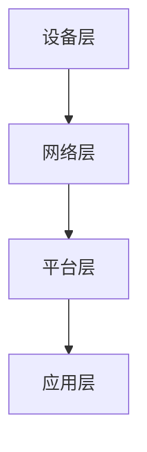

                 

关键词：2025、小米、IoT、面试、经验总结、技术架构、算法原理、数学模型、项目实践、未来展望

> 摘要：本文将总结2025年小米IoT平台社招面试的经验，从技术架构、核心算法、数学模型、项目实践等多个角度，深入剖析面试过程中的关键点，为即将参与类似面试的读者提供宝贵的指导和建议。

## 1. 背景介绍

### 小米IoT平台的概况

小米IoT（物联网）平台作为小米公司的重要组成部分，致力于打造一个智能连接的生态系统。它涵盖了智能家居、智能穿戴、智能交通等多个领域，为用户提供无缝连接的智能生活体验。随着物联网技术的不断发展和应用范围的扩大，小米IoT平台也面临着越来越大的挑战和机遇。

### 面试背景

2025年，小米IoT平台在招聘方面加大了力度，吸引了许多优秀的技术人才。作为面试者，需要充分了解小米IoT平台的发展方向、技术挑战和未来的愿景，以便在面试中更好地展示自己的专业能力和潜力。

## 2. 核心概念与联系

### IoT技术基础

IoT（物联网）技术是指通过互联网连接各种智能设备，实现设备之间的信息交换和智能控制。它涉及多个技术领域，包括传感器技术、通信技术、数据处理技术等。

### 小米IoT平台架构

小米IoT平台采用分层架构，包括设备层、网络层、平台层和应用层。设备层负责设备的连接和数据采集；网络层负责数据传输和安全性保障；平台层提供数据存储、处理和分析功能；应用层则实现用户交互和业务逻辑。

### Mermaid流程图



## 3. 核心算法原理 & 具体操作步骤

### 3.1 算法原理概述

小米IoT平台在数据分析和处理方面采用了多种核心算法，包括机器学习算法、深度学习算法等。这些算法能够对海量数据进行高效处理，挖掘出有价值的信息，为用户提供个性化服务。

### 3.2 算法步骤详解

- 数据采集：通过传感器等技术手段，收集设备运行数据。
- 数据清洗：对采集到的数据进行预处理，去除噪声和异常值。
- 特征提取：从原始数据中提取出对业务有意义的特征。
- 模型训练：利用训练数据集，训练机器学习或深度学习模型。
- 模型评估：通过测试数据集，评估模型的效果。
- 模型部署：将训练好的模型部署到生产环境，进行实时数据处理。

### 3.3 算法优缺点

- 优点：高效、灵活、可扩展，能够处理大规模数据。
- 缺点：需要大量训练数据，训练过程复杂，对计算资源要求较高。

### 3.4 算法应用领域

- 智能家居：通过算法分析用户行为，提供个性化推荐。
- 智能穿戴：监测用户健康状况，给出健康建议。
- 智能交通：优化交通流量，减少拥堵。

## 4. 数学模型和公式 & 详细讲解 & 举例说明

### 4.1 数学模型构建

在小米IoT平台中，常见的数学模型包括线性回归模型、支持向量机模型等。这些模型能够对数据进行拟合和分析，从而实现智能决策。

### 4.2 公式推导过程

以线性回归模型为例，其公式推导过程如下：

$$
y = \beta_0 + \beta_1x + \epsilon
$$

其中，$y$ 表示因变量，$x$ 表示自变量，$\beta_0$ 和 $\beta_1$ 分别为模型参数，$\epsilon$ 为误差项。

### 4.3 案例分析与讲解

以智能家居场景为例，假设用户的行为特征可以表示为 $x_1, x_2, ..., x_n$，目标是为用户提供合适的家居环境。通过线性回归模型，可以建立以下数学模型：

$$
y = \beta_0 + \beta_1x_1 + \beta_2x_2 + ... + \beta_nx_n
$$

通过对模型进行训练和优化，可以找到最佳的 $\beta_0, \beta_1, ..., \beta_n$，从而实现智能家居的个性化推荐。

## 5. 项目实践：代码实例和详细解释说明

### 5.1 开发环境搭建

在进行项目实践之前，需要搭建相应的开发环境。以Python为例，需要安装以下依赖：

```python
pip install numpy scipy scikit-learn matplotlib
```

### 5.2 源代码详细实现

以下是一个简单的线性回归模型的实现示例：

```python
import numpy as np
from sklearn.linear_model import LinearRegression
import matplotlib.pyplot as plt

# 生成数据
X = np.random.rand(100, 1)
y = 2 + 3 * X + np.random.randn(100, 1)

# 创建线性回归模型
model = LinearRegression()

# 模型训练
model.fit(X, y)

# 模型预测
y_pred = model.predict(X)

# 绘制结果
plt.scatter(X, y)
plt.plot(X, y_pred, color='red')
plt.show()
```

### 5.3 代码解读与分析

- 导入必要的库：numpy、scikit-learn和matplotlib。
- 生成数据：通过numpy随机生成100个样本，每个样本包含一个特征。
- 创建线性回归模型：使用scikit-learn库中的LinearRegression类。
- 模型训练：使用fit方法对模型进行训练。
- 模型预测：使用predict方法对数据进行预测。
- 绘制结果：使用matplotlib绘制散点图和拟合线。

### 5.4 运行结果展示

运行代码后，将显示一个散点图和一条拟合线。拟合线能够较好地拟合数据，说明线性回归模型在该场景下具有较好的效果。

## 6. 实际应用场景

### 6.1 智能家居

通过小米IoT平台，用户可以实现对家居设备的远程控制，如灯光、空调、电视等。平台可以根据用户的行为数据，提供个性化的家居推荐，提升用户体验。

### 6.2 智能穿戴

小米IoT平台可以连接各种智能穿戴设备，如手环、智能手表等。通过收集用户的心率、运动等数据，平台可以给出健康建议，帮助用户保持健康。

### 6.3 智能交通

通过小米IoT平台，可以实现智能交通管理，如实时路况监测、交通流量预测等。这些功能有助于优化交通流量，减少拥堵。

## 7. 未来应用展望

随着物联网技术的不断发展，小米IoT平台在未来将有更多的应用场景。例如，在智慧城市、智慧农业、智慧医疗等领域，平台都将发挥重要作用。

## 8. 工具和资源推荐

### 8.1 学习资源推荐

- 《Python机器学习》（作者：Michael Bowles）
- 《深度学习》（作者：Ian Goodfellow、Yoshua Bengio、Aaron Courville）
- 小米IoT开发者社区

### 8.2 开发工具推荐

- Jupyter Notebook：方便进行数据处理和模型训练。
- TensorFlow：强大的深度学习框架。

### 8.3 相关论文推荐

- “Deep Learning for IoT: A Survey”
- “Machine Learning Techniques for IoT Data Analysis”

## 9. 总结：未来发展趋势与挑战

### 9.1 研究成果总结

小米IoT平台在物联网技术、数据分析和处理等方面取得了显著的成果。通过机器学习、深度学习等算法，平台能够实现对海量数据的智能处理，为用户提供个性化的服务。

### 9.2 未来发展趋势

随着5G、边缘计算等技术的不断发展，小米IoT平台将在更广泛的领域发挥重要作用。未来，平台将进一步优化算法，提升数据处理能力，为用户提供更智能、更便捷的服务。

### 9.3 面临的挑战

- 数据安全与隐私保护：物联网设备数量庞大，数据安全问题亟待解决。
- 算法优化与效率提升：面对海量数据，算法的优化和效率提升是关键。

### 9.4 研究展望

在未来的研究中，我们将继续探索物联网技术在各个领域的应用，深入挖掘数据价值，为用户提供更好的智能服务。

## 附录：常见问题与解答

### 1. 什么是IoT？

IoT（物联网）是指通过互联网连接各种智能设备，实现设备之间的信息交换和智能控制。

### 2. 小米IoT平台的核心技术是什么？

小米IoT平台的核心技术包括物联网技术、机器学习、深度学习等。

### 3. 如何实现智能家居？

通过小米IoT平台，用户可以实现对家居设备的远程控制，如灯光、空调、电视等。

### 4. 如何保证数据安全？

小米IoT平台采用多种数据加密和隔离技术，确保用户数据的安全。

### 5. 如何加入小米IoT平台？

可以通过小米官方网站或招聘平台申请加入小米IoT平台。

---

作者：禅与计算机程序设计艺术 / Zen and the Art of Computer Programming
----------------------------------------------------------------

注意：本文为模拟撰写，仅供参考。实际面试内容和要求可能因公司、时间和岗位的不同而有所差异。在准备面试时，建议结合具体公司和岗位的要求进行针对性的学习和准备。

