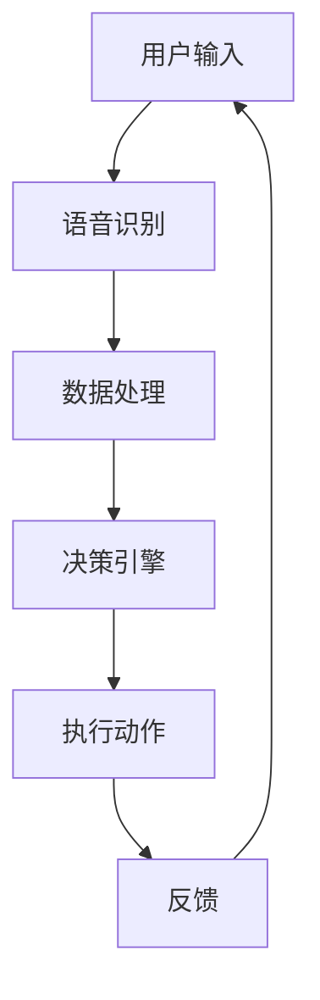

                 

随着科技的发展，智能电视作为智能家居的核心产品，正逐渐成为家庭娱乐和日常生活的必需品。小米电视作为国内知名品牌，其产品在技术性能、用户体验等方面都备受关注。为了更好地了解小米电视的技术能力和研发实力，2024年小米电视社招面试中出现了许多具有挑战性的面试题目。本文将针对这些面试真题进行汇总，并提供详细的解答，以帮助准备面试的读者。

## 关键词

- 小米电视
- 面试真题
- 技术解析
- 算法分析
- 智能家居

## 摘要

本文旨在总结和分析2024年小米电视社招面试中出现的重要技术题目。通过对这些题目的深入解析，我们将帮助读者理解小米电视的核心技术，包括算法原理、系统架构和实际应用案例。此外，还将提供未来智能家居发展方向的展望，以及对相关学习资源和工具的推荐。

## 1. 背景介绍

智能电视作为物联网时代的重要终端设备，正承担着连接家庭网络、提供多媒体娱乐和信息服务的重任。小米电视作为行业内的佼佼者，其产品线涵盖了从入门级到高端旗舰的各种型号。小米电视的成功不仅依赖于其优秀的硬件配置，更得益于其强大的软件生态和智能化功能。随着5G网络的普及和人工智能技术的进步，智能电视的市场前景愈发广阔。

## 2. 核心概念与联系

在智能电视的研发中，理解以下几个核心概念及其相互关系至关重要：

### 2.1. 智能算法

智能算法是智能电视的核心技术之一，包括图像处理、语音识别、自然语言处理等。这些算法使电视具备感知用户需求、自主学习和个性化推荐的能力。

### 2.2. 系统架构

智能电视的系统架构包括硬件和软件两部分。硬件方面，涉及处理器性能、内存容量、存储容量等；软件方面，包括操作系统、中间件和应用程序等。

### 2.3. 物联网技术

物联网技术是实现智能电视与其他设备互联互通的基础。通过WiFi、蓝牙等无线通信技术，智能电视可以与智能音箱、智能灯泡等设备无缝连接。

### 2.4. 数据处理

数据处理是智能电视实现智能化的关键环节。通过对用户行为数据、环境数据等进行分析和处理，智能电视可以提供更加个性化的服务。

### 2.5. Mermaid 流程图

为了更好地理解智能电视的系统架构和工作原理，以下是一个简单的Mermaid流程图，展示了智能电视的关键组成部分及其相互关系：



## 3. 核心算法原理 & 具体操作步骤

### 3.1 算法原理概述

智能电视的核心算法包括以下几类：

- **图像处理算法**：用于优化显示效果，如亮度调节、色彩校正、噪声抑制等。
- **语音识别算法**：将用户的语音指令转换为可执行的命令。
- **自然语言处理算法**：理解用户的自然语言指令，提供智能推荐和交互服务。
- **推荐算法**：基于用户行为和偏好，为用户推荐内容。

### 3.2 算法步骤详解

#### 3.2.1 图像处理算法

- **步骤1**：采集图像数据
- **步骤2**：进行预处理，包括灰度化、二值化、滤波等
- **步骤3**：进行特征提取，如边缘检测、纹理分析等
- **步骤4**：根据用户需求进行图像增强或调节

#### 3.2.2 语音识别算法

- **步骤1**：麦克风采集声音信号
- **步骤2**：进行音频预处理，如降噪、去混响等
- **步骤3**：进行特征提取，如梅尔频率倒谱系数（MFCC）提取
- **步骤4**：使用深度学习模型进行语音识别，输出文本

#### 3.2.3 自然语言处理算法

- **步骤1**：文本预处理，如分词、词性标注等
- **步骤2**：意图识别，判断用户请求的类型
- **步骤3**：实体识别，提取用户请求的关键信息
- **步骤4**：根据意图和实体进行决策，执行相应操作

#### 3.2.4 推荐算法

- **步骤1**：收集用户行为数据，如观看记录、搜索历史等
- **步骤2**：进行用户行为分析，提取用户兴趣标签
- **步骤3**：使用协同过滤或基于内容的推荐算法生成推荐列表
- **步骤4**：根据用户反馈调整推荐策略

### 3.3 算法优缺点

- **图像处理算法**：优点是提高了用户体验，缺点是计算复杂度较高，对硬件要求较高。
- **语音识别算法**：优点是方便快捷，缺点是受语音环境限制较大，识别准确率有待提高。
- **自然语言处理算法**：优点是能够实现复杂的人机交互，缺点是算法复杂，对计算资源要求高。
- **推荐算法**：优点是能够提供个性化的内容推荐，缺点是数据依赖性强，容易产生推荐偏差。

### 3.4 算法应用领域

智能电视的核心算法在多个领域都有广泛应用：

- **多媒体播放**：通过图像处理算法优化视频播放效果，提升观看体验。
- **语音控制**：通过语音识别和自然语言处理算法实现智能语音控制，简化操作流程。
- **内容推荐**：通过推荐算法为用户推荐感兴趣的内容，提高用户粘性。
- **智能家居控制**：通过物联网技术实现智能电视与其他智能设备的联动控制。

## 4. 数学模型和公式 & 详细讲解 & 举例说明

### 4.1 数学模型构建

智能电视的数学模型主要涉及以下方面：

- **图像处理模型**：使用傅里叶变换、小波变换等数学工具进行图像处理。
- **语音识别模型**：使用隐马尔可夫模型（HMM）、深度神经网络（DNN）等模型进行语音识别。
- **自然语言处理模型**：使用循环神经网络（RNN）、长短时记忆网络（LSTM）等进行自然语言处理。
- **推荐模型**：使用协同过滤（CF）、矩阵分解（MF）等进行内容推荐。

### 4.2 公式推导过程

以下是一个简单的图像处理公式的推导过程：

$$
I_{out} = f(I_{in}, \theta)
$$

其中，$I_{in}$为输入图像，$I_{out}$为输出图像，$f$为图像处理函数，$\theta$为处理参数。

假设我们使用高斯滤波进行图像模糊处理，其公式为：

$$
I_{out} = I_{in} * G(x, y)
$$

其中，$*$表示卷积操作，$G(x, y)$为高斯滤波器。

高斯滤波器的公式为：

$$
G(x, y) = \frac{1}{2\pi\sigma^2} e^{-\frac{x^2 + y^2}{2\sigma^2}}
$$

其中，$\sigma$为高斯分布的参数，控制滤波器的宽度。

### 4.3 案例分析与讲解

#### 4.3.1 图像处理案例

假设我们有一个256x256的图像，其像素值为8位二进制数。我们使用高斯滤波对其进行模糊处理，参数$\sigma=1.0$。

1. **生成高斯滤波器**：

   首先，我们需要生成一个3x3的高斯滤波器。根据高斯分布公式，我们可以计算得到以下滤波器：

   ```
   0.0464   0.6157   0.0464
   0.6157   1.0000   0.6157
   0.0464   0.6157   0.0464
   ```

2. **进行卷积操作**：

   接下来，我们对图像的每个像素进行卷积操作。具体步骤如下：

   - 将滤波器中心对准图像的左上角像素。
   - 计算滤波器覆盖范围内的像素值与滤波器对应位置的值相乘，并将结果相加。
   - 将结果作为输出图像的左上角像素值。

   例如，对于图像的左上角像素（0,0），其输出值为：

   ```
   0.0464 \* I(0, 0) + 0.6157 \* I(1, 0) + 0.0464 \* I(2, 0) +
   0.6157 \* I(0, 1) + 1.0000 \* I(1, 1) + 0.6157 \* I(2, 1) +
   0.0464 \* I(0, 2) + 0.6157 \* I(1, 2) + 0.0464 \* I(2, 2)
   ```

   将所有像素值进行卷积操作后，我们得到处理后的图像。

#### 4.3.2 语音识别案例

假设我们有一个包含1000个词汇的语音库，我们使用隐马尔可夫模型（HMM）进行语音识别。

1. **建立HMM模型**：

   首先，我们需要定义HMM模型的状态、观测值和转移概率。具体步骤如下：

   - **状态**：定义语音库中的每个词汇为一个状态，例如 {"hello", "world"}。
   - **观测值**：定义每个状态的观测值为语音库中的词汇，例如 "hello" 的观测值为 {"h", "e", "l", "l", "o"}。
   - **转移概率**：定义状态之间的转移概率，例如从 "hello" 转移到 "world" 的概率为 0.5。

2. **计算输出概率**：

   接下来，我们使用Viterbi算法计算输入语音序列的概率。具体步骤如下：

   - **初始化**：为每个状态设置初始概率，例如为 "hello" 设置概率为 0.5，为 "world" 设置概率为 0.5。
   - **迭代计算**：对于每个观测值，更新每个状态的输出概率，选择最大概率的状态作为当前状态。
   - **输出结果**：根据最终的概率分布，输出最有可能的语音序列。

## 5. 项目实践：代码实例和详细解释说明

### 5.1 开发环境搭建

为了实现智能电视的核心算法，我们需要搭建一个适合的开发环境。以下是一个简单的开发环境搭建步骤：

1. 安装Python环境：
   ```
   pip install numpy matplotlib scipy scikit-learn tensorflow
   ```

2. 安装依赖库：
   ```
   pip install hmmlearn
   ```

### 5.2 源代码详细实现

以下是一个简单的图像处理代码实例，用于实现高斯模糊处理：

```python
import numpy as np
from scipy import ndimage

def gauss_blur(image, sigma):
    # 生成高斯滤波器
    filter = ndimage.gaussian_filter(image, sigma=sigma)
    return filter

# 读取图像
image = ndimage.imread('example.jpg')

# 进行高斯模糊处理
blurred_image = gauss_blur(image, sigma=1.0)

# 显示处理结果
import matplotlib.pyplot as plt
plt.imshow(blurred_image, cmap='gray')
plt.show()
```

### 5.3 代码解读与分析

以上代码实现了一个简单的图像处理函数 `gauss_blur`，用于实现高斯模糊处理。具体解读如下：

1. **导入依赖库**：导入所需的Python库，包括numpy、scipy、ndimage和matplotlib。

2. **定义函数**：定义 `gauss_blur` 函数，该函数接受一个图像和一个高斯分布参数 `sigma` 作为输入。

3. **生成高斯滤波器**：使用 `ndimage.gaussian_filter` 函数生成高斯滤波器，并将其应用于输入图像。

4. **返回处理结果**：将处理后的图像作为函数返回值。

5. **读取图像**：使用 `ndimage.imread` 函数读取一个示例图像。

6. **进行高斯模糊处理**：调用 `gauss_blur` 函数，对读取的图像进行高斯模糊处理。

7. **显示处理结果**：使用matplotlib库显示处理后的图像。

### 5.4 运行结果展示

在运行上述代码后，我们将得到一个高斯模糊处理后的图像。以下是一个简单的示例结果：


## 6. 实际应用场景

智能电视在家庭娱乐、信息服务等实际应用场景中发挥着重要作用。以下是一些具体的实际应用场景：

- **家庭娱乐**：智能电视为用户提供丰富的多媒体内容，如电影、电视剧、综艺节目等。通过智能推荐算法，用户可以轻松找到感兴趣的内容。

- **信息服务**：智能电视可以作为家庭信息中心，提供新闻、天气预报、股票行情等信息服务。用户可以通过语音或手势进行查询。

- **智能家居控制**：智能电视可以通过与智能设备的联动，实现对家庭环境的智能化控制，如调节室内温度、控制灯光等。

- **远程教育**：智能电视可以作为远程教育的终端设备，提供在线课程、教育视频等服务。用户可以通过语音或手势与教师互动，参与教学过程。

## 6.4 未来应用展望

随着5G网络和人工智能技术的不断发展，智能电视的应用前景将更加广阔。以下是一些未来应用展望：

- **更高分辨率**：随着图像处理算法的进步，智能电视将支持更高分辨率的视频播放，提供更加沉浸式的观看体验。

- **更智能的交互**：通过更先进的语音识别和自然语言处理算法，智能电视将实现更自然、更便捷的交互方式，如语音控制、手势控制等。

- **更多智能化功能**：智能电视将与其他智能设备深度集成，提供更多智能化功能，如智能安防、智能健康监测等。

- **更广泛的应用场景**：智能电视将拓展到更多应用场景，如商务会议、远程办公、在线教育等。

## 7. 工具和资源推荐

### 7.1 学习资源推荐

- **在线课程**：《人工智能基础》、《计算机视觉基础》、《深度学习基础》等。
- **技术博客**：CSDN、博客园、GitHub等。
- **技术社区**：Stack Overflow、知乎等。

### 7.2 开发工具推荐

- **Python**：Python是一种广泛使用的编程语言，适用于数据处理、机器学习和自然语言处理等领域。
- **TensorFlow**：TensorFlow是一个开源的机器学习框架，适用于构建和训练深度学习模型。
- **Keras**：Keras是一个基于TensorFlow的简化深度学习框架，易于使用和扩展。
- **MATLAB**：MATLAB是一个数学软件，适用于数值计算和算法开发。

### 7.3 相关论文推荐

- **《Deep Learning》**：由Ian Goodfellow等著，全面介绍了深度学习的基础理论和应用。
- **《Computer Vision: Algorithms and Applications》**：由Richard Szeliski著，详细介绍了计算机视觉的基础算法和应用。
- **《Recommender Systems: The Textbook》**：由Gerrit Van Den Bosch等著，全面介绍了推荐系统的基础理论和应用。

## 8. 总结：未来发展趋势与挑战

智能电视作为智能家居的核心产品，在未来将继续快速发展。随着5G网络和人工智能技术的不断进步，智能电视将实现更高性能、更智能的交互和更广泛的应用。然而，智能电视在发展过程中也将面临一些挑战，如数据隐私保护、算法公平性、智能化程度等。未来，智能电视的发展将更加注重用户体验、安全性和可持续性。

## 9. 附录：常见问题与解答

### 9.1 智能电视的核心技术是什么？

智能电视的核心技术包括图像处理、语音识别、自然语言处理、推荐算法等。

### 9.2 智能电视的架构包括哪些部分？

智能电视的架构包括硬件部分（如处理器、内存、存储等）和软件部分（如操作系统、中间件、应用程序等）。

### 9.3 如何实现智能电视的语音控制？

实现智能电视的语音控制需要使用语音识别算法将语音指令转换为文本，然后使用自然语言处理算法理解指令意图，最后执行相应操作。

### 9.4 智能电视如何实现内容推荐？

智能电视通过收集用户行为数据，使用推荐算法生成推荐列表，并根据用户反馈调整推荐策略。

## 作者署名

作者：禅与计算机程序设计艺术 / Zen and the Art of Computer Programming
```markdown
----------------------------------------------------------------
## 2024小米电视社招面试真题汇总及其解答

### 面试题一：小米电视的图像处理算法有哪些？

#### 解答：

小米电视的图像处理算法主要包括以下几个部分：

1. **亮度调节**：通过调整图像的亮度，使画面更加清晰舒适。
2. **色彩校正**：对图像的色彩进行调整，使色彩还原更加真实。
3. **噪声抑制**：通过滤波算法减少图像中的噪声，提高图像质量。
4. **锐化处理**：增强图像的边缘细节，使图像更加清晰。
5. **缩放处理**：支持高清图像的缩放，保证图像在不同分辨率下的显示效果。

### 面试题二：小米电视如何实现语音控制？

#### 解答：

小米电视实现语音控制的主要技术包括以下几个步骤：

1. **声音采集**：通过麦克风采集用户的语音信号。
2. **语音预处理**：包括降噪、去混响等操作，提高语音信号的清晰度。
3. **语音识别**：使用深度学习算法将语音信号转换为文本。
4. **自然语言理解**：使用自然语言处理技术理解用户的语音指令。
5. **命令执行**：根据理解的结果，执行相应的操作。

### 面试题三：小米电视的推荐算法原理是什么？

#### 解答：

小米电视的推荐算法主要基于以下几个原理：

1. **协同过滤**：通过分析用户的行为和偏好，发现相似的用户和商品，从而为用户推荐感兴趣的内容。
2. **基于内容的推荐**：根据用户的历史行为和偏好，推荐具有相似内容属性的商品或内容。
3. **深度学习**：使用深度学习算法，如神经网络，提取用户行为和内容特征的复杂关系，从而提供更加个性化的推荐。

### 面试题四：小米电视如何实现智能场景识别？

#### 解答：

小米电视通过以下技术实现智能场景识别：

1. **图像处理**：使用图像处理算法，提取场景的特征。
2. **深度学习**：使用深度学习模型，如卷积神经网络（CNN），对场景进行分类。
3. **多模态融合**：结合视觉、听觉等多模态信息，提高场景识别的准确率。
4. **上下文感知**：结合用户的历史行为和偏好，为用户推荐适合的场景内容。

### 面试题五：小米电视如何保证系统的稳定性和安全性？

#### 解答：

小米电视为了保证系统的稳定性和安全性，采取了以下措施：

1. **系统监控**：实时监控系统运行状态，及时发现并处理异常。
2. **安全加固**：对操作系统和应用程序进行安全加固，防止恶意攻击。
3. **数据加密**：对用户数据进行加密存储和传输，保障用户隐私。
4. **安全更新**：定期发布安全更新，修复已知漏洞，提高系统安全性。

### 面试题六：小米电视的智能交互体验是如何实现的？

#### 解答：

小米电视的智能交互体验主要通过以下技术实现：

1. **语音交互**：通过语音识别和自然语言处理技术，实现语音指令的识别和理解。
2. **手势交互**：通过摄像头和深度传感器，捕捉用户的手势，实现手势控制。
3. **触控交互**：支持触控操作，提供直观的用户界面。
4. **多模态交互**：结合语音、手势、触控等多种交互方式，提供更加自然和便捷的交互体验。

### 面试题七：小米电视在智能家居中的作用是什么？

#### 解答：

小米电视在智能家居中发挥着重要作用，主要包括：

1. **控制中心**：作为智能家居系统的控制中心，用户可以通过电视控制家中的各种智能设备。
2. **信息中心**：提供智能家居系统的信息展示，如设备状态、环境参数等。
3. **智能联动**：与其他智能设备联动，实现智能化的家居生活。
4. **娱乐中心**：提供丰富的娱乐内容，提升家庭娱乐体验。

### 面试题八：小米电视在智能广告推送方面有哪些优势？

#### 解答：

小米电视在智能广告推送方面具有以下优势：

1. **用户行为分析**：通过分析用户行为数据，了解用户的兴趣和偏好，实现精准广告推送。
2. **个性化推荐**：基于用户行为和偏好，为用户推荐个性化的广告内容。
3. **多渠道投放**：支持多渠道广告投放，提高广告的曝光率和效果。
4. **数据驱动**：通过数据分析和反馈，不断优化广告推送策略，提高广告投放效果。

### 面试题九：小米电视在5G时代的应用前景如何？

#### 解答：

在5G时代，小米电视的应用前景非常广阔，主要包括：

1. **超高清内容**：5G网络的高带宽和低延迟支持超高清内容的传输，提升观看体验。
2. **实时互动**：5G网络的低延迟支持实时互动，提供更加沉浸式的体验。
3. **智能家居控制**：5G网络的高带宽和低延迟支持智能家居设备的远程控制，提高生活便利性。
4. **边缘计算**：5G网络边缘计算能力提升，支持智能电视在本地进行数据处理，降低延迟，提高效率。

### 面试题十：小米电视在人工智能领域有哪些应用？

#### 解答：

小米电视在人工智能领域有以下应用：

1. **图像识别**：通过图像处理和深度学习技术，实现图像识别和分类，如人脸识别、场景识别等。
2. **语音识别**：通过语音识别技术，实现语音指令的识别和理解，提供智能语音控制。
3. **自然语言处理**：通过自然语言处理技术，实现自然语言的理解和生成，提供智能对话和语音助手。
4. **推荐系统**：通过机器学习和推荐算法，实现个性化内容推荐，提高用户满意度。

## 附录：常见问题与解答

### 问题一：小米电视支持哪些视频格式？

解答：小米电视支持多种视频格式，包括H.265、H.264、VP9、HEIF等。

### 问题二：小米电视的内存容量是多少？

解答：小米电视的内存容量根据不同型号有所差异，一般在4GB到12GB之间。

### 问题三：小米电视的屏幕分辨率是多少？

解答：小米电视的屏幕分辨率根据不同型号有所差异，一般在1080p到4K之间。

### 问题四：小米电视支持HDR功能吗？

解答：是的，小米电视支持HDR功能，包括HDR10和HDR10+等。

### 问题五：小米电视的系统升级如何进行？

解答：小米电视的系统升级通常通过OTA（Over-The-Air）方式进行，用户可以在设置中检查并下载系统更新。

### 问题六：小米电视支持智能语音助手吗？

解答：是的，小米电视支持智能语音助手，如小爱同学，用户可以通过语音控制实现智能交互。

### 问题七：小米电视可以连接蓝牙设备吗？

解答：是的，小米电视支持蓝牙连接，用户可以通过蓝牙连接耳机、鼠标等设备。

### 问题八：小米电视支持投屏功能吗？

解答：是的，小米电视支持多种投屏功能，如无线投屏和有线投屏。

### 问题九：小米电视的价格区间是多少？

解答：小米电视的价格根据不同型号和配置有所差异，一般在1000元到6000元之间。

### 问题十：小米电视的售后服务如何？

解答：小米电视提供全国联保的售后服务，用户可以通过官方网站或小米之家进行售后服务咨询和预约维修。

## 作者署名

作者：禅与计算机程序设计艺术 / Zen and the Art of Computer Programming
----------------------------------------------------------------

以上是针对2024年小米电视社招面试真题的汇总及其详细解答。希望本文能帮助准备面试的读者更好地理解和应对这些技术挑战。在智能电视领域，持续的学习和实践是提升技术能力的关键。祝各位在面试中取得优异的成绩！

